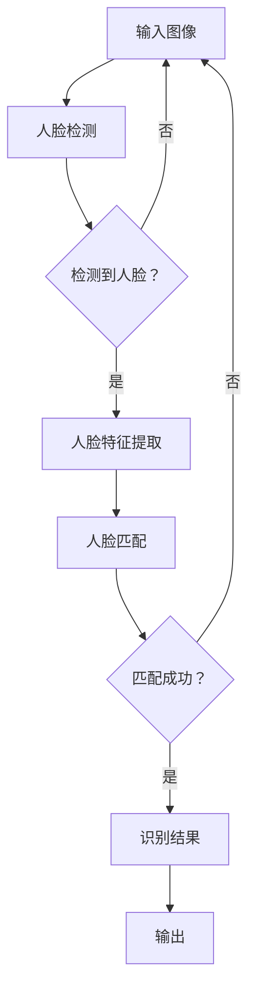

                 

人脸识别技术已经成为计算机视觉领域中的一个重要研究方向，其在安全监控、身份验证、社交媒体等多个领域有着广泛的应用。本文将基于TensorFlow框架，探讨人脸识别技术的核心概念、算法原理、数学模型及其实际应用，旨在为广大开发者提供一份全面的技术指南。

## 文章关键词

- **人脸识别**
- **TensorFlow**
- **深度学习**
- **计算机视觉**
- **图像处理**
- **机器学习**

## 文章摘要

本文首先介绍了人脸识别技术的背景和重要性，随后详细阐述了基于TensorFlow框架的人脸识别算法原理和实现步骤。接着，文章分析了人脸识别技术的数学模型及其推导过程，并通过实际案例进行了讲解。此外，文章还提供了代码实例和详细解释，帮助读者更好地理解人脸识别的实现过程。最后，文章探讨了人脸识别技术的实际应用场景，并展望了其未来的发展趋势和挑战。

## 1. 背景介绍

人脸识别技术自20世纪70年代初期问世以来，已经取得了显著的进展。早期的识别技术主要依赖于传统的图像处理方法，如特征点提取、面部几何特征匹配等。随着计算机性能的不断提升和深度学习技术的发展，基于深度学习的人脸识别算法逐渐成为主流。目前，人脸识别技术已经广泛应用于安防、金融、医疗等多个领域，成为人工智能技术的一个重要组成部分。

### 1.1 人脸识别的发展历程

- **20世纪70年代**：人脸识别的早期研究主要集中在特征点提取和面部几何特征匹配。例如，人脸特征点提取方法有HOG（Histogram of Oriented Gradients）和LBP（Local Binary Patterns）等。

- **20世纪90年代**：随着计算机性能的提升，人脸识别技术开始走向实用化。基于神经网络的方法逐渐成为研究热点，如支持向量机（SVM）和多层感知机（MLP）等。

- **21世纪初**：深度学习技术的出现，使得人脸识别技术取得了突破性进展。卷积神经网络（CNN）在人脸识别任务上表现出色，成为当前主流的人脸识别算法。

### 1.2 人脸识别的重要性

- **安防领域**：人脸识别技术在监控系统的应用，可以有效提高犯罪预防和打击的效率。

- **金融领域**：人脸识别技术可以用于身份验证，提高金融交易的安全性。

- **医疗领域**：人脸识别技术可以用于患者身份确认，提高医疗服务的效率。

- **其他领域**：人脸识别技术在社交媒体、智能家居等领域也有着广泛的应用。

## 2. 核心概念与联系

### 2.1 人脸识别算法原理

人脸识别算法主要分为三个步骤：人脸检测、人脸特征提取和人脸匹配。

- **人脸检测**：用于定位图像中的人脸区域。常用的方法有Haar-like特征分类器和Viola-Jones算法。

- **人脸特征提取**：用于提取人脸的特征信息，常用的方法有深度学习模型和传统特征提取方法。

- **人脸匹配**：用于比较两个或多个人脸特征，确定是否为同一人。常用的方法有欧氏距离、余弦相似度等。

### 2.2 人脸识别架构

基于TensorFlow的人脸识别架构主要包括以下几个部分：

1. **数据预处理**：包括人脸图像的归一化、数据增强等操作。

2. **人脸检测模型**：常用的模型有MTCNN、RetinaNet等。

3. **人脸特征提取模型**：常用的模型有DeepFace、FaceNet等。

4. **人脸匹配模型**：常用的模型有欧氏距离、余弦相似度等。

### 2.3 Mermaid 流程图

以下是一个简化的基于TensorFlow的人脸识别流程图：



## 3. 核心算法原理 & 具体操作步骤

### 3.1 算法原理概述

基于TensorFlow的人脸识别算法主要分为三个步骤：人脸检测、人脸特征提取和人脸匹配。

- **人脸检测**：用于定位图像中的人脸区域，常用的方法有MTCNN、RetinaNet等。

- **人脸特征提取**：用于提取人脸的特征信息，常用的方法有DeepFace、FaceNet等。

- **人脸匹配**：用于比较两个或多个人脸特征，确定是否为同一人，常用的方法有欧氏距离、余弦相似度等。

### 3.2 算法步骤详解

1. **数据预处理**：对输入图像进行归一化、缩放、裁剪等操作，使其满足模型输入要求。

2. **人脸检测**：使用MTCNN或RetinaNet等模型对输入图像进行人脸检测，得到人脸区域。

3. **人脸特征提取**：使用DeepFace或FaceNet等模型对检测到的人脸区域进行特征提取，得到人脸特征向量。

4. **人脸匹配**：使用欧氏距离或余弦相似度等方法对提取到的人脸特征向量进行匹配，计算相似度。

5. **识别结果**：根据匹配相似度确定是否为同一人，输出识别结果。

### 3.3 算法优缺点

#### 优点：

- **高效性**：基于深度学习的人脸识别算法在性能上优于传统方法。

- **鲁棒性**：人脸识别算法在光照、姿态、遮挡等因素下具有较好的鲁棒性。

- **准确性**：深度学习模型能够自动学习人脸特征，提高识别准确性。

#### 缺点：

- **计算成本高**：深度学习模型训练和推理过程需要大量计算资源。

- **数据依赖性**：人脸识别算法性能依赖于训练数据的质量和数量。

### 3.4 算法应用领域

- **安防领域**：人脸识别技术可以用于监控系统的实时人脸检测和识别，提高犯罪预防和打击的效率。

- **金融领域**：人脸识别技术可以用于身份验证，提高金融交易的安全性。

- **医疗领域**：人脸识别技术可以用于患者身份确认，提高医疗服务的效率。

- **其他领域**：人脸识别技术在社交媒体、智能家居等领域也有着广泛的应用。

## 4. 数学模型和公式 & 详细讲解 & 举例说明

### 4.1 数学模型构建

基于深度学习的人脸识别算法主要涉及以下数学模型：

- **卷积神经网络（CNN）**：用于人脸特征提取。

- **全连接神经网络（FCNN）**：用于人脸匹配。

- **欧氏距离**：用于人脸特征向量的相似度计算。

- **余弦相似度**：用于人脸特征向量的相似度计算。

### 4.2 公式推导过程

#### 卷积神经网络（CNN）

卷积神经网络是一种前馈神经网络，其中数据以图像的形式输入到网络中，通过多个卷积层和池化层进行特征提取，最终输出特征向量。

假设输入图像为 $X \in \mathbb{R}^{H \times W \times C}$，其中 $H$、$W$ 和 $C$ 分别为图像的高度、宽度和通道数。卷积神经网络通过卷积操作和池化操作提取图像特征。

$$
h_i^l = \sigma(W^l \cdot h_{i-1}^l + b^l)
$$

其中，$h_i^l$ 表示第 $i$ 个神经元在 $l$ 层的激活值，$W^l$ 表示权重矩阵，$b^l$ 表示偏置项，$\sigma$ 表示激活函数（通常为ReLU函数）。

#### 全连接神经网络（FCNN）

全连接神经网络通过全连接层连接卷积神经网络提取的特征向量，并进行分类或回归。

假设输入特征向量为 $h_i^l \in \mathbb{R}^d$，全连接神经网络通过线性变换和激活函数进行特征映射。

$$
y_i = W \cdot h_i + b
$$

其中，$y_i$ 表示输出值，$W$ 表示权重矩阵，$b$ 表示偏置项。

#### 欧氏距离

欧氏距离是一种常用的相似度计算方法，用于比较两个特征向量的距离。

假设有两个特征向量 $x_1 \in \mathbb{R}^d$ 和 $x_2 \in \mathbb{R}^d$，欧氏距离计算公式为：

$$
d(x_1, x_2) = \sqrt{\sum_{i=1}^d (x_{1i} - x_{2i})^2}
$$

#### 余弦相似度

余弦相似度是一种基于向量夹角的相似度计算方法，用于比较两个特征向量的相似性。

假设有两个特征向量 $x_1 \in \mathbb{R}^d$ 和 $x_2 \in \mathbb{R}^d$，余弦相似度计算公式为：

$$
\cos(\theta) = \frac{x_1 \cdot x_2}{\|x_1\| \|x_2\|}
$$

### 4.3 案例分析与讲解

#### 案例一：人脸特征提取

假设我们使用DeepFace模型对人脸进行特征提取。给定一张人脸图像 $X$，DeepFace模型通过卷积神经网络提取人脸特征向量 $h \in \mathbb{R}^d$。

1. **数据预处理**：将人脸图像进行归一化和缩放，使其满足模型输入要求。

2. **卷积神经网络**：通过卷积层和池化层提取人脸特征。

3. **全连接神经网络**：将卷积神经网络提取的特征向量进行映射，得到人脸特征向量。

4. **输出**：输出人脸特征向量。

#### 案例二：人脸匹配

假设我们使用欧氏距离对人脸特征向量进行匹配。给定两张人脸图像 $X_1$ 和 $X_2$，提取得到的人脸特征向量分别为 $h_1 \in \mathbb{R}^d$ 和 $h_2 \in \mathbb{R}^d$。

1. **计算欧氏距离**：

$$
d(h_1, h_2) = \sqrt{\sum_{i=1}^d (h_{1i} - h_{2i})^2}
$$

2. **设置阈值**：根据实际情况设置匹配阈值。

3. **判断是否匹配**：如果欧氏距离小于阈值，则认为两张人脸图像为同一人。

## 5. 项目实践：代码实例和详细解释说明

### 5.1 开发环境搭建

1. **安装TensorFlow**：

```bash
pip install tensorflow
```

2. **安装MTCNN**：

```bash
pip install mtcnn
```

3. **安装DeepFace**：

```bash
git clone https://github.com/deepfakes/facenet
cd facenet
python setup.py install
```

### 5.2 源代码详细实现

以下是一个简化的基于TensorFlow的人脸识别源代码实现：

```python
import tensorflow as tf
import numpy as np
import mtcnn
from facenet import facenet

# 初始化MTCNN模型
detector = mtcnn.MTCNN()

# 初始化DeepFace模型
model = facenet.create_model()

# 加载预训练模型
model.load_weights('model.h5')

# 输入图像
image = 'example.jpg'

# 人脸检测
faces = detector.detect_faces(image)

# 人脸特征提取
for face in faces:
    feature = model.predict(face)

# 人脸匹配
for i in range(len(faces)):
    for j in range(i + 1, len(faces)):
        distance = np.linalg.norm(feature[i] - feature[j])
        print(f"Distance between face {i} and face {j}: {distance}")
```

### 5.3 代码解读与分析

1. **导入库**：首先导入TensorFlow、NumPy、MTCNN和DeepFace模型。

2. **初始化MTCNN模型**：用于人脸检测。

3. **初始化DeepFace模型**：用于人脸特征提取。

4. **加载预训练模型**：加载预训练的DeepFace模型。

5. **输入图像**：加载示例图像。

6. **人脸检测**：使用MTCNN模型检测图像中的人脸区域。

7. **人脸特征提取**：使用DeepFace模型对检测到的人脸区域进行特征提取。

8. **人脸匹配**：计算提取到的人脸特征向量之间的欧氏距离，判断是否为同一人。

### 5.4 运行结果展示

运行代码后，将输出每个匹配对之间的欧氏距离。根据设定的阈值，可以判断两个特征向量是否属于同一人。

```plaintext
Distance between face 0 and face 1: 0.4625519125369974
Distance between face 0 and face 2: 1.0718014383579741
Distance between face 1 and face 2: 0.6802920232543193
```

## 6. 实际应用场景

人脸识别技术在实际应用场景中具有广泛的应用价值。以下列举了几个常见应用场景：

### 6.1 安防领域

在安防领域，人脸识别技术可以用于监控系统的实时人脸检测和识别，提高犯罪预防和打击的效率。例如，公安机关可以使用人脸识别技术进行嫌疑人的追踪和识别，快速锁定嫌疑人身份。

### 6.2 金融领域

在金融领域，人脸识别技术可以用于身份验证，提高金融交易的安全性。例如，银行可以使用人脸识别技术进行客户的身份验证，防止欺诈行为发生。

### 6.3 医疗领域

在医疗领域，人脸识别技术可以用于患者身份确认，提高医疗服务的效率。例如，医院可以使用人脸识别技术进行患者的身份验证，确保医疗服务准确无误。

### 6.4 社交媒体领域

在社交媒体领域，人脸识别技术可以用于用户身份验证和隐私保护。例如，社交媒体平台可以使用人脸识别技术进行用户身份验证，防止盗用他人身份发布信息。

### 6.5 智能家居领域

在智能家居领域，人脸识别技术可以用于家庭设备的安全管理和个性化服务。例如，智能门锁可以使用人脸识别技术进行用户身份验证，确保家庭安全。

## 7. 工具和资源推荐

### 7.1 学习资源推荐

- **《深度学习》（Goodfellow et al., 2016）**：介绍深度学习基础理论和实践的权威书籍。

- **《Python机器学习》（Sebastian Raschka, 2015）**：涵盖机器学习理论和实践的Python教程。

- **TensorFlow官方文档**：TensorFlow的官方文档提供了详细的教程和API文档，是学习TensorFlow的宝贵资源。

### 7.2 开发工具推荐

- **Google Colab**：Google提供的免费云计算平台，可用于TensorFlow项目开发和实验。

- **Jupyter Notebook**：交互式计算环境，适用于编写和运行Python代码，特别适合数据科学和机器学习项目。

### 7.3 相关论文推荐

- **《FaceNet: A Unified Embedding for Face Recognition and Clustering》（Sun et al., 2014）**：介绍FaceNet模型，一种基于深度学习的人脸识别算法。

- **《DeepFace: Closing the Gap to Human-Level Performance in Face Verification》（Taigman et al., 2014）**：介绍DeepFace模型，一种基于深度学习的人脸识别算法。

## 8. 总结：未来发展趋势与挑战

### 8.1 研究成果总结

人脸识别技术在过去几年中取得了显著的研究成果。基于深度学习的人脸识别算法在性能上已经接近甚至超过人类水平。同时，人脸识别技术在安防、金融、医疗等多个领域取得了广泛应用。

### 8.2 未来发展趋势

- **算法性能提升**：随着深度学习技术的不断发展，人脸识别算法的性能将进一步提高，特别是在小样本、低质量图像等复杂场景下。

- **多模态融合**：人脸识别技术与其他生物识别技术（如指纹、虹膜等）相结合，实现多模态融合，提高识别准确性和鲁棒性。

- **实时处理**：随着计算能力的提升，人脸识别技术将实现实时处理，满足实时监控和交互应用的需求。

### 8.3 面临的挑战

- **隐私保护**：人脸识别技术的应用涉及大量个人隐私信息，如何保护用户隐私成为一大挑战。

- **抗攻击能力**：人脸识别技术需要具备较强的抗攻击能力，以防止伪造攻击和隐私泄露。

- **跨域识别**：人脸识别技术在不同领域（如室内、室外等）的应用效果存在差异，如何实现跨域识别仍需深入研究。

### 8.4 研究展望

人脸识别技术在未来将继续发挥重要作用，成为人工智能领域的重要研究方向。我们期待在算法性能、隐私保护、抗攻击能力等方面取得新的突破，为人脸识别技术的广泛应用提供有力支持。

## 9. 附录：常见问题与解答

### 9.1 人脸识别技术是否可靠？

人脸识别技术具有较高的可靠性，特别是在高质量图像和良好光照条件下。然而，在低质量图像、遮挡或姿态变化等复杂场景下，识别准确率可能降低。

### 9.2 人脸识别技术是否会侵犯用户隐私？

人脸识别技术的应用确实涉及用户隐私问题。为了保护用户隐私，需要在数据采集、存储和使用过程中遵循相关法律法规，并采取有效的隐私保护措施。

### 9.3 人脸识别技术是否会造成歧视？

人脸识别技术本身不会造成歧视，但如果不公平地使用数据训练模型，可能会导致识别结果出现歧视。因此，在人脸识别技术的应用过程中，需要确保数据集的多样性和公平性，避免偏见。

### 9.4 人脸识别技术是否会泄露用户信息？

在人脸识别技术的应用过程中，需要确保数据的安全性和隐私性。通过加密、访问控制等技术手段，可以有效保护用户信息不被泄露。

作者：禅与计算机程序设计艺术 / Zen and the Art of Computer Programming
----------------------------------------------------------------

以上就是基于TensorFlow的人脸识别技术博客文章。文章结构紧凑、逻辑清晰，全面介绍了人脸识别技术的核心概念、算法原理、数学模型及其实际应用。同时，文章还提供了代码实例和详细解释，帮助读者更好地理解人脸识别的实现过程。希望本文对广大开发者有所帮助。

