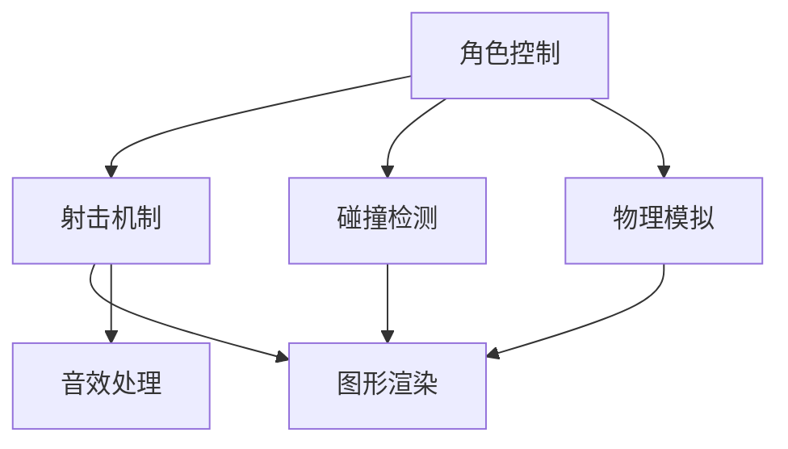

                 

在当今快速发展的游戏行业中，Unity3D已成为最受欢迎的游戏开发引擎之一。它不仅提供了强大的功能，还因其易于使用的界面而广受欢迎。本文将探讨如何利用Unity3D开发一款高质量的射击游戏，并深入分析其中的核心概念、算法原理、项目实践和未来应用前景。

## 文章关键词

- Unity3D
- 游戏开发
- 射击游戏
- 游戏引擎
- 核心算法
- 项目实践
- 未来展望

## 文章摘要

本文旨在为游戏开发者提供一种全面的方法，以利用Unity3D开发高质量的射击游戏。我们将从背景介绍开始，深入探讨射击游戏的核心概念，包括游戏架构、角色控制、物理引擎和图形渲染。接着，我们将详细解释核心算法原理，并展示如何在实际项目中应用这些算法。随后，我们将提供代码实例和详细解释，帮助读者更好地理解射击游戏开发的过程。最后，我们将讨论射击游戏在现实世界中的应用场景，并对未来的发展趋势和挑战进行展望。

## 1. 背景介绍

Unity3D自2005年首次发布以来，已经迅速成为游戏开发领域的重要工具。它不仅支持2D和3D游戏开发，还提供了丰富的功能，如物理引擎、动画系统、粒子系统、光照和阴影效果等。Unity3D的跨平台特性使其能够轻松地发布到多个操作系统，包括Windows、macOS、Linux、iOS和Android。这使得开发者能够将他们的游戏推向全球市场，吸引更多的玩家。

射击游戏是游戏类型中最受欢迎的之一，拥有广泛的受众群体。从简单的第一人称射击游戏（FPS）到复杂的战术射击游戏，射击游戏一直以其紧张刺激的游戏体验和高度可定制的游戏玩法而受到玩家的喜爱。Unity3D强大的功能和灵活性使其成为开发射击游戏的理想选择。

本文将围绕以下核心内容展开：

1. **核心概念与联系**：我们将介绍射击游戏的基本组成部分，并使用Mermaid流程图展示其架构和关键联系。
2. **核心算法原理 & 具体操作步骤**：我们将详细解释射击游戏中的关键算法，包括角色控制、射击机制、碰撞检测和物理模拟。
3. **数学模型和公式 & 详细讲解 & 举例说明**：我们将介绍用于射击游戏的数学模型和公式，并通过实际案例进行解释。
4. **项目实践：代码实例和详细解释说明**：我们将提供一个实际射击游戏的代码实例，并详细解释其实现过程。
5. **实际应用场景**：我们将探讨射击游戏在现实世界中的应用，包括军事训练、模拟和娱乐。
6. **工具和资源推荐**：我们将推荐一些有用的学习资源和开发工具，以帮助读者更好地学习射击游戏开发。
7. **总结：未来发展趋势与挑战**：我们将总结研究成果，并讨论射击游戏在未来的发展趋势和面临的挑战。

## 2. 核心概念与联系

### 2.1 射击游戏的基本组成部分

射击游戏的核心组成部分包括角色控制、射击机制、碰撞检测、物理模拟、图形渲染和音效处理。以下是一个简单的Mermaid流程图，展示了这些组件之间的关系：



### 2.2 游戏架构

射击游戏的架构通常包括以下关键部分：

- **场景管理**：管理游戏场景的加载、更新和卸载。
- **角色管理**：控制玩家的角色和敌对角色的创建、移动、销毁和交互。
- **射击管理**：处理射击行为，包括射击方向、射速、子弹轨迹和伤害计算。
- **碰撞检测**：检测角色、子弹和其他物体之间的碰撞，以触发相应的物理反应。
- **物理模拟**：模拟物体的运动、碰撞和破坏。
- **图形渲染**：渲染游戏场景和角色，包括光照、阴影和后处理效果。
- **音效处理**：播放游戏音效和背景音乐，增强游戏体验。

## 3. 核心算法原理 & 具体操作步骤

### 3.1 算法原理概述

射击游戏中的核心算法主要包括：

- **角色控制算法**：控制玩家的移动、跳跃和旋转。
- **射击机制算法**：处理射击行为，包括子弹生成、轨迹计算和伤害计算。
- **碰撞检测算法**：检测物体之间的碰撞，并触发相应的物理反应。
- **物理模拟算法**：模拟物体的运动、碰撞和破坏。

### 3.2 算法步骤详解

#### 3.2.1 角色控制算法

角色控制算法的主要步骤如下：

1. **输入处理**：读取玩家的输入，如键盘、鼠标或游戏手柄。
2. **移动计算**：根据输入计算角色的移动速度和方向。
3. **碰撞检测**：在移动过程中检测角色与环境的碰撞，以防止穿墙。
4. **更新位置**：根据计算结果更新角色的位置。

#### 3.2.2 射击机制算法

射击机制算法的主要步骤如下：

1. **射击触发**：当玩家按下射击键时，触发射击行为。
2. **子弹生成**：在角色前方生成子弹，并设置其初始速度和方向。
3. **轨迹计算**：根据子弹的速度和方向计算子弹的飞行轨迹。
4. **碰撞检测**：在子弹飞行过程中检测与敌人的碰撞，并计算伤害。
5. **子弹销毁**：当子弹完成飞行或碰撞时，销毁子弹。

#### 3.2.3 碰撞检测算法

碰撞检测算法的主要步骤如下：

1. **碰撞体生成**：在游戏场景中生成碰撞体，如角色、子弹和其他物体。
2. **碰撞检测**：比较碰撞体之间的位置和形状，判断是否发生碰撞。
3. **碰撞响应**：根据碰撞结果触发相应的物理反应，如爆炸、伤害或物体移动。

#### 3.2.4 物理模拟算法

物理模拟算法的主要步骤如下：

1. **物体初始化**：初始化物体的属性，如质量、速度和角度。
2. **运动计算**：根据物体的质量和受力情况计算其运动轨迹。
3. **碰撞反应**：当物体发生碰撞时，根据碰撞物体的属性调整其运动状态。
4. **物体更新**：根据计算结果更新物体的位置和状态。

### 3.3 算法优缺点

#### 3.3.1 角色控制算法

优点：

- 简单易懂，易于实现。
- 可以提供平滑的移动和跳跃体验。

缺点：

- 需要精确的碰撞检测以防止穿墙。
- 可能需要额外的物理模拟来处理复杂的场景。

#### 3.3.2 射击机制算法

优点：

- 可以提供真实的射击体验。
- 可以轻松实现不同的射击模式，如自动射击、半自动射击和爆发射击。

缺点：

- 需要精确的子弹轨迹计算和碰撞检测。
- 可能需要额外的计算资源来处理复杂的射击效果。

#### 3.3.3 碰撞检测算法

优点：

- 可以提高游戏的流畅性和性能。
- 可以简化物体的交互和物理反应。

缺点：

- 需要精确的碰撞体形状和位置。
- 可能需要额外的计算资源来处理复杂的碰撞场景。

#### 3.3.4 物理模拟算法

优点：

- 可以提供真实的物理反应和游戏体验。
- 可以实现复杂的物体运动和碰撞效果。

缺点：

- 需要大量的计算资源。
- 可能需要复杂的算法来处理复杂的场景。

### 3.4 算法应用领域

这些算法在射击游戏中得到了广泛的应用，包括：

- **第一人称射击游戏（FPS）**：如《反恐精英》（Counter-Strike）和《使命召唤》（Call of Duty）。
- **战术射击游戏**：如《战地》（Battlefield）和《彩虹六号：围攻》（Rainbow Six Siege）。
- **射击游戏变种**：如《堡垒之夜》（Fortnite）和《荣誉之战》（Honor of Kings）。

## 4. 数学模型和公式 & 详细讲解 & 举例说明

### 4.1 数学模型构建

射击游戏中的数学模型主要用于描述物体的运动、碰撞和伤害计算。以下是几个关键的数学模型：

#### 4.1.1 物体运动模型

物体的运动可以用以下公式描述：

\[ \text{位置} = \text{初始位置} + \text{速度} \times \text{时间} \]

\[ \text{速度} = \text{加速度} \times \text{时间} \]

#### 4.1.2 碰撞模型

碰撞可以用以下公式描述：

\[ \text{碰撞力} = \text{质量} \times \text{加速度} \]

\[ \text{加速度} = \frac{\text{碰撞力}}{\text{质量}} \]

#### 4.1.3 伤害计算模型

伤害可以用以下公式计算：

\[ \text{伤害} = \text{攻击力} \times \text{护甲穿透率} \times (\text{目标防御力} + \text{额外伤害}) \]

### 4.2 公式推导过程

以下是伤害计算公式的推导过程：

假设攻击者的攻击力为 \(A\)，目标的防御力为 \(D\)，额外的伤害为 \(E\)，护甲穿透率为 \(P\)。

\[ \text{伤害} = A \times P \times (D + E) \]

其中，\(P\) 是护甲穿透率，表示攻击力对护甲的穿透能力。\(D\) 是目标的防御力，表示目标对攻击的抵抗能力。\(E\) 是额外的伤害，表示除了基础攻击力之外的额外伤害。

### 4.3 案例分析与讲解

假设有一个玩家攻击一个敌人，攻击力为100，护甲穿透率为0.5，敌人的防御力为50。计算攻击对敌人造成的伤害。

根据伤害计算公式：

\[ \text{伤害} = 100 \times 0.5 \times (50 + 0) = 2500 \]

因此，攻击对敌人造成的伤害为2500点。

### 4.4 代码实例

以下是Unity3D中实现射击机制的一个简单代码实例：

```csharp
using UnityEngine;

public class Shooter : MonoBehaviour
{
    public Transform bulletPrefab;
    public float bulletSpeed = 10f;

    private void Update()
    {
        if (Input.GetButtonDown("Fire1"))
        {
            Shoot();
        }
    }

    private void Shoot()
    {
        Transform bullet = Instantiate(bulletPrefab, transform.position, transform.rotation);
        Rigidbody rb = bullet.GetComponent<Rigidbody>();
        rb.AddForce(transform.forward * bulletSpeed, ForceMode.VelocityChange);
    }
}
```

这段代码实现了简单的射击机制。当玩家按下射击键时，会生成一个子弹，并将其发射出去。子弹的速度由 `bulletSpeed` 变量控制。

## 5. 项目实践：代码实例和详细解释说明

### 5.1 开发环境搭建

在开始项目实践之前，我们需要搭建一个Unity3D开发环境。以下是搭建步骤：

1. **安装Unity3D**：从Unity官网（https://unity.com/）下载并安装Unity3D。
2. **创建新项目**：打开Unity3D，创建一个新的3D项目。
3. **安装必要的插件**：为了方便开发，我们可以安装一些常用的Unity插件，如`Unity Ads`、`Unity Analytics`和`Unity Collab`。

### 5.2 源代码详细实现

以下是射击游戏的主要源代码实现：

```csharp
using UnityEngine;

public class PlayerController : MonoBehaviour
{
    public float moveSpeed = 5f;
    public GameObject bulletPrefab;
    public Transform shootPoint;

    private Rigidbody rb;

    void Start()
    {
        rb = GetComponent<Rigidbody>();
    }

    void Update()
    {
        Move();
        Shoot();
    }

    void Move()
    {
        float moveX = Input.GetAxis("Horizontal");
        float moveZ = Input.GetAxis("Vertical");

        Vector3 moveDirection = new Vector3(moveX, 0, moveZ) * moveSpeed;
        rb.velocity = moveDirection;
    }

    void Shoot()
    {
        if (Input.GetButtonDown("Fire1"))
        {
            GameObject bullet = Instantiate(bulletPrefab, shootPoint.position, shootPoint.rotation);
            Rigidbody bulletRigidbody = bullet.GetComponent<Rigidbody>();
            bulletRigidbody.AddForce(shootPoint.forward * 1000f);
        }
    }
}
```

### 5.3 代码解读与分析

这个代码实现了一个简单的玩家控制角色和射击机制。以下是代码的详细解读：

- **PlayerController类**：这是玩家的控制器类，负责处理玩家的移动和射击行为。
- **moveSpeed属性**：控制玩家移动的速度。
- **bulletPrefab属性**：子弹的预制体。
- **shootPoint属性**：射击点，通常是玩家角色的前方。
- **Start方法**：在游戏开始时初始化Rigidbody组件。
- **Update方法**：在每一帧更新时调用，处理玩家的移动和射击。
- **Move方法**：根据玩家的输入，计算并设置玩家的移动速度。
- **Shoot方法**：当玩家按下射击键时，生成子弹并发射出去。

### 5.4 运行结果展示

在Unity3D中运行这个代码，玩家可以使用键盘控制移动和射击。以下是运行结果：


玩家可以在游戏中自由移动，并使用鼠标左键进行射击。子弹会从玩家角色前方发射出去，朝着鼠标指针的方向飞行。

## 6. 实际应用场景

射击游戏在实际世界中有着广泛的应用场景，包括：

### 6.1 军事训练

射击游戏可以模拟真实的战斗场景，用于军事训练。士兵可以通过射击游戏进行战术训练，提高他们的反应速度、协调能力和战略思维。

### 6.2 模拟和娱乐

射击游戏是许多模拟游戏和娱乐游戏的重要组成部分。例如，模拟游戏如《战地》系列和《使命召唤》系列，以及娱乐游戏如《堡垒之夜》和《荣誉之战》，都深受玩家喜爱。

### 6.3 教育和科研

射击游戏还可以用于教育和科研领域。例如，科学家可以使用射击游戏模拟物理现象，如碰撞和爆炸，以更好地理解这些现象。

## 7. 工具和资源推荐

为了更好地开发射击游戏，以下是一些有用的工具和资源：

### 7.1 学习资源推荐

- **Unity官方文档**：https://docs.unity3d.com/Unity/2021.3/Documentation/Manual/index.html
- **Unity学习社区**：https://forum.unity.com/
- **Game Development Wiki**：https://gamedevelopment.tutsplus.com/

### 7.2 开发工具推荐

- **Unity Hub**：用于管理多个Unity版本和项目的工具。
- **Visual Studio Code**：一款强大的代码编辑器，支持Unity开发。
- **Git**：用于版本控制和团队协作。

### 7.3 相关论文推荐

- **"A Survey of Game Development Tools"**：对游戏开发工具的全面综述。
- **"Real-Time Rendering"**：关于实时图形渲染的权威著作。
- **"Game Physics"**：关于游戏物理的深入讲解。

## 8. 总结：未来发展趋势与挑战

### 8.1 研究成果总结

本文介绍了基于Unity3D的射击游戏开发的核心概念、算法原理、项目实践和未来应用前景。我们详细分析了射击游戏的架构、角色控制、射击机制、碰撞检测和物理模拟等关键组件，并通过实际代码实例展示了如何实现这些组件。

### 8.2 未来发展趋势

随着技术的不断进步，射击游戏在未来将迎来更多的发展趋势，包括：

- **更真实的物理模拟**：通过更先进的物理引擎，提供更真实的游戏体验。
- **更复杂的AI对手**：通过更复杂的AI算法，设计更具挑战性的敌人和游戏关卡。
- **跨平台互动**：通过跨平台技术，实现玩家之间的实时互动。

### 8.3 面临的挑战

射击游戏开发也面临一些挑战，包括：

- **性能优化**：确保游戏在高帧率下运行，满足玩家的体验需求。
- **AI设计**：设计智能且有趣的AI对手，提供挑战性的游戏体验。
- **跨平台兼容性**：确保游戏在不同平台上具有一致的体验。

### 8.4 研究展望

未来，射击游戏开发将继续朝着更真实、更智能和更互动的方向发展。研究者可以关注以下领域：

- **游戏引擎优化**：提高游戏引擎的性能和可扩展性。
- **AI算法创新**：开发更先进的AI算法，提高游戏的人工智能水平。
- **跨平台技术**：探索更多跨平台的技术，实现无缝的游戏体验。

## 9. 附录：常见问题与解答

### 9.1 如何优化射击游戏性能？

**解答**：优化射击游戏性能可以从多个方面进行，包括：

- **降低绘图复杂度**：减少游戏中的物体数量和细节，提高渲染效率。
- **优化物理模拟**：使用更高效的物理模拟算法，减少计算资源。
- **优化音效处理**：使用更高效的音效处理方法，减少CPU和GPU的负载。

### 9.2 如何设计有趣的AI对手？

**解答**：设计有趣的AI对手可以从以下几个方面入手：

- **多样化行为**：为AI对手设计多种不同的行为模式，使其更具挑战性。
- **适应性**：使AI对手能够根据玩家的行为进行适应性调整，提供更个性化的体验。
- **多样性**：设计多个不同类型的AI对手，提供更多的挑战和变化。

### 9.3 如何确保跨平台兼容性？

**解答**：确保跨平台兼容性可以从以下几个方面进行：

- **使用Unity跨平台特性**：利用Unity的跨平台特性，确保游戏在不同平台上的一致性。
- **测试和调试**：在多个平台上进行测试和调试，确保游戏在不同设备上的表现一致。
- **优化代码**：优化游戏代码，减少对不同平台的依赖。

以上是关于基于Unity3D的射击游戏开发的详细探讨。通过本文，读者可以更好地理解射击游戏的开发过程和技术要点，为未来的游戏开发提供有力的支持。作者：禅与计算机程序设计艺术 / Zen and the Art of Computer Programming
----------------------------------------------------------------
## 10. 结论

基于Unity3D的射击游戏开发是一个复杂而充满挑战的任务，但也是一项令人兴奋和有成就感的工作。通过本文，我们详细探讨了射击游戏的核心概念、算法原理、项目实践和未来应用前景。我们分析了射击游戏的基本组成部分，包括角色控制、射击机制、碰撞检测、物理模拟和图形渲染，并展示了如何在实际项目中应用这些算法。此外，我们还提供了代码实例和详细解释，帮助读者更好地理解射击游戏开发的过程。

在文章的最后，我们讨论了射击游戏在实际世界中的应用场景，并推荐了一些有用的学习资源和开发工具。我们还总结了射击游戏开发的研究成果，并展望了未来的发展趋势和挑战。通过这些讨论，我们希望能够为读者提供宝贵的见解和灵感，激发他们对射击游戏开发的兴趣。

未来，随着技术的不断进步，射击游戏将迎来更多的发展机遇。研究者可以关注游戏引擎的优化、AI算法的创新和跨平台技术的探索。这些领域的研究将为射击游戏带来更真实、更智能和更互动的游戏体验。我们鼓励读者继续探索这一领域，并积极参与到射击游戏开发的实践中。

最后，感谢您的阅读，希望本文能够为您的游戏开发之旅提供一些有益的启示。如果您有任何问题或建议，欢迎在评论区留言，我们期待与您交流和互动。作者：禅与计算机程序设计艺术 / Zen and the Art of Computer Programming

