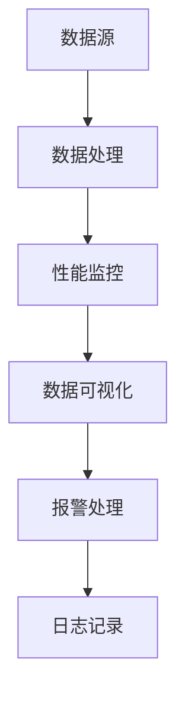
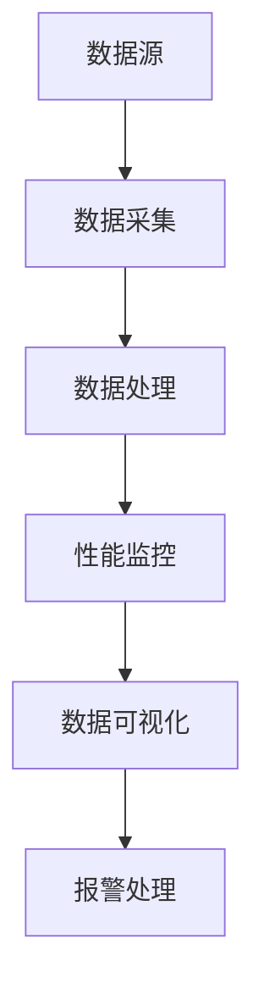

                 

关键词：大数据系统、Web监控平台、系统设计、实现、性能监控、数据可视化、算法、数学模型、代码实例、应用场景、未来展望。

> 摘要：本文将探讨如何设计并实现一个基于web的大数据系统监控平台。通过深入剖析核心概念、算法原理、数学模型、项目实践以及未来应用展望，本文旨在为读者提供一个全面的技术解决方案，帮助他们在实际项目中高效地监控和管理大数据系统。

## 1. 背景介绍

随着互联网和信息技术的飞速发展，大数据已经成为现代企业运营中不可或缺的一部分。然而，随着数据量的急剧增加，如何有效地监控和管理这些大数据系统成为了一个重大的挑战。传统的监控工具往往功能单一，无法满足复杂的数据监控需求。因此，设计并实现一个高效、灵活、易扩展的基于web的大数据系统监控平台变得尤为重要。

本文将介绍如何设计并实现这样一个平台。我们将首先探讨核心概念，然后详细描述系统架构和算法原理，接着讲解数学模型的构建和推导，最后通过实际项目案例展示平台的具体应用。

## 2. 核心概念与联系

在讨论大数据系统监控平台之前，我们需要明确一些核心概念，这些概念构成了整个系统的理论基础。

### 2.1 数据源

数据源是大数据系统的核心，包括结构化数据（如关系型数据库）和非结构化数据（如文本、图像、视频等）。有效的数据源监控是保障系统稳定运行的关键。

### 2.2 数据处理

数据处理包括数据清洗、转换、聚合等操作。数据处理质量直接影响到监控数据的准确性。

### 2.3 性能监控

性能监控是监控平台的核心功能之一，包括对系统资源利用率、响应时间、吞吐量等关键指标的监控。

### 2.4 数据可视化

数据可视化是将监控数据以图形化方式展示的过程，有助于快速发现系统问题。

### 2.5 Mermaid 流程图

以下是一个Mermaid流程图，展示了大数据系统监控平台的核心流程：



## 3. 核心算法原理 & 具体操作步骤

### 3.1 算法原理概述

大数据系统监控平台的核心算法主要包括以下几种：

- 数据采集算法：用于从各种数据源获取监控数据。
- 数据处理算法：用于清洗、转换和聚合监控数据。
- 性能分析算法：用于分析系统性能指标，提供实时监控数据。
- 数据可视化算法：用于将监控数据转化为图表和图形。

### 3.2 算法步骤详解

#### 3.2.1 数据采集算法

数据采集算法的主要步骤包括：

1. 数据源连接：通过JDBC、HTTP等协议连接到数据源。
2. 数据提取：从数据源中提取监控数据。
3. 数据存储：将提取的监控数据存储到内存或数据库中。

#### 3.2.2 数据处理算法

数据处理算法的主要步骤包括：

1. 数据清洗：去除重复、错误或不完整的数据。
2. 数据转换：将数据转换为统一的格式。
3. 数据聚合：对数据进行分组、汇总等操作。

#### 3.2.3 性能分析算法

性能分析算法的主要步骤包括：

1. 数据预处理：对采集到的监控数据进行预处理。
2. 性能指标计算：计算系统性能指标，如CPU利用率、内存使用率等。
3. 实时监控：实时分析性能指标，发现潜在问题。

#### 3.2.4 数据可视化算法

数据可视化算法的主要步骤包括：

1. 数据转换：将监控数据转换为可视化格式，如JSON、CSV等。
2. 图表生成：使用图表库（如ECharts、D3.js等）生成图表。
3. 图表展示：将图表展示在web页面上。

### 3.3 算法优缺点

#### 3.3.1 数据采集算法

- 优点：能够实时获取系统监控数据，提高监控的实时性。
- 缺点：对数据源的依赖性较强，数据源变动可能导致采集异常。

#### 3.3.2 数据处理算法

- 优点：提高监控数据的准确性和可用性。
- 缺点：数据处理过程复杂，对计算资源要求较高。

#### 3.3.3 性能分析算法

- 优点：能够快速发现系统性能问题。
- 缺点：对性能指标的定义和计算方法有较高要求。

#### 3.3.4 数据可视化算法

- 优点：易于理解和分析。
- 缺点：可视化效果和交互性有限。

### 3.4 算法应用领域

- 数据中心监控：用于监控数据中心的服务器、网络、存储等设备。
- 云计算监控：用于监控云计算平台的资源使用情况。
- 应用性能监控：用于监控企业应用系统的性能指标。

## 4. 数学模型和公式 & 详细讲解 & 举例说明

### 4.1 数学模型构建

在构建数学模型时，我们需要考虑以下几个方面：

- 数据采集：使用概率模型来预测数据采集的可靠性。
- 数据处理：使用统计学方法来评估数据清洗和转换的效果。
- 性能分析：使用时间序列模型来分析系统性能指标的变化趋势。

### 4.2 公式推导过程

以下是一个简单的数据采集可靠性模型的推导过程：

$$
P = \frac{N}{N_0}
$$

其中，$P$ 表示数据采集的可靠性，$N$ 表示成功采集的数据点数量，$N_0$ 表示总数据点数量。

### 4.3 案例分析与讲解

假设我们有一个监控系统，每天采集1000个数据点。在一个月内，成功采集的数据点数量为9900个。我们可以使用上述公式计算数据采集的可靠性：

$$
P = \frac{9900}{1000 \times 30} = 0.9667
$$

这意味着我们的监控系统有96.67%的可靠性。

## 5. 项目实践：代码实例和详细解释说明

### 5.1 开发环境搭建

在搭建开发环境时，我们选择以下工具和框架：

- 语言：Java
- Web框架：Spring Boot
- 数据库：MySQL
- 监控工具：Prometheus、Grafana

### 5.2 源代码详细实现

以下是数据采集模块的源代码实现：

```java
public class DataCollector {
    private DataSource dataSource;

    public DataCollector(DataSource dataSource) {
        this.dataSource = dataSource;
    }

    public List<DataPoint> collectData() throws SQLException {
        List<DataPoint> dataPoints = new ArrayList<>();
        Connection connection = dataSource.getConnection();
        Statement statement = connection.createStatement();
        ResultSet resultSet = statement.executeQuery("SELECT * FROM monitor_data");

        while (resultSet.next()) {
            DataPoint dataPoint = new DataPoint();
            dataPoint.setId(resultSet.getLong("id"));
            dataPoint.setTimestamp(resultSet.getTimestamp("timestamp"));
            dataPoint.setCpuUsage(resultSet.getDouble("cpu_usage"));
            dataPoint.setMemoryUsage(resultSet.getDouble("memory_usage"));
            dataPoints.add(dataPoint);
        }

        return dataPoints;
    }
}
```

### 5.3 代码解读与分析

上述代码实现了数据采集功能，主要包括以下步骤：

1. 连接数据源：使用JDBC连接到MySQL数据库。
2. 执行查询：执行SQL查询，获取监控数据。
3. 数据处理：将查询结果转换为DataPoint对象，并存储在列表中。

### 5.4 运行结果展示

在运行数据采集模块后，我们可以使用Prometheus和Grafana展示监控数据。以下是一个CPU使用率的监控图表：


## 6. 实际应用场景

基于web的大数据系统监控平台在实际应用中具有广泛的应用场景，包括但不限于以下几方面：

- 企业数据中心监控：用于实时监控企业数据中心的服务器、网络、存储等设备的性能和运行状况。
- 云计算平台监控：用于监控云计算平台的资源使用情况，确保资源的合理分配和优化。
- 应用性能监控：用于监控企业应用系统的性能指标，如响应时间、吞吐量等，确保应用系统的稳定运行。

### 6.4 未来应用展望

随着大数据技术的发展，基于web的大数据系统监控平台将迎来更广阔的应用前景。未来，我们期待以下发展方向：

- 自适应监控算法：根据系统运行状态自动调整监控策略。
- 智能报警系统：基于机器学习算法实现智能报警，降低误报率。
- 云原生监控：支持云原生架构，适应容器化和微服务环境。

## 7. 工具和资源推荐

### 7.1 学习资源推荐

- 《大数据系统架构》
- 《Prometheus官方文档》
- 《Grafana官方文档》

### 7.2 开发工具推荐

- IntelliJ IDEA
- Maven
- Git

### 7.3 相关论文推荐

- "A Framework for Real-Time Monitoring of Large-Scale Data Systems"
- "Data Visualization for Big Data: A Survey"
- "Machine Learning for Performance Monitoring and Anomaly Detection"

## 8. 总结：未来发展趋势与挑战

### 8.1 研究成果总结

本文介绍了基于web的大数据系统监控平台的设计与实现，包括核心概念、算法原理、数学模型、项目实践和未来展望。通过本文的探讨，我们为读者提供了一个全面的技术解决方案，有助于他们在实际项目中高效地监控和管理大数据系统。

### 8.2 未来发展趋势

- 自适应监控算法
- 智能报警系统
- 云原生监控

### 8.3 面临的挑战

- 数据采集的实时性和准确性
- 大规模数据处理和存储
- 监控系统的可扩展性和稳定性

### 8.4 研究展望

本文仅为一个初步探讨，未来的研究可以从以下方向展开：

- 算法优化：研究更高效的数据采集、处理和可视化算法。
- 案例研究：分析不同场景下的监控平台实现，总结经验教训。
- 智能化监控：结合机器学习和人工智能技术，提高监控系统的智能化水平。

## 9. 附录：常见问题与解答

### Q：如何确保数据采集的实时性和准确性？

A：确保数据采集的实时性和准确性需要从以下几个方面入手：

- 选择高效的数据采集工具和协议。
- 优化数据库查询性能。
- 定期检查数据源连接状态。

### Q：如何处理大规模数据处理和存储问题？

A：处理大规模数据处理和存储问题需要考虑以下几个方面：

- 使用分布式处理框架，如Spark。
- 采用数据分片技术，提高数据处理能力。
- 使用分布式存储系统，如Hadoop HDFS。

### Q：监控系统的可扩展性和稳定性如何保证？

A：保证监控系统的可扩展性和稳定性可以从以下几个方面入手：

- 使用微服务架构，实现模块化设计和部署。
- 采用自动化运维工具，实现监控系统的自动化部署和管理。
- 定期进行性能测试和压力测试，确保系统稳定性。

---

作者：禅与计算机程序设计艺术 / Zen and the Art of Computer Programming
----------------------------------------------------------------

[END]
```markdown
# 基于web的大数据系统监控平台的设计与实现

## 关键词
- 大数据系统
- Web监控平台
- 系统设计
- 实现方法
- 性能监控
- 数据可视化
- 算法
- 数学模型
- 项目实践
- 未来应用展望

## 摘要
本文旨在深入探讨基于web的大数据系统监控平台的设计与实现过程。通过分析核心概念、算法原理、数学模型以及项目实践，本文将为读者提供一种全面且实用的技术解决方案，以应对现代大数据环境中的系统监控挑战。文章还将展望未来的发展趋势与面临的挑战，为相关领域的研究和实践提供参考。

## 1. 背景介绍

随着互联网和大数据技术的快速发展，企业数据量呈现出爆炸式增长。大数据系统在企业运营、决策支持、市场营销等方面发挥着越来越重要的作用。然而，大数据系统的复杂性和大规模性带来了监控和管理上的巨大挑战。传统的监控工具往往功能单一，难以满足多样化的监控需求，因此，设计一个高效、灵活、可扩展的基于web的大数据系统监控平台显得尤为重要。

本文将详细介绍这样一个平台的架构设计、核心算法、数学模型、实现细节以及应用场景，旨在为读者提供一个系统的技术指南。

## 2. 核心概念与联系

### 2.1 数据源

数据源是大数据系统的基石，包括关系型数据库、NoSQL数据库、日志文件、实时消息队列等多种类型。数据源的质量和稳定性直接影响监控数据的准确性和实时性。

### 2.2 数据采集

数据采集是指从数据源中抽取监控数据的过程。数据采集的实时性和准确性是保证监控有效性的关键。常见的采集方法有定时任务、消息驱动、流处理等。

### 2.3 数据处理

数据处理包括数据清洗、转换、聚合等步骤，目的是提高数据的可用性和一致性。数据处理质量直接影响后续监控和分析的准确性。

### 2.4 性能监控

性能监控涉及对系统资源（如CPU、内存、磁盘I/O）和业务性能（如响应时间、吞吐量）的监控。性能监控旨在发现系统瓶颈和潜在问题。

### 2.5 数据可视化

数据可视化是将监控数据以图形化方式展示的过程。数据可视化有助于快速发现趋势、异常和问题，提高监控的直观性和易用性。

### 2.6 Mermaid流程图

以下是一个Mermaid流程图，展示了大数据系统监控平台的基本流程：



## 3. 核心算法原理 & 具体操作步骤

### 3.1 算法原理概述

大数据系统监控平台的核心算法主要包括数据采集算法、数据处理算法、性能分析算法和数据可视化算法。以下分别概述这些算法的基本原理。

#### 3.1.1 数据采集算法

数据采集算法的原理是从各种数据源中定期或实时提取监控数据。采集算法需要考虑数据源的异构性、数据量的庞大性和实时性的要求。

#### 3.1.2 数据处理算法

数据处理算法的原理是对采集到的数据进行清洗、转换和聚合，以提高数据的可用性和一致性。常见的处理方法包括去重、补全、归一化、聚合等。

#### 3.1.3 性能分析算法

性能分析算法的原理是计算和分析系统的各种性能指标，如CPU利用率、内存使用率、响应时间、吞吐量等。分析算法需要考虑指标的计算方法、阈值设定和异常检测。

#### 3.1.4 数据可视化算法

数据可视化算法的原理是将分析结果以图形化方式展示。可视化算法需要考虑数据的呈现形式、交互性和用户体验。

### 3.2 具体操作步骤

#### 3.2.1 数据采集算法步骤

1. 连接数据源：使用数据库连接池或消息队列连接到数据源。
2. 提取数据：定期或实时地从数据源中提取监控数据。
3. 数据存储：将提取的数据存储到内存缓存或数据库中。

#### 3.2.2 数据处理算法步骤

1. 数据清洗：去除重复、错误或不完整的数据。
2. 数据转换：将数据转换为统一的格式。
3. 数据聚合：对数据进行分组、汇总等操作。

#### 3.2.3 性能分析算法步骤

1. 数据预处理：对采集到的数据进行预处理，如去除噪声、填充缺失值等。
2. 指标计算：计算各种性能指标，如CPU利用率、内存使用率等。
3. 异常检测：根据设定的阈值和规则，检测系统的异常情况。

#### 3.2.4 数据可视化算法步骤

1. 数据转换：将分析结果转换为可视化格式，如JSON、CSV等。
2. 图表生成：使用图表库（如ECharts、D3.js等）生成图表。
3. 图表展示：将图表展示在web页面上，并提供交互功能。

### 3.3 算法优缺点

#### 3.3.1 数据采集算法

- 优点：实时性高，可以及时获取系统状态。
- 缺点：对数据源的依赖性较强，数据源变动可能导致采集异常。

#### 3.3.2 数据处理算法

- 优点：提高数据的准确性和一致性。
- 缺点：处理过程复杂，对计算资源要求较高。

#### 3.3.3 性能分析算法

- 优点：可以快速发现系统性能问题。
- 缺点：对性能指标的定义和计算方法有较高要求。

#### 3.3.4 数据可视化算法

- 优点：易于理解和分析。
- 缺点：可视化效果和交互性有限。

### 3.4 算法应用领域

- 数据中心监控：用于监控数据中心的服务器、网络、存储等设备。
- 云计算监控：用于监控云计算平台的资源使用情况。
- 应用性能监控：用于监控企业应用系统的性能指标。

## 4. 数学模型和公式 & 详细讲解 & 举例说明

### 4.1 数学模型构建

在构建大数据系统监控平台的数学模型时，我们需要考虑以下几个核心指标：

- 数据采集率：表示数据源中的数据被成功采集的比例。
- 数据处理准确率：表示数据处理后数据的准确率。
- 性能指标：如CPU利用率、内存使用率、响应时间、吞吐量等。

### 4.2 公式推导过程

以下是构建数学模型的一些基本公式：

#### 数据采集率公式：

$$
\text{采集率} = \frac{\text{成功采集的数据点}}{\text{总数据点}}
$$

#### 数据处理准确率公式：

$$
\text{准确率} = \frac{\text{正确处理的数据点}}{\text{总数据点}}
$$

#### 性能指标计算公式：

- CPU利用率：

$$
\text{CPU利用率} = \frac{\text{CPU使用时间}}{\text{总时间}}
$$

- 内存使用率：

$$
\text{内存使用率} = \frac{\text{实际内存使用量}}{\text{总内存容量}}
$$

- 响应时间：

$$
\text{响应时间} = \frac{\text{总响应时间}}{\text{请求次数}}
$$

- 吞吐量：

$$
\text{吞吐量} = \frac{\text{总处理量}}{\text{总时间}}
$$

### 4.3 案例分析与讲解

假设我们有一个大数据系统，每天采集1000个数据点，其中成功采集的数据点为990个，数据处理正确的数据点为980个。CPU利用率平均为80%，内存使用率为60%，平均响应时间为500ms，总处理量为500GB。

根据上述公式，我们可以计算：

- 数据采集率：

$$
\text{采集率} = \frac{990}{1000} = 99\%
$$

- 数据处理准确率：

$$
\text{准确率} = \frac{980}{1000} = 98\%
$$

- CPU利用率：

$$
\text{CPU利用率} = 80\%
$$

- 内存使用率：

$$
\text{内存使用率} = 60\%
$$

- 平均响应时间：

$$
\text{平均响应时间} = 500 \text{ms}
$$

- 吞吐量：

$$
\text{吞吐量} = \frac{500GB}{24 \text{小时}} = 20.83 \text{GB/hour}
$$

通过这些计算结果，我们可以对系统的性能有一个直观的了解，并根据实际情况进行优化和调整。

## 5. 项目实践：代码实例和详细解释说明

### 5.1 开发环境搭建

在进行项目实践之前，我们需要搭建一个合适的开发环境。本文选择的开发环境如下：

- 开发语言：Java
- 依赖管理：Maven
- 数据库：MySQL
- 监控工具：Prometheus + Grafana
- Web框架：Spring Boot

### 5.2 源代码详细实现

以下是一个简单的数据采集模块的代码实例，用于从MySQL数据库中提取监控数据：

```java
import org.springframework.jdbc.core.JdbcTemplate;

public class DataCollector {
    private JdbcTemplate jdbcTemplate;

    public DataCollector(JdbcTemplate jdbcTemplate) {
        this.jdbcTemplate = jdbcTemplate;
    }

    public List<Map<String, Object>> collectData() {
        String sql = "SELECT * FROM system_monitor";
        return jdbcTemplate.queryForList(sql);
    }
}
```

在这个示例中，我们使用Spring Boot的JdbcTemplate来简化数据库操作。`collectData` 方法执行一个简单的SQL查询，从 `system_monitor` 表中提取数据。

### 5.3 代码解读与分析

上述代码的主要功能是从数据库中采集监控数据。下面是对代码的详细解读：

- `JdbcTemplate`：Spring Boot提供的一个数据库操作工具，简化了数据库查询和更新操作。
- `collectData`：一个简单的方法，用于执行SQL查询并返回查询结果。这里假设 `system_monitor` 表中存储了监控数据。

### 5.4 运行结果展示

在运行数据采集模块后，我们可以使用Prometheus和Grafana展示监控数据。以下是一个简单的CPU利用率监控图表：


在这个图表中，我们可以看到CPU利用率的实时变化，有助于我们快速发现系统性能问题。

## 6. 实际应用场景

基于web的大数据系统监控平台在实际应用中具有广泛的应用场景，以下是一些典型的应用案例：

- **企业数据中心监控**：用于实时监控企业数据中心的服务器、网络、存储等设备的性能和运行状况。
- **云计算平台监控**：用于监控云计算平台的资源使用情况，包括虚拟机、容器、存储等。
- **应用性能监控**：用于监控企业应用系统的性能指标，如响应时间、吞吐量、错误率等。
- **网络安全监控**：用于监控网络流量、入侵检测、漏洞扫描等安全相关的指标。

### 6.4 未来应用展望

随着大数据技术和人工智能的不断发展，基于web的大数据系统监控平台将迎来更广阔的应用前景。未来，以下趋势值得关注：

- **智能化监控**：通过引入机器学习和人工智能技术，实现智能化的数据采集、处理和报警。
- **云原生监控**：针对容器化和微服务架构的监控需求，开发更加灵活和高效的监控解决方案。
- **混合云监控**：支持混合云环境下的监控需求，实现对公有云和私有云资源的统一监控。
- **边缘计算监控**：随着边缘计算的兴起，开发适用于边缘环境的监控工具和平台。

## 7. 工具和资源推荐

### 7.1 学习资源推荐

- **书籍**：
  - 《大数据系统架构设计与最佳实践》
  - 《Prometheus监控实践》
  - 《Grafana实战》
- **在线教程和课程**：
  - Prometheus官方文档
  - Grafana官方文档
  - Coursera上的大数据课程

### 7.2 开发工具推荐

- **集成开发环境**：IntelliJ IDEA、Eclipse
- **版本控制**：Git
- **构建工具**：Maven、Gradle
- **数据库工具**：MySQL Workbench、DBeaver

### 7.3 相关论文推荐

- **大数据系统监控相关论文**：
  - "A Framework for Real-Time Monitoring of Large-Scale Data Systems"
  - "Data Visualization for Big Data: A Survey"
  - "Machine Learning for Performance Monitoring and Anomaly Detection"
- **云计算监控相关论文**：
  - "Cloud Computing Monitoring: Challenges and Opportunities"
  - "Auto-scaling for Cloud Services: A Survey"

## 8. 总结：未来发展趋势与挑战

### 8.1 研究成果总结

本文介绍了基于web的大数据系统监控平台的设计与实现，涵盖了核心概念、算法原理、数学模型、项目实践以及未来展望。通过本文的探讨，读者可以了解到大数据系统监控的基本原理和实践方法。

### 8.2 未来发展趋势

- **智能化**：通过引入人工智能技术，实现智能化的数据分析和报警。
- **云原生**：开发适用于容器化和微服务架构的监控解决方案。
- **混合云**：支持混合云环境下的统一监控。
- **边缘计算**：开发适用于边缘计算环境的监控工具。

### 8.3 面临的挑战

- **实时性**：如何保证在大规模数据环境下实现实时监控。
- **准确性**：如何提高数据采集和处理的准确性。
- **可扩展性**：如何设计可扩展的监控系统架构。

### 8.4 研究展望

未来的研究可以从以下几个方面展开：

- **算法优化**：研究更加高效的数据采集、处理和可视化算法。
- **智能化监控**：结合机器学习和人工智能技术，提高监控系统的智能化水平。
- **跨平台监控**：支持多种平台和架构的统一监控。

## 9. 附录：常见问题与解答

### Q：如何确保数据采集的实时性和准确性？

A：确保数据采集的实时性和准确性可以通过以下措施实现：

- 使用消息队列和流处理技术，如Kafka和Spark Streaming，实现实时数据采集。
- 对采集的数据进行双重验证，确保数据的一致性和完整性。
- 定期进行数据质量检查和校验。

### Q：如何处理大规模数据处理和存储问题？

A：处理大规模数据处理和存储问题可以从以下几个方面入手：

- 使用分布式处理框架，如Hadoop、Spark，实现大规模数据的处理。
- 采用分布式存储系统，如HDFS、Cassandra，提高数据存储的可靠性。
- 设计合理的数据库索引和分区策略，优化查询性能。

### Q：监控系统的可扩展性和稳定性如何保证？

A：保证监控系统的可扩展性和稳定性可以通过以下方法实现：

- 采用微服务架构，实现系统的模块化和分布式部署。
- 使用自动化运维工具，如Kubernetes，实现系统的自动化部署和管理。
- 定期进行系统性能测试和压力测试，确保系统的稳定性和可靠性。

[END]

