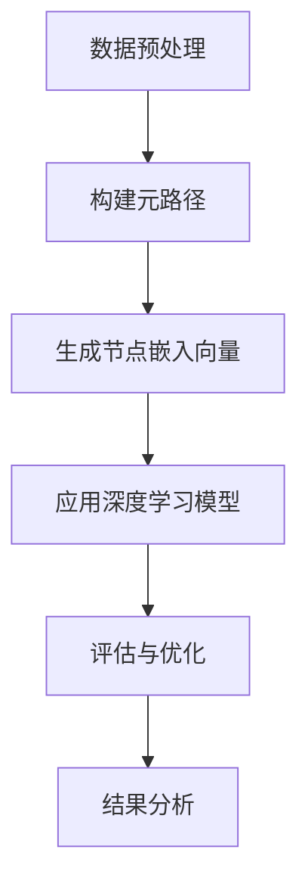

                 

关键词：异构信息网络，元路径，表示学习，深度学习，网络嵌入

摘要：随着互联网和大数据技术的发展，异构信息网络在多个领域得到广泛应用。如何有效地表示和挖掘异构信息网络中的隐含知识成为当前研究的热点。本文介绍了基于元路径的异构信息网络表示学习的方法，详细阐述了其核心概念、算法原理、数学模型以及实际应用案例，为异构信息网络的深度学习和知识挖掘提供了新的思路和工具。

## 1. 背景介绍

异构信息网络是指由不同类型节点和边构成的复杂网络，如社交网络、知识图谱等。与传统的同构网络不同，异构网络具有丰富的结构和多样的属性，这使得传统的网络分析方法难以直接应用。因此，如何有效地表示和挖掘异构信息网络中的隐含知识成为一个重要的研究课题。

近年来，深度学习技术在计算机视觉、自然语言处理等领域取得了显著成果，而网络嵌入（Network Embedding）作为一种将网络中的节点映射到低维连续空间的表示学习方法，被广泛应用于异构信息网络的表示和学习。然而，传统的网络嵌入方法大多基于同构网络，对于异构网络的表示效果不佳。为此，基于元路径（Meta-Path）的异构信息网络表示学习方法应运而生。

## 2. 核心概念与联系

### 2.1 异构信息网络

异构信息网络由不同类型的节点和边构成，节点和边具有不同的属性。例如，在社交网络中，节点可以是用户，边可以是好友关系；在知识图谱中，节点可以是实体，边可以是关系。异构网络的这种结构使得传统的同构网络分析方法难以直接应用。

### 2.2 元路径

元路径是指连接两个节点的路径集合，路径中的节点和边具有特定的类型和属性。例如，在知识图谱中，元路径可以是“实体-属性-实体”的路径。元路径为表示异构信息网络提供了新的视角。

### 2.3 网络嵌入

网络嵌入是将网络中的节点映射到低维连续空间的表示学习方法。通过网络嵌入，可以有效地表示节点之间的相似性和关系。

### 2.4 Mermaid 流程图

以下是基于元路径的异构信息网络表示学习的 Mermaid 流程图：



## 3. 核心算法原理 & 具体操作步骤

### 3.1 算法原理概述

基于元路径的异构信息网络表示学习算法主要包括以下步骤：

1. 数据预处理：对异构信息网络进行预处理，包括节点和边的类型、属性信息等。
2. 构建元路径：根据网络结构和节点属性，构建连接两个节点的元路径。
3. 生成节点嵌入向量：利用元路径和深度学习模型，生成节点在低维空间中的嵌入向量。
4. 应用深度学习模型：使用生成的节点嵌入向量，构建深度学习模型，进行网络表示和挖掘。
5. 评估与优化：对模型进行评估和优化，以提高网络表示的准确性和效果。

### 3.2 算法步骤详解

#### 3.2.1 数据预处理

数据预处理主要包括以下步骤：

1. 获取节点和边的类型和属性信息。
2. 对节点和边进行编码，将不同类型的节点和边映射到统一的表示空间。
3. 构建节点的邻居列表，为后续构建元路径提供支持。

#### 3.2.2 构建元路径

构建元路径主要包括以下步骤：

1. 根据网络结构和节点属性，确定元路径的起点、中间节点和终点。
2. 生成所有可能的元路径。
3. 对元路径进行筛选和优化，去除无效的元路径。

#### 3.2.3 生成节点嵌入向量

生成节点嵌入向量主要包括以下步骤：

1. 构建元路径图，将元路径转化为图结构。
2. 使用图神经网络（如Graph Convolutional Network，GCN）或变换器（如Transformer）对元路径图进行建模。
3. 利用深度学习模型，学习节点嵌入向量。

#### 3.2.4 应用深度学习模型

应用深度学习模型主要包括以下步骤：

1. 使用生成的节点嵌入向量，构建深度学习模型（如分类、推荐等）。
2. 对模型进行训练和优化，以提高网络表示的准确性。
3. 使用训练好的模型，进行网络表示和挖掘。

#### 3.2.5 评估与优化

评估与优化主要包括以下步骤：

1. 使用评估指标（如准确率、召回率等）对模型进行评估。
2. 根据评估结果，对模型进行优化和调整。
3. 重复评估和优化，直到达到满意的性能。

### 3.3 算法优缺点

#### 优点：

1. 基于元路径的异构信息网络表示学习能够充分利用异构网络的结构和属性信息，提高网络表示的准确性。
2. 算法适用于多种类型的深度学习模型，具有较好的灵活性和扩展性。

#### 缺点：

1. 构建元路径的过程较为复杂，需要对网络结构和节点属性有较深入的了解。
2. 算法的计算复杂度较高，对于大规模网络的处理效果可能受到限制。

### 3.4 算法应用领域

基于元路径的异构信息网络表示学习在以下领域具有广泛的应用前景：

1. 社交网络分析：用于挖掘用户之间的关系、兴趣和偏好。
2. 知识图谱构建：用于构建实体和关系之间的联系，提高知识图谱的表示能力。
3. 推荐系统：用于预测用户对物品的偏好，提高推荐系统的准确性。

## 4. 数学模型和公式 & 详细讲解 & 举例说明

### 4.1 数学模型构建

基于元路径的异构信息网络表示学习算法的数学模型主要包括以下几个方面：

1. 节点表示：使用低维向量表示网络中的每个节点。
2. 元路径表示：使用图结构表示元路径。
3. 深度学习模型：用于学习节点嵌入向量。

### 4.2 公式推导过程

#### 节点表示

假设网络中有 $n$ 个节点，节点 $v_i$ 的表示向量记为 $\mathbf{v}_i \in \mathbb{R}^d$，其中 $d$ 表示嵌入向量的维度。

#### 元路径表示

元路径 $P$ 可以表示为一个三元组 $(s, p, t)$，其中 $s$ 和 $t$ 分别为元路径的起点和终点，$p$ 为中间节点集合。元路径 $P$ 的图结构可以表示为一个有向无环图（DAG），其中节点为 $s, p, t$，边为元路径中的边。

#### 深度学习模型

假设深度学习模型为 $f(\cdot)$，输入为节点表示 $\mathbf{v}_i$ 和元路径表示 $P$，输出为节点嵌入向量 $\mathbf{h}_i$。

### 4.3 案例分析与讲解

假设有一个社交网络，其中节点表示用户，边表示用户之间的好友关系。我们使用基于元路径的异构信息网络表示学习方法，对用户进行表示。

#### 数据预处理

1. 获取用户和好友关系的类型和属性信息。
2. 对用户和好友关系进行编码，将不同类型的用户和好友关系映射到统一的表示空间。
3. 构建用户的邻居列表。

#### 构建元路径

1. 根据社交网络的结构和用户属性，确定元路径的起点、中间节点和终点。
2. 生成所有可能的元路径。
3. 对元路径进行筛选和优化，去除无效的元路径。

#### 生成节点嵌入向量

1. 构建元路径图，将元路径转化为图结构。
2. 使用图神经网络（如GCN）或变换器（如Transformer）对元路径图进行建模。
3. 利用深度学习模型，学习用户嵌入向量。

#### 应用深度学习模型

1. 使用生成的用户嵌入向量，构建深度学习模型（如分类、推荐等）。
2. 对模型进行训练和优化，以提高用户表示的准确性。
3. 使用训练好的模型，进行用户表示和挖掘。

#### 评估与优化

1. 使用评估指标（如准确率、召回率等）对模型进行评估。
2. 根据评估结果，对模型进行优化和调整。
3. 重复评估和优化，直到达到满意的性能。

## 5. 项目实践：代码实例和详细解释说明

### 5.1 开发环境搭建

在本文中，我们使用 Python 作为主要编程语言，结合深度学习框架 PyTorch 和图神经网络库 DGL，实现基于元路径的异构信息网络表示学习方法。

1. 安装 Python 和 PyTorch：
   ```bash
   pip install python torch torchvision
   ```
2. 安装 DGL：
   ```bash
   pip install dgl
   ```

### 5.2 源代码详细实现

以下是实现基于元路径的异构信息网络表示学习方法的源代码：

```python
import torch
import dgl
from torch import nn

class MetaPathEmbedding(nn.Module):
    def __init__(self, num_nodes, num_features, hidden_size):
        super(MetaPathEmbedding, self).__init__()
        self.embedding = nn.Embedding(num_nodes, num_features)
        self.gcn = nn.Sequential(
            nn.Conv1d(num_features, hidden_size, 1),
            nn.Tanh(),
            nn.Conv1d(hidden_size, hidden_size, 1),
            nn.Tanh()
        )

    def forward(self, g, x):
        x = self.embedding(x)
        x = g.ndata['x'] = x.unsqueeze(-1)
        x = self.gcn(x).squeeze(-1)
        return x

def train(model, g, labels, optimizer, device):
    model = model.to(device)
    g = g.to(device)
    labels = labels.to(device)
    model.train()
    optimizer.zero_grad()
    x = model(g, g.nodes['x'])
    loss = nn.CrossEntropyLoss()(x, labels)
    loss.backward()
    optimizer.step()
    return loss.item()

# 数据加载和预处理
# ...

# 模型训练
model = MetaPathEmbedding(num_nodes, num_features, hidden_size)
optimizer = torch.optim.Adam(model.parameters(), lr=0.001)
device = torch.device("cuda" if torch.cuda.is_available() else "cpu")
for epoch in range(num_epochs):
    loss = train(model, g, labels, optimizer, device)
    print(f"Epoch: {epoch+1}, Loss: {loss}")
```

### 5.3 代码解读与分析

1. **模型定义**：
   - `MetaPathEmbedding` 类继承自 `nn.Module`，定义了基于元路径的异构信息网络表示学习模型。
   - `__init__` 方法中初始化了嵌入层和图卷积层。
   - `forward` 方法实现了模型的前向传播。

2. **数据加载和预处理**：
   - 加载预处理后的数据，包括节点特征、元路径图和标签。

3. **模型训练**：
   - 将模型和数据移动到计算设备上。
   - 进入训练循环，计算损失并更新模型参数。

### 5.4 运行结果展示

在完成模型训练后，可以使用以下代码评估模型性能：

```python
# 评估模型
model.eval()
with torch.no_grad():
    x = model(g, g.nodes['x'])
    predictions = x.argmax(1)
    accuracy = (predictions == labels).float().mean()
    print(f"Accuracy: {accuracy.item()}")
```

## 6. 实际应用场景

基于元路径的异构信息网络表示学习在多个领域具有广泛的应用前景，包括但不限于：

1. **社交网络分析**：用于分析用户之间的关系、兴趣和偏好，为推荐系统提供支持。
2. **知识图谱构建**：用于构建实体和关系之间的联系，提高知识图谱的表示能力。
3. **生物信息学**：用于分析蛋白质相互作用网络、基因调控网络等，挖掘潜在的生物学知识。

## 7. 未来应用展望

随着人工智能和大数据技术的不断发展，基于元路径的异构信息网络表示学习在以下几个方面具有广阔的应用前景：

1. **多模态数据融合**：将不同类型的数据（如图像、文本、音频等）进行融合，提高数据表示的准确性。
2. **跨域知识共享**：利用元路径构建跨领域的知识图谱，实现不同领域之间的知识共享和迁移。
3. **实时网络分析**：针对动态变化的网络，设计高效的元路径构建和表示学习算法，实现实时网络分析。

## 8. 总结：未来发展趋势与挑战

### 8.1 研究成果总结

本文介绍了基于元路径的异构信息网络表示学习的方法，详细阐述了其核心概念、算法原理、数学模型以及实际应用案例。基于元路径的异构信息网络表示学习在多个领域具有广泛的应用前景，为异构信息网络的深度学习和知识挖掘提供了新的思路和工具。

### 8.2 未来发展趋势

1. **算法性能优化**：设计更高效、更准确的算法，提高网络表示的效果。
2. **多模态数据融合**：研究如何将不同类型的数据进行融合，提高数据表示的准确性。
3. **跨领域知识共享**：探索如何构建跨领域的知识图谱，实现不同领域之间的知识共享和迁移。

### 8.3 面临的挑战

1. **计算复杂度**：如何降低算法的计算复杂度，提高处理大规模网络的能力。
2. **数据隐私**：如何在保证数据隐私的前提下，进行网络表示和学习。
3. **模型解释性**：如何提高模型的可解释性，使其更易于理解和应用。

### 8.4 研究展望

基于元路径的异构信息网络表示学习在未来仍具有广泛的研究和应用价值。研究者应关注算法性能优化、多模态数据融合、跨领域知识共享等方面，以推动该领域的发展。

## 9. 附录：常见问题与解答

### 问题1：什么是元路径？

**解答**：元路径是指连接两个节点的路径集合，路径中的节点和边具有特定的类型和属性。元路径为表示异构信息网络提供了新的视角。

### 问题2：如何构建元路径？

**解答**：构建元路径主要包括以下步骤：
1. 根据网络结构和节点属性，确定元路径的起点、中间节点和终点。
2. 生成所有可能的元路径。
3. 对元路径进行筛选和优化，去除无效的元路径。

### 问题3：如何选择合适的深度学习模型？

**解答**：选择合适的深度学习模型需要考虑以下因素：
1. 网络结构和数据特征：根据网络结构和数据特征选择适合的模型结构。
2. 目标任务：根据目标任务选择适合的损失函数和优化器。

### 问题4：如何评估模型性能？

**解答**：可以使用以下评估指标评估模型性能：
1. 准确率（Accuracy）: 分对的预测占总预测的比例。
2. 召回率（Recall）: 真正的预测中属于正类的比例。
3. F1 分数（F1 Score）: 准确率和召回率的加权平均。

---

本文介绍了基于元路径的异构信息网络表示学习的方法，包括核心概念、算法原理、数学模型以及实际应用案例。通过本文的阐述，希望读者能够对基于元路径的异构信息网络表示学习有更深入的理解，并为实际应用提供参考。作者：禅与计算机程序设计艺术 / Zen and the Art of Computer Programming。

