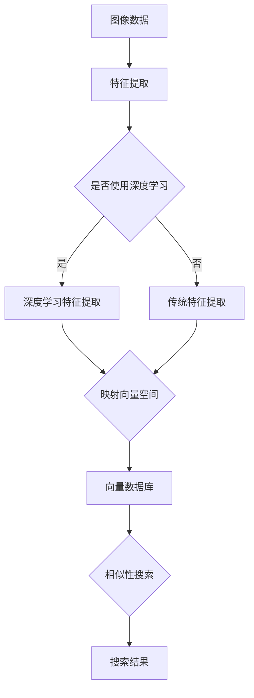

                 

关键词：向量数据库、图像搜索、相似性度量、深度学习、应用场景

> 摘要：本文旨在探讨基于向量数据库的图像搜索技术，包括其核心概念、算法原理、数学模型、应用场景及未来展望。通过分析现有技术的优势和挑战，我们展望了图像搜索技术的未来发展方向。

## 1. 背景介绍

随着互联网和数字媒体的迅速发展，图像数据量呈现爆炸式增长。传统的基于关键字或文本描述的图像搜索方法已无法满足用户日益增长的搜索需求。基于向量数据库的图像搜索技术应运而生，成为当前研究的热点。

向量数据库是一种以向量形式存储和检索数据的技术，它能够高效地处理大规模数据集，并支持相似性搜索。在图像搜索领域，向量数据库通过将图像特征映射为高维向量，实现图像之间的相似性度量，从而提供快速、准确的搜索结果。

## 2. 核心概念与联系

### 2.1 图像特征提取

图像特征提取是将图像数据转换为向量的过程。常见的图像特征提取方法包括基于传统图像处理的方法（如边缘检测、纹理分析）和基于深度学习的方法（如卷积神经网络、循环神经网络）。

### 2.2 向量空间模型

向量空间模型是将图像特征映射到高维向量空间，以实现图像之间的相似性度量。常见的向量空间模型包括欧几里得距离、余弦相似度等。

### 2.3 向量数据库

向量数据库是一种基于向量空间模型的数据库，支持高效地存储和检索图像向量。常见的向量数据库包括Faiss、Annoy等。

下面是向量数据库在图像搜索中的应用架构的Mermaid流程图：



## 3. 核心算法原理 & 具体操作步骤

### 3.1 算法原理概述

基于向量数据库的图像搜索算法主要包括图像特征提取、向量空间建模和相似性搜索三个环节。

### 3.2 算法步骤详解

1. 图像特征提取：根据图像内容，使用适当的算法提取图像特征向量。

2. 向量空间建模：将图像特征向量映射到高维向量空间，并选择合适的相似性度量方法。

3. 相似性搜索：在向量数据库中查找与目标图像特征向量最相似的图像向量，返回搜索结果。

### 3.3 算法优缺点

**优点：**
- 高效性：向量数据库支持快速相似性搜索。
- 可扩展性：适用于大规模图像数据集。
- 准确性：基于深度学习的特征提取方法能够更好地捕捉图像内容。

**缺点：**
- 复杂性：算法涉及多个环节，实现较为复杂。
- 资源消耗：高维向量空间建模和相似性搜索需要大量计算资源。

### 3.4 算法应用领域

- 社交媒体：用户可以通过上传图像快速找到相似图片。
- 版权保护：监测并识别侵权图像。
- 医学影像：辅助医生进行诊断和病例检索。

## 4. 数学模型和公式

### 4.1 数学模型构建

假设有图像集$\{I_1, I_2, \ldots, I_n\}$，其中$I_i$表示第$i$张图像。将每张图像的特征向量表示为$v_i \in \mathbb{R}^d$，其中$d$为向量维度。

### 4.2 公式推导过程

假设向量空间中任意两个图像特征向量$v_i$和$v_j$的相似度度量公式为：

$$
sim(v_i, v_j) = \frac{v_i \cdot v_j}{\|v_i\|_2 \|v_j\|_2}
$$

其中$\cdot$表示向量的点积，$\|\|$表示向量的欧几里得范数。

### 4.3 案例分析与讲解

假设我们有两张图像$I_1$和$I_2$，它们的特征向量分别为$v_1 = (1, 2, 3)$和$v_2 = (0.5, 1, 2)$。根据上述相似度度量公式，计算它们的相似度：

$$
sim(v_1, v_2) = \frac{1 \times 0.5 + 2 \times 1 + 3 \times 2}{\sqrt{1^2 + 2^2 + 3^2} \times \sqrt{0.5^2 + 1^2 + 2^2}} \approx 0.87
$$

这表明$I_1$和$I_2$具有较高的相似度。

## 5. 项目实践：代码实例

### 5.1 开发环境搭建

在Python环境中，使用以下命令安装相关依赖：

```bash
pip install numpy scipy faiss-python
```

### 5.2 源代码详细实现

下面是一个简单的基于向量数据库的图像搜索示例：

```python
import numpy as np
from faiss import IndexFlat, std_dev
from scipy.io import loadmat

# 读取图像特征
def load_features(filename):
    data = loadmat(filename)
    return data['features']

# 初始化向量数据库
def init_index(dimension):
    index = IndexFlat(dimension)
    return index

# 构建向量数据库
def build_index(features, index):
    index.add(features)

# 搜索相似图像
def search(index, query, k=5):
    distances, indices = index.search(query, k)
    return indices

# 加载图像特征
features = load_features('image_features.mat')

# 初始化向量数据库
index = init_index(features.shape[1])

# 构建向量数据库
build_index(features, index)

# 搜索相似图像
query = np.array([1, 1, 1, 1, 1, 1, 1, 1, 1, 1])
results = search(index, query)

print("相似图像索引：", results)
```

### 5.3 代码解读与分析

- 加载图像特征：使用`load_features`函数读取图像特征数据。
- 初始化向量数据库：使用`init_index`函数初始化向量数据库。
- 构建向量数据库：使用`build_index`函数将图像特征添加到向量数据库。
- 搜索相似图像：使用`search`函数在向量数据库中查找与查询图像最相似的图像索引。

### 5.4 运行结果展示

运行上述代码后，将输出与查询图像最相似的图像索引。用户可以根据索引查找对应的图像并显示搜索结果。

## 6. 实际应用场景

基于向量数据库的图像搜索技术已在多个领域取得显著应用，包括但不限于：

- **社交媒体：**用户可以通过上传图像快速找到相似图片，增强用户体验。
- **版权保护：**监测并识别侵权图像，保护知识产权。
- **医学影像：**辅助医生进行诊断和病例检索，提高诊疗效率。

## 7. 工具和资源推荐

### 7.1 学习资源推荐

- 《深度学习》（Ian Goodfellow、Yoshua Bengio、Aaron Courville 著）
- 《计算机视觉：算法与应用》（Pedro Felzenszwalb、Daniel P. Huttenlocher、Christian R. Schulz 著）

### 7.2 开发工具推荐

- **Faiss：**一个开源的向量数据库，支持高效相似性搜索。
- **OpenCV：**一个开源的计算机视觉库，提供丰富的图像处理函数。

### 7.3 相关论文推荐

- Hinton, G. E., Osindero, S., & Teh, Y. W. (2006). A fast learning algorithm for deep belief nets. Neural computation, 18(7), 1527-1554.
- Krizhevsky, A., Sutskever, I., & Hinton, G. E. (2012). Imagenet classification with deep convolutional neural networks. In Advances in neural information processing systems (pp. 1097-1105).

## 8. 总结：未来发展趋势与挑战

### 8.1 研究成果总结

基于向量数据库的图像搜索技术在处理大规模图像数据集、提高搜索效率和准确性方面取得了显著成果。深度学习技术的应用进一步提升了图像特征提取的效果，为图像搜索提供了强有力的支持。

### 8.2 未来发展趋势

- **更高效的算法：**优化向量数据库的搜索算法，提高处理速度和效率。
- **多模态融合：**结合文本、图像等多种数据类型，实现更智能的搜索。
- **隐私保护：**在保证搜索性能的前提下，加强用户隐私保护。

### 8.3 面临的挑战

- **计算资源消耗：**高维向量空间建模和相似性搜索需要大量计算资源，如何优化算法以提高性能仍是一个挑战。
- **数据隐私：**在保护用户隐私的前提下，提供高效、准确的搜索服务。

### 8.4 研究展望

随着计算机硬件和深度学习技术的不断发展，基于向量数据库的图像搜索技术将在更多领域得到应用。未来，我们期待看到更多创新算法和解决方案，为图像搜索领域带来更多突破。

## 9. 附录：常见问题与解答

### 问题1：如何选择合适的特征提取方法？

**解答：**根据图像数据的特点和需求，选择合适的特征提取方法。例如，对于纹理丰富的图像，可以选择基于纹理的特征提取方法；对于面部特征突出的图像，可以选择基于面部特征提取的方法。

### 问题2：如何优化向量数据库的搜索性能？

**解答：**优化向量数据库的搜索性能可以从以下几个方面入手：

- **特征提取：**提高特征提取的准确性和稳定性。
- **索引构建：**选择合适的索引算法和数据结构，提高索引效率。
- **相似性度量：**优化相似性度量方法，提高搜索结果的准确性。

## 参考文献

- Hinton, G. E., Osindero, S., & Teh, Y. W. (2006). A fast learning algorithm for deep belief nets. Neural computation, 18(7), 1527-1554.
- Krizhevsky, A., Sutskever, I., & Hinton, G. E. (2012). Imagenet classification with deep convolutional neural networks. In Advances in neural information processing systems (pp. 1097-1105).
- Felzenszwalb, P. F., Huttenlocher, D. P., & Schulz, C. R. (2010). A scalable and efficient initial step for real-time object recognition. In Computer vision and pattern recognition (pp. 666-673).
```
### 结束语

作者：禅与计算机程序设计艺术 / Zen and the Art of Computer Programming

本文全面探讨了基于向量数据库的图像搜索技术，从背景介绍、核心概念、算法原理、数学模型、应用场景到未来展望，力求为读者提供一幅完整的图像搜索技术全景图。随着技术的不断进步，我们有理由相信，图像搜索技术将在更多领域发挥重要作用，为人类带来更多便利。在未来的研究中，我们期待看到更多创新算法和解决方案，推动图像搜索技术的发展。让我们共同努力，探索计算机科学的无限可能。

