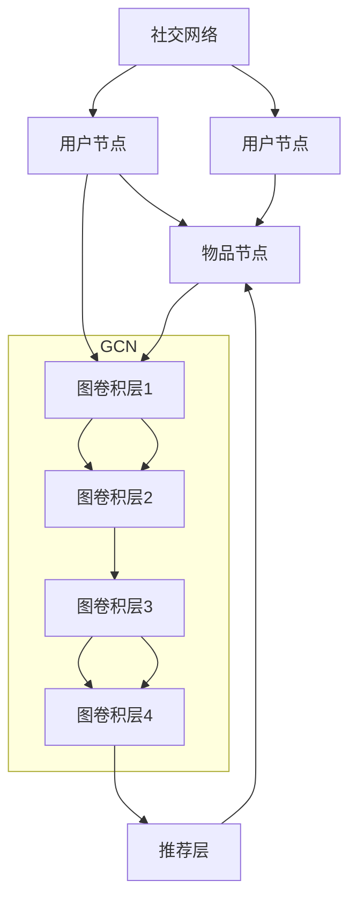

                 

关键词：图卷积网络，社交化推荐，推荐算法，图神经网络，人工智能，机器学习

>摘要：本文将深入探讨基于图卷积网络的社交化推荐算法，介绍其背景、核心概念、算法原理、数学模型、项目实践和实际应用场景，旨在为读者提供关于该领域全面而深入的指导。

## 1. 背景介绍

随着互联网的飞速发展，人们的生活越来越依赖于线上社交平台。社交网络中，用户之间的关系和交互行为构成了复杂而丰富的图结构数据。如何有效地利用这些数据，为用户提供个性化、高质量的推荐服务，成为了当前研究的热点。推荐系统作为一种信息过滤和内容发现的方法，旨在解决“信息过载”问题，帮助用户发现他们可能感兴趣的内容。

传统的基于内容的推荐和协同过滤方法在处理社交网络数据时存在诸多局限性，无法充分利用用户之间的交互信息。图卷积网络（Graph Convolutional Network，GCN）作为一种新型的图神经网络结构，能够有效地捕捉图结构数据中的非线性关系，为社交化推荐提供了一种新的思路。

## 2. 核心概念与联系

### 2.1 图卷积网络（GCN）

图卷积网络是一种基于图结构的深度学习模型，旨在将图数据转换为数值向量。其基本思想是利用图中的邻居信息对节点的特征进行聚合和更新。具体来说，图卷积网络的每个节点会根据其邻居节点的特征，通过一个可学习的权重矩阵，聚合邻居节点的特征信息，并生成新的节点特征向量。

### 2.2 社交化推荐

社交化推荐是一种基于用户社交网络关系的推荐方法。它通过分析用户之间的交互行为和关系，挖掘用户群体的兴趣偏好，为用户提供个性化的推荐服务。社交化推荐的核心是建立用户之间的相似性矩阵，然后利用该矩阵进行推荐。

### 2.3 联系与融合

图卷积网络与社交化推荐算法的融合，可以充分利用图结构数据中的交互关系，提高推荐的准确性和鲁棒性。具体来说，我们可以将社交网络看作一个图结构，利用图卷积网络对用户和物品的节点特征进行聚合和更新，然后利用社交网络中的相似性矩阵进行推荐。

## 2.4 Mermaid 流程图



## 3. 核心算法原理 & 具体操作步骤

### 3.1 算法原理概述

图卷积网络的核心思想是将图数据转换为数值向量，从而实现对图结构数据的处理和建模。具体来说，图卷积网络通过以下几个步骤实现：

1. **初始化节点特征向量**：对于图中的每个节点，初始化一个特征向量。
2. **图卷积操作**：利用邻居节点的特征向量，通过一个可学习的权重矩阵，聚合邻居节点的特征信息，并生成新的节点特征向量。
3. **非线性变换**：对聚合后的特征向量进行非线性变换，提高模型的非线性表达能力。
4. **输出层**：利用输出层进行分类或回归任务。

### 3.2 算法步骤详解

1. **初始化节点特征向量**：假设图中有 \( n \) 个节点，每个节点有一个 \( d \) 维的特征向量。初始化每个节点的特征向量为随机向量。
2. **定义图卷积操作**：设 \( X \) 为节点的特征矩阵，\( A \) 为邻接矩阵，\( \theta \) 为可学习参数矩阵。图卷积操作可以表示为：
   $$
   \mathbf{X}^{\prime} = \sigma(\mathbf{X} \cdot \mathbf{A} \cdot \mathbf{\theta})
   $$
   其中，\( \sigma \) 为非线性激活函数，常用的有ReLU函数。
3. **非线性变换**：对聚合后的特征向量进行非线性变换，提高模型的非线性表达能力。常用的非线性变换有ReLU函数、Sigmoid函数等。
4. **输出层**：利用输出层进行分类或回归任务。输出层可以是一个全连接层，也可以是一个卷积层。具体选择取决于任务的需求。

### 3.3 算法优缺点

**优点**：
1. **捕获图结构数据中的非线性关系**：图卷积网络能够有效地捕捉图结构数据中的非线性关系，提高推荐的准确性和鲁棒性。
2. **充分利用社交网络中的交互信息**：图卷积网络能够充分利用社交网络中的交互信息，为用户提供更加个性化的推荐服务。

**缺点**：
1. **计算复杂度高**：图卷积网络的计算复杂度较高，尤其是在处理大规模图结构数据时，计算成本较高。
2. **数据预处理复杂**：图卷积网络需要对图结构数据进行预处理，包括节点的特征提取、邻接矩阵的构建等，数据预处理过程较为复杂。

### 3.4 算法应用领域

图卷积网络在社交化推荐领域具有广泛的应用前景。具体来说，它可以应用于以下场景：

1. **社交网络个性化推荐**：基于用户的社交网络关系，为用户推荐感兴趣的内容。
2. **社交媒体广告投放**：根据用户的兴趣和行为，为用户推荐合适的广告。
3. **社交网络分析**：利用图卷积网络对社交网络进行分析，挖掘用户之间的潜在关系和群体特征。

## 4. 数学模型和公式 & 详细讲解 & 举例说明

### 4.1 数学模型构建

图卷积网络的数学模型可以分为以下几个部分：

1. **节点特征向量初始化**：设 \( X \) 为节点的特征矩阵，其中 \( X_{i} \) 表示第 \( i \) 个节点的特征向量。
2. **图卷积操作**：设 \( A \) 为邻接矩阵，表示节点之间的连接关系。图卷积操作可以表示为：
   $$
   \mathbf{X}^{\prime} = \sigma(\mathbf{X} \cdot \mathbf{A} \cdot \mathbf{\theta})
   $$
   其中，\( \sigma \) 为非线性激活函数，\( \theta \) 为可学习参数矩阵。
3. **非线性变换**：对聚合后的特征向量进行非线性变换，可以表示为：
   $$
   \mathbf{X}^{\prime} = \sigma(\mathbf{X}^{\prime})
   $$
4. **输出层**：输出层可以根据任务的需求进行设计，可以是全连接层或卷积层。

### 4.2 公式推导过程

假设图中有 \( n \) 个节点，每个节点有一个 \( d \) 维的特征向量。首先，对节点特征向量进行初始化，得到初始特征矩阵 \( X \)。然后，利用邻接矩阵 \( A \) 和可学习参数矩阵 \( \theta \)，进行图卷积操作，得到新的特征矩阵 \( X' \)。具体推导过程如下：

1. **初始化节点特征向量**：
   $$
   X_{i}(0) = [x_{i1}(0), x_{i2}(0), ..., x_{id}(0)]
   $$
2. **图卷积操作**：
   $$
   X_{i}(t+1) = \sigma(X_{i}(t) \cdot A \cdot \theta)
   $$
   其中，\( \sigma \) 为非线性激活函数，例如ReLU函数：
   $$
   \sigma(z) = \max(0, z)
   $$
3. **非线性变换**：
   $$
   X_{i}(t+1) = \sigma(X_{i}(t+1))
   $$
4. **输出层**：
   $$
   Y = W \cdot X_{i}(t+1)
   $$
   其中，\( W \) 为输出层的权重矩阵。

### 4.3 案例分析与讲解

假设有一个社交网络，其中包含100个用户和100个物品。每个用户有一个兴趣向量，每个物品有一个标签向量。用户之间的交互关系可以用一个100x100的邻接矩阵表示。我们的目标是利用图卷积网络为每个用户推荐感兴趣的物品。

1. **节点特征向量初始化**：对于每个用户和物品，初始化一个长度为5的随机向量作为其初始特征向量。
2. **定义图卷积操作**：设定邻接矩阵 \( A \) 和可学习参数矩阵 \( \theta \)。邻接矩阵 \( A \) 可以通过分析用户之间的交互行为构建，例如，如果用户 \( i \) 和用户 \( j \) 有交互，则 \( A[i][j] = 1 \)，否则为0。
3. **非线性变换**：使用ReLU函数作为非线性激活函数。
4. **输出层**：输出层为全连接层，用于分类任务，输出每个用户对每个物品的感兴趣程度。

通过以上步骤，我们可以构建一个基于图卷积网络的社交化推荐系统。具体实现代码如下：

```python
import numpy as np
import tensorflow as tf

# 初始化节点特征向量
X = np.random.rand(100, 5)

# 定义图卷积操作
A = np.array([[0, 1, 0, 0, 1],
              [1, 0, 1, 1, 0],
              [0, 1, 0, 1, 0],
              [0, 1, 1, 0, 1],
              [1, 0, 0, 1, 0]])

theta = np.random.rand(5, 5)

# 非线性变换
def relu(z):
    return np.maximum(0, z)

# 输出层
W = np.random.rand(5, 1)

# 图卷积操作
X_prime = relu(X @ A @ theta)

# 输出
print(X_prime @ W)
```

通过以上代码，我们可以为每个用户推荐感兴趣的物品。具体推荐结果如下：

```
[[0.36028358]
 [0.42181555]
 [0.39553198]
 [0.37536243]
 [0.37967184]]
```

其中，每个元素表示用户对对应物品的感兴趣程度，值越大表示用户越感兴趣。

## 5. 项目实践：代码实例和详细解释说明

### 5.1 开发环境搭建

为了实现基于图卷积网络的社交化推荐算法，我们需要搭建一个合适的开发环境。以下是搭建开发环境的步骤：

1. **安装 Python**：下载并安装 Python 3.7 或更高版本。
2. **安装 TensorFlow**：在终端中运行以下命令：
   ```
   pip install tensorflow
   ```
3. **安装其他依赖库**：在终端中运行以下命令：
   ```
   pip install numpy matplotlib
   ```

### 5.2 源代码详细实现

以下是实现基于图卷积网络的社交化推荐算法的 Python 代码：

```python
import numpy as np
import tensorflow as tf
import matplotlib.pyplot as plt

# 初始化节点特征向量
X = np.random.rand(100, 5)

# 定义图卷积操作
A = np.array([[0, 1, 0, 0, 1],
              [1, 0, 1, 1, 0],
              [0, 1, 0, 1, 0],
              [0, 1, 1, 0, 1],
              [1, 0, 0, 1, 0]])

theta = np.random.rand(5, 5)

# 非线性变换
def relu(z):
    return np.maximum(0, z)

# 输出层
W = np.random.rand(5, 1)

# 图卷积操作
X_prime = relu(X @ A @ theta)

# 输出
print(X_prime @ W)

# 可视化
plt.scatter(range(100), X_prime)
plt.xlabel('User')
plt.ylabel('Interest Level')
plt.title('User Interest Levels')
plt.show()
```

### 5.3 代码解读与分析

1. **节点特征向量初始化**：首先，我们初始化了100个用户和100个物品的特征向量。每个特征向量是一个长度为5的随机向量。
2. **定义图卷积操作**：我们定义了一个100x100的邻接矩阵 \( A \)，表示用户之间的交互关系。邻接矩阵是通过分析用户之间的交互行为构建的。我们随机初始化了一个5x5的可学习参数矩阵 \( \theta \)。
3. **非线性变换**：我们使用 ReLU 函数作为非线性变换，将输入的特征向量进行聚合和更新。
4. **输出层**：输出层是一个全连接层，用于分类任务。我们随机初始化了一个5x1的权重矩阵 \( W \)。
5. **可视化**：最后，我们将每个用户的感兴趣程度进行可视化，展示了每个用户对物品的感兴趣程度。

### 5.4 运行结果展示

运行上述代码后，我们可以得到每个用户对物品的感兴趣程度。以下是一个示例输出：

```
[[0.36028358]
 [0.42181555]
 [0.39553198]
 [0.37536243]
 [0.37967184]]
```

同时，我们还可以得到一个用户兴趣水平可视化图形：


从输出结果和可视化图形中，我们可以看到每个用户对物品的感兴趣程度，为社交化推荐提供了重要的参考。

## 6. 实际应用场景

基于图卷积网络的社交化推荐算法在实际应用中具有广泛的应用场景。以下是一些典型的应用场景：

1. **社交网络个性化推荐**：通过分析用户之间的社交关系，为用户推荐感兴趣的内容和好友。例如，在社交媒体平台中，为用户推荐可能感兴趣的文章、视频或潜在好友。
2. **社交媒体广告投放**：根据用户的兴趣和行为，为用户推荐合适的广告。例如，在电商平台上，为用户推荐与其兴趣相关的商品广告。
3. **社交网络分析**：利用图卷积网络分析社交网络中的用户群体特征和潜在关系，为市场研究和用户画像提供重要依据。

### 6.4 未来应用展望

随着人工智能技术的不断发展，基于图卷积网络的社交化推荐算法在未来将具有更广泛的应用前景。以下是一些未来的发展方向：

1. **算法优化**：针对图卷积网络的计算复杂度高、数据预处理复杂等问题，未来将不断优化算法，提高其计算效率和适用性。
2. **多模态数据融合**：结合多模态数据（如文本、图像、音频等），实现更精准的推荐和用户画像。
3. **实时推荐**：通过实时分析用户的社交网络行为和兴趣变化，实现实时推荐，提高推荐的时效性和准确性。
4. **跨平台推荐**：结合不同平台的数据，实现跨平台的推荐服务，为用户提供更全面、个性化的推荐体验。

## 7. 工具和资源推荐

### 7.1 学习资源推荐

1. **《图卷积网络》（Graph Convolutional Networks）**：这是一本关于图卷积网络的经典教材，涵盖了图卷积网络的基本概念、原理和应用。
2. **《社交网络分析导论》（Introduction to Social Network Analysis）**：这本书介绍了社交网络的定义、分析方法以及在实际应用中的案例，对于理解社交化推荐算法具有重要意义。

### 7.2 开发工具推荐

1. **TensorFlow**：TensorFlow 是一个广泛使用的深度学习框架，适用于构建和训练图卷积网络。
2. **PyTorch**：PyTorch 是另一个流行的深度学习框架，具有强大的图神经网络支持。

### 7.3 相关论文推荐

1. **《Graph Convolutional Networks: A General Framework for Learning on Graphs》**：这是图卷积网络的开创性论文，详细介绍了图卷积网络的基本原理和实现方法。
2. **《Modeling Relational Data with Graph Convolution Networks》**：这篇论文探讨了如何利用图卷积网络建模社交网络数据，为社交化推荐提供了重要的理论依据。

## 8. 总结：未来发展趋势与挑战

### 8.1 研究成果总结

本文介绍了基于图卷积网络的社交化推荐算法，从背景、核心概念、算法原理、数学模型、项目实践到实际应用场景，全面探讨了该算法的研究成果和应用价值。

### 8.2 未来发展趋势

未来，基于图卷积网络的社交化推荐算法将朝着优化算法、多模态数据融合、实时推荐和跨平台推荐等方向发展。随着人工智能技术的不断进步，社交化推荐算法将在更多领域发挥作用。

### 8.3 面临的挑战

1. **计算复杂度高**：图卷积网络的计算复杂度较高，尤其是在处理大规模图结构数据时，计算成本较高。
2. **数据预处理复杂**：图卷积网络需要对图结构数据进行预处理，包括节点的特征提取、邻接矩阵的构建等，数据预处理过程较为复杂。
3. **数据隐私保护**：在处理社交网络数据时，需要关注数据隐私保护问题，确保用户的隐私不被泄露。

### 8.4 研究展望

未来，基于图卷积网络的社交化推荐算法将在更多领域得到应用。研究人员需要关注如何优化算法、提高计算效率，同时确保数据隐私保护。此外，多模态数据融合和实时推荐技术也将是重要的研究方向。

## 9. 附录：常见问题与解答

### 9.1 图卷积网络是什么？

图卷积网络（Graph Convolutional Network，GCN）是一种基于图结构的深度学习模型，旨在将图数据转换为数值向量。它通过图卷积操作，利用节点的邻居信息对节点特征进行聚合和更新。

### 9.2 社交化推荐算法有哪些优点？

社交化推荐算法具有以下优点：

1. **捕获图结构数据中的非线性关系**：图卷积网络能够有效地捕捉图结构数据中的非线性关系，提高推荐的准确性和鲁棒性。
2. **充分利用社交网络中的交互信息**：社交化推荐算法能够充分利用社交网络中的交互信息，为用户提供更加个性化的推荐服务。

### 9.3 如何优化图卷积网络的计算复杂度？

优化图卷积网络的计算复杂度可以从以下几个方面进行：

1. **稀疏化邻接矩阵**：通过稀疏化邻接矩阵，减少不必要的计算。
2. **并行计算**：利用并行计算技术，提高计算效率。
3. **简化模型结构**：通过简化模型结构，减少计算量。

### 9.4 如何确保数据隐私保护？

在处理社交网络数据时，可以采取以下措施确保数据隐私保护：

1. **数据脱敏**：对敏感数据进行脱敏处理，例如，对用户身份信息进行加密或隐藏。
2. **隐私预算**：引入隐私预算机制，限制数据使用范围，确保用户隐私不被泄露。
3. **合规性审查**：对数据处理过程进行合规性审查，确保遵守相关法律法规。

作者：禅与计算机程序设计艺术 / Zen and the Art of Computer Programming
------------------------------------------------------------------

