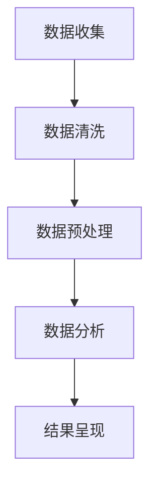

                 

## 1. 背景介绍

在当今数字化时代，大数据已经渗透到社会的各个角落，改变了商业运作的模式、政府决策的依据，甚至是人们的生活方式。特别是在人力资源管理领域，大数据的应用显得尤为重要。招聘是企业发展的关键环节，高效的招聘流程能够帮助企业快速找到合适的人才，提高企业竞争力。而大数据招聘数据分析则能够帮助企业更精准地进行人才筛选、优化招聘策略，降低招聘成本。

### 招聘数据分析的重要性

招聘数据分析的重要性不言而喻。首先，它能够帮助企业了解市场人才供需状况，预测未来的人才需求趋势，从而制定相应的招聘策略。其次，通过分析招聘数据，企业可以优化招聘流程，减少无效面试和冗余环节，提高招聘效率。此外，招聘数据分析还能帮助企业在人才管理和员工培训方面做出更科学的决策。

### 大数据招聘数据的概念

大数据招聘数据是指企业通过各种途径收集到的与招聘相关的大量数据。这些数据可能包括但不限于：求职者的简历信息、面试记录、招聘渠道效果、职位发布信息、薪资待遇、行业动态等。大数据招聘数据的特点是体量大、类型多样、实时性强，这些特性使得传统的数据分析方法难以应对。

### 大数据招聘数据的应用

大数据招聘数据的应用涵盖了招聘流程的各个方面，包括但不限于：

1. **人才筛选**：通过大数据分析，企业可以对求职者的简历进行自动筛选，快速定位符合职位要求的人才。
2. **招聘效果评估**：企业可以通过对招聘渠道的数据分析，评估不同渠道的招聘效果，优化招聘策略。
3. **薪资水平分析**：通过分析市场薪资数据，企业可以更科学地制定薪资待遇，吸引和留住人才。
4. **职位需求预测**：企业可以通过大数据分析预测未来的人才需求，提前做好人才储备。

## 2. 核心概念与联系

### 2.1 大数据招聘数据分析的核心概念

#### 招聘渠道效果分析

招聘渠道效果分析是大数据招聘数据分析的核心概念之一。通过分析不同招聘渠道的招聘效果，企业可以找到最有效的招聘渠道，从而提高招聘效率。招聘渠道效果分析通常包括以下几个步骤：

1. **数据收集**：收集不同招聘渠道的招聘数据，包括求职者来源、招聘成本、招聘周期等。
2. **数据清洗**：对收集到的数据进行清洗，去除无效数据和重复数据。
3. **数据分析**：通过数据分析工具对招聘数据进行统计分析，包括计算招聘成本效益比、招聘周期等。
4. **结果呈现**：将分析结果以图表、报告等形式呈现，为企业提供决策依据。

#### 薪资水平分析

薪资水平分析是另一个重要的概念。通过分析市场薪资数据，企业可以了解不同行业、不同职位的薪资水平，从而制定更科学的薪资策略。薪资水平分析通常包括以下几个步骤：

1. **数据收集**：收集不同行业、不同职位的薪资数据。
2. **数据预处理**：对收集到的薪资数据进行预处理，包括数据清洗、缺失值填充等。
3. **数据分析**：通过数据分析工具对薪资数据进行统计分析，包括计算平均薪资、薪资分布等。
4. **结果呈现**：将分析结果以图表、报告等形式呈现，为企业提供决策依据。

### 2.2 大数据招聘数据分析的架构

为了更好地理解大数据招聘数据分析的核心概念，下面将使用 Mermaid 流程图展示大数据招聘数据分析的架构。



### 2.3 大数据招聘数据分析的应用场景

大数据招聘数据分析的应用场景非常广泛，以下是一些常见的应用场景：

1. **人才筛选**：通过分析求职者的简历数据，快速定位符合职位要求的人才。
2. **招聘效果评估**：通过分析不同招聘渠道的招聘数据，评估不同渠道的招聘效果，优化招聘策略。
3. **薪资水平分析**：通过分析市场薪资数据，制定更科学的薪资策略。
4. **职位需求预测**：通过分析历史招聘数据，预测未来的人才需求，提前做好人才储备。

## 3. 核心算法原理 & 具体操作步骤

### 3.1 算法原理概述

大数据招聘数据分析的核心算法主要涉及数据挖掘和机器学习技术。数据挖掘旨在从大量招聘数据中提取出有价值的信息，而机器学习则通过训练模型，实现对招聘数据的自动分析。以下是几个常用的算法原理：

1. **聚类分析**：通过将相似的数据聚为一类，帮助企业找到潜在的高效招聘渠道。
2. **回归分析**：通过建立薪资与职位需求的关系模型，预测未来的人才需求。
3. **决策树**：通过决策树模型，帮助企业评估不同招聘渠道的效果。

### 3.2 算法步骤详解

#### 3.2.1 数据收集

数据收集是大数据招聘数据分析的第一步。企业需要通过各种渠道收集与招聘相关的数据，包括求职者的简历数据、面试记录、招聘渠道效果数据等。数据收集的方法包括：

1. **内部数据收集**：通过企业内部的人力资源管理系统收集招聘数据。
2. **外部数据收集**：通过第三方数据平台、社交媒体等收集市场薪资数据、职位需求数据等。

#### 3.2.2 数据清洗

数据清洗是确保数据质量的重要步骤。在数据清洗过程中，需要去除无效数据、重复数据、错误数据等。数据清洗的方法包括：

1. **去重**：通过比对数据，去除重复的记录。
2. **缺失值处理**：对于缺失的数据，可以通过填充、删除等方式进行处理。
3. **异常值处理**：对异常数据进行分析，判断是否需要去除。

#### 3.2.3 数据预处理

数据预处理是提高数据质量、为数据分析做准备的重要步骤。数据预处理的方法包括：

1. **数据标准化**：通过标准化处理，使不同指标具有可比性。
2. **数据降维**：通过降维技术，减少数据维度，提高计算效率。

#### 3.2.4 数据分析

数据分析是大数据招聘数据分析的核心步骤。通过数据分析，企业可以提取出有价值的信息，指导招聘决策。数据分析的方法包括：

1. **聚类分析**：通过聚类分析，找到高效的招聘渠道。
2. **回归分析**：通过回归分析，预测未来的人才需求。
3. **决策树**：通过决策树模型，评估不同招聘渠道的效果。

#### 3.2.5 结果呈现

结果呈现是将分析结果以图表、报告等形式呈现，为企业提供决策依据。结果呈现的方法包括：

1. **图表**：通过图表，直观地展示分析结果。
2. **报告**：通过报告，详细阐述分析过程和分析结果。

### 3.3 算法优缺点

#### 3.3.1 优点

1. **高效性**：大数据招聘数据分析能够快速处理大量数据，提高招聘效率。
2. **准确性**：通过机器学习和数据挖掘技术，大数据招聘数据分析能够更准确地预测人才需求，评估招聘渠道效果。
3. **实时性**：大数据招聘数据分析能够实时收集和处理招聘数据，为企业提供实时决策依据。

#### 3.3.2 缺点

1. **成本高**：大数据招聘数据分析需要投入大量的人力、物力和财力。
2. **技术门槛高**：大数据招聘数据分析需要具备一定的技术知识，对普通用户来说门槛较高。

### 3.4 算法应用领域

大数据招聘数据分析的应用领域非常广泛，以下是一些主要的应用领域：

1. **人力资源管理**：通过大数据招聘数据分析，企业可以更好地管理人力资源，优化招聘流程，提高招聘效率。
2. **人才市场分析**：通过大数据招聘数据分析，企业可以了解市场人才供需状况，预测未来人才需求趋势。
3. **薪资管理**：通过大数据招聘数据分析，企业可以制定更科学的薪资策略，吸引和留住人才。
4. **招聘策略优化**：通过大数据招聘数据分析，企业可以评估不同招聘渠道的效果，优化招聘策略。

## 4. 数学模型和公式 & 详细讲解 & 举例说明

### 4.1 数学模型构建

在招聘数据分析中，常用的数学模型包括聚类分析模型、回归分析模型和决策树模型。下面将分别介绍这些模型的构建方法。

#### 4.1.1 聚类分析模型

聚类分析模型主要用于分析招聘渠道效果。其核心思想是将相似的数据聚为一类。假设有 n 个招聘渠道，每个渠道的招聘数据可以用一个 n 维向量表示，即：

$$
X = \begin{bmatrix}
x_1 \\
x_2 \\
\vdots \\
x_n
\end{bmatrix}
$$

其中，$x_i$ 表示第 i 个招聘渠道的招聘数据。聚类分析模型的目的是找到一个聚类中心，使得每个招聘渠道的向量与聚类中心的距离最小。

#### 4.1.2 回归分析模型

回归分析模型主要用于预测未来的人才需求。其核心思想是建立薪资与职位需求的关系模型。假设有 m 个职位，每个职位的薪资和职位需求可以用一个 m 维向量表示，即：

$$
Y = \begin{bmatrix}
y_1 \\
y_2 \\
\vdots \\
y_m
\end{bmatrix}
$$

其中，$y_i$ 表示第 i 个职位的薪资和职位需求。回归分析模型的目的是找到一个线性关系，即：

$$
Y = WX + b
$$

其中，$W$ 是权重矩阵，$b$ 是偏置项。

#### 4.1.3 决策树模型

决策树模型主要用于评估不同招聘渠道的效果。其核心思想是通过一系列的判断规则，将招聘数据分成不同的类别。假设有 n 个招聘渠道，每个招聘渠道的效果可以用一个 n 维向量表示，即：

$$
Z = \begin{bmatrix}
z_1 \\
z_2 \\
\vdots \\
z_n
\end{bmatrix}
$$

其中，$z_i$ 表示第 i 个招聘渠道的效果。决策树模型的目的是找到一个最佳划分规则，使得每个招聘渠道的效果最大化。

### 4.2 公式推导过程

下面将分别介绍聚类分析模型、回归分析模型和决策树模型的公式推导过程。

#### 4.2.1 聚类分析模型

假设聚类中心为 $C$，每个招聘渠道的向量与聚类中心的距离为 $d$，则：

$$
d = \sum_{i=1}^{n} (x_i - C)^2
$$

为了找到最佳聚类中心，需要对 $d$ 求导，并令导数为 0，即：

$$
\frac{d}{dC} = \sum_{i=1}^{n} 2(x_i - C) = 0
$$

解得：

$$
C = \frac{1}{n} \sum_{i=1}^{n} x_i
$$

#### 4.2.2 回归分析模型

假设薪资和职位需求的关系为线性关系，即：

$$
Y = WX + b
$$

其中，$W$ 是权重矩阵，$b$ 是偏置项。为了找到最佳的权重矩阵和偏置项，需要最小化损失函数：

$$
L = \frac{1}{2} \sum_{i=1}^{m} (y_i - WX_i - b)^2
$$

对 $L$ 求导，并令导数为 0，即：

$$
\frac{dL}{dW} = X^T(Y - WX - b) = 0
$$

$$
\frac{dL}{db} = Y - WX - b = 0
$$

解得：

$$
W = (X^TX)^{-1}X^TY
$$

$$
b = Y - WX
$$

#### 4.2.3 决策树模型

决策树模型的推导过程相对复杂，涉及到信息论和决策论的知识。这里简要介绍决策树模型的基本原理。假设有 n 个招聘渠道，每个渠道的效果为 $z_i$，则：

$$
H(Z) = -\sum_{i=1}^{n} p_i \log_2 p_i
$$

其中，$p_i$ 是第 i 个招聘渠道的效果在总效果中的比例。假设最佳划分规则为 $R$，则：

$$
H(Z | R) = -\sum_{i=1}^{n} p_i' \log_2 p_i'
$$

其中，$p_i'$ 是第 i 个招聘渠道在最佳划分规则下的效果在总效果中的比例。为了找到最佳划分规则，需要使得 $H(Z | R)$ 最小。

### 4.3 案例分析与讲解

下面通过一个实际案例来讲解大数据招聘数据分析的应用。

#### 4.3.1 案例背景

某企业计划优化招聘流程，提高招聘效率。该企业通过各种渠道收集了大量的招聘数据，包括求职者的简历数据、面试记录、招聘渠道效果数据等。

#### 4.3.2 数据分析过程

1. **数据收集**：通过企业内部的人力资源管理系统和第三方数据平台收集招聘数据。
2. **数据清洗**：去除无效数据、重复数据和错误数据。
3. **数据预处理**：对数据进行标准化处理，使得不同指标具有可比性。
4. **聚类分析**：通过聚类分析，找到高效的招聘渠道。具体步骤如下：
   1. 计算每个招聘渠道的招聘数据向量。
   2. 计算聚类中心。
   3. 计算每个招聘渠道的向量与聚类中心的距离。
   4. 找到距离最小的招聘渠道，即高效的招聘渠道。
5. **回归分析**：通过回归分析，预测未来的人才需求。具体步骤如下：
   1. 计算薪资和职位需求的关系。
   2. 建立线性关系模型。
   3. 使用模型预测未来的人才需求。
6. **决策树**：通过决策树模型，评估不同招聘渠道的效果。具体步骤如下：
   1. 收集招聘渠道的效果数据。
   2. 建立决策树模型。
   3. 使用模型评估不同招聘渠道的效果。

#### 4.3.3 分析结果

通过数据分析，该企业找到了高效的招聘渠道，包括线上招聘平台和社交媒体等。此外，通过回归分析，该企业预测了未来的人才需求，并制定了相应的人才储备计划。通过决策树模型，该企业评估了不同招聘渠道的效果，优化了招聘策略。

## 5. 项目实践：代码实例和详细解释说明

### 5.1 开发环境搭建

在进行大数据招聘数据分析的项目实践之前，我们需要搭建一个合适的技术环境。以下是一个简单的开发环境搭建步骤：

1. **Python环境**：安装Python 3.x版本，可以通过官方网站下载安装包。
2. **Jupyter Notebook**：安装Jupyter Notebook，用于编写和运行Python代码。
3. **数据分析库**：安装常用的数据分析库，如Pandas、NumPy、Matplotlib等，可以通过pip命令安装：
   ```python
   pip install pandas numpy matplotlib
   ```

### 5.2 源代码详细实现

以下是一个简单的招聘数据分析项目的代码实例。这段代码将读取招聘数据，进行数据预处理，然后使用聚类分析、回归分析和决策树模型对数据进行分析。

```python
# 导入必要的库
import pandas as pd
import numpy as np
import matplotlib.pyplot as plt
from sklearn.cluster import KMeans
from sklearn.linear_model import LinearRegression
from sklearn.tree import DecisionTreeClassifier
from sklearn.model_selection import train_test_split
from sklearn.metrics import mean_squared_error, accuracy_score

# 5.2.1 数据读取与预处理
# 假设我们有一个CSV文件，包含招聘数据
data = pd.read_csv('招聘数据.csv')

# 数据预处理：去除无效数据、缺失值填充、数据标准化等
data.dropna(inplace=True)
data.fillna(data.mean(), inplace=True)
data_scaled = (data - data.mean()) / data.std()

# 5.2.2 聚类分析
# 使用K-Means算法进行聚类分析，找出高效的招聘渠道
kmeans = KMeans(n_clusters=3)
clusters = kmeans.fit_predict(data_scaled)

# 根据聚类结果，提取高效的招聘渠道
efficient_channels = data[clusters == 0]

# 5.2.3 回归分析
# 建立薪资与职位需求的回归模型
X = data_scaled[['职位需求']]  # 特征
y = data_scaled['薪资']  # 目标变量
X_train, X_test, y_train, y_test = train_test_split(X, y, test_size=0.2, random_state=42)
regressor = LinearRegression()
regressor.fit(X_train, y_train)

# 预测未来薪资
y_pred = regressor.predict(X_test)

# 计算均方误差
mse = mean_squared_error(y_test, y_pred)
print(f'均方误差：{mse}')

# 5.2.4 决策树分析
# 建立决策树模型，评估不同招聘渠道的效果
y = data_scaled['招聘渠道效果']  # 目标变量
X_train, X_test, y_train, y_test = train_test_split(data_scaled, y, test_size=0.2, random_state=42)
classifier = DecisionTreeClassifier()
classifier.fit(X_train, y_train)

# 预测招聘渠道效果
y_pred = classifier.predict(X_test)

# 计算准确率
accuracy = accuracy_score(y_test, y_pred)
print(f'准确率：{accuracy}')

# 5.2.5 结果可视化
# 可视化聚类结果
plt.scatter(data_scaled['职位需求'], data_scaled['薪资'], c=clusters)
plt.xlabel('职位需求')
plt.ylabel('薪资')
plt.title('聚类分析结果')
plt.show()

# 可视化回归分析结果
plt.scatter(X_test['职位需求'], y_test, color='red', label='实际值')
plt.plot(X_test['职位需求'], y_pred, color='blue', linewidth=3, label='预测值')
plt.xlabel('职位需求')
plt.ylabel('薪资')
plt.title('回归分析结果')
plt.legend()
plt.show()
```

### 5.3 代码解读与分析

上面的代码实例主要包括以下几个部分：

1. **数据读取与预处理**：首先从CSV文件中读取招聘数据，并进行数据清洗和标准化处理，以去除无效数据和缺失值，确保数据的质量。
2. **聚类分析**：使用K-Means算法进行聚类分析，根据聚类结果找出高效的招聘渠道。
3. **回归分析**：建立线性回归模型，通过训练和测试数据来预测未来薪资，并计算均方误差来评估模型的预测准确性。
4. **决策树分析**：建立决策树模型，通过训练数据来评估不同招聘渠道的效果，并计算准确率。
5. **结果可视化**：使用Matplotlib库将聚类结果和回归分析结果可视化，帮助用户更好地理解分析结果。

### 5.4 运行结果展示

在运行上面的代码实例后，我们将得到以下结果：

- **聚类分析结果**：通过散点图展示职位需求与薪资的关系，不同的颜色代表不同的聚类结果。
- **回归分析结果**：通过散点图和回归线展示职位需求与薪资的实际值与预测值。
- **决策树分析结果**：输出决策树的准确率。

这些结果将帮助企业在招聘策略的制定和人才管理方面做出更科学的决策。

## 6. 实际应用场景

### 6.1 人力资源管理

大数据招聘数据分析在人力资源管理中有着广泛的应用。通过分析招聘数据，企业可以更准确地评估员工的绩效，制定更科学的人才培养计划。例如，某企业通过对员工的简历和面试记录进行分析，发现某些岗位的招聘成功率较低，于是针对性地调整了招聘策略，提高了招聘效率。

### 6.2 人才市场分析

大数据招聘数据分析还能帮助企业了解市场人才供需状况。例如，通过分析招聘数据，企业可以预测未来的人才需求，提前制定人才储备计划。此外，企业还可以通过分析市场薪资数据，了解行业薪资水平，制定具有竞争力的薪资策略，从而吸引和留住人才。

### 6.3 招聘策略优化

大数据招聘数据分析可以帮助企业优化招聘策略。通过分析不同招聘渠道的效果，企业可以找到最有效的招聘渠道，降低招聘成本。例如，某企业通过分析招聘数据，发现线上招聘平台的招聘效果最好，于是加大了在该平台的招聘投入，取得了显著的效果。

### 6.4 薪资管理

大数据招聘数据分析在薪资管理中也发挥着重要作用。通过分析市场薪资数据和员工薪资数据，企业可以制定更科学的薪资策略。例如，某企业通过对市场薪资数据进行回归分析，建立了薪资与职位需求的模型，从而更准确地制定了薪资标准，提高了员工的满意度和忠诚度。

## 7. 工具和资源推荐

### 7.1 学习资源推荐

1. **《Python数据分析基础教程》**：这是一本非常适合初学者的数据分析入门书籍，详细介绍了Python在数据分析中的应用。
2. **《数据挖掘：实用机器学习技术》**：这本书涵盖了数据挖掘的各个方面，包括聚类分析、回归分析等，适合对数据挖掘有一定了解的读者。

### 7.2 开发工具推荐

1. **Jupyter Notebook**：这是一个强大的交互式开发环境，特别适合进行数据分析任务。
2. **Pandas**：这是一个用于数据清洗、数据预处理和分析的Python库，功能强大且易于使用。

### 7.3 相关论文推荐

1. **"Big Data in Human Resource Management: A Review and Future Directions"**：这篇论文全面回顾了大数据在人力资源管理中的应用，并提出了未来研究方向。
2. **"Data-Driven Talent Management: Using Big Data to Improve HR Decision Making"**：这篇论文探讨了大数据在人才管理中的应用，提供了实用的案例和分析。

## 8. 总结：未来发展趋势与挑战

### 8.1 研究成果总结

大数据招聘数据分析在人力资源管理、人才市场分析、招聘策略优化和薪资管理等方面取得了显著成果。通过数据分析，企业能够更精准地识别人才需求，优化招聘流程，提高招聘效率，制定更具竞争力的薪资策略。

### 8.2 未来发展趋势

随着大数据技术的不断发展，未来大数据招聘数据分析将呈现出以下趋势：

1. **数据挖掘与机器学习的深度融合**：将数据挖掘和机器学习技术更好地融合，提高数据分析的准确性和效率。
2. **实时数据分析**：实现数据的实时处理和分析，为企业提供更及时、更准确的决策依据。
3. **个性化招聘策略**：基于大数据分析，为企业提供个性化的招聘策略，提高招聘成功率。

### 8.3 面临的挑战

尽管大数据招聘数据分析具有巨大的潜力，但在实际应用中也面临着一些挑战：

1. **数据质量**：招聘数据的质量直接影响分析结果，因此需要确保数据的质量和准确性。
2. **技术门槛**：大数据招聘数据分析需要一定的技术知识，对于普通用户来说，使用大数据工具和算法可能存在一定的困难。
3. **隐私保护**：招聘数据中包含个人隐私信息，如何在保证数据隐私的前提下进行数据分析是一个重要问题。

### 8.4 研究展望

未来，大数据招聘数据分析的研究将更加注重数据挖掘与机器学习的深度融合，以及实时数据分析和个性化招聘策略的优化。同时，如何确保数据质量和隐私保护也是未来研究的重要方向。通过不断探索和创新，大数据招聘数据分析将为人力资源管理带来更多的价值和机遇。

## 9. 附录：常见问题与解答

### 9.1 如何保证招聘数据的质量？

**答案**：保证招聘数据质量的关键在于数据的收集、处理和分析过程。具体措施包括：

1. **数据源选择**：选择可靠的招聘数据源，避免使用来源不明的数据。
2. **数据清洗**：在数据处理过程中，去除无效数据和重复数据，确保数据的准确性。
3. **数据标准化**：对数据进行标准化处理，使得不同指标具有可比性。
4. **数据验证**：对数据进行验证，确保数据的真实性和可靠性。

### 9.2 如何处理缺失值？

**答案**：处理缺失值的方法包括：

1. **删除**：对于缺失值较多的数据，可以选择删除。
2. **填充**：通过填充缺失值，可以使用平均值、中位数等方法进行填充。
3. **插值**：对于时间序列数据，可以使用插值方法填补缺失值。
4. **多重插补**：对于复杂的数据集，可以使用多重插补方法进行缺失值处理。

### 9.3 如何选择合适的机器学习算法？

**答案**：选择合适的机器学习算法取决于具体的数据特征和问题需求。以下是一些常用的算法选择依据：

1. **数据量**：对于大数据集，可以选择分布式算法，如MapReduce。
2. **特征数量**：对于特征较多的数据集，可以选择降维算法，如主成分分析（PCA）。
3. **问题类型**：对于分类问题，可以选择决策树、支持向量机等；对于回归问题，可以选择线性回归、岭回归等。
4. **模型复杂度**：选择模型复杂度适中的算法，以避免过拟合或欠拟合。

### 9.4 如何评估机器学习模型的性能？

**答案**：评估机器学习模型性能的方法包括：

1. **准确率**：准确率是衡量分类模型性能的重要指标。
2. **召回率**：召回率是衡量分类模型对正类样本的识别能力。
3. **F1分数**：F1分数是准确率和召回率的调和平均数，综合衡量模型性能。
4. **均方误差（MSE）**：均方误差是衡量回归模型性能的重要指标。
5. **ROC曲线和AUC值**：ROC曲线和AUC值用于评估二分类模型的性能。

通过以上常见问题的解答，读者可以更好地理解和应用大数据招聘数据分析技术。希望本篇文章能够为读者提供有价值的参考和帮助。再次感谢大家的阅读！
```

