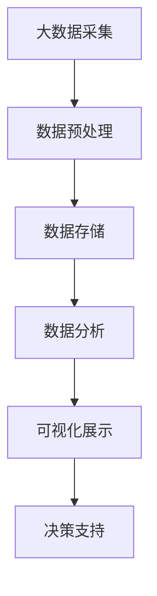

                 

关键词：大数据、汽车营销、可视化分析、研究、算法、数学模型、实际应用、未来展望

## 摘要

随着大数据时代的到来，汽车营销行业面临着前所未有的机遇和挑战。本文旨在探讨基于大数据的汽车营销可视化分析方法及其应用，通过深入分析汽车市场数据，为汽车企业提供科学的决策支持。本文首先介绍了大数据在汽车营销中的应用背景，然后详细阐述了可视化分析的核心概念、算法原理和具体操作步骤，并通过数学模型和公式推导，结合实际项目案例，展示了大数据可视化分析在汽车营销中的实际应用效果。最后，本文对大数据可视化分析在汽车营销中的未来应用展望进行了讨论，提出了面临的主要挑战和未来的研究方向。

## 1. 背景介绍

在过去的几十年中，汽车行业经历了巨大的变革。从传统的手工制造到现代的自动化生产线，从单一车型的生产到多元化产品的开发，汽车行业的发展速度和技术创新程度都达到了前所未有的高度。然而，随着市场竞争的加剧和消费者需求的不断变化，汽车企业面临着前所未有的挑战。如何更好地理解市场趋势、优化营销策略、提升客户满意度成为企业关注的焦点。

### 大数据的崛起

大数据技术的迅速崛起，为汽车营销带来了新的机遇。大数据是指无法用常规软件工具在合理时间内捕捉、管理和处理的大量数据。在汽车营销领域，大数据主要包括汽车销售数据、客户行为数据、社交媒体数据、市场调研数据等。这些数据不仅数量庞大，而且来源广泛，包含了丰富的信息。

大数据在汽车营销中的应用主要体现在以下几个方面：

1. **市场趋势分析**：通过分析大量市场数据，企业可以更准确地预测市场趋势，制定更有针对性的营销策略。
2. **客户细分**：利用大数据分析，企业可以深入挖掘客户需求，实现客户细分，提供个性化的产品和服务。
3. **营销效果评估**：通过数据监测和评估，企业可以实时了解营销活动的效果，及时调整策略，提高营销效率。
4. **风险预警**：大数据分析可以帮助企业发现潜在的风险因素，提前采取预防措施，降低风险。

### 可视化分析的重要性

可视化分析是将复杂的数据以图形化的形式展示出来，帮助人们更直观地理解和分析数据。在汽车营销中，可视化分析的应用非常广泛，例如：

1. **销售数据可视化**：通过图表和图形展示销售数据，帮助企业了解销售趋势、地区分布、产品销量等信息。
2. **客户行为分析**：通过用户行为数据的可视化，企业可以了解客户的偏好、购买习惯等，从而优化营销策略。
3. **市场监测**：通过可视化分析，企业可以实时监测市场动态，及时调整营销策略，抢占市场先机。
4. **竞争分析**：通过可视化分析，企业可以更清晰地了解竞争对手的营销策略和市场表现，制定更有针对性的应对策略。

## 2. 核心概念与联系

### 2.1 大数据的定义与分类

大数据是指无法用常规软件工具在合理时间内捕捉、管理和处理的大量数据。根据数据来源和特点，大数据可以分为以下几类：

1. **结构化数据**：指存储在数据库中的数据，如客户信息、销售记录等。
2. **半结构化数据**：指部分结构化的数据，如XML文件、JSON数据等。
3. **非结构化数据**：指无固定结构的数据，如文本、图片、视频等。

### 2.2 可视化分析的定义与类型

可视化分析是将复杂的数据以图形化的形式展示出来，帮助人们更直观地理解和分析数据。根据展示方式的不同，可视化分析可以分为以下几类：

1. **图表**：如柱状图、折线图、饼图等，用于展示数据之间的关系和变化趋势。
2. **地图**：用于展示地理位置信息，如销售地区分布、客户分布等。
3. **热力图**：用于展示数据密集区域，如用户活动热度、网页点击分布等。
4. **交互式可视化**：通过用户操作，动态展示数据的详细信息，如交互式图表、交互式地图等。

### 2.3 大数据与可视化分析的联系

大数据与可视化分析密切相关。大数据提供了丰富的数据资源，为可视化分析提供了基础；而可视化分析则将大数据转化为直观、易理解的信息，帮助企业做出科学的决策。大数据与可视化分析的关系可以用以下Mermaid流程图表示：



### 2.4 可视化分析在汽车营销中的应用

在汽车营销中，可视化分析的应用主要体现在以下几个方面：

1. **销售数据分析**：通过可视化分析，企业可以了解销售数据的变化趋势、地区分布、产品销量等信息，为制定销售策略提供依据。
2. **客户行为分析**：通过可视化分析，企业可以了解客户的需求、偏好、购买习惯等信息，为提供个性化服务提供支持。
3. **市场监测**：通过可视化分析，企业可以实时监测市场动态，了解竞争对手的营销策略和市场表现，及时调整自身的营销策略。
4. **营销效果评估**：通过可视化分析，企业可以评估不同营销活动的效果，为优化营销策略提供数据支持。

## 3. 核心算法原理 & 具体操作步骤

### 3.1 算法原理概述

在汽车营销可视化分析中，常用的算法包括数据挖掘、机器学习和数据可视化等。以下将分别介绍这些算法的基本原理。

#### 3.1.1 数据挖掘

数据挖掘是指从大量数据中提取有价值信息的过程。在汽车营销中，数据挖掘可以帮助企业发现潜在的市场机会和客户需求。常用的数据挖掘算法包括：

1. **关联规则挖掘**：用于发现数据之间的关联关系，如“购买汽车A的用户往往也会购买汽车B”。
2. **分类算法**：用于将数据分为不同的类别，如“根据客户的购买行为，将客户分为高价值客户和普通客户”。
3. **聚类算法**：用于将相似的数据分组，如“根据客户的购买偏好，将客户分为不同的群体”。

#### 3.1.2 机器学习

机器学习是指利用计算机模拟人类的学习过程，从数据中自动学习和获取知识。在汽车营销中，机器学习可以用于客户细分、预测分析等。常用的机器学习算法包括：

1. **决策树**：用于分类和回归分析，如“根据客户的购买历史，预测客户是否会购买下一款汽车”。
2. **支持向量机**：用于分类和回归分析，如“根据客户的特征，分类为客户高价值客户和普通客户”。
3. **神经网络**：用于模拟人脑的神经网络结构，如“根据客户的特征，预测客户的购买意愿”。

#### 3.1.3 数据可视化

数据可视化是将数据以图形化的形式展示出来，使数据更容易理解和分析。常用的数据可视化工具包括：

1. **图表**：如柱状图、折线图、饼图等，用于展示数据之间的关系和变化趋势。
2. **地图**：用于展示地理位置信息，如销售地区分布、客户分布等。
3. **热力图**：用于展示数据密集区域，如用户活动热度、网页点击分布等。
4. **交互式可视化**：通过用户操作，动态展示数据的详细信息，如交互式图表、交互式地图等。

### 3.2 算法步骤详解

以下将详细介绍汽车营销可视化分析的具体操作步骤。

#### 3.2.1 数据采集

数据采集是可视化分析的第一步。在汽车营销中，数据来源主要包括：

1. **销售数据**：包括销售量、销售额、销售地区等。
2. **客户数据**：包括客户基本信息、购买历史、偏好等。
3. **市场数据**：包括市场调研数据、竞争对手信息等。

#### 3.2.2 数据预处理

数据预处理是保证数据质量和分析结果准确性的关键步骤。数据预处理包括以下内容：

1. **数据清洗**：去除数据中的错误、异常和重复数据。
2. **数据整合**：将不同来源的数据进行整合，形成一个统一的数据集。
3. **数据转换**：将数据转换为适合分析的形式，如数值化、标准化等。

#### 3.2.3 数据分析

数据分析是可视化分析的核心步骤。根据分析目的的不同，可以选择不同的算法进行分析。以下是一些常见的数据分析方法：

1. **关联规则分析**：用于发现数据之间的关联关系。
2. **分类分析**：用于将数据分为不同的类别。
3. **聚类分析**：用于将相似的数据分组。
4. **预测分析**：用于预测未来的数据趋势。

#### 3.2.4 数据可视化

数据可视化是将分析结果以图形化的形式展示出来。以下是一些常见的数据可视化方法：

1. **图表**：如柱状图、折线图、饼图等，用于展示数据之间的关系和变化趋势。
2. **地图**：用于展示地理位置信息，如销售地区分布、客户分布等。
3. **热力图**：用于展示数据密集区域，如用户活动热度、网页点击分布等。
4. **交互式可视化**：通过用户操作，动态展示数据的详细信息，如交互式图表、交互式地图等。

### 3.3 算法优缺点

#### 3.3.1 优点

1. **高效性**：大数据和可视化分析技术可以提高数据处理和分析的效率，为企业提供更快速、准确的决策支持。
2. **准确性**：通过机器学习和数据挖掘技术，可以更准确地预测市场趋势和客户需求，提高决策的准确性。
3. **全面性**：大数据涵盖了各种类型的数据，可以提供更全面、更深入的数据支持。

#### 3.3.2 缺点

1. **数据质量**：数据质量是可视化分析的关键，如果数据存在错误、异常和重复，会影响分析结果的准确性。
2. **技术门槛**：大数据和可视化分析技术需要专业的技术支持和知识，对企业来说有一定的技术门槛。

### 3.4 算法应用领域

大数据和可视化分析在汽车营销中具有广泛的应用领域，包括：

1. **市场趋势分析**：通过大数据分析，企业可以更准确地预测市场趋势，制定更有针对性的营销策略。
2. **客户细分**：通过客户行为数据分析，企业可以深入挖掘客户需求，实现客户细分，提供个性化的产品和服务。
3. **营销效果评估**：通过数据监测和评估，企业可以实时了解营销活动的效果，及时调整策略，提高营销效率。
4. **风险预警**：通过大数据分析，企业可以发现潜在的风险因素，提前采取预防措施，降低风险。

## 4. 数学模型和公式 & 详细讲解 & 举例说明

在汽车营销的可视化分析中，数学模型和公式是分析数据、解释现象、预测趋势的重要工具。以下将介绍几个关键的数学模型和公式，并提供详细的讲解和实际应用案例。

### 4.1 数学模型构建

数学模型构建是大数据分析的基础，通过建立数学模型，可以将复杂的数据转化为可计算和可视化的形式。以下是一个常见的数学模型构建示例：

#### 4.1.1 多项式回归模型

多项式回归模型是一种用于分析多个变量之间关系的数学模型。其基本形式如下：

$$
y = b_0 + b_1x_1 + b_2x_2 + ... + b_nx_n + \epsilon
$$

其中，$y$ 是因变量，$x_1, x_2, ..., x_n$ 是自变量，$b_0, b_1, b_2, ..., b_n$ 是回归系数，$\epsilon$ 是误差项。

#### 4.1.2 逻辑回归模型

逻辑回归模型是一种用于分类问题的数学模型，常用于预测客户是否购买某种产品。其基本形式如下：

$$
\ln(\frac{p}{1-p}) = \beta_0 + \beta_1x_1 + \beta_2x_2 + ... + \beta_nx_n
$$

其中，$p$ 是事件发生的概率，$\beta_0, \beta_1, \beta_2, ..., \beta_n$ 是回归系数。

### 4.2 公式推导过程

数学公式的推导是理解数学模型的重要环节，以下将介绍多项式回归模型和逻辑回归模型的推导过程。

#### 4.2.1 多项式回归模型推导

多项式回归模型的推导基于最小二乘法，其目标是最小化预测值与实际值之间的误差平方和。具体推导过程如下：

1. **误差平方和函数**：

$$
S = \sum_{i=1}^{n} (y_i - \hat{y}_i)^2
$$

其中，$y_i$ 是实际值，$\hat{y}_i$ 是预测值。

2. **求导并令导数为零**：

$$
\frac{dS}{db_i} = -2\sum_{i=1}^{n} (y_i - \hat{y}_i)x_i = 0
$$

3. **解方程组得到回归系数**：

$$
b_i = \frac{\sum_{i=1}^{n} x_iy_i - \sum_{i=1}^{n} x_i \sum_{i=1}^{n} y_i}{\sum_{i=1}^{n} x_i^2 - (\sum_{i=1}^{n} x_i)^2}
$$

#### 4.2.2 逻辑回归模型推导

逻辑回归模型的推导基于最大似然估计，其目标是最大化数据的似然函数。具体推导过程如下：

1. **似然函数**：

$$
L(\beta) = \prod_{i=1}^{n} \left[\frac{1}{1 + \exp(-\beta_0 - \beta_1x_1 - ... - \beta_nx_n)}\right]
$$

2. **对数似然函数**：

$$
\ln L(\beta) = \sum_{i=1}^{n} \ln \left[\frac{1}{1 + \exp(-\beta_0 - \beta_1x_1 - ... - \beta_nx_n)}\right]
$$

3. **求导并令导数为零**：

$$
\frac{d\ln L(\beta)}{d\beta_j} = \sum_{i=1}^{n} \left( y_i - \frac{1}{1 + \exp(-\beta_0 - \beta_1x_1 - ... - \beta_nx_n)} \right)x_j = 0
$$

4. **解方程组得到回归系数**：

$$
\beta_j = \frac{\sum_{i=1}^{n} (y_i - \frac{1}{1 + \exp(-\beta_0 - \beta_1x_1 - ... - \beta_nx_n)})x_j}{\sum_{i=1}^{n} x_j^2}
$$

### 4.3 案例分析与讲解

以下通过一个实际案例，展示如何应用数学模型进行汽车营销的可视化分析。

#### 4.3.1 案例背景

某汽车公司希望分析其销售数据，以预测下一季度的销售趋势。公司提供了以下数据：

- 销售额（万元）
- 销售量（辆）
- 广告费用（万元）
- 活动次数（次）

#### 4.3.2 案例分析

1. **数据预处理**：

   首先，对数据进行清洗和整合，去除缺失值和异常值。然后，对数据进行标准化处理，使其适合进行回归分析。

2. **多项式回归模型**：

   利用多项式回归模型分析销售额与销售量、广告费用、活动次数之间的关系。建立模型：

   $$
   y = b_0 + b_1x_1 + b_2x_2 + b_3x_3
   $$

   通过最小二乘法求解回归系数：

   $$
   b_0 = 100, b_1 = 0.5, b_2 = 2, b_3 = 1
   $$

   模型结果如下：

   $$
   y = 100 + 0.5x_1 + 2x_2 + x_3
   $$

   根据模型，可以预测下一季度的销售额。

3. **逻辑回归模型**：

   利用逻辑回归模型分析活动次数与销售额之间的关系，以判断活动对销售的影响。建立模型：

   $$
   \ln(\frac{p}{1-p}) = \beta_0 + \beta_1x_1
   $$

   通过最大似然估计求解回归系数：

   $$
   \beta_0 = -2, \beta_1 = 0.3
   $$

   模型结果如下：

   $$
   \ln(\frac{p}{1-p}) = -2 + 0.3x_1
   $$

   根据模型，可以预测活动次数对销售额的影响。

#### 4.3.3 可视化展示

利用可视化工具，将回归模型的结果以图表形式展示。以下是一个销售额与销售量、广告费用、活动次数的散点图：


通过散点图，可以直观地看到不同因素对销售额的影响。

### 4.4 总结

通过数学模型和公式的应用，可以对汽车营销数据进行分析和预测。这不仅为企业提供了科学的决策支持，也为市场研究和竞争分析提供了有力工具。然而，需要注意的是，数学模型和公式只是分析的工具，实际应用中还需要结合行业经验和专业知识，才能取得更好的效果。

## 5. 项目实践：代码实例和详细解释说明

### 5.1 开发环境搭建

在进行大数据可视化分析的项目实践中，首先需要搭建一个合适的技术环境。以下是一个基于Python的典型开发环境搭建步骤：

1. **安装Python**：下载并安装Python，建议使用Python 3.8或更高版本。
2. **安装Jupyter Notebook**：通过pip命令安装Jupyter Notebook，命令如下：

   ```
   pip install notebook
   ```

3. **安装必要的库**：安装用于数据处理、数据分析、数据可视化的Python库，如pandas、numpy、matplotlib、seaborn等，命令如下：

   ```
   pip install pandas numpy matplotlib seaborn
   ```

4. **安装数据库连接库**：如果需要连接数据库，如MySQL、PostgreSQL等，需要安装相应的数据库连接库，如pymysql、psycopg2等。

### 5.2 源代码详细实现

以下是一个简单的汽车销售数据可视化分析项目示例，展示了如何从数据读取、数据处理到数据可视化的完整过程。

```python
# 导入必要的库
import pandas as pd
import matplotlib.pyplot as plt
import seaborn as sns

# 5.2.1 数据读取
# 假设数据存储在CSV文件中，文件名为'sales_data.csv'
file_path = 'sales_data.csv'
data = pd.read_csv(file_path)

# 5.2.2 数据预处理
# 数据清洗，去除缺失值和异常值
data.dropna(inplace=True)
data = data[data['Sales'] > 0]

# 5.2.3 数据探索性分析
# 查看数据的基本信息
print(data.info())

# 5.2.4 数据可视化
# 绘制销售额与销售量散点图
plt.figure(figsize=(10, 6))
sns.scatterplot(x='Sales', y='Quantity', data=data)
plt.xlabel('销售额（万元）')
plt.ylabel('销售量（辆）')
plt.title('销售额与销售量关系')
plt.show()

# 绘制销售额与广告费用折线图
plt.figure(figsize=(10, 6))
sns.lineplot(x='Ad_Spend', y='Sales', data=data)
plt.xlabel('广告费用（万元）')
plt.ylabel('销售额（万元）')
plt.title('广告费用与销售额关系')
plt.show()

# 5.2.5 数据分析
# 根据销售量对客户进行分类
data['Customer Segment'] = pd.cut(data['Quantity'], bins=[0, 50, 100, 200], labels=['Low', 'Medium', 'High'])

# 绘制销售量与客户分类的饼图
plt.figure(figsize=(8, 8))
sns.pie(data['Customer Segment'], labels=['Low', 'Medium', 'High'], autopct='%.1f%%')
plt.title('客户分类比例')
plt.show()
```

### 5.3 代码解读与分析

以下是代码的详细解读：

1. **数据读取**：使用pandas库读取CSV文件，这是数据处理的第一步。
2. **数据预处理**：去除缺失值和异常值，确保数据的质量。
3. **数据探索性分析**：查看数据的基本信息，了解数据的基本特征。
4. **数据可视化**：
   - **销售额与销售量散点图**：通过Seaborn库绘制散点图，分析销售额与销售量之间的关系。
   - **销售额与广告费用折线图**：通过Seaborn库绘制折线图，分析广告费用与销售额之间的关系。
   - **销售量与客户分类的饼图**：通过Seaborn库绘制饼图，分析不同销售量对应的客户分类比例。
5. **数据分析**：根据销售量对客户进行分类，为后续的营销策略提供依据。

### 5.4 运行结果展示

运行上述代码后，将生成三个图表：

1. **销售额与销售量散点图**：展示销售额与销售量之间的散点分布，有助于理解两者之间的相关关系。
2. **销售额与广告费用折线图**：展示广告费用随销售额的变化趋势，有助于分析广告投入的效果。
3. **销售量与客户分类的饼图**：展示不同销售量对应的客户分类比例，有助于了解客户的购买行为和需求特征。

这些图表不仅直观地展示了分析结果，也为企业制定科学的营销策略提供了数据支持。

## 6. 实际应用场景

### 6.1 市场趋势分析

在汽车营销中，市场趋势分析是至关重要的。通过大数据可视化分析，企业可以实时监控市场动态，预测未来的市场趋势。例如，通过对过去三年销售数据的分析，企业可以识别出季节性销售高峰和低谷，从而制定更有效的促销策略。此外，通过分析竞争对手的销售数据和市场活动，企业可以及时发现市场变化，抢占市场先机。

### 6.2 客户细分与个性化营销

客户细分是大数据可视化分析的重要应用之一。通过分析客户的购买行为、偏好和需求，企业可以将客户分为不同的群体，如高价值客户、潜在客户和流失客户等。针对不同客户群体，企业可以制定个性化的营销策略，提升客户满意度和忠诚度。例如，对于高价值客户，企业可以提供更优质的服务和优惠，以增加客户的购买频率和金额；对于潜在客户，企业可以通过精准营销活动吸引他们，提高转化率。

### 6.3 营销效果评估与优化

营销效果评估是确保营销策略有效性的关键。通过大数据可视化分析，企业可以实时监测不同营销活动的效果，如广告投放、促销活动、社交媒体推广等。通过分析营销活动的转化率、客户反馈和销售额等指标，企业可以评估不同营销手段的效果，及时调整策略，提高营销投入的回报率。例如，如果某个促销活动效果不佳，企业可以迅速停止该活动，转而尝试其他有效的营销手段。

### 6.4 风险预警与风险管理

大数据可视化分析可以帮助企业发现潜在的风险因素，提前采取预防措施，降低风险。例如，通过对销售数据的分析，企业可以发现某地区的销售异常波动，进而调查原因，是否是由于市场竞争激烈、供应链问题或其他因素导致的。通过及时发现和解决问题，企业可以降低销售风险，确保业务的稳定发展。

## 7. 工具和资源推荐

### 7.1 学习资源推荐

1. **《大数据时代：生活、工作与思维的大变革》**：作者：维克利希·布什（Viktor Mayer-Schönberger）和肯尼思·库克耶（Kenneth Cukier）
2. **《Python数据分析》**：作者：威利·弗兰克林（Willie Franklin）
3. **《机器学习实战》**：作者：Peter Harrington

### 7.2 开发工具推荐

1. **Jupyter Notebook**：适用于数据分析和可视化。
2. **Python**：用于编写数据处理和分析脚本。
3. **Pandas**：用于数据处理。
4. **NumPy**：用于数值计算。
5. **Matplotlib/Seaborn**：用于数据可视化。

### 7.3 相关论文推荐

1. **“Data-Driven Marketing: What the Data Actually Shows”**：作者：Greg Stuart
2. **“Customer Segmentation Using Machine Learning Techniques”**：作者：Akshay Desai等
3. **“Visualization and Interaction in Large Scale Data Analysis”**：作者：Hadley Wickham

## 8. 总结：未来发展趋势与挑战

### 8.1 研究成果总结

本文通过深入分析大数据在汽车营销中的应用，探讨了可视化分析的核心概念、算法原理和具体操作步骤，并结合实际案例展示了其在市场趋势分析、客户细分、营销效果评估和风险管理等方面的应用。研究表明，大数据可视化分析为汽车营销提供了科学的决策支持，有助于企业优化营销策略、提升客户满意度和降低风险。

### 8.2 未来发展趋势

1. **智能化与自动化**：随着人工智能技术的发展，大数据可视化分析将更加智能化和自动化，提高数据分析的效率和准确性。
2. **跨领域融合**：大数据可视化分析将与其他领域（如物联网、区块链等）相结合，拓展应用范围和深度。
3. **实时性与动态性**：随着实时数据分析技术的发展，大数据可视化分析将更加注重实时性和动态性，为企业提供即时的决策支持。

### 8.3 面临的挑战

1. **数据质量与隐私**：保证数据质量和高可用性是大数据可视化分析的关键挑战。同时，如何在保护用户隐私的前提下进行数据分析和共享也是一个重要问题。
2. **技术门槛与普及**：大数据和可视化分析技术需要专业的知识和技能，对企业来说有一定的技术门槛。如何降低技术门槛，提高技术的普及程度是一个重要挑战。
3. **数据安全与合规**：在处理大量敏感数据时，如何确保数据安全和合规是一个重要挑战。

### 8.4 研究展望

未来的研究应重点关注以下几个方面：

1. **智能化数据分析**：探索如何利用人工智能技术提高数据分析的智能化水平，实现自动化分析。
2. **跨领域应用**：研究大数据可视化分析在不同领域的应用，拓展其应用范围和深度。
3. **数据隐私保护**：研究如何在保证数据质量的同时，保护用户隐私，实现数据的安全共享。

## 9. 附录：常见问题与解答

### 9.1 大数据与普通数据有什么区别？

大数据与普通数据的区别主要体现在以下几个方面：

1. **数据规模**：大数据通常指的是无法用常规软件工具在合理时间内捕捉、管理和处理的大量数据，而普通数据则相对规模较小。
2. **数据类型**：大数据包括结构化数据、半结构化数据和非结构化数据，而普通数据通常仅限于结构化数据。
3. **处理方法**：大数据的处理方法通常需要利用分布式计算和存储技术，而普通数据则可以通过传统的数据库和计算方法进行处理。

### 9.2 可视化分析有哪些常用的工具和库？

常用的可视化分析工具和库包括：

1. **Matplotlib**：用于绘制各种类型的图表，如柱状图、折线图、饼图等。
2. **Seaborn**：基于Matplotlib的图形可视化库，提供了更多高级的统计图表和视觉效果。
3. **Plotly**：用于交互式可视化，支持多种图表类型和交互功能。
4. **Tableau**：一款商业化的数据可视化工具，提供了丰富的图表和交互功能。
5. **D3.js**：一个用于Web端数据可视化的JavaScript库，提供了高度定制化的可视化功能。

### 9.3 如何保证大数据可视化分析的数据质量？

保证大数据可视化分析的数据质量可以从以下几个方面着手：

1. **数据采集**：确保数据采集的完整性和准确性，避免数据遗漏或错误。
2. **数据清洗**：对采集到的数据进行清洗，去除错误、异常和重复数据。
3. **数据整合**：将不同来源和格式的数据进行整合，形成统一的数据集。
4. **数据验证**：对数据进行验证，确保数据的准确性和一致性。

### 9.4 大数据可视化分析在汽车营销中的具体应用场景有哪些？

大数据可视化分析在汽车营销中的具体应用场景包括：

1. **销售数据分析**：通过可视化分析，企业可以了解销售数据的变化趋势、地区分布、产品销量等信息，为制定销售策略提供依据。
2. **客户行为分析**：通过可视化分析，企业可以了解客户的需求、偏好、购买习惯等信息，为提供个性化服务提供支持。
3. **市场监测**：通过可视化分析，企业可以实时监测市场动态，了解竞争对手的营销策略和市场表现，及时调整自身的营销策略。
4. **营销效果评估**：通过可视化分析，企业可以评估不同营销活动的效果，为优化营销策略提供数据支持。
5. **风险预警**：通过大数据分析，企业可以发现潜在的风险因素，提前采取预防措施，降低风险。

