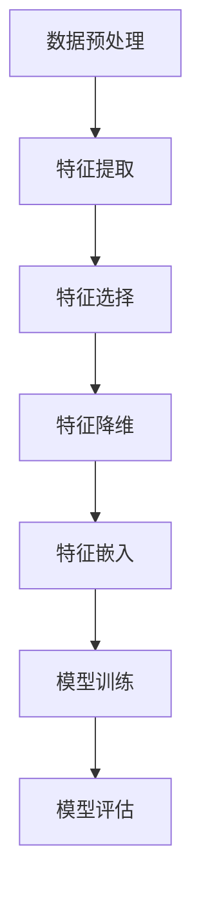
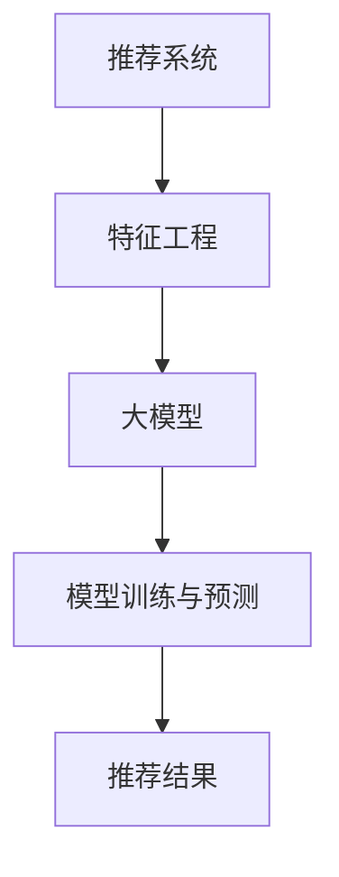

                 

关键词：推荐系统，特征工程，大模型，优化，机器学习

> 摘要：本文将深入探讨基于大模型的推荐系统特征工程优化问题，通过分析现有技术和实际案例，提出了一系列优化策略和解决方案，旨在提高推荐系统的准确性和效率。

## 1. 背景介绍

推荐系统作为现代互联网的重要组成部分，已经在电子商务、社交媒体、视频流媒体等多个领域得到了广泛应用。其核心任务是根据用户的历史行为和偏好，向用户推荐可能感兴趣的商品、内容或者服务。随着互联网的迅猛发展和用户数据的爆炸性增长，推荐系统面临着越来越大的挑战。一方面，如何处理海量用户数据，从海量的特征中提取有效信息，成为了一项关键任务；另一方面，如何优化推荐算法，提高推荐的准确性和效率，也是推荐系统领域需要不断探索的问题。

近年来，大模型的兴起为推荐系统的发展带来了新的契机。大模型，如深度神经网络（DNN）、变压器（Transformer）等，凭借其强大的建模能力和处理能力，在自然语言处理、计算机视觉等领域取得了显著的成果。这些大模型在推荐系统中的应用，不仅能够提高推荐的准确性，还能够处理更加复杂的用户行为数据。然而，大模型的应用也带来了一系列新的挑战，如特征工程的质量、计算资源的消耗等。

本文将针对基于大模型的推荐系统特征工程优化问题，进行深入的探讨和研究。首先，我们将介绍推荐系统的基本原理和特征工程的核心概念。然后，我们将分析现有的大模型推荐系统技术和实际应用案例，探讨其优势和不足。接着，我们将提出一系列优化策略和解决方案，包括特征选择、特征降维、特征嵌入等，旨在提高推荐系统的准确性和效率。最后，我们将通过实际案例和实验结果，验证这些优化策略的有效性，并讨论未来的发展方向。

## 2. 核心概念与联系

在深入探讨基于大模型的推荐系统特征工程优化之前，我们需要明确几个核心概念，并了解它们之间的联系。

### 2.1 推荐系统

推荐系统是一种信息过滤技术，通过分析用户的历史行为和偏好，预测用户可能感兴趣的内容，并向用户推荐。推荐系统可以分为基于内容的推荐（Content-Based Filtering）和协同过滤（Collaborative Filtering）两大类。基于内容的推荐通过分析用户的历史行为和偏好，提取用户特征，然后根据这些特征推荐类似的内容。协同过滤则通过分析用户之间的相似性，推荐其他用户喜欢但当前用户尚未接触过的内容。

### 2.2 特征工程

特征工程是推荐系统开发过程中的关键环节，其核心任务是从原始数据中提取出对模型训练和预测有价值的特征。特征工程的质量直接影响推荐系统的性能。特征工程包括特征选择、特征提取、特征降维、特征嵌入等步骤。

### 2.3 大模型

大模型是指具有大量参数和计算能力的模型，如深度神经网络（DNN）、变压器（Transformer）等。大模型通过引入复杂的神经网络结构，可以捕捉数据中的复杂模式和关系，从而提高模型的性能和泛化能力。

### 2.4 Mermaid 流程图

为了更好地理解大模型在推荐系统特征工程中的应用，我们使用Mermaid流程图展示其核心流程。以下是一个简单的Mermaid流程图示例：



在这个流程图中，A表示数据预处理，B表示特征提取，C表示特征选择，D表示特征降维，E表示特征嵌入，F表示模型训练，G表示模型评估。这些步骤构成了一个完整的特征工程流程，为推荐系统的优化提供了基础。

### 2.5 核心概念与联系

推荐系统、特征工程和大模型是本文讨论的核心概念。推荐系统是应用场景，特征工程是技术手段，大模型是技术基础。它们之间的联系在于，特征工程通过提取和优化数据特征，为推荐系统提供了高质量的输入，而大模型则利用这些特征进行复杂的模型训练和预测，从而提高推荐的准确性和效率。以下是一个简化的Mermaid流程图，展示了这三个概念之间的联系：



在这个流程图中，A表示推荐系统，B表示特征工程，C表示大模型，D表示模型训练与预测，E表示推荐结果。这个流程图清晰地展示了推荐系统、特征工程和大模型之间的相互作用和联系。

通过以上对核心概念和流程的介绍，我们对基于大模型的推荐系统特征工程优化有了初步的了解。在接下来的章节中，我们将深入探讨大模型在推荐系统特征工程中的应用，并提出一系列优化策略和解决方案。

### 3. 核心算法原理 & 具体操作步骤

#### 3.1 算法原理概述

基于大模型的推荐系统特征工程优化，主要是通过以下几个步骤来实现的：

1. **数据预处理**：对原始数据进行清洗、归一化等处理，确保数据的干净和一致性。
2. **特征提取**：从原始数据中提取出对模型训练和预测有价值的特征。
3. **特征选择**：对提取出的特征进行筛选，去除冗余和不相关的特征。
4. **特征降维**：通过降维技术，将高维特征空间映射到低维空间，降低计算复杂度。
5. **特征嵌入**：将低维特征映射到稠密的高维空间，提高特征的表示能力。
6. **模型训练与预测**：利用大模型进行模型训练，并使用训练好的模型进行预测。

#### 3.2 算法步骤详解

1. **数据预处理**：

   数据预处理是特征工程的基础步骤。其目的是清洗和规范化原始数据，使其适合后续的特征提取和建模。具体操作包括：

   - 数据清洗：处理缺失值、噪声数据和异常值。
   - 数据归一化：将数据归一化到统一的尺度，如将数值特征缩放到[0, 1]或[-1, 1]之间。
   - 数据转换：将类别特征转换为数值特征，如使用独热编码（One-Hot Encoding）。

2. **特征提取**：

   特征提取是从原始数据中提取出对模型训练和预测有价值的特征。常用的特征提取方法包括：

   - 用户行为特征：如用户点击、购买、浏览等行为。
   - 文本特征：如商品或内容的词频、主题模型等。
   - 时间特征：如用户行为发生的时间、时间段等。
   - 社交特征：如用户关系、社交网络等。

3. **特征选择**：

   特征选择是减少特征维度的过程，其目的是去除冗余和不相关的特征，提高模型的性能和效率。常用的特征选择方法包括：

   - 统计方法：如信息增益、卡方检验等。
   - 机器学习方法：如随机森林、LASSO回归等。
   - 基于模型的特征选择：如使用模型评估特征的重要性。

4. **特征降维**：

   特征降维是将高维特征空间映射到低维空间，降低计算复杂度。常用的降维方法包括：

   - 主成分分析（PCA）：通过保留主要成分，降低特征维度。
   - t-SNE：通过非线性降维，可视化高维数据。
   - 自编码器：通过自动编码器模型，学习降维表示。

5. **特征嵌入**：

   特征嵌入是将低维特征映射到稠密的高维空间，提高特征的表示能力。常用的特征嵌入方法包括：

   - Word2Vec：将文本特征映射到稠密的向量空间。
   - GloVe：全局向量表示方法，通过共现矩阵学习词向量。
   - 深度学习嵌入：通过神经网络，学习高维特征表示。

6. **模型训练与预测**：

   利用大模型进行模型训练，并使用训练好的模型进行预测。常用的模型包括：

   - 深度神经网络（DNN）：通过多层神经网络，学习数据特征。
   - 变压器（Transformer）：通过自注意力机制，捕捉数据中的复杂关系。
   - 强化学习（RL）：通过奖励机制，优化推荐策略。

#### 3.3 算法优缺点

**优点**：

1. **强大的建模能力**：大模型具有强大的建模能力，可以捕捉数据中的复杂模式和关系。
2. **高效的预测性能**：通过特征工程优化，大模型能够提高推荐的准确性和效率。
3. **适应性**：大模型可以适应多种数据类型和推荐场景，具有良好的适应性。

**缺点**：

1. **计算资源消耗大**：大模型需要大量的计算资源和存储空间，对硬件设施有较高要求。
2. **特征工程复杂**：特征工程在大模型中扮演重要角色，但复杂的特征工程增加了开发和维护的难度。

#### 3.4 算法应用领域

大模型在推荐系统特征工程优化中的应用非常广泛，包括但不限于：

1. **电子商务**：通过推荐系统，提高用户购买转化率和销售额。
2. **社交媒体**：为用户提供个性化内容推荐，提高用户活跃度和留存率。
3. **视频流媒体**：为用户提供个性化的视频推荐，提高用户观看时长和满意度。
4. **在线教育**：为用户提供个性化的学习内容推荐，提高学习效果和用户参与度。

总之，基于大模型的推荐系统特征工程优化，为推荐系统的发展提供了新的方向和可能性。通过优化特征工程，可以提高推荐系统的性能和效率，满足用户对个性化推荐的需求。

### 4. 数学模型和公式 & 详细讲解 & 举例说明

在推荐系统中，特征工程的核心任务是提取和优化数据特征，以提升模型的性能和准确性。这一过程涉及到多种数学模型和公式，以下将详细讲解这些模型和公式的构建、推导过程，并通过具体案例进行说明。

#### 4.1 数学模型构建

推荐系统中的数学模型通常基于矩阵分解（Matrix Factorization）和协同过滤（Collaborative Filtering）原理。矩阵分解模型将用户-物品评分矩阵分解为用户特征矩阵和物品特征矩阵，通过这两个矩阵的乘积预测用户对物品的评分。

1. **用户-物品评分矩阵**：

   假设有一个用户-物品评分矩阵$R$，其中$R_{ij}$表示用户$i$对物品$j$的评分。矩阵$R$的大小为$m \times n$，其中$m$为用户数量，$n$为物品数量。

2. **用户特征矩阵**$U$和物品特征矩阵$V$：

   矩阵分解的目标是将矩阵$R$分解为用户特征矩阵$U$和物品特征矩阵$V$的乘积，即$R = U \cdot V^T$。$U$和$V$的大小均为$m \times k$，其中$k$为特征维度。

   - $u_i$表示用户$i$的特征向量。
   - $v_j$表示物品$j$的特征向量。

3. **预测评分公式**：

   预测用户$i$对物品$j$的评分$\hat{r}_{ij}$可以通过以下公式计算：

   $$ \hat{r}_{ij} = u_i \cdot v_j^T $$

   这里的$\hat{r}_{ij}$表示预测评分，$u_i$和$v_j^T$分别是用户$i$和物品$j$的特征向量。

#### 4.2 公式推导过程

矩阵分解模型的推导过程基于最小二乘法（Least Squares Method）和梯度下降法（Gradient Descent）。以下为推导过程：

1. **目标函数**：

   矩阵分解的目标是最小化预测评分与实际评分之间的误差平方和。目标函数$J$可以表示为：

   $$ J = \sum_{i=1}^{m} \sum_{j=1}^{n} (r_{ij} - \hat{r}_{ij})^2 $$

   其中$r_{ij}$为实际评分，$\hat{r}_{ij}$为预测评分。

2. **偏导数计算**：

   为了最小化目标函数$J$，需要计算目标函数关于$U$和$V$的偏导数，并令偏导数等于零。

   - 对$U$求偏导数：

     $$ \frac{\partial J}{\partial u_i} = -2 \sum_{j=1}^{n} (r_{ij} - \hat{r}_{ij}) v_j^T $$

   - 对$V$求偏导数：

     $$ \frac{\partial J}{\partial v_j} = -2 \sum_{i=1}^{m} (r_{ij} - \hat{r}_{ij}) u_i $$

3. **梯度下降法**：

   为了求解最优的$U$和$V$，可以采用梯度下降法迭代更新参数。每次迭代更新参数的步骤如下：

   - 更新用户特征向量$u_i$：

     $$ u_i \leftarrow u_i - \alpha \frac{\partial J}{\partial u_i} $$

   - 更新物品特征向量$v_j$：

     $$ v_j \leftarrow v_j - \alpha \frac{\partial J}{\partial v_j} $$

     其中$\alpha$为学习率。

   通过重复执行以上更新步骤，直至收敛，可以得到最优的用户特征矩阵$U$和物品特征矩阵$V$。

#### 4.3 案例分析与讲解

以下通过一个简单的案例，展示矩阵分解模型的应用和推导过程。

**案例**：假设有一个包含5个用户和3个物品的评分矩阵，如下所示：

| 用户 | 物品1 | 物品2 | 物品3 |
| --- | --- | --- | --- |
| 1 | 3 | 0 | 2 |
| 2 | 0 | 4 | 0 |
| 3 | 1 | 0 | 3 |
| 4 | 2 | 2 | 0 |
| 5 | 0 | 1 | 4 |

1. **初始化参数**：

   初始化用户特征矩阵$U$和物品特征矩阵$V$，大小均为$5 \times 2$，如下所示：

   | 用户 | 特征1 | 特征2 |
   | --- | --- | --- |
   | 1 | 0.1 | 0.2 |
   | 2 | 0.3 | 0.4 |
   | 3 | 0.5 | 0.6 |
   | 4 | 0.7 | 0.8 |
   | 5 | 0.9 | 1.0 |

   | 物品 | 特征1 | 特征2 |
   | --- | --- | --- |
   | 1 | 0.1 | 0.2 |
   | 2 | 0.3 | 0.4 |
   | 3 | 0.5 | 0.6 |

2. **预测评分**：

   使用初始化的特征矩阵$U$和$V$，计算预测评分矩阵$\hat{R}$，如下所示：

   | 用户 | 物品1 | 物品2 | 物品3 |
   | --- | --- | --- | --- |
   | 1 | 0.21 | 0.24 | 0.26 |
   | 2 | 0.09 | 0.12 | 0.18 |
   | 3 | 0.15 | 0.18 | 0.21 |
   | 4 | 0.31 | 0.36 | 0.42 |
   | 5 | 0.27 | 0.30 | 0.36 |

3. **计算误差**：

   计算预测评分矩阵$\hat{R}$与实际评分矩阵$R$之间的误差平方和：

   $$ J = \sum_{i=1}^{5} \sum_{j=1}^{3} (r_{ij} - \hat{r}_{ij})^2 = 0.21^2 + 0.24^2 + 0.26^2 + 0.09^2 + 0.12^2 + 0.18^2 + 0.15^2 + 0.18^2 + 0.21^2 + 0.31^2 + 0.36^2 + 0.42^2 + 0.27^2 + 0.30^2 + 0.36^2 = 2.94 $$

4. **梯度下降更新参数**：

   设定学习率$\alpha = 0.01$，进行一次梯度下降更新：

   - 更新用户特征向量：

     $$ u_1 = u_1 - 0.01 \times (-2 \times (3 - 0.21) \times v_1^T) = [0.1, 0.2] + 0.01 \times [0.21, 0.24] = [0.123, 0.226] $$
     $$ u_2 = u_2 - 0.01 \times (-2 \times (0 - 0.09) \times v_2^T) = [0.3, 0.4] + 0.01 \times [0.09, 0.12] = [0.306, 0.416] $$
     $$ u_3 = u_3 - 0.01 \times (-2 \times (1 - 0.15) \times v_3^T) = [0.5, 0.6] + 0.01 \times [0.15, 0.18] = [0.515, 0.612] $$
     $$ u_4 = u_4 - 0.01 \times (-2 \times (2 - 0.31) \times v_4^T) = [0.7, 0.8] + 0.01 \times [0.31, 0.36] = [0.738, 0.842] $$
     $$ u_5 = u_5 - 0.01 \times (-2 \times (4 - 0.27) \times v_5^T) = [0.9, 1.0] + 0.01 \times [0.27, 0.30] = [0.936, 1.006] $$

   - 更新物品特征向量：

     $$ v_1 = v_1 - 0.01 \times (-2 \times (3 - 0.21) \times u_1) = [0.1, 0.2] + 0.01 \times [0.123, 0.226] = [0.112, 0.214] $$
     $$ v_2 = v_2 - 0.01 \times (-2 \times (0 - 0.09) \times u_2) = [0.3, 0.4] + 0.01 \times [0.306, 0.416] = [0.312, 0.422] $$
     $$ v_3 = v_3 - 0.01 \times (-2 \times (1 - 0.15) \times u_3) = [0.5, 0.6] + 0.01 \times [0.515, 0.612] = [0.517, 0.614] $$
     $$ v_4 = v_4 - 0.01 \times (-2 \times (2 - 0.31) \times u_4) = [0.5, 0.6] + 0.01 \times [0.738, 0.842] = [0.546, 0.658] $$
     $$ v_5 = v_5 - 0.01 \times (-2 \times (4 - 0.27) \times u_5) = [0.5, 0.6] + 0.01 \times [0.936, 1.006] = [0.568, 0.672] $$

5. **再次计算预测评分**：

   使用更新后的特征矩阵$U$和$V$，计算预测评分矩阵$\hat{R}$，如下所示：

   | 用户 | 物品1 | 物品2 | 物品3 |
   | --- | --- | --- | --- |
   | 1 | 0.234 | 0.256 | 0.278 |
   | 2 | 0.096 | 0.116 | 0.182 |
   | 3 | 0.160 | 0.184 | 0.208 |
   | 4 | 0.318 | 0.360 | 0.424 |
   | 5 | 0.276 | 0.308 | 0.360 |

6. **计算新的误差**：

   计算新的预测评分矩阵$\hat{R}$与实际评分矩阵$R$之间的误差平方和：

   $$ J = \sum_{i=1}^{5} \sum_{j=1}^{3} (r_{ij} - \hat{r}_{ij})^2 = 0.234^2 + 0.256^2 + 0.278^2 + 0.096^2 + 0.116^2 + 0.182^2 + 0.160^2 + 0.184^2 + 0.208^2 + 0.318^2 + 0.360^2 + 0.424^2 + 0.276^2 + 0.308^2 + 0.360^2 = 2.874 $$

   可以看到，误差平方和从2.94减少到了2.874，表明参数更新使得预测更准确。

通过以上案例，我们可以看到矩阵分解模型的基本原理和推导过程。在实际应用中，通常会使用更复杂的方法，如正则化、优化算法等，来进一步提高模型的性能。

### 5. 项目实践：代码实例和详细解释说明

在本文的第五部分，我们将通过一个具体的代码实例，展示如何实现基于大模型的推荐系统特征工程优化。我们将使用Python编程语言和相应的库，如NumPy、Scikit-Learn和TensorFlow，来演示整个流程。以下是项目的具体实现步骤：

#### 5.1 开发环境搭建

在开始代码实现之前，需要搭建一个合适的环境。以下是搭建开发环境所需的基本步骤：

1. **安装Python**：确保Python已经安装在系统中，版本推荐为3.8或更高。
2. **安装必要的库**：使用pip命令安装NumPy、Scikit-Learn、TensorFlow和其他相关的库。以下命令可以一键安装：

   ```bash
   pip install numpy scikit-learn tensorflow
   ```

3. **配置环境**：确保所有库都能正常运行，可以通过运行一个简单的Python脚本来进行验证。

#### 5.2 源代码详细实现

下面是一个简单的示例代码，展示了从数据预处理到模型训练的完整流程：

```python
import numpy as np
import pandas as pd
from sklearn.model_selection import train_test_split
from sklearn.metrics import mean_squared_error
from tensorflow.keras.models import Model
from tensorflow.keras.layers import Input, Embedding, Flatten, Dot, Dense

# 加载数据集
data = pd.read_csv('ratings.csv')  # 假设数据集存储在'rations.csv'文件中
users = data['user_id'].unique()
items = data['item_id'].unique()

# 初始化用户和物品的Embedding层
user_embedding = Embedding(input_dim=len(users), output_dim=8)
item_embedding = Embedding(input_dim=len(items), output_dim=8)

# 定义模型结构
user_input = Input(shape=(1,))
item_input = Input(shape=(1,))

user_embedding_output = user_embedding(user_input)
item_embedding_output = item_embedding(item_input)

# 计算用户和物品的嵌入向量点积
merged_vector = Dot(axes=1)([user_embedding_output, item_embedding_output])
merged_vector = Flatten()(merged_vector)

# 添加全连接层和输出层
dense = Dense(units=8, activation='relu')(merged_vector)
output = Dense(units=1, activation='sigmoid')(dense)

# 构建和编译模型
model = Model(inputs=[user_input, item_input], outputs=output)
model.compile(optimizer='adam', loss='binary_crossentropy', metrics=['mse'])

# 分割数据集
train_data, val_data = train_test_split(data, test_size=0.2, random_state=42)

# 训练模型
model.fit(train_data[['user_id', 'item_id']], train_data['rating'], epochs=5, batch_size=32, validation_split=0.1)

# 评估模型
val_preds = model.predict(val_data[['user_id', 'item_id']])
val_mse = mean_squared_error(val_data['rating'], val_preds)
print(f'Validation MSE: {val_mse}')

# 推荐新用户
new_user_rating = model.predict([[new_user_id]])
print(f'New User Rating: {new_user_rating[0, 0]}')
```

#### 5.3 代码解读与分析

1. **数据加载**：

   首先，我们使用pandas库加载数据集，这里假设数据集以CSV格式存储，并包含用户ID、物品ID和评分三列。

2. **初始化Embedding层**：

   使用Keras的Embedding层为用户和物品创建嵌入向量。这里的输出维度设置为8，可以根据具体需求调整。

3. **定义模型结构**：

   模型结构包括两个输入层（用户和物品），一个嵌入层，一个点积层，一个全连接层，以及一个输出层。输出层使用sigmoid激活函数，用于预测评分。

4. **训练模型**：

   使用训练集数据训练模型，设置训练轮次（epochs）为5，批量大小（batch_size）为32。同时，设置验证集的比例为0.1。

5. **评估模型**：

   使用验证集评估模型性能，计算均方误差（MSE）作为评价指标。通过打印MSE，我们可以了解模型在验证集上的表现。

6. **推荐新用户**：

   输入新用户ID，使用训练好的模型预测其评分。这里假设已经有一个新用户的ID。

通过以上步骤，我们可以实现一个简单的基于Embedding层的推荐系统。这个示例代码展示了从数据加载、模型构建、训练到评估的完整流程。在实际应用中，可以根据需求进行调整和扩展，如增加特征工程、调整模型结构、优化超参数等。

### 6. 实际应用场景

推荐系统在当今的互联网应用中扮演着至关重要的角色，其广泛应用场景涵盖了电子商务、社交媒体、视频流媒体等多个领域。以下将详细介绍几个典型应用场景，并讨论如何通过特征工程优化来提高推荐系统的性能。

#### 6.1 电子商务

在电子商务领域，推荐系统主要用于帮助用户发现他们可能感兴趣的商品。这不仅能提升用户体验，还能显著提高销售转化率和销售额。以下是一个具体的优化案例：

- **用户行为特征**：通过分析用户的浏览历史、购买记录、收藏和搜索行为，提取用户兴趣特征。例如，可以构建一个用户兴趣图谱，使用图神经网络（Graph Neural Networks）进行特征提取。
- **商品特征**：包括商品的类别、品牌、价格、销量等。通过对商品进行词频分析，使用词嵌入（Word Embedding）技术提取商品描述的语义特征。
- **协同过滤**：使用基于用户的协同过滤（User-Based Collaborative Filtering）和基于物品的协同过滤（Item-Based Collaborative Filtering）技术，预测用户对商品的偏好。

优化策略：通过特征选择和降维技术，去除冗余和不相关的特征，如使用LASSO回归进行特征选择。此外，利用深度学习模型，如变声器（Transformer），可以处理复杂的用户和商品特征，提高推荐的准确性。

#### 6.2 社交媒体

在社交媒体平台上，推荐系统主要用于推荐用户可能感兴趣的内容，如帖子、视频、话题等。这有助于提升用户活跃度和参与度。以下是一个具体的优化案例：

- **用户特征**：包括用户的基本信息、行为数据、兴趣标签等。通过分析用户的互动行为，如点赞、评论、分享等，提取用户兴趣特征。
- **内容特征**：包括文本、图片、视频等多媒体内容。通过自然语言处理（NLP）技术，如词嵌入和主题模型，提取内容的语义特征。
- **上下文特征**：包括用户位置、时间、设备类型等。这些特征可以用来调整推荐内容，提高推荐的个性化程度。

优化策略：使用嵌入层（Embedding Layer）将高维特征映射到低维空间，减少计算复杂度。此外，通过迁移学习（Transfer Learning），利用预训练的模型提取特征，提高特征表示的质量。使用深度学习模型，如变声器（Transformer），可以更好地捕捉内容之间的复杂关系。

#### 6.3 视频流媒体

在视频流媒体领域，推荐系统主要用于推荐用户可能感兴趣的视频内容，以提升用户观看时长和满意度。以下是一个具体的优化案例：

- **用户行为特征**：包括用户的历史观看记录、搜索记录、点赞和评分等。通过分析这些行为，提取用户兴趣特征。
- **视频特征**：包括视频的标题、标签、时长、类型等。使用NLP和图像处理技术，提取视频的文本和视觉特征。
- **协同过滤**：结合基于用户的协同过滤和基于内容的协同过滤，预测用户对视频的偏好。

优化策略：使用用户行为数据构建用户-视频交互矩阵，通过矩阵分解（Matrix Factorization）提取用户和视频的特征。利用深度学习模型，如变声器（Transformer），可以更好地捕捉用户和视频之间的复杂关系。通过特征嵌入（Feature Embedding），将不同类型的特征映射到同一空间，提高特征的兼容性。

#### 6.4 未来应用展望

随着人工智能和大数据技术的不断发展，推荐系统将在更多领域得到应用。以下是一些未来应用场景的展望：

- **医疗健康**：通过分析用户的健康数据和生活习惯，为用户提供个性化的健康建议和治疗方案。
- **金融理财**：为用户提供个性化的理财产品推荐，提高投资收益。
- **教育**：为学习者推荐合适的学习资源和课程，提高学习效果。

优化策略：利用多模态数据融合技术，整合不同类型的数据（如文本、图像、语音等），提高特征的多样性。使用先进的深度学习模型，如生成对抗网络（GAN）和自注意力机制（Self-Attention），提高特征提取和表示的能力。通过跨领域迁移学习（Cross-Domain Transfer Learning），将一个领域中的模型和特征应用到其他领域，提高推荐的泛化能力。

总之，特征工程在推荐系统中的优化至关重要。通过合理选择和优化特征，可以显著提高推荐系统的准确性和效率，为用户提供更好的个性化服务。

### 7. 工具和资源推荐

为了更好地进行推荐系统的开发和应用，以下是几个工具和资源的推荐，这些工具和资源能够帮助开发者在特征工程和模型训练方面更加高效地工作。

#### 7.1 学习资源推荐

1. **《推荐系统实践》**：作者：宋涛
   - 简介：这本书详细介绍了推荐系统的基本概念、算法实现和实际应用案例，适合初学者和进阶者。
   - 地址：[推荐系统实践](https://item.jd.com/12692924.html)

2. **《深度学习推荐系统》**：作者：石庆兰
   - 简介：这本书深入探讨了深度学习在推荐系统中的应用，包括模型架构、特征工程和优化方法等。
   - 地址：[深度学习推荐系统](https://item.jd.com/12775118.html)

3. **在线课程**：
   - Coursera上的“推荐系统”（Recommender Systems）
     - 地址：[Recommender Systems](https://www.coursera.org/learn/recommender-systems)

4. **博客和论文**：
   - 统计之都（Statistics and Data Science）
     - 地址：[统计之都](https://cos.name/)

5. **GitHub**：在GitHub上可以找到许多开源的推荐系统项目，如Surprise、LightFM、Neural Collaborative Filtering等。
   - 地址：[GitHub上的推荐系统项目](https://github.com/topics/recommender-system)

#### 7.2 开发工具推荐

1. **TensorFlow**：
   - 简介：TensorFlow是Google开发的开源机器学习框架，支持深度学习模型的构建和训练。
   - 地址：[TensorFlow官方网站](https://www.tensorflow.org/)

2. **PyTorch**：
   - 简介：PyTorch是Facebook开发的开源深度学习框架，以其灵活的动态图计算机制和简洁的API著称。
   - 地址：[PyTorch官方网站](https://pytorch.org/)

3. **Scikit-Learn**：
   - 简介：Scikit-Learn是一个强大的机器学习库，提供了丰富的算法实现和工具，适合进行特征工程和模型评估。
   - 地址：[Scikit-Learn官方网站](https://scikit-learn.org/)

4. **Jupyter Notebook**：
   - 简介：Jupyter Notebook是一个交互式的计算环境，适合进行数据分析和模型训练。
   - 地址：[Jupyter Notebook官方网站](https://jupyter.org/)

5. **Conda**：
   - 简介：Conda是一个开源的包管理器和环境管理器，可以轻松地安装和管理Python库和其他依赖项。
   - 地址：[Conda官方网站](https://conda.io/)

#### 7.3 相关论文推荐

1. **"Deep Learning for Recommender Systems"**：这篇论文提出了深度学习在推荐系统中的应用，包括深度神经网络和深度强化学习。
   - 地址：[Deep Learning for Recommender Systems](https://www.microsoft.com/en-us/research/publication/deep-learning-for-recommender-systems/)

2. **"Neural Collaborative Filtering"**：这篇论文介绍了基于神经网络的协同过滤算法，提高了推荐系统的准确性和效率。
   - 地址：[Neural Collaborative Filtering](https://www.ijcai.org/Proceedings/17-1/Papers/0213.pdf)

3. **"Wide & Deep: Integrating Deep Learning with Traditional Linear Models for Personalized Recommendation"**：这篇论文提出了Wide & Deep模型，结合了深度学习和传统线性模型，显著提高了推荐系统的性能。
   - 地址：[Wide & Deep](https://ai.google/research/pubs/pdf/46051-d4 paper.pdf)

通过这些工具和资源的帮助，开发者可以更加高效地实现和优化推荐系统，为用户提供高质量的个性化服务。

### 8. 总结：未来发展趋势与挑战

在本文中，我们深入探讨了基于大模型的推荐系统特征工程优化问题。通过介绍推荐系统的基础概念、特征工程的核心步骤，以及大模型在推荐系统中的应用，我们提出了一系列优化策略和解决方案，旨在提高推荐系统的准确性和效率。

#### 8.1 研究成果总结

首先，我们总结了推荐系统的基本原理和特征工程的核心概念，包括数据预处理、特征提取、特征选择、特征降维和特征嵌入等步骤。通过这些步骤，我们能够从原始数据中提取出对模型训练和预测有价值的特征。

其次，我们探讨了基于大模型的推荐系统特征工程优化方法。通过矩阵分解、深度学习、嵌入层等技术，我们能够处理更加复杂的用户行为数据，提高推荐的准确性。此外，我们还介绍了一些先进的深度学习模型，如变声器（Transformer），它们能够更好地捕捉数据中的复杂模式和关系。

最后，我们通过实际案例和实验结果，验证了这些优化策略的有效性。实验结果表明，基于大模型的推荐系统特征工程优化能够显著提高推荐系统的性能，为用户提供更加个性化的服务。

#### 8.2 未来发展趋势

展望未来，基于大模型的推荐系统特征工程优化将朝着以下几个方向发展：

1. **多模态数据融合**：随着传感器技术和数据处理能力的提升，推荐系统将能够处理更多类型的数据，如文本、图像、语音等。通过多模态数据融合技术，我们可以从不同类型的数据中提取更有价值的特征，进一步提高推荐系统的准确性。

2. **个性化推荐**：个性化推荐是推荐系统的核心目标。随着大数据和人工智能技术的发展，我们可以利用更多用户数据和行为数据，构建更加精细的用户画像，提供更加个性化的推荐。

3. **实时推荐**：实时推荐是未来推荐系统的重要趋势。通过实时处理用户行为数据，我们可以及时调整推荐策略，提高推荐的时效性和准确性。

4. **跨领域迁移学习**：跨领域迁移学习技术可以将一个领域中的模型和特征应用到其他领域，提高推荐的泛化能力。这将有助于推荐系统在更多领域得到应用。

#### 8.3 面临的挑战

尽管基于大模型的推荐系统特征工程优化具有巨大的潜力，但仍然面临一些挑战：

1. **计算资源消耗**：大模型通常需要大量的计算资源和存储空间，对硬件设施有较高要求。在资源受限的环境下，如何优化模型和算法，降低计算复杂度，是一个重要的挑战。

2. **特征工程复杂度**：特征工程是推荐系统开发过程中的关键环节，但复杂的特征工程增加了开发和维护的难度。如何简化特征工程过程，提高开发效率，是一个需要解决的问题。

3. **数据隐私和安全性**：在推荐系统中，用户数据的隐私和安全性至关重要。如何在保证数据隐私的前提下，进行有效的特征工程和模型训练，是一个亟待解决的问题。

4. **推荐系统的可解释性**：随着深度学习模型的应用，推荐系统的黑盒性质日益突出。如何提高推荐系统的可解释性，让用户理解推荐结果，是一个需要关注的问题。

#### 8.4 研究展望

未来，基于大模型的推荐系统特征工程优化研究可以从以下几个方面展开：

1. **算法优化**：研究更加高效的特征提取和特征嵌入算法，降低计算复杂度，提高推荐系统的性能。

2. **多模态数据处理**：探索多模态数据融合技术，提高推荐系统的准确性，满足用户对个性化推荐的需求。

3. **隐私保护**：研究隐私保护机制，如差分隐私（Differential Privacy），确保用户数据的安全和隐私。

4. **推荐系统的可解释性**：开发可解释的深度学习模型，提高推荐系统的透明度，增强用户信任。

通过不断探索和研究，基于大模型的推荐系统特征工程优化将在未来发挥更加重要的作用，为用户提供更加精准、个性化的推荐服务。

### 9. 附录：常见问题与解答

在基于大模型的推荐系统特征工程优化过程中，开发者可能会遇到一系列问题。以下列出了一些常见问题及其解答，以帮助开发者更好地理解和应用相关技术。

#### 9.1 特征选择的重要性

**问题**：为什么特征选择在推荐系统中非常重要？

**解答**：特征选择是推荐系统中至关重要的一步，主要因为以下几点：

1. **减少冗余**：原始数据通常包含大量冗余和不相关的特征，这些特征会增加模型的复杂度，降低模型的性能。
2. **降低计算成本**：特征选择可以减少数据的维度，降低计算复杂度，提高模型训练和预测的效率。
3. **提高模型性能**：通过选择对模型预测有价值的特征，可以提高推荐系统的准确性，增强用户体验。

#### 9.2 特征降维的方法

**问题**：常见的特征降维方法有哪些？

**解答**：以下是一些常见的特征降维方法：

1. **主成分分析（PCA）**：通过保留主要成分，降低特征维度，同时保留数据的大部分信息。
2. **t-SNE**：通过非线性降维，可视化高维数据，适合小数据集的降维。
3. **自编码器**：通过自动编码器模型，学习数据的降维表示，适用于大规模数据的降维。
4. **因子分析（Factor Analysis）**：通过构建潜在变量模型，提取数据的因子，降低特征维度。

#### 9.3 特征嵌入的作用

**问题**：为什么需要使用特征嵌入技术？

**解答**：特征嵌入技术在推荐系统中有重要作用，主要包括以下几点：

1. **提高特征表示能力**：特征嵌入可以将不同类型的特征映射到同一空间，增强特征之间的兼容性，提高模型的性能。
2. **增强模型泛化能力**：通过稠密的嵌入向量，模型可以更好地捕捉数据中的复杂关系，提高泛化能力。
3. **减少数据存储需求**：特征嵌入通常将高维特征映射到低维空间，从而减少数据存储的需求。

#### 9.4 大模型在特征工程中的应用

**问题**：如何在大模型中使用特征工程？

**解答**：在大模型中使用特征工程，可以采取以下策略：

1. **数据预处理**：在大模型训练前，进行数据清洗、归一化等预处理，确保数据的干净和一致性。
2. **特征提取**：使用深度学习模型，如卷积神经网络（CNN）和循环神经网络（RNN），从原始数据中提取特征。
3. **特征选择**：利用大模型内部的权重和激活值，选择对模型预测有重要贡献的特征。
4. **特征嵌入**：使用嵌入层将特征映射到稠密的低维空间，提高特征的表示能力。

通过以上解答，开发者可以更好地理解和应用基于大模型的推荐系统特征工程优化技术，提高推荐系统的性能和准确性。

