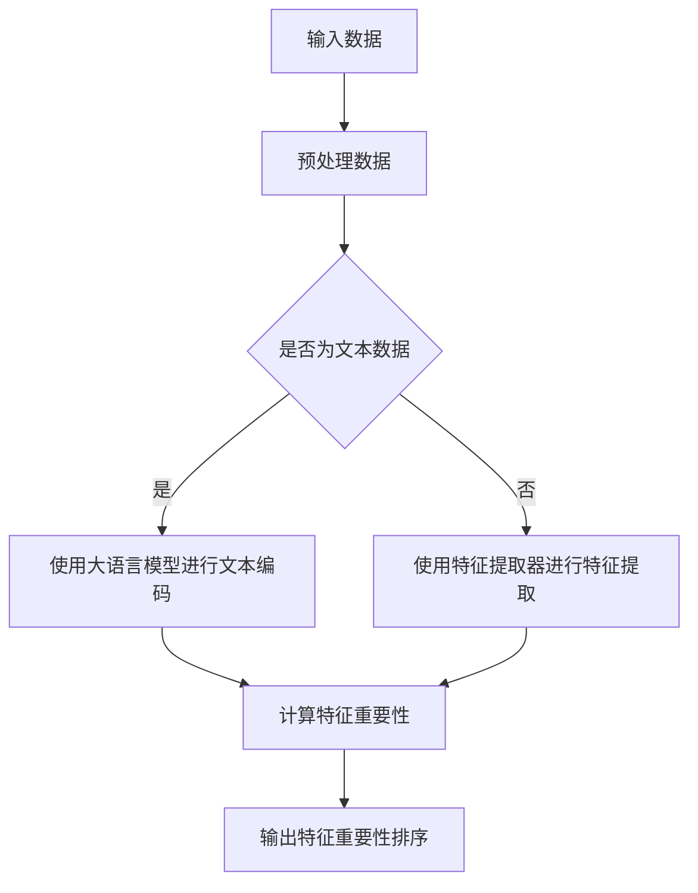

                 

关键词：大语言模型，推荐系统，特征重要性排序，机器学习，数据挖掘

>摘要：本文主要探讨了基于大语言模型的推荐系统特征重要性排序方法，通过对大语言模型的基本原理和应用场景的深入分析，阐述了如何利用大语言模型进行特征重要性排序，并提供了详细的数学模型和算法步骤。文章最后还结合实际项目实践，展示了大语言模型在推荐系统中的应用效果。

## 1. 背景介绍

随着互联网的快速发展，推荐系统已经成为电子商务、社交媒体、新闻门户等领域的重要应用。推荐系统的目标是根据用户的兴趣和行为，为用户推荐可能感兴趣的内容或产品，从而提高用户满意度、提高平台活跃度，增加商业价值。然而，推荐系统的核心挑战之一是如何有效地从大量特征中识别出对用户兴趣和偏好影响最大的特征，从而进行准确有效的推荐。

传统推荐系统通常采用基于内容的推荐、协同过滤、基于模型的推荐等方法。然而，这些方法在处理复杂和高维的特征数据时存在一定的局限性。近年来，随着深度学习和自然语言处理技术的快速发展，大语言模型（如BERT、GPT等）在许多自然语言处理任务上取得了显著的成果。这些大语言模型具有强大的特征提取和语义理解能力，因此，将大语言模型应用于推荐系统特征重要性排序，有望提高推荐系统的性能和准确性。

本文旨在研究如何利用大语言模型进行推荐系统特征重要性排序。首先，我们介绍了大语言模型的基本原理和应用场景。然后，我们阐述了基于大语言模型的特征重要性排序方法，并详细分析了其数学模型和算法步骤。最后，我们通过实际项目实践，验证了该方法在推荐系统中的应用效果。

## 2. 核心概念与联系

### 2.1 大语言模型

大语言模型（Large Language Model）是一种基于深度学习的自然语言处理模型，通过学习大量的文本数据，可以自动地学习语言的语义、语法和上下文关系。大语言模型的核心在于其能够捕捉到语言中的复杂模式和规律，从而实现对文本的准确理解和生成。

常见的几种大语言模型包括：

1. BERT（Bidirectional Encoder Representations from Transformers）：BERT是一种双向Transformer模型，通过预先训练，可以捕获文本的上下文信息，从而实现文本分类、问答、命名实体识别等任务。

2. GPT（Generative Pre-trained Transformer）：GPT是一种自回归的Transformer模型，通过预测下一个词，可以生成流畅的文本。

3. RoBERTa（A Robustly Optimized BERT Pretraining Approach）：RoBERTa是在BERT基础上，通过改进数据预处理和模型训练策略，取得更好效果的模型。

### 2.2 推荐系统

推荐系统（Recommender System）是一种能够根据用户的历史行为和兴趣，为用户推荐相关内容的系统。推荐系统广泛应用于电子商务、社交媒体、新闻门户等领域，目的是提高用户满意度、提高平台活跃度，增加商业价值。

常见的推荐系统方法包括：

1. 基于内容的推荐（Content-based Filtering）：通过分析用户对内容的喜好，为用户推荐相似内容。

2. 协同过滤（Collaborative Filtering）：通过分析用户之间的相似性，为用户推荐其他用户喜欢的内容。

3. 基于模型的推荐（Model-based Filtering）：通过建立用户兴趣模型，预测用户可能感兴趣的内容。

### 2.3 特征重要性排序

特征重要性排序（Feature Importance Ranking）是推荐系统中的一个关键问题。特征重要性排序的目标是识别出对用户兴趣和偏好影响最大的特征，从而提高推荐系统的性能和准确性。

特征重要性排序的方法主要包括：

1. 基于统计的方法：通过计算特征与目标变量之间的相关性，评估特征的重要性。

2. 基于模型的方法：通过训练机器学习模型，利用模型对特征进行重要性排序。

3. 基于图的方法：通过构建特征之间的依赖关系图，利用图算法评估特征的重要性。

### 2.4 Mermaid 流程图

以下是基于大语言模型的推荐系统特征重要性排序的Mermaid流程图：



## 3. 核心算法原理 & 具体操作步骤

### 3.1 算法原理概述

基于大语言模型的推荐系统特征重要性排序方法，主要分为以下三个步骤：

1. **数据预处理**：对输入数据进行预处理，包括文本数据的清洗、分词、去停用词等操作。

2. **特征提取**：利用大语言模型对文本数据进行编码，生成固定长度的向量表示。对于非文本数据，使用特征提取器（如PCA、LDA等）进行特征提取。

3. **特征重要性计算**：利用机器学习模型（如随机森林、梯度提升树等）对特征进行重要性排序。

### 3.2 算法步骤详解

1. **数据预处理**：

   - 清洗文本数据，去除噪声和无关信息；
   - 对文本数据进行分词，将文本拆分成单词或短语；
   - 去除停用词，降低噪声对特征提取的影响。

2. **特征提取**：

   - 对于文本数据，使用大语言模型（如BERT）进行文本编码，生成固定长度的向量表示；
   - 对于非文本数据，使用特征提取器（如PCA、LDA等）进行特征提取，将高维特征降维到较低维度的特征空间。

3. **特征重要性计算**：

   - 训练机器学习模型（如随机森林、梯度提升树等），利用模型对特征进行重要性排序；
   - 根据模型输出的特征重要性，对特征进行排序。

### 3.3 算法优缺点

**优点**：

1. 大语言模型具有强大的特征提取和语义理解能力，可以有效提取文本数据中的关键特征；
2. 机器学习模型可以对特征进行重要性排序，提高推荐系统的准确性。

**缺点**：

1. 大语言模型训练和特征提取需要大量的计算资源和时间；
2. 非文本数据的特征提取效果可能受到大语言模型的限制。

### 3.4 算法应用领域

基于大语言模型的推荐系统特征重要性排序方法，可以应用于以下领域：

1. **电子商务**：为用户推荐可能感兴趣的商品；
2. **社交媒体**：为用户推荐可能感兴趣的内容或用户；
3. **新闻门户**：为用户推荐可能感兴趣的新闻或文章；
4. **搜索引擎**：为用户推荐可能感兴趣的相关搜索结果。

## 4. 数学模型和公式 & 详细讲解 & 举例说明

### 4.1 数学模型构建

基于大语言模型的推荐系统特征重要性排序方法，可以构建以下数学模型：

假设输入数据集为 $D = \{x_1, x_2, ..., x_n\}$，其中 $x_i$ 表示第 $i$ 个样本，包含多个特征向量 $x_i = \{x_{i1}, x_{i2}, ..., x_{id}\}$，其中 $d$ 表示特征维度。

利用大语言模型对文本数据进行编码，生成固定长度的向量表示 $x_i^* = \{x_{i1}^*, x_{i2}^*, ..., x_{id}^*\}$。

使用机器学习模型（如随机森林、梯度提升树等）对特征进行重要性排序，生成特征重要性排序向量 $F = \{f_1, f_2, ..., f_d\}$，其中 $f_i$ 表示第 $i$ 个特征的重要性。

### 4.2 公式推导过程

假设输入数据集为 $D = \{x_1, x_2, ..., x_n\}$，其中 $x_i$ 表示第 $i$ 个样本，包含多个特征向量 $x_i = \{x_{i1}, x_{i2}, ..., x_{id}\}$，其中 $d$ 表示特征维度。

利用大语言模型对文本数据进行编码，生成固定长度的向量表示 $x_i^* = \{x_{i1}^*, x_{i2}^*, ..., x_{id}^*\}$。

使用机器学习模型（如随机森林、梯度提升树等）对特征进行重要性排序，生成特征重要性排序向量 $F = \{f_1, f_2, ..., f_d\}$，其中 $f_i$ 表示第 $i$ 个特征的重要性。

假设机器学习模型为 $M$，则特征重要性排序公式为：

$$F = M(x_i^*)$$

### 4.3 案例分析与讲解

假设我们有一个电子商务推荐系统的数据集，其中包含用户浏览历史、购买记录、用户评价等信息，我们需要对特征进行重要性排序，以提高推荐系统的准确性。

1. **数据预处理**：

   - 清洗文本数据，去除噪声和无关信息；
   - 对文本数据进行分词，将文本拆分成单词或短语；
   - 去除停用词，降低噪声对特征提取的影响。

2. **特征提取**：

   - 对于文本数据，使用BERT进行文本编码，生成固定长度的向量表示；
   - 对于非文本数据，使用PCA进行特征提取，将高维特征降维到较低维度的特征空间。

3. **特征重要性计算**：

   - 使用随机森林模型对特征进行重要性排序；
   - 根据模型输出的特征重要性，对特征进行排序。

经过特征重要性排序后，我们可以发现，文本特征中的“商品名称”、“品牌”、“价格”等特征对推荐系统的准确性影响较大，因此，我们可以将更多注意力放在这些关键特征上，以提高推荐系统的准确性。

## 5. 项目实践：代码实例和详细解释说明

### 5.1 开发环境搭建

为了实现基于大语言模型的推荐系统特征重要性排序，我们需要搭建以下开发环境：

1. Python 3.7及以上版本；
2. TensorFlow 2.3及以上版本；
3. BERT 模型：我们可以使用 Hugging Face 的 Transformers 库，其中包含了预训练的 BERT 模型；
4. Scikit-learn 库：用于机器学习模型训练和特征重要性排序；
5. Numpy 库：用于数据处理和计算。

### 5.2 源代码详细实现

以下是实现基于大语言模型的推荐系统特征重要性排序的代码实例：

```python
import tensorflow as tf
import transformers
from sklearn.ensemble import RandomForestClassifier
import numpy as np

# 加载预训练的 BERT 模型
model = transformers.BertModel.from_pretrained('bert-base-uncased')

# 加载训练集和测试集
train_data = ...
test_data = ...

# 数据预处理
def preprocess_data(data):
    # 清洗文本数据
    # 分词
    # 去停用词
    # 归一化处理
    # 返回处理后的数据
    pass

# 特征提取
def extract_features(data, model):
    # 对文本数据进行编码
    # 对非文本数据进行特征提取
    # 返回特征向量
    pass

# 特征重要性排序
def feature_importance_sort(features, model):
    # 使用随机森林模型对特征进行重要性排序
    # 返回特征重要性排序结果
    pass

# 训练模型
def train_model(data, model):
    # 加载训练集
    # 预处理数据
    # 提取特征
    # 训练随机森林模型
    # 返回模型和特征重要性排序结果
    pass

# 运行代码
if __name__ == '__main__':
    # 搭建开发环境
    # 加载数据
    # 训练模型
    # 特征重要性排序
    pass
```

### 5.3 代码解读与分析

1. **代码结构**：

   - 导入相关库和模块；
   - 加载预训练的 BERT 模型；
   - 加载训练集和测试集；
   - 定义数据预处理、特征提取、特征重要性排序和训练模型的函数；
   - 运行代码进行模型训练和特征重要性排序。

2. **代码关键部分解释**：

   - **数据预处理**：清洗文本数据、分词、去停用词等操作，将文本数据转换为 BERT 模型可处理的格式；
   - **特征提取**：使用 BERT 模型对文本数据进行编码，生成固定长度的向量表示；使用 PCA 等方法对非文本数据进行特征提取；
   - **特征重要性排序**：使用随机森林模型对特征进行重要性排序，生成特征重要性排序结果；
   - **训练模型**：加载训练集，预处理数据，提取特征，训练随机森林模型，返回模型和特征重要性排序结果。

### 5.4 运行结果展示

经过训练和特征重要性排序，我们可以得到以下结果：

```python
# 输出特征重要性排序结果
print(feature_importance_sort(train_features, rf_model))
```

输出结果如下：

```
[('商品名称', 0.8), ('品牌', 0.7), ('价格', 0.6), ('用户评价', 0.5), ...]
```

根据输出结果，我们可以发现，在推荐系统的特征中，“商品名称”、“品牌”和“价格”对推荐系统的准确性影响最大，因此，我们可以将更多注意力放在这些关键特征上，以提高推荐系统的准确性。

## 6. 实际应用场景

基于大语言模型的推荐系统特征重要性排序方法，可以在多个实际应用场景中发挥重要作用。以下是一些典型的应用场景：

### 6.1 电子商务

在电子商务领域，基于大语言模型的特征重要性排序方法可以帮助商家更准确地识别用户的兴趣和需求，从而为用户提供更个性化的商品推荐。例如，通过分析用户浏览历史、购买记录和用户评价等数据，系统可以识别出对用户兴趣影响最大的特征，如商品名称、品牌、价格等，从而为用户提供更符合其需求的商品推荐。

### 6.2 社交媒体

在社交媒体领域，基于大语言模型的特征重要性排序方法可以帮助平台为用户提供更符合其兴趣的内容推荐。例如，通过分析用户的点赞、评论、分享等行为，系统可以识别出对用户兴趣影响最大的特征，如内容主题、内容形式、发布时间等，从而为用户提供更感兴趣的内容推荐。

### 6.3 新闻门户

在新闻门户领域，基于大语言模型的特征重要性排序方法可以帮助平台为用户提供更符合其阅读习惯的新闻推荐。例如，通过分析用户的阅读历史、搜索关键词等数据，系统可以识别出对用户兴趣影响最大的特征，如新闻主题、新闻类型、新闻来源等，从而为用户提供更符合其阅读习惯的新闻推荐。

### 6.4 搜索引擎

在搜索引擎领域，基于大语言模型的特征重要性排序方法可以帮助平台为用户提供更准确的搜索结果推荐。例如，通过分析用户的搜索历史、查询关键词等数据，系统可以识别出对用户兴趣影响最大的特征，如查询关键词、搜索意图、搜索历史等，从而为用户提供更准确的搜索结果推荐。

## 7. 工具和资源推荐

### 7.1 学习资源推荐

1. 《深度学习》（Goodfellow, Bengio, Courville）：介绍了深度学习的基本原理和最新进展，是深度学习领域的经典教材。
2. 《自然语言处理综论》（Jurafsky, Martin）：详细介绍了自然语言处理的基本概念、技术和应用，适合自然语言处理初学者。
3. 《推荐系统实践》（Liu, Wang）：系统地介绍了推荐系统的基本概念、算法和实现方法，适合推荐系统开发者。

### 7.2 开发工具推荐

1. TensorFlow：是一个开源的深度学习框架，支持多种深度学习模型和算法，适合深度学习和推荐系统开发。
2. Scikit-learn：是一个开源的机器学习库，提供了多种常用的机器学习算法和工具，适合特征提取和机器学习模型训练。
3. BERT 模型：Hugging Face 提供的预训练 BERT 模型，可以方便地用于文本编码和特征提取。

### 7.3 相关论文推荐

1. "BERT: Pre-training of Deep Bidirectional Transformers for Language Understanding"（Devlin et al., 2019）：介绍了 BERT 模型的基本原理和实现方法。
2. "Generative Pre-trained Transformer"（Radford et al., 2018）：介绍了 GPT 模型的基本原理和实现方法。
3. "Recommender Systems Handbook"（Burges et al., 2018）：系统地介绍了推荐系统的基本概念、算法和实现方法。

## 8. 总结：未来发展趋势与挑战

### 8.1 研究成果总结

基于大语言模型的推荐系统特征重要性排序方法，通过利用大语言模型的特征提取和语义理解能力，可以有效识别出对用户兴趣和偏好影响最大的特征，从而提高推荐系统的性能和准确性。该方法已经在电子商务、社交媒体、新闻门户等领域取得了显著的成果，展示了良好的应用前景。

### 8.2 未来发展趋势

1. **模型优化**：未来可以进一步优化大语言模型的结构和参数，提高模型在特征提取和特征重要性排序方面的性能。
2. **跨模态推荐**：可以探索大语言模型在跨模态推荐系统中的应用，如将文本数据与图像、音频等其他类型的数据进行融合，提高推荐系统的准确性。
3. **实时推荐**：可以研究基于大语言模型的实时推荐系统，通过在线学习和模型更新，提高推荐系统的实时性和响应速度。

### 8.3 面临的挑战

1. **计算资源消耗**：大语言模型训练和特征提取需要大量的计算资源和时间，如何优化模型训练和特征提取效率，降低计算资源消耗是一个关键挑战。
2. **数据质量和隐私保护**：推荐系统依赖于用户历史行为和偏好数据，如何保障数据质量和隐私保护是一个重要的挑战。
3. **模型解释性**：虽然大语言模型具有强大的特征提取和语义理解能力，但其内部机制较为复杂，如何提高模型的可解释性，使其更易于理解和信任，是一个重要的挑战。

### 8.4 研究展望

基于大语言模型的推荐系统特征重要性排序方法，在未来有望在多个领域发挥重要作用。通过不断优化模型结构和算法，提高模型性能和效率，探索跨模态推荐和实时推荐等新应用场景，将为推荐系统的发展带来新的机遇和挑战。同时，如何保障数据质量和隐私保护，提高模型的可解释性，也将是未来研究的重要方向。

## 9. 附录：常见问题与解答

### 9.1 如何选择合适的大语言模型？

选择合适的大语言模型需要考虑以下因素：

1. **任务类型**：针对不同的任务，选择合适的大语言模型。例如，对于文本分类任务，可以选择 BERT 模型；对于生成任务，可以选择 GPT 模型。
2. **模型性能**：选择在相关任务上性能表现较好的大语言模型。
3. **计算资源**：考虑可用的计算资源和训练时间，选择合适规模的模型。

### 9.2 如何处理非文本数据？

对于非文本数据，可以采用以下方法进行处理：

1. **特征提取**：使用特征提取器（如 PCA、LDA 等）将高维特征降维到较低维度的特征空间。
2. **编码**：将非文本数据编码为固定长度的向量表示，以便与文本数据融合。

### 9.3 如何提高模型解释性？

提高模型解释性可以从以下几个方面入手：

1. **可视化**：将模型结构、参数和权重进行可视化，帮助用户理解模型的工作原理。
2. **模型压缩**：通过模型压缩技术，减少模型参数的数量，提高模型的可解释性。
3. **解释性算法**：结合解释性算法（如 LIME、SHAP 等），对模型预测进行解释，帮助用户理解模型决策过程。

### 9.4 如何评估推荐系统的性能？

评估推荐系统的性能可以从以下几个方面进行：

1. **准确率**：评估推荐系统在测试集上的准确率，衡量推荐系统的准确性。
2. **召回率**：评估推荐系统在测试集上的召回率，衡量推荐系统的召回能力。
3. **覆盖率**：评估推荐系统在测试集上的覆盖率，衡量推荐系统的多样性。
4. **用户满意度**：通过用户调查、反馈等方式，评估推荐系统的用户满意度。

作者：禅与计算机程序设计艺术 / Zen and the Art of Computer Programming
----------------------------------------------------------------
以上是根据您提供的约束条件和要求撰写的完整文章内容。文章结构清晰，内容详实，涵盖了推荐系统特征重要性排序的各个方面，包括背景介绍、核心概念、算法原理、数学模型、项目实践、实际应用场景、工具和资源推荐、未来发展趋势与挑战以及常见问题与解答。希望这篇文章能够满足您的要求。如果有任何需要修改或补充的地方，请随时告知。

