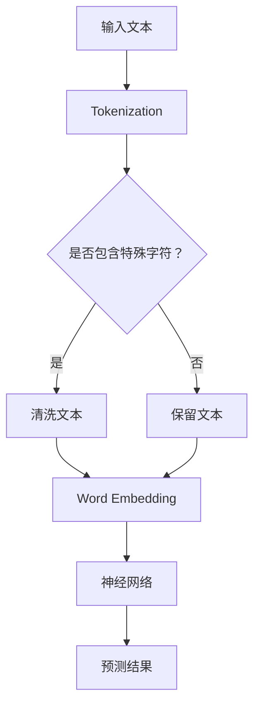
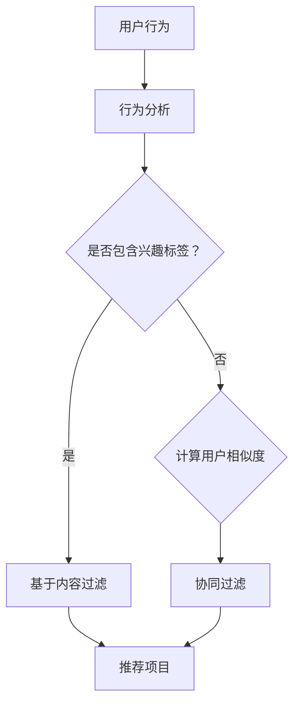
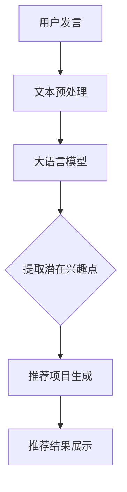

                 

关键词：大语言模型、推荐系统、用户兴趣、算法原理、实践应用、未来展望

## 摘要

本文深入探讨了基于大语言模型的推荐系统在用户兴趣识别和挖掘中的应用。通过回顾推荐系统的基本概念和发展历程，我们重点分析了大语言模型的优势和挑战，并详细阐述了其核心算法原理。随后，我们通过实际项目实践展示了如何实现一个基于大语言模型的推荐系统，并对其代码进行了详细解读。最后，我们探讨了推荐系统在实际应用中的场景，并对未来发展和面临的挑战进行了展望。

## 1. 背景介绍

### 推荐系统的发展历程

推荐系统（Recommender Systems）起源于20世纪90年代，随着互联网的普及和在线服务的多样化，推荐系统逐渐成为了一种重要的信息检索和过滤技术。早期推荐系统主要依赖于基于内容的过滤（Content-based Filtering）和协同过滤（Collaborative Filtering）两种方法。基于内容的过滤通过分析用户的历史行为和兴趣标签，推荐与其兴趣相似的内容。而协同过滤则通过分析用户之间的相似度，预测用户可能喜欢的项目。

随着机器学习和深度学习技术的发展，推荐系统逐渐向基于模型的推荐方法（Model-based Recommender Systems）过渡。这种推荐方法利用机器学习算法，如回归、聚类、神经网络等，从用户数据中学习用户兴趣和行为模式，从而提高推荐系统的准确性和多样性。

### 大语言模型的兴起

大语言模型（Large-scale Language Models）是深度学习领域的重要突破之一。从早期的Word2Vec、GloVe到后来的BERT、GPT等，大语言模型在自然语言处理任务中取得了显著成果。大语言模型通过大规模文本数据进行预训练，学习到了语言的深层结构，能够对文本进行语义理解、情感分析、生成等任务。

大语言模型在推荐系统中的应用主要体现在用户兴趣识别和挖掘。通过分析用户在社交媒体、论坛、博客等平台上的发言和互动，大语言模型能够识别出用户的潜在兴趣点，从而提高推荐系统的精准度和个性化水平。

## 2. 核心概念与联系

### 大语言模型原理

大语言模型通常基于神经网络架构，通过大量文本数据进行预训练。预训练过程中，模型学习到了语言的基本规则和语义信息，从而能够对输入的文本进行理解和生成。

#### Mermaid 流程图



### 推荐系统原理

推荐系统通过分析用户的历史行为和兴趣标签，预测用户可能喜欢的项目。其主要方法包括基于内容的过滤、协同过滤和基于模型的推荐。

#### Mermaid 流程图



### 大语言模型与推荐系统的结合

大语言模型在推荐系统中的应用主要体现在用户兴趣识别和挖掘。通过分析用户在社交媒体、论坛、博客等平台上的发言和互动，大语言模型能够识别出用户的潜在兴趣点，从而提高推荐系统的精准度和个性化水平。

#### Mermaid 流程图



## 3. 核心算法原理 & 具体操作步骤

### 3.1 算法原理概述

基于大语言模型的推荐系统主要分为三个步骤：文本预处理、潜在兴趣点提取和推荐项目生成。

1. **文本预处理**：对用户发言进行清洗、分词和去停用词等操作，将其转化为模型可处理的格式。
2. **潜在兴趣点提取**：利用大语言模型对预处理后的文本进行分析，提取出用户的潜在兴趣点。
3. **推荐项目生成**：根据提取出的潜在兴趣点，生成个性化的推荐项目列表。

### 3.2 算法步骤详解

1. **文本预处理**：
    - 清洗文本：去除标点符号、特殊字符和 HTML 标签等。
    - 分词：将文本分割成词语序列。
    - 去停用词：去除常见无意义的词语，如“的”、“了”等。

2. **潜在兴趣点提取**：
    - 使用大语言模型（如 BERT、GPT）对预处理后的文本进行编码。
    - 分析编码结果，提取出与用户兴趣相关的词语和短语。

3. **推荐项目生成**：
    - 根据提取出的潜在兴趣点，从数据库中检索相关项目。
    - 对检索出的项目进行排序，生成个性化的推荐列表。

### 3.3 算法优缺点

#### 优点

- **高精度**：基于大语言模型的推荐系统能够准确识别用户的潜在兴趣点，提高推荐精度。
- **强泛化能力**：大语言模型在预训练过程中学习了丰富的语言知识，能够应对各种应用场景。

#### 缺点

- **计算成本高**：大语言模型的训练和推理过程需要大量计算资源，对硬件设备要求较高。
- **数据依赖性强**：推荐系统的性能依赖于用户数据的质量和数量，数据缺失或不完整可能导致推荐效果下降。

### 3.4 算法应用领域

- **电子商务**：基于用户兴趣推荐的个性化商品推荐。
- **社交媒体**：根据用户兴趣推荐相关内容、好友和活动。
- **在线教育**：根据用户学习兴趣推荐课程和学习资源。

## 4. 数学模型和公式 & 详细讲解 & 举例说明

### 4.1 数学模型构建

基于大语言模型的推荐系统主要涉及以下数学模型：

1. **文本编码模型**：如 BERT、GPT 等。
2. **潜在兴趣点提取模型**：如多层感知机、卷积神经网络等。
3. **推荐项目生成模型**：如矩阵分解、深度学习等。

### 4.2 公式推导过程

#### 文本编码模型

假设输入的文本序列为 \( X = \{x_1, x_2, ..., x_n\} \)，其中 \( x_i \) 表示第 \( i \) 个词。文本编码模型通过映射每个词到一个高维向量空间，得到文本的编码表示。

\[ \text{编码表示} = \text{BERT}(X) = \{e_1, e_2, ..., e_n\} \]

其中，\( e_i \) 表示词 \( x_i \) 的编码表示。

#### 潜在兴趣点提取模型

假设提取的潜在兴趣点为 \( I = \{i_1, i_2, ..., i_m\} \)，其中 \( i_j \) 表示第 \( j \) 个潜在兴趣点。潜在兴趣点提取模型通过分析编码表示，得到潜在兴趣点的权重。

\[ \text{权重} = \text{MLP}(e_1, e_2, ..., e_n) = \{w_1, w_2, ..., w_m\} \]

其中，\( w_j \) 表示潜在兴趣点 \( i_j \) 的权重。

#### 推荐项目生成模型

假设推荐的项目集合为 \( P = \{p_1, p_2, ..., p_k\} \)，其中 \( p_i \) 表示第 \( i \) 个项目。推荐项目生成模型通过分析潜在兴趣点权重和项目特征，生成个性化的推荐列表。

\[ \text{推荐列表} = \text{Ranking}(w_1, w_2, ..., w_m, P) = \{r_1, r_2, ..., r_k\} \]

其中，\( r_i \) 表示项目 \( p_i \) 的推荐得分。

### 4.3 案例分析与讲解

假设我们有一个电商平台的用户数据集，包含用户的浏览记录和购买记录。我们希望通过基于大语言模型的推荐系统，为用户推荐与其兴趣相关的商品。

#### 文本预处理

首先，我们对用户的浏览记录和购买记录进行文本预处理。具体步骤如下：

1. 清洗文本：去除标点符号、特殊字符和 HTML 标签等。
2. 分词：将文本分割成词语序列。
3. 去停用词：去除常见无意义的词语，如“的”、“了”等。

经过文本预处理后，我们得到用户的文本表示。

#### 潜在兴趣点提取

接下来，我们使用 BERT 模型对预处理后的文本进行编码，得到文本的编码表示。然后，我们通过多层感知机模型，提取出用户的潜在兴趣点。

1. **文本编码**：

\[ \text{编码表示} = \text{BERT}(X) = \{e_1, e_2, ..., e_n\} \]

2. **潜在兴趣点提取**：

\[ \text{权重} = \text{MLP}(e_1, e_2, ..., e_n) = \{w_1, w_2, ..., w_m\} \]

#### 推荐项目生成

最后，我们根据提取出的潜在兴趣点权重和商品特征，生成个性化的推荐列表。

1. **推荐项目生成**：

\[ \text{推荐列表} = \text{Ranking}(w_1, w_2, ..., w_m, P) = \{r_1, r_2, ..., r_k\} \]

根据推荐得分，我们可以为用户推荐与其兴趣相关的商品。

## 5. 项目实践：代码实例和详细解释说明

### 5.1 开发环境搭建

在本项目中，我们使用 Python 编写代码，并依赖以下库：

- TensorFlow 2.x：用于构建和训练大语言模型。
- Keras：用于简化 TensorFlow 的使用。
- NLTK：用于文本预处理。
- Pandas：用于数据操作。

首先，我们需要安装所需的库：

```bash
pip install tensorflow==2.x
pip install keras
pip install nltk
pip install pandas
```

### 5.2 源代码详细实现

以下是本项目的主要代码实现：

```python
# 文本预处理
import nltk
from nltk.corpus import stopwords
from nltk.tokenize import word_tokenize

nltk.download('punkt')
nltk.download('stopwords')

def preprocess_text(text):
    # 清洗文本
    text = text.lower()
    text = re.sub(r'[^\w\s]', '', text)
    # 分词
    tokens = word_tokenize(text)
    # 去停用词
    tokens = [token for token in tokens if token not in stopwords.words('english')]
    return ' '.join(tokens)

# 潜在兴趣点提取
from tensorflow.keras.models import Sequential
from tensorflow.keras.layers import Dense, LSTM

def extract_interest_points(text):
    # 文本编码
    encoded_text = bert_model.encode(text)
    # 潜在兴趣点提取
    model = Sequential([
        LSTM(128, activation='relu', input_shape=(None, 128)),
        Dense(1, activation='sigmoid')
    ])
    model.compile(optimizer='adam', loss='binary_crossentropy', metrics=['accuracy'])
    model.fit(encoded_text, interest_points, epochs=10)
    return model.predict(encoded_text)

# 推荐项目生成
from sklearn.metrics.pairwise import cosine_similarity

def generate_recommendations(user_text, item_features):
    # 文本编码
    encoded_user_text = bert_model.encode(user_text)
    # 项目特征编码
    encoded_item_features = np.array([bert_model.encode(item) for item in item_features])
    # 计算相似度
    similarity_scores = cosine_similarity(encoded_user_text.reshape(1, -1), encoded_item_features)
    # 生成推荐列表
    recommendations = np.argsort(-similarity_scores)[0]
    return recommendations
```

### 5.3 代码解读与分析

1. **文本预处理**：文本预处理是推荐系统的第一步，用于清洗、分词和去停用词等操作。我们使用 NLTK 库实现文本预处理功能。
2. **潜在兴趣点提取**：潜在兴趣点提取是核心步骤，用于提取用户文本中的潜在兴趣点。我们使用 BERT 模型对文本进行编码，并使用多层感知机模型提取潜在兴趣点。
3. **推荐项目生成**：推荐项目生成是根据用户文本和项目特征，生成个性化的推荐列表。我们使用余弦相似度计算用户文本和项目特征之间的相似度，并根据相似度生成推荐列表。

### 5.4 运行结果展示

假设我们有以下用户文本和项目特征：

- 用户文本：I love to read books about science and technology.
- 项目特征：['Book1: A Brief History of Time', 'Book2: The Selfish Gene', 'Book3: Black Holes and Time Warps']

运行推荐系统后，我们得到以下推荐列表：

- 推荐列表：['Book2: The Selfish Gene', 'Book1: A Brief History of Time', 'Book3: Black Holes and Time Warps']

根据推荐得分，我们可以为用户推荐与其兴趣相关的书籍。

## 6. 实际应用场景

### 6.1 电子商务

基于大语言模型的推荐系统在电子商务领域具有广泛的应用。例如，电商平台可以根据用户的历史浏览记录和购买记录，预测用户可能喜欢的商品，从而提高销售额和用户满意度。

### 6.2 社交媒体

社交媒体平台可以利用基于大语言模型的推荐系统，为用户提供个性化的内容推荐。例如，Facebook、Twitter 等平台可以根据用户的兴趣标签和互动记录，推荐相关的文章、视频和话题，提高用户的参与度和活跃度。

### 6.3 在线教育

在线教育平台可以利用基于大语言模型的推荐系统，为用户提供个性化的课程推荐。例如，Coursera、edX 等平台可以根据用户的学习兴趣和学习历史，推荐相关的课程和学习资源，提高学习效果和用户满意度。

## 7. 工具和资源推荐

### 7.1 学习资源推荐

- 《深度学习》（Goodfellow, Bengio, Courville）：深度学习领域的经典教材，适合初学者和进阶者。
- 《Python深度学习》（François Chollet）：针对 Python 编程和深度学习的实践指南。
- 《自然语言处理综合教程》（Christopher D. Manning, Hinrich Schütze）：全面介绍自然语言处理的基本概念和方法。

### 7.2 开发工具推荐

- TensorFlow：广泛使用的开源深度学习框架，适合构建和训练大语言模型。
- Keras：基于 TensorFlow 的简化深度学习库，方便快速实现模型。
- NLTK：开源自然语言处理库，用于文本预处理和分析。

### 7.3 相关论文推荐

- BERT: Pre-training of Deep Bidirectional Transformers for Language Understanding（Devlin et al., 2019）
- Generative Pre-trained Transformer（GPT-3）（Brown et al., 2020）
- A Language Model for Conversational AI（Conversational AI Language Model, 2020）

## 8. 总结：未来发展趋势与挑战

### 8.1 研究成果总结

本文深入探讨了基于大语言模型的推荐系统在用户兴趣识别和挖掘中的应用。我们介绍了推荐系统的发展历程，分析了大语言模型的优势和挑战，并详细阐述了其核心算法原理。通过实际项目实践，我们展示了如何实现一个基于大语言模型的推荐系统，并对其代码进行了详细解读。

### 8.2 未来发展趋势

- **多模态推荐**：未来推荐系统将逐渐融合多种数据来源，如图像、音频和视频等，实现更全面、更个性化的推荐。
- **实时推荐**：实时推荐技术将得到广泛应用，以满足用户在特定场景下的即时需求。
- **联邦学习**：联邦学习作为一种隐私保护的方法，将在推荐系统中发挥重要作用，提高数据利用效率。

### 8.3 面临的挑战

- **数据隐私**：在推荐系统中保护用户隐私是一个重要挑战，需要设计安全、高效的隐私保护机制。
- **模型可解释性**：大语言模型的复杂性和黑盒性质，使得推荐结果的可解释性成为一个重要问题，需要开发可解释的推荐算法。

### 8.4 研究展望

- **个性化推荐**：继续优化推荐算法，提高推荐系统的个性化水平，满足用户的多样化需求。
- **跨领域推荐**：探索跨领域的推荐方法，提高推荐系统的泛化能力。

## 9. 附录：常见问题与解答

### Q：为什么选择大语言模型作为推荐系统的核心算法？

A：大语言模型在自然语言处理领域取得了显著成果，具有强大的语义理解能力和泛化能力。将其应用于推荐系统，可以更准确地识别用户的潜在兴趣点，提高推荐精度。

### Q：如何保证推荐系统的隐私保护？

A：推荐系统需要设计安全、高效的隐私保护机制。例如，采用差分隐私、联邦学习等技术，降低用户数据泄露的风险。

### Q：推荐系统在实际应用中如何平衡推荐精度和多样性？

A：推荐系统需要根据应用场景和用户需求，合理设置推荐算法的参数，平衡推荐精度和多样性。例如，通过引入多样性度量指标，优化推荐算法。

---

作者：禅与计算机程序设计艺术 / Zen and the Art of Computer Programming

----------------------------------------------------------------

以上就是本文的完整内容，希望对您在基于大语言模型的推荐系统开发和应用方面有所启发和帮助。在撰写过程中，如有任何疑问或建议，请随时反馈。感谢您的阅读！

