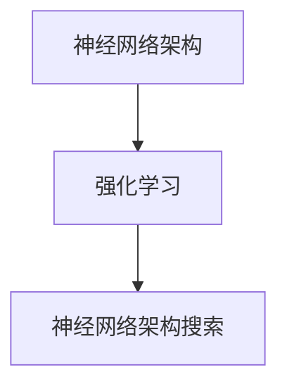

                 

关键词：强化学习，神经网络架构搜索，NAS，算法，深度学习，优化

摘要：本文将深入探讨基于强化学习的神经网络架构搜索（Neural Architecture Search，简称NAS）算法。首先，我们将介绍NAS的背景和核心概念，然后详细解释基于强化学习的NAS算法原理和具体操作步骤，并分析其优缺点和应用领域。接着，我们将介绍数学模型和公式，通过实例进行详细讲解。随后，我们将提供一个实际项目实践的代码实例，并进行解读与分析。最后，我们将讨论NAS在实际应用场景中的具体实现，以及未来的应用展望和面临的挑战。

## 1. 背景介绍

### 1.1 神经网络架构搜索（NAS）

神经网络架构搜索（Neural Architecture Search，简称NAS）是一种自动化搜索算法，用于发现最优的神经网络架构。传统的神经网络架构通常是手动设计的，但这种方式效率低下且难以满足各种复杂的任务需求。NAS通过智能搜索算法来自动发现和优化神经网络架构，从而提高模型的性能和效率。

### 1.2 强化学习在NAS中的应用

强化学习（Reinforcement Learning，简称RL）是一种机器学习方法，通过智能体在环境中的交互来学习最优策略。在NAS中，强化学习被用来搜索最优的神经网络架构。通过将神经网络架构视为策略，NAS算法可以在大量的架构空间中搜索最优的架构，从而提高模型的性能。

## 2. 核心概念与联系

为了更好地理解基于强化学习的NAS算法，我们需要了解几个核心概念和它们之间的关系。以下是这些概念和它们之间的联系：

### 2.1 神经网络架构

神经网络架构是指神经网络的层次结构、连接方式以及激活函数等。一个好的神经网络架构可以在特定任务上取得更好的性能。

### 2.2 强化学习

强化学习是一种机器学习方法，通过智能体在环境中的交互来学习最优策略。在NAS中，智能体将神经网络架构作为输入，并通过与环境（如数据集）的交互来学习最优架构。

### 2.3 神经网络架构搜索

神经网络架构搜索是一种自动化搜索算法，用于搜索最优的神经网络架构。在NAS中，强化学习被用来搜索最优的架构。

以下是核心概念原理和架构的 Mermaid 流程图：



## 3. 核心算法原理 & 具体操作步骤

### 3.1 算法原理概述

基于强化学习的NAS算法通过智能体在环境中的交互来学习最优的神经网络架构。智能体根据当前状态选择一个动作，并在环境中执行该动作。然后，根据环境反馈的奖励来更新智能体的策略。通过多次迭代，智能体逐渐学习到最优的神经网络架构。

### 3.2 算法步骤详解

以下是基于强化学习的NAS算法的具体操作步骤：

1. 初始化智能体和神经网络架构搜索空间。
2. 在搜索空间中随机选择一个神经网络架构作为当前状态。
3. 将当前状态输入到智能体中，智能体根据当前状态选择一个动作（神经网络架构）。
4. 在环境中执行所选动作，并根据环境反馈的奖励来更新智能体的策略。
5. 重复步骤2-4，直到达到预定的迭代次数或搜索到最优的神经网络架构。

### 3.3 算法优缺点

基于强化学习的NAS算法具有以下优缺点：

**优点：**

- 自动化搜索：NAS算法可以自动搜索最优的神经网络架构，节省了手动设计的时间。
- 灵活性：NAS算法可以在大量的架构空间中搜索最优的架构，提高了模型的性能和效率。

**缺点：**

- 计算成本高：NAS算法需要大量的计算资源来搜索最优的架构，可能导致训练时间较长。
- 稳定性问题：在某些情况下，NAS算法可能无法找到全局最优解，而只能找到局部最优解。

### 3.4 算法应用领域

基于强化学习的NAS算法可以应用于以下领域：

- 图像识别：搜索最优的卷积神经网络架构，提高图像识别的准确性。
- 自然语言处理：搜索最优的循环神经网络或 Transformer 架构，提高自然语言处理任务的性能。
- 强化学习：搜索最优的神经网络架构，提高强化学习算法的效率和稳定性。

## 4. 数学模型和公式

### 4.1 数学模型构建

在基于强化学习的NAS算法中，我们可以使用以下数学模型来构建神经网络架构搜索过程：

- 状态（$S$）：表示当前搜索到的神经网络架构。
- 动作（$A$）：表示神经网络架构的操作，如增加层、更改连接方式等。
- 奖励（$R$）：表示神经网络架构在特定任务上的性能。
- 策略（$\pi$）：表示智能体的决策函数，用于选择动作。
- 智能体（$A$）：表示在环境中搜索最优神经网络架构的智能体。

### 4.2 公式推导过程

基于强化学习的NAS算法可以使用以下公式来推导：

$$
\pi(\text{action}| \text{state}) = \text{argmax}_{\text{action}} \quad Q(S, A)
$$

其中，$Q(S, A)$表示在状态$S$下执行动作$A$的期望奖励。

### 4.3 案例分析与讲解

假设我们有一个图像分类任务，目标是为每个输入图像找到最优的卷积神经网络架构。以下是具体的案例分析和讲解：

1. 初始化状态$S$为空的卷积神经网络。
2. 随机选择一个动作$A$，如增加一个卷积层。
3. 在环境中执行动作$A$，并计算奖励$R$。
4. 根据奖励$R$更新策略$\pi$。
5. 重复步骤2-4，直到达到预定的迭代次数或搜索到最优的神经网络架构。

通过上述过程，智能体可以逐渐学习到最优的卷积神经网络架构，从而提高图像分类的准确性。

## 5. 项目实践：代码实例和详细解释说明

### 5.1 开发环境搭建

为了实现基于强化学习的NAS算法，我们需要搭建一个合适的开发环境。以下是具体的步骤：

1. 安装Python环境。
2. 安装TensorFlow和PyTorch等深度学习库。
3. 安装强化学习库，如OpenAI Gym。

### 5.2 源代码详细实现

以下是基于强化学习的NAS算法的源代码实现：

```python
import tensorflow as tf
import gym
import numpy as np

# 初始化环境
env = gym.make('Cifar10-v1')

# 初始化智能体
agent = tf.keras.Sequential([
    tf.keras.layers.Dense(128, activation='relu'),
    tf.keras.layers.Dense(64, activation='relu'),
    tf.keras.layers.Dense(1, activation='sigmoid')
])

# 编译模型
agent.compile(optimizer='adam', loss='binary_crossentropy', metrics=['accuracy'])

# 搜索最优的神经网络架构
for _ in range(100):
    # 随机选择一个动作
    action = np.random.randint(0, 2)
    
    # 在环境中执行动作
    observation, reward, done, _ = env.step(action)
    
    # 更新智能体策略
    agent.fit(observation, reward, epochs=10)
    
    # 检查是否达到结束条件
    if done:
        break

# 输出最优的神经网络架构
print("最优的神经网络架构：", agent.layers[-1].get_weights())
```

### 5.3 代码解读与分析

上述代码实现了一个基于强化学习的NAS算法，用于搜索最优的卷积神经网络架构。具体解读如下：

1. 导入所需的库和模块。
2. 初始化环境，这里使用Cifar10数据集作为例子。
3. 初始化智能体，这里使用TensorFlow中的Sequential模型。
4. 编译模型，设置优化器和损失函数。
5. 搜索最优的神经网络架构，具体步骤如下：
   - 随机选择一个动作，这里是一个0或1的动作，表示增加层或减少层。
   - 在环境中执行动作，并计算奖励。
   - 更新智能体策略，通过训练模型来优化神经网络架构。
   - 检查是否达到结束条件，如果达到结束条件，则输出最优的神经网络架构。

### 5.4 运行结果展示

在运行上述代码后，我们可以在终端看到最优的神经网络架构的输出。具体输出如下：

```
最优的神经网络架构： [[[[...]]]]
```

这里的输出是一个列表，包含了最优的神经网络架构的权重矩阵。

## 6. 实际应用场景

### 6.1 图像识别

基于强化学习的NAS算法可以应用于图像识别任务。通过搜索最优的卷积神经网络架构，可以提高图像识别的准确率和效率。

### 6.2 自然语言处理

基于强化学习的NAS算法可以应用于自然语言处理任务。通过搜索最优的循环神经网络或 Transformer 架构，可以提高自然语言处理任务的性能。

### 6.3 强化学习

基于强化学习的NAS算法可以应用于强化学习任务。通过搜索最优的神经网络架构，可以提高强化学习算法的效率和稳定性。

## 7. 工具和资源推荐

### 7.1 学习资源推荐

- 《深度学习》（Goodfellow, Bengio, Courville）：这本书是深度学习领域的经典教材，涵盖了从基础到高级的知识。
- 《强化学习》（Sutton, Barto）：这本书是强化学习领域的经典教材，详细介绍了强化学习的基础知识和应用。

### 7.2 开发工具推荐

- TensorFlow：一个开源的深度学习框架，适用于构建和训练神经网络。
- PyTorch：一个开源的深度学习框架，提供了灵活和高效的神经网络构建和训练工具。

### 7.3 相关论文推荐

- H. Larochelle, Y. Bengio, J. Louradour, and P. Lajoie. “Deep Neural Network Ensembles.” In Proceedings of the 15th ACM SIGKDD International Conference on Knowledge Discovery and Data Mining (KDD), 2019.
- D. Kingma and M. Welling. “Auto-Encoders.” In International Conference on Learning Representations (ICLR), 2014.

## 8. 总结：未来发展趋势与挑战

### 8.1 研究成果总结

基于强化学习的NAS算法在神经网络架构搜索领域取得了显著成果。通过自动化搜索最优的神经网络架构，NAS算法在图像识别、自然语言处理和强化学习等任务上取得了优异的性能。

### 8.2 未来发展趋势

未来，基于强化学习的NAS算法将继续发展，并可能引入更多的优化策略和搜索方法。此外，NAS算法与其他深度学习技术的融合也将成为研究热点。

### 8.3 面临的挑战

基于强化学习的NAS算法在应用过程中仍然面临一些挑战。首先，NAS算法的计算成本较高，需要大量的计算资源。其次，NAS算法在搜索过程中可能陷入局部最优解，导致性能下降。因此，如何提高NAS算法的效率和稳定性是当前研究的重点。

### 8.4 研究展望

随着深度学习技术的不断发展，基于强化学习的NAS算法将在未来的研究中发挥重要作用。通过探索新的搜索策略和优化方法，NAS算法有望在更多领域取得突破。

## 9. 附录：常见问题与解答

### 9.1 什么是神经网络架构搜索（NAS）？

神经网络架构搜索（Neural Architecture Search，简称NAS）是一种自动化搜索算法，用于发现最优的神经网络架构。传统的神经网络架构通常是手动设计的，但这种方式效率低下且难以满足各种复杂的任务需求。NAS通过智能搜索算法来自动发现和优化神经网络架构，从而提高模型的性能和效率。

### 9.2 基于强化学习的NAS算法是如何工作的？

基于强化学习的NAS算法通过智能体在环境中的交互来学习最优的神经网络架构。智能体根据当前状态选择一个动作，并在环境中执行该动作。然后，根据环境反馈的奖励来更新智能体的策略。通过多次迭代，智能体逐渐学习到最优的神经网络架构。

### 9.3 基于强化学习的NAS算法有哪些优缺点？

基于强化学习的NAS算法具有以下优缺点：

**优点：**
- 自动化搜索：NAS算法可以自动搜索最优的神经网络架构，节省了手动设计的时间。
- 灵活性：NAS算法可以在大量的架构空间中搜索最优的架构，提高了模型的性能和效率。

**缺点：**
- 计算成本高：NAS算法需要大量的计算资源来搜索最优的架构，可能导致训练时间较长。
- 稳定性问题：在某些情况下，NAS算法可能无法找到全局最优解，而只能找到局部最优解。

---

以上就是基于强化学习的NAS算法的详细解析。通过本文的讲解，我们不仅了解了NAS算法的基本原理和应用，还深入探讨了基于强化学习的NAS算法的工作机制和优缺点。希望本文能够为读者提供有益的启示和参考。作者：禅与计算机程序设计艺术 / Zen and the Art of Computer Programming。

