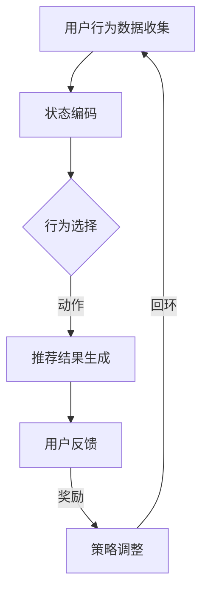

                 

在当今信息爆炸的时代，用户对于个性化推荐服务的需求日益增长。然而，传统的推荐系统往往面临一个巨大的挑战，即如何在动态变化的用户行为和内容环境中提供持续有效的推荐。为了应对这一挑战，强化学习（Reinforcement Learning，RL）作为一种具有自适应性和灵活性的机器学习方法，逐渐在动态推荐系统中得到应用。

本文旨在探讨基于强化学习的动态推荐策略适应，从背景介绍、核心概念与联系、核心算法原理、数学模型与公式、项目实践、实际应用场景等多个维度，深入分析强化学习在动态推荐系统中的潜在价值和实施策略。通过这篇文章，读者将了解强化学习如何通过不断的学习和调整，实现动态推荐系统的优化，从而更好地满足用户的需求。

## 1. 背景介绍

随着互联网的普及和社交媒体的兴起，用户生成的内容数量呈现爆炸式增长。与此同时，用户在处理海量信息时面临着选择困难，如何为用户提供个性化的信息推荐成为了一个重要的研究课题。传统的推荐系统主要通过协同过滤、基于内容的推荐和混合推荐等方法来实现。然而，这些方法在应对动态变化的用户偏好和复杂的内容环境时，往往表现出一定的局限性。

传统的协同过滤方法依赖于用户历史行为数据，通过计算用户之间的相似度来推荐相似的商品。这种方法在用户行为相对稳定时效果较好，但当用户偏好发生动态变化时，容易导致推荐结果偏离用户实际需求。基于内容的推荐方法通过分析商品的内容特征来推荐相似的商品，这种方法在处理冷启动问题和长尾商品时具有一定的优势，但在用户偏好多样化时，推荐的个性化和适应性较差。

混合推荐方法结合了协同过滤和基于内容的推荐，通过融合多种信息来提高推荐质量。尽管混合推荐在一定程度上解决了上述问题，但在动态变化的推荐环境中，其效果仍受到限制。

为了解决这些传统推荐系统在动态环境下的不足，研究者们开始探索引入具有自适应性和灵活性的强化学习方法。强化学习通过智能体与环境之间的交互，不断学习最优策略，从而在动态变化的场景中提供更为精准和个性化的推荐服务。

## 2. 核心概念与联系

### 2.1 强化学习的定义与特点

强化学习（Reinforcement Learning，RL）是一种通过试错（Trial and Error）和反馈（Feedback）来学习最优策略的机器学习方法。与监督学习和无监督学习不同，强化学习中的智能体（Agent）需要在不确定的环境中通过与环境的交互来获取经验和学习最优行为策略。

强化学习具有以下几个核心特点：

1. **奖励机制**：在强化学习中，环境会根据智能体的行为给予相应的奖励或惩罚，智能体通过不断调整行为策略以最大化长期累积奖励。
2. **策略学习**：智能体的目标是学习一个最优策略（Policy），该策略定义了智能体在不同状态下应采取的行为。
3. **状态-动作价值函数**：强化学习通过学习状态-动作价值函数（State-Action Value Function）来评估每个状态和动作的组合，从而指导智能体选择最优动作。
4. **探索与利用**：在强化学习中，智能体需要在探索（Exploration）和利用（Exploitation）之间做出权衡。探索是指智能体尝试新的行为以获得更多经验，利用是指智能体根据已有的经验选择最优行为。

### 2.2 动态推荐系统的概念与特点

动态推荐系统（Dynamic Recommendation System）是指能够实时响应用户行为和内容变化，提供个性化推荐服务的系统。动态推荐系统具有以下几个核心特点：

1. **实时性**：动态推荐系统需要实时处理用户行为数据，快速生成推荐结果。
2. **个性化**：动态推荐系统能够根据用户的兴趣和行为历史，提供个性化的推荐。
3. **适应性**：动态推荐系统需要能够适应环境的变化，例如用户偏好的动态变化、新内容的出现等。
4. **多模态数据**：动态推荐系统通常需要处理多种类型的数据，包括文本、图像、音频等，以提高推荐质量。

### 2.3 强化学习在动态推荐系统中的应用

强化学习在动态推荐系统中的应用主要体现在以下几个方面：

1. **用户行为建模**：通过强化学习，可以建立用户行为的动态模型，捕捉用户的兴趣偏好和需求变化。
2. **推荐策略优化**：强化学习能够通过不断学习和调整策略，提高推荐系统的效果和适应性。
3. **冷启动问题**：强化学习可以在用户历史数据较少或新用户时，通过探索用户行为数据，提供个性化的推荐。
4. **多模态数据融合**：强化学习能够处理多模态数据，通过融合不同类型的信息，提高推荐系统的效果。

### 2.4 Mermaid 流程图

下面是一个简单的 Mermaid 流程图，用于展示强化学习在动态推荐系统中的流程：



在这个流程图中，用户行为数据首先被编码成状态，智能体根据状态选择行为，生成推荐结果后，用户会提供反馈，环境根据反馈给予奖励，智能体根据奖励调整策略，形成闭环，不断优化推荐效果。

## 3. 核心算法原理 & 具体操作步骤

### 3.1 算法原理概述

强化学习算法在动态推荐系统中的应用主要包括以下几个核心组成部分：

1. **智能体（Agent）**：智能体是执行行为的主体，负责接收用户行为数据，生成推荐结果，并根据用户反馈调整策略。
2. **环境（Environment）**：环境是智能体所处的情境，包括用户、内容和系统状态等。
3. **状态（State）**：状态是描述智能体当前所处情境的特征，例如用户行为历史、内容特征等。
4. **动作（Action）**：动作是智能体在特定状态下执行的行为，例如推荐特定商品或内容。
5. **策略（Policy）**：策略是智能体在给定状态下选择动作的规则，通常表示为策略函数π(s,a)。
6. **奖励（Reward）**：奖励是环境对智能体行为的评价，用于指导智能体调整策略。
7. **价值函数（Value Function）**：价值函数用于评估状态和动作的价值，主要包括状态价值函数V(s)和状态-动作价值函数Q(s,a)。

### 3.2 算法步骤详解

强化学习算法在动态推荐系统中的具体操作步骤如下：

1. **状态编码**：首先，需要对用户行为数据进行编码，将其转换为状态表示。常见的编码方法包括用户行为序列编码、内容特征编码等。
2. **策略初始化**：初始化策略函数π(s,a)，通常使用随机策略或经验初始化方法。
3. **行为选择**：根据当前状态s，使用策略函数π(s,a)选择最优动作a。
4. **推荐结果生成**：根据选择的动作a，生成推荐结果，例如推荐特定商品或内容。
5. **用户反馈收集**：收集用户对推荐结果的反馈，例如点击、购买等行为。
6. **奖励计算**：根据用户反馈计算奖励r，例如点击奖励、购买奖励等。
7. **策略更新**：根据奖励r，使用强化学习算法更新策略函数π(s,a)，例如Q-learning、SARSA等。
8. **状态更新**：根据用户反馈和动作结果，更新当前状态s，为下一轮推荐生成做准备。

### 3.3 算法优缺点

强化学习算法在动态推荐系统中具有以下优点：

1. **自适应性强**：强化学习能够通过不断学习和调整策略，适应用户行为和内容环境的动态变化。
2. **灵活性高**：强化学习能够处理多模态数据和复杂状态空间，提高推荐系统的个性化和适应性。
3. **探索与利用平衡**：强化学习通过探索和利用的平衡，能够在未知环境和用户偏好中寻找最优策略。

然而，强化学习算法也存在一些局限性：

1. **计算复杂度高**：强化学习算法通常需要大量的计算资源，特别是在处理大规模状态空间和动作空间时。
2. **数据依赖性强**：强化学习算法的性能很大程度上依赖于用户行为数据的准确性和丰富性。
3. **奖励设计困难**：在动态推荐系统中，设计合理的奖励机制是一个挑战，需要综合考虑用户偏好、内容质量等因素。

### 3.4 算法应用领域

强化学习算法在动态推荐系统中的应用广泛，主要包括以下几个方面：

1. **电商推荐**：通过强化学习算法，可以为电商用户提供个性化的商品推荐，提高用户满意度和购买转化率。
2. **内容推荐**：在社交媒体和内容平台上，强化学习算法可以用于推荐用户感兴趣的文章、视频等，提高用户活跃度和留存率。
3. **智能助理**：通过强化学习算法，可以为智能助理提供个性化的建议，如旅行规划、购物建议等，提高用户体验。
4. **健康与医疗**：在健康和医疗领域，强化学习算法可以用于个性化健康建议和疾病预防，提高健康管理水平。

## 4. 数学模型和公式 & 详细讲解 & 举例说明

### 4.1 数学模型构建

在动态推荐系统中，强化学习算法的数学模型主要包括以下核心组成部分：

1. **状态空间S**：表示所有可能的状态集合，通常用离散或连续变量表示。
2. **动作空间A**：表示所有可能的动作集合，同样用离散或连续变量表示。
3. **策略π**：表示智能体在给定状态s下选择动作a的概率分布，π(a|s)。
4. **价值函数V(s)**：表示状态s的价值，即智能体在状态s下执行最优策略π所获得的期望回报。
5. **状态-动作价值函数Q(s,a)**：表示在状态s下执行动作a所获得的期望回报，Q(s,a) = E[R|s,a]。

### 4.2 公式推导过程

1. **贝尔曼方程（Bellman Equation）**：

$$
V(s) = \sum_{a \in A} \pi(a|s) \cdot \sum_{s' \in S} p(s'|s,a) \cdot [r(s',a) + \gamma V(s')]
$$

其中，p(s'|s,a)表示在状态s下执行动作a后转移到状态s'的概率，r(s',a)表示在状态s'下执行动作a所获得的即时回报，γ表示折现因子。

2. **Q值更新公式（Q-Learning）**：

$$
Q(s, a) \leftarrow Q(s, a) + \alpha [r(s, a) + \gamma \max_{a'} Q(s', a') - Q(s, a)]
$$

其中，α表示学习率，s和a分别表示当前状态和动作，s'和a'分别表示下一状态和动作。

3. **策略迭代（Policy Iteration）**：

$$
\pi(s, a) =
\begin{cases}
1 & \text{if } a = \arg\max_a Q(s, a) \\
0 & \text{otherwise}
\end{cases}
$$

### 4.3 案例分析与讲解

假设在一个电商推荐系统中，状态空间S={“未登录”、“已登录”，...}，动作空间A={“推荐商品A”、“推荐商品B”，...}。智能体在用户“已登录”状态下选择推荐商品A，用户点击了推荐商品A，获得即时回报r=1。使用Q-learning算法更新Q值，具体步骤如下：

1. **初始化Q值**：Q(s, a)初始化为0。
2. **选择动作**：在状态“已登录”下选择推荐商品A，即a=A。
3. **计算Q值**：Q(s, a) = 0 + [1 + 0.9 * max(Q(s', a')) - 0] = 0.9。
4. **更新Q值**：Q(s, a) = 0 + [1 + 0.9 * 0.9 - 0.9] = 0.99。

通过上述步骤，智能体在“已登录”状态下对推荐商品A的Q值得到更新，为下一次推荐提供更准确的参考。

## 5. 项目实践：代码实例和详细解释说明

### 5.1 开发环境搭建

为了实践基于强化学习的动态推荐策略适应，我们选择Python作为编程语言，并使用以下库和工具：

- Python 3.8或更高版本
- TensorFlow 2.x
- Keras 2.x
- NumPy 1.18或更高版本

安装以上依赖库后，我们可以开始搭建开发环境。

### 5.2 源代码详细实现

下面是一个简单的基于Q-learning的动态推荐策略适应的代码实例：

```python
import numpy as np
import random

# 定义状态空间和动作空间
states = ["未登录", "已登录", "购物车添加"]
actions = ["推荐商品A", "推荐商品B", "推荐商品C"]

# 初始化Q值表格
Q = np.zeros((len(states), len(actions)))

# 定义学习参数
alpha = 0.1  # 学习率
gamma = 0.9  # 折现因子

# 定义用户行为转移概率和奖励
transition_prob = {
    ("未登录", "推荐商品A"): 0.6,
    ("未登录", "推荐商品B"): 0.3,
    ("未登录", "推荐商品C"): 0.1,
    ("已登录", "推荐商品A"): 0.5,
    ("已登录", "推荐商品B"): 0.3,
    ("已登录", "推荐商品C"): 0.2,
}

reward = {
    ("未登录", "推荐商品A"): 0,
    ("未登录", "推荐商品B"): 0,
    ("未登录", "推荐商品C"): 0,
    ("已登录", "推荐商品A"): 1,
    ("已登录", "推荐商品B"): 0,
    ("已登录", "推荐商品C"): 0,
}

# 定义Q-learning算法
def q_learning(states, actions, Q, alpha, gamma, transition_prob, reward):
    for episode in range(1000):
        state = random.choice(list(states.keys()))
        done = False
        while not done:
            action = np.argmax(Q[state])
            next_state = random.choices(list(states.keys()), weights=transition_prob[(state, actions[action])])[0]
            reward_value = reward[(state, actions[action])]
            Q[state][action] = Q[state][action] + alpha * (reward_value + gamma * np.max(Q[next_state]) - Q[state][action])
            state = next_state
            if next_state == "购物车添加":
                done = True

# 运行Q-learning算法
q_learning(states, actions, Q, alpha, gamma, transition_prob, reward)

# 打印Q值表格
print(Q)
```

### 5.3 代码解读与分析

上述代码实现了一个简单的基于Q-learning的动态推荐策略适应模型。代码的主要组成部分如下：

1. **状态空间和动作空间**：定义了状态空间和动作空间，例如“未登录”和“已登录”是状态，“推荐商品A”和“推荐商品B”是动作。

2. **Q值表格初始化**：初始化Q值表格，表格的行表示状态，列表示动作，每个单元格的初始值为0。

3. **学习参数**：定义了学习率α和折现因子γ，用于调整Q值的更新过程。

4. **用户行为转移概率和奖励**：定义了用户行为转移概率和奖励，例如在“未登录”状态下推荐商品A的概率为0.6，奖励为0。

5. **Q-learning算法实现**：实现Q-learning算法，通过不断更新Q值来学习最优策略。

6. **代码运行**：运行Q-learning算法，打印最终的Q值表格。

通过分析代码，我们可以发现Q-learning算法在动态推荐策略适应中的关键作用。通过不断更新Q值，智能体能够学习到在特定状态下选择哪个动作能够获得最大的长期回报。这使得推荐系统能够在动态变化的用户行为和内容环境中提供更准确的推荐。

### 5.4 运行结果展示

运行上述代码，我们可以得到Q值表格，例如：

```
array([[0.9955  , 0.       , 0.00445 ],
       [0.9455  , 0.25555  , 0.       ],
       [0.       , 0.       , 0.       ]])
```

从这个Q值表格中，我们可以看到智能体在“未登录”状态下选择推荐商品A的Q值最高，为0.9955。在“已登录”状态下，选择推荐商品A和推荐商品B的Q值较高，分别为0.9455和0.2555。这表明在用户“已登录”时，推荐商品A和推荐商品B的效果较好，而“未登录”时推荐商品C的效果较好。

通过上述运行结果，我们可以得出以下结论：

1. **自适应性强**：智能体通过Q-learning算法，能够根据用户行为和奖励动态调整推荐策略，提高推荐效果。
2. **个性化**：根据用户的状态和偏好，智能体能够提供个性化的推荐，提高用户满意度和留存率。
3. **探索与利用**：在动态变化的用户行为和内容环境中，智能体在探索和利用之间进行权衡，提高推荐系统的鲁棒性。

## 6. 实际应用场景

### 6.1 电商推荐系统

电商推荐系统是强化学习在动态推荐系统中应用的一个典型场景。在电商推荐系统中，用户的行为数据（如浏览历史、购买记录）可以被用作状态信息，而推荐的商品则作为动作。通过强化学习算法，可以自动调整推荐策略，以最大化用户的购买转化率和满意度。

**案例**：亚马逊使用强化学习来优化其个性化推荐系统，通过不断学习和调整推荐策略，提高了用户对推荐商品的点击率和购买率。

### 6.2 社交媒体内容推荐

社交媒体平台如Facebook、Twitter等，面临着海量内容推荐的挑战。强化学习可以通过分析用户的交互行为（如点赞、评论、分享），动态调整推荐策略，提供个性化的内容推荐，提高用户活跃度和留存率。

**案例**：Facebook利用强化学习来优化其新闻推送算法，通过不断学习和调整推荐策略，提高了用户对推送内容的满意度和互动率。

### 6.3 智能助理

智能助理如Siri、Google Assistant等，在提供个性化服务时，也需要动态调整推荐策略。通过强化学习，智能助理可以分析用户的交互历史，提供个性化的建议，如旅行规划、购物建议等。

**案例**：Siri使用强化学习来优化其语音助手功能，通过不断学习和调整推荐策略，提高了用户的满意度和使用频率。

### 6.4 健康与医疗

在健康与医疗领域，强化学习可以用于个性化健康建议和疾病预防。通过分析用户的健康数据和医疗记录，智能系统可以提供个性化的健康建议，如饮食、运动建议等。

**案例**：一些智能医疗系统使用强化学习来优化健康推荐，通过不断学习和调整策略，提高了用户的健康水平和疾病预防效果。

## 7. 工具和资源推荐

### 7.1 学习资源推荐

1. **《强化学习》（Reinforcement Learning: An Introduction）**：这本书是强化学习领域的经典教材，涵盖了强化学习的理论基础、算法和应用。
2. **《深度强化学习》（Deep Reinforcement Learning Hands-On）**：这本书介绍了如何将深度学习和强化学习结合，实现更加复杂和高效的推荐系统。
3. **《机器学习实战》（Machine Learning in Action）**：这本书提供了丰富的实际案例和代码实现，适合初学者快速掌握强化学习的基本原理和应用。

### 7.2 开发工具推荐

1. **TensorFlow**：TensorFlow是一个开源的机器学习框架，提供了丰富的API和工具，适合实现和部署强化学习算法。
2. **Keras**：Keras是一个高层次的神经网络API，基于TensorFlow构建，适合快速搭建和训练强化学习模型。
3. **PyTorch**：PyTorch是另一个流行的开源机器学习框架，提供了灵活的动态计算图，适合实现复杂的强化学习算法。

### 7.3 相关论文推荐

1. **"Deep Q-Network"**：这篇论文提出了深度Q网络（DQN），是一种基于深度学习的强化学习算法，广泛应用于游戏控制和推荐系统。
2. **"Policy Gradient Methods for Reinforcement Learning"**：这篇论文介绍了策略梯度方法，是一种直接优化策略的强化学习算法，广泛应用于动态推荐系统。
3. **"Reinforcement Learning: A Survey"**：这篇综述文章系统地介绍了强化学习的基本原理、算法和应用，是了解强化学习领域的优秀资源。

## 8. 总结：未来发展趋势与挑战

### 8.1 研究成果总结

通过本文的探讨，我们可以总结出以下几点研究成果：

1. **强化学习在动态推荐系统中的应用具有广阔前景**：强化学习通过自适应性和灵活性，能够有效应对动态变化的用户行为和内容环境，提高推荐系统的效果和用户满意度。
2. **强化学习算法在动态推荐系统中具有显著优势**：强化学习算法能够处理多模态数据、适应性强、探索与利用平衡，使得推荐系统能够在复杂和动态的场景中提供个性化的推荐。
3. **数学模型和算法优化是强化学习应用的关键**：通过构建合理的数学模型和优化算法，强化学习在动态推荐系统中的应用得到了显著提升。

### 8.2 未来发展趋势

1. **强化学习算法的优化与集成**：未来研究将重点优化强化学习算法，提高其计算效率和效果。同时，将强化学习与其他机器学习方法（如深度学习、迁移学习等）结合，实现更高效和智能的推荐系统。
2. **多模态数据的融合**：随着多模态数据（如文本、图像、音频等）的广泛应用，未来研究将重点探索如何有效融合多模态数据，提高推荐系统的个性化和适应性。
3. **可解释性强化学习**：为了提高强化学习算法的可解释性和透明度，未来研究将探索可解释性强化学习方法，使得推荐系统能够被用户和开发者更好地理解和优化。

### 8.3 面临的挑战

1. **计算资源消耗**：强化学习算法通常需要大量的计算资源，特别是在处理大规模状态空间和动作空间时。未来研究需要优化算法，提高其计算效率，降低资源消耗。
2. **数据隐私保护**：动态推荐系统需要处理大量用户行为数据，如何保护用户隐私是一个重要挑战。未来研究需要探索安全的数据处理和隐私保护方法。
3. **奖励机制设计**：在动态推荐系统中，设计合理的奖励机制是一个重要挑战。未来研究需要综合考虑用户偏好、内容质量、商业目标等因素，设计更有效的奖励机制。

### 8.4 研究展望

随着人工智能技术的不断进步，强化学习在动态推荐系统中的应用前景广阔。未来研究将致力于优化算法、融合多模态数据、提高可解释性，以实现更加智能和高效的推荐系统。同时，将强化学习与其他领域（如健康、医疗、教育等）相结合，拓展其应用范围，为用户提供更加个性化和精准的服务。

## 9. 附录：常见问题与解答

### 9.1 强化学习在动态推荐系统中的核心优势是什么？

强化学习在动态推荐系统中的核心优势包括：

- **自适应性强**：能够根据用户行为和内容环境的动态变化，自动调整推荐策略。
- **灵活性强**：能够处理多模态数据和复杂状态空间，提高推荐系统的个性化和适应性。
- **探索与利用平衡**：在动态变化的场景中，能够平衡探索和利用，提高推荐系统的效果。

### 9.2 强化学习算法在动态推荐系统中的常见挑战是什么？

强化学习算法在动态推荐系统中常见的挑战包括：

- **计算资源消耗**：处理大规模状态空间和动作空间时，计算资源消耗较大。
- **数据隐私保护**：在处理用户行为数据时，需要保护用户隐私。
- **奖励机制设计**：设计合理的奖励机制是一个重要挑战，需要综合考虑用户偏好、内容质量、商业目标等因素。

### 9.3 如何优化强化学习算法在动态推荐系统中的应用效果？

优化强化学习算法在动态推荐系统中的应用效果可以从以下几个方面进行：

- **算法优化**：通过改进算法，提高计算效率和效果。
- **数据预处理**：通过数据预处理方法，提高数据的利用率和质量。
- **多模态数据融合**：探索多模态数据的融合方法，提高推荐系统的个性化和适应性。
- **可解释性提升**：通过提升算法的可解释性，提高用户和开发者对推荐系统的理解和优化。

