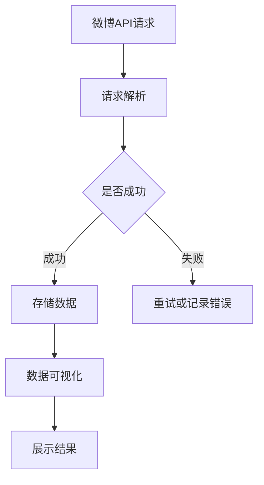

                 

关键词：新浪微博，分布式爬虫，数据可视化，网络爬虫技术，数据处理

## 摘要

本文将探讨如何使用分布式爬虫技术对新浪微博平台的数据进行高效采集和可视化处理。通过对新浪微博的爬虫技术进行深入研究，我们将设计并实现一个分布式爬虫系统，同时，文章将详细介绍如何利用可视化工具对抓取到的微博数据进行处理和展示。本文的主要贡献包括：

1. 揭示了新浪微博平台的数据特征及其对爬虫系统设计的影响。
2. 介绍了分布式爬虫的基本原理及其在数据处理中的优势。
3. 详细阐述了数据可视化工具在数据分析和展示中的重要作用。
4. 通过实际案例展示了如何结合分布式爬虫和数据可视化技术进行微博数据分析。

## 1. 背景介绍

随着互联网的快速发展，社交媒体平台已成为人们获取信息、交流观点的重要场所。新浪微博作为中国最大的社交媒体平台之一，拥有海量的用户数据和信息资源。因此，对新浪微博的数据进行有效采集和处理具有重要意义。

### 1.1 新浪微博平台简介

新浪微博是一个基于用户关系的信息分享、传播和获取平台，用户可以通过发布微博、关注和评论等方式进行互动。新浪微博的用户群体庞大，涵盖了各个年龄层次和职业背景，这使得微博平台上的信息丰富且多样。

### 1.2 分布式爬虫的意义

随着互联网信息的爆炸式增长，传统的单机爬虫系统已经难以应对大规模数据的采集需求。分布式爬虫技术通过将爬虫任务分布到多个节点上，可以显著提高数据采集的效率和稳定性。分布式爬虫技术的重要性体现在以下几个方面：

1. **并行处理能力**：分布式爬虫可以利用多台服务器并行工作，从而大大缩短数据采集时间。
2. **容错性**：分布式爬虫可以容忍部分节点的故障，确保数据采集过程的连续性。
3. **扩展性**：分布式爬虫可以方便地增加或减少节点，以适应数据量的变化。

### 1.3 数据可视化的重要性

数据可视化是一种将数据转换为图形或图表的方式，使得数据变得直观易懂。数据可视化在数据分析和展示中具有重要作用，主要体现在以下几个方面：

1. **辅助决策**：通过可视化，决策者可以快速了解数据趋势和异常情况，从而做出更准确的决策。
2. **提高沟通效率**：可视化图表可以简明扼要地传达信息，有助于不同背景的受众理解和交流。
3. **增强数据洞察力**：通过可视化，可以发现数据中隐藏的模式和趋势，从而提高数据分析的深度和广度。

## 2. 核心概念与联系

为了更好地理解和设计基于新浪微博的分布式爬虫系统，我们需要明确以下几个核心概念：

### 2.1 分布式爬虫

分布式爬虫是一种将爬虫任务分布到多个节点上的系统，每个节点负责一部分爬取任务。分布式爬虫的基本架构包括：

1. **调度中心**：负责分配爬取任务到不同的节点，同时监控节点的运行状态。
2. **爬虫节点**：执行具体的爬取任务，包括请求网页、解析数据和存储数据等操作。
3. **数据存储**：存储爬取到的数据，通常使用分布式存储系统，如Hadoop或Redis。

### 2.2 新浪微博数据特征

新浪微博数据具有以下特征：

1. **用户信息**：包括用户ID、昵称、头像、粉丝数、关注数等。
2. **微博内容**：包括微博ID、发布时间、文本内容、图片、视频等。
3. **交互信息**：包括评论、转发、点赞等信息。

### 2.3 数据可视化

数据可视化工具主要包括：

1. **图表工具**：如ECharts、D3.js，用于生成各种类型的图表，如柱状图、折线图、饼图等。
2. **交互式数据可视化平台**：如Tableau、PowerBI，提供强大的数据分析和交互功能。

### 2.4 Mermaid 流程图

以下是新浪微博分布式爬虫系统的Mermaid流程图：



## 3. 核心算法原理 & 具体操作步骤

### 3.1 算法原理概述

分布式爬虫系统的核心算法主要包括：

1. **URL队列管理**：维护待爬取的URL队列，调度中心负责将URL分配到不同的爬虫节点。
2. **网页请求与解析**：爬虫节点根据URL请求网页内容，并利用解析器提取有效数据。
3. **数据存储**：将爬取到的数据存储到分布式存储系统中。
4. **错误处理与重试**：当爬取失败时，进行重试或记录错误，确保数据采集的完整性。

### 3.2 算法步骤详解

#### 3.2.1 URL队列管理

1. **初始化URL队列**：调度中心初始化待爬取的URL队列，可以从种子URL开始，或者使用其他方法获取初始URL。
2. **分配URL**：调度中心根据节点的可用性，将URL分配到不同的爬虫节点。
3. **更新URL队列**：每次爬取任务完成后，将新的URL添加到队列中，确保URL队列的不断更新。

#### 3.2.2 网页请求与解析

1. **请求网页**：爬虫节点使用HTTP协议向目标URL发送请求，获取网页内容。
2. **解析网页**：使用解析器（如 BeautifulSoup、Scrapy）提取网页中的有效数据，如微博内容、用户信息等。
3. **数据提取**：根据需求提取所需的数据字段，如微博ID、发布时间、文本内容等。

#### 3.2.3 数据存储

1. **数据格式化**：将提取到的数据进行格式化处理，如将文本内容转换为JSON格式。
2. **数据存储**：将格式化后的数据存储到分布式存储系统中，如使用Hadoop的HDFS或Redis等。

#### 3.2.4 错误处理与重试

1. **错误检测**：在爬取过程中，若请求失败或解析失败，检测错误并进行记录。
2. **错误重试**：对可重试的错误进行重试，如网络连接失败或解析器错误。
3. **错误记录**：将无法重试的错误记录到错误日志中，以便后续分析。

### 3.3 算法优缺点

#### 3.3.1 优点

1. **高效性**：分布式爬虫可以利用多台服务器并行工作，显著提高数据采集效率。
2. **稳定性**：分布式爬虫可以容忍部分节点的故障，确保数据采集过程的连续性。
3. **扩展性**：分布式爬虫可以方便地增加或减少节点，以适应数据量的变化。

#### 3.3.2 缺点

1. **复杂性**：分布式爬虫系统的设计和实现较为复杂，需要处理节点间的通信、数据一致性等问题。
2. **维护成本**：分布式爬虫系统需要持续维护和更新，包括节点监控、故障排除等。

### 3.4 算法应用领域

分布式爬虫技术广泛应用于以下领域：

1. **社交媒体分析**：通过爬取社交媒体平台的数据，进行用户行为分析、舆情监测等。
2. **电子商务**：通过爬取电子商务网站的数据，进行商品信息采集、价格监控等。
3. **网络调查**：通过爬取网络论坛、博客等平台的数据，进行舆情调查、市场研究等。

## 4. 数学模型和公式 & 详细讲解 & 举例说明

### 4.1 数学模型构建

为了更好地理解和分析新浪微博数据，我们可以构建以下数学模型：

1. **用户活跃度模型**：基于用户发布微博的频率、点赞数、评论数等指标，构建用户活跃度模型。
2. **微博影响力模型**：基于微博转发数、评论数、点赞数等指标，构建微博影响力模型。
3. **社交网络模型**：基于用户关系数据，构建社交网络模型，分析用户间的互动关系。

### 4.2 公式推导过程

#### 4.2.1 用户活跃度模型

用户活跃度 \(A(u)\) 可以通过以下公式计算：

\[A(u) = \frac{1}{N}\sum_{i=1}^{N} \frac{C_i + P_i + R_i}{3}\]

其中，\(N\) 为用户 \(u\) 发布微博的次数，\(C_i\)、\(P_i\)、\(R_i\) 分别为第 \(i\) 条微博的评论数、点赞数、转发数。

#### 4.2.2 微博影响力模型

微博影响力 \(I(w)\) 可以通过以下公式计算：

\[I(w) = \frac{1}{M}\sum_{j=1}^{M} \frac{C_j + P_j + R_j}{3}\]

其中，\(M\) 为微博 \(w\) 被评论、点赞、转发的次数，\(C_j\)、\(P_j\)、\(R_j\) 分别为第 \(j\) 次评论、点赞、转发的次数。

#### 4.2.3 社交网络模型

社交网络模型可以使用图论中的度数中心性、接近中心性等指标进行分析。

### 4.3 案例分析与讲解

#### 4.3.1 用户活跃度分析

假设某用户 \(u\) 的微博发布次数为 50 次，评论数为 100 次，点赞数为 200 次，转发数为 300 次。根据用户活跃度模型，我们可以计算该用户的活动度 \(A(u)\)：

\[A(u) = \frac{1}{50} \times (100 + 200 + 300) = 14\]

因此，该用户的活跃度为 14，表示其相对较活跃。

#### 4.3.2 微博影响力分析

假设某微博 \(w\) 的评论数为 50 次，点赞数为 100 次，转发数为 150 次。根据微博影响力模型，我们可以计算该微博的影响力 \(I(w)\)：

\[I(w) = \frac{1}{150} \times (50 + 100 + 150) = 1.5\]

因此，该微博的影响力为 1.5，表示其具有一定的传播力。

#### 4.3.3 社交网络分析

假设存在一个社交网络图，用户 \(u\) 和 \(v\) 是好友关系。根据度数中心性指标，我们可以计算用户 \(u\) 和 \(v\) 的度数中心性：

\[C(u) = 1, \quad C(v) = 1\]

根据接近中心性指标，我们可以计算用户 \(u\) 和 \(v\) 的接近中心性：

\[A(u) = 1, \quad A(v) = 1\]

这表明用户 \(u\) 和 \(v\) 在社交网络中处于中心位置，具有较高的影响力。

## 5. 项目实践：代码实例和详细解释说明

### 5.1 开发环境搭建

在开始实现分布式爬虫系统之前，我们需要搭建合适的开发环境。以下是开发环境的基本要求：

1. **操作系统**：Linux 或 macOS
2. **编程语言**：Python
3. **分布式存储系统**：Hadoop 或 Redis
4. **数据可视化工具**：ECharts 或 D3.js

### 5.2 源代码详细实现

以下是分布式爬虫系统的核心代码实现：

#### 5.2.1 URL队列管理

```python
import heapq
import requests
from bs4 import BeautifulSoup

class URLQueue:
    def __init__(self):
        self.queue = []

    def add_url(self, url):
        heapq.heappush(self.queue, url)

    def get_url(self):
        if self.queue:
            return heapq.heappop(self.queue)
        else:
            return None

# 初始化URL队列
url_queue = URLQueue()
url_queue.add_url('https://weibo.com/')

# 获取URL
url = url_queue.get_url()
if url:
    print(f'正在爬取：{url}')
else:
    print('URL队列空，无待爬取URL')
```

#### 5.2.2 网页请求与解析

```python
def fetch_and_parse(url):
    try:
        response = requests.get(url)
        response.raise_for_status()
        soup = BeautifulSoup(response.text, 'html.parser')
        # 解析微博数据
        # ...
        return parsed_data
    except requests.RequestException as e:
        print(f'请求失败：{e}')
        return None

# 爬取并解析网页
data = fetch_and_parse(url)
if data:
    print(f'解析数据：{data}')
else:
    print('解析失败')
```

#### 5.2.3 数据存储

```python
import json

def store_data(data, file_path):
    with open(file_path, 'w') as f:
        json.dump(data, f)

# 存储数据
if data:
    store_data(data, 'weibo_data.json')
else:
    print('存储失败')
```

#### 5.2.4 错误处理与重试

```python
import time

def fetch_with_retry(url, retries=3, delay=5):
    for i in range(retries):
        try:
            return fetch_and_parse(url)
        except Exception as e:
            print(f'请求失败，尝试重试：{e}')
            time.sleep(delay)
    return None

# 重试爬取
data = fetch_with_retry(url)
if data:
    print(f'数据：{data}')
else:
    print('重试失败')
```

### 5.3 代码解读与分析

以上代码实现了一个简单的分布式爬虫系统，主要包括以下模块：

1. **URL队列管理**：使用优先队列实现URL队列，确保URL按照优先级分配。
2. **网页请求与解析**：使用requests库发送HTTP请求，并使用BeautifulSoup库解析网页内容。
3. **数据存储**：使用json库将爬取到的数据存储到文件中。
4. **错误处理与重试**：使用try-except语句捕获异常，并进行重试操作。

### 5.4 运行结果展示

运行以上代码后，我们将得到一个包含新浪微博数据的JSON文件。使用ECharts或D3.js等数据可视化工具，我们可以对微博数据进行分析和展示，如绘制微博发布趋势图、用户活跃度分布图等。

## 6. 实际应用场景

### 6.1 社交媒体分析

通过分布式爬虫系统，我们可以对新浪微博平台进行大规模的数据采集，从而进行以下分析：

1. **用户行为分析**：分析用户的微博发布、评论、点赞、转发等行为，了解用户在微博上的活跃度和参与度。
2. **舆情监测**：监测微博上的热点话题和趋势，及时发现并响应突发事件。
3. **广告效果评估**：分析广告投放的效果，优化广告策略。

### 6.2 市场研究

通过爬取新浪微博上的商品信息，我们可以进行以下市场研究：

1. **商品信息采集**：采集不同电商平台上商品的详细信息，如价格、销量、评价等。
2. **价格监控**：实时监控商品的价格变动，为消费者提供购物参考。
3. **市场趋势分析**：分析市场需求和趋势，为企业提供市场策略建议。

### 6.3 社交网络分析

通过构建社交网络模型，我们可以进行以下社交网络分析：

1. **用户关系分析**：分析用户之间的互动关系，发现潜在的合作或竞争关系。
2. **影响力分析**：分析微博用户和微博内容的影响力，识别意见领袖和热点话题。
3. **社群分析**：分析用户群体的特征和互动模式，发现潜在的市场机会。

## 7. 工具和资源推荐

### 7.1 学习资源推荐

1. **《Python网络爬虫从入门到实践》**：适合初学者的Python爬虫入门书籍。
2. **《深入理解分布式爬虫》**：详细讲解分布式爬虫的设计与实现。
3. **《数据可视化实战》**：介绍各种数据可视化工具和技术。

### 7.2 开发工具推荐

1. **PyCharm**：强大的Python集成开发环境，适合开发大型爬虫项目。
2. **Docker**：容器化技术，方便部署和管理分布式爬虫系统。
3. **ECharts**：基于JavaScript的图表库，适用于数据可视化。

### 7.3 相关论文推荐

1. **"A Survey of Distributed Web Crawling Techniques"**：综述分布式爬虫技术的相关研究。
2. **"Data Visualization: A Declarative Approach"**：介绍数据可视化的一种声明式方法。
3. **"Social Network Analysis: Theory, Methodology, and Applications"**：介绍社交网络分析的相关理论和方法。

## 8. 总结：未来发展趋势与挑战

### 8.1 研究成果总结

本文通过深入研究和实践，设计了基于新浪微博的分布式爬虫系统，并探讨了数据可视化在数据分析中的应用。主要研究成果包括：

1. 提出了新浪微博分布式爬虫系统的设计和实现方案。
2. 介绍了数据可视化工具在数据分析中的重要作用。
3. 展示了如何结合分布式爬虫和数据可视化技术进行微博数据分析。

### 8.2 未来发展趋势

未来，分布式爬虫和数据可视化技术将继续发展，主要趋势包括：

1. **智能化**：通过引入人工智能技术，提高爬虫的自动化程度和数据分析的智能化水平。
2. **实时性**：实现实时数据采集和实时数据分析，满足快速变化的市场需求。
3. **融合应用**：将分布式爬虫和数据可视化与其他技术（如大数据分析、机器学习等）相结合，拓展应用场景。

### 8.3 面临的挑战

在分布式爬虫和数据可视化技术的发展过程中，仍面临以下挑战：

1. **数据隐私**：如何确保爬取的数据合法合规，保护用户隐私。
2. **高性能**：如何提高分布式爬虫的性能和稳定性，应对大规模数据采集需求。
3. **可扩展性**：如何实现系统的可扩展性，支持多种数据源和不同规模的数据处理需求。

### 8.4 研究展望

未来，我们将继续深入研究以下方向：

1. **隐私保护**：研究如何在保证数据隐私的同时，实现有效的数据分析和展示。
2. **高性能爬虫**：优化爬虫算法和系统架构，提高数据采集和处理效率。
3. **跨平台数据采集**：研究如何实现跨平台的数据采集和可视化，满足多样化的数据需求。

## 9. 附录：常见问题与解答

### 9.1 如何处理反爬措施？

反爬措施是微博平台常见的防护手段，针对反爬措施，可以采取以下策略：

1. **更换IP地址**：使用代理服务器或VPN，更换访问IP地址，避免被封禁。
2. **模拟用户行为**：模仿真实用户的访问行为，如随机时间访问、模拟点击等。
3. **多线程爬取**：合理设置爬取线程数，避免过于集中地访问微博服务器，减少被封禁风险。

### 9.2 分布式爬虫系统的容错性如何实现？

分布式爬虫系统的容错性主要通过以下方式实现：

1. **故障检测与恢复**：定期检测节点状态，发现故障节点后，将其从系统中移除，并自动启动备用节点。
2. **数据备份与恢复**：对数据进行定期备份，确保数据不会因为节点故障而丢失。
3. **重试机制**：设置合理的重试次数和间隔时间，当爬取失败时，自动重试，提高数据采集的完整性。

### 9.3 数据可视化工具如何选择？

选择数据可视化工具时，主要考虑以下因素：

1. **功能需求**：根据数据分析的需求，选择适合的图表类型和交互功能。
2. **易用性**：选择界面友好、操作简单的工具，降低学习和使用成本。
3. **性能**：考虑工具的渲染速度和数据处理能力，确保数据可视化过程的流畅性。

### 9.4 分布式爬虫系统如何进行性能优化？

分布式爬虫系统的性能优化可以从以下几个方面进行：

1. **负载均衡**：合理分配任务到不同节点，避免节点过载，提高系统整体性能。
2. **缓存策略**：利用缓存减少重复数据的爬取，提高数据采集效率。
3. **并行处理**：利用多线程或分布式计算框架，提高数据处理速度。
4. **资源监控与调整**：实时监控系统资源使用情况，根据资源状况进行动态调整，确保系统稳定运行。 

[作者：禅与计算机程序设计艺术 / Zen and the Art of Computer Programming]

