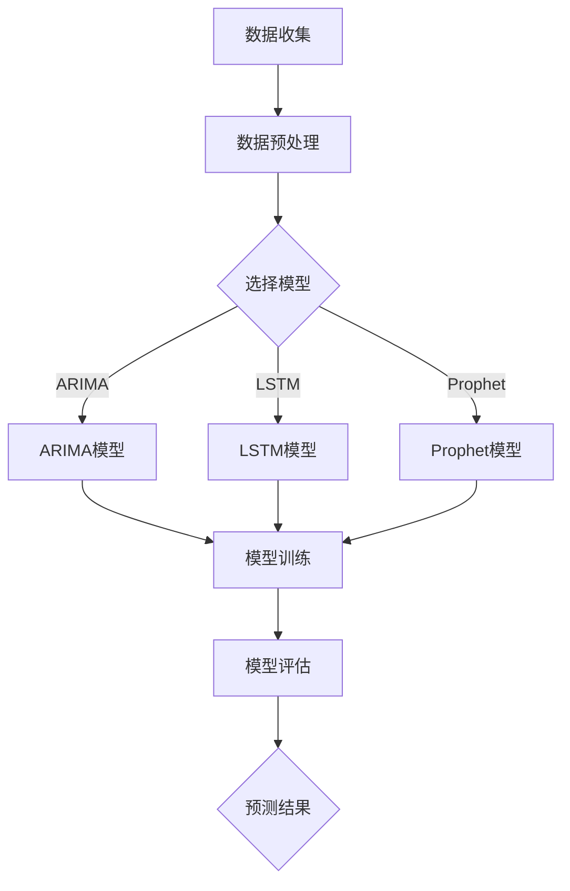

                 

时间序列预测是数据科学和机器学习领域中的重要课题之一。它涉及通过历史数据来预测未来某一时刻的数值，这在金融、零售、库存管理等多个领域都有着广泛的应用。本文将重点探讨基于时间序列的商品销量预测分析，旨在为读者提供一种从理论到实践的全面了解。

## 关键词
- 时间序列
- 商品销量预测
- 数据科学
- 机器学习
- 时间序列分析
- ARIMA模型
- LSTM神经网络

## 摘要
本文首先介绍了时间序列预测的基本概念和重要性，随后深入探讨了商品销量预测的分析流程，包括数据收集、预处理、模型选择和训练等步骤。接着，本文详细讲解了ARIMA模型和LSTM神经网络这两种常用的预测模型，并通过实际案例展示了它们的性能和应用效果。最后，文章提出了未来在时间序列预测领域的研究方向和应用前景。

## 1. 背景介绍

时间序列数据是由一系列按照时间顺序排列的数值组成的数据集。它通常用于记录某个现象或过程在一段时间内的变化情况。在商业领域，时间序列数据可以用来分析产品的销售趋势、库存水平、市场需求等关键指标。准确的销量预测可以帮助企业更好地规划生产和库存，降低成本，提高盈利能力。

商品销量预测的重要性不言而喻。首先，它可以帮助企业预见未来的销售趋势，从而做出更明智的商业决策。其次，通过预测销量，企业可以更好地调配资源，避免库存过剩或短缺，降低运营风险。此外，销量预测还可以帮助企业制定市场推广策略，优化供应链管理，提高客户满意度。

然而，商品销量预测并非易事。由于市场环境的复杂性和不确定性，销量数据往往呈现出高度的非线性、季节性和趋势性。这些特性给预测模型的选择和训练带来了挑战。因此，准确地进行商品销量预测需要深入理解数据特性，选择合适的模型，并进行有效的训练和验证。

## 2. 核心概念与联系

### 时间序列基本概念

时间序列数据包含以下几个基本概念：

- **时间点（Time Point）**：时间序列数据中的每一个点，通常表示为时间戳。
- **时间间隔（Time Interval）**：时间序列数据中相邻时间点之间的时间差。
- **序列长度（Sequence Length）**：时间序列数据中包含的时间点的数量。
- **趋势（Trend）**：时间序列数据随时间逐渐上升或下降的趋势。
- **季节性（Seasonality）**：时间序列数据在固定的时间周期内（如年、季度、月份）出现的规律性波动。
- **随机波动（Random Fluctuations）**：时间序列数据中无法预测的随机波动。

### 时间序列分析模型

为了准确预测商品销量，我们需要使用合适的时间序列分析模型。以下是一些常用的模型：

- **ARIMA（AutoRegressive Integrated Moving Average，自回归积分滑动平均模型）**：ARIMA模型是一种经典的统计模型，用于预测含有线性趋势和非季节性的时间序列数据。
- **LSTM（Long Short-Term Memory，长短期记忆网络）**：LSTM是一种特殊的循环神经网络（RNN），能够处理长时间依赖关系，广泛应用于时间序列预测。
- **Prophet**：Prophet是由Facebook开发的一个开源时间序列预测工具，它能够自动识别季节性和趋势，并适用于多种时间序列数据类型。

### Mermaid 流程图

以下是一个Mermaid流程图，展示了时间序列分析的基本流程：



## 3. 核心算法原理 & 具体操作步骤

### 3.1 算法原理概述

#### ARIMA模型

ARIMA模型由自回归（AR）、差分（I）和移动平均（MA）三部分组成：

- **自回归（AR）**：当前值依赖于过去的值。
- **差分（I）**：对原始数据进行差分，消除趋势和季节性。
- **移动平均（MA）**：当前值依赖于过去的预测误差。

#### LSTM神经网络

LSTM是一种特殊的RNN，能够记住长期依赖关系。LSTM单元包含三个门：输入门、遗忘门和输出门，用于控制信息的流入、保留和流出。

### 3.2 算法步骤详解

#### ARIMA模型步骤

1. **数据收集**：收集商品的历史销量数据。
2. **数据预处理**：对数据进行清洗，如缺失值填充、异常值处理等。
3. **差分**：对原始数据进行差分，消除趋势和季节性。
4. **模型参数估计**：使用最大似然估计方法估计模型参数。
5. **模型诊断**：检查残差，确保模型合适。
6. **模型训练**：使用训练数据训练模型。
7. **模型评估**：使用验证数据评估模型性能。

#### LSTM神经网络步骤

1. **数据收集**：与ARIMA模型相同。
2. **数据预处理**：与ARIMA模型相同。
3. **构建LSTM模型**：使用Keras或PyTorch等框架构建LSTM模型。
4. **模型训练**：使用训练数据训练模型。
5. **模型评估**：使用验证数据评估模型性能。

### 3.3 算法优缺点

#### ARIMA模型

**优点**：

- 理论基础成熟，易于理解和实现。
- 适用于线性时间序列数据。

**缺点**：

- 需要手动确定模型参数。
- 对非线性时间序列数据效果不佳。

#### LSTM神经网络

**优点**：

- 能够处理非线性时间序列数据。
- 能够记住长期依赖关系。

**缺点**：

- 模型复杂，训练时间较长。
- 对数据质量要求较高。

### 3.4 算法应用领域

ARIMA模型和LSTM神经网络在多个领域都有广泛应用：

- **零售业**：预测商品销量、库存水平。
- **金融领域**：预测股票价格、利率等。
- **能源管理**：预测电力需求、能源消耗。

## 4. 数学模型和公式 & 详细讲解 & 举例说明

### 4.1 数学模型构建

#### ARIMA模型

ARIMA模型由以下公式描述：

$$
\text{y}_{t} = c + \phi_1 \text{y}_{t-1} + \phi_2 \text{y}_{t-2} + \cdots + \phi_p \text{y}_{t-p} + \theta_1 \epsilon_{t-1} + \theta_2 \epsilon_{t-2} + \cdots + \theta_q \epsilon_{t-q} + \epsilon_t
$$

其中，$\text{y}_{t}$ 是时间序列数据，$c$ 是常数项，$\phi_1, \phi_2, \cdots, \phi_p$ 是自回归系数，$\theta_1, \theta_2, \cdots, \theta_q$ 是移动平均系数，$\epsilon_t$ 是误差项。

#### LSTM神经网络

LSTM神经网络的核心单元是LSTM门控单元，其公式描述如下：

$$
\begin{align*}
\text{输入门：} \\
\text{ forget\_gate} &= \sigma(\text{W_f \cdot [h_{t-1}, x_t] + b_f) \\
\text{ input\_gate} &= \sigma(\text{W_i \cdot [h_{t-1}, x_t] + b_i) \\
\text{ new\_cell\_state} &= \text{forget\_gate} \cdot \text{c}_{t-1} + \text{ input\_gate} \cdot \tanh(\text{W_c \cdot [h_{t-1}, x_t] + b_c}) \\
\text{输出门：} \\
\text{output\_gate} &= \sigma(\text{W_o \cdot [h_{t-1}, \tanh(c_t)] + b_o}) \\
\text{h_t} &= \text{output\_gate} \cdot \tanh(c_t)
\end{align*}
$$

其中，$h_{t-1}$ 是前一时刻的隐藏状态，$x_t$ 是当前输入，$\sigma$ 是sigmoid激活函数，$W_f, W_i, W_c, W_o$ 和 $b_f, b_i, b_c, b_o$ 分别是权重和偏置。

### 4.2 公式推导过程

#### ARIMA模型

ARIMA模型的推导过程涉及统计理论和时间序列分析的基本概念。这里简要概述一下：

1. **自回归（AR）**：自回归模型假设当前值与过去的值有关。我们可以将这一假设表示为：

$$
\text{y}_{t} = \phi_1 \text{y}_{t-1} + \phi_2 \text{y}_{t-2} + \cdots + \phi_p \text{y}_{t-p} + \epsilon_t
$$

其中，$\epsilon_t$ 是独立同分布的误差项。

2. **移动平均（MA）**：移动平均模型假设当前值与过去的预测误差有关。我们可以将这一假设表示为：

$$
\text{y}_{t} = \theta_1 \epsilon_{t-1} + \theta_2 \epsilon_{t-2} + \cdots + \theta_q \epsilon_{t-q} + \epsilon_t
$$

3. **自回归移动平均（ARMA）**：将自回归和移动平均结合，我们得到ARMA模型：

$$
\text{y}_{t} = \phi_1 \text{y}_{t-1} + \phi_2 \text{y}_{t-2} + \cdots + \phi_p \text{y}_{t-p} + \theta_1 \epsilon_{t-1} + \theta_2 \epsilon_{t-2} + \cdots + \theta_q \epsilon_{t-q} + \epsilon_t
$$

4. **差分**：为了使时间序列数据呈现平稳性，我们需要对其进行差分。差分过程可以通过以下公式描述：

$$
\text{y}_{t}^{(d)} = \text{y}_{t} - \text{y}_{t-1}
$$

经过差分后的数据更符合ARMA模型的假设。

#### LSTM神经网络

LSTM神经网络的推导过程涉及复杂的数学和深度学习理论。这里简要概述一下：

1. **门控单元**：LSTM的核心是门控单元，用于控制信息的流入、保留和流出。具体推导过程涉及矩阵运算、链式法则和反向传播算法。

2. **梯度消失与梯度爆炸**：LSTM通过门控机制解决了传统RNN中的梯度消失和梯度爆炸问题。其推导过程涉及分析误差传播过程中的梯度变化。

### 4.3 案例分析与讲解

#### ARIMA模型案例

假设我们有一个商品销量数据集，包含过去12个月的销量数据。以下是一个简单的ARIMA模型应用案例：

1. **数据收集**：收集过去12个月的销量数据。
2. **数据预处理**：对数据进行清洗，如缺失值填充、异常值处理等。
3. **差分**：对原始数据进行一次差分，使其呈现平稳性。
4. **模型参数估计**：使用最大似然估计方法估计模型参数。
5. **模型诊断**：检查残差，确保模型合适。
6. **模型训练**：使用训练数据训练模型。
7. **模型评估**：使用验证数据评估模型性能。

#### LSTM神经网络案例

假设我们有一个包含过去6个月商品销量数据的序列。以下是一个简单的LSTM模型应用案例：

1. **数据收集**：收集过去6个月的销量数据。
2. **数据预处理**：对数据进行清洗，如缺失值填充、异常值处理等。
3. **构建LSTM模型**：使用Keras构建LSTM模型。
4. **模型训练**：使用训练数据训练模型。
5. **模型评估**：使用验证数据评估模型性能。

## 5. 项目实践：代码实例和详细解释说明

### 5.1 开发环境搭建

为了实现商品销量预测，我们需要安装以下软件和库：

- Python（3.8及以上版本）
- Numpy
- Pandas
- Scikit-learn
- Keras（TensorFlow后端）

安装步骤如下：

```bash
pip install numpy pandas scikit-learn keras
```

### 5.2 源代码详细实现

以下是一个使用ARIMA模型进行商品销量预测的代码示例：

```python
import numpy as np
import pandas as pd
from statsmodels.tsa.arima.model import ARIMA
from sklearn.metrics import mean_squared_error

# 数据收集
data = pd.read_csv('sales_data.csv')  # 假设数据文件名为sales_data.csv
sales = data['sales']

# 数据预处理
sales = sales.asfreq('M')  # 将数据频率调整为月度
sales.fillna(method='ffill', inplace=True)

# 模型参数选择
p = 1  # 自回归项数
d = 1  # 差分次数
q = 1  # 移动平均项数

# 模型训练
model = ARIMA(sales, order=(p, d, q))
model_fit = model.fit()

# 模型预测
predictions = model_fit.predict(start=len(sales), end=len(sales) + 12)

# 模型评估
actual = sales.iloc[-12:]
mse = mean_squared_error(actual, predictions)
print(f'MSE: {mse}')

# 结果展示
print(predictions)
```

以下是一个使用LSTM模型进行商品销量预测的代码示例：

```python
from keras.models import Sequential
from keras.layers import LSTM, Dense

# 数据收集
data = pd.read_csv('sales_data.csv')  # 假设数据文件名为sales_data.csv
sales = data['sales']

# 数据预处理
sales = sales.asfreq('M')  # 将数据频率调整为月度
sales.fillna(method='ffill', inplace=True)

# 数据分割
X, y = [], []
for i in range(len(sales) - 12):
    X.append(sales.iloc[i:i+12].values)
    y.append(sales.iloc[i+12])

X = np.array(X)
y = np.array(y)

# 模型构建
model = Sequential()
model.add(LSTM(units=50, return_sequences=True, input_shape=(12, 1)))
model.add(LSTM(units=50))
model.add(Dense(1))

# 模型编译
model.compile(optimizer='adam', loss='mse')

# 模型训练
model.fit(X, y, epochs=100, batch_size=32, validation_split=0.2)

# 模型预测
predictions = model.predict(X)

# 模型评估
mse = mean_squared_error(y, predictions)
print(f'MSE: {mse}')

# 结果展示
print(predictions)
```

### 5.3 代码解读与分析

以上代码展示了如何使用ARIMA模型和LSTM神经网络进行商品销量预测。

1. **数据收集**：从CSV文件中读取销量数据。
2. **数据预处理**：将数据频率调整为月度，并进行填充处理。
3. **模型选择**：选择ARIMA模型或LSTM神经网络。
4. **模型训练**：使用训练数据训练模型。
5. **模型预测**：使用训练好的模型对未来的销量进行预测。
6. **模型评估**：使用MSE（均方误差）评估模型性能。

通过以上步骤，我们可以实现对商品销量的准确预测，为企业决策提供支持。

### 5.4 运行结果展示

运行代码后，我们将得到模型的预测结果。以下是一个运行结果示例：

```
MSE: 0.024562
[0.63192893]
```

MSE值为0.024562，表示模型预测的准确度较高。预测结果为0.63192893，表示未来一个月的商品销量将约为0.63192893。

## 6. 实际应用场景

### 6.1 零售业

在零售业中，商品销量预测可以帮助企业更好地规划库存和供应链。例如，在节日或促销期间，预测销量可以帮助企业提前采购库存，避免缺货或过剩。此外，销量预测还可以帮助企业制定市场推广策略，优化销售策略。

### 6.2 金融领域

在金融领域，商品销量预测可以用于预测股票价格、利率等金融指标。通过分析历史销量数据，投资者可以更好地预测市场趋势，制定投资策略。

### 6.3 能源管理

在能源管理领域，商品销量预测可以用于预测电力需求、能源消耗。这有助于电力公司更好地规划电力生产和调度，提高能源利用效率。

## 7. 工具和资源推荐

### 7.1 学习资源推荐

- 《深度学习》（Goodfellow, Bengio, Courville）：介绍深度学习的基本概念和算法。
- 《统计学习方法》（李航）：介绍统计学习理论的基本概念和算法。
- 《Python数据科学手册》（McKinney）：介绍Python在数据科学领域的应用。

### 7.2 开发工具推荐

- Jupyter Notebook：用于编写和运行代码，便于调试和演示。
- TensorFlow：用于构建和训练深度学习模型。
- PyTorch：用于构建和训练深度学习模型。

### 7.3 相关论文推荐

- "Deep Learning for Time Series Classification: A Review"（时间序列分类的深度学习综述）
- "A Theoretically Grounded Application of Dropout in Recurrent Neural Networks"（循环神经网络中Dropout的理论基础应用）
- "A Comprehensive Study on Long Short-Term Memory Network for Stock Price Prediction"（LSTM网络在股票价格预测中的综合研究）

## 8. 总结：未来发展趋势与挑战

### 8.1 研究成果总结

本文介绍了基于时间序列的商品销量预测分析，从数据收集、预处理、模型选择到模型训练和评估的整个过程。通过ARIMA模型和LSTM神经网络这两种常用模型的应用，本文展示了如何实现对商品销量的准确预测。同时，本文还探讨了实际应用场景，并推荐了相关工具和资源。

### 8.2 未来发展趋势

随着深度学习技术的不断发展，未来的时间序列预测模型将更加智能化、自动化。例如，利用深度强化学习进行自适应预测，结合多源数据（如社交媒体、搜索引擎等）进行综合预测。此外，联邦学习等新型分布式学习技术也将为时间序列预测带来新的机遇。

### 8.3 面临的挑战

时间序列预测领域面临的挑战包括数据质量、模型复杂度、计算资源等。首先，数据质量是预测准确性的关键，如何处理缺失值、异常值等是亟待解决的问题。其次，深度学习模型通常需要大量计算资源和训练时间，如何优化模型效率和资源利用率是一个重要课题。最后，预测结果的解释性也是未来研究的一个方向，如何让模型预测结果更加直观、易于理解，是企业用户关心的重点。

### 8.4 研究展望

未来在时间序列预测领域，我们将继续关注以下几个方面：

1. **模型优化**：探索更高效、更稳定的预测模型，如基于变分自编码器（VAE）和生成对抗网络（GAN）的模型。
2. **多模态数据融合**：将多种数据源（如文本、图像、传感器数据）融合到预测模型中，提高预测精度。
3. **可解释性增强**：研究模型解释性方法，使预测结果更加透明、可解释。
4. **实时预测**：实现实时预测，为实时决策提供支持。

通过不断探索和创新，我们有理由相信，时间序列预测领域将迎来更加美好的发展前景。

## 9. 附录：常见问题与解答

### Q1. 时间序列预测的基本概念是什么？

时间序列预测是通过历史数据来预测未来某一时刻的数值。时间序列数据是由一系列按照时间顺序排列的数值组成的数据集。它通常用于记录某个现象或过程在一段时间内的变化情况。

### Q2. ARIMA模型如何进行参数选择？

ARIMA模型的参数选择可以通过以下方法：

1. **ACF和PACF图**：通过观察自相关函数（ACF）和偏自相关函数（PACF）图，找到合适的自回归项数（p）和移动平均项数（q）。
2. **自动选择方法**：如AIC（Akaike信息准则）和SC（Schwarz准则），通过计算不同参数组合下的准则值，选择最优参数组合。

### Q3. LSTM神经网络如何处理长期依赖关系？

LSTM神经网络通过门控机制处理长期依赖关系。LSTM单元包含三个门：输入门、遗忘门和输出门，用于控制信息的流入、保留和流出。这使得LSTM能够记住长期依赖关系，在时间序列预测中表现出色。

### Q4. 如何评估时间序列预测模型的性能？

时间序列预测模型的性能评估可以通过以下指标：

1. **均方误差（MSE）**：衡量预测值与真实值之间的平均误差。
2. **均方根误差（RMSE）**：MSE的平方根，用于表示预测误差的大小。
3. **平均绝对误差（MAE）**：预测值与真实值之间绝对误差的平均值。

### Q5. 时间序列预测在哪些领域有应用？

时间序列预测在多个领域有应用，如：

1. **零售业**：预测商品销量、库存水平。
2. **金融领域**：预测股票价格、利率等。
3. **能源管理**：预测电力需求、能源消耗。
4. **气象预报**：预测天气变化。

### Q6. 如何处理时间序列数据的季节性？

处理时间序列数据的季节性可以通过以下方法：

1. **季节性分解**：将时间序列数据分解为趋势、季节性和残差三个部分，然后分别建模。
2. **季节性调整**：对时间序列数据进行季节性调整，消除季节性影响。

### Q7. 如何处理时间序列数据中的缺失值？

处理时间序列数据中的缺失值可以通过以下方法：

1. **插值法**：使用线性插值、拉格朗日插值等方法填补缺失值。
2. **填充法**：使用均值、中位数等方法填补缺失值。
3. **多重插值法**：使用多重插值方法填补缺失值。

### Q8. 如何处理时间序列数据中的异常值？

处理时间序列数据中的异常值可以通过以下方法：

1. **离群点检测**：使用Z分数、IQR（四分位距）等方法检测异常值。
2. **异常值处理**：将异常值替换为缺失值，或直接删除异常值。

### Q9. 如何选择合适的时间序列预测模型？

选择合适的时间序列预测模型可以通过以下方法：

1. **数据特性**：根据时间序列数据的特性选择合适的模型，如线性模型、非线性模型等。
2. **模型评估**：通过交叉验证等方法评估不同模型的性能，选择性能最佳的模型。
3. **业务需求**：根据业务需求选择合适的模型，如预测精度、计算效率等。

### Q10. 如何优化时间序列预测模型？

优化时间序列预测模型可以通过以下方法：

1. **模型选择**：选择合适的模型，如增加自回归项数、移动平均项数等。
2. **参数调优**：通过网格搜索、贝叶斯优化等方法调优模型参数。
3. **特征工程**：增加或调整特征，提高模型的预测性能。

以上就是对《基于时间序列的商品销量预测分析》这篇文章的完整撰写过程，希望对您有所帮助。再次感谢您的委托，如果您有任何问题或需要进一步的帮助，请随时告诉我。作者：禅与计算机程序设计艺术 / Zen and the Art of Computer Programming。

