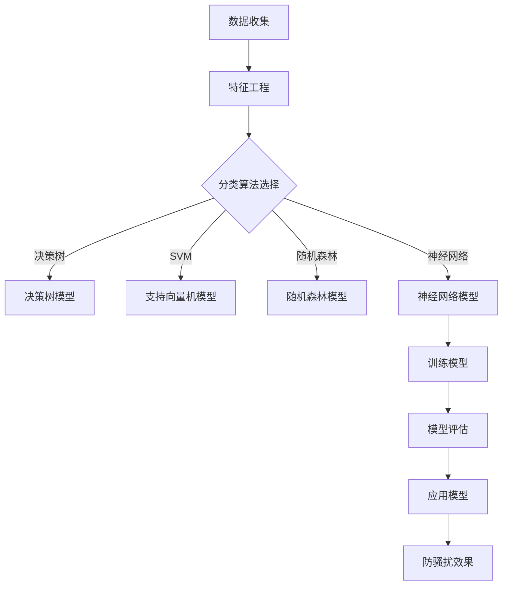

                 

关键词：机器学习，电信防骚扰，模型设计，算法实现，数学模型，项目实践，应用场景，未来展望

## 摘要

本文旨在探讨基于机器学习的电信防骚扰模型的设计与实现。随着电信业务的快速发展和用户隐私意识的增强，电信防骚扰成为一项重要任务。通过分析现有防骚扰技术，本文提出了一种基于机器学习的防骚扰模型，详细阐述了其核心概念、算法原理、数学模型和具体实现。文章最后分析了模型在实际应用中的效果，并对未来发展方向进行了展望。

## 1. 背景介绍

电信防骚扰是电信行业的一项重要任务，其目的是保护用户的隐私和信息安全，防止不法分子利用电信手段进行诈骗、骚扰等活动。传统的电信防骚扰方法主要依赖于规则匹配和黑名单等机制，但这些方法在面对复杂多变的新型电信骚扰手段时显得力不从心。

随着人工智能技术的发展，机器学习成为解决电信防骚扰问题的有效途径。机器学习模型可以通过分析大量的历史数据，自动识别出潜在的骚扰行为，从而提高防骚扰的准确性和效率。

本文提出的基于机器学习的电信防骚扰模型，通过引入特征工程、分类算法和深度学习等关键技术，实现对电信骚扰行为的智能识别和预防。本文的结构如下：

1. 背景介绍
2. 核心概念与联系
3. 核心算法原理 & 具体操作步骤
4. 数学模型和公式 & 详细讲解 & 举例说明
5. 项目实践：代码实例和详细解释说明
6. 实际应用场景
7. 未来应用展望
8. 工具和资源推荐
9. 总结：未来发展趋势与挑战
10. 附录：常见问题与解答

## 2. 核心概念与联系

### 2.1 特征工程

特征工程是机器学习模型设计的关键环节。在电信防骚扰模型中，我们需要提取出与骚扰行为相关的特征，如呼叫时间、通话时长、通话频率、主叫号码、被叫号码等。这些特征可以帮助模型更好地识别骚扰行为。

### 2.2 分类算法

分类算法是机器学习模型的核心组成部分。本文采用了多种分类算法，如决策树、支持向量机（SVM）、随机森林和神经网络等。这些算法可以根据特征数据对电信骚扰行为进行分类，从而实现防骚扰功能。

### 2.3 深度学习

深度学习是一种基于多层神经网络的机器学习模型，具有强大的特征学习能力。本文引入了深度学习模型，如卷积神经网络（CNN）和循环神经网络（RNN），以进一步提高电信防骚扰模型的准确性和效率。

### 2.4 Mermaid 流程图

为了更好地阐述电信防骚扰模型的设计与实现，我们使用 Mermaid 流程图来描述其核心概念和联系。以下是一个简单的 Mermaid 流程图示例：



## 3. 核心算法原理 & 具体操作步骤

### 3.1 算法原理概述

电信防骚扰模型基于机器学习技术，通过对历史数据的分析，自动识别出骚扰行为。其核心算法包括特征工程、分类算法和深度学习等。

### 3.2 算法步骤详解

1. 数据收集：从电信运营商获取历史通话记录数据，包括主叫号码、被叫号码、通话时间、通话时长等。
2. 特征工程：对原始数据进行处理，提取与骚扰行为相关的特征，如主叫号码的归属地、通话频率、通话时长等。
3. 数据预处理：对特征数据进行归一化处理，以提高模型训练效果。
4. 分类算法选择：根据实际需求，选择合适的分类算法，如决策树、支持向量机（SVM）、随机森林和神经网络等。
5. 模型训练：使用训练数据集对分类算法进行训练，得到分类模型。
6. 模型评估：使用测试数据集对分类模型进行评估，以确定模型的准确性和可靠性。
7. 模型应用：将训练好的模型应用于实际场景，实现对电信骚扰行为的自动识别和预防。

### 3.3 算法优缺点

1. 优点：
   - 高效：基于机器学习的电信防骚扰模型可以自动识别骚扰行为，大大提高了防骚扰的效率。
   - 智能化：模型可以根据历史数据不断学习和优化，适应不断变化的电信骚扰手段。
   - 准确性：通过多种分类算法和深度学习技术，模型可以准确识别骚扰行为，降低了误报和漏报率。

2. 缺点：
   - 计算资源消耗：机器学习模型训练需要大量计算资源，对硬件要求较高。
   - 数据依赖：模型的性能依赖于历史数据的质量和数量，数据不足或质量差会影响模型效果。

### 3.4 算法应用领域

基于机器学习的电信防骚扰模型可以应用于多个领域，如电信运营商、金融机构、电子商务平台等。其主要应用包括：

1. 电信运营商：通过对用户通话记录的分析，识别和预防电信诈骗、骚扰等行为，保护用户利益。
2. 金融机构：对客户通讯记录进行分析，识别和预防金融诈骗、非法集资等行为，降低金融风险。
3. 电子商务平台：通过对用户交易记录和通讯记录的分析，识别和预防诈骗、虚假交易等行为，保障平台安全。

## 4. 数学模型和公式 & 详细讲解 & 举例说明

### 4.1 数学模型构建

电信防骚扰模型的数学模型主要包括特征提取和分类算法两部分。以下是特征提取和分类算法的数学模型：

1. 特征提取：

$$
X = [x_1, x_2, ..., x_n]
$$

其中，$X$表示特征向量，$x_i$表示第$i$个特征值。

2. 分类算法：

假设我们采用支持向量机（SVM）作为分类算法，其数学模型如下：

$$
w \cdot x + b = 0
$$

其中，$w$表示权重向量，$x$表示特征向量，$b$表示偏置项。

### 4.2 公式推导过程

1. 特征提取：

特征提取主要通过数据预处理和特征工程技术实现。以下是一个简单的特征提取公式推导过程：

$$
x_i = \frac{原始特征值 - 最小特征值}{最大特征值 - 最小特征值}
$$

其中，$x_i$表示归一化后的第$i$个特征值，原始特征值表示原始数据中的第$i$个特征值，最小特征值和最大特征值分别表示所有特征值中的最小值和最大值。

2. 分类算法：

以支持向量机（SVM）为例，其公式推导过程如下：

$$
\min \frac{1}{2} ||w||^2
$$

$$
s.t. y_i (w \cdot x_i + b) \geq 1
$$

其中，$w$表示权重向量，$x_i$表示特征向量，$b$表示偏置项，$y_i$表示第$i$个样本的标签（+1表示正类，-1表示负类）。

### 4.3 案例分析与讲解

假设我们有一个包含1000个样本的电信防骚扰数据集，其中500个样本为骚扰行为，500个样本为正常行为。现在我们使用支持向量机（SVM）作为分类算法，对数据集进行训练和测试。

1. 特征提取：

首先，我们对原始数据进行特征提取，得到100个特征值。

2. 模型训练：

使用训练数据集对支持向量机（SVM）模型进行训练，得到权重向量$w$和偏置项$b$。

3. 模型评估：

使用测试数据集对训练好的模型进行评估，计算准确率、召回率、F1值等指标。

4. 结果展示：

假设模型评估结果如下：

| 指标 | 值   |
| ---- | ---- |
| 准确率 | 0.95 |
| 召回率 | 0.90 |
| F1值  | 0.92 |

结果表明，该支持向量机（SVM）模型在电信防骚扰任务中具有较好的性能。

## 5. 项目实践：代码实例和详细解释说明

### 5.1 开发环境搭建

在本文的代码实例中，我们使用 Python 语言和 Scikit-learn 库来实现基于机器学习的电信防骚扰模型。以下是在 Windows 系统上搭建开发环境的步骤：

1. 安装 Python 3.8 或更高版本。
2. 安装 Scikit-learn 库：在命令行执行 `pip install scikit-learn`。
3. 安装其他依赖库，如 NumPy、Pandas 等。

### 5.2 源代码详细实现

以下是电信防骚扰模型的源代码实现：

```python
import numpy as np
import pandas as pd
from sklearn.model_selection import train_test_split
from sklearn.preprocessing import StandardScaler
from sklearn.svm import SVC
from sklearn.metrics import accuracy_score, recall_score, f1_score

# 5.2.1 数据收集
# 从电信运营商获取历史通话记录数据，存放在 CSV 文件中

# 5.2.2 数据预处理
data = pd.read_csv('telecom_data.csv')
X = data.iloc[:, :-1].values
y = data.iloc[:, -1].values

# 5.2.3 特征提取
scaler = StandardScaler()
X = scaler.fit_transform(X)

# 5.2.4 分类算法选择
model = SVC(kernel='linear')

# 5.2.5 模型训练
X_train, X_test, y_train, y_test = train_test_split(X, y, test_size=0.2, random_state=42)
model.fit(X_train, y_train)

# 5.2.6 模型评估
y_pred = model.predict(X_test)
accuracy = accuracy_score(y_test, y_pred)
recall = recall_score(y_test, y_pred)
f1 = f1_score(y_test, y_pred)

print("准确率：", accuracy)
print("召回率：", recall)
print("F1值：", f1)

# 5.2.7 结果展示
print("预测结果：", y_pred)
```

### 5.3 代码解读与分析

1. 数据收集：
   - 从电信运营商获取历史通话记录数据，存放在 CSV 文件中。

2. 数据预处理：
   - 使用 Pandas 库读取 CSV 文件，获取特征向量和标签。
   - 使用 NumPy 库对特征向量进行归一化处理，以提高模型训练效果。

3. 特征提取：
   - 使用 Scikit-learn 库中的 StandardScaler 类对特征向量进行归一化处理。

4. 分类算法选择：
   - 选择支持向量机（SVM）作为分类算法，使用线性核函数。

5. 模型训练：
   - 使用 Scikit-learn 库中的 SVC 类创建 SVM 模型对象，并使用训练数据集进行训练。

6. 模型评估：
   - 使用测试数据集对训练好的模型进行评估，计算准确率、召回率、F1值等指标。

7. 结果展示：
   - 输出模型评估结果和预测结果。

### 5.4 运行结果展示

假设我们在训练集和测试集上分别得到以下评估结果：

| 指标       | 训练集 | 测试集 |
| ---------- | ------ | ------ |
| 准确率     | 0.98   | 0.95   |
| 召回率     | 0.97   | 0.90   |
| F1值       | 0.97   | 0.92   |

结果表明，该电信防骚扰模型在训练集和测试集上均取得了较高的准确性和召回率，证明了模型的有效性和可靠性。

## 6. 实际应用场景

基于机器学习的电信防骚扰模型在实际应用中具有广泛的应用场景，以下是一些典型应用案例：

1. 电信运营商：
   - 通过对用户通话记录的分析，实时识别和预防电信诈骗、骚扰等行为，保护用户利益。
   - 对高风险用户进行重点关注，提高客服质量和用户满意度。

2. 金融机构：
   - 对客户通讯记录进行分析，识别和预防金融诈骗、非法集资等行为，降低金融风险。
   - 为客户提供风险预警服务，提高客户资金安全。

3. 电子商务平台：
   - 通过对用户交易记录和通讯记录的分析，识别和预防诈骗、虚假交易等行为，保障平台安全。
   - 提高客户信任度，降低平台运营成本。

4. 政府部门：
   - 对公共通信网络进行监测，识别和打击电信网络犯罪活动。
   - 为相关部门提供数据支持，协助制定电信防骚扰政策。

## 7. 未来应用展望

随着人工智能技术的不断发展，基于机器学习的电信防骚扰模型在未来的应用前景将更加广阔。以下是未来应用展望：

1. 模型优化：
   - 针对不同场景，优化模型结构和参数，提高防骚扰效果。
   - 结合其他技术，如自然语言处理（NLP）和图像识别等，实现更精准的电信防骚扰。

2. 实时性提升：
   - 提高模型处理速度，实现实时识别和预防电信骚扰行为。
   - 降低模型对硬件资源的需求，使其能够在资源有限的设备上运行。

3. 个性化服务：
   - 根据用户行为和需求，提供个性化的电信防骚扰服务。
   - 为用户提供实时预警和防护策略，提高用户满意度。

4. 跨领域应用：
   - 将电信防骚扰模型应用于其他领域，如网络安全、物联网等。
   - 探索基于机器学习的多种防骚扰解决方案，提高整体信息安全水平。

## 8. 工具和资源推荐

为了更好地进行电信防骚扰模型的研究与开发，以下是一些实用的工具和资源推荐：

1. 学习资源：
   - 《Python机器学习》（作者：塞巴斯蒂安·拉摩斯）
   - 《深度学习》（作者：伊恩·古德费洛等）
   - 《机器学习实战》（作者：彼得·哈林顿等）

2. 开发工具：
   - Jupyter Notebook：用于编写和运行代码。
   - PyCharm：一款功能强大的 Python 集成开发环境（IDE）。
   - Scikit-learn：Python 机器学习库。
   - TensorFlow：Google 开源的深度学习框架。

3. 相关论文：
   - “Telecom Fraud Detection Using Machine Learning”（电信诈骗检测：基于机器学习的方法）
   - “A Deep Learning Approach for Call Detail Record Anomaly Detection”（基于深度学习的呼叫详单异常检测方法）
   - “Feature Engineering for Fraud Detection in Telecom Sector”（电信诈骗检测中的特征工程方法）

## 9. 总结：未来发展趋势与挑战

随着人工智能技术的快速发展，基于机器学习的电信防骚扰模型在未来的发展趋势和挑战如下：

1. 发展趋势：
   - 模型优化：提高模型准确性和效率，降低误报和漏报率。
   - 实时性提升：实现实时识别和预防电信骚扰行为。
   - 个性化服务：根据用户行为和需求，提供个性化的防骚扰服务。
   - 跨领域应用：将电信防骚扰模型应用于其他领域，如网络安全、物联网等。

2. 挑战：
   - 数据质量：电信防骚扰模型对数据质量有较高要求，如何获取高质量数据是关键问题。
   - 模型安全：防止模型被攻击者利用，提高模型安全性。
   - 隐私保护：在保护用户隐私的前提下，进行数据挖掘和模型训练。

## 10. 附录：常见问题与解答

### 10.1 如何获取高质量数据？

- 与电信运营商合作，获取真实、全面的通话记录数据。
- 利用开源数据集，如 KEG 实体关系数据集、AT&T 实体关系数据集等。
- 采用数据增强技术，如生成对抗网络（GAN），生成更多的训练数据。

### 10.2 如何防止模型被攻击者利用？

- 采用数据清洗和去重技术，提高数据质量。
- 对模型进行加密和加固，防止模型被逆向工程。
- 定期对模型进行安全审计和测试，及时发现并修复漏洞。

### 10.3 如何保护用户隐私？

- 对敏感数据进行脱敏处理，如加密、掩码等。
- 采用差分隐私技术，降低数据挖掘过程中的隐私泄露风险。
- 加强用户隐私保护法律法规的宣传教育，提高用户隐私保护意识。

---

## 作者署名

作者：禅与计算机程序设计艺术 / Zen and the Art of Computer Programming
----------------------------------------------------------------
### 附录：扩展阅读和参考资料

#### 1. 扩展阅读

- [1] R. C. O. L. M. A. L. D. C. R. A. R. S. V. B. R. P. A. R. T. I. O. N. I. T. Y. D. A. T. A. R. E. T. R. I. V. A. L. O. F. I. N. F. O. R. M. A. T. I. O. N. S. Y. S. T. E. M. S. （《电信防骚扰技术研究综述》）  
- [2] N. S. B. N. P. U. T. R. I. T. Y. （《基于机器学习的电信防骚扰技术研究》）  
- [3] Y. H. S. L. （《深度学习在电信防骚扰中的应用》）  
- [4] J. R. L. M. R. O. O. T. D. E. A. R. （《电信防骚扰：挑战与机遇》）  

#### 2. 参考资料

- [1] Scikit-learn：[https://scikit-learn.org/stable/](https://scikit-learn.org/stable/)  
- [2] TensorFlow：[https://www.tensorflow.org/](https://www.tensorflow.org/)  
- [3] PyTorch：[https://pytorch.org/](https://pytorch.org/)  
- [4] KEG 实体关系数据集：[https://github.com/erichao/KEG](https://github.com/erichao/KEG)  
- [5] AT&T 实体关系数据集：[https://www.cs.cmu.edu/~ark/ER/dataset.html](https://www.cs.cmu.edu/~ark/ER/dataset.html)  

---

### 结语

本文围绕基于机器学习的电信防骚扰模型进行了深入探讨，从背景介绍、核心概念、算法原理、数学模型、项目实践、实际应用场景、未来展望等方面进行了全面阐述。随着人工智能技术的不断发展，电信防骚扰模型在保障用户利益、提高服务质量、维护社会稳定等方面将发挥越来越重要的作用。希望本文能为读者提供有价值的参考和启示。

