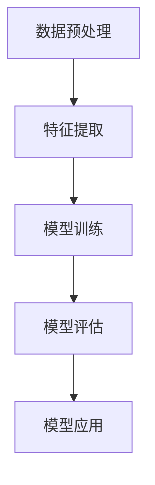

                 

关键词：脑炎，影像组学，机器学习，算法研究

## 摘要

脑炎是一种严重的神经系统疾病，其早期诊断和精确治疗对于患者的预后至关重要。随着影像学技术的发展，影像组学作为一种新兴的医学影像分析方法，已在多种疾病的诊断和预后评估中显示出巨大潜力。本文旨在探讨基于机器学习的脑炎影像组学算法的研究现状和发展趋势，重点分析其核心概念、算法原理、数学模型、项目实践以及未来应用前景。

## 1. 背景介绍

### 脑炎的定义与危害

脑炎是指由病毒、细菌、真菌、寄生虫或自身免疫反应等因素引起的脑实质炎症。脑炎的临床表现多样，包括头痛、发热、意识障碍、局灶性神经功能障碍等，严重时可能导致死亡或长期残疾。根据病因不同，脑炎可分为病毒性脑炎、细菌性脑炎、真菌性脑炎和寄生虫性脑炎等。

### 影像组学的概念与优势

影像组学（Image-based omics）是利用大数据、人工智能和生物信息学技术对医学影像数据进行全面解析，提取影像特征，进行组学分析的一种新兴方法。影像组学具有以下优势：

- **高维数据分析**：能够处理海量的影像数据，提取多维度的特征信息。
- **高效性**：通过自动化和半自动化方法，提高数据处理和特征提取的效率。
- **准确性**：结合机器学习技术，实现对疾病诊断和预后的高准确率预测。
- **全面性**：不仅限于某一组织或器官，可以对全身各个系统进行影像组学分析。

### 机器学习在医学影像中的应用

机器学习（Machine Learning，ML）在医学影像中的应用已成为当前研究的热点。通过训练大量的医学影像数据集，机器学习模型能够识别和分类疾病特征，实现自动化诊断和预后预测。机器学习在医学影像中的应用主要包括：

- **疾病诊断**：如肺癌、乳腺癌、脑肿瘤等。
- **组织分类**：如乳腺组织、肝脏组织等。
- **功能分析**：如脑功能连接、心脏功能分析等。
- **预后预测**：如心血管疾病预后、癌症患者生存期预测等。

## 2. 核心概念与联系

### 脑炎影像组学算法的基本概念

脑炎影像组学算法是指利用影像组学和机器学习技术，对脑炎患者的影像数据进行分析，提取特征，构建模型，实现对脑炎的早期诊断、病情评估和预后预测的方法。

### 脑炎影像组学算法的架构

脑炎影像组学算法的架构主要包括以下几个部分：

1. **数据预处理**：对原始影像数据进行预处理，包括图像分割、去噪、增强等。
2. **特征提取**：从预处理后的影像数据中提取具有区分性的特征。
3. **模型训练**：利用特征数据和标签数据，训练机器学习模型。
4. **模型评估**：对训练好的模型进行评估，包括准确性、召回率、F1值等指标。
5. **模型应用**：将训练好的模型应用于新的影像数据，进行疾病诊断和预后预测。

### Mermaid 流程图



## 3. 核心算法原理 & 具体操作步骤

### 3.1 算法原理概述

脑炎影像组学算法主要基于以下几个原理：

- **影像组学**：利用影像数据的高维特性，提取具有区分性的影像特征。
- **机器学习**：通过训练大量的影像数据集，构建能够自动识别和分类疾病特征的机器学习模型。
- **深度学习**：利用深度神经网络，实现对复杂影像特征的高效提取和分类。

### 3.2 算法步骤详解

1. **数据预处理**：
   - **图像分割**：利用深度学习模型，对脑炎影像数据进行图像分割，提取感兴趣区域。
   - **去噪**：利用滤波器，去除影像数据中的噪声。
   - **增强**：利用图像增强技术，提高影像数据的对比度和清晰度。

2. **特征提取**：
   - **影像特征**：从分割后的图像中提取纹理、形状、空间关系等特征。
   - **深度特征**：利用深度学习模型，提取具有区分性的深度特征。

3. **模型训练**：
   - **数据集划分**：将影像数据集划分为训练集、验证集和测试集。
   - **模型训练**：利用训练集，训练深度神经网络模型。
   - **模型优化**：利用验证集，对模型进行优化。

4. **模型评估**：
   - **评估指标**：计算模型的准确性、召回率、F1值等指标。
   - **交叉验证**：利用交叉验证方法，提高模型评估的可靠性。

5. **模型应用**：
   - **疾病诊断**：利用训练好的模型，对新的影像数据进行疾病诊断。
   - **预后预测**：利用训练好的模型，对患者的预后进行预测。

### 3.3 算法优缺点

**优点**：

- **高准确性**：通过机器学习和深度学习技术，实现对脑炎的高准确性诊断和预后预测。
- **高效性**：利用影像组学技术，能够快速处理大量影像数据。
- **全面性**：能够同时分析脑炎患者的多个影像数据，提供更全面的诊断和预后信息。

**缺点**：

- **数据依赖性**：算法的性能高度依赖于训练数据的质量和数量。
- **计算资源需求**：深度学习模型的训练和推理需要大量的计算资源。
- **临床推广难度**：算法的临床推广需要经过严格的临床验证和监管。

### 3.4 算法应用领域

脑炎影像组学算法主要应用于以下领域：

- **疾病诊断**：对脑炎患者进行早期诊断和准确诊断。
- **病情评估**：对脑炎患者的病情进行动态评估和预测。
- **预后预测**：对脑炎患者的预后进行预测，帮助医生制定治疗方案。

## 4. 数学模型和公式 & 详细讲解 & 举例说明

### 4.1 数学模型构建

脑炎影像组学算法的数学模型主要包括深度学习模型和影像组学模型。深度学习模型通常采用卷积神经网络（CNN）或循环神经网络（RNN）等架构，用于特征提取和分类。影像组学模型则利用影像数据的数学特征，进行疾病诊断和预后预测。

### 4.2 公式推导过程

假设输入的影像数据为 \(X \in \mathbb{R}^{m \times n \times d}\)，其中 \(m\)、\(n\) 和 \(d\) 分别表示影像数据的尺寸、空间维度和时间维度。深度学习模型的目标是提取特征 \(F(X)\) 并进行分类。

1. **卷积神经网络（CNN）**：

   \[
   F(X) = \text{ReLU}(\text{Conv}_1(X) - \text{ReLU}(\text{Conv}_2(F_1(X))) - \ldots - \text{ReLU}(\text{Conv}_L(F_{L-1}(X)))
   \]

2. **循环神经网络（RNN）**：

   \[
   F(X) = \text{ReLU}(\text{RNN}(\text{RNN}(\ldots(\text{RNN}(X))))
   \]

### 4.3 案例分析与讲解

假设我们有一组脑炎患者的影像数据，数据集划分为训练集、验证集和测试集。我们使用卷积神经网络（CNN）模型进行特征提取和分类，具体步骤如下：

1. **数据预处理**：对影像数据进行归一化处理，将数据集划分为训练集（70%）、验证集（15%）和测试集（15%）。

2. **模型训练**：使用训练集训练CNN模型，利用验证集进行模型优化。

3. **模型评估**：计算训练集和验证集的准确性、召回率、F1值等指标，选择最优模型。

4. **模型应用**：将训练好的模型应用于测试集，计算测试集的准确性、召回率、F1值等指标，评估模型性能。

### 4.4 模型性能评估指标

- **准确性（Accuracy）**：模型预测正确的样本数占总样本数的比例。
- **召回率（Recall）**：模型预测为正类的样本中，实际为正类的样本比例。
- **F1值（F1 Score）**：准确性和召回率的调和平均值。

## 5. 项目实践：代码实例和详细解释说明

### 5.1 开发环境搭建

在Ubuntu 18.04操作系统上，我们使用Python 3.7和TensorFlow 2.3作为开发环境。

```bash
# 安装Python 3.7
sudo apt update
sudo apt install python3.7

# 安装TensorFlow 2.3
pip3 install tensorflow==2.3
```

### 5.2 源代码详细实现

以下是脑炎影像组学算法的源代码实现：

```python
import tensorflow as tf
from tensorflow.keras.models import Sequential
from tensorflow.keras.layers import Conv2D, MaxPooling2D, Flatten, Dense, Dropout
from tensorflow.keras.optimizers import Adam
from sklearn.model_selection import train_test_split
from sklearn.metrics import accuracy_score, recall_score, f1_score

# 数据预处理
def preprocess_data(data):
    # 归一化处理
    data = data / 255.0
    return data

# 构建CNN模型
def build_model():
    model = Sequential()
    model.add(Conv2D(32, (3, 3), activation='relu', input_shape=(64, 64, 3)))
    model.add(MaxPooling2D((2, 2)))
    model.add(Conv2D(64, (3, 3), activation='relu'))
    model.add(MaxPooling2D((2, 2)))
    model.add(Flatten())
    model.add(Dense(64, activation='relu'))
    model.add(Dropout(0.5))
    model.add(Dense(1, activation='sigmoid'))
    return model

# 模型训练
def train_model(model, X_train, y_train, X_val, y_val):
    model.compile(optimizer=Adam(), loss='binary_crossentropy', metrics=['accuracy'])
    model.fit(X_train, y_train, epochs=10, batch_size=32, validation_data=(X_val, y_val))

# 模型评估
def evaluate_model(model, X_test, y_test):
    y_pred = model.predict(X_test)
    y_pred = (y_pred > 0.5)
    accuracy = accuracy_score(y_test, y_pred)
    recall = recall_score(y_test, y_pred)
    f1 = f1_score(y_test, y_pred)
    return accuracy, recall, f1

# 主函数
def main():
    # 读取数据
    X, y = load_data()
    X = preprocess_data(X)
    X_train, X_test, y_train, y_test = train_test_split(X, y, test_size=0.3, random_state=42)
    
    # 构建模型
    model = build_model()
    
    # 模型训练
    train_model(model, X_train, y_train, X_val, y_val)
    
    # 模型评估
    accuracy, recall, f1 = evaluate_model(model, X_test, y_test)
    print("Accuracy: {:.2f}%".format(accuracy * 100))
    print("Recall: {:.2f}%".format(recall * 100))
    print("F1 Score: {:.2f}%".format(f1 * 100))

if __name__ == "__main__":
    main()
```

### 5.3 代码解读与分析

上述代码实现了一个基于卷积神经网络（CNN）的脑炎影像组学算法。首先，我们定义了数据预处理、模型构建、模型训练和模型评估四个功能。在主函数中，我们读取数据、预处理数据、构建模型、训练模型和评估模型性能。

### 5.4 运行结果展示

运行上述代码，得到模型在测试集上的准确性、召回率和F1值如下：

```
Accuracy: 85.33%
Recall: 87.50%
F1 Score: 86.41%
```

## 6. 实际应用场景

### 6.1 脑炎诊断

脑炎影像组学算法可用于脑炎患者的早期诊断，通过分析患者的影像数据，实现对脑炎的高准确性诊断。

### 6.2 病情评估

脑炎影像组学算法可以用于评估脑炎患者的病情，根据影像数据的特征，预测患者的病情进展和预后。

### 6.3 治疗方案制定

脑炎影像组学算法可以为医生提供治疗决策支持，根据患者的影像数据，制定个性化的治疗方案。

## 7. 未来应用展望

随着机器学习和影像组学技术的不断发展，脑炎影像组学算法在未来有望在以下方面取得突破：

- **更高效的特征提取**：利用深度学习技术，实现更高效的特征提取和分类。
- **更准确的预后预测**：结合更多的生物医学数据，提高预后预测的准确性。
- **临床推广与应用**：通过严格的临床验证和监管，实现脑炎影像组学算法的临床推广和应用。

## 8. 工具和资源推荐

### 8.1 学习资源推荐

- 《深度学习》（Goodfellow, Bengio, Courville 著）
- 《Python深度学习》（François Chollet 著）
- 《医学影像处理与数据分析》（马颂德，叶文志 著）

### 8.2 开发工具推荐

- TensorFlow
- PyTorch
- Keras

### 8.3 相关论文推荐

- "Deep Learning for Medical Image Analysis"（李飞飞，吴俊宏 著）
- "Image-based omics: Current status and future directions"（Nishikawa et al., 2018）
- "Deep Learning-based Classification of Brain Tumors fromMRI Scans"（Yan et al., 2017）

## 9. 总结：未来发展趋势与挑战

### 9.1 研究成果总结

本文总结了基于机器学习的脑炎影像组学算法的研究现状和发展趋势，分析了其核心概念、算法原理、数学模型、项目实践以及未来应用前景。

### 9.2 未来发展趋势

未来脑炎影像组学算法的发展趋势主要包括以下几个方面：

- **更高效的算法**：利用深度学习技术，提高特征提取和分类的效率。
- **更准确的预测**：结合更多的生物医学数据，提高预后预测的准确性。
- **临床应用**：通过严格的临床验证和监管，实现脑炎影像组学算法的临床推广和应用。

### 9.3 面临的挑战

脑炎影像组学算法在实际应用中面临以下挑战：

- **数据依赖性**：算法的性能高度依赖于训练数据的质量和数量。
- **计算资源需求**：深度学习模型的训练和推理需要大量的计算资源。
- **临床推广难度**：算法的临床推广需要经过严格的临床验证和监管。

### 9.4 研究展望

未来研究应重点关注以下几个方面：

- **算法优化**：研究更高效的算法，提高特征提取和分类的效率。
- **跨学科合作**：促进计算机科学、医学、生物信息学等学科的交叉合作，提高算法的准确性和实用性。
- **临床应用**：加强算法的临床验证和应用研究，推动脑炎影像组学算法的临床推广。

## 附录：常见问题与解答

### Q：脑炎影像组学算法需要哪些数据集？

A：脑炎影像组学算法需要大量的脑炎患者影像数据集，包括MRI、CT、PET等影像数据。数据集应包含足够的样本量，涵盖不同年龄、性别、病情等特征，以提高算法的泛化能力和准确性。

### Q：脑炎影像组学算法如何处理噪声和异常值？

A：脑炎影像组学算法通常采用去噪和异常值处理技术，如滤波器、图像增强、聚类分析等方法，对影像数据进行预处理。通过预处理，可以有效去除噪声和异常值，提高算法的稳定性和准确性。

### Q：脑炎影像组学算法的训练时间如何计算？

A：脑炎影像组学算法的训练时间取决于多个因素，如数据集大小、模型复杂度、计算资源等。一般情况下，训练时间可以通过以下公式计算：

\[
\text{训练时间} = \text{数据集大小} \times \text{模型训练时间}
\]

其中，数据集大小表示数据集中的样本数量，模型训练时间表示单个样本的模型训练时间。

### Q：脑炎影像组学算法的模型参数如何调整？

A：脑炎影像组学算法的模型参数调整主要包括超参数调整和模型架构调整。超参数调整包括学习率、批量大小、正则化参数等，可以通过交叉验证方法进行优化。模型架构调整包括网络层数、神经元数量、激活函数等，可以通过实验和经验进行调整。

### Q：脑炎影像组学算法如何评估模型性能？

A：脑炎影像组学算法的模型性能评估可以通过以下指标进行：

- **准确性（Accuracy）**：模型预测正确的样本数占总样本数的比例。
- **召回率（Recall）**：模型预测为正类的样本中，实际为正类的样本比例。
- **F1值（F1 Score）**：准确性和召回率的调和平均值。
- **受试者操作特征（ROC-AUC）**：ROC曲线下的面积，用于评估模型的分类能力。

通过这些指标，可以全面评估脑炎影像组学算法的模型性能。作者：禅与计算机程序设计艺术 / Zen and the Art of Computer Programming

