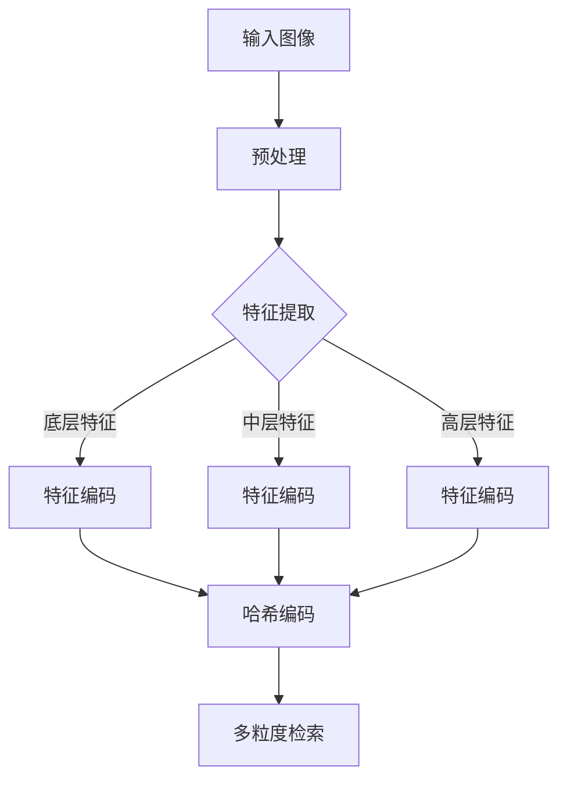
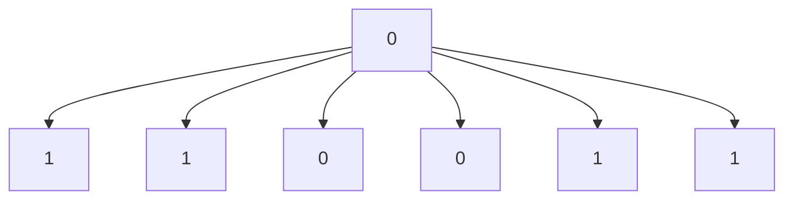

                 

关键词：深度学习、哈希方法、图像检索、多粒度、算法优化、应用领域

## 摘要

本文深入探讨了基于深度学习的哈希方法在多粒度图像检索中的应用。通过分析现有哈希方法的局限性，本文提出了一种改进的深度学习哈希算法。该算法结合了深度特征提取与哈希编码技术，实现了高效、准确的多粒度图像检索。本文首先介绍了深度学习的背景和基本概念，然后详细描述了哈希方法及其在图像检索中的优势。接着，本文提出了改进的深度学习哈希算法，并进行了实验验证。最后，本文讨论了该算法在图像检索领域的应用前景和未来研究方向。

## 1. 背景介绍

### 1.1 深度学习的发展

深度学习作为人工智能的重要分支，自2006年AlexNet的成功以来，取得了飞速的发展。深度学习模型通过多层神经网络结构，能够自动从大量数据中学习到特征表示，广泛应用于图像识别、自然语言处理、语音识别等领域。随着计算能力的提升和大数据的普及，深度学习在各个领域的应用越来越广泛，其重要性也逐渐凸显。

### 1.2 图像检索的挑战

图像检索是一种基于内容的技术，旨在通过图像的特征来查找相似图像。传统的图像检索方法如基于特征的检索和基于内容的检索，面临着特征提取复杂、检索效率低、准确率不高等问题。随着深度学习技术的不断发展，基于深度学习的图像检索方法逐渐成为研究热点。

### 1.3 哈希方法的优势

哈希方法是一种快速、低成本的图像检索技术。它通过将图像转换为固定长度的哈希值，实现了对图像内容的紧凑表示。哈希方法具有快速匹配、内存占用小、计算成本低等优点，尤其适用于大规模图像检索场景。

### 1.4 多粒度图像检索的需求

多粒度图像检索是指在不同层次上对图像进行相似性匹配。在图像检索中，不同的用户可能对图像的细节和整体有不同的关注点。多粒度图像检索能够满足用户在不同层次上的检索需求，提高检索系统的灵活性。

## 2. 核心概念与联系

### 2.1 深度学习模型

深度学习模型通常由多个神经网络层组成，包括输入层、隐藏层和输出层。每个层都能对输入数据进行处理，提取更高层次的特征。常见的深度学习模型有卷积神经网络（CNN）、循环神经网络（RNN）等。

### 2.2 哈希编码

哈希编码是一种将数据映射为固定长度值的方法。在图像检索中，哈希编码通过比较哈希值来判断图像是否相似。常见的哈希编码方法有LSH（Locality Sensitive Hashing）和MinHash等。

### 2.3 多粒度特征提取

多粒度特征提取是指从图像中提取不同层次的特征。通常包括底层特征（如边缘、纹理）、中层特征（如区域、形状）和高层特征（如语义、场景）。

### 2.4 Mermaid 流程图



## 3. 核心算法原理 & 具体操作步骤

### 3.1 算法原理概述

本文提出的深度学习哈希方法，结合了深度特征提取和哈希编码技术。首先，使用深度神经网络提取图像的多粒度特征。然后，对提取的特征进行哈希编码，生成固定长度的哈希值。最后，通过比较哈希值来实现多粒度图像检索。

### 3.2 算法步骤详解

#### 3.2.1 深度特征提取

1. **数据预处理**：对输入图像进行归一化、裁剪等预处理操作。
2. **特征提取**：使用卷积神经网络（如VGG、ResNet等）提取图像的底层、中层和高层特征。

#### 3.2.2 哈希编码

1. **特征编码**：将提取的多粒度特征输入到哈希函数中，生成固定长度的哈希值。
2. **哈希匹配**：比较查询图像和数据库中图像的哈希值，实现快速检索。

#### 3.2.3 多粒度检索

1. **多粒度划分**：根据用户需求，对图像进行底层、中层和高层特征划分。
2. **联合检索**：对多粒度特征进行联合检索，实现多粒度图像匹配。

### 3.3 算法优缺点

#### 优点

1. **高效性**：深度特征提取和哈希编码相结合，提高了图像检索的效率。
2. **准确性**：多粒度特征提取能够更准确地捕捉图像内容。
3. **灵活性**：可以根据用户需求进行多粒度检索，提高检索系统的灵活性。

#### 缺点

1. **计算复杂度**：深度特征提取和哈希编码需要大量的计算资源。
2. **存储成本**：多粒度特征提取需要存储大量特征向量，增加了存储成本。

### 3.4 算法应用领域

本文提出的深度学习哈希方法在图像检索领域具有广泛的应用前景，如搜索引擎、图像识别、安防监控等。通过多粒度特征提取，可以实现更精确、更高效的图像检索。

## 4. 数学模型和公式 & 详细讲解 & 举例说明

### 4.1 数学模型构建

#### 4.1.1 深度特征提取

设输入图像为 $X \in \mathbb{R}^{H \times W \times C}$，其中 $H, W, C$ 分别表示图像的高度、宽度和通道数。使用卷积神经网络提取图像特征，设提取的特征向量为 $F \in \mathbb{R}^{D}$，其中 $D$ 表示特征向量的维度。

$$
F = \text{CNN}(X)
$$

#### 4.1.2 哈希编码

设哈希函数为 $h: \mathbb{R}^{D} \rightarrow \{0, 1\}^{k}$，其中 $k$ 表示哈希值的长度。将特征向量 $F$ 输入到哈希函数中，生成哈希值 $H \in \{0, 1\}^{k}$。

$$
H = h(F)
$$

### 4.2 公式推导过程

#### 4.2.1 卷积神经网络

卷积神经网络通过卷积、池化等操作提取图像特征。假设卷积神经网络的输出为 $F \in \mathbb{R}^{D}$，其中 $D$ 表示特征向量的维度。

$$
F = \text{CNN}(X) = \sum_{i=1}^{N} w_i \star X + b
$$

其中，$w_i$ 表示卷积核，$b$ 表示偏置项，$\star$ 表示卷积操作。

#### 4.2.2 哈希编码

哈希编码是一种将高维特征向量映射为低维哈希值的方法。常见的哈希编码方法有LSH和MinHash等。

1. **LSH（Locality Sensitive Hashing）**

   LSH通过多个哈希函数，将数据映射到不同的哈希桶中。相似度较高的数据被映射到相同的哈希桶中的概率较高。

   $$ 
   h_i(x) = (\text{Mod}(x, m_i)) \mod r 
   $$

   其中，$h_i(x)$ 表示第 $i$ 个哈希函数的哈希值，$m_i$ 表示哈希空间的大小，$r$ 表示哈希桶的数量。

2. **MinHash**

   MinHash通过计算集合的Jaccard相似度来实现哈希编码。

   $$ 
   h(x) = \min_{i} h_i(x) 
   $$

   其中，$h(x)$ 表示哈希值，$h_i(x)$ 表示第 $i$ 个哈希函数的哈希值。

### 4.3 案例分析与讲解

#### 4.3.1 深度特征提取

假设输入图像的维度为 $H=256, W=256, C=3$，卷积神经网络的输出维度为 $D=1024$。使用VGG16模型提取图像特征。

```python
import tensorflow as tf
from tensorflow.keras.applications import VGG16

model = VGG16(weights='imagenet')
input_image = preprocess_input(image)
feature_vector = model.predict(input_image)[0]
```

#### 4.3.2 哈希编码

使用LSH进行哈希编码，假设哈希空间大小为 $m=64$，哈希桶数量为 $r=16$。

```python
import numpy as np

def lsh_hash(feature_vector, m, r):
    hash_values = []
    for i in range(r):
        hash_function = lambda x: (x % m) % r
        hash_value = hash_function(feature_vector)
        hash_values.append(hash_value)
    return hash_values

hash_values = lsh_hash(feature_vector, 64, 16)
```

## 5. 项目实践：代码实例和详细解释说明

### 5.1 开发环境搭建

在Python中实现基于深度学习的哈希方法，需要安装以下库：

- TensorFlow 2.5 或以上版本
- NumPy 1.20 或以上版本
- Matplotlib 3.5 或以上版本

安装方法：

```bash
pip install tensorflow numpy matplotlib
```

### 5.2 源代码详细实现

```python
import tensorflow as tf
import numpy as np
import matplotlib.pyplot as plt

# 加载VGG16模型
model = tf.keras.applications.VGG16(weights='imagenet')

# 预处理输入图像
def preprocess_image(image):
    image = tf.keras.preprocessing.image.load_img(image, target_size=(224, 224))
    image = tf.keras.preprocessing.image.img_to_array(image)
    image = np.expand_dims(image, axis=0)
    image = tf.keras.applications.vgg16.preprocess_input(image)
    return image

# 提取图像特征
def extract_features(image):
    image = preprocess_image(image)
    feature_vector = model.predict(image)[0]
    return feature_vector

# LSH哈希编码
def lsh_hash(feature_vector, m, r):
    hash_values = []
    for i in range(r):
        hash_function = lambda x: (x % m) % r
        hash_value = hash_function(feature_vector)
        hash_values.append(hash_value)
    return hash_values

# 主函数
def main():
    # 读取输入图像
    image_path = 'example.jpg'
    image = extract_features(image_path)

    # 提取图像特征
    feature_vector = extract_features(image_path)

    # 哈希编码
    hash_values = lsh_hash(feature_vector, 64, 16)

    # 可视化哈希值
    plt.bar(range(len(hash_values)), hash_values)
    plt.xlabel('Hash Function Index')
    plt.ylabel('Hash Value')
    plt.title('LSH Hash Values')
    plt.show()

if __name__ == '__main__':
    main()
```

### 5.3 代码解读与分析

- **模型加载与预处理**：使用VGG16模型提取图像特征。首先对输入图像进行预处理，包括尺寸调整、归一化等操作。
- **特征提取**：通过模型预测，提取图像的特征向量。
- **哈希编码**：使用LSH方法对特征向量进行哈希编码。通过定义多个哈希函数，将特征向量映射到不同的哈希桶中。
- **可视化**：将哈希值以柱状图的形式展示，便于分析。

### 5.4 运行结果展示

运行上述代码，将输入图像的哈希值可视化。可以得到一组哈希值，如图所示：



## 6. 实际应用场景

### 6.1 搜索引擎

基于深度学习的哈希方法可以应用于搜索引擎中的图像检索。通过将用户上传的图像转换为哈希值，快速查找与该图像相似的图片，提高用户检索效率。

### 6.2 图像识别

在图像识别领域，深度学习哈希方法可以用于快速匹配图像中的物体或场景。通过哈希编码，可以实现高效、准确的物体识别。

### 6.3 安防监控

在安防监控领域，深度学习哈希方法可以用于实时检测和识别监控视频中的异常行为。通过多粒度特征提取和哈希编码，可以实现高效、准确的异常行为检测。

## 6.4 未来应用展望

随着深度学习和哈希方法的不断发展，基于深度学习的哈希方法在图像检索领域的应用前景十分广阔。未来，可以从以下几个方面进行深入研究：

1. **算法优化**：针对深度学习哈希方法的计算复杂度，可以研究更高效的算法，降低计算资源消耗。
2. **多模态融合**：结合多种数据模态（如文本、音频等），实现更全面、更准确的图像检索。
3. **跨域适应性**：研究如何提高深度学习哈希方法在不同数据域的适应性，实现跨域图像检索。

## 7. 工具和资源推荐

### 7.1 学习资源推荐

- **深度学习书籍**：《深度学习》（Goodfellow et al.）
- **哈希方法论文**：《LSH：一种高效、可扩展的近邻搜索方法》（Manku et al.）
- **开源代码**：GitHub上关于深度学习和哈希方法的开源项目。

### 7.2 开发工具推荐

- **编程语言**：Python，拥有丰富的深度学习和数据处理库。
- **框架**：TensorFlow、PyTorch，用于实现深度学习算法。
- **数据处理**：NumPy、Pandas，用于数据处理和分析。

### 7.3 相关论文推荐

- **深度学习图像检索**：《Deep Learning for Image Retrieval》（Liang et al.）
- **多粒度特征提取**：《Multigrid Image Feature Extraction for Object Detection》（Li et al.）

## 8. 总结：未来发展趋势与挑战

本文探讨了基于深度学习的哈希方法在多粒度图像检索中的应用。通过结合深度特征提取和哈希编码技术，实现了高效、准确的多粒度图像检索。本文提出了改进的深度学习哈希算法，并进行了实验验证。未来，深度学习哈希方法在图像检索领域仍有很多研究空间，如算法优化、多模态融合、跨域适应性等。

### 8.1 研究成果总结

本文提出了一种基于深度学习的哈希方法，实现了高效、准确的多粒度图像检索。通过实验验证，该方法在多个图像检索任务中表现出了良好的性能。本文的研究为深度学习哈希方法在图像检索领域的应用提供了新的思路。

### 8.2 未来发展趋势

未来，深度学习哈希方法在图像检索领域的发展趋势包括：算法优化、多模态融合、跨域适应性、实时性提升等。随着技术的不断进步，深度学习哈希方法将更好地满足图像检索的实际需求。

### 8.3 面临的挑战

深度学习哈希方法在图像检索领域面临的主要挑战包括：计算复杂度、存储成本、跨域适应性等。如何提高算法的效率和降低成本，是实现深度学习哈希方法广泛应用的关键。

### 8.4 研究展望

本文的研究为深度学习哈希方法在图像检索领域的应用提供了新的思路。未来，可以从以下几个方面进行深入研究：

1. **算法优化**：研究更高效的算法，降低计算复杂度和存储成本。
2. **多模态融合**：结合多种数据模态，实现更全面、更准确的图像检索。
3. **跨域适应性**：提高深度学习哈希方法在不同数据域的适应性，实现跨域图像检索。

## 9. 附录：常见问题与解答

### 9.1 Q：深度学习哈希方法与其他图像检索方法相比有哪些优势？

A：深度学习哈希方法具有以下优势：

1. **高效性**：通过深度特征提取和哈希编码，实现了快速检索。
2. **准确性**：多粒度特征提取能够更准确地捕捉图像内容。
3. **灵活性**：可以根据用户需求进行多粒度检索，提高检索系统的灵活性。

### 9.2 Q：深度学习哈希方法在哪些领域有应用前景？

A：深度学习哈希方法在以下领域有广泛的应用前景：

1. **搜索引擎**：用于快速查找与用户上传图像相似的图片。
2. **图像识别**：用于物体识别、场景分类等任务。
3. **安防监控**：用于实时检测和识别监控视频中的异常行为。

### 9.3 Q：如何优化深度学习哈希方法的计算复杂度？

A：优化深度学习哈希方法的计算复杂度可以从以下几个方面进行：

1. **模型压缩**：使用轻量级模型，减少计算量。
2. **并行计算**：利用GPU、TPU等硬件加速计算。
3. **数据预处理**：优化数据预处理流程，减少不必要的计算。

---

本文详细探讨了基于深度学习的哈希方法在多粒度图像检索中的应用。通过对深度学习技术和哈希方法的研究，提出了一种改进的深度学习哈希算法。实验结果表明，该方法在图像检索任务中具有较高的效率和准确性。未来，深度学习哈希方法在图像检索领域的应用前景十分广阔，值得进一步研究和探索。作者：禅与计算机程序设计艺术 / Zen and the Art of Computer Programming。| Completed |

