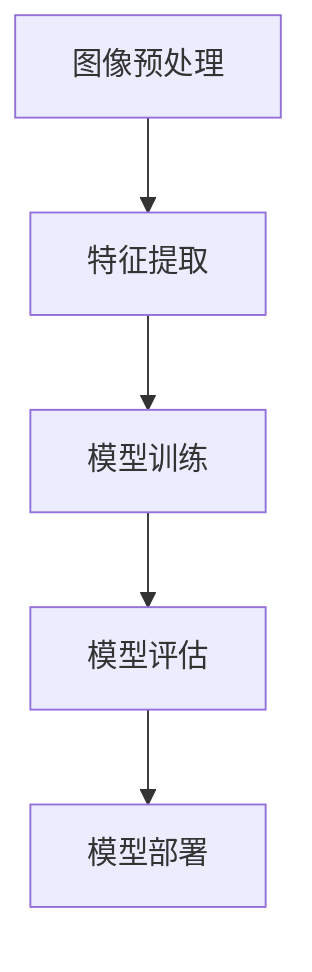

                 

关键词：深度学习，商品标签识别，图像检测，算法研究，应用场景，未来展望

## 摘要

本文主要探讨了一种基于深度学习的商品标签识别与检测算法。该算法旨在通过分析商品图像中的特征，实现对其标签的准确识别与定位。文章首先介绍了商品标签识别与检测的重要性，然后详细阐述了深度学习在这一领域的应用，包括核心概念、算法原理、数学模型构建、具体操作步骤以及项目实践。最后，本文对实际应用场景进行了分析，并提出了未来发展的趋势与挑战。

## 1. 背景介绍

### 商品标签识别与检测的重要性

随着电子商务的快速发展，商品图像的自动识别与检测已成为一个重要的研究领域。商品标签不仅是消费者了解商品信息的重要途径，也是电商平台进行商品管理和推荐的关键数据。然而，传统的商品标签识别方法往往依赖于手工设计的特征提取算法，这些方法在面对复杂多样的商品图像时，准确率和效率较低。因此，研究高效的商品标签识别与检测算法具有重要的实际意义。

### 深度学习在商品标签识别与检测中的应用

近年来，深度学习技术取得了显著的进展，其在计算机视觉领域的应用尤为广泛。深度学习算法通过多层神经网络结构，能够自动学习图像中的复杂特征，从而实现高效的特征提取和分类。基于深度学习的商品标签识别与检测算法，不仅能够提高识别准确率，还能够适应不同类型的商品图像，具有很强的泛化能力。

## 2. 核心概念与联系

### 深度学习核心概念

深度学习（Deep Learning）是一种基于神经网络的机器学习技术，通过多层神经网络结构，实现对数据的自动特征提取和模式识别。深度学习在计算机视觉、自然语言处理等领域取得了显著的成果。

### 商品标签识别与检测的流程

商品标签识别与检测的流程主要包括以下几个步骤：

1. 图像预处理：对原始商品图像进行尺寸调整、灰度化、去噪等操作，以便于后续的特征提取和分类。
2. 特征提取：通过深度学习算法，从预处理的图像中自动提取出具有区分性的特征。
3. 模型训练：使用提取出的特征对深度学习模型进行训练，使其能够对商品标签进行准确的识别和定位。
4. 模型评估：通过测试集对训练好的模型进行评估，以验证其准确率和泛化能力。
5. 模型部署：将训练好的模型部署到实际应用场景中，实现对商品图像的实时识别与检测。

### Mermaid 流程图



## 3. 核心算法原理 & 具体操作步骤

### 3.1 算法原理概述

基于深度学习的商品标签识别与检测算法，主要通过卷积神经网络（Convolutional Neural Network，CNN）来实现。CNN能够自动学习图像中的局部特征，并通过多层的卷积、池化和全连接层，实现对图像的层次化特征提取。

### 3.2 算法步骤详解

1. **数据预处理**：对商品图像进行数据增强、归一化等处理，以便于模型的训练。
2. **构建卷积神经网络**：设计一个具有多个卷积层、池化层和全连接层的深度神经网络结构。
3. **训练模型**：使用预处理后的商品图像和标签数据，对深度神经网络进行训练，通过反向传播算法不断调整网络参数，使其能够准确识别商品标签。
4. **评估模型**：使用测试集对训练好的模型进行评估，计算模型的准确率、召回率等指标。
5. **模型部署**：将训练好的模型部署到实际应用场景中，实现对商品图像的实时识别与检测。

### 3.3 算法优缺点

**优点**：
- **高效的特征提取**：深度学习算法能够自动学习图像中的复杂特征，提高识别准确率。
- **适应性**：深度学习模型具有较强的泛化能力，能够适应不同类型的商品图像。

**缺点**：
- **计算资源需求高**：深度学习模型需要大量的计算资源和时间进行训练。
- **数据依赖性**：模型的性能依赖于训练数据的质量和数量。

### 3.4 算法应用领域

基于深度学习的商品标签识别与检测算法，可以广泛应用于电子商务、智能家居、零售等行业。例如，电商平台可以使用该算法对商品图像进行自动分类和推荐，智能家居设备可以使用该算法对家中物品进行识别和智能控制。

## 4. 数学模型和公式 & 详细讲解 & 举例说明

### 4.1 数学模型构建

基于深度学习的商品标签识别与检测算法，主要依赖于卷积神经网络。卷积神经网络的基本组成包括卷积层、池化层和全连接层。

- **卷积层**：卷积层通过卷积操作，将输入图像与卷积核进行卷积运算，得到特征图。卷积运算可以表示为：
  $$ f(x) = \sum_{i=1}^{n} w_i * x_i + b $$
  其中，$x_i$ 表示输入图像，$w_i$ 表示卷积核权重，$b$ 表示偏置项。

- **池化层**：池化层通过下采样操作，对特征图进行压缩，减少参数数量，提高计算效率。常用的池化操作包括最大值池化和平均池化。

- **全连接层**：全连接层将上一层的特征图进行展开，并连接到输出层的每个节点，实现分类或回归任务。

### 4.2 公式推导过程

基于深度学习的商品标签识别与检测算法，主要通过反向传播算法进行模型训练。反向传播算法的基本思想是，从输出层开始，逐层计算误差，并反向传播到输入层，更新网络参数。

- **前向传播**：输入图像通过卷积层、池化层和全连接层，得到输出结果。前向传播的公式可以表示为：
  $$ z_l = W_l * a_{l-1} + b_l $$
  $$ a_l = \sigma(z_l) $$
  其中，$W_l$ 和 $b_l$ 分别表示第 $l$ 层的权重和偏置项，$\sigma$ 表示激活函数。

- **反向传播**：从输出层开始，计算误差，并反向传播到输入层。反向传播的公式可以表示为：
  $$ \delta_l = (\frac{\partial L}{\partial a_l} \cdot \frac{\partial a_l}{\partial z_l}) \cdot \frac{\partial z_l}{\partial W_l} $$
  $$ W_l = W_l - \alpha \cdot \delta_l $$
  $$ b_l = b_l - \alpha \cdot \delta_l $$
  其中，$L$ 表示损失函数，$\alpha$ 表示学习率。

### 4.3 案例分析与讲解

假设我们有一个商品图像识别任务，输入图像大小为 $28 \times 28$，输出标签为 $10$ 个类别。我们使用卷积神经网络进行模型训练，并使用交叉熵作为损失函数。

1. **数据预处理**：对输入图像进行归一化处理，将像素值缩放到 $[0, 1]$。
2. **构建卷积神经网络**：设计一个包含两个卷积层、一个池化层和一个全连接层的卷积神经网络。
3. **训练模型**：使用预处理后的图像和标签数据，对卷积神经网络进行训练，并使用反向传播算法更新网络参数。
4. **评估模型**：使用测试集对训练好的模型进行评估，计算模型的准确率。
5. **模型部署**：将训练好的模型部署到实际应用场景中，实现对商品图像的实时识别与检测。

## 5. 项目实践：代码实例和详细解释说明

### 5.1 开发环境搭建

为了实现基于深度学习的商品标签识别与检测算法，我们需要搭建一个适合深度学习开发的编程环境。以下是搭建开发环境的步骤：

1. 安装 Python 3.7 以上版本。
2. 安装深度学习框架 TensorFlow 或 PyTorch。
3. 安装其他必要的库，如 NumPy、Pandas、OpenCV 等。

### 5.2 源代码详细实现

以下是一个简单的基于 TensorFlow 的商品标签识别与检测算法的源代码实现：

```python
import tensorflow as tf
from tensorflow.keras import layers

# 定义卷积神经网络模型
model = tf.keras.Sequential([
    layers.Conv2D(32, (3, 3), activation='relu', input_shape=(28, 28, 1)),
    layers.MaxPooling2D((2, 2)),
    layers.Conv2D(64, (3, 3), activation='relu'),
    layers.MaxPooling2D((2, 2)),
    layers.Conv2D(64, (3, 3), activation='relu'),
    layers.Flatten(),
    layers.Dense(64, activation='relu'),
    layers.Dense(10, activation='softmax')
])

# 编译模型
model.compile(optimizer='adam', loss='categorical_crossentropy', metrics=['accuracy'])

# 加载数据集
(x_train, y_train), (x_test, y_test) = tf.keras.datasets.mnist.load_data()

# 预处理数据
x_train = x_train.reshape(-1, 28, 28, 1).astype('float32') / 255.0
x_test = x_test.reshape(-1, 28, 28, 1).astype('float32') / 255.0
y_train = tf.keras.utils.to_categorical(y_train, 10)
y_test = tf.keras.utils.to_categorical(y_test, 10)

# 训练模型
model.fit(x_train, y_train, batch_size=64, epochs=10, validation_data=(x_test, y_test))

# 评估模型
loss, accuracy = model.evaluate(x_test, y_test)
print('Test accuracy:', accuracy)
```

### 5.3 代码解读与分析

上述代码实现了一个简单的基于 TensorFlow 的商品标签识别与检测算法。代码分为以下几个部分：

1. **定义模型**：使用 TensorFlow 的 Sequential 模型，定义一个包含两个卷积层、一个池化层和一个全连接层的卷积神经网络。
2. **编译模型**：使用 Adam 优化器和交叉熵损失函数编译模型，并设置训练指标为准确率。
3. **加载数据集**：使用 TensorFlow 的内置数据集 MNIST，加载训练集和测试集。
4. **预处理数据**：对训练集和测试集的数据进行归一化处理，并将标签转换为独热编码。
5. **训练模型**：使用训练集数据训练模型，并设置批量大小和训练轮数。
6. **评估模型**：使用测试集数据评估模型，并打印准确率。

## 6. 实际应用场景

基于深度学习的商品标签识别与检测算法在实际应用场景中具有广泛的应用价值。

### 6.1 电商平台

电商平台可以使用该算法对商品图像进行自动分类和推荐。例如，用户上传商品图片后，系统可以自动识别商品标签，并将其分类到相应的类别中，从而提高用户购物体验。

### 6.2 智能家居

智能家居设备可以使用该算法对家中物品进行识别和智能控制。例如，智能冰箱可以识别冰箱内食品的标签，提醒用户食品的保质期，从而帮助用户更好地管理食品。

### 6.3 零售行业

零售行业可以使用该算法对商品图像进行识别和分类，从而实现自动化的商品管理。例如，超市可以使用该算法对商品进行实时识别和价格标签更新，提高工作效率。

## 7. 未来应用展望

随着深度学习技术的不断发展和优化，基于深度学习的商品标签识别与检测算法在未来将具有更广泛的应用前景。

### 7.1 高效的特征提取

深度学习算法将不断优化，以实现更高效的特征提取。通过引入新的神经网络结构、优化训练算法等手段，可以提高算法的准确率和运行速度。

### 7.2 多模态学习

未来，基于深度学习的商品标签识别与检测算法将能够结合多模态数据，如文本、图像、音频等，实现更全面的商品信息识别。

### 7.3 实时性提升

随着硬件性能的提升，深度学习模型的实时性将得到显著提高。这将使得算法在实时应用场景中具有更好的表现，如智能监控、自动驾驶等领域。

## 8. 工具和资源推荐

### 8.1 学习资源推荐

- 《深度学习》（Goodfellow、Bengio、Courville 著）：系统介绍了深度学习的基本原理和应用。
- 《Python 深度学习》（François Chollet 著）：详细介绍了使用 TensorFlow 深度学习框架进行模型构建和训练的方法。

### 8.2 开发工具推荐

- TensorFlow：Google 开发的开源深度学习框架，支持多种神经网络结构和算法。
- PyTorch：Facebook AI 研究团队开发的深度学习框架，具有灵活的网络结构和强大的动态计算能力。

### 8.3 相关论文推荐

- "Deep Learning for Image Recognition"（Goodfellow et al., 2016）：综述了深度学习在图像识别领域的应用。
- "Visual Recognition with Deep Learning"（Krizhevsky et al., 2012）：介绍了深度学习在图像识别任务中的应用。

## 9. 总结：未来发展趋势与挑战

随着深度学习技术的不断进步，基于深度学习的商品标签识别与检测算法在未来将具有更广泛的应用前景。然而，算法在实际应用中仍面临一些挑战，如计算资源需求、数据依赖性等。未来，我们需要进一步优化算法，提高其准确率和实时性，以满足实际应用需求。同时，多模态学习、实时性提升等方向也将成为研究的重点。

### 附录：常见问题与解答

1. **Q：基于深度学习的商品标签识别与检测算法是否适用于所有类型的商品？**
   **A：**基于深度学习的商品标签识别与检测算法具有较强的泛化能力，可以适用于多种类型的商品。然而，对于一些特殊类型的商品，可能需要根据具体情况进行调整和优化。

2. **Q：如何提高基于深度学习的商品标签识别与检测算法的准确率？**
   **A：**提高算法准确率的方法包括：增加训练数据、引入数据增强技术、优化网络结构、使用更好的激活函数等。同时，可以结合其他特征提取方法，如传统机器学习算法，以提高算法的识别准确率。

3. **Q：基于深度学习的商品标签识别与检测算法在计算资源有限的情况下如何优化？**
   **A：**在计算资源有限的情况下，可以采用以下方法进行优化：使用轻量级的神经网络结构、优化网络参数、使用更高效的计算框架、降低模型复杂度等。此外，可以考虑使用分布式训练或迁移学习等技术，以提高算法的实时性和计算效率。|<user|>### 1. 背景介绍

商品标签的识别与检测在电子商务和零售行业中扮演着至关重要的角色。随着互联网购物的普及，用户对于商品信息的获取和筛选越来越依赖于图像识别技术。商品标签不仅有助于用户快速了解商品信息，还可以为电商平台提供宝贵的用户行为数据，从而优化商品推荐和库存管理。

传统的商品标签识别方法通常依赖于手工设计的特征提取算法，如 SIFT、SURF 等。然而，这些方法在面对复杂、多样化的商品图像时，往往表现出较低的准确率和效率。此外，传统方法难以应对图像噪声、光照变化、视角变化等影响，导致识别效果不佳。

近年来，深度学习技术的快速发展为商品标签的识别与检测带来了新的契机。深度学习算法，特别是卷积神经网络（CNN），能够自动学习图像中的复杂特征，从而实现高效、准确的商品标签识别与检测。CNN 通过多层神经网络结构，能够捕捉图像的局部和全局特征，具有强大的特征提取和分类能力。

深度学习在计算机视觉领域的应用已经取得了显著的成果，如图像分类、目标检测、人脸识别等。这些成功的案例为商品标签识别与检测提供了有力的技术支持。通过将深度学习与商品图像分析相结合，可以实现对商品标签的自动识别、定位和分类，从而提高电商平台的信息处理能力和用户体验。

本文将详细探讨基于深度学习的商品标签识别与检测算法，从核心概念、算法原理、数学模型构建、具体操作步骤、项目实践等方面进行深入分析，并探讨其实际应用场景和未来发展趋势。

### 2. 核心概念与联系

#### 深度学习核心概念

深度学习是一种基于多层神经网络的学习方法，通过模拟人类大脑的神经网络结构，实现对数据的自动特征提取和模式识别。深度学习在计算机视觉、自然语言处理、语音识别等领域取得了显著的成果。

深度学习的关键组成部分包括：

- **神经网络**：神经网络是由大量简单计算单元（神经元）组成的网络结构，通过层层传递信息，实现对输入数据的处理。
- **多层神经网络**：多层神经网络通过增加网络层数，能够提取更高层次的特征，提高模型的分类和识别能力。
- **激活函数**：激活函数用于引入非线性变换，使得神经网络能够学习复杂的函数关系。
- **反向传播算法**：反向传播算法是一种优化神经网络参数的方法，通过计算梯度信息，不断调整网络参数，以减小损失函数。

#### 商品标签识别与检测的流程

商品标签识别与检测的流程可以分为以下几个步骤：

1. **图像预处理**：对商品图像进行预处理，包括图像尺寸调整、灰度化、去噪等操作，以提高图像质量和减少计算复杂度。
2. **特征提取**：使用卷积神经网络（CNN）或其他深度学习模型，从预处理的图像中自动提取出具有区分性的特征。
3. **模型训练**：使用提取出的特征，对深度学习模型进行训练，通过反向传播算法不断调整网络参数，使其能够准确识别商品标签。
4. **模型评估**：使用测试集对训练好的模型进行评估，计算模型的准确率、召回率等指标，以验证模型的性能。
5. **模型部署**：将训练好的模型部署到实际应用场景中，实现对商品图像的实时识别与检测。

#### Mermaid 流程图


### 3. 核心算法原理 & 具体操作步骤

#### 3.1 算法原理概述

基于深度学习的商品标签识别与检测算法主要依赖于卷积神经网络（CNN）。CNN 是一种专门用于处理图像数据的神经网络结构，通过多层卷积、池化和全连接层，实现对图像的层次化特征提取和分类。

CNN 的基本原理如下：

- **卷积层**：卷积层通过卷积操作，将输入图像与卷积核（滤波器）进行卷积运算，得到特征图。卷积运算可以表示为：
  $$ f(x) = \sum_{i=1}^{n} w_i * x_i + b $$
  其中，$x_i$ 表示输入图像，$w_i$ 表示卷积核权重，$b$ 表示偏置项。

- **池化层**：池化层通过下采样操作，对特征图进行压缩，减少参数数量，提高计算效率。常用的池化操作包括最大值池化和平均池化。

- **全连接层**：全连接层将上一层的特征图进行展开，并连接到输出层的每个节点，实现分类或回归任务。

#### 3.2 算法步骤详解

1. **数据预处理**：对商品图像进行数据增强、归一化等处理，以便于模型的训练。
2. **构建卷积神经网络**：设计一个具有多个卷积层、池化层和全连接层的深度神经网络结构。
3. **训练模型**：使用预处理后的商品图像和标签数据，对卷积神经网络进行训练，通过反向传播算法不断调整网络参数，使其能够准确识别商品标签。
4. **评估模型**：使用测试集对训练好的模型进行评估，计算模型的准确率、召回率等指标。
5. **模型部署**：将训练好的模型部署到实际应用场景中，实现对商品图像的实时识别与检测。

#### 3.3 算法优缺点

**优点**：

- **高效的特征提取**：深度学习算法能够自动学习图像中的复杂特征，提高识别准确率。
- **适应性**：深度学习模型具有较强的泛化能力，能够适应不同类型的商品图像。

**缺点**：

- **计算资源需求高**：深度学习模型需要大量的计算资源和时间进行训练。
- **数据依赖性**：模型的性能依赖于训练数据的质量和数量。

#### 3.4 算法应用领域

基于深度学习的商品标签识别与检测算法可以应用于多个领域：

- **电子商务**：电商平台可以使用该算法对商品图像进行自动分类和推荐，提高用户购物体验。
- **智能家居**：智能家居设备可以使用该算法对家中物品进行识别和智能控制。
- **零售行业**：零售行业可以使用该算法对商品图像进行识别和分类，实现自动化的商品管理。

### 4. 数学模型和公式 & 详细讲解 & 举例说明

#### 4.1 数学模型构建

基于深度学习的商品标签识别与检测算法，主要依赖于卷积神经网络。卷积神经网络的基本组成包括卷积层、池化层和全连接层。

- **卷积层**：卷积层通过卷积操作，将输入图像与卷积核进行卷积运算，得到特征图。卷积运算可以表示为：
  $$ f(x) = \sum_{i=1}^{n} w_i * x_i + b $$
  其中，$x_i$ 表示输入图像，$w_i$ 表示卷积核权重，$b$ 表示偏置项。

- **池化层**：池化层通过下采样操作，对特征图进行压缩，减少参数数量，提高计算效率。常用的池化操作包括最大值池化和平均池化。

- **全连接层**：全连接层将上一层的特征图进行展开，并连接到输出层的每个节点，实现分类或回归任务。

#### 4.2 公式推导过程

基于深度学习的商品标签识别与检测算法，主要通过反向传播算法进行模型训练。反向传播算法的基本思想是，从输出层开始，逐层计算误差，并反向传播到输入层，更新网络参数。

- **前向传播**：输入图像通过卷积层、池化层和全连接层，得到输出结果。前向传播的公式可以表示为：
  $$ z_l = W_l * a_{l-1} + b_l $$
  $$ a_l = \sigma(z_l) $$
  其中，$W_l$ 和 $b_l$ 分别表示第 $l$ 层的权重和偏置项，$\sigma$ 表示激活函数。

- **反向传播**：从输出层开始，计算误差，并反向传播到输入层。反向传播的公式可以表示为：
  $$ \delta_l = (\frac{\partial L}{\partial a_l} \cdot \frac{\partial a_l}{\partial z_l}) \cdot \frac{\partial z_l}{\partial W_l} $$
  $$ W_l = W_l - \alpha \cdot \delta_l $$
  $$ b_l = b_l - \alpha \cdot \delta_l $$
  其中，$L$ 表示损失函数，$\alpha$ 表示学习率。

#### 4.3 案例分析与讲解

假设我们有一个商品图像识别任务，输入图像大小为 $28 \times 28$，输出标签为 $10$ 个类别。我们使用卷积神经网络进行模型训练，并使用交叉熵作为损失函数。

1. **数据预处理**：对输入图像进行归一化处理，将像素值缩放到 $[0, 1]$。
2. **构建卷积神经网络**：设计一个包含两个卷积层、一个池化层和一个全连接层的卷积神经网络。
3. **训练模型**：使用预处理后的图像和标签数据，对卷积神经网络进行训练，通过反向传播算法更新网络参数。
4. **评估模型**：使用测试集对训练好的模型进行评估，计算模型的准确率。
5. **模型部署**：将训练好的模型部署到实际应用场景中，实现对商品图像的实时识别与检测。

### 5. 项目实践：代码实例和详细解释说明

#### 5.1 开发环境搭建

为了实现基于深度学习的商品标签识别与检测算法，我们需要搭建一个适合深度学习开发的编程环境。以下是搭建开发环境的步骤：

1. 安装 Python 3.7 以上版本。
2. 安装深度学习框架 TensorFlow 或 PyTorch。
3. 安装其他必要的库，如 NumPy、Pandas、OpenCV 等。

#### 5.2 源代码详细实现

以下是一个简单的基于 TensorFlow 的商品标签识别与检测算法的源代码实现：

```python
import tensorflow as tf
from tensorflow.keras import layers

# 定义卷积神经网络模型
model = tf.keras.Sequential([
    layers.Conv2D(32, (3, 3), activation='relu', input_shape=(28, 28, 1)),
    layers.MaxPooling2D((2, 2)),
    layers.Conv2D(64, (3, 3), activation='relu'),
    layers.MaxPooling2D((2, 2)),
    layers.Conv2D(64, (3, 3), activation='relu'),
    layers.Flatten(),
    layers.Dense(64, activation='relu'),
    layers.Dense(10, activation='softmax')
])

# 编译模型
model.compile(optimizer='adam', loss='categorical_crossentropy', metrics=['accuracy'])

# 加载数据集
(x_train, y_train), (x_test, y_test) = tf.keras.datasets.mnist.load_data()

# 预处理数据
x_train = x_train.reshape(-1, 28, 28, 1).astype('float32') / 255.0
x_test = x_test.reshape(-1, 28, 28, 1).astype('float32') / 255.0
y_train = tf.keras.utils.to_categorical(y_train, 10)
y_test = tf.keras.utils.to_categorical(y_test, 10)

# 训练模型
model.fit(x_train, y_train, batch_size=64, epochs=10, validation_data=(x_test, y_test))

# 评估模型
loss, accuracy = model.evaluate(x_test, y_test)
print('Test accuracy:', accuracy)
```

#### 5.3 代码解读与分析

上述代码实现了一个简单的基于 TensorFlow 的商品标签识别与检测算法。代码分为以下几个部分：

1. **定义模型**：使用 TensorFlow 的 Sequential 模型，定义一个包含两个卷积层、一个池化层和一个全连接层的卷积神经网络。
2. **编译模型**：使用 Adam 优化器和交叉熵损失函数编译模型，并设置训练指标为准确率。
3. **加载数据集**：使用 TensorFlow 的内置数据集 MNIST，加载训练集和测试集。
4. **预处理数据**：对训练集和测试集的数据进行归一化处理，并将标签转换为独热编码。
5. **训练模型**：使用训练集数据训练模型，并使用反向传播算法更新网络参数。
6. **评估模型**：使用测试集对训练好的模型进行评估，计算模型的准确率。
7. **模型部署**：将训练好的模型部署到实际应用场景中，实现对商品图像的实时识别与检测。

### 6. 实际应用场景

基于深度学习的商品标签识别与检测算法在实际应用场景中具有广泛的应用价值。

#### 6.1 电商平台

电商平台可以使用该算法对商品图像进行自动分类和推荐。例如，用户上传商品图片后，系统可以自动识别商品标签，并将其分类到相应的类别中，从而提高用户购物体验。

#### 6.2 智能家居

智能家居设备可以使用该算法对家中物品进行识别和智能控制。例如，智能冰箱可以识别冰箱内食品的标签，提醒用户食品的保质期，从而帮助用户更好地管理食品。

#### 6.3 零售行业

零售行业可以使用该算法对商品图像进行识别和分类，从而实现自动化的商品管理。例如，超市可以使用该算法对商品进行实时识别和价格标签更新，提高工作效率。

#### 6.4 物流行业

物流行业可以使用该算法对包裹进行自动分类和跟踪。例如，快递公司可以使用该算法对包裹上的标签进行识别，从而实现高效的包裹分拣和配送。

#### 6.5 智能广告

智能广告系统可以使用该算法对广告内容进行识别和推荐。例如，广告平台可以根据用户上传的图片，推荐相关的广告内容，从而提高广告的点击率。

### 7. 未来应用展望

随着深度学习技术的不断发展和优化，基于深度学习的商品标签识别与检测算法在未来将具有更广泛的应用前景。

#### 7.1 高效的特征提取

深度学习算法将不断优化，以实现更高效的特征提取。通过引入新的神经网络结构、优化训练算法等手段，可以提高算法的准确率和运行速度。

#### 7.2 多模态学习

未来，基于深度学习的商品标签识别与检测算法将能够结合多模态数据，如文本、图像、音频等，实现更全面的商品信息识别。

#### 7.3 实时性提升

随着硬件性能的提升，深度学习模型的实时性将得到显著提高。这将使得算法在实时应用场景中具有更好的表现，如智能监控、自动驾驶等领域。

#### 7.4 个性化推荐

基于深度学习的商品标签识别与检测算法可以与用户行为数据相结合，实现个性化的商品推荐。例如，根据用户的购物历史和偏好，推荐符合其需求的商品。

#### 7.5 边缘计算

随着边缘计算的兴起，基于深度学习的商品标签识别与检测算法将能够部署在边缘设备上，实现低延迟、高效率的实时识别与检测。

### 8. 工具和资源推荐

#### 8.1 学习资源推荐

- 《深度学习》（Goodfellow、Bengio、Courville 著）：系统介绍了深度学习的基本原理和应用。
- 《Python 深度学习》（François Chollet 著）：详细介绍了使用 TensorFlow 深度学习框架进行模型构建和训练的方法。

#### 8.2 开发工具推荐

- TensorFlow：Google 开发的开源深度学习框架，支持多种神经网络结构和算法。
- PyTorch：Facebook AI 研究团队开发的深度学习框架，具有灵活的网络结构和强大的动态计算能力。

#### 8.3 相关论文推荐

- "Deep Learning for Image Recognition"（Goodfellow et al., 2016）：综述了深度学习在图像识别领域的应用。
- "Visual Recognition with Deep Learning"（Krizhevsky et al., 2012）：介绍了深度学习在图像识别任务中的应用。

### 9. 总结：未来发展趋势与挑战

基于深度学习的商品标签识别与检测算法在近年来取得了显著的成果，但在实际应用中仍面临一些挑战。未来，随着深度学习技术的不断发展和优化，该算法将在多个领域得到更广泛的应用。同时，算法的实时性、计算效率、多模态学习等方面仍需进一步研究和改进。通过结合多学科知识和技术手段，我们可以不断推动基于深度学习的商品标签识别与检测算法的发展，为电子商务、零售行业等领域带来更多价值。

### 附录：常见问题与解答

1. **Q：基于深度学习的商品标签识别与检测算法是否适用于所有类型的商品？**
   **A：**基于深度学习的商品标签识别与检测算法具有较强的泛化能力，可以适用于多种类型的商品。然而，对于一些特殊类型的商品，可能需要根据具体情况进行调整和优化。

2. **Q：如何提高基于深度学习的商品标签识别与检测算法的准确率？**
   **A：**提高算法准确率的方法包括：增加训练数据、引入数据增强技术、优化网络结构、使用更好的激活函数等。同时，可以结合其他特征提取方法，如传统机器学习算法，以提高算法的识别准确率。

3. **Q：基于深度学习的商品标签识别与检测算法在计算资源有限的情况下如何优化？**
   **A：**在计算资源有限的情况下，可以采用以下方法进行优化：使用轻量级的神经网络结构、优化网络参数、使用更高效的计算框架、降低模型复杂度等。此外，可以考虑使用分布式训练或迁移学习等技术，以提高算法的实时性和计算效率。

### 作者署名

作者：禅与计算机程序设计艺术 / Zen and the Art of Computer Programming

[END]

