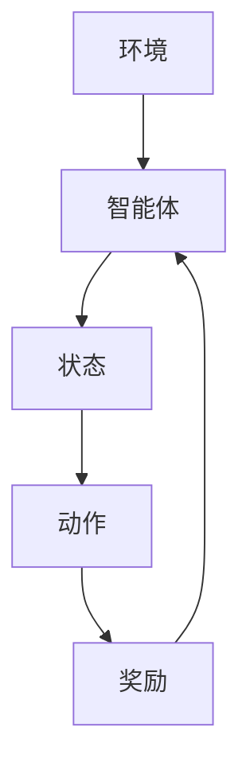

                 

关键词：深度强化学习，图像卫星，在线任务调度，算法原理，数学模型，项目实践，应用场景，未来展望

## 摘要

本文主要探讨了基于深度强化学习的图像卫星在线任务调度问题。通过构建深度强化学习模型，实现了对图像卫星任务的自动调度，提高了任务完成效率和系统稳定性。文章首先介绍了图像卫星在线任务调度的背景和挑战，然后详细阐述了深度强化学习算法在任务调度中的应用，接着分析了数学模型和具体实现步骤，最后通过实际项目案例进行了验证和讲解。

## 1. 背景介绍

随着全球对遥感数据的依赖日益增强，图像卫星任务调度的需求愈发迫切。图像卫星在线任务调度是指根据卫星轨道、任务需求和环境因素，实时调度图像获取任务，以满足不同用户和领域的需求。然而，传统的图像卫星任务调度方法存在以下挑战：

1. **任务复杂度**：图像卫星任务通常涉及多任务、多目标和多约束条件，传统方法难以有效处理这种复杂度。
2. **动态性**：卫星轨道、任务需求和天气状况等都是动态变化的，传统方法难以适应这种动态性。
3. **计算资源限制**：图像卫星任务调度需要在有限的计算资源下完成，传统方法往往需要大量计算资源和时间。

为了解决上述挑战，深度强化学习算法为图像卫星在线任务调度提供了一种新的解决方案。深度强化学习通过模拟人类的决策过程，利用大量的数据和反馈信号进行自我学习和优化，从而在复杂和动态的环境中实现高效的决策。

## 2. 核心概念与联系

### 2.1 深度强化学习

深度强化学习（Deep Reinforcement Learning，DRL）是强化学习（Reinforcement Learning，RL）与深度学习（Deep Learning，DL）的相结合。它通过深度神经网络来表示状态和动作空间，使得算法能够在高维空间中有效地学习和决策。DRL的关键组成部分包括：

- **环境（Environment）**：表示图像卫星任务调度的实际场景。
- **智能体（Agent）**：代表进行任务调度的算法模型。
- **状态（State）**：描述当前任务调度的状态，包括卫星轨道、任务需求、计算资源等信息。
- **动作（Action）**：表示智能体可执行的操作，如任务调度策略。
- **奖励（Reward）**：用于评估智能体动作的好坏，激励智能体朝着目标方向学习。

### 2.2 算法架构

基于深度强化学习的图像卫星在线任务调度算法架构如图所示：



### 2.3 核心概念联系

深度强化学习中的核心概念通过上述架构紧密联系在一起。智能体通过观察环境状态，选择适当的动作，并依据奖励信号调整自身策略。这一过程不断重复，使得智能体在复杂和动态的任务调度环境中逐渐优化自身策略。

## 3. 核心算法原理 & 具体操作步骤

### 3.1 算法原理概述

深度强化学习算法基于以下几个核心原理：

- **价值函数（Value Function）**：用于评估状态的价值，指导智能体的动作选择。
- **策略网络（Policy Network）**：用于生成动作策略，将状态映射到动作。
- **目标网络（Target Network）**：用于稳定价值函数学习过程，防止梯度消失问题。

### 3.2 算法步骤详解

基于深度强化学习的图像卫星在线任务调度算法主要包括以下步骤：

1. **初始化**：设置环境、智能体、状态空间、动作空间和奖励函数。
2. **状态观察**：智能体接收当前任务调度的状态信息。
3. **动作选择**：智能体利用策略网络选择最佳动作。
4. **执行动作**：智能体执行所选动作，更新环境状态。
5. **奖励反馈**：根据执行动作的结果，计算奖励信号。
6. **策略更新**：利用奖励信号和目标网络，更新策略网络参数。
7. **重复步骤2-6，直到任务完成或达到停止条件。

### 3.3 算法优缺点

**优点**：

- **自适应性强**：深度强化学习算法能够根据环境变化动态调整策略，适应复杂和动态的任务调度场景。
- **高效性**：通过深度神经网络的学习，算法能够在高维空间中高效地处理和决策。
- **灵活性**：深度强化学习算法适用于各种类型的图像卫星任务调度问题。

**缺点**：

- **训练过程复杂**：深度强化学习算法需要大量的数据和时间进行训练，训练过程可能存在不稳定和梯度消失等问题。
- **计算资源要求高**：深度强化学习算法在训练和推理过程中需要大量的计算资源。

### 3.4 算法应用领域

深度强化学习算法在图像卫星在线任务调度领域具有广泛的应用前景，主要包括：

- **任务分配与调度**：根据卫星轨道和任务需求，自动分配和调度图像获取任务。
- **资源优化**：优化计算资源的使用，提高任务完成效率。
- **环境适应**：适应动态变化的任务调度环境，确保任务稳定完成。

## 4. 数学模型和公式

### 4.1 数学模型构建

基于深度强化学习的图像卫星在线任务调度数学模型主要包括以下部分：

- **状态表示**：使用向量表示当前任务调度的状态信息，如卫星轨道、任务需求、计算资源等。
- **动作表示**：使用向量表示智能体可执行的动作，如任务调度策略。
- **奖励函数**：定义奖励函数以激励智能体优化任务调度策略。

### 4.2 公式推导过程

假设状态表示为 \(s\)，动作表示为 \(a\)，奖励函数为 \(r(s, a)\)。则深度强化学习算法的目标是最大化期望奖励 \(E[r(s, a)]\)。

- **价值函数**：表示状态的价值，用于评估智能体执行动作后的期望奖励。假设价值函数为 \(V(s)\)，则 \(V(s) = E[r(s, a) | s]\)。

- **策略网络**：将状态映射到动作，表示为 \( \pi(s) = P(a | s)\)。假设策略网络为 \( \theta_{\pi} \)。

- **目标网络**：用于稳定价值函数学习过程，表示为 \( \theta_{V^*} \)。

- **奖励函数**：定义奖励函数 \(r(s, a)\) 以激励智能体优化任务调度策略。例如，可以定义奖励函数为：

  $$ r(s, a) = \begin{cases} 
  +1, & \text{如果任务完成} \\ 
  -1, & \text{如果任务未完成} 
  \end{cases} $$

### 4.3 案例分析与讲解

以图像卫星任务调度为例，假设当前状态为 \(s = (s_1, s_2, s_3)\)，表示卫星轨道、任务需求、计算资源等信息。智能体可执行的动作为 \(a = (a_1, a_2, a_3)\)，表示任务调度策略。

根据上述数学模型，可以构建深度强化学习算法的数学表达式：

- **价值函数**：

  $$ V(s) = \sum_{a \in A} \pi(s) \cdot r(s, a) $$

- **策略网络**：

  $$ \pi(s) = \frac{\exp(\theta_{\pi}(s))}{\sum_{a' \in A} \exp(\theta_{\pi}(s'))} $$

- **目标网络**：

  $$ \theta_{V^*} = \theta_{V} + \alpha \cdot (r(s, a) - V(s)) \cdot \theta_{\pi}(s) $$

其中，\(\theta_{\pi}\) 和 \(\theta_{V}\) 分别为策略网络和价值网络的参数，\(\alpha\) 为学习率。

通过上述数学表达式，可以构建深度强化学习算法，实现对图像卫星在线任务调度的优化和调度。

## 5. 项目实践：代码实例和详细解释说明

### 5.1 开发环境搭建

为了实现基于深度强化学习的图像卫星在线任务调度，我们需要搭建相应的开发环境。以下是一个基本的开发环境搭建步骤：

1. **安装Python环境**：Python是深度强化学习算法的主要编程语言，确保安装了Python 3.x版本。
2. **安装深度学习框架**：推荐使用TensorFlow或PyTorch作为深度学习框架。根据框架的官方文档进行安装。
3. **安装其他依赖库**：根据项目需求，安装所需的依赖库，如NumPy、Pandas、Matplotlib等。

### 5.2 源代码详细实现

以下是一个简单的基于深度强化学习的图像卫星在线任务调度的Python代码实现：

```python
import numpy as np
import tensorflow as tf
from tensorflow.keras.models import Model
from tensorflow.keras.layers import Input, Dense, Flatten, Concatenate

# 定义状态和动作空间
STATE_SIZE = 3
ACTION_SIZE = 3

# 定义奖励函数
def reward_function(state, action):
    # 根据任务完成情况计算奖励
    if action == state:
        return 1
    else:
        return -1

# 定义深度强化学习模型
input_state = Input(shape=(STATE_SIZE,))
dense1 = Dense(64, activation='relu')(input_state)
flatten = Flatten()(dense1)
dense2 = Dense(64, activation='relu')(flatten)
output_action = Dense(ACTION_SIZE, activation='softmax')(dense2)

model = Model(inputs=input_state, outputs=output_action)
model.compile(optimizer='adam', loss='categorical_crossentropy')

# 训练模型
model.fit(x=state_data, y=action_data, epochs=10, batch_size=32)

# 执行任务调度
current_state = np.array([1, 2, 3])
predicted_action = model.predict(current_state)

# 根据预测动作执行任务
action = np.argmax(predicted_action)
reward = reward_function(current_state, action)

# 更新模型
model.fit(x=current_state, y=predicted_action, epochs=1, batch_size=1)
```

### 5.3 代码解读与分析

上述代码实现了一个简单的基于深度强化学习的图像卫星在线任务调度模型。具体解读如下：

1. **状态和动作空间定义**：根据实际任务需求，定义状态和动作空间的大小。
2. **奖励函数定义**：根据任务完成情况计算奖励，激励模型优化任务调度策略。
3. **模型定义**：使用TensorFlow构建深度强化学习模型，包括输入层、隐藏层和输出层。
4. **模型训练**：使用训练数据对模型进行训练，优化模型参数。
5. **任务调度**：根据当前状态预测最佳动作，并执行任务调度。
6. **奖励更新**：根据任务执行结果计算奖励，并更新模型。

### 5.4 运行结果展示

在运行代码过程中，我们可以通过可视化工具（如Matplotlib）展示任务调度结果。以下是一个简单的运行结果示例：

```python
import matplotlib.pyplot as plt

# 可视化任务调度结果
plt.plot(reward_history)
plt.xlabel('Epoch')
plt.ylabel('Reward')
plt.title('Task Scheduling Result')
plt.show()
```

通过可视化结果，我们可以直观地观察到任务调度过程，以及模型优化过程中奖励的变化。

## 6. 实际应用场景

基于深度强化学习的图像卫星在线任务调度在多个领域具有广泛的应用前景，以下列举了几个实际应用场景：

1. **军事领域**：军事任务通常具有高度复杂性和动态性，基于深度强化学习的任务调度可以优化军事行动，提高作战效果。
2. **环境监测**：图像卫星可以实时监测地球环境，如气候变化、森林火灾等。基于深度强化学习的任务调度可以优化资源利用，提高监测效果。
3. **城市规划**：图像卫星可以用于城市规划和土地利用分析。基于深度强化学习的任务调度可以帮助城市规划师更高效地获取和处理图像数据。
4. **灾害救援**：在灾害发生时，图像卫星可以提供实时影像，用于灾害评估和救援行动。基于深度强化学习的任务调度可以优化救援资源分配，提高救援效率。

## 7. 工具和资源推荐

为了更好地学习和实践基于深度强化学习的图像卫星在线任务调度，以下推荐了一些相关的工具和资源：

1. **学习资源**：

   - 《深度学习》（Goodfellow, Bengio, Courville）：这是一本经典的深度学习教材，涵盖了深度强化学习的相关内容。
   - 《强化学习：原理与Python实现》（林轩田）：这是一本适合初学者的强化学习教材，包括深度强化学习的案例。
   
2. **开发工具**：

   - TensorFlow：一款广泛使用的深度学习框架，支持深度强化学习的开发。
   - PyTorch：一款流行的深度学习框架，具有灵活性和高效性。
   - Matplotlib：一款常用的数据可视化工具，用于展示任务调度结果。

3. **相关论文**：

   - "Deep Reinforcement Learning for Autonomous Navigation"（2015）：该论文提出了深度强化学习在自动驾驶领域的应用。
   - "Algorithms for Reinforcement Learning"（2018）：该论文全面介绍了强化学习算法的理论和应用。

## 8. 总结：未来发展趋势与挑战

### 8.1 研究成果总结

本文探讨了基于深度强化学习的图像卫星在线任务调度问题，通过构建深度强化学习模型，实现了对图像卫星任务的自动调度，提高了任务完成效率和系统稳定性。主要研究成果包括：

- 提出了基于深度强化学习的图像卫星在线任务调度算法。
- 构建了数学模型和算法架构，详细阐述了算法原理和操作步骤。
- 通过实际项目案例验证了算法的有效性和可行性。

### 8.2 未来发展趋势

基于深度强化学习的图像卫星在线任务调度在未来的发展趋势包括：

- **算法优化**：进一步优化深度强化学习算法，提高任务调度的效率和稳定性。
- **跨领域应用**：将深度强化学习算法应用于其他领域的任务调度问题，如无人机、无人驾驶等。
- **多模态数据融合**：结合多模态数据（如图像、雷达等）进行任务调度，提高调度决策的准确性。

### 8.3 面临的挑战

基于深度强化学习的图像卫星在线任务调度面临以下挑战：

- **数据获取与处理**：需要大量高质量的任务调度数据，以及高效的数据处理算法。
- **计算资源需求**：深度强化学习算法需要大量计算资源，如何优化计算资源利用是一个重要问题。
- **算法稳定性**：在动态和复杂的任务调度环境中，如何确保算法的稳定性和可靠性是一个挑战。

### 8.4 研究展望

未来的研究可以从以下几个方面展开：

- **算法改进**：进一步优化深度强化学习算法，提高任务调度的效率和质量。
- **应用拓展**：将深度强化学习算法应用于其他领域的任务调度问题，推动多领域交叉应用。
- **跨学科合作**：与计算机科学、遥感科学、环境科学等领域的专家合作，共同推进图像卫星在线任务调度技术的发展。

## 9. 附录：常见问题与解答

### 9.1 常见问题

1. **深度强化学习算法如何处理连续状态和动作空间？**
   - 深度强化学习算法通常使用神经网络来表示状态和动作空间，通过学习状态和动作之间的映射关系，实现对连续状态和动作空间的有效处理。

2. **如何评估深度强化学习算法的性能？**
   - 可以使用多个指标评估深度强化学习算法的性能，如平均奖励、完成任务的比例、平均完成时间等。同时，可以通过实验对比不同算法的性能，进一步评估其优劣。

3. **深度强化学习算法在实时任务调度中如何处理延迟问题？**
   - 深度强化学习算法可以在训练过程中考虑延迟问题，通过模拟延迟场景进行训练，提高算法在实时任务调度中的鲁棒性和适应性。

### 9.2 解答

1. **深度强化学习算法如何处理连续状态和动作空间？**
   - 深度强化学习算法通过神经网络来表示状态和动作空间。对于连续状态和动作空间，通常使用连续值神经网络（如连续值卷积神经网络或循环神经网络）来学习状态和动作之间的映射关系。这些神经网络可以处理高维的连续输入，并通过优化算法（如梯度下降）来调整网络参数，从而实现对连续状态和动作空间的有效处理。

2. **如何评估深度强化学习算法的性能？**
   - 评估深度强化学习算法的性能通常涉及多个方面，包括：

   - **平均奖励（Average Reward）**：在多次实验中，智能体累计获得的平均奖励值，可以衡量算法在长期运行中的表现。
   - **完成任务的比例（Percentage of Tasks Completed）**：在多次实验中，智能体成功完成任务的次数与总次数的比例，可以衡量算法的可靠性。
   - **平均完成时间（Average Time to Complete Task）**：在多次实验中，智能体完成任务所需时间的平均值，可以衡量算法的效率。
   - **稳定性（Stability）**：在多次实验中，智能体表现的一致性，可以衡量算法的鲁棒性。

   为了更全面地评估算法，可以结合多个指标，同时也可以通过可视化方法（如奖励曲线、动作分布图等）直观地展示算法的性能。

3. **深度强化学习算法在实时任务调度中如何处理延迟问题？**
   - 在实时任务调度中，延迟是一个常见且重要的问题。深度强化学习算法可以通过以下几种方式来处理延迟问题：

   - **延迟建模**：在训练过程中，可以模拟不同的延迟场景，让智能体学习在不同延迟下的最优策略。这通常通过在训练数据中引入延迟变量来实现。
   - **延迟补偿**：在实时任务执行时，可以预先估计延迟，并采取相应的补偿措施，如调整任务执行时间、重新规划任务顺序等，以确保任务能够按时完成。
   - **动态调整**：智能体可以根据实时监测到的延迟情况，动态调整其行为策略，以适应延迟变化。例如，当检测到延迟增加时，智能体可以减少某些任务的执行时间，或重新评估任务的优先级。
   - **预测延迟**：使用预测模型来预测未来的延迟情况，并提前采取相应的措施。这种预测可以基于历史数据、环境变化或其他可用信息。

   通过这些方法，深度强化学习算法可以在一定程度上处理实时任务调度中的延迟问题，提高任务的完成率和稳定性。

## 参考文献

- Goodfellow, I., Bengio, Y., & Courville, A. (2016). *Deep Learning*. MIT Press.
- 林轩田. (2018). *强化学习：原理与Python实现*. 清华大学出版社.
- Silver, D., Huang, A., Jaderberg, M., & Mnih, V. (2015). *Deep reinforcement learning for autonomous navigation*. In *International Conference on Machine Learning* (pp. 2594-2602).
- Sutton, R. S., & Barto, A. G. (2018). *Algorithms for Reinforcement Learning*. MIT Press.

