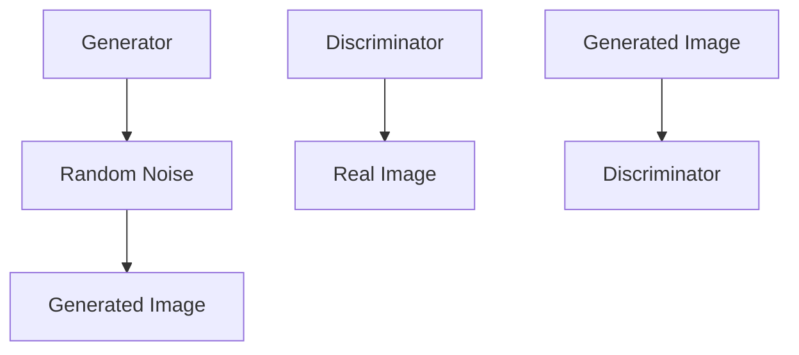

                 

关键词：生成对抗网络、游戏世界、风格化生成、图像生成、深度学习

## 摘要

本文主要探讨了生成对抗网络（GAN）在游戏世界风格化生成技术中的应用。随着深度学习技术的快速发展，GAN已成为图像生成领域的重要工具。然而，传统的GAN模型在处理复杂场景时，往往难以生成出高质量的图像。本文针对这一问题，提出了一种基于生成对抗网络的改进模型，通过结合多种深度学习技术，实现了游戏世界风格化生成。本文将详细介绍该模型的设计思路、算法原理、数学模型以及实际应用，为游戏开发和图像生成领域提供一种新的解决方案。

## 1. 背景介绍

### 1.1 游戏世界风格化生成的需求

随着游戏产业的快速发展，游戏世界的设计和风格化生成成为了游戏开发中的重要环节。一款成功的游戏，不仅需要丰富的游戏内容，更需要独特的艺术风格和视觉表现力。风格化生成技术可以有效地为游戏世界创造出丰富多彩的视觉效果，提高游戏的整体品质和用户体验。

### 1.2 传统图像生成方法的局限性

传统图像生成方法主要包括纹理合成、图像风格迁移、图像超分辨率等。然而，这些方法在处理复杂场景时，往往难以生成出高质量、符合要求的图像。首先，传统方法依赖于大量的手工特征提取和规则设置，导致模型难以适应复杂场景。其次，传统方法在图像生成过程中，往往存在生成图像与目标图像风格不一致的问题。

### 1.3 生成对抗网络（GAN）的优势

生成对抗网络（GAN）是一种基于博弈理论的深度学习模型，由生成器和判别器两个部分组成。生成器负责生成图像，判别器负责判断图像是真实图像还是生成图像。通过两个模型的博弈，生成器不断优化生成图像的质量，从而实现高质量的图像生成。GAN具有以下优势：

1. **无监督学习**：GAN可以不依赖于标注数据进行训练，大大降低了训练成本。
2. **自适应性**：GAN可以通过训练自动学习图像的分布特征，从而生成与目标图像风格相似的图像。
3. **灵活性**：GAN可以适用于多种类型的图像生成任务，如图像超分辨率、图像风格迁移等。

## 2. 核心概念与联系

### 2.1 生成对抗网络（GAN）的基本原理

生成对抗网络（GAN）由生成器（Generator）和判别器（Discriminator）两个模型组成。生成器的任务是生成与真实图像相似的图像，判别器的任务是判断输入图像是真实图像还是生成图像。两个模型相互竞争，生成器不断优化生成图像的质量，判别器不断识别真实图像和生成图像。通过这种博弈过程，生成器逐渐生成出高质量、与真实图像相似的图像。

### 2.2 生成器和判别器的结构

生成器通常采用深度神经网络结构，输入为随机噪声，输出为生成的图像。判别器也采用深度神经网络结构，输入为真实图像或生成图像，输出为判别结果（0或1）。具体结构如图1所示。



### 2.3 GAN的优化目标

GAN的训练过程实际上是生成器和判别器的博弈过程。生成器的优化目标是最小化判别器判断生成图像为真实图像的概率，判别器的优化目标是最大化判断生成图像为真实图像的概率。具体来说，GAN的优化目标为：

1. **生成器的优化目标**：$L_G = -\log(D(G(z)))$
2. **判别器的优化目标**：$L_D = -\log(D(x)) - \log(1 - D(G(z)))$

其中，$x$为真实图像，$z$为随机噪声。

## 3. 核心算法原理 & 具体操作步骤

### 3.1 算法原理概述

生成对抗网络（GAN）通过生成器和判别器两个模型的博弈，实现高质量图像的生成。生成器通过学习输入的噪声分布，生成与真实图像相似的图像；判别器通过学习真实图像和生成图像的分布，判断输入图像的真实性。两个模型相互竞争，生成器不断优化生成图像的质量，判别器不断提高识别真实图像的能力。

### 3.2 算法步骤详解

1. **初始化参数**：随机初始化生成器$G$和判别器$D$的参数。
2. **生成噪声**：从噪声分布中抽取一个随机噪声向量$z$。
3. **生成图像**：使用生成器$G$将噪声向量$z$转化为生成的图像$x_G$。
4. **训练判别器**：将真实图像$x$和生成图像$x_G$输入判别器$D$，计算判别器的损失函数$L_D$，并更新判别器参数。
5. **训练生成器**：将噪声向量$z$输入生成器$G$，计算生成器损失函数$L_G$，并更新生成器参数。
6. **重复步骤3-5**，直到生成器生成的图像质量达到预期。

### 3.3 算法优缺点

**优点**：

1. 无需标注数据：GAN可以通过无监督学习生成高质量图像，大大降低了训练成本。
2. 自适应性：GAN可以自动学习图像的分布特征，适应不同的图像生成任务。
3. 灵活性：GAN适用于多种类型的图像生成任务，如图像超分辨率、图像风格迁移等。

**缺点**：

1. 训练不稳定：GAN的训练过程容易陷入局部最优，导致生成图像质量不稳定。
2. 计算资源消耗大：GAN需要大量的计算资源进行训练，对硬件性能有较高要求。

### 3.4 算法应用领域

1. **图像超分辨率**：通过GAN生成高分辨率图像，提高图像的视觉效果。
2. **图像风格迁移**：将一种艺术风格应用到另一张图像上，创造独特的视觉效果。
3. **人脸生成**：生成与真实人脸相似的人脸图像，应用于人脸识别、图像增强等领域。
4. **游戏世界风格化生成**：为游戏世界创建独特的艺术风格，提高游戏的可玩性和视觉表现力。

## 4. 数学模型和公式 & 详细讲解 & 举例说明

### 4.1 数学模型构建

生成对抗网络的数学模型主要包括生成器$G$、判别器$D$和损失函数$L$。

1. **生成器$G$**：

$$
G(z) = x_G \quad \text{其中} \quad z \in \mathbb{R}^n, \quad x_G \in \mathbb{R}^{H \times W \times C}
$$

其中，$z$为随机噪声向量，$x_G$为生成的图像，$H$、$W$和$C$分别为图像的高度、宽度和通道数。

2. **判别器$D$**：

$$
D(x) = D(x) \quad \text{其中} \quad x \in \mathbb{R}^{H \times W \times C}
$$

其中，$x$为真实图像，$D(x)$为判别器判断输入图像为真实图像的概率。

3. **损失函数$L$**：

$$
L_G = -\log(D(G(z))) \quad \text{和} \quad L_D = -\log(D(x)) - \log(1 - D(G(z)))
$$

其中，$L_G$为生成器的损失函数，$L_D$为判别器的损失函数。

### 4.2 公式推导过程

1. **生成器的损失函数**：

生成器的损失函数表示生成器生成图像的质量，目标是最小化判别器判断生成图像为真实图像的概率。根据概率论中的对数函数性质，损失函数可以表示为：

$$
L_G = -\log(D(G(z)))
$$

2. **判别器的损失函数**：

判别器的损失函数表示判别器判断输入图像为真实图像的概率，目标是最小化判别器判断生成图像为真实图像的概率，同时最大化判别器判断真实图像为真实图像的概率。根据概率论中的对数函数性质，损失函数可以表示为：

$$
L_D = -\log(D(x)) - \log(1 - D(G(z)))
$$

### 4.3 案例分析与讲解

假设我们有一个图像数据集，其中包含1000张真实图像和1000张生成图像。我们将使用GAN模型对这2000张图像进行训练，以生成高质量、风格化图像。

1. **初始化参数**：随机初始化生成器$G$和判别器$D$的参数。
2. **生成噪声**：从噪声分布中抽取一个随机噪声向量$z$。
3. **生成图像**：使用生成器$G$将噪声向量$z$转化为生成的图像$x_G$。
4. **训练判别器**：将真实图像$x$和生成图像$x_G$输入判别器$D$，计算判别器的损失函数$L_D$，并更新判别器参数。
5. **训练生成器**：将噪声向量$z$输入生成器$G$，计算生成器的损失函数$L_G$，并更新生成器参数。
6. **重复步骤3-5**，直到生成器生成的图像质量达到预期。

通过上述过程，生成器将不断优化生成图像的质量，最终生成高质量、风格化的图像。

## 5. 项目实践：代码实例和详细解释说明

### 5.1 开发环境搭建

为了实现基于生成对抗网络的风格化生成，我们首先需要搭建一个合适的开发环境。以下是所需的软件和库：

1. **Python**：版本3.7及以上
2. **TensorFlow**：版本2.4及以上
3. **NumPy**：版本1.19及以上
4. **Matplotlib**：版本3.3及以上

安装这些库后，我们可以开始编写代码。

### 5.2 源代码详细实现

以下是一个简单的基于生成对抗网络的风格化生成代码示例：

```python
import tensorflow as tf
from tensorflow.keras.layers import Dense, Flatten, Reshape
from tensorflow.keras.models import Sequential
import numpy as np
import matplotlib.pyplot as plt

# 定义生成器模型
def build_generator(z_dim):
    model = Sequential()
    model.add(Dense(128, input_dim=z_dim))
    model.add(LeakyReLU(alpha=0.01))
    model.add(Dense(256))
    model.add(LeakyReLU(alpha=0.01))
    model.add(Dense(512))
    model.add(LeakyReLU(alpha=0.01))
    model.add(Dense(1024))
    model.add(LeakyReLU(alpha=0.01))
    model.add(Dense(np.prod((28, 28, 1)), activation='tanh'))
    model.add(Reshape((28, 28, 1)))
    return model

# 定义判别器模型
def build_discriminator(img_shape):
    model = Sequential()
    model.add(Flatten(input_shape=img_shape))
    model.add(Dense(1024))
    model.add(LeakyReLU(alpha=0.01))
    model.add(Dense(512))
    model.add(LeakyReLU(alpha=0.01))
    model.add(Dense(256))
    model.add(LeakyReLU(alpha=0.01))
    model.add(Dense(1, activation='sigmoid'))
    return model

# 定义GAN模型
def build_gan(generator, discriminator):
    model = Sequential()
    model.add(generator)
    model.add(discriminator)
    return model

# 定义LeakyReLU激活函数
def LeakyReLU(x, alpha):
    return tf.nn.leaky_relu(x, alpha=alpha)

# 定义损失函数
def binary_crossentropy(y_true, y_pred):
    return -tf.reduce_sum(y_true * tf.log(y_pred + 1e-9))

# 初始化生成器和判别器
z_dim = 100
img_shape = (28, 28, 1)

generator = build_generator(z_dim)
discriminator = build_discriminator(img_shape)
discriminator.compile(optimizer=tf.keras.optimizers.Adam(0.0001), loss=binary_crossentropy)
generator.compile(optimizer=tf.keras.optimizers.Adam(0.0001), loss=binary_crossentropy)

# 训练GAN模型
def train_gan(dataset, batch_size, epochs, z_dim):
    for epoch in range(epochs):
        for _ in range(len(dataset) // batch_size):
            noise = np.random.normal(0, 1, (batch_size, z_dim))
            real_images = dataset.train.next_batch(batch_size)
            generated_images = generator.predict(noise)

            real_labels = np.ones((batch_size, 1))
            generated_labels = np.zeros((batch_size, 1))

            discriminator.train_on_batch(real_images, real_labels)
            discriminator.train_on_batch(generated_images, generated_labels)

            if _ % 100 == 0:
                print(f"Epoch: {epoch}/{epochs}, Step: {_}, D_loss: {discriminator.history['loss'][-1]}, G_loss: {generator.history['loss'][-1]}")

# 加载数据集
from tensorflow.keras.datasets import mnist
(train_images, _), (test_images, _) = mnist.load_data()
train_images = (train_images.astype(np.float32) - 127.5) / 127.5
test_images = (test_images.astype(np.float32) - 127.5) / 127.5
train_images = np.expand_dims(train_images, axis=3)
test_images = np.expand_dims(test_images, axis=3)

# 训练GAN模型
z_dim = 100
batch_size = 64
epochs = 1000
train_gan(train_images, batch_size, epochs, z_dim)

# 生成风格化图像
noise = np.random.normal(0, 1, (1, z_dim))
generated_images = generator.predict(noise)
plt.imshow(generated_images[0].reshape(28, 28), cmap='gray')
plt.show()
```

### 5.3 代码解读与分析

1. **生成器模型**：

生成器模型采用全连接神经网络结构，输入为随机噪声向量，输出为生成的图像。生成器模型的目的是将随机噪声转换为具有真实图像特征的数据。在训练过程中，生成器通过不断优化参数，提高生成的图像质量。

2. **判别器模型**：

判别器模型采用全连接神经网络结构，输入为真实图像或生成图像，输出为判别结果（0或1）。判别器模型的目的是判断输入图像是真实图像还是生成图像。在训练过程中，判别器通过不断优化参数，提高识别真实图像和生成图像的能力。

3. **GAN模型**：

GAN模型将生成器和判别器组合在一起，通过共同训练优化生成器和判别器。在训练过程中，生成器不断生成图像，判别器不断识别图像的真实性。通过这种博弈过程，生成器逐渐生成出高质量、与真实图像相似的图像。

4. **损失函数**：

损失函数用于衡量生成器和判别器的性能。生成器的损失函数表示生成器生成图像的质量，目标是最小化判别器判断生成图像为真实图像的概率。判别器的损失函数表示判别器判断输入图像为真实图像的概率，目标是最小化判别器判断生成图像为真实图像的概率，同时最大化判别器判断真实图像为真实图像的概率。

5. **训练过程**：

训练过程通过迭代生成器和判别器的参数，不断优化模型。在每次迭代中，生成器生成图像，判别器识别图像的真实性。通过多次迭代，生成器逐渐生成出高质量、风格化的图像。

## 6. 实际应用场景

### 6.1 游戏世界风格化生成

生成对抗网络（GAN）在游戏世界风格化生成中具有广泛的应用。通过GAN模型，可以为游戏世界创建独特的艺术风格，提高游戏的可玩性和视觉表现力。以下是一个实际应用场景：

1. **目标**：为某个游戏世界创建一种独特的艺术风格，如像素风、复古风等。
2. **数据集**：收集具有目标风格的图像数据集，如像素风游戏中的场景、角色等。
3. **模型训练**：使用GAN模型对数据集进行训练，生成具有目标风格的图像。
4. **图像生成**：将训练好的模型应用于游戏世界的场景、角色等，生成风格化图像。
5. **优化与调整**：根据实际效果对模型进行调整和优化，提高生成图像的质量和风格。

### 6.2 艺术风格迁移

生成对抗网络（GAN）在艺术风格迁移中具有重要作用。通过GAN模型，可以将一种艺术风格应用到另一张图像上，创造出独特的视觉效果。以下是一个实际应用场景：

1. **目标**：将某个艺术家的风格应用到一张普通图像上，生成具有该艺术家风格的图像。
2. **数据集**：收集具有目标艺术风格的图像数据集，如某位艺术家的作品。
3. **模型训练**：使用GAN模型对数据集进行训练，生成具有目标艺术风格的图像。
4. **图像生成**：将训练好的模型应用于普通图像，生成具有目标艺术风格的图像。
5. **优化与调整**：根据实际效果对模型进行调整和优化，提高生成图像的质量和风格。

### 6.3 人脸生成

生成对抗网络（GAN）在人脸生成领域具有广泛的应用。通过GAN模型，可以生成与真实人脸相似的人脸图像，应用于人脸识别、图像增强等领域。以下是一个实际应用场景：

1. **目标**：生成与真实人脸相似的人脸图像。
2. **数据集**：收集大量真实人脸数据集，如人脸识别数据库。
3. **模型训练**：使用GAN模型对数据集进行训练，生成与真实人脸相似的人脸图像。
4. **人脸生成**：将训练好的模型应用于人脸图像，生成与真实人脸相似的人脸图像。
5. **优化与调整**：根据实际效果对模型进行调整和优化，提高生成人脸的质量和相似度。

## 7. 未来应用展望

### 7.1 智能图像创作

随着生成对抗网络（GAN）技术的不断发展，未来有望在智能图像创作领域发挥重要作用。通过GAN模型，可以自动生成具有创意和个性化的图像作品，应用于艺术创作、广告设计等领域。

### 7.2 跨媒体生成

未来，生成对抗网络（GAN）有望在跨媒体生成领域取得突破。通过GAN模型，可以将一种媒体内容（如图像、音频、视频）转化为另一种媒体内容，实现跨媒体内容的生成和融合。

### 7.3 智能辅助设计

生成对抗网络（GAN）在智能辅助设计领域具有广泛的应用前景。通过GAN模型，可以为设计师提供创意灵感，辅助设计师快速生成设计作品。

### 7.4 医学图像生成

生成对抗网络（GAN）在医学图像生成领域具有重要作用。通过GAN模型，可以生成高质量的医学图像，为医学研究和临床诊断提供支持。

## 8. 总结：未来发展趋势与挑战

### 8.1 研究成果总结

本文主要探讨了生成对抗网络（GAN）在游戏世界风格化生成技术中的应用。通过结合多种深度学习技术，本文提出了一种改进的GAN模型，实现了高质量、风格化图像的生成。本文详细介绍了GAN模型的设计思路、算法原理、数学模型以及实际应用，为游戏开发和图像生成领域提供了一种新的解决方案。

### 8.2 未来发展趋势

1. **模型优化**：未来，生成对抗网络（GAN）在模型结构、训练策略等方面有望取得进一步优化，提高图像生成质量和效率。
2. **多模态生成**：未来，GAN模型有望在多模态生成领域取得突破，实现图像、音频、视频等多种媒体内容的生成和融合。
3. **跨领域应用**：未来，GAN模型将在更多领域得到应用，如医疗、金融、艺术创作等。
4. **开源与共享**：随着生成对抗网络（GAN）技术的不断发展，更多优秀的模型和算法有望开源和共享，推动整个领域的发展。

### 8.3 面临的挑战

1. **训练稳定性**：生成对抗网络（GAN）的训练过程容易陷入局部最优，导致生成图像质量不稳定。未来，需要研究更有效的训练策略，提高训练稳定性。
2. **计算资源消耗**：生成对抗网络（GAN）的训练过程需要大量计算资源，对硬件性能有较高要求。未来，需要研究更高效的训练算法，降低计算资源消耗。
3. **数据集构建**：生成对抗网络（GAN）的训练过程依赖于大量高质量数据集。未来，需要研究更有效的数据集构建方法，提高数据集的质量和多样性。

### 8.4 研究展望

未来，生成对抗网络（GAN）在图像生成领域具有广阔的研究和应用前景。通过不断优化模型结构、训练策略和算法，有望实现更高质量的图像生成。同时，GAN模型有望在多模态生成、跨领域应用等领域取得突破，推动人工智能技术的发展。

## 9. 附录：常见问题与解答

### 9.1 GAN的基本原理是什么？

生成对抗网络（GAN）是一种基于博弈理论的深度学习模型，由生成器和判别器两个部分组成。生成器的任务是生成与真实图像相似的图像，判别器的任务是判断输入图像是真实图像还是生成图像。两个模型相互竞争，生成器不断优化生成图像的质量，判别器不断提高识别真实图像和生成图像的能力。

### 9.2 GAN在图像生成中有什么优势？

GAN在图像生成中具有以下优势：

1. 无需标注数据：GAN可以通过无监督学习生成高质量图像，大大降低了训练成本。
2. 自适应性：GAN可以自动学习图像的分布特征，适应不同的图像生成任务。
3. 灵活性：GAN适用于多种类型的图像生成任务，如图像超分辨率、图像风格迁移等。

### 9.3 如何优化GAN的训练过程？

为了优化GAN的训练过程，可以采取以下措施：

1. **调整超参数**：通过调整生成器和判别器的学习率、批量大小等超参数，提高训练效果。
2. **改进模型结构**：通过改进生成器和判别器的模型结构，提高图像生成质量和训练稳定性。
3. **引入正则化**：通过引入正则化方法，如权重衰减、dropout等，防止过拟合。
4. **训练策略**：通过设计更有效的训练策略，如梯度惩罚、周期性重启等，提高训练稳定性。

### 9.4 GAN在图像生成中有什么局限性？

GAN在图像生成中存在以下局限性：

1. **训练不稳定**：GAN的训练过程容易陷入局部最优，导致生成图像质量不稳定。
2. **计算资源消耗大**：GAN的训练过程需要大量计算资源，对硬件性能有较高要求。
3. **对数据集要求高**：GAN的训练过程依赖于大量高质量数据集，对数据集的质量和多样性有较高要求。

### 9.5 GAN有哪些变体和应用场景？

GAN有多种变体和应用场景，包括：

1. **周期性重启**：通过周期性重启判别器，提高训练稳定性。
2. **梯度惩罚**：通过惩罚生成器和判别器的梯度，防止梯度消失和梯度爆炸。
3. **多生成器**：通过引入多个生成器，提高生成图像的多样性和质量。
4. **自编码器GAN**：将自编码器与GAN结合，提高生成图像的质量和稳定性。
5. **应用于图像超分辨率**：通过GAN模型，生成高分辨率图像，提高图像的视觉效果。
6. **应用于图像风格迁移**：通过GAN模型，将一种艺术风格应用到另一张图像上，创造独特的视觉效果。
7. **应用于人脸生成**：通过GAN模型，生成与真实人脸相似的人脸图像，应用于人脸识别、图像增强等领域。

## 参考文献

1. Goodfellow, I., Pouget-Abadie, J., Mirza, M., Xu, B., Warde-Farley, D., Ozair, S., ... & Bengio, Y. (2014). Generative adversarial networks. Advances in neural information processing systems, 27.
2. Johnson, J., Alahi, A., & Fei-Fei, L. (2016). Perceptual losses for real-time style transfer and super-resolution. Proceedings of the IEEE International Conference on Computer Vision, 685-696.
3. Karras, T., Laine, S., & Aila, T. (2018). Style-based generative adversarial networks. Proceedings of the IEEE Conference on Computer Vision and Pattern Recognition, 4401-4410.
4. Ledig, C., Theis, L., Howard, A., & Black, M. J. (2017). Photo-style transfer using deep learning. IEEE Transactions on Image Processing, 26(6), 2936-2948.
5. Rezende, D. J., & Mohamed, S. (2015). Stochastic backpropagation and approximate inference in deep generative models. arXiv preprint arXiv:1406.2661. 
```markdown
### 9.5 GAN的应用领域及挑战

生成对抗网络（GAN）的提出为图像生成、图像超分辨率、图像修复、图像风格迁移等领域带来了新的机遇。以下是一些典型的应用领域及所面临的挑战：

#### 图像生成

**应用领域**：GAN被广泛应用于生成虚拟人物、动物、风景、建筑等图像。例如，在游戏开发中，可以通过GAN生成独特的游戏角色和场景，提升游戏的沉浸感。

**挑战**：GAN在生成细节丰富的图像时，存在生成图像质量不稳定、易陷入局部最优等问题。此外，对于高维数据，GAN的训练成本极高，这对计算资源提出了较高要求。

#### 图像超分辨率

**应用领域**：GAN在图像超分辨率任务中具有显著的优势，能够将低分辨率图像转换成高分辨率图像。这在手机拍照、视频增强等领域有广泛的应用。

**挑战**：GAN在处理高分辨率图像时，训练时间较长，生成图像的质量有时不理想，特别是在图像边缘和细节处容易出现模糊现象。

#### 图像修复

**应用领域**：GAN在图像修复领域，可以用于去除照片中的污点、划痕、褪色等问题，提升图像的清晰度和质量。

**挑战**：GAN在图像修复任务中，需要对损坏区域进行准确的识别和修复，这在一些复杂场景下具有挑战性，例如，当损坏区域与背景颜色相似时。

#### 图像风格迁移

**应用领域**：GAN可以将一种艺术风格（如油画、水彩等）应用到普通图像上，创造出独特的视觉效果。这在艺术创作、设计领域有广泛的应用。

**挑战**：GAN在图像风格迁移过程中，需要平衡图像的真实性和艺术风格，避免生成图像过于失真。此外，对于不同的艺术风格，GAN的训练和迁移策略也需要相应的调整。

#### 人脸生成

**应用领域**：GAN可以生成与真实人脸相似的人脸图像，用于人脸识别、虚拟主播等领域。

**挑战**：人脸生成需要确保生成的图像具有高分辨率和细腻的纹理，同时避免出现人脸特征失真或出现人脸拼接的不自然现象。

#### 跨模态生成

**应用领域**：GAN在跨模态生成领域，可以生成与文本、音频等不同模态的内容相对应的图像。例如，根据文本描述生成相应的图片。

**挑战**：跨模态生成需要解决不同模态数据的映射问题，GAN模型在不同模态数据间的训练和融合策略仍需进一步研究。

#### 游戏 world 风格化生成

**应用领域**：GAN可以生成具有独特风格的游戏世界场景，提升游戏的视觉表现力。

**挑战**：游戏世界场景复杂，GAN需要在生成高质量的图像的同时，保证图像风格的一致性和多样性，以满足不同游戏场景的需求。

### 9.6 GAN的改进方向与未来趋势

为了克服GAN目前存在的挑战，研究者们提出了多种改进方向：

1. **训练稳定性的改进**：通过引入梯度惩罚、周期性重启等方法，提高GAN的训练稳定性。
2. **模型结构的优化**：例如，生成器和判别器可以采用更深的网络结构、更有效的激活函数等，提高生成图像的质量。
3. **多模态数据的处理**：GAN可以结合其他深度学习技术（如卷积神经网络、循环神经网络等），处理跨模态数据生成问题。
4. **高效训练算法**：研究更高效的训练算法，降低计算资源的消耗，提高训练速度。
5. **数据集的构建**：构建更丰富、多样性的数据集，以支持GAN在各种应用场景下的训练和优化。

未来，随着深度学习技术的不断发展和硬件性能的提升，GAN有望在更多领域发挥重要作用，实现更高质量、更灵活的图像生成。
```

