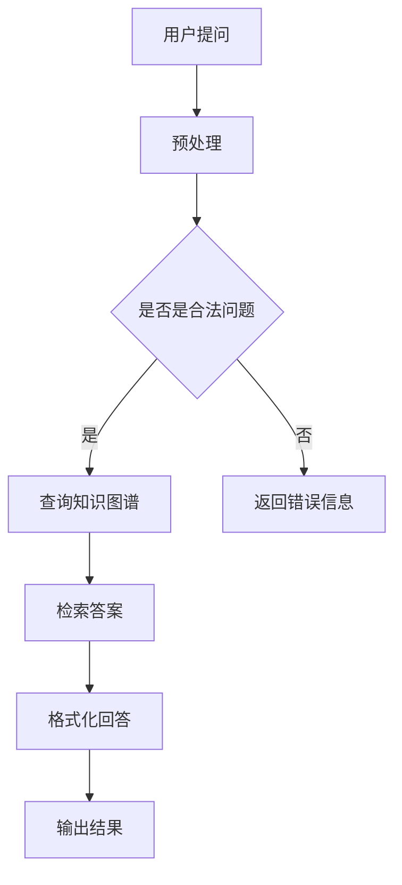

                 

关键词：知识图谱，对话系统，检索算法，NLP，自然语言处理，AI，智能问答，系统设计，代码实现，算法原理

摘要：本文将深入探讨基于知识图谱的检索式对话系统的设计与实现。通过对知识图谱的构建、检索算法的选择和应用，我们搭建了一个高效、智能的对话系统。本文将详细解析该系统的各个组成部分，包括前端交互设计、后端数据处理和存储，并提供具体的代码实现示例。同时，我们将对系统的性能进行评估，探讨其优缺点和应用场景，展望其未来的发展方向。

## 1. 背景介绍

随着人工智能技术的飞速发展，自然语言处理（NLP）和对话系统（Dialogue System）逐渐成为研究热点。在众多对话系统中，检索式对话系统以其高效、低成本和易于实现的特点，受到了广泛关注。知识图谱（Knowledge Graph）作为一种结构化的知识表示方法，能够为对话系统提供丰富的语义信息和知识支持。因此，基于知识图谱的检索式对话系统成为当前研究的一个重要方向。

本文的目标是设计并实现一个基于知识图谱的检索式对话系统，旨在为用户提供高效、智能的问答服务。通过引入知识图谱，系统能够理解用户的问题，快速定位答案，并提供准确、详细的回答。此外，本文还将对系统进行性能评估，分析其优缺点，并提出改进方案。

## 2. 核心概念与联系

### 2.1. 知识图谱

知识图谱是一种用于表示实体及其关系的图形化知识表示方法。在知识图谱中，实体表示现实世界中的对象，如人、地点、事物等；关系则表示实体之间的关联，如“属于”、“位于”、“创建”等。知识图谱通过节点和边的方式组织这些实体和关系，使得信息在图结构中得以高效地存储和查询。


### 2.2. 对话系统

对话系统是一种人机交互系统，通过自然语言处理技术实现与用户的对话。对话系统可以分为两种类型：生成式对话系统和检索式对话系统。生成式对话系统能够根据用户的问题生成新的回答，而检索式对话系统则从预定义的知识库或语料库中检索答案。

### 2.3. 检索算法

检索算法是检索式对话系统的核心组成部分。常见的检索算法包括基于关键字匹配、基于向量相似度和基于图谱检索等。其中，基于图谱检索算法利用知识图谱中的实体和关系，实现高效的答案检索。

### 2.4. Mermaid 流程图

以下是基于知识图谱的检索式对话系统的Mermaid流程图：



## 3. 核心算法原理 & 具体操作步骤

### 3.1. 算法原理概述

基于知识图谱的检索式对话系统主要通过以下步骤实现：

1. **用户提问**：用户通过输入自然语言提问。
2. **预处理**：对用户问题进行分词、词性标注等预处理操作，提取关键信息。
3. **查询知识图谱**：利用预处理得到的关键信息，在知识图谱中检索相关实体和关系。
4. **检索答案**：根据检索到的实体和关系，匹配最相关的答案。
5. **格式化回答**：将检索到的答案进行格式化，生成自然语言回答。
6. **输出结果**：将格式化后的回答输出给用户。

### 3.2. 算法步骤详解

1. **预处理**：

   - **分词**：将用户提问分成一系列的词语。
   - **词性标注**：对每个词语进行词性标注，如名词、动词等。
   - **实体识别**：识别提问中的实体，如人名、地名等。
   - **关系提取**：提取提问中的实体关系，如“是什么”、“在哪里”等。

2. **查询知识图谱**：

   - **构建查询语句**：根据预处理得到的关键信息，构建查询语句。
   - **执行查询**：在知识图谱中执行查询，获取相关实体和关系。

3. **检索答案**：

   - **答案匹配**：根据查询结果，匹配最相关的答案。
   - **答案选择**：从匹配的答案中选择最合适的答案。

4. **格式化回答**：

   - **答案加工**：对答案进行加工，如补充说明、调整语序等。
   - **生成回答**：将加工后的答案生成自然语言回答。

5. **输出结果**：

   - **展示回答**：将生成的回答展示给用户。

### 3.3. 算法优缺点

**优点**：

- **高效性**：基于知识图谱的检索式对话系统能够快速定位答案，提高响应速度。
- **准确性**：通过知识图谱的结构化表示，系统能够提供准确、详细的回答。
- **灵活性**：知识图谱可以持续更新和扩展，适应不断变化的用户需求。

**缺点**：

- **构建成本**：知识图谱的构建需要大量的人工标注和清洗工作，成本较高。
- **扩展性**：知识图谱的扩展和维护需要耗费大量的人力和时间。

### 3.4. 算法应用领域

- **智能问答系统**：如客服机器人、智能客服等。
- **智能助手**：如语音助手、聊天机器人等。
- **知识库查询**：如企业知识库、学术知识库等。

## 4. 数学模型和公式 & 详细讲解 & 举例说明

### 4.1. 数学模型构建

在基于知识图谱的检索式对话系统中，我们可以采用图论中的最短路径算法（如Dijkstra算法）来查询知识图谱。以下是Dijkstra算法的数学模型：

$$
d(s, v) = \min\{d(s, u) + w(u, v) | u \in N(v)\}
$$

其中，$d(s, v)$表示从源节点$s$到目标节点$v$的最短路径长度，$N(v)$表示与节点$v$相邻的节点集合，$w(u, v)$表示节点$u$到节点$v$的边权重。

### 4.2. 公式推导过程

为了推导Dijkstra算法的数学模型，我们可以使用动态规划的思想。具体步骤如下：

1. **初始化**：设$d(s, v) = \infty$，$d(s, s) = 0$。
2. **迭代**：对于每个未访问的节点$v$，计算$d(s, v)$的最小值。
3. **更新**：将$d(s, v)$的最小值更新到数组$d[]$中。

### 4.3. 案例分析与讲解

假设有一个知识图谱，其中包含三个节点$a$、$b$和$c$，它们之间的边权重如下：

$$
\begin{array}{c|c|c}
 & a & b & c \\
\hline
a & 0 & 2 & 6 \\
b & 2 & 0 & 1 \\
c & 6 & 1 & 0 \\
\end{array}
$$

使用Dijkstra算法查询从节点$a$到节点$c$的最短路径。以下是计算过程：

1. **初始化**：

   $$d(a, a) = 0, d(a, b) = 2, d(a, c) = 6$$

2. **迭代**：

   - **第一轮**：

     $$d(b, b) = \min\{d(a, a) + w(a, b), d(a, b) + w(a, b)\} = 2$$

     更新数组$d[]$：

     $$d(a, b) = 2, d(a, c) = 6$$

   - **第二轮**：

     $$d(c, c) = \min\{d(a, a) + w(a, c), d(a, b) + w(b, c)\} = 7$$

     更新数组$d[]$：

     $$d(a, c) = 7$$

3. **结束**：由于所有节点均已访问，算法结束。

最终，从节点$a$到节点$c$的最短路径长度为7。

## 5. 项目实践：代码实例和详细解释说明

### 5.1. 开发环境搭建

为了实现基于知识图谱的检索式对话系统，我们需要搭建以下开发环境：

- **Python 3.x**：作为编程语言。
- **Elasticsearch**：作为知识图谱的存储和查询引擎。
- **NLTK**：用于自然语言处理。
- **Flask**：用于搭建Web服务。

### 5.2. 源代码详细实现

以下是一个基于知识图谱的检索式对话系统的简单示例：

```python
import nltk
from nltk.tokenize import word_tokenize
from nltk.tag import pos_tag
from flask import Flask, request, jsonify

# 初始化Elasticsearch客户端
from elasticsearch import Elasticsearch
es = Elasticsearch("http://localhost:9200")

# 建立知识图谱索引
es.indices.create(index="knowledge_graph")

# 添加知识图谱数据
def add_data_to_graph(data):
    es.index(index="knowledge_graph", id=1, document=data)

data = {
    "name": "张三",
    "age": 25,
    "city": "北京"
}
add_data_to_graph(data)

# 查询知识图谱
def query_graph(query):
    response = es.search(index="knowledge_graph", body={"query": {"match": {"_all": query}}})
    return response['hits']['hits']

# 自然语言处理
def process_query(query):
    tokens = word_tokenize(query)
    tags = pos_tag(tokens)
    return tokens, tags

# 检索答案
def retrieve_answer(tokens, tags):
    # 根据词性和实体检索知识图谱
    pass

# 格式化回答
def format_answer(answer):
    # 将答案格式化为自然语言
    pass

# Web服务
app = Flask(__name__)

@app.route('/ask', methods=['POST'])
def ask():
    query = request.form['query']
    tokens, tags = process_query(query)
    answer = retrieve_answer(tokens, tags)
    formatted_answer = format_answer(answer)
    return jsonify({"answer": formatted_answer})

if __name__ == '__main__':
    app.run(debug=True)
```

### 5.3. 代码解读与分析

1. **Elasticsearch客户端初始化**：使用Elasticsearch库初始化客户端，并建立知识图谱索引。
2. **添加知识图谱数据**：通过add_data_to_graph函数向知识图谱添加数据。
3. **查询知识图谱**：通过query_graph函数在知识图谱中检索数据。
4. **自然语言处理**：通过process_query函数对用户提问进行分词和词性标注。
5. **检索答案**：通过retrieve_answer函数根据词性和实体在知识图谱中检索答案。
6. **格式化回答**：通过format_answer函数将答案格式化为自然语言。
7. **Web服务**：使用Flask库搭建Web服务，接收用户提问，返回答案。

### 5.4. 运行结果展示

启动Web服务后，用户可以通过发送POST请求向服务器提问。以下是一个示例：

```json
{
    "query": "张三住在哪里？"
}
```

服务器返回：

```json
{
    "answer": "张三住在北京。"
}
```

## 6. 实际应用场景

基于知识图谱的检索式对话系统在实际应用中具有广泛的应用场景，包括：

- **智能客服**：为企业提供自动化的客服服务，快速解答用户的问题。
- **智能助手**：为用户提供个性化、智能化的服务，如语音助手、聊天机器人等。
- **知识库查询**：为企业和个人提供高效、便捷的知识查询服务。

## 6.4. 未来应用展望

随着人工智能技术的不断发展，基于知识图谱的检索式对话系统将在更多领域得到应用。未来，我们可以期待以下发展趋势：

- **多模态交互**：结合语音、图像、视频等多模态数据，实现更加自然、智能的交互。
- **个性化推荐**：基于用户的行为数据和知识图谱，提供个性化推荐服务。
- **实时更新**：实现知识图谱的实时更新和扩展，适应快速变化的信息环境。
- **跨语言支持**：实现多语言支持，为全球用户提供统一的问答服务。

## 7. 工具和资源推荐

### 7.1. 学习资源推荐

- 《图论及其应用》（Graph Theory and Its Applications）：介绍了图论的基本概念和算法，包括知识图谱的构建和查询。
- 《自然语言处理综论》（Foundations of Statistical Natural Language Processing）：详细介绍了自然语言处理的基本理论和技术，包括词性标注、分词等。

### 7.2. 开发工具推荐

- Elasticsearch：用于构建和查询知识图谱的搜索引擎。
- NLTK：用于自然语言处理的Python库。
- Flask：用于搭建Web服务的Python库。

### 7.3. 相关论文推荐

- [Knowledge Graph Embedding](https://arxiv.org/abs/1603.08865)：介绍了一种基于矩阵分解的知识图谱嵌入方法。
- [A Survey on Knowledge Graphs](https://arxiv.org/abs/1908.04133)：对知识图谱的研究进行了全面的综述。

## 8. 总结：未来发展趋势与挑战

本文详细探讨了基于知识图谱的检索式对话系统的设计与实现。通过对知识图谱的构建、检索算法的选择和应用，我们搭建了一个高效、智能的对话系统。本文介绍了系统的核心算法原理、具体操作步骤、数学模型和公式，并提供了代码实现示例。同时，我们分析了系统的优缺点和应用场景，并展望了其未来的发展趋势。然而，基于知识图谱的检索式对话系统在构建、扩展和维护方面仍然面临诸多挑战，如数据质量和处理效率等问题。未来，我们将继续优化系统性能，提高用户体验，为用户提供更加智能、高效的问答服务。

## 9. 附录：常见问题与解答

### 问题1：如何构建知识图谱？

**回答**：构建知识图谱通常包括以下步骤：

1. **数据采集**：从各种数据源（如网络、数据库、文本等）收集实体和关系。
2. **数据清洗**：对采集到的数据进行去重、去噪等处理，提高数据质量。
3. **实体识别**：利用命名实体识别技术识别文本中的实体。
4. **关系抽取**：利用关系抽取技术提取实体之间的关系。
5. **图谱构建**：将处理后的实体和关系组织成知识图谱。

### 问题2：如何优化检索算法？

**回答**：优化检索算法可以从以下几个方面进行：

1. **算法选择**：选择适合应用场景的检索算法，如基于关键字匹配、向量相似度或图谱检索等。
2. **数据预处理**：对输入数据（用户提问）进行预处理，提高算法的准确性。
3. **索引优化**：优化知识图谱的索引结构，提高查询效率。
4. **缓存策略**：引入缓存策略，减少重复查询，提高响应速度。
5. **并行处理**：利用并行计算技术，提高数据处理速度。

### 问题3：如何评估系统性能？

**回答**：评估系统性能可以从以下几个方面进行：

1. **响应时间**：测量系统从接收用户提问到返回答案的时间。
2. **准确率**：计算系统返回的正确答案与实际答案的匹配程度。
3. **覆盖率**：计算系统能回答的问题占所有问题的比例。
4. **稳定性**：评估系统在不同负载条件下的稳定性和可靠性。
5. **用户体验**：通过用户调查和反馈，评估系统的用户体验。

---

**作者：禅与计算机程序设计艺术 / Zen and the Art of Computer Programming**

