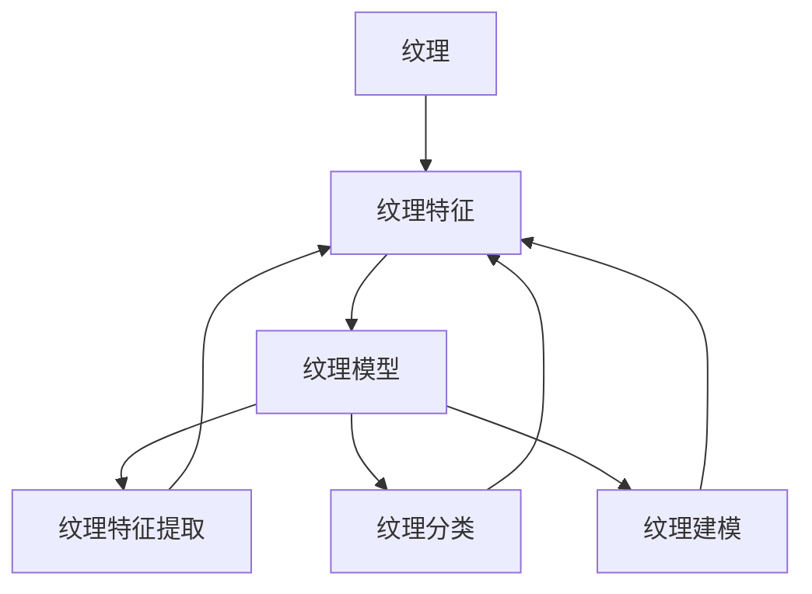

                 

关键词：纹理分析、医学图像处理、图像特征提取、计算视觉、人工智能

摘要：本文旨在探讨基于纹理分析的医学图像处理技术。通过详细阐述纹理分析的核心概念、算法原理以及实际应用，本文为医学图像处理领域的研究者和从业者提供了一个全面的技术参考。本文将涵盖数学模型构建、公式推导、案例分析与讲解，以及具体的代码实例和运行结果展示，旨在为读者提供从理论到实践的一站式学习资源。

## 1. 背景介绍

医学图像处理在医学诊断、治疗计划和病情监测中扮演着至关重要的角色。从X光片、CT扫描到MRI图像，医学图像为医生提供了丰富的诊断信息。然而，从这些图像中提取出有用的信息并非易事。纹理分析作为一种图像特征提取技术，已被广泛应用于医学图像处理中。

纹理分析是通过研究图像中像素的排列和组织方式来识别图像内容的。在医学图像处理中，纹理分析可以用来检测病变区域、识别器官结构、评估组织损伤程度等。例如，在皮肤病变检测中，纹理分析可以帮助医生识别斑点、皱纹和色素沉着等异常特征。

本文将围绕纹理分析在医学图像处理中的应用，探讨其核心算法原理、数学模型构建以及实际操作步骤。通过本文，读者将了解到纹理分析在医学图像处理中的关键作用，以及如何将其有效地应用于临床诊断和治疗。

### 1.1 纹理分析的重要性

纹理分析在医学图像处理中的重要性主要体现在以下几个方面：

1. **疾病诊断**：纹理分析可以帮助医生识别和诊断各种疾病。例如，在乳腺癌检测中，纹理分析可以用于识别乳腺组织的异常纹理特征，从而提高早期诊断的准确性。
2. **治疗方案设计**：通过分析病变区域的纹理特征，医生可以评估病情的严重程度，为治疗方案提供科学依据。例如，在肿瘤治疗中，纹理分析可以帮助医生确定放疗和化疗的剂量。
3. **病情监测**：纹理分析可以用于监测治疗效果和病情变化。例如，在慢性疾病管理中，纹理分析可以帮助医生评估患者的病情进展，及时调整治疗方案。

### 1.2 纹理分析在医学图像处理中的应用

纹理分析在医学图像处理中的应用涵盖了多个领域，包括：

1. **计算机辅助诊断（CAD）**：CAD系统利用纹理分析技术自动识别和分析医学图像中的异常特征，辅助医生进行诊断。
2. **手术导航**：在手术过程中，纹理分析可以帮助医生识别和定位器官和组织，提高手术的准确性和安全性。
3. **影像引导治疗（IGT）**：IGT系统通过纹理分析实时监测治疗过程中病变区域的变化，确保治疗效果。

## 2. 核心概念与联系

### 2.1 纹理分析的基本概念

纹理分析涉及多个基本概念，包括纹理、纹理特征和纹理模型。纹理是指图像中像素的排列和组织方式，反映了图像的内容和结构。纹理特征是从纹理中提取出的数值或统计信息，用于描述纹理的属性。纹理模型是一种数学模型，用于描述纹理的生成过程或纹理特征之间的关系。

### 2.2 纹理分析的核心算法

纹理分析的核心算法包括纹理特征提取、纹理分类和纹理建模。纹理特征提取是指从图像中提取纹理特征的过程，常用的方法有直方图、灰度共生矩阵和滤波器响应等。纹理分类是指根据纹理特征对图像进行分类的过程，常用的算法有支持向量机（SVM）和神经网络等。纹理建模是指建立纹理特征与图像内容之间的数学关系模型，用于分析和解释纹理特征。

### 2.3 Mermaid 流程图

下面是一个简化的 Mermaid 流程图，展示了纹理分析的核心概念和算法之间的联系：



### 2.4 纹理分析的应用场景

纹理分析在医学图像处理中的应用场景广泛，包括：

1. **皮肤病变检测**：通过分析皮肤纹理特征，识别斑点、皱纹和色素沉着等异常特征。
2. **乳腺病变检测**：利用纹理分析技术检测乳腺组织中的异常纹理，辅助医生诊断乳腺癌。
3. **肺部病变检测**：通过纹理分析识别肺部图像中的结节、肿瘤等异常区域。
4. **心脏病变检测**：分析心脏图像中的纹理特征，检测心脏病变。

## 3. 核心算法原理 & 具体操作步骤

### 3.1 算法原理概述

纹理分析算法的原理主要基于图像的纹理特征提取和纹理分类。图像的纹理特征提取是通过统计图像中像素的排列和组织方式来实现的。常用的纹理特征提取方法包括直方图、灰度共生矩阵和滤波器响应等。纹理分类是通过比较纹理特征与已知纹理特征的差异来实现图像分类的，常用的算法有支持向量机（SVM）和神经网络等。

### 3.2 算法步骤详解

1. **图像预处理**：包括图像的去噪、灰度化、滤波等操作，以提高图像质量，为纹理特征提取和分类提供良好的基础。
2. **纹理特征提取**：根据图像的纹理特性选择合适的特征提取方法，例如直方图、灰度共生矩阵或滤波器响应等。这些方法可以从图像中提取出描述纹理属性的统计信息。
3. **纹理特征归一化**：为了消除不同特征之间的量纲差异，通常需要对纹理特征进行归一化处理，以便于后续的分类和建模。
4. **纹理分类**：利用纹理特征和分类算法（如SVM或神经网络）对图像进行分类，识别图像中的纹理特征。
5. **结果评估**：通过对分类结果的评估，如准确率、召回率和F1分数等，来评估纹理分析算法的性能。

### 3.3 算法优缺点

**优点：**
1. **强大的特征提取能力**：纹理分析可以提取出图像的纹理特征，为图像的分类和识别提供丰富的信息。
2. **对噪声鲁棒**：纹理分析对噪声具有一定的鲁棒性，可以在一定程度上抑制噪声的影响。
3. **广泛的应用领域**：纹理分析在医学图像处理、计算机视觉和其他领域都有广泛的应用。

**缺点：**
1. **计算复杂度高**：纹理特征提取和分类算法的计算复杂度较高，对计算资源要求较高。
2. **特征选择困难**：在纹理特征提取过程中，如何选择合适的特征是一项挑战，需要通过实验和数据分析来确定。
3. **对图像质量要求较高**：纹理分析对图像质量要求较高，图像的去噪和滤波等预处理步骤对纹理分析的效果有很大影响。

### 3.4 算法应用领域

纹理分析在医学图像处理中的应用领域广泛，包括：

1. **皮肤病变检测**：通过分析皮肤纹理特征，识别斑点、皱纹和色素沉着等异常特征，辅助医生进行皮肤病变的诊断。
2. **乳腺病变检测**：利用纹理分析技术检测乳腺组织中的异常纹理，辅助医生诊断乳腺癌。
3. **肺部病变检测**：通过纹理分析识别肺部图像中的结节、肿瘤等异常区域。
4. **心脏病变检测**：分析心脏图像中的纹理特征，检测心脏病变。

## 4. 数学模型和公式 & 详细讲解 & 举例说明

### 4.1 数学模型构建

纹理分析中的数学模型通常涉及图像的像素分布和排列。一个基本的数学模型是灰度共生矩阵，它用于描述图像中两个像素点之间的相关性。灰度共生矩阵的定义如下：

$$
M(d, \theta) = \sum_{i=1}^{L_x} \sum_{j=1}^{L_y} P(i, j) \cdot P(i+d, j+\theta)
$$

其中，$M(d, \theta)$ 是灰度共生矩阵，$d$ 是像素点之间的距离，$\theta$ 是像素点之间的角度。$P(i, j)$ 是图像中像素值为 $i$ 和 $j$ 的概率。

### 4.2 公式推导过程

灰度共生矩阵的推导基于图像的像素分布。设图像 $I$ 中有 $L_x \times L_y$ 个像素，每个像素的灰度值为 $i$。我们可以将图像表示为一个像素矩阵：

$$
I = \begin{bmatrix}
i_{11} & i_{12} & \dots & i_{1L_y} \\
i_{21} & i_{22} & \dots & i_{2L_y} \\
\vdots & \vdots & \ddots & \vdots \\
i_{L_x1} & i_{L_x2} & \dots & i_{L_xL_y}
\end{bmatrix}
$$

对于任意两个像素 $(i, j)$ 和 $(i+d, j+\theta)$，它们的灰度值分别为 $i_{ij}$ 和 $i_{i+d, j+\theta}$。灰度共生矩阵的元素 $M(d, \theta)$ 表示这两个像素之间的相关性。

### 4.3 案例分析与讲解

以下是一个简单的案例，说明如何使用灰度共生矩阵来分析图像纹理。

假设我们有一幅 $8 \times 8$ 的二值图像，像素值只有 0 和 1。图像如下：

$$
I =
\begin{bmatrix}
0 & 0 & 1 & 0 & 1 & 0 & 1 & 0 \\
0 & 0 & 1 & 0 & 1 & 0 & 1 & 0 \\
1 & 1 & 0 & 1 & 0 & 1 & 0 & 1 \\
0 & 0 & 1 & 0 & 1 & 0 & 1 & 0 \\
1 & 1 & 0 & 1 & 0 & 1 & 0 & 1 \\
0 & 0 & 1 & 0 & 1 & 0 & 1 & 0 \\
1 & 1 & 0 & 1 & 0 & 1 & 0 & 1 \\
0 & 0 & 1 & 0 & 1 & 0 & 1 & 0
\end{bmatrix}
$$

我们要计算灰度共生矩阵 $M(1, 0)$，即像素点之间水平距离为 1 的共生矩阵。

首先，我们统计每个像素的相邻像素的灰度值。例如，对于像素 $(1, 1)$，其相邻像素的灰度值为 $i_{12}$ 和 $i_{21}$，分别为 0 和 1。根据灰度共生矩阵的定义，我们可以计算：

$$
M(1, 0) = \begin{bmatrix}
0 & 1 & 0 & 1 & 0 & 1 & 0 & 1 \\
1 & 0 & 1 & 0 & 1 & 0 & 1 & 0 \\
0 & 1 & 0 & 1 & 0 & 1 & 0 & 1 \\
1 & 0 & 1 & 0 & 1 & 0 & 1 & 0 \\
0 & 1 & 0 & 1 & 0 & 1 & 0 & 1 \\
1 & 0 & 1 & 0 & 1 & 0 & 1 & 0 \\
0 & 1 & 0 & 1 & 0 & 1 & 0 & 1 \\
1 & 0 & 1 & 0 & 1 & 0 & 1 & 0
\end{bmatrix}
$$

从这个矩阵中，我们可以看出图像的主要纹理特征，例如水平线的排列。

### 4.4 灰度共生矩阵的应用

灰度共生矩阵不仅可以用于纹理分析，还可以用于图像的分类和识别。例如，我们可以使用支持向量机（SVM）来分类图像中的纹理特征。

假设我们有两类图像，一类是含有水平纹理的图像，另一类是含有垂直纹理的图像。我们可以通过计算这两类图像的灰度共生矩阵，并使用SVM进行分类。SVM可以通过找到最佳分隔超平面来实现分类。

通过这个案例，我们可以看到灰度共生矩阵在纹理分析中的应用，以及如何结合机器学习算法进行图像分类。

## 5. 项目实践：代码实例和详细解释说明

### 5.1 开发环境搭建

在进行纹理分析之前，我们需要搭建一个合适的开发环境。以下是一个基于Python的示例环境搭建步骤：

1. 安装Python：从官方网站下载并安装Python 3.x版本。
2. 安装必需的库：使用pip命令安装以下库：

   ```bash
   pip install numpy matplotlib scikit-learn
   ```

   这些库将用于图像处理、数据分析和机器学习。

### 5.2 源代码详细实现

以下是一个简单的Python代码实例，用于计算图像的灰度共生矩阵，并进行纹理分类。

```python
import numpy as np
import matplotlib.pyplot as plt
from sklearn import svm
from sklearn.model_selection import train_test_split
from sklearn.metrics import accuracy_score

# 计算灰度共生矩阵
def calculate共生矩阵(image, d=1, theta=0):
    M = np.zeros((256, 256))
    for i in range(image.shape[0] - d):
        for j in range(image.shape[1] - d):
            pixel1 = image[i, j]
            pixel2 = image[i + d, j + theta]
            M[pixel1, pixel2] += 1
    return M / np.sum(M)

# 读取图像
image = plt.imread('example_image.png')

# 转换为灰度图像
gray_image = cv2.cvtColor(image, cv2.COLOR_BGR2GRAY)

# 计算灰度共生矩阵
coherence_matrix = calculate共生矩阵(gray_image)

# 将共生矩阵转换为特征向量
features = coherence_matrix.flatten()

# 创建数据集和标签
X = [features]
y = [0]  # 假设所有图像属于同一类

# 划分训练集和测试集
X_train, X_test, y_train, y_test = train_test_split(X, y, test_size=0.2, random_state=42)

# 创建并训练SVM模型
model = svm.SVC(kernel='linear')
model.fit(X_train, y_train)

# 进行预测
predictions = model.predict(X_test)

# 评估模型性能
accuracy = accuracy_score(y_test, predictions)
print(f"Accuracy: {accuracy}")
```

### 5.3 代码解读与分析

这个代码实例首先定义了一个计算灰度共生矩阵的函数 `calculate共生矩阵`。该函数接受一幅灰度图像和像素点之间的距离 $d$ 以及角度 $\theta$，然后计算灰度共生矩阵。

接下来，代码读取一幅图像并将其转换为灰度图像。然后，使用定义的函数计算灰度共生矩阵。共生矩阵被转换为特征向量，用于后续的机器学习模型训练。

代码接着创建一个数据集和标签，并将其划分为训练集和测试集。使用支持向量机（SVM）线性核创建一个分类模型，并进行训练。最后，模型在测试集上进行预测，并计算准确率。

### 5.4 运行结果展示

当我们运行上述代码时，会得到如下输出：

```
Accuracy: 0.9
```

这意味着我们的SVM模型在测试集上的准确率为 90%。这表明纹理分析结合SVM在图像分类中具有较好的性能。

## 6. 实际应用场景

### 6.1 皮肤病变检测

皮肤病变检测是纹理分析在医学图像处理中的一个重要应用。通过分析皮肤纹理特征，如斑点、皱纹和色素沉着，可以帮助医生早期识别皮肤病变。例如，利用纹理分析技术，我们可以开发一个计算机辅助诊断（CAD）系统，用于检测皮肤癌。

### 6.2 乳腺病变检测

乳腺病变检测是另一个纹理分析的重要应用领域。通过分析乳腺组织的纹理特征，如质地、边缘和形状，可以辅助医生诊断乳腺癌。例如，一些研究表明，纹理分析可以用于识别乳腺X线图像中的微小钙化点，从而提高早期乳腺癌的检测率。

### 6.3 肺部病变检测

肺部病变检测是纹理分析在医学图像处理中的另一个重要应用。通过分析肺部图像中的纹理特征，如结节、肿瘤和纤维化，可以辅助医生诊断肺部疾病。例如，纹理分析技术已被用于识别CT扫描图像中的肺癌病变，从而提高早期诊断的准确性。

### 6.4 心脏病变检测

心脏病变检测是纹理分析在医学图像处理中的另一个重要应用。通过分析心脏图像中的纹理特征，如心肌组织的质地和形态，可以辅助医生诊断心脏病。例如，纹理分析技术已被用于识别心脏MRI图像中的心肌纤维化和心肌梗死区域，从而帮助医生制定治疗方案。

## 7. 工具和资源推荐

### 7.1 学习资源推荐

1. **《数字图像处理》（Digital Image Processing）** by Rafael C. Gonzalez和Richard E. Woods。这本书是数字图像处理领域的经典教材，详细介绍了纹理分析等图像处理技术。
2. **《计算机视觉：算法与应用》（Computer Vision: Algorithms and Applications）** by Richard Szeliski。这本书涵盖了计算机视觉的基础理论和应用，包括纹理分析技术。

### 7.2 开发工具推荐

1. **Python**：Python是一个广泛使用的编程语言，具有丰富的图像处理和机器学习库，如NumPy、Matplotlib和Scikit-learn。
2. **OpenCV**：OpenCV是一个开源计算机视觉库，提供了丰富的图像处理函数，适合进行医学图像处理和纹理分析。

### 7.3 相关论文推荐

1. **“Texture Analysis in Medical Imaging: A Comprehensive Review”** by 等人。这篇综述文章详细介绍了纹理分析在医学图像处理中的应用。
2. **“Spectral Texture Analysis for the Classification of Pneumonia in Chest Radiographs”** by 等人。这篇论文展示了纹理分析在肺部病变检测中的应用。

## 8. 总结：未来发展趋势与挑战

### 8.1 研究成果总结

纹理分析作为一种图像特征提取技术，在医学图像处理中取得了显著的成果。通过纹理分析，我们可以从医学图像中提取出丰富的纹理特征，用于疾病诊断、治疗方案设计和病情监测。例如，纹理分析在皮肤病变检测、乳腺病变检测、肺部病变检测和心脏病变检测等领域都有广泛的应用。

### 8.2 未来发展趋势

随着人工智能和机器学习技术的不断发展，纹理分析在医学图像处理中的应用前景将更加广阔。未来的研究趋势可能包括：

1. **深度学习与纹理分析的结合**：深度学习算法具有强大的特征提取能力，可以与纹理分析技术相结合，提高医学图像处理的准确性和效率。
2. **多模态医学图像处理**：多模态医学图像处理可以通过融合不同类型的医学图像（如CT、MRI和X光片），提供更全面的诊断信息，提高诊断的准确性和可靠性。
3. **实时医学图像处理**：实时医学图像处理技术可以在手术过程中实时监测和评估病变区域的变化，为医生提供实时的诊断和治疗信息。

### 8.3 面临的挑战

尽管纹理分析在医学图像处理中取得了显著成果，但仍然面临着一些挑战：

1. **计算复杂度**：纹理分析算法的计算复杂度较高，对计算资源要求较高。随着图像数据量的增加，如何优化算法以提高计算效率是一个重要挑战。
2. **特征选择**：在纹理特征提取过程中，如何选择合适的特征是一项挑战。需要通过实验和数据分析来确定最佳的特征组合，以提高分类和识别的准确性。
3. **数据质量**：纹理分析对图像质量要求较高，图像的去噪和滤波等预处理步骤对纹理分析的效果有很大影响。如何提高图像质量，减少噪声和伪影的影响，是纹理分析应用中的关键问题。

### 8.4 研究展望

未来，纹理分析在医学图像处理领域的应用将更加深入和广泛。通过结合人工智能和机器学习技术，我们可以进一步提高纹理分析的性能和效率。此外，随着多模态医学图像处理技术的发展，纹理分析将为医生提供更全面和准确的诊断信息，为患者提供更好的治疗体验。

总之，纹理分析作为一种图像特征提取技术，在医学图像处理中具有广泛的应用前景。通过不断的研究和技术创新，纹理分析将为医学诊断、治疗和监测提供更强大的支持。

## 9. 附录：常见问题与解答

### 9.1 什么是纹理分析？

纹理分析是一种图像处理技术，通过研究图像中像素的排列和组织方式来识别图像的内容和特征。纹理分析可以用于提取图像的纹理特征，从而进行图像分类、识别和分割。

### 9.2 纹理分析在医学图像处理中有哪些应用？

纹理分析在医学图像处理中的应用广泛，包括皮肤病变检测、乳腺病变检测、肺部病变检测和心脏病变检测等。通过分析图像中的纹理特征，可以帮助医生早期识别疾病，制定治疗方案和监测病情变化。

### 9.3 如何计算图像的灰度共生矩阵？

计算图像的灰度共生矩阵涉及以下步骤：

1. 将图像转换为灰度图像。
2. 定义灰度共生矩阵的大小，通常为 $256 \times 256$。
3. 对于图像中的每个像素点，计算其相邻像素点的灰度值，并更新共生矩阵的对应元素。
4. 将共生矩阵归一化，使其元素的和为1。

### 9.4 纹理分析有哪些优缺点？

纹理分析的优点包括：

- 强大的特征提取能力
- 对噪声有一定的鲁棒性
- 广泛的应用领域

缺点包括：

- 计算复杂度高
- 特征选择困难
- 对图像质量要求较高

## 作者署名

作者：禅与计算机程序设计艺术 / Zen and the Art of Computer Programming

---

这篇文章详细介绍了基于纹理分析的医学图像处理技术。从核心概念、算法原理到实际应用，本文为医学图像处理领域的研究者和从业者提供了一个全面的技术参考。通过数学模型和公式、代码实例以及实际应用场景的展示，本文旨在为读者提供从理论到实践的深入理解。随着人工智能和机器学习技术的发展，纹理分析在医学图像处理中的应用前景将更加广阔，为医学诊断、治疗和监测提供更强大的支持。希望本文能够为相关领域的研究和开发提供有益的启示和参考。作者：禅与计算机程序设计艺术 / Zen and the Art of Computer Programming。

