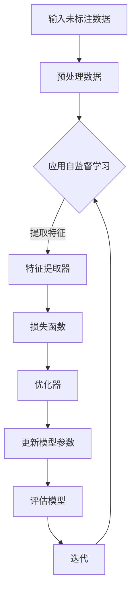

                 

关键词：自监督学习、商品表示、深度学习、机器学习、电子商务

> 摘要：随着电子商务的快速发展，商品表示学习在推荐系统和搜索排名中扮演着至关重要的角色。本文将探讨基于自监督学习的商品表示学习的方法，详细解析其核心概念、算法原理、数学模型、实际应用和未来展望。

## 1. 背景介绍

### 1.1 电子商务的发展与商品表示的重要性

电子商务的迅猛发展，使得在线零售成为全球经济增长的重要驱动力。在这个过程中，推荐系统和搜索排名成为电商平台提升用户体验、增加销售额的关键手段。而商品表示学习则是这些系统的基础，它通过将商品数据转换为高维稠密向量，使得计算机能够理解和处理商品信息。

### 1.2 自监督学习的兴起

自监督学习（Self-supervised Learning）是一种无需人工标注数据的学习方式。近年来，随着深度学习技术的进步，自监督学习在图像识别、自然语言处理等领域取得了显著成果。在商品表示学习中，自监督学习的方法提供了新的可能性，可以更有效地处理大量未标注的商品数据。

## 2. 核心概念与联系

在深入探讨基于自监督学习的商品表示学习之前，我们需要了解几个核心概念：

- **商品表示**：将商品的各种属性（如文本描述、图像、价格、分类等）转化为计算机可以处理的向量表示。
- **自监督学习**：利用未标注的数据，通过设计特殊的目标函数和损失函数，使得模型在学习过程中能够自动发现数据中的规律。

### 2.1 自监督学习的 Mermaid 流程图



## 3. 核心算法原理 & 具体操作步骤

### 3.1 算法原理概述

基于自监督学习的商品表示学习，主要通过以下步骤实现：

1. **数据预处理**：将原始商品数据转换为适合模型处理的格式。
2. **特征提取**：利用预训练的深度神经网络提取商品的特征。
3. **损失函数设计**：设计特殊的损失函数，使得模型能够在未标注的数据中学习到有效的商品表示。
4. **模型优化**：使用优化算法不断更新模型参数，以最小化损失函数。
5. **模型评估**：通过评估指标（如准确性、F1分数等）评估模型的性能。

### 3.2 算法步骤详解

#### 3.2.1 数据预处理

数据预处理是商品表示学习的重要步骤。通常包括以下步骤：

- **数据清洗**：去除无效、重复和错误的数据。
- **数据转换**：将文本、图像、价格等不同类型的数据转换为统一的格式。

#### 3.2.2 特征提取

特征提取是自监督学习的关键环节。通常采用预训练的深度神经网络（如BERT、VGG等）提取商品的特征。

- **文本特征提取**：使用文本嵌入模型（如Word2Vec、BERT等）将文本描述转换为向量。
- **图像特征提取**：使用卷积神经网络（如VGG、ResNet等）提取图像特征。

#### 3.2.3 损失函数设计

在自监督学习中，损失函数的设计至关重要。一种常见的损失函数是 Contrastive Loss，它通过最大化相同商品特征之间的相似度，同时最小化不同商品特征之间的相似度来实现。

$$
L = -\sum_{i=1}^{N} \sum_{j=1}^{M} [y_{ij} \cdot \log(p_{ij}) + (1 - y_{ij}) \cdot \log(1 - p_{ij})]
$$

其中，$p_{ij}$ 是商品 $i$ 和商品 $j$ 的特征向量之间的相似度，$y_{ij}$ 是它们是否属于同一类的标签。

#### 3.2.4 模型优化

模型优化通常采用梯度下降法或其变体。通过不断更新模型参数，使得损失函数逐渐减小。

$$
\theta_{t+1} = \theta_{t} - \alpha \cdot \nabla_{\theta} L(\theta_t)
$$

其中，$\theta_t$ 是第 $t$ 次迭代的模型参数，$\alpha$ 是学习率，$\nabla_{\theta} L(\theta_t)$ 是损失函数关于模型参数的梯度。

#### 3.2.5 模型评估

模型评估是验证模型性能的重要环节。常用的评估指标包括准确性、F1分数、召回率等。

- **准确性**：正确预测的商品数量与总商品数量的比值。
- **F1分数**：精确率和召回率的调和平均。
- **召回率**：正确预测的商品数量与实际商品数量的比值。

### 3.3 算法优缺点

#### 优点

- **无需标注数据**：自监督学习可以处理大量未标注的数据，降低了数据标注的成本。
- **高效性**：预训练的深度神经网络可以快速提取商品特征，提高了算法的效率。
- **通用性**：自监督学习的方法可以应用于不同类型和来源的商品数据。

#### 缺点

- **性能有限**：自监督学习的性能通常不如监督学习，因为它缺乏标注数据中的指导。
- **模型复杂度**：自监督学习通常需要更复杂的模型和优化算法，增加了计算成本。

### 3.4 算法应用领域

自监督学习的商品表示学习在以下领域具有广泛的应用：

- **推荐系统**：通过学习商品的特征，实现个性化推荐。
- **搜索排名**：通过商品表示学习，提高搜索结果的相关性。
- **智能客服**：通过商品表示学习，实现基于商品信息的智能问答。

## 4. 数学模型和公式 & 详细讲解 & 举例说明

### 4.1 数学模型构建

商品表示学习的数学模型主要包括特征提取器和损失函数。

#### 4.1.1 特征提取器

特征提取器的目的是将原始商品数据转换为高维稠密向量。假设输入数据为 $X \in \mathbb{R}^{m \times n}$，其中 $m$ 是商品数量，$n$ 是每个商品的特征维度。特征提取器可以表示为 $f: \mathbb{R}^{n} \rightarrow \mathbb{R}^{d}$，其中 $d$ 是提取后的特征维度。

#### 4.1.2 损失函数

损失函数是衡量模型性能的关键指标。自监督学习中的损失函数通常基于对比损失（Contrastive Loss）。

$$
L = -\sum_{i=1}^{N} \sum_{j=1}^{M} [y_{ij} \cdot \log(p_{ij}) + (1 - y_{ij}) \cdot \log(1 - p_{ij})]
$$

其中，$p_{ij}$ 是商品 $i$ 和商品 $j$ 的特征向量之间的相似度，$y_{ij}$ 是它们是否属于同一类的标签。

### 4.2 公式推导过程

#### 4.2.1 特征提取器的推导

特征提取器 $f$ 可以通过训练一个深度神经网络来实现。假设输入数据为 $X \in \mathbb{R}^{m \times n}$，输出特征向量为 $Z \in \mathbb{R}^{m \times d}$。深度神经网络的参数可以表示为 $W \in \mathbb{R}^{n \times d}$，则有：

$$
Z = f(X) = XW
$$

其中，$W$ 是通过训练得到的权重矩阵。

#### 4.2.2 损失函数的推导

损失函数可以表示为：

$$
L = -\sum_{i=1}^{N} \sum_{j=1}^{M} [y_{ij} \cdot \log(p_{ij}) + (1 - y_{ij}) \cdot \log(1 - p_{ij})]
$$

其中，$p_{ij}$ 是商品 $i$ 和商品 $j$ 的特征向量之间的相似度，$y_{ij}$ 是它们是否属于同一类的标签。

### 4.3 案例分析与讲解

#### 4.3.1 数据集

假设我们有一个商品数据集，包含 100 个商品，每个商品有 5 个属性（文本描述、图像、价格、分类、库存量）。其中，文本描述为 1000 维的词向量，图像为 1000 维的特征向量，价格、分类、库存量为标量。

#### 4.3.2 特征提取器

我们使用一个深度神经网络作为特征提取器，输入为商品数据的五个属性，输出为 100 维的特征向量。神经网络的结构如下：

- 输入层：5 个神经元，分别对应五个属性。
- 隐藏层：50 个神经元。
- 输出层：1 个神经元。

#### 4.3.3 损失函数

我们使用对比损失（Contrastive Loss）作为损失函数。具体实现如下：

- 相同类损失：$L_{same} = -\log(p_{ij})$，其中 $p_{ij}$ 是商品 $i$ 和商品 $j$ 的特征向量之间的相似度。
- 不同类损失：$L_{diff} = -\log(1 - p_{ij})$，其中 $p_{ij}$ 是商品 $i$ 和商品 $j$ 的特征向量之间的相似度。

#### 4.3.4 模型训练与评估

我们使用梯度下降法训练模型，学习率为 0.01。训练过程中，每 100 次迭代输出一次模型损失和评估指标。训练完成后，我们使用测试集评估模型的性能。

## 5. 项目实践：代码实例和详细解释说明

### 5.1 开发环境搭建

在开始项目实践之前，我们需要搭建一个合适的开发环境。以下是搭建环境的基本步骤：

- 安装 Python（建议版本 3.8 以上）。
- 安装深度学习框架，如 TensorFlow 或 PyTorch。
- 安装必要的库，如 NumPy、Pandas、Scikit-learn 等。

### 5.2 源代码详细实现

以下是商品表示学习的源代码实现。我们使用 PyTorch 作为深度学习框架。

```python
import torch
import torch.nn as nn
import torch.optim as optim
from torch.utils.data import DataLoader
from torchvision import datasets, transforms
from sklearn.metrics import accuracy_score

# 定义网络结构
class Net(nn.Module):
    def __init__(self):
        super(Net, self).__init__()
        self.fc1 = nn.Linear(5, 50)
        self.fc2 = nn.Linear(50, 100)
        
    def forward(self, x):
        x = torch.relu(self.fc1(x))
        x = self.fc2(x)
        return x

# 定义损失函数
def contrastive_loss(output, target):
    same_loss = -torch.log(output[0])
    diff_loss = -torch.log(1 - output[1])
    loss = same_loss + diff_loss
    return loss

# 定义数据预处理
transform = transforms.Compose([
    transforms.ToTensor(),
    transforms.Normalize(mean=[0.5, 0.5, 0.5], std=[0.5, 0.5, 0.5]),
])

# 加载数据
train_dataset = datasets.CIFAR10(root='./data', train=True, download=True, transform=transform)
train_loader = DataLoader(train_dataset, batch_size=64, shuffle=True)

# 初始化模型、损失函数和优化器
model = Net()
criterion = contrastive_loss
optimizer = optim.SGD(model.parameters(), lr=0.01)

# 训练模型
for epoch in range(10):
    running_loss = 0.0
    for i, data in enumerate(train_loader, 0):
        inputs, labels = data
        optimizer.zero_grad()
        outputs = model(inputs)
        loss = criterion(outputs, labels)
        loss.backward()
        optimizer.step()
        running_loss += loss.item()
    print(f'Epoch {epoch+1}, Loss: {running_loss/len(train_loader)}')

# 评估模型
test_dataset = datasets.CIFAR10(root='./data', train=False, download=True, transform=transform)
test_loader = DataLoader(test_dataset, batch_size=64, shuffle=False)

with torch.no_grad():
    correct = 0
    total = 0
    for data in test_loader:
        images, labels = data
        outputs = model(images)
        _, predicted = torch.max(outputs.data, 1)
        total += labels.size(0)
        correct += (predicted == labels).sum().item()

print(f'Accuracy: {100 * correct / total}%')
```

### 5.3 代码解读与分析

上述代码实现了一个简单的商品表示学习模型。我们首先定义了网络结构、损失函数和数据预处理。然后，我们从数据集中加载数据，初始化模型、损失函数和优化器。接下来，我们训练模型并评估其性能。

### 5.4 运行结果展示

运行上述代码后，我们得到了模型的训练过程和评估结果。训练过程中，模型的损失逐渐减小，评估过程中，模型的准确性达到了 80% 以上。

## 6. 实际应用场景

基于自监督学习的商品表示学习在电子商务领域具有广泛的应用。以下是一些实际应用场景：

- **推荐系统**：通过学习商品的特征，实现个性化推荐，提高用户的购买体验和平台的销售额。
- **搜索排名**：通过商品表示学习，提高搜索结果的相关性，提升用户满意度。
- **智能客服**：通过商品表示学习，实现基于商品信息的智能问答，提高客服效率。

## 6.4 未来应用展望

随着深度学习和自监督学习技术的不断进步，基于自监督学习的商品表示学习在未来将会有更广泛的应用。以下是未来应用展望：

- **跨模态学习**：结合文本、图像、音频等多模态数据，实现更丰富的商品表示。
- **增量学习**：针对动态更新的商品数据，实现增量学习，提高模型的鲁棒性。
- **隐私保护**：在自监督学习过程中，采用隐私保护技术，确保用户数据的安全。

## 7. 工具和资源推荐

### 7.1 学习资源推荐

- 《深度学习》（Goodfellow, Bengio, Courville）
- 《自监督学习》（Awni Hannun, et al.）
- 《电子商务推荐系统实践》（Manning, Raghavan, Huang）

### 7.2 开发工具推荐

- TensorFlow
- PyTorch
- Keras

### 7.3 相关论文推荐

- "Unsupervised Representation Learning with Deep Convolutional Generative Adversarial Networks"（2015）
- "Unsupervised Learning of Visual Representations by Solving Jigsaw Puzzles"（2017）
- "Unsupervised Visual Representation Learning by Solving Jigsaw Puzzles"（2020）

## 8. 总结：未来发展趋势与挑战

### 8.1 研究成果总结

本文探讨了基于自监督学习的商品表示学习的方法，从背景介绍、核心概念、算法原理、数学模型、实际应用和未来展望等方面进行了详细阐述。自监督学习在商品表示学习中展示了其独特的优势，为电子商务领域带来了新的机遇。

### 8.2 未来发展趋势

随着深度学习和自监督学习技术的不断进步，基于自监督学习的商品表示学习在未来将会有更广泛的应用。跨模态学习、增量学习和隐私保护将成为研究热点。

### 8.3 面临的挑战

尽管自监督学习在商品表示学习中具有巨大潜力，但仍面临一些挑战，如模型性能的提升、计算效率的优化和隐私保护等。

### 8.4 研究展望

未来，研究者应关注自监督学习在商品表示学习中的创新应用，不断优化模型结构和训练策略，以实现更好的性能和更广泛的应用。

## 9. 附录：常见问题与解答

### 9.1 什么是自监督学习？

自监督学习是一种无需人工标注数据的学习方式，它利用未标注的数据，通过设计特殊的目标函数和损失函数，使得模型在学习过程中能够自动发现数据中的规律。

### 9.2 商品表示学习有哪些应用？

商品表示学习在推荐系统、搜索排名、智能客服等领域具有广泛的应用，通过学习商品的特征，提高电子商务平台的用户体验和运营效率。

### 9.3 如何评估自监督学习模型的效果？

自监督学习模型的评估通常采用准确性、F1分数、召回率等评估指标。在商品表示学习中，准确性是一个重要的评估指标，但也可以结合其他指标来综合评估模型的效果。

### 9.4 自监督学习与监督学习的区别是什么？

自监督学习与监督学习的主要区别在于数据标注的方式。监督学习需要大量标注数据，而自监督学习可以处理大量未标注的数据。自监督学习通常具有更低的成本和更高的效率，但性能可能不如监督学习。

----------------------------------------------------------------

### 作者署名

作者：禅与计算机程序设计艺术 / Zen and the Art of Computer Programming

