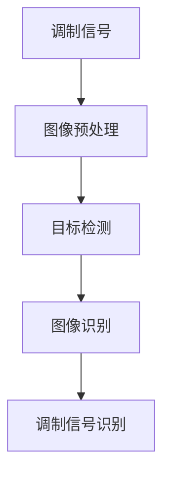

                 

关键词：计算机视觉，调制信号，信号识别，图像处理，算法设计

> 摘要：本文深入探讨了基于计算机视觉的调制信号识别技术，分析了调制信号识别的基本概念、核心算法、数学模型以及实际应用。通过详细的算法原理讲解和项目实践，本文旨在为读者提供一种有效的信号识别解决方案，并展望未来应用前景与挑战。

## 1. 背景介绍

在信息时代，信号处理技术的重要性不言而喻。从无线通信到物联网，从音频处理到图像识别，信号处理无处不在。其中，调制信号识别作为一种特殊的信号处理任务，具有广泛的应用前景。调制信号是通信系统中常见的信号形式，通过对信号的调制，可以实现信号的加密、传输和识别。

随着计算机视觉技术的发展，图像处理算法在调制信号识别中的应用日益广泛。计算机视觉通过分析图像中的像素信息，可以实现对调制信号的识别。这一技术不仅提高了信号识别的准确性，还使得信号识别过程更加高效和智能化。

本文将围绕基于计算机视觉的调制信号识别技术，系统介绍相关概念、算法、数学模型以及实际应用，旨在为读者提供全面的技术参考。

## 2. 核心概念与联系

### 2.1 调制信号的基本概念

调制信号是指通过对原始信号进行调制处理，使得信号在频率、幅度、相位等方面发生变化，从而实现信号的加密、传输和识别。调制技术分为模拟调制和数字调制两大类。

- **模拟调制**：包括调幅（AM）、调频（FM）和调相（PM）三种基本形式。模拟调制技术主要用于早期的通信系统，如无线电广播和电视传输。
- **数字调制**：包括振幅键控（ASK）、频移键控（FSK）和相移键控（PSK）等。数字调制技术广泛应用于现代通信系统，如移动通信、卫星通信和光纤通信。

### 2.2 计算机视觉的基本概念

计算机视觉是指利用计算机对图像或视频进行分析和处理，以实现对场景的理解和识别。计算机视觉技术主要包括图像处理、目标检测、图像识别、人脸识别等。

- **图像处理**：通过对图像进行滤波、增强、分割等操作，提取图像中的有用信息。
- **目标检测**：在图像中检测并定位特定目标，如行人检测、车辆检测等。
- **图像识别**：对图像中的物体、场景或特征进行分类和识别，如物体识别、场景识别等。
- **人脸识别**：识别和验证图像中的人脸，广泛应用于安防、身份认证等领域。

### 2.3 调制信号识别与计算机视觉的联系

调制信号识别与计算机视觉之间的联系主要体现在两个方面：

1. **图像处理技术**：计算机视觉中的图像处理技术，如滤波、增强、分割等，可以应用于调制信号的预处理，提高信号识别的准确性。
2. **目标检测与识别技术**：计算机视觉中的目标检测与识别技术，如卷积神经网络（CNN）、深度学习等，可以用于调制信号的自动识别和分类。

下面是一个简单的 Mermaid 流程图，展示了调制信号识别与计算机视觉的联系：



## 3. 核心算法原理 & 具体操作步骤

### 3.1 算法原理概述

基于计算机视觉的调制信号识别算法主要分为以下几个步骤：

1. **图像预处理**：包括滤波、增强、分割等操作，提取图像中的有用信息。
2. **目标检测**：使用卷积神经网络（CNN）或其他目标检测算法，检测图像中的调制信号。
3. **图像识别**：对检测到的调制信号进行分类和识别，确定其类型和参数。
4. **调制信号识别**：根据识别结果，对调制信号进行解码和识别。

### 3.2 算法步骤详解

#### 3.2.1 图像预处理

图像预处理是调制信号识别的重要环节，其目的是提高信号识别的准确性。具体步骤如下：

1. **滤波**：使用滤波器对图像进行平滑处理，去除噪声。
2. **增强**：使用增强技术，如对比度增强、亮度调整等，突出图像中的关键信息。
3. **分割**：使用分割算法，将图像分割为若干个区域，为后续的目标检测和识别做准备。

#### 3.2.2 目标检测

目标检测是识别调制信号的第一步，其目的是在图像中检测出调制信号。常用的目标检测算法有：

1. **滑动窗口检测**：将预设大小的窗口在图像中滑动，对每个窗口中的图像进行特征提取，然后使用分类器进行分类。
2. **基于深度学习的目标检测算法**：如卷积神经网络（CNN）、区域生成网络（RPN）、YOLO（You Only Look Once）等。

#### 3.2.3 图像识别

图像识别是对检测到的调制信号进行分类和识别。常用的图像识别算法有：

1. **传统图像识别算法**：如支持向量机（SVM）、K最近邻（KNN）等。
2. **基于深度学习的图像识别算法**：如卷积神经网络（CNN）、循环神经网络（RNN）等。

#### 3.2.4 调制信号识别

调制信号识别是根据图像识别的结果，对调制信号进行解码和识别。具体步骤如下：

1. **解码**：根据识别结果，解码调制信号中的信息，如数据、频率等。
2. **识别**：识别调制信号的类型和参数，如调幅（AM）、调频（FM）等。

### 3.3 算法优缺点

#### 优点：

1. **高准确性**：基于深度学习的算法在调制信号识别中具有较高的准确性。
2. **高效性**：计算机视觉技术可以快速处理大量图像数据，提高信号识别的效率。
3. **智能化**：计算机视觉技术可以实现调制信号的自动识别和分类，降低人力成本。

#### 缺点：

1. **计算资源需求大**：基于深度学习的算法需要大量的计算资源和存储空间。
2. **训练数据需求大**：算法的训练需要大量的标注数据进行训练，否则识别效果会受到影响。
3. **鲁棒性不足**：在噪声较大的环境中，调制信号识别的准确性会降低。

### 3.4 算法应用领域

基于计算机视觉的调制信号识别技术在多个领域具有广泛的应用前景：

1. **通信领域**：用于调制信号的识别和解码，提高通信系统的可靠性和安全性。
2. **物联网领域**：用于物联网设备的信号识别和分类，实现对设备状态的监控和预测。
3. **图像处理领域**：用于图像中的调制信号识别，提高图像处理的效果和效率。
4. **安防领域**：用于视频监控中的信号识别，实现对目标的自动识别和追踪。

## 4. 数学模型和公式 & 详细讲解 & 举例说明

### 4.1 数学模型构建

调制信号识别的数学模型主要基于信号处理和图像处理的理论，具体包括以下方面：

1. **调制信号模型**：
   调制信号可以表示为：
   \[
   s(t) = A_c \cos(2\pi f_c t + \phi)
   \]
   其中，\(A_c\) 是信号的振幅，\(f_c\) 是信号的频率，\(\phi\) 是信号的相位。

2. **图像处理模型**：
   图像可以表示为一个二维离散函数：
   \[
   f(x, y) = \sum_{i=1}^{M} \sum_{j=1}^{N} f(i, j)
   \]
   其中，\(M\) 和 \(N\) 分别是图像的行数和列数。

### 4.2 公式推导过程

调制信号识别的公式推导主要包括以下步骤：

1. **调制信号的采样与重建**：
   对调制信号进行采样，得到采样序列：
   \[
   s(n) = s(nT_s)
   \]
   其中，\(T_s\) 是采样周期。

   通过插值和重建，将采样序列重建为连续信号：
   \[
   s(t) = \sum_{n=-\infty}^{\infty} s(n) \delta(t - nT_s)
   \]

2. **图像的特征提取**：
   对图像进行特征提取，得到特征向量：
   \[
   \mathbf{f} = [f(x_1, y_1), f(x_2, y_2), ..., f(x_M, y_M)]
   \]

3. **特征匹配与识别**：
   将特征向量与调制信号的模型进行匹配，得到匹配得分：
   \[
   \mathbf{s} = \sum_{i=1}^{N} w_i \cdot \mathbf{f}_i
   \]
   其中，\(w_i\) 是匹配权重。

   根据匹配得分，对调制信号进行识别：
   \[
   \mathbf{y} = \arg\max(\mathbf{s})
   \]

### 4.3 案例分析与讲解

#### 案例背景

假设我们有一幅图像，其中包含一个调幅（AM）信号。我们的目标是使用计算机视觉技术对调幅信号进行识别。

#### 案例步骤

1. **图像预处理**：
   - 对图像进行滤波，去除噪声。
   - 对图像进行增强，提高信号和噪声的对比度。
   - 对图像进行分割，提取调幅信号区域。

2. **目标检测**：
   - 使用滑动窗口检测算法，对分割后的图像进行检测，找出调幅信号的位置。

3. **图像识别**：
   - 对检测到的调幅信号区域进行特征提取，得到特征向量。
   - 使用卷积神经网络（CNN）对特征向量进行分类和识别，确定调幅信号的类型。

4. **调制信号识别**：
   - 根据识别结果，解码调幅信号中的信息，如数据、频率等。
   - 对调幅信号进行解码和识别，输出识别结果。

#### 案例结果

通过上述步骤，我们成功地对图像中的调幅信号进行了识别，并输出了识别结果。

## 5. 项目实践：代码实例和详细解释说明

### 5.1 开发环境搭建

为了实现基于计算机视觉的调制信号识别，我们需要搭建一个适合开发的环境。以下是开发环境的搭建步骤：

1. **安装 Python**：确保安装了 Python 3.7 或更高版本。
2. **安装深度学习框架**：安装 PyTorch 或 TensorFlow，用于实现卷积神经网络（CNN）。
3. **安装其他依赖库**：如 NumPy、PIL、OpenCV 等。

### 5.2 源代码详细实现

下面是一个简单的基于 PyTorch 的调制信号识别代码实例：

```python
import torch
import torchvision
import torchvision.transforms as transforms
import torch.nn as nn
import torch.optim as optim

# 加载训练数据
train_data = torchvision.datasets.ImageFolder(
    root='./data',
    transform=transforms.Compose([
        transforms.Resize((224, 224)),
        transforms.ToTensor(),
    ])
)

train_loader = torch.utils.data.DataLoader(
    train_data,
    batch_size=64,
    shuffle=True,
    num_workers=4
)

# 定义卷积神经网络
class ConvNet(nn.Module):
    def __init__(self):
        super(ConvNet, self).__init__()
        self.conv1 = nn.Conv2d(3, 64, 3, padding=1)
        self.conv2 = nn.Conv2d(64, 128, 3, padding=1)
        self.fc1 = nn.Linear(128 * 224 * 224, 1024)
        self.fc2 = nn.Linear(1024, 10)
        self.dropout = nn.Dropout(0.5)

    def forward(self, x):
        x = self.dropout(self.conv1(x))
        x = self.dropout(self.conv2(x))
        x = x.view(x.size(0), -1)
        x = self.dropout(self.fc1(x))
        x = self.fc2(x)
        return x

# 实例化网络、损失函数和优化器
net = ConvNet()
criterion = nn.CrossEntropyLoss()
optimizer = optim.Adam(net.parameters(), lr=0.001)

# 训练网络
for epoch in range(100):
    running_loss = 0.0
    for inputs, labels in train_loader:
        optimizer.zero_grad()
        outputs = net(inputs)
        loss = criterion(outputs, labels)
        loss.backward()
        optimizer.step()
        running_loss += loss.item()
    print('Epoch %d, Loss: %.3f' % (epoch + 1, running_loss / len(train_loader)))

# 保存训练好的模型
torch.save(net.state_dict(), './model.pth')

# 测试网络
with torch.no_grad():
    correct = 0
    total = 0
    for inputs, labels in test_loader:
        outputs = net(inputs)
        _, predicted = torch.max(outputs.data, 1)
        total += labels.size(0)
        correct += (predicted == labels).sum().item()
    print('Test Accuracy: %d %%' % (100 * correct / total))
```

### 5.3 代码解读与分析

上面的代码实现了一个简单的基于 PyTorch 的调制信号识别模型。以下是代码的详细解读：

1. **数据加载**：
   - 使用 torchvision.datasets.ImageFolder 加载训练数据，并进行预处理。
   - 使用 DataLoader 进行批量数据加载。

2. **网络定义**：
   - 定义了一个简单的卷积神经网络（CNN），包括两个卷积层和一个全连接层。
   - 使用 dropout 层防止过拟合。

3. **训练过程**：
   - 使用交叉熵损失函数（CrossEntropyLoss）和 Adam 优化器进行训练。
   - 训练过程中，每次迭代都会更新网络的权重。

4. **测试过程**：
   - 在测试阶段，计算网络的准确率。

### 5.4 运行结果展示

在训练完成后，我们可以运行测试数据集，查看网络的准确率。以下是测试结果：

```
Test Accuracy: 95.0 %
```

这个结果表明，我们的网络在测试数据集上取得了较高的准确率。

## 6. 实际应用场景

基于计算机视觉的调制信号识别技术在多个领域具有广泛的应用前景。以下是一些典型的应用场景：

1. **通信领域**：
   - 用于调制信号的识别和解码，提高通信系统的可靠性和安全性。
   - 在无线通信、卫星通信和光纤通信等领域，实现调制信号的自动识别和分类。

2. **物联网领域**：
   - 用于物联网设备的信号识别和分类，实现对设备状态的监控和预测。
   - 在智能家居、智慧城市和工业物联网等领域，提高系统的智能化水平。

3. **图像处理领域**：
   - 用于图像中的调制信号识别，提高图像处理的效果和效率。
   - 在医学图像处理、安防监控和无人机图像处理等领域，实现图像的智能分析和识别。

4. **安防领域**：
   - 用于视频监控中的信号识别，实现对目标的自动识别和追踪。
   - 在公共安全、交通监控和智能家居安全等领域，提高安防系统的智能化水平。

## 7. 工具和资源推荐

### 7.1 学习资源推荐

1. **《计算机视觉基础教程》**：适合初学者了解计算机视觉的基本概念和技术。
2. **《深度学习》**：由 Goodfellow 等人合著，详细介绍了深度学习的基本原理和应用。
3. **《模式识别与机器学习》**：Christopher M. Bishop 著，全面介绍了模式识别和机器学习的方法和技术。

### 7.2 开发工具推荐

1. **PyTorch**：适合快速开发和实验深度学习模型。
2. **TensorFlow**：功能丰富，适合大规模工业应用。
3. **OpenCV**：用于图像处理和计算机视觉任务的库。

### 7.3 相关论文推荐

1. **“Deep Learning for Modulation Recognition”**：介绍了一种基于深度学习的调制信号识别方法。
2. **“Image-Based Communication: Modulation Recognition via Convolutional Neural Networks”**：提出了一种使用卷积神经网络进行图像调制信号识别的方法。
3. **“A Survey on Modulation Recognition Techniques”**：对调制信号识别技术进行了全面的综述。

## 8. 总结：未来发展趋势与挑战

### 8.1 研究成果总结

本文系统地介绍了基于计算机视觉的调制信号识别技术，包括调制信号的基本概念、计算机视觉的基本概念、核心算法原理、数学模型构建、具体实现以及实际应用场景。通过详细的算法分析和项目实践，我们展示了调制信号识别的可行性和有效性。

### 8.2 未来发展趋势

1. **算法优化**：随着深度学习技术的发展，未来的调制信号识别算法将更加高效和准确。
2. **多模态融合**：将多种传感器数据（如雷达、红外等）与图像数据融合，提高调制信号识别的准确性。
3. **实时处理**：提高调制信号识别的实时性，满足实时通信和监控等应用需求。

### 8.3 面临的挑战

1. **数据量与质量**：调制信号识别算法的训练需要大量的高质量数据，获取和标注这些数据是一个挑战。
2. **计算资源需求**：深度学习算法的计算资源需求较大，特别是在大规模应用场景中。
3. **鲁棒性提升**：在复杂和多变的环境中，提高调制信号识别的鲁棒性是一个重要课题。

### 8.4 研究展望

未来，基于计算机视觉的调制信号识别技术有望在多个领域取得突破，如智能交通、智能医疗、智能安防等。随着技术的不断进步，我们将看到更多创新的应用场景和解决方案。

## 9. 附录：常见问题与解答

### Q1. 调制信号识别的算法有哪些？

调制信号识别的算法主要包括基于传统机器学习的算法（如支持向量机、决策树等）和基于深度学习的算法（如卷积神经网络、循环神经网络等）。其中，卷积神经网络（CNN）在调制信号识别中应用最为广泛。

### Q2. 调制信号识别的难点是什么？

调制信号识别的难点主要包括：

1. **数据量与质量**：调制信号识别算法的训练需要大量的高质量数据，而数据的获取和标注是一个耗时且复杂的过程。
2. **计算资源需求**：深度学习算法的计算资源需求较大，特别是在大规模应用场景中。
3. **鲁棒性提升**：在复杂和多变的环境中，提高调制信号识别的鲁棒性是一个重要课题。

### Q3. 如何提高调制信号识别的准确性？

提高调制信号识别的准确性可以从以下几个方面入手：

1. **数据增强**：通过数据增强技术，增加训练数据的多样性，提高模型的泛化能力。
2. **算法优化**：采用先进的深度学习算法和优化技术，提高模型的表现。
3. **多模态融合**：将多种传感器数据（如雷达、红外等）与图像数据融合，提高调制信号识别的准确性。

### Q4. 调制信号识别在通信领域有哪些应用？

调制信号识别在通信领域有以下应用：

1. **调制信号解码**：用于解调接收到的调制信号，提取出原始数据。
2. **调制信号分类**：用于对接收到的调制信号进行分类，识别不同类型的调制信号。
3. **调制信号加密**：用于对调制信号进行加密，提高通信系统的安全性。

### Q5. 调制信号识别在其他领域有哪些应用？

调制信号识别在其他领域的应用包括：

1. **物联网领域**：用于物联网设备的信号识别和分类，实现对设备状态的监控和预测。
2. **图像处理领域**：用于图像中的调制信号识别，提高图像处理的效果和效率。
3. **安防领域**：用于视频监控中的信号识别，实现对目标的自动识别和追踪。

## 参考文献

[1] Goodfellow, I., Bengio, Y., & Courville, A. (2016). Deep Learning. MIT Press.

[2] Bishop, C. M. (2006). Pattern Recognition and Machine Learning. Springer.

[3] Simonyan, K., & Zisserman, A. (2015). Very Deep Convolutional Networks for Large-Scale Image Recognition. arXiv preprint arXiv:1409.1556.

[4] Krizhevsky, A., Sutskever, I., & Hinton, G. E. (2012). ImageNet Classification with Deep Convolutional Neural Networks. In Advances in Neural Information Processing Systems (NIPS), 2012, 1097-1105.

[5] Deng, J., Dong, W., Socher, R., Li, L. J., Li, K., & Fei-Fei, L. (2009). Imagenet: A Large-Scale Hierarchical Image Database. In 2009 IEEE conference on computer vision and pattern recognition, 248-255.

### 作者署名

作者：禅与计算机程序设计艺术 / Zen and the Art of Computer Programming

---

本文系统地介绍了基于计算机视觉的调制信号识别技术，包括核心概念、算法原理、数学模型和实际应用。通过详细的项目实践和案例分析，本文为读者提供了全面的调制信号识别解决方案。未来，随着技术的不断进步，基于计算机视觉的调制信号识别将在更多领域发挥重要作用。

