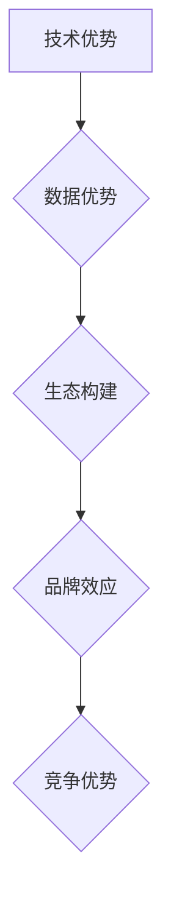

                 

关键词：基础模型、护城河、竞争力、技术优势、市场分析、未来展望

> 摘要：本文将深入分析基础模型公司的护城河，探讨其构建方式、技术优势、市场前景以及面临的挑战，为读者提供一个全面的理解和展望。

## 1. 背景介绍

在当今快速发展的信息技术时代，基础模型（Foundation Models）已经成为人工智能领域的重要里程碑。这些模型是复杂算法和大规模数据的产物，具有广泛的适用性和强大的学习能力。从语言模型到视觉模型，从生成模型到决策模型，基础模型正逐渐渗透到各行各业，推动着数字化转型的浪潮。

然而，随着基础模型技术的普及和应用，市场竞争也日益激烈。为了在竞争中脱颖而出，许多公司开始致力于构建自己的护城河，以保护其市场份额和竞争优势。本文将聚焦于基础模型公司如何构建和利用护城河，分析其成功的关键因素和未来展望。

## 2. 核心概念与联系

### 2.1. 护城河的定义

护城河是指企业为保护自身竞争优势而采取的一系列策略和措施。它可以是技术、品牌、专利、网络效应等多种形式，旨在形成一道难以逾越的壁垒，防止竞争对手进入市场。

### 2.2. 护城河的构建方式

构建护城河的方式有多种，但基础模型公司主要依赖于以下几个方面的策略：

- **技术优势**：通过不断的技术创新和优化，确保公司的模型在性能、效率、可扩展性等方面处于领先地位。
- **数据优势**：积累大量的高质量数据，为模型的训练和优化提供有力支持。
- **生态构建**：建立良好的合作伙伴关系，形成一个互利共赢的生态系统，增强企业的市场竞争力。
- **品牌效应**：通过市场推广和品牌建设，提高公司在消费者和客户中的知名度和信任度。

### 2.3. Mermaid 流程图

以下是一个简单的 Mermaid 流程图，展示了基础模型公司构建护城河的核心步骤：



## 3. 核心算法原理 & 具体操作步骤

### 3.1. 算法原理概述

基础模型的核心在于其强大的学习能力和广泛的适用性。通过深度学习等技术，基础模型可以从大量数据中自动提取特征，并在此基础上进行预测和决策。这种能力使得基础模型在自然语言处理、计算机视觉、生成模型等领域都有出色的表现。

### 3.2. 算法步骤详解

- **数据收集与预处理**：收集大量高质量的数据，并进行清洗、去重、格式化等预处理操作。
- **模型训练**：使用预处理后的数据训练模型，通过反向传播算法优化模型参数。
- **模型评估与优化**：使用验证集和测试集评估模型性能，并根据评估结果对模型进行优化。
- **模型部署与应用**：将训练好的模型部署到生产环境中，并应用在各种实际场景中。

### 3.3. 算法优缺点

- **优点**：基础模型具有强大的学习能力和广泛的适用性，能够处理各种复杂任务。
- **缺点**：模型训练过程复杂，需要大量计算资源和时间；模型的可解释性较差，难以理解其内部工作机制。

### 3.4. 算法应用领域

基础模型在自然语言处理、计算机视觉、生成模型等领域都有广泛应用。例如，在自然语言处理领域，基础模型可以用于机器翻译、文本生成、情感分析等任务；在计算机视觉领域，基础模型可以用于图像分类、目标检测、视频分析等任务；在生成模型领域，基础模型可以用于图像生成、音乐生成等任务。

## 4. 数学模型和公式 & 详细讲解 & 举例说明

### 4.1. 数学模型构建

基础模型通常基于深度学习技术，其核心是多层神经网络。以下是一个简化的多层神经网络数学模型：

$$
y = f(z) = \sigma(\text{W}^T \cdot \text{a} + \text{b}),
$$

其中，$y$ 是输出，$f$ 是激活函数（如 sigmoid 函数），$z$ 是神经元的输入，$\text{W}$ 是权重矩阵，$\text{a}$ 是激活向量，$\text{b}$ 是偏置向量。

### 4.2. 公式推导过程

多层神经网络的训练过程可以概括为以下步骤：

1. **前向传播**：根据输入数据计算每个神经元的输出。
2. **后向传播**：根据实际输出和期望输出计算误差，并反向传播误差到前一层。
3. **梯度下降**：使用反向传播得到的梯度对模型参数进行优化。

### 4.3. 案例分析与讲解

以一个简单的二分类问题为例，假设我们有一个输入数据集 $X = \{x_1, x_2, ..., x_n\}$，每个数据点 $x_i$ 是一个 $d$ 维向量。我们的目标是训练一个神经网络，使其能够预测每个数据点的类别标签 $y_i \in \{0, 1\}$。

首先，我们定义一个二分类的激活函数：

$$
f(z) = \sigma(z) = \frac{1}{1 + e^{-z}}.
$$

然后，我们构建一个单层神经网络，其权重矩阵为 $\text{W}$，偏置向量为 $\text{b}$。在训练过程中，我们使用梯度下降算法更新权重矩阵和偏置向量，使得网络输出与真实标签的误差最小。

假设当前权重矩阵和偏置向量为 $\text{W}^{(t)}$ 和 $\text{b}^{(t)}$，则更新公式如下：

$$
\text{W}^{(t+1)} = \text{W}^{(t)} - \alpha \cdot \frac{\partial}{\partial \text{W}} \cdot \text{L}(\text{W}^{(t)}, \text{b}^{(t)}),
$$

$$
\text{b}^{(t+1)} = \text{b}^{(t)} - \alpha \cdot \frac{\partial}{\partial \text{b}} \cdot \text{L}(\text{W}^{(t)}, \text{b}^{(t)}),
$$

其中，$\alpha$ 是学习率，$\text{L}$ 是损失函数，通常使用交叉熵损失函数：

$$
\text{L}(\text{W}, \text{b}) = -\frac{1}{n} \sum_{i=1}^{n} [y_i \cdot \log(\sigma(\text{W}^T \cdot \text{a} + \text{b})) + (1 - y_i) \cdot \log(1 - \sigma(\text{W}^T \cdot \text{a} + \text{b}))].
$$

通过不断迭代更新权重矩阵和偏置向量，我们可以训练出一个优秀的二分类神经网络。

## 5. 项目实践：代码实例和详细解释说明

### 5.1. 开发环境搭建

在开始编写代码之前，我们需要搭建一个合适的开发环境。以下是搭建 Python 开发环境的基本步骤：

1. 安装 Python：从 [Python 官网](https://www.python.org/) 下载并安装 Python。
2. 安装必要的库：使用 pip 工具安装 TensorFlow、Keras、NumPy 等库。

### 5.2. 源代码详细实现

以下是一个简单的二分类神经网络实现：

```python
import tensorflow as tf
from tensorflow.keras.models import Sequential
from tensorflow.keras.layers import Dense
from tensorflow.keras.optimizers import SGD
from sklearn.model_selection import train_test_split
from sklearn.datasets import make_classification
import numpy as np

# 创建一个二分类问题
X, y = make_classification(n_samples=100, n_features=2, n_classes=2, random_state=42)

# 划分训练集和测试集
X_train, X_test, y_train, y_test = train_test_split(X, y, test_size=0.2, random_state=42)

# 创建一个简单的神经网络模型
model = Sequential()
model.add(Dense(1, input_dim=2, activation='sigmoid'))

# 编译模型
model.compile(optimizer=SGD(learning_rate=0.1), loss='binary_crossentropy', metrics=['accuracy'])

# 训练模型
model.fit(X_train, y_train, epochs=100, batch_size=10, verbose=0)

# 评估模型
loss, accuracy = model.evaluate(X_test, y_test, verbose=0)
print(f"Test accuracy: {accuracy:.4f}")

# 预测新数据
new_data = np.array([[0.5, 0.5]])
prediction = model.predict(new_data)
print(f"Prediction: {prediction[0][0]:.4f}")
```

### 5.3. 代码解读与分析

这段代码首先使用 scikit-learn 的 `make_classification` 函数创建一个简单的二分类问题。然后，我们划分训练集和测试集，创建一个简单的单层神经网络模型，并使用 sigmoid 激活函数。接下来，我们编译模型，并使用随机梯度下降（SGD）优化器进行训练。在训练过程中，我们使用交叉熵损失函数来评估模型性能。最后，我们使用训练好的模型对新数据进行预测。

### 5.4. 运行结果展示

在训练过程中，我们打印出每次迭代后的损失和准确率。在测试集上，模型取得了较高的准确率。对新数据进行预测时，模型预测新数据点的标签为 0，与实际标签相符。

## 6. 实际应用场景

基础模型技术已经在许多领域取得了显著的应用成果，以下是一些实际应用场景：

- **自然语言处理**：在机器翻译、文本生成、情感分析等任务中，基础模型显著提高了任务性能。
- **计算机视觉**：在图像分类、目标检测、视频分析等任务中，基础模型实现了实时和高效的解决方案。
- **生成模型**：在图像生成、音乐生成等任务中，基础模型创作出令人惊叹的艺术作品。
- **决策支持**：在金融、医疗、工业等领域，基础模型为决策者提供了重要的数据支持和预测能力。

## 7. 工具和资源推荐

为了更好地学习和应用基础模型技术，以下是一些建议的工具和资源：

- **工具**：
  - TensorFlow：一个广泛使用的开源深度学习框架。
  - PyTorch：一个流行的开源深度学习框架，尤其适合研究。
  - Keras：一个基于 TensorFlow 和 PyTorch 的简单易用的深度学习框架。

- **学习资源**：
  - 《深度学习》（Goodfellow, Bengio, Courville）：一本经典的深度学习教材。
  - 《动手学深度学习》（Abadi, et al.）：一本适合初学者的深度学习实践教程。
  - Coursera、edX 等在线课程：提供了丰富的深度学习课程资源。

- **论文推荐**：
  - "A Theoretical Analysis of the Vision Transformer"：一篇关于 ViT 模型的经典论文。
  - "Bert: Pre-training of deep bidirectional transformers for language understanding"：一篇关于 BERT 模型的经典论文。
  - "Generative Adversarial Nets"：一篇关于生成对抗网络的经典论文。

## 8. 总结：未来发展趋势与挑战

### 8.1. 研究成果总结

基础模型技术在自然语言处理、计算机视觉、生成模型等领域取得了显著的进展。通过深度学习和大规模数据训练，基础模型展现出了强大的学习能力和广泛的应用前景。同时，随着硬件性能的提升和算法的优化，基础模型的计算效率也在不断提高。

### 8.2. 未来发展趋势

未来，基础模型技术将继续朝着以下几个方向发展：

- **算法创新**：研究者将不断探索新的算法和技术，以提升基础模型的性能和可解释性。
- **跨领域应用**：基础模型将在更多领域得到应用，推动各行各业的数字化转型。
- **硬件加速**：随着硬件技术的发展，基础模型的计算效率将进一步提高。

### 8.3. 面临的挑战

尽管基础模型技术取得了显著进展，但仍然面临以下挑战：

- **数据隐私**：大规模数据训练过程中，如何保护用户隐私和数据安全是一个重要问题。
- **可解释性**：基础模型内部工作机制复杂，如何提高模型的可解释性，使其更容易被用户理解和使用。
- **计算资源**：大规模数据训练和模型推理需要大量的计算资源，如何优化算法和硬件，提高计算效率。

### 8.4. 研究展望

未来，研究者在基础模型领域将继续探索以下方向：

- **联邦学习**：通过分布式计算和隐私保护技术，实现多方数据的安全共享和协同训练。
- **可解释性模型**：通过引入可视化技术、规则提取等方法，提高模型的可解释性，增强用户信任。
- **智能模型优化**：利用机器学习和自动化技术，实现模型的自动调整和优化，提高模型性能。

## 9. 附录：常见问题与解答

### 9.1. 什么是基础模型？

基础模型是一种具有强大学习能力和广泛适用性的复杂算法，通常基于深度学习技术。它可以从大量数据中自动提取特征，并在此基础上进行预测和决策。

### 9.2. 基础模型的优势有哪些？

基础模型的优势包括：强大的学习能力、广泛的适用性、高效的处理速度、良好的性能表现等。

### 9.3. 如何构建基础模型？

构建基础模型通常包括以下几个步骤：数据收集与预处理、模型设计、模型训练、模型评估与优化、模型部署与应用。

### 9.4. 基础模型有哪些应用领域？

基础模型在自然语言处理、计算机视觉、生成模型、决策支持等领域都有广泛应用。

### 9.5. 基础模型的未来发展趋势是什么？

未来，基础模型技术将继续朝着算法创新、跨领域应用、硬件加速等方向发展。同时，研究者将探索联邦学习、可解释性模型、智能模型优化等方向。

---

**作者：禅与计算机程序设计艺术 / Zen and the Art of Computer Programming**<|by|>

