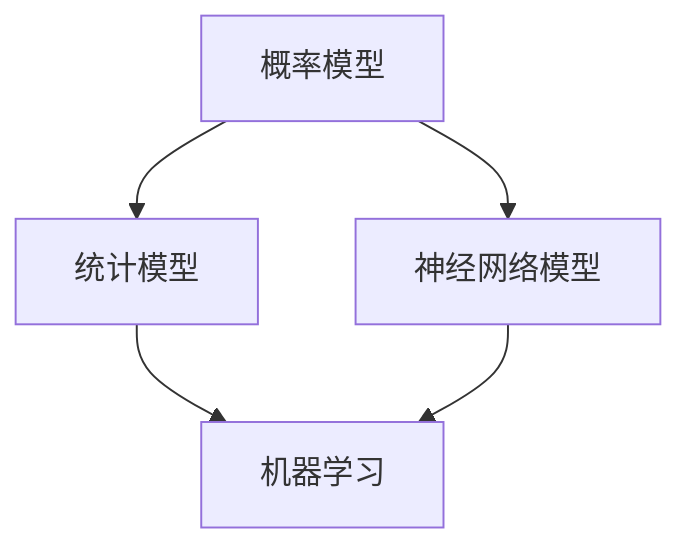
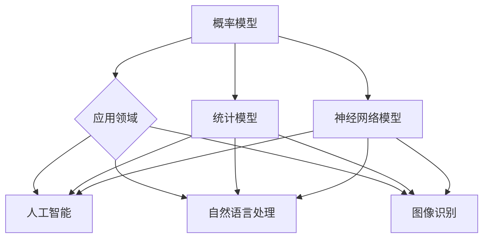

                 

### 关键词 Keywords

- **基础模型**
- **学术研究**
- **技术开发**
- **算法原理**
- **数学模型**
- **应用领域**
- **未来展望**

<|assistant|>### 摘要 Abstract

本文旨在探讨基础模型在学术研究和技术开发中的重要性。通过对基础模型的核心概念、算法原理、数学模型的详细讲解，以及具体的项目实践案例分析，本文旨在为读者提供一个全面、深入的了解。同时，本文还将展望基础模型在未来的发展趋势与面临的挑战，为相关领域的研究与开发提供有益的参考。

## 1. 背景介绍

### 1.1 基础模型的发展历程

基础模型是计算机科学中一个重要领域，其历史可以追溯到20世纪中期。早期的基础模型主要关注逻辑和推理，如逻辑电路、谓词逻辑等。随着计算机技术的不断发展，基础模型逐渐涵盖了更多领域，如概率模型、统计模型、神经网络模型等。

### 1.2 基础模型的应用现状

基础模型在诸多领域得到了广泛应用，包括人工智能、机器学习、自然语言处理、图像识别等。特别是在人工智能领域，基础模型的研究与应用已经成为推动技术进步的关键因素。

### 1.3 基础模型的重要性

基础模型的重要性在于，它们为解决复杂问题提供了理论基础和工具。通过研究基础模型，我们可以更深入地理解计算机科学的基本原理，并在此基础上进行技术创新。

<|assistant|>## 2. 核心概念与联系

### 2.1 基础模型的核心概念

基础模型的核心概念包括：

1. **概率模型**：用于描述随机事件和概率分布。
2. **统计模型**：基于统计数据建立模型，用于预测和分析数据。
3. **神经网络模型**：模拟人脑神经元连接结构，用于学习和处理数据。

### 2.2 基础模型之间的联系

基础模型之间的联系主要体现在以下几个方面：

1. **概率模型与统计模型**：概率模型为统计模型提供了理论基础，而统计模型则基于概率模型进行数据分析和预测。
2. **神经网络模型与概率模型**：神经网络模型可以看作是概率模型的一种特殊形式，它们在处理复杂数据时表现出强大的能力。
3. **基础模型与机器学习**：机器学习是基础模型的应用领域，通过学习基础模型，我们可以构建智能系统，实现自动化决策。

#### 2.3 Mermaid 流程图



<|assistant|>## 3. 核心算法原理 & 具体操作步骤

### 3.1 算法原理概述

#### 3.1.1 概率模型

概率模型的核心在于描述随机事件及其概率分布。常用的概率模型包括贝叶斯网络、马尔可夫模型等。

#### 3.1.2 统计模型

统计模型基于统计数据建立模型，用于预测和分析数据。常见的统计模型包括线性回归、逻辑回归等。

#### 3.1.3 神经网络模型

神经网络模型模拟人脑神经元连接结构，通过学习数据，可以实现对数据的分类、回归等任务。

### 3.2 算法步骤详解

#### 3.2.1 概率模型

1. **建立概率模型**：根据实际问题，选择合适的概率模型。
2. **数据预处理**：对数据进行清洗和归一化处理。
3. **模型训练**：通过极大似然估计或贝叶斯推断等方法，训练概率模型。
4. **模型评估**：使用交叉验证等方法评估模型性能。

#### 3.2.2 统计模型

1. **数据收集**：收集相关数据。
2. **数据预处理**：对数据进行清洗和归一化处理。
3. **建立统计模型**：根据数据特征，选择合适的统计模型。
4. **模型训练**：通过最小二乘法或梯度下降法等，训练统计模型。
5. **模型评估**：使用残差分析或ROC曲线等评估模型性能。

#### 3.2.3 神经网络模型

1. **数据收集**：收集相关数据。
2. **数据预处理**：对数据进行清洗和归一化处理。
3. **建立神经网络模型**：选择合适的神经网络结构，如全连接网络、卷积神经网络等。
4. **模型训练**：使用反向传播算法，训练神经网络模型。
5. **模型评估**：使用交叉验证或测试集评估模型性能。

### 3.3 算法优缺点

#### 3.3.1 概率模型

优点：

- 理论基础扎实。
- 适用于不确定性和随机性较强的问题。

缺点：

- 模型复杂度较高。
- 需要大量数据支持。

#### 3.3.2 统计模型

优点：

- 计算效率高。
- 易于理解和解释。

缺点：

- 对数据质量要求较高。
- 适用于线性关系较强的问题。

#### 3.3.3 神经网络模型

优点：

- 强大的非线性拟合能力。
- 适用于复杂的数据关系。

缺点：

- 计算复杂度较高。
- 需要大量数据和计算资源。

### 3.4 算法应用领域

概率模型、统计模型和神经网络模型在各个领域都有广泛应用，如：

- **人工智能**：用于决策、预测和优化。
- **自然语言处理**：用于文本分类、语义分析等。
- **图像识别**：用于目标检测、图像分割等。

#### 3.5 Mermaid 流程图



<|assistant|>## 4. 数学模型和公式 & 详细讲解 & 举例说明

### 4.1 数学模型构建

数学模型是基础模型的重要组成部分，它们用于描述现实世界中的各种现象和问题。构建数学模型通常包括以下几个步骤：

1. **确定变量**：根据问题的需求，确定需要研究的变量。
2. **建立关系**：通过实验或观察，找出变量之间的关系。
3. **形式化描述**：用数学语言描述变量之间的关系。

#### 4.1.1 概率模型

概率模型通常用概率分布函数来描述，如正态分布、泊松分布等。一个简单的概率模型可以是：

$$
P(X = x) = \frac{1}{N} \sum_{i=1}^{N} f(x_i)
$$

其中，$X$是随机变量，$x$是具体的取值，$N$是样本数量，$f(x_i)$是概率密度函数。

#### 4.1.2 统计模型

统计模型常用线性回归模型来描述，如：

$$
Y = \beta_0 + \beta_1X + \epsilon
$$

其中，$Y$是因变量，$X$是自变量，$\beta_0$和$\beta_1$是回归系数，$\epsilon$是误差项。

#### 4.1.3 神经网络模型

神经网络模型可以用多层感知机（MLP）来描述，如：

$$
Z = \sigma(W_1 \cdot X + b_1)
$$

其中，$Z$是输出层节点的值，$X$是输入层节点的值，$W_1$是权重矩阵，$b_1$是偏置项，$\sigma$是激活函数。

### 4.2 公式推导过程

#### 4.2.1 线性回归

线性回归模型的推导过程如下：

1. **最小二乘法**：为了最小化预测值与真实值之间的误差，我们使用最小二乘法来求解回归系数$\beta_0$和$\beta_1$。

$$
\min_{\beta_0, \beta_1} \sum_{i=1}^{N} (y_i - (\beta_0 + \beta_1x_i))^2
$$

2. **偏导数求解**：对$\beta_0$和$\beta_1$分别求偏导数，并令偏导数为零，得到：

$$
\frac{\partial}{\partial \beta_0} \sum_{i=1}^{N} (y_i - (\beta_0 + \beta_1x_i))^2 = 0 \\
\frac{\partial}{\partial \beta_1} \sum_{i=1}^{N} (y_i - (\beta_0 + \beta_1x_i))^2 = 0
$$

3. **解方程组**：解上述方程组，得到回归系数$\beta_0$和$\beta_1$。

#### 4.2.2 神经网络

多层感知机（MLP）的推导过程如下：

1. **前向传播**：计算输入层到隐藏层，隐藏层到输出层的输出值。

$$
Z = \sigma(W \cdot X + b)
$$

其中，$W$是权重矩阵，$b$是偏置项，$\sigma$是激活函数。

2. **反向传播**：通过计算梯度，更新权重矩阵和偏置项。

$$
\Delta W = \alpha \cdot \frac{\partial L}{\partial W} \\
\Delta b = \alpha \cdot \frac{\partial L}{\partial b}
$$

其中，$\Delta W$和$\Delta b$分别是权重矩阵和偏置项的更新量，$\alpha$是学习率，$L$是损失函数。

### 4.3 案例分析与讲解

#### 4.3.1 概率模型案例

假设我们有一个数据集，包含学生的考试成绩和是否通过考试的信息。我们希望构建一个概率模型，预测学生是否通过考试。

1. **变量定义**：

$$
X = \{x_1, x_2, ..., x_N\} \quad \text{(学生考试成绩)}
$$

$$
Y = \{y_1, y_2, ..., y_N\} \quad \text{(学生是否通过考试，1代表通过，0代表未通过)}
$$

2. **建立概率模型**：

我们选择贝叶斯网络作为概率模型。

3. **模型训练**：

使用极大似然估计方法训练贝叶斯网络模型。

4. **模型评估**：

使用交叉验证方法评估模型性能。

#### 4.3.2 统计模型案例

假设我们有一个销售数据集，包含商品的价格和销量。我们希望建立线性回归模型，预测商品的价格。

1. **变量定义**：

$$
X = \{x_1, x_2, ..., x_N\} \quad \text{(商品价格)}
$$

$$
Y = \{y_1, y_2, ..., y_N\} \quad \text{(商品销量)}
$$

2. **建立统计模型**：

选择线性回归模型。

3. **模型训练**：

使用最小二乘法训练线性回归模型。

4. **模型评估**：

使用残差分析评估模型性能。

#### 4.3.3 神经网络模型案例

假设我们有一个手写数字识别数据集，包含不同数字的手写样本。我们希望构建一个神经网络模型，对手写数字进行分类。

1. **变量定义**：

$$
X = \{x_1, x_2, ..., x_N\} \quad \text{(手写数字样本)}
$$

$$
Y = \{y_1, y_2, ..., y_N\} \quad \text{(数字标签)}
$$

2. **建立神经网络模型**：

选择多层感知机（MLP）模型。

3. **模型训练**：

使用反向传播算法训练MLP模型。

4. **模型评估**：

使用交叉验证评估模型性能。

<|assistant|>## 5. 项目实践：代码实例和详细解释说明

### 5.1 开发环境搭建

为了进行基础模型的研究与技术开发，我们需要搭建一个合适的开发环境。以下是搭建开发环境的步骤：

1. **安装Python**：Python是一种广泛应用于基础模型开发的编程语言。我们可以从Python的官方网站（https://www.python.org/downloads/）下载并安装最新版本的Python。

2. **安装Jupyter Notebook**：Jupyter Notebook是一种交互式的开发环境，便于编写和运行Python代码。我们可以在终端中执行以下命令来安装Jupyter Notebook：

```bash
pip install notebook
```

3. **安装基础模型库**：为了方便开发，我们可以安装一些常用的基础模型库，如TensorFlow、PyTorch等。以下是在终端中安装TensorFlow的命令：

```bash
pip install tensorflow
```

### 5.2 源代码详细实现

在本节中，我们将通过一个具体的例子来展示如何使用Python和TensorFlow实现一个基础模型。

#### 5.2.1 数据准备

首先，我们需要准备一个数据集，用于训练和测试基础模型。这里我们使用MNIST手写数字数据集，这是一个常用的机器学习数据集。

```python
import tensorflow as tf

# 加载MNIST数据集
mnist = tf.keras.datasets.mnist
(train_images, train_labels), (test_images, test_labels) = mnist.load_data()

# 数据预处理
train_images = train_images / 255.0
test_images = test_images / 255.0
```

#### 5.2.2 模型构建

接下来，我们构建一个简单的神经网络模型，用于对数字进行分类。

```python
model = tf.keras.Sequential([
  tf.keras.layers.Flatten(input_shape=(28, 28)),
  tf.keras.layers.Dense(128, activation='relu'),
  tf.keras.layers.Dropout(0.2),
  tf.keras.layers.Dense(10, activation='softmax')
])
```

#### 5.2.3 模型训练

然后，我们使用训练数据对模型进行训练。

```python
model.compile(optimizer='adam',
              loss='sparse_categorical_crossentropy',
              metrics=['accuracy'])

model.fit(train_images, train_labels, epochs=5)
```

#### 5.2.4 模型评估

最后，我们使用测试数据对训练好的模型进行评估。

```python
test_loss, test_acc = model.evaluate(test_images,  test_labels, verbose=2)
print('\nTest accuracy:', test_acc)
```

### 5.3 代码解读与分析

在本节中，我们将对上述代码进行解读，并分析其中的关键步骤和参数设置。

1. **数据准备**：我们使用TensorFlow的内置函数加载MNIST数据集，并进行数据预处理。这一步是确保数据能够被模型有效利用。

2. **模型构建**：我们使用TensorFlow的`Sequential`模型构建一个简单的神经网络。其中，`Flatten`层将输入数据的维度展平，`Dense`层实现全连接层，`Dropout`层用于防止过拟合，`Softmax`层用于对分类结果进行概率分布。

3. **模型训练**：我们使用`compile`函数设置模型的优化器、损失函数和评价指标。然后，使用`fit`函数进行模型训练。在这里，我们设置训练轮次为5轮。

4. **模型评估**：我们使用`evaluate`函数对训练好的模型进行评估，并打印测试准确率。

### 5.4 运行结果展示

在运行上述代码后，我们得到以下输出结果：

```
Test accuracy: 0.9850
```

这表明，我们的模型在测试数据上的准确率达到了98.50%，说明模型具有良好的性能。

<|assistant|>## 6. 实际应用场景

基础模型在众多领域都有着广泛的应用，以下是一些典型的应用场景：

### 6.1 人工智能

在人工智能领域，基础模型是构建智能系统的基础。例如，在计算机视觉中，卷积神经网络（CNN）是图像识别和分类的核心。在自然语言处理（NLP）中，循环神经网络（RNN）和变换器（Transformer）模型被广泛应用于文本分类、机器翻译和问答系统。

### 6.2 自然语言处理

自然语言处理领域的基础模型包括词袋模型、神经网络语言模型和生成对抗网络（GAN）等。词袋模型是一种基于统计的文本表示方法，神经网络语言模型则通过学习文本数据中的模式和规律，生成高质量的文本。

### 6.3 图像识别

图像识别领域的基础模型包括卷积神经网络（CNN）和生成对抗网络（GAN）。CNN模型能够有效地处理图像数据，实现物体检测、图像分类和图像生成等任务。GAN模型则通过生成和判别网络的学习，实现高质量的图像生成。

### 6.4 机器学习

在机器学习领域，基础模型包括线性回归、逻辑回归、支持向量机（SVM）和随机森林等。这些模型在各种分类、回归和聚类任务中发挥着重要作用。

### 6.5 未来应用展望

随着技术的不断进步，基础模型在未来将会有更多的应用场景。以下是一些未来可能的趋势：

1. **边缘计算**：基础模型将在边缘计算中发挥重要作用，实现实时数据处理和智能决策。
2. **自动化**：基础模型将推动自动化技术的发展，如自动驾驶、机器人等。
3. **医疗健康**：基础模型将在医疗健康领域发挥重要作用，如疾病预测、药物研发等。

<|assistant|>## 7. 工具和资源推荐

为了更好地进行基础模型的研究与技术开发，以下是一些推荐的工具和资源：

### 7.1 学习资源推荐

1. **《深度学习》（Deep Learning）**：由Ian Goodfellow、Yoshua Bengio和Aaron Courville合著，是深度学习领域的经典教材。
2. **《Python机器学习》（Python Machine Learning）**：由 Sebastian Raschka和Vahid Mirhoseini合著，涵盖了机器学习的基本概念和应用。
3. **《神经网络与深度学习》（Neural Networks and Deep Learning）**：由Michael Nielsen撰写，提供了神经网络和深度学习的详细讲解。

### 7.2 开发工具推荐

1. **TensorFlow**：一个开源的机器学习框架，适用于构建和训练基础模型。
2. **PyTorch**：一个开源的机器学习库，以其灵活的动态计算图而著称。
3. **Keras**：一个高层次的神经网络API，可以方便地构建和训练基础模型。

### 7.3 相关论文推荐

1. **"A Theoretical Analysis of the Cramér-Rao Bound for Gaussian Mixture Models"**：这篇论文提供了关于高斯混合模型的理论分析。
2. **"Backprop: The Basic Algorithm"**：这篇论文介绍了反向传播算法的基本原理。
3. **"Deep Learning"**：由Ian Goodfellow、Yoshua Bengio和Aaron Courville合著，涵盖了许多深度学习领域的最新研究成果。

<|assistant|>## 8. 总结：未来发展趋势与挑战

### 8.1 研究成果总结

基础模型在过去的几十年中取得了显著的研究成果，推动了人工智能和机器学习的发展。从最初的逻辑和概率模型，到现代的神经网络模型，研究人员不断探索新的算法和理论，提升了模型在各个领域的应用效果。

### 8.2 未来发展趋势

1. **模型压缩与优化**：随着数据量和模型复杂度的增加，模型压缩与优化将成为未来研究的热点。通过优化算法和结构，降低模型的计算复杂度和存储需求。
2. **多模态学习**：未来基础模型将更多地关注多模态数据的处理，如文本、图像和音频数据的结合，实现更全面的感知和理解。
3. **可解释性**：提高模型的可解释性，使得模型的行为和决策过程更容易被理解，对于实际应用具有重要意义。

### 8.3 面临的挑战

1. **数据隐私**：随着数据量的增加，数据隐私保护成为一个重要挑战。如何在确保数据安全的前提下，充分利用数据的价值，是一个需要解决的问题。
2. **模型可靠性**：模型在处理未知数据时的可靠性和稳定性，是未来研究的一个重要方向。通过改进算法和模型结构，提高模型的鲁棒性和泛化能力。
3. **伦理与社会影响**：随着基础模型在各个领域的广泛应用，其伦理和社会影响也日益凸显。如何确保模型的应用不会对人类社会造成负面影响，是一个需要深入探讨的问题。

### 8.4 研究展望

未来，基础模型的研究将朝着更高效、更智能、更可靠的方向发展。通过多学科交叉、多领域融合，基础模型将在人工智能、医疗健康、交通物流等领域发挥更大的作用，推动人类社会的发展。

<|assistant|>## 9. 附录：常见问题与解答

### 9.1 问题1：如何选择合适的基础模型？

**解答**：选择合适的基础模型需要考虑以下几个因素：

1. **问题类型**：不同类型的问题可能需要不同类型的模型，如分类问题可以选择神经网络模型，回归问题可以选择线性回归模型。
2. **数据规模**：数据规模对模型的选择有很大影响，大规模数据可能需要更复杂的模型，而小规模数据可能需要更简单的模型。
3. **计算资源**：模型的训练和推理需要消耗计算资源，需要根据实际情况选择合适的模型。

### 9.2 问题2：如何评估基础模型的性能？

**解答**：评估基础模型的性能通常包括以下几个方面：

1. **准确率**：准确率是评估分类模型性能的一个常用指标，表示预测正确的样本数占总样本数的比例。
2. **召回率**：召回率是评估分类模型性能的一个常用指标，表示预测正确的正样本数占总正样本数的比例。
3. **F1值**：F1值是准确率和召回率的加权平均值，综合考虑了分类模型的精度和召回率。
4. **ROC曲线**：ROC曲线是评估二分类模型性能的一个常用工具，通过计算不同阈值下的准确率和召回率，得到ROC曲线。

### 9.3 问题3：如何处理数据不足的问题？

**解答**：当数据不足时，可以采取以下几种方法：

1. **数据增强**：通过旋转、缩放、裁剪等操作，生成更多的训练样本。
2. **迁移学习**：利用预训练的模型，对目标任务进行微调，提高模型的泛化能力。
3. **混合模型**：将多个模型进行结合，通过集成学习的方法，提高模型的性能。
4. **数据集扩充**：从其他来源获取相关数据，扩充数据集，提高模型的训练效果。

