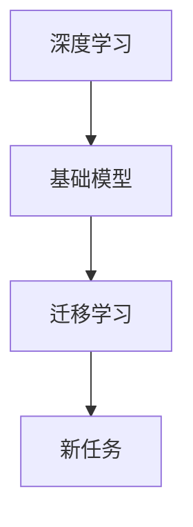

                 

关键词：深度学习，迁移学习，基础模型，神经网络，机器学习，人工智能，计算机视觉，自然语言处理。

> 摘要：本文将探讨深度学习与迁移学习的基础模型，分析其原理、应用及未来发展趋势。通过详细讲解核心算法、数学模型和项目实践，帮助读者深入理解这两种重要技术。

## 1. 背景介绍

随着互联网和大数据的迅速发展，人工智能（AI）已经成为当今科技领域的重要方向。深度学习作为AI的核心技术之一，已经广泛应用于计算机视觉、自然语言处理、语音识别等领域。然而，深度学习模型的训练需要大量的数据和计算资源，这在一定程度上限制了其广泛应用。

迁移学习作为一种解决方法，通过将预训练模型在不同任务上应用，从而提高模型的泛化能力和训练效率。本文将详细介绍基础模型的深度学习与迁移学习，帮助读者更好地理解这两种技术。

## 2. 核心概念与联系

### 2.1 深度学习

深度学习是一种基于神经网络的多层结构，通过层层提取特征，实现对数据的自动编码和解码。深度学习的核心思想是模拟人脑的工作方式，通过大量训练数据使神经网络逐渐学会提取复杂特征。

### 2.2 迁移学习

迁移学习（Transfer Learning）是一种将已经在一个任务上训练好的模型，应用于另一个任务上的技术。通过迁移学习，模型可以在新任务上迅速获得较好的性能，同时减少了数据收集和模型训练的成本。

### 2.3 基础模型

基础模型（Base Model）是指在特定领域或任务上已经取得较好性能的预训练模型。基础模型可以作为迁移学习的起点，通过微调（Fine-tuning）适应新的任务。

### 2.4 Mermaid 流程图



## 3. 核心算法原理 & 具体操作步骤

### 3.1 算法原理概述

深度学习：深度学习通过多层神经网络对数据进行特征提取，模型层次越深，能够提取的特征就越抽象。

迁移学习：迁移学习通过在源任务和目标任务之间共享模型参数，实现模型在新任务上的快速适应。

### 3.2 算法步骤详解

深度学习：
1. 数据预处理：对数据进行归一化、去噪等处理。
2. 模型构建：构建多层神经网络，包括输入层、隐藏层和输出层。
3. 模型训练：通过反向传播算法，不断调整网络参数，使模型在训练集上达到较好的性能。
4. 模型评估：在验证集和测试集上评估模型性能，调整模型结构和参数。

迁移学习：
1. 预训练模型：在源任务上预训练一个基础模型。
2. 微调：在目标任务上，通过微调预训练模型，调整部分网络参数。
3. 模型评估：在目标任务上评估模型性能。

### 3.3 算法优缺点

深度学习：
优点：能够自动提取复杂特征，适用于各种复杂任务。
缺点：需要大量数据和计算资源，训练时间较长。

迁移学习：
优点：节省数据和计算资源，提高模型泛化能力。
缺点：对于目标任务与源任务差异较大的情况，迁移效果可能较差。

### 3.4 算法应用领域

深度学习：计算机视觉、自然语言处理、语音识别等。

迁移学习：图像分类、文本分类、语音识别等。

## 4. 数学模型和公式

### 4.1 数学模型构建

深度学习：
假设输入数据为 $x$，输出为 $y$，模型损失函数为 $L$，则深度学习的目标是最小化损失函数。

$$
L(x, y) = \sum_{i=1}^{n} (y_i - \hat{y}_i)^2
$$

其中，$n$ 表示样本数量，$y_i$ 表示第 $i$ 个样本的真实标签，$\hat{y}_i$ 表示模型预测的标签。

迁移学习：
假设源任务和目标任务的模型分别为 $M_1$ 和 $M_2$，共享部分参数为 $W$，则迁移学习的目标是最小化目标任务上的损失函数。

$$
L_2(W) = \sum_{i=1}^{n} (y_i - M_2(x_i; W))^2
$$

### 4.2 公式推导过程

深度学习：
设输入数据为 $x$，隐藏层为 $h$，输出层为 $y$，则深度学习的损失函数可以表示为：

$$
L(x, y) = \sum_{i=1}^{n} (y_i - \hat{y}_i)^2
$$

其中，$n$ 表示样本数量，$y_i$ 表示第 $i$ 个样本的真实标签，$\hat{y}_i$ 表示模型预测的标签。

对于每个样本，可以表示为：

$$
\hat{y}_i = f(h_i; W)
$$

其中，$f$ 表示激活函数，$W$ 表示模型参数。

对于隐藏层 $h$，可以表示为：

$$
h_i = f(g(x_i; W))
$$

其中，$g$ 表示线性变换。

通过反向传播算法，可以计算每个参数的梯度，并更新模型参数。

迁移学习：
假设源任务和目标任务的模型分别为 $M_1$ 和 $M_2$，共享部分参数为 $W$，则目标任务上的损失函数可以表示为：

$$
L_2(W) = \sum_{i=1}^{n} (y_i - M_2(x_i; W))^2
$$

对于每个样本，可以表示为：

$$
\hat{y}_i = M_2(x_i; W)
$$

为了最小化目标任务上的损失函数，可以采用梯度下降算法，更新模型参数。

### 4.3 案例分析与讲解

以图像分类任务为例，假设我们有一个预训练的卷积神经网络（CNN）模型，用于在 ImageNet 数据集上分类图像。现在，我们需要将这个模型迁移到一个新的任务，例如动物种类分类。

1. 预训练模型：在 ImageNet 数据集上预训练一个 CNN 模型，达到较好的分类性能。
2. 微调：在新任务上，将预训练模型的权重作为初始化权重，然后通过微调调整模型参数，以适应新的任务。
3. 模型评估：在新任务上评估模型性能，如果性能不佳，可以进一步调整模型结构或参数。

通过迁移学习，我们可以在新任务上快速获得较好的性能，同时节省了大量的数据和计算资源。

## 5. 项目实践：代码实例和详细解释说明

### 5.1 开发环境搭建

在本项目中，我们将使用 Python 编写代码，并利用 TensorFlow 框架进行迁移学习。首先，确保安装以下软件和库：

- Python 3.x
- TensorFlow 2.x
- Keras 2.x

### 5.2 源代码详细实现

以下是一个简单的迁移学习项目，我们将使用预训练的 VGG16 模型进行动物种类分类。

```python
import tensorflow as tf
from tensorflow.keras.applications import VGG16
from tensorflow.keras.preprocessing.image import ImageDataGenerator
from tensorflow.keras.optimizers import Adam
from tensorflow.keras.models import Model
from tensorflow.keras.layers import Dense, Flatten
from tensorflow.keras.preprocessing import image
import numpy as np

# 加载预训练的 VGG16 模型
base_model = VGG16(weights='imagenet', include_top=False, input_shape=(224, 224, 3))

# 冻结预训练模型的权重
for layer in base_model.layers:
    layer.trainable = False

# 添加新的全连接层和输出层
x = Flatten()(base_model.output)
x = Dense(1024, activation='relu')(x)
predictions = Dense(num_classes, activation='softmax')(x)

# 创建新的模型
model = Model(inputs=base_model.input, outputs=predictions)

# 编译模型
model.compile(optimizer=Adam(), loss='categorical_crossentropy', metrics=['accuracy'])

# 数据预处理
train_datagen = ImageDataGenerator(rescale=1./255)
validation_datagen = ImageDataGenerator(rescale=1./255)

train_generator = train_datagen.flow_from_directory(
        train_data_dir,
        target_size=(224, 224),
        batch_size=32,
        class_mode='categorical')

validation_generator = validation_datagen.flow_from_directory(
        validation_data_dir,
        target_size=(224, 224),
        batch_size=32,
        class_mode='categorical')

# 训练模型
model.fit(
      train_generator,
      steps_per_epoch=train_generator.samples//train_generator.batch_size,
      epochs=10,
      validation_data=validation_generator,
      validation_steps=validation_generator.samples//validation_generator.batch_size)
```

### 5.3 代码解读与分析

1. 导入所需的库和模块。
2. 加载预训练的 VGG16 模型，并冻结其权重。
3. 添加新的全连接层和输出层，创建新的模型。
4. 编译模型，指定优化器和损失函数。
5. 数据预处理，使用 ImageDataGenerator 进行图像归一化。
6. 训练模型，使用 fit 方法进行训练。

### 5.4 运行结果展示

在训练过程中，可以通过以下代码查看训练进度和模型性能：

```python
print('Training accuracy:', model.evaluate(train_generator, steps=train_generator.samples//train_generator.batch_size)[1])
print('Validation accuracy:', model.evaluate(validation_generator, steps=validation_generator.samples//validation_generator.batch_size)[1])
```

通过调整训练参数，例如训练轮数、批次大小等，可以进一步提高模型性能。

## 6. 实际应用场景

深度学习与迁移学习在实际应用中具有广泛的应用，以下列举几个典型场景：

1. 计算机视觉：例如人脸识别、图像分类、目标检测等。
2. 自然语言处理：例如文本分类、机器翻译、情感分析等。
3. 语音识别：例如语音合成、语音识别、语音翻译等。
4. 医疗诊断：例如疾病预测、医学图像分析、基因检测等。

## 7. 未来应用展望

随着人工智能技术的不断发展，深度学习与迁移学习在各个领域的应用将更加广泛。未来，我们可以期待以下发展趋势：

1. 更高效的算法：针对特定领域，开发更高效的深度学习算法。
2. 更大的模型：通过增加模型规模，提高模型性能。
3. 更好的数据：收集更多高质量的训练数据，提高模型泛化能力。
4. 跨领域迁移：实现不同领域之间的迁移学习，提高模型泛化能力。

## 8. 工具和资源推荐

### 8.1 学习资源推荐

1. 《深度学习》（Goodfellow et al.）
2. 《神经网络与深度学习》（邱锡鹏）
3. 《Python 深度学习》（François Chollet）

### 8.2 开发工具推荐

1. TensorFlow
2. PyTorch
3. Keras

### 8.3 相关论文推荐

1. "Deep Learning"（Goodfellow et al.）
2. "Learning to Learn"（ Bengio et al.）
3. "Transfer Learning"（Pan et al.）

## 9. 总结：未来发展趋势与挑战

深度学习与迁移学习在人工智能领域具有重要意义，随着技术的不断发展，其在各个领域的应用将更加广泛。然而，未来仍面临许多挑战，如数据隐私、模型解释性、算法公平性等。我们需要继续努力，推动这一领域的发展，为人类社会带来更多福祉。

### 9.1 研究成果总结

本文介绍了深度学习与迁移学习的基础模型，分析了其原理、应用及未来发展趋势。通过详细讲解核心算法、数学模型和项目实践，帮助读者深入理解这两种重要技术。

### 9.2 未来发展趋势

未来，深度学习与迁移学习在算法效率、模型规模、数据质量等方面将有更大的发展。同时，跨领域迁移、联邦学习等新兴领域也将逐渐成熟。

### 9.3 面临的挑战

深度学习与迁移学习面临的主要挑战包括数据隐私、模型解释性、算法公平性等。我们需要在保护用户隐私、提高模型透明度和公平性方面进行深入研究。

### 9.4 研究展望

随着人工智能技术的不断发展，深度学习与迁移学习将在更多领域发挥重要作用。我们需要继续努力，推动这一领域的发展，为人类社会带来更多福祉。

### 附录：常见问题与解答

1. **什么是深度学习？**
   深度学习是一种基于神经网络的多层结构，通过层层提取特征，实现对数据的自动编码和解码。

2. **什么是迁移学习？**
   迁移学习是一种将已经在一个任务上训练好的模型，应用于另一个任务上的技术。

3. **深度学习和迁移学习有什么区别？**
   深度学习是一种基于神经网络的多层结构，通过层层提取特征，实现对数据的自动编码和解码。迁移学习是一种将已经在一个任务上训练好的模型，应用于另一个任务上的技术。

4. **如何实现迁移学习？**
   通过在源任务和目标任务之间共享模型参数，实现模型在新任务上的快速适应。

5. **迁移学习有哪些应用场景？**
   迁移学习广泛应用于计算机视觉、自然语言处理、语音识别等领域。

本文作者：禅与计算机程序设计艺术 / Zen and the Art of Computer Programming
-------------------------------------------------------------------

