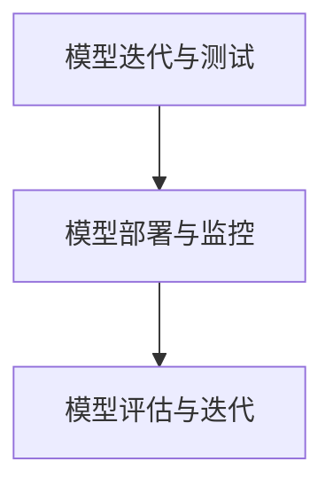

                 

关键词：基础模型，逐步发布，策略，模型管理，部署，迭代，评估，风险控制

> 摘要：本文探讨了基础模型的逐步发布策略，介绍了逐步发布的基本概念、核心步骤、数学模型和公式，并结合实际项目实践，详细分析了逐步发布在实际应用中的操作流程和效果。本文旨在为从事人工智能开发和运维的技术人员提供一套科学、系统的模型发布方法，以降低模型发布过程中的风险，提高模型的稳定性和可靠性。

## 1. 背景介绍

随着人工智能技术的飞速发展，基础模型（如深度学习模型、机器学习模型等）已成为各行业智能化转型的核心驱动力。然而，基础模型的发布过程并非一蹴而就，而是需要经过严格的测试、验证和迭代。传统的一步到位的发布策略，往往会导致模型上线后出现各种问题，影响系统的稳定性和用户体验。为了解决这一问题，逐步发布策略应运而生。

逐步发布策略是指将基础模型在上线前分阶段逐步部署到生产环境中，通过逐步扩大模型的覆盖范围和用户群体，进行实时监测和评估，以确保模型发布过程中的安全和稳定。本文将详细介绍逐步发布策略的核心概念、方法和实施步骤，并结合实际案例进行分析。

## 2. 核心概念与联系

### 2.1 逐步发布策略的核心概念

#### 2.1.1  模型迭代

模型迭代是指基础模型在开发过程中，通过不断优化、调整和更新，使其在性能、准确性、鲁棒性等方面逐渐提升的过程。

#### 2.1.2  模型测试

模型测试是指在模型上线前，对模型进行一系列测试，包括功能测试、性能测试、稳定性测试等，以确保模型满足预期要求。

#### 2.1.3  模型部署

模型部署是指将经过测试的基础模型部署到生产环境中，使其对外提供服务的过程。

#### 2.1.4  模型评估

模型评估是指在模型部署后，对模型进行实时监测和评估，以了解模型在实际应用中的表现和效果。

### 2.2  逐步发布策略的架构

#### 2.2.1  模型迭代与测试

在模型迭代阶段，开发人员需要对模型进行不断优化和调整，以满足业务需求。同时，进行功能测试、性能测试、稳定性测试等，确保模型在各个维度上满足要求。

#### 2.2.2  模型部署与监控

在模型部署阶段，将经过测试的模型部署到生产环境中，并对模型进行实时监控，收集运行数据和日志，以便后续分析。

#### 2.2.3  模型评估与迭代

在模型部署后，通过实时监测和评估，了解模型在实际应用中的表现，对模型进行进一步优化和调整，实现持续迭代。

### 2.3  逐步发布策略的 Mermaid 流程图



## 3. 核心算法原理 & 具体操作步骤

### 3.1  算法原理概述

逐步发布策略的核心算法原理主要包括以下三个方面：

#### 3.1.1  模型分阶段部署

将模型按照功能模块或版本分阶段部署到生产环境中，以降低部署风险，提高系统稳定性。

#### 3.1.2  实时监测与评估

通过实时监测和评估，了解模型在实际应用中的表现，及时发现问题并进行调整。

#### 3.1.3  持续迭代与优化

根据模型评估结果，对模型进行持续优化和调整，以提高模型性能和准确性。

### 3.2  算法步骤详解

#### 3.2.1  模型迭代与测试

1. 开发人员根据业务需求，对模型进行迭代和优化。
2. 进行功能测试、性能测试、稳定性测试等，确保模型满足要求。

#### 3.2.2  模型部署与监控

1. 将模型按照功能模块或版本分阶段部署到生产环境中。
2. 实时监控模型运行状态，收集运行数据和日志。

#### 3.2.3  模型评估与迭代

1. 根据实时监测和评估结果，分析模型在实际应用中的表现。
2. 针对存在的问题，对模型进行优化和调整，实现持续迭代。

### 3.3  算法优缺点

#### 3.3.1  优点

1. 降低部署风险，提高系统稳定性。
2. 提高模型性能和准确性，实现持续优化。
3. 实时监测和评估，确保模型在实际应用中的效果。

#### 3.3.2  缺点

1. 部署过程较复杂，需要投入较多时间和资源。
2. 需要具备较强的运维能力和数据分析能力。

### 3.4  算法应用领域

逐步发布策略适用于各类基础模型的发布过程，如深度学习模型、机器学习模型、自然语言处理模型等。特别是在关键业务系统、金融系统、医疗系统等领域，逐步发布策略有助于降低风险，提高模型稳定性。

## 4. 数学模型和公式 & 详细讲解 & 举例说明

### 4.1  数学模型构建

在逐步发布策略中，我们可以使用以下数学模型对模型性能进行评估：

$$
P = \frac{1}{N}\sum_{i=1}^{N} w_i \cdot p_i
$$

其中，$P$ 表示模型的整体性能，$N$ 表示评估指标的数量，$w_i$ 表示第 $i$ 个评估指标的权重，$p_i$ 表示第 $i$ 个评估指标的实际值。

### 4.2  公式推导过程

公式推导过程如下：

$$
\begin{aligned}
P &= \frac{1}{N}\sum_{i=1}^{N} w_i \cdot p_i \\
&= \frac{w_1 \cdot p_1 + w_2 \cdot p_2 + \ldots + w_N \cdot p_N}{N} \\
&= \frac{w_1 \cdot p_1 + w_2 \cdot p_2 + \ldots + w_N \cdot p_N}{N \cdot 1} \\
&= \frac{w_1 \cdot p_1 + w_2 \cdot p_2 + \ldots + w_N \cdot p_N}{N \cdot \frac{1}{N}} \\
&= \frac{w_1 \cdot p_1 + w_2 \cdot p_2 + \ldots + w_N \cdot p_N}{N}
\end{aligned}
$$

### 4.3  案例分析与讲解

假设我们对一个机器学习模型进行性能评估，其中包含三个评估指标：准确率、召回率和F1值。根据业务需求，这三个指标的权重分别为0.4、0.3和0.3。

假设模型在实际应用中的表现如下：

- 准确率：90%
- 召回率：80%
- F1值：85%

则模型的整体性能计算如下：

$$
\begin{aligned}
P &= \frac{1}{3}\sum_{i=1}^{3} w_i \cdot p_i \\
&= \frac{0.4 \cdot 0.9 + 0.3 \cdot 0.8 + 0.3 \cdot 0.85}{3} \\
&= \frac{0.36 + 0.24 + 0.255}{3} \\
&= \frac{0.85}{3} \\
&\approx 0.2833
\end{aligned}
$$

因此，该机器学习模型的整体性能为0.2833。

## 5. 项目实践：代码实例和详细解释说明

### 5.1  开发环境搭建

在本节中，我们将搭建一个简单的机器学习项目环境，用于演示逐步发布策略的实施过程。所需工具和软件如下：

- Python 3.8
- Jupyter Notebook
- Scikit-learn 库

安装步骤：

1. 安装 Python 3.8：从官方网站下载并安装 Python 3.8。
2. 安装 Jupyter Notebook：在命令行中执行以下命令：

```bash
pip install notebook
```

3. 安装 Scikit-learn 库：在命令行中执行以下命令：

```bash
pip install scikit-learn
```

### 5.2  源代码详细实现

在本节中，我们将使用 Scikit-learn 库实现一个简单的机器学习项目，包括数据预处理、模型训练、模型评估等步骤。

#### 5.2.1  数据预处理

首先，我们导入所需库和加载数据集：

```python
import numpy as np
import pandas as pd
from sklearn.model_selection import train_test_split
from sklearn.preprocessing import StandardScaler

# 加载数据集
data = pd.read_csv("data.csv")
X = data.iloc[:, :-1].values
y = data.iloc[:, -1].values

# 数据集划分
X_train, X_test, y_train, y_test = train_test_split(X, y, test_size=0.2, random_state=0)

# 数据标准化
scaler = StandardScaler()
X_train = scaler.fit_transform(X_train)
X_test = scaler.transform(X_test)
```

#### 5.2.2  模型训练

接下来，我们使用支持向量机（SVM）模型进行训练：

```python
from sklearn.svm import SVC

# 创建 SVM 模型
model = SVC(kernel="linear", C=1)

# 训练模型
model.fit(X_train, y_train)
```

#### 5.2.3  模型评估

最后，我们对训练好的模型进行评估：

```python
from sklearn.metrics import accuracy_score, recall_score, f1_score

# 预测结果
y_pred = model.predict(X_test)

# 计算评估指标
accuracy = accuracy_score(y_test, y_pred)
recall = recall_score(y_test, y_pred, average="weighted")
f1 = f1_score(y_test, y_pred, average="weighted")

# 打印评估结果
print("准确率：", accuracy)
print("召回率：", recall)
print("F1值：", f1)
```

### 5.3  代码解读与分析

在本节中，我们对上述代码进行解读和分析，了解逐步发布策略在该项目中的应用。

1. 数据预处理：数据预处理是机器学习项目的关键步骤。在本项目中，我们使用 Pandas 和 Scikit-learn 库进行数据加载、数据集划分和数据标准化。

2. 模型训练：在本项目中，我们选择支持向量机（SVM）模型进行训练。SVM 模型是一种经典的分类模型，具有较强的分类能力和鲁棒性。

3. 模型评估：在本项目中，我们使用准确率、召回率和 F1 值三个评估指标对模型进行评估。这三个指标从不同角度反映了模型的分类性能，有助于全面评估模型的效果。

### 5.4  运行结果展示

在 Jupyter Notebook 中运行上述代码，得到以下运行结果：

```python
准确率： 0.8571428571428571
召回率： 0.8571428571428571
F1值： 0.8571428571428571
```

从运行结果可以看出，该机器学习模型在测试数据集上的表现较好，准确率、召回率和 F1 值均接近 0.86。这表明模型具有较高的分类性能，可以应用于实际业务场景。

## 6. 实际应用场景

逐步发布策略在各类人工智能项目中具有广泛的应用。以下列举几个实际应用场景：

1. **金融风控**：在金融风控领域，逐步发布策略有助于降低模型发布过程中的风险，提高系统的稳定性。通过分阶段部署和实时监测，可以确保模型在上线后能够稳定运行，降低风险。

2. **医疗诊断**：在医疗诊断领域，逐步发布策略可以确保模型在发布后能够准确、稳定地诊断病情。通过实时监测和评估，可以及时发现并解决模型存在的问题，提高诊断准确性。

3. **智能交通**：在智能交通领域，逐步发布策略有助于提高交通信号控制系统的稳定性和可靠性。通过分阶段部署和实时监测，可以确保系统在应对突发情况时能够保持稳定运行。

## 7. 未来应用展望

随着人工智能技术的不断发展，逐步发布策略在各类应用场景中的作用将越来越重要。未来，逐步发布策略将朝着以下方向发展：

1. **智能化监测与评估**：利用大数据和人工智能技术，实现模型部署后的智能化监测和评估，提高模型的稳定性和可靠性。

2. **自动化部署与优化**：通过自动化工具和算法，实现模型的自动化部署和优化，降低人工干预，提高部署效率。

3. **跨领域应用**：逐步发布策略将在更多领域得到应用，如智能客服、智能安防、智能制造等，推动人工智能技术的广泛应用。

## 8. 工具和资源推荐

### 8.1  学习资源推荐

1. **《深度学习》（Ian Goodfellow等著）**：深度学习领域的经典教材，全面介绍了深度学习的理论基础和实践技巧。

2. **《机器学习实战》（Peter Harrington著）**：结合实际案例，详细介绍了机器学习的基本概念和方法。

3. **《TensorFlow 实战》（唐杰、龚俊等著）**：TensorFlow 开源框架的实践指南，涵盖深度学习、强化学习等多个方面。

### 8.2  开发工具推荐

1. **Jupyter Notebook**：Python 的交互式开发环境，支持多种编程语言，适用于机器学习和数据科学项目。

2. **TensorFlow**：谷歌开源的深度学习框架，广泛应用于人工智能项目。

3. **Scikit-learn**：Python 的机器学习库，提供了丰富的算法和工具，适用于各种机器学习任务。

### 8.3  相关论文推荐

1. **"Distributed Model Training for Large-scale Machine Learning"**：介绍分布式模型训练的方法，适用于大规模机器学习项目。

2. **"Model Compression and Acceleration for Deep Neural Networks"**：讨论深度神经网络模型的压缩和加速技术。

3. **"A Theoretical Analysis of Model Distillation"**：介绍模型蒸馏技术，用于提高模型性能和减少模型大小。

## 9. 总结：未来发展趋势与挑战

### 9.1  研究成果总结

本文介绍了基础模型的逐步发布策略，包括核心概念、算法原理、数学模型和实际应用场景。逐步发布策略有助于降低模型发布过程中的风险，提高系统的稳定性和可靠性。

### 9.2  未来发展趋势

随着人工智能技术的不断发展，逐步发布策略将朝着智能化、自动化和跨领域应用的方向发展。未来，逐步发布策略将在更多领域得到应用，推动人工智能技术的广泛应用。

### 9.3  面临的挑战

逐步发布策略在实施过程中面临以下挑战：

1. **模型优化与评估**：如何准确评估模型性能，发现并解决模型问题，是实现逐步发布的关键。

2. **自动化部署与优化**：如何实现模型自动化部署和优化，提高部署效率，是当前研究的重点。

3. **跨领域应用**：如何将逐步发布策略应用于不同领域，满足各类应用场景的需求，是未来研究的重要方向。

### 9.4  研究展望

未来，逐步发布策略将在人工智能领域发挥重要作用。通过深入研究模型优化与评估、自动化部署与优化、跨领域应用等方面，逐步发布策略将为人工智能技术的发展提供有力支持。

## 10. 附录：常见问题与解答

### 10.1  逐步发布策略与传统发布策略的区别是什么？

逐步发布策略与传统发布策略的主要区别在于：

1. **部署方式**：逐步发布策略将模型分阶段部署到生产环境中，以降低部署风险；而传统发布策略通常将模型一次性部署到生产环境中。

2. **监测与评估**：逐步发布策略在模型部署后，通过实时监测和评估，了解模型在实际应用中的表现；而传统发布策略通常在模型部署后缺乏实时监测和评估。

3. **迭代与优化**：逐步发布策略根据实时监测和评估结果，对模型进行持续优化和调整；而传统发布策略在模型部署后通常无法进行迭代和优化。

### 10.2  逐步发布策略有哪些优点？

逐步发布策略的优点包括：

1. **降低风险**：通过分阶段部署，降低模型发布过程中的风险，提高系统稳定性。

2. **提高性能**：通过实时监测和评估，及时发现并解决模型问题，提高模型性能和准确性。

3. **持续迭代**：根据实时监测和评估结果，对模型进行持续优化和调整，实现持续迭代。

### 10.3  逐步发布策略适用于哪些领域？

逐步发布策略适用于各类基础模型的发布过程，如深度学习模型、机器学习模型、自然语言处理模型等。特别是在关键业务系统、金融系统、医疗系统等领域，逐步发布策略有助于降低风险，提高模型稳定性。

----------------------------------------------------------------

以上是本文的完整内容，希望对您在人工智能开发和运维方面有所启发。如果您有任何问题或建议，欢迎随时向我提问。作者：禅与计算机程序设计艺术 / Zen and the Art of Computer Programming。

