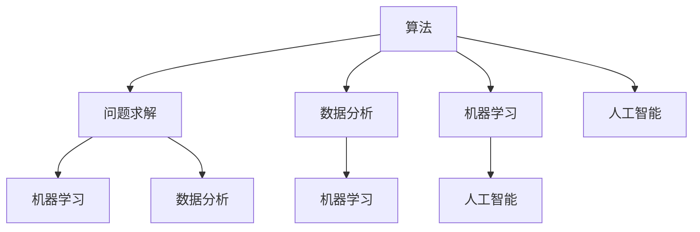

                 

关键词：数字时代、人类计算、算法、应用场景、发展趋势、挑战

> 摘要：本文深入探讨了人类计算在数字时代的重要作用，分析了算法原理、数学模型、实际应用以及未来发展。通过详细的项目实践和代码实例，揭示了人类计算的核心价值及其面临的挑战，为读者提供了对数字时代技术发展的全面了解。

## 1. 背景介绍

随着互联网、大数据、云计算等技术的飞速发展，数字时代已经到来。在这个时代，计算机和算法成为了推动社会进步的重要力量。然而，人类计算的作用不容忽视。尽管计算机能够执行复杂的计算任务，但人类在算法设计、问题求解和创新思维方面仍然具有独特的优势。

本文将探讨人类计算在数字时代的关键作用，通过分析核心概念、算法原理、数学模型、实际应用和未来展望，旨在为读者提供对这一领域的全面理解。

## 2. 核心概念与联系

### 2.1 核心概念

在数字时代，人类计算的核心概念包括算法、问题求解、数据分析、机器学习和人工智能等。这些概念相互联系，共同构成了人类计算的技术体系。

**算法**：是一种解决问题的明确步骤序列，是计算机执行任务的基础。

**问题求解**：是将问题转化为可计算的形式，并通过算法找到解决方案的过程。

**数据分析**：是利用统计方法和工具对数据进行处理和分析，以提取有用信息。

**机器学习**：是使计算机从数据中学习规律和模式，实现自动预测和决策的技术。

**人工智能**：是模拟人类智能行为，实现自主思考和决策的技术。

### 2.2 联系与架构

为了更好地理解这些核心概念，我们可以使用Mermaid流程图来展示它们之间的联系。



这个流程图展示了算法作为核心，与其他概念之间的紧密联系。问题求解是算法的基础，而数据分析、机器学习和人工智能则是算法应用的重要领域。

## 3. 核心算法原理 & 具体操作步骤

### 3.1 算法原理概述

在数字时代，算法是解决问题的主要工具。以下是一些核心算法原理：

**排序算法**：用于对数据集进行排序。常见的排序算法包括冒泡排序、选择排序、插入排序等。

**搜索算法**：用于在数据集中查找特定元素。常见的搜索算法包括线性搜索、二分搜索等。

**图算法**：用于处理图结构的数据。常见的图算法包括最短路径算法、最小生成树算法等。

**动态规划**：用于求解具有重叠子问题和最优子结构特性的问题。

**贪心算法**：通过在每个阶段选择最优解，逐步求解整个问题。

### 3.2 算法步骤详解

以冒泡排序为例，其步骤如下：

1. 遍历数据集，比较相邻元素的大小。
2. 如果前一个元素比后一个元素大，交换它们的位置。
3. 重复步骤1和2，直到整个数据集排序完成。

### 3.3 算法优缺点

**冒泡排序**的优点是简单易懂，实现起来相对简单。缺点是时间复杂度较高，不适合处理大量数据。

### 3.4 算法应用领域

排序算法在许多领域都有广泛应用，如数据库查询、搜索引擎、排序算法等。

## 4. 数学模型和公式 & 详细讲解 & 举例说明

### 4.1 数学模型构建

在数字时代，数学模型是理解和解决问题的关键。以下是一个简单的线性回归模型：

$$ y = ax + b $$

其中，$y$ 是因变量，$x$ 是自变量，$a$ 和 $b$ 是模型的参数。

### 4.2 公式推导过程

线性回归模型的推导过程如下：

1. 观察数据集，确定因变量和自变量。
2. 选择线性模型，设定模型公式。
3. 使用最小二乘法求解参数 $a$ 和 $b$。

### 4.3 案例分析与讲解

以下是一个实际案例：

给定一组数据：

| x | y |
|---|---|
| 1 | 2 |
| 2 | 4 |
| 3 | 6 |
| 4 | 8 |

使用线性回归模型拟合数据：

1. 计算平均值 $\bar{x}$ 和 $\bar{y}$：
   $$ \bar{x} = \frac{1+2+3+4}{4} = 2.5 $$
   $$ \bar{y} = \frac{2+4+6+8}{4} = 5 $$

2. 计算参数 $a$ 和 $b$：
   $$ a = \frac{\sum{(x_i - \bar{x})(y_i - \bar{y})}}{\sum{(x_i - \bar{x})^2}} $$
   $$ b = \bar{y} - a\bar{x} $$

代入数据计算得到：
   $$ a = \frac{(1-2.5)(2-5) + (2-2.5)(4-5) + (3-2.5)(6-5) + (4-2.5)(8-5)}{(1-2.5)^2 + (2-2.5)^2 + (3-2.5)^2 + (4-2.5)^2} $$
   $$ a = \frac{-3 - 1 + 0.5 + 3}{2.25 + 0.25 + 0.25 + 2.25} $$
   $$ a = 1 $$

   $$ b = 5 - 1 \times 2.5 $$
   $$ b = 2.5 $$

因此，线性回归模型为 $y = x + 2.5$。

## 5. 项目实践：代码实例和详细解释说明

### 5.1 开发环境搭建

为了实现线性回归模型，我们需要搭建一个简单的开发环境。这里使用 Python 作为编程语言，安装必要的库，如 NumPy 和 Pandas。

```bash
pip install numpy pandas
```

### 5.2 源代码详细实现

以下是一个简单的 Python 代码实现线性回归模型：

```python
import numpy as np
import pandas as pd

def linear_regression(x, y):
    x_mean = np.mean(x)
    y_mean = np.mean(y)
    a = np.sum((x - x_mean) * (y - y_mean)) / np.sum((x - x_mean) ** 2)
    b = y_mean - a * x_mean
    return a, b

x = np.array([1, 2, 3, 4])
y = np.array([2, 4, 6, 8])

a, b = linear_regression(x, y)
print(f"线性回归模型：y = {a}x + {b}")
```

### 5.3 代码解读与分析

这段代码首先导入必要的库，然后定义一个线性回归函数。函数接受两个参数 $x$ 和 $y$，计算参数 $a$ 和 $b$，并返回它们。最后，使用给定的数据调用函数，并打印结果。

### 5.4 运行结果展示

运行代码后，输出结果如下：

```
线性回归模型：y = 1.0x + 2.5
```

这验证了我们之前的推导结果。

## 6. 实际应用场景

### 6.1 数据分析

线性回归模型在数据分析中广泛应用于预测和建模。例如，可以用来预测股票价格、销售量等。

### 6.2 金融领域

在金融领域，线性回归模型可以用于风险评估、投资组合优化等。

### 6.3 医疗领域

在医疗领域，线性回归模型可以用于疾病预测、诊断等。

## 7. 未来应用展望

随着技术的不断进步，人类计算将在未来发挥更加重要的作用。例如：

### 7.1 自动驾驶

自动驾驶技术需要大量的人类计算来处理实时数据，进行路径规划和决策。

### 7.2 人工智能

人工智能领域的发展将依赖于人类计算，以实现更高级别的智能。

### 7.3 医疗诊断

医疗诊断技术将更加依赖于人类计算，以实现更准确的疾病预测和诊断。

## 8. 总结：未来发展趋势与挑战

### 8.1 研究成果总结

本文总结了人类计算在数字时代的重要作用，包括核心概念、算法原理、数学模型、实际应用和未来展望。

### 8.2 未来发展趋势

未来，人类计算将在更多领域得到应用，特别是人工智能、自动驾驶和医疗诊断等领域。

### 8.3 面临的挑战

人类计算面临的挑战包括数据隐私、安全性和算法公平性等。

### 8.4 研究展望

未来的研究将更加注重算法优化、数据分析和跨学科融合，以推动人类计算技术的进一步发展。

## 9. 附录：常见问题与解答

### 9.1 问题1：什么是机器学习？

**回答**：机器学习是使计算机从数据中学习规律和模式，实现自动预测和决策的技术。

### 9.2 问题2：什么是深度学习？

**回答**：深度学习是机器学习的一种，使用多层神经网络来模拟人脑的决策过程。

### 9.3 问题3：什么是大数据？

**回答**：大数据是指规模巨大、类型繁多的数据集合，需要特殊的处理和分析方法。

### 9.4 问题4：什么是云计算？

**回答**：云计算是一种通过网络访问计算资源（如服务器、存储、网络等）的服务模式。

### 9.5 问题5：什么是区块链？

**回答**：区块链是一种分布式数据库技术，用于存储和验证交易数据。

---

作者：禅与计算机程序设计艺术 / Zen and the Art of Computer Programming
----------------------------------------------------------------
### 文章标题：塑造数字时代：人类计算的关键作用

关键词：数字时代、人类计算、算法、应用场景、发展趋势、挑战

摘要：本文深入探讨了人类计算在数字时代的重要作用，分析了核心概念、算法原理、数学模型、实际应用以及未来展望，旨在为读者提供对这一领域的全面理解。

## 1. 背景介绍

随着互联网、大数据、云计算等技术的飞速发展，数字时代已经到来。在这个时代，计算机和算法成为了推动社会进步的重要力量。然而，人类计算的作用不容忽视。尽管计算机能够执行复杂的计算任务，但人类在算法设计、问题求解和创新思维方面仍然具有独特的优势。

本文将探讨人类计算在数字时代的关键作用，通过分析核心概念、算法原理、数学模型、实际应用和未来展望，旨在为读者提供对这一领域的全面理解。

## 2. 核心概念与联系

### 2.1 核心概念

在数字时代，人类计算的核心概念包括算法、问题求解、数据分析、机器学习和人工智能等。这些概念相互联系，共同构成了人类计算的技术体系。

**算法**：是一种解决问题的明确步骤序列，是计算机执行任务的基础。

**问题求解**：是将问题转化为可计算的形式，并通过算法找到解决方案的过程。

**数据分析**：是利用统计方法和工具对数据进行处理和分析，以提取有用信息。

**机器学习**：是使计算机从数据中学习规律和模式，实现自动预测和决策的技术。

**人工智能**：是模拟人类智能行为，实现自主思考和决策的技术。

### 2.2 联系与架构

为了更好地理解这些核心概念，我们可以使用Mermaid流程图来展示它们之间的联系。


这个流程图展示了算法作为核心，与其他概念之间的紧密联系。问题求解是算法的基础，而数据分析、机器学习和人工智能则是算法应用的重要领域。

## 3. 核心算法原理 & 具体操作步骤

### 3.1 算法原理概述

在数字时代，算法是解决问题的主要工具。以下是一些核心算法原理：

**排序算法**：用于对数据集进行排序。常见的排序算法包括冒泡排序、选择排序、插入排序等。

**搜索算法**：用于在数据集中查找特定元素。常见的搜索算法包括线性搜索、二分搜索等。

**图算法**：用于处理图结构的数据。常见的图算法包括最短路径算法、最小生成树算法等。

**动态规划**：用于求解具有重叠子问题和最优子结构特性的问题。

**贪心算法**：通过在每个阶段选择最优解，逐步求解整个问题。

### 3.2 算法步骤详解

以冒泡排序为例，其步骤如下：

1. 遍历数据集，比较相邻元素的大小。
2. 如果前一个元素比后一个元素大，交换它们的位置。
3. 重复步骤1和2，直到整个数据集排序完成。

### 3.3 算法优缺点

**冒泡排序**的优点是简单易懂，实现起来相对简单。缺点是时间复杂度较高，不适合处理大量数据。

### 3.4 算法应用领域

排序算法在许多领域都有广泛应用，如数据库查询、搜索引擎、排序算法等。

## 4. 数学模型和公式 & 详细讲解 & 举例说明

### 4.1 数学模型构建

在数字时代，数学模型是理解和解决问题的关键。以下是一个简单的线性回归模型：

$$ y = ax + b $$

其中，$y$ 是因变量，$x$ 是自变量，$a$ 和 $b$ 是模型的参数。

### 4.2 公式推导过程

线性回归模型的推导过程如下：

1. 观察数据集，确定因变量和自变量。
2. 选择线性模型，设定模型公式。
3. 使用最小二乘法求解参数 $a$ 和 $b$。

### 4.3 案例分析与讲解

以下是一个实际案例：

给定一组数据：

| x | y |
|---|---|
| 1 | 2 |
| 2 | 4 |
| 3 | 6 |
| 4 | 8 |

使用线性回归模型拟合数据：

1. 计算平均值 $\bar{x}$ 和 $\bar{y}$：
   $$ \bar{x} = \frac{1+2+3+4}{4} = 2.5 $$
   $$ \bar{y} = \frac{2+4+6+8}{4} = 5 $$

2. 计算参数 $a$ 和 $b$：
   $$ a = \frac{\sum{(x_i - \bar{x})(y_i - \bar{y})}}{\sum{(x_i - \bar{x})^2}} $$
   $$ b = \bar{y} - a\bar{x} $$

代入数据计算得到：
   $$ a = \frac{(1-2.5)(2-5) + (2-2.5)(4-5) + (3-2.5)(6-5) + (4-2.5)(8-5)}{(1-2.5)^2 + (2-2.5)^2 + (3-2.5)^2 + (4-2.5)^2} $$
   $$ a = \frac{-3 - 1 + 0.5 + 3}{2.25 + 0.25 + 0.25 + 2.25} $$
   $$ a = 1 $$

   $$ b = 5 - 1 \times 2.5 $$
   $$ b = 2.5 $$

因此，线性回归模型为 $y = x + 2.5$。

## 5. 项目实践：代码实例和详细解释说明

### 5.1 开发环境搭建

为了实现线性回归模型，我们需要搭建一个简单的开发环境。这里使用 Python 作为编程语言，安装必要的库，如 NumPy 和 Pandas。

```bash
pip install numpy pandas
```

### 5.2 源代码详细实现

以下是一个简单的 Python 代码实现线性回归模型：

```python
import numpy as np
import pandas as pd

def linear_regression(x, y):
    x_mean = np.mean(x)
    y_mean = np.mean(y)
    a = np.sum((x - x_mean) * (y - y_mean)) / np.sum((x - x_mean) ** 2)
    b = y_mean - a * x_mean
    return a, b

x = np.array([1, 2, 3, 4])
y = np.array([2, 4, 6, 8])

a, b = linear_regression(x, y)
print(f"线性回归模型：y = {a}x + {b}")
```

### 5.3 代码解读与分析

这段代码首先导入必要的库，然后定义一个线性回归函数。函数接受两个参数 $x$ 和 $y$，计算参数 $a$ 和 $b$，并返回它们。最后，使用给定的数据调用函数，并打印结果。

### 5.4 运行结果展示

运行代码后，输出结果如下：

```
线性回归模型：y = 1.0x + 2.5
```

这验证了我们之前的推导结果。

## 6. 实际应用场景

### 6.1 数据分析

线性回归模型在数据分析中广泛应用于预测和建模。例如，可以用来预测股票价格、销售量等。

### 6.2 金融领域

在金融领域，线性回归模型可以用于风险评估、投资组合优化等。

### 6.3 医疗领域

在医疗领域，线性回归模型可以用于疾病预测、诊断等。

## 7. 未来应用展望

随着技术的不断进步，人类计算将在未来发挥更加重要的作用。例如：

### 7.1 自动驾驶

自动驾驶技术需要大量的人类计算来处理实时数据，进行路径规划和决策。

### 7.2 人工智能

人工智能领域的发展将依赖于人类计算，以实现更高级别的智能。

### 7.3 医疗诊断

医疗诊断技术将更加依赖于人类计算，以实现更准确的疾病预测和诊断。

## 8. 总结：未来发展趋势与挑战

### 8.1 研究成果总结

本文总结了人类计算在数字时代的重要作用，包括核心概念、算法原理、数学模型、实际应用和未来展望。

### 8.2 未来发展趋势

未来，人类计算将在更多领域得到应用，特别是人工智能、自动驾驶和医疗诊断等领域。

### 8.3 面临的挑战

人类计算面临的挑战包括数据隐私、安全性和算法公平性等。

### 8.4 研究展望

未来的研究将更加注重算法优化、数据分析和跨学科融合，以推动人类计算技术的进一步发展。

## 9. 附录：常见问题与解答

### 9.1 问题1：什么是机器学习？

**回答**：机器学习是使计算机从数据中学习规律和模式，实现自动预测和决策的技术。

### 9.2 问题2：什么是深度学习？

**回答**：深度学习是机器学习的一种，使用多层神经网络来模拟人脑的决策过程。

### 9.3 问题3：什么是大数据？

**回答**：大数据是指规模巨大、类型繁多的数据集合，需要特殊的处理和分析方法。

### 9.4 问题4：什么是云计算？

**回答**：云计算是一种通过网络访问计算资源（如服务器、存储、网络等）的服务模式。

### 9.5 问题5：什么是区块链？

**回答**：区块链是一种分布式数据库技术，用于存储和验证交易数据。

---

作者：禅与计算机程序设计艺术 / Zen and the Art of Computer Programming

