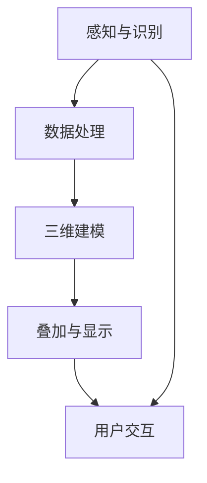

                 

关键词：增强现实，技术实现，算法原理，数学模型，应用场景，未来展望

> 摘要：本文将深入探讨增强现实技术（AR）的技术实现，从核心概念、算法原理、数学模型、项目实践到实际应用，全面解析AR技术的现状与未来发展趋势。作者：禅与计算机程序设计艺术 / Zen and the Art of Computer Programming

## 1. 背景介绍

增强现实（Augmented Reality，简称AR）是一种将虚拟信息与现实世界叠加的技术。它通过在真实场景中叠加数字信息，如图像、视频、音频等，为用户带来更加丰富和互动的体验。与虚拟现实（VR）不同，AR并不完全替代现实，而是在现实基础上进行增强。

增强现实技术的发展可以追溯到20世纪90年代。随着计算机性能的提升和传感技术的进步，AR技术逐渐从实验室走向应用，并在教育、医疗、娱乐、军事等多个领域展现出巨大的潜力。本文旨在探讨AR技术的技术实现，包括核心算法、数学模型和实际应用，以及对其未来发展的展望。

### 核心概念与联系

为了更好地理解增强现实技术，我们需要了解几个核心概念和它们之间的联系。以下是使用Mermaid绘制的流程图：



#### 1.1 感知与识别

感知与识别是AR技术的第一步。它涉及到如何从现实场景中获取信息，并对这些信息进行识别和处理。常用的技术包括计算机视觉、深度学习、图像识别等。

#### 1.2 数据处理

数据处理是对获取的信息进行预处理和分析。这通常涉及到图像处理、几何变换、特征提取等操作，以提取出有用的信息。

#### 1.3 三维建模

三维建模是将获取的信息转换为三维模型。这可以通过三维扫描、模型重建等技术实现。

#### 1.4 叠加与显示

叠加与显示是将虚拟信息与现实世界中的三维模型叠加，并通过显示设备（如AR眼镜、智能手机等）呈现给用户。

#### 1.5 用户交互

用户交互是用户与增强现实系统的互动。它涉及到如何设计用户界面，以及如何响应用户的操作。

## 2. 核心算法原理 & 具体操作步骤

### 2.1 算法原理概述

增强现实技术的核心算法主要包括计算机视觉、深度学习、图像识别、三维建模和用户交互等方面。以下是对这些算法的简要概述：

#### 2.1.1 计算机视觉

计算机视觉是AR技术的基础，它涉及到如何从图像或视频中提取有用信息。常用的算法包括图像处理、特征提取、目标检测等。

#### 2.1.2 深度学习

深度学习是近年来计算机视觉领域的重要进展。通过神经网络模型，深度学习可以从大量数据中自动学习特征，从而实现复杂的视觉任务。

#### 2.1.3 图像识别

图像识别是计算机视觉的一个重要分支，它涉及到如何从图像中识别出特定的对象或场景。

#### 2.1.4 三维建模

三维建模是将现实场景中的物体转换为三维模型。常用的技术包括三维扫描、模型重建等。

#### 2.1.5 用户交互

用户交互是用户与AR系统的互动。它涉及到如何设计用户界面，以及如何响应用户的操作。

### 2.2 算法步骤详解

#### 2.2.1 感知与识别

感知与识别的过程可以分为以下几个步骤：

1. **图像获取**：通过摄像头或其他传感器获取现实场景的图像。
2. **预处理**：对图像进行缩放、裁剪、增强等预处理操作。
3. **特征提取**：提取图像中的关键特征，如边缘、角点、纹理等。
4. **目标检测**：利用深度学习模型或其他算法检测图像中的目标物体。

#### 2.2.2 数据处理

数据处理的过程可以分为以下几个步骤：

1. **图像处理**：对图像进行滤波、分割、边缘检测等操作。
2. **几何变换**：对图像进行旋转、缩放、平移等几何变换。
3. **特征提取**：提取图像中的关键特征。
4. **目标跟踪**：跟踪图像中的目标物体。

#### 2.2.3 三维建模

三维建模的过程可以分为以下几个步骤：

1. **三维扫描**：使用激光雷达或其他三维扫描设备获取物体的三维数据。
2. **模型重建**：将三维数据转换为三维模型。
3. **纹理映射**：将图像纹理映射到三维模型上。

#### 2.2.4 叠加与显示

叠加与显示的过程可以分为以下几个步骤：

1. **虚拟物体生成**：根据算法生成的虚拟物体。
2. **叠加处理**：将虚拟物体与现实场景中的物体进行叠加。
3. **显示**：通过显示设备将叠加后的图像呈现给用户。

#### 2.2.5 用户交互

用户交互的过程可以分为以下几个步骤：

1. **用户界面设计**：设计用户界面，包括菜单、按钮、对话框等。
2. **用户操作识别**：识别用户的操作，如点击、滑动等。
3. **响应与反馈**：根据用户的操作进行响应，并给予反馈。

### 2.3 算法优缺点

#### 2.3.1 优点

1. **增强现实体验**：通过叠加虚拟信息，AR技术可以为用户提供更加丰富和互动的体验。
2. **实时性**：AR技术可以实时获取和处理现实场景的信息，响应速度快。
3. **应用广泛**：AR技术可以在多个领域应用，如教育、医疗、娱乐等。

#### 2.3.2 缺点

1. **技术复杂**：AR技术涉及多个学科领域，技术实现复杂。
2. **性能受限**：目前AR设备的性能和显示效果仍需提升。
3. **隐私问题**：AR技术可能涉及用户的隐私信息，需要妥善处理。

### 2.4 算法应用领域

AR技术的应用领域广泛，主要包括以下几个方面：

1. **教育**：通过AR技术，学生可以更加生动地学习知识，提高学习兴趣和效果。
2. **医疗**：AR技术可以辅助医生进行手术、诊断等，提高医疗水平。
3. **娱乐**：AR游戏和AR应用为用户带来全新的娱乐体验。
4. **军事**：AR技术可以用于军事模拟、战场态势感知等。

## 4. 数学模型和公式 & 详细讲解 & 举例说明

### 4.1 数学模型构建

在增强现实技术中，数学模型构建是至关重要的一步。它涉及到如何从现实场景中提取信息，并将其转换为数学模型，以便进行后续处理。

#### 4.1.1 三维建模

三维建模通常使用以下数学模型：

1. **点云模型**：通过激光雷达或深度相机获取场景的点云数据，点云模型可以表示场景的三维结构。
2. **体素模型**：将场景划分为体素（三维像素），每个体素包含一个或多个像素值，体素模型可以用于场景的渲染和重建。
3. **网格模型**：使用顶点和面片表示场景的三维结构，网格模型可以用于场景的渲染和动画。

#### 4.1.2 图像识别

图像识别通常使用以下数学模型：

1. **卷积神经网络（CNN）**：CNN是一种深度学习模型，可以用于图像分类、目标检测等任务。
2. **循环神经网络（RNN）**：RNN可以处理序列数据，可以用于图像序列的识别和视频分析。

### 4.2 公式推导过程

以下是一个简单的图像识别的数学模型推导过程：

#### 4.2.1 输入图像

假设我们有一个输入图像 $I$，其大小为 $m \times n$，表示为矩阵形式：

$$
I = \begin{bmatrix}
I_{11} & I_{12} & \cdots & I_{1n} \\
I_{21} & I_{22} & \cdots & I_{2n} \\
\vdots & \vdots & \ddots & \vdots \\
I_{m1} & I_{m2} & \cdots & I_{mn}
\end{bmatrix}
$$

#### 4.2.2 特征提取

通过卷积神经网络对图像进行特征提取，假设卷积神经网络的输出为 $F$，其大小为 $k \times l$：

$$
F = \begin{bmatrix}
F_{11} & F_{12} & \cdots & F_{1l} \\
F_{21} & F_{22} & \cdots & F_{2l} \\
\vdots & \vdots & \ddots & \vdots \\
F_{k1} & F_{k2} & \cdots & F_{kl}
\end{bmatrix}
$$

#### 4.2.3 目标检测

通过目标检测算法，我们可以将特征图 $F$ 转换为目标区域 $R$，其大小为 $p \times q$：

$$
R = \begin{bmatrix}
R_{11} & R_{12} & \cdots & R_{1q} \\
R_{21} & R_{22} & \cdots & R_{2q} \\
\vdots & \vdots & \ddots & \vdots \\
R_{p1} & R_{p2} & \cdots & R_{pq}
\end{bmatrix}
$$

#### 4.2.4 分类

通过分类算法，我们可以将目标区域 $R$ 分为不同的类别，假设分类结果为 $C$，其大小为 $r \times s$：

$$
C = \begin{bmatrix}
C_{11} & C_{12} & \cdots & C_{1s} \\
C_{21} & C_{22} & \cdots & C_{2s} \\
\vdots & \vdots & \ddots & \vdots \\
C_{r1} & C_{r2} & \cdots & C_{rs}
\end{bmatrix}
$$

### 4.3 案例分析与讲解

以下是一个简单的图像识别的案例：

#### 4.3.1 数据集

假设我们有一个包含1000张图片的数据集，每张图片都是一个数字（0-9），我们需要对这些数字进行分类。

#### 4.3.2 特征提取

通过卷积神经网络对每张图片进行特征提取，提取到的特征图大小为 $10 \times 10$。

#### 4.3.3 目标检测

通过目标检测算法，将特征图划分为10个区域，每个区域代表一个数字。

#### 4.3.4 分类

通过分类算法，对每个区域进行分类，得到分类结果。

## 5. 项目实践：代码实例和详细解释说明

### 5.1 开发环境搭建

为了进行增强现实技术的项目实践，我们需要搭建一个开发环境。以下是一个简单的开发环境搭建过程：

1. **安装Python**：确保安装了Python 3.7及以上版本。
2. **安装PyTorch**：使用以下命令安装PyTorch：
   ```bash
   pip install torch torchvision
   ```
3. **安装OpenCV**：使用以下命令安装OpenCV：
   ```bash
   pip install opencv-python
   ```

### 5.2 源代码详细实现

以下是一个简单的增强现实项目实现，它使用OpenCV和PyTorch进行图像识别。

```python
import cv2
import torch
import torchvision
import torchvision.transforms as transforms

# 加载预训练的模型
model = torchvision.models.resnet18(pretrained=True)
model.eval()

# 定义图像预处理函数
transform = transforms.Compose([
    transforms.ToTensor(),
    transforms.Normalize(mean=[0.485, 0.456, 0.406], std=[0.229, 0.224, 0.225]),
])

# 读取图像
image = cv2.imread('image.jpg')

# 将图像转换为PyTorch张量
tensor = transform(image)

# 将张量添加一个维度，以匹配模型的输入要求
tensor = tensor.unsqueeze(0)

# 使用模型进行预测
with torch.no_grad():
    prediction = model(tensor)

# 获取预测结果
predicted_label = prediction.argmax().item()

# 将预测结果转换为数字
predicted_number = int(predicted_label)

# 输出预测结果
print(f'Predicted number: {predicted_number}')

# 在图像上绘制数字
cv2.putText(image, f'Number: {predicted_number}', (10, 30), cv2.FONT_HERSHEY_SIMPLEX, 1, (0, 0, 255), 2)

# 显示图像
cv2.imshow('Image', image)
cv2.waitKey(0)
cv2.destroyAllWindows()
```

### 5.3 代码解读与分析

1. **加载模型**：我们使用预训练的ResNet18模型进行图像识别。
2. **图像预处理**：将图像转换为PyTorch张量，并进行归一化处理。
3. **预测**：使用模型进行预测，并获取预测结果。
4. **绘制结果**：在图像上绘制预测结果。

## 6. 实际应用场景

### 6.1 教育

增强现实技术可以在教育领域发挥重要作用。例如，通过AR技术，学生可以更加生动地学习历史、科学、地理等学科知识。老师可以在课堂上使用AR设备，将虚拟物体叠加到现实场景中，让学生更加直观地理解知识。

### 6.2 医疗

增强现实技术在医疗领域也有广泛应用。医生可以使用AR设备进行手术指导，实时查看患者体内的三维结构，提高手术的准确性和安全性。此外，AR技术还可以用于医学教育，为学生提供更加真实的医学训练。

### 6.3 娱乐

增强现实技术为娱乐领域带来了全新的体验。AR游戏和AR应用吸引了大量用户，如《精灵宝可梦GO》等。用户可以在现实世界中捕捉虚拟宠物，体验更加丰富的娱乐内容。

### 6.4 军事

增强现实技术在军事领域也有重要应用。士兵可以使用AR设备进行战场态势感知，实时获取敌军位置、地形等信息，提高作战效果。此外，AR技术还可以用于军事模拟和训练，为士兵提供更加真实的训练环境。

## 7. 工具和资源推荐

### 7.1 学习资源推荐

1. **《深度学习》**：Goodfellow、Bengio和Courville合著的《深度学习》是一本深度学习领域的经典教材，适合初学者和专业人士。
2. **《计算机视觉》**：Rogers和Leung合著的《计算机视觉》是一本计算机视觉领域的经典教材，适合初学者和专业人士。

### 7.2 开发工具推荐

1. **PyTorch**：PyTorch是一个强大的深度学习框架，适合进行AR技术项目开发。
2. **OpenCV**：OpenCV是一个开源的计算机视觉库，提供了丰富的图像处理和计算机视觉功能。

### 7.3 相关论文推荐

1. **“Fusion of GPS, Inertial Sensors and a Camera for Robust Pose Estimation of Augmented Reality Applications”**：该论文介绍了如何在增强现实应用中融合GPS、惯性传感器和摄像头进行姿态估计。
2. **“Object Detection with Publication: A PyTorch Implementation of the DETR Algorithm”**：该论文介绍了一种基于PyTorch的检测算法DETR的实现，适合进行图像识别和目标检测。

## 8. 总结：未来发展趋势与挑战

### 8.1 研究成果总结

增强现实技术在过去几十年中取得了显著的进展。从早期的简单叠加技术到如今的复杂算法和高质量显示效果，AR技术已经逐步走向应用。主要研究成果包括：

1. **算法优化**：通过深度学习、计算机视觉等技术的进步，AR算法的准确性和实时性得到了显著提高。
2. **硬件发展**：随着硬件性能的提升，如高性能摄像头、传感器和显示设备的出现，AR设备的性能和用户体验得到了提升。
3. **应用拓展**：AR技术已经在教育、医疗、娱乐、军事等多个领域得到广泛应用，显示出巨大的潜力。

### 8.2 未来发展趋势

未来，增强现实技术将继续发展，并呈现出以下趋势：

1. **更高分辨率和更小体积**：随着硬件技术的进步，AR设备的分辨率和体积将进一步减小，为更多应用场景提供支持。
2. **更复杂的交互**：随着人工智能和交互技术的进步，AR设备的交互方式将更加多样和自然。
3. **更多应用场景**：AR技术将在更多领域得到应用，如工业制造、建筑设计、虚拟现实等。

### 8.3 面临的挑战

虽然增强现实技术发展迅速，但仍面临一些挑战：

1. **算法复杂度**：AR技术涉及多个学科领域，算法复杂度高，实现难度大。
2. **隐私保护**：AR技术可能涉及用户的隐私信息，需要妥善处理。
3. **用户体验**：尽管硬件性能不断提升，但用户体验仍需改进，如延迟、眩晕等问题。

### 8.4 研究展望

未来，增强现实技术的研究重点将包括：

1. **算法优化**：研究更加高效、准确的算法，提高AR技术的性能。
2. **隐私保护**：研究更加安全的隐私保护机制，确保用户信息的安全。
3. **跨学科融合**：将AR技术与更多学科领域相结合，如心理学、教育学等，以提升用户体验。

## 9. 附录：常见问题与解答

### 9.1 如何实现图像识别？

图像识别是增强现实技术的重要组成部分。以下是一个简单的实现步骤：

1. **数据集准备**：准备包含各种图像的数据集，并进行预处理。
2. **模型训练**：使用深度学习模型（如卷积神经网络）对图像进行训练。
3. **预测**：使用训练好的模型对新的图像进行预测。

### 9.2 增强现实技术有哪些应用场景？

增强现实技术在多个领域有广泛应用，主要包括：

1. **教育**：用于教学、培训等。
2. **医疗**：用于手术指导、医学教育等。
3. **娱乐**：用于游戏、影视等。
4. **军事**：用于战场态势感知、军事模拟等。

### 9.3 如何搭建AR开发环境？

搭建AR开发环境通常包括以下步骤：

1. **安装Python和PyTorch**：用于深度学习模型的训练和预测。
2. **安装OpenCV**：用于图像处理和计算机视觉功能。
3. **准备开发工具**：如AR开发框架（如ARKit、ARCore等）。

以上是关于增强现实技术的技术实现的文章，希望对您有所帮助。如果您有任何问题或建议，请随时提出。

