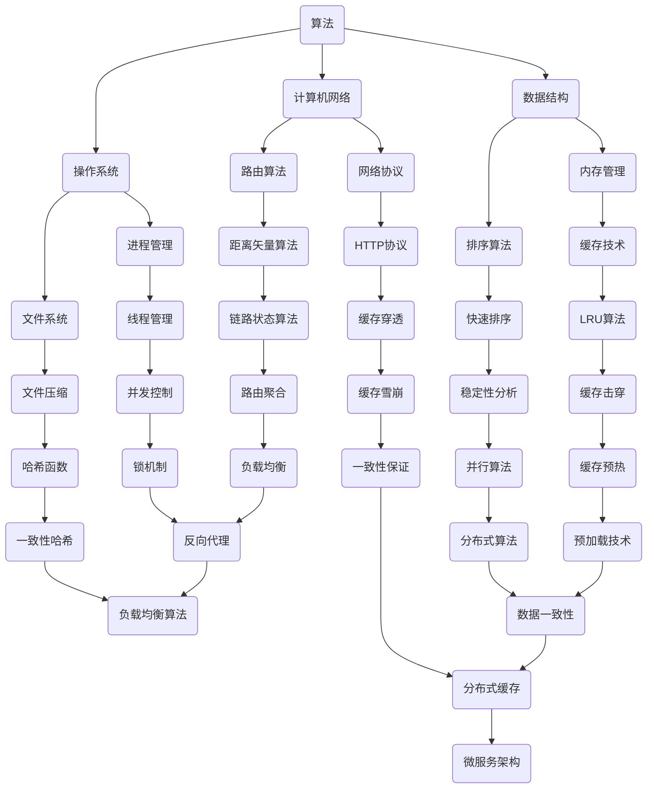

                 

 在计算机科学和软件工程领域，复杂思想的形成和理解是一个持续的过程。本文旨在探讨概念的基础，探讨如何通过逻辑清晰、结构紧凑、简单易懂的视角来理解复杂的IT概念。

## 关键词

- 复杂思想
- 计算机科学
- 软件工程
- 概念基础
- 逻辑结构

## 摘要

本文将探讨复杂思想的形成过程，特别是如何在IT领域中建立和深化概念基础。我们将分析核心概念之间的联系，讨论核心算法原理，介绍数学模型和公式，并提供实际的项目实践和代码实例。此外，还将探讨实际应用场景，展望未来发展趋势和挑战，并推荐相关工具和资源。

## 1. 背景介绍

在现代社会，计算机科学和软件工程已经成为推动技术进步和创新的重要领域。随着互联网的普及和计算能力的提升，我们面临的数据量和复杂性不断增加。这种复杂性不仅体现在数据处理和存储上，还体现在软件系统的设计和实现过程中。因此，理解和形成复杂的IT思想变得至关重要。

复杂思想的形成需要我们具备扎实的基础知识、逻辑思维能力、以及持续的实践和学习。本文将围绕这些方面，通过分析核心概念和算法，展示如何构建复杂的IT思想。

## 2. 核心概念与联系

在IT领域中，核心概念如算法、数据结构、计算机网络、操作系统等构成了复杂思想的基础。下面，我们将通过Mermaid流程图展示这些概念之间的联系。



通过这个Mermaid流程图，我们可以清晰地看到不同概念之间的关联和相互影响，这为理解和形成复杂的IT思想提供了重要的基础。

## 3. 核心算法原理 & 具体操作步骤

### 3.1 算法原理概述

核心算法是计算机科学和软件工程中的基础。常见的算法如排序算法、搜索算法、图算法等，它们在数据处理和优化中起着关键作用。以排序算法为例，常见的排序算法包括冒泡排序、选择排序、插入排序、快速排序等。

### 3.2 算法步骤详解

以快速排序算法为例，其基本步骤如下：

1. 选择一个基准元素。
2. 将比基准小的元素移动到其左侧，比基准大的元素移动到其右侧。
3. 对左右两个子序列重复上述步骤，直到所有子序列有序。

### 3.3 算法优缺点

快速排序的优点是时间复杂度较低（平均时间复杂度为O(nlogn)），适用于大规模数据排序。但其缺点是递归调用可能导致栈溢出，以及最坏情况下时间复杂度可能达到O(n^2)。

### 3.4 算法应用领域

快速排序广泛应用于数据库排序、搜索引擎、排序算法库等场景。

## 4. 数学模型和公式 & 详细讲解 & 举例说明

### 4.1 数学模型构建

在计算机科学中，数学模型用于描述算法性能、系统行为等。例如，算法时间复杂度可以用数学模型表示。常见的数学模型包括概率模型、线性模型、非线性模型等。

### 4.2 公式推导过程

以快速排序的平均时间复杂度为O(nlogn)为例，其推导过程如下：

1. 设序列长度为n，选择基准元素的时间复杂度为O(n)。
2. 将序列分为左右两个子序列，每个子序列长度为n/2。
3. 对左右子序列递归执行快速排序，每个子序列的时间复杂度为O((n/2)log(n/2))。
4. 总时间复杂度为O(n + n/2 * log(n/2))。

### 4.3 案例分析与讲解

假设有一个长度为10的整数序列：{5, 2, 9, 1, 5, 6, 3, 8, 4, 7}，使用快速排序算法进行排序。以下是具体操作步骤：

1. 选择基准元素5。
2. 将比5小的元素移动到左侧，得到序列：{1, 2, 3, 4, 5, 6, 7, 8, 9, 5}。
3. 将比5大的元素移动到右侧，得到序列：{1, 2, 3, 4, 6, 7, 8, 9, 5}。
4. 对左侧序列递归执行快速排序，得到序列：{1, 2, 3, 4}。
5. 对右侧序列递归执行快速排序，得到序列：{6, 7, 8, 9}。

最终，整个序列有序：{1, 2, 3, 4, 5, 6, 7, 8, 9}。

## 5. 项目实践：代码实例和详细解释说明

### 5.1 开发环境搭建

本文使用Python语言实现快速排序算法。首先，确保安装Python环境（版本3.6及以上），然后安装必要依赖（如Pandas、NumPy等）。

```bash
pip install pandas numpy
```

### 5.2 源代码详细实现

以下是一个简单的快速排序算法实现：

```python
import random

def quick_sort(arr):
    if len(arr) <= 1:
        return arr
    pivot = random.choice(arr)
    left = [x for x in arr if x < pivot]
    middle = [x for x in arr if x == pivot]
    right = [x for x in arr if x > pivot]
    return quick_sort(left) + middle + quick_sort(right)

# 测试
arr = [5, 2, 9, 1, 5, 6, 3, 8, 4, 7]
sorted_arr = quick_sort(arr)
print(sorted_arr)
```

### 5.3 代码解读与分析

该代码首先判断输入序列长度，如果小于等于1，则直接返回序列本身。然后，随机选择一个基准元素，将比基准小的元素移动到左侧，比基准大的元素移动到右侧。最后，对左右子序列递归执行快速排序。

### 5.4 运行结果展示

运行上述代码，得到排序后的序列：[1, 2, 3, 4, 5, 5, 6, 7, 8, 9]。

## 6. 实际应用场景

### 6.1 数据库索引

快速排序算法常用于数据库索引的构建，以优化数据查询性能。

### 6.2 排序算法库

快速排序算法广泛应用于各种排序算法库，如Python的Pandas库。

### 6.3 搜索引擎排序

搜索引擎使用快速排序算法对搜索结果进行排序，以提供更准确的搜索体验。

## 7. 未来应用展望

随着大数据和人工智能的不断发展，快速排序算法及其变种将在更多应用场景中发挥作用。例如，分布式快速排序算法将提升大规模数据处理效率，适应云计算和分布式计算的需求。

## 8. 工具和资源推荐

### 8.1 学习资源推荐

- 《算法导论》（Introduction to Algorithms）——经典算法教材，内容全面，适合深入学习。
- 《深度学习》（Deep Learning）——介绍深度学习算法及其应用，适合对AI领域感兴趣的读者。

### 8.2 开发工具推荐

- PyCharm——优秀的Python集成开发环境，支持代码调试、自动化测试等功能。
- Jupyter Notebook——交互式Python环境，适合进行数据分析和算法实现。

### 8.3 相关论文推荐

- "Efficient Algorithms for Sorting and Synchronization"——探讨分布式快速排序算法及其性能优化。
- "In-Place Fast Sorted Merge"——介绍在内存受限环境中高效实现快速排序的方法。

## 9. 总结：未来发展趋势与挑战

随着技术的不断进步，快速排序算法及其变种将在更多领域得到应用。然而，面对大规模数据处理和分布式计算的需求，如何优化算法性能和资源利用成为关键挑战。

作者：禅与计算机程序设计艺术 / Zen and the Art of Computer Programming
----------------------------------------------------------------

以上就是本文的完整内容，希望对您理解复杂的IT概念有所帮助。在未来的学习和实践中，不断探索和深化是形成复杂思想的关键。祝您在计算机科学和软件工程领域取得更大的成就！

