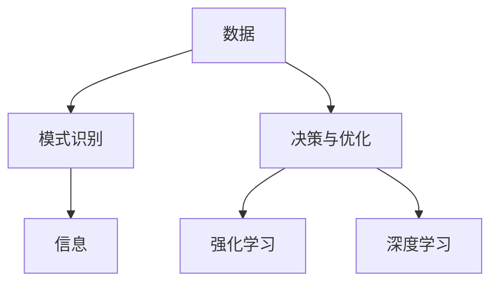
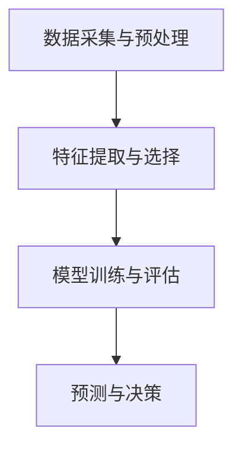

                 

 在当今这个快速发展的数字时代，人工智能（AI）已经成为了一个至关重要的技术领域。从自动驾驶汽车到智能医疗诊断，AI正在深刻地改变着我们的生活方式。然而，随着AI技术的不断进步，它在我们解决复杂问题方面的角色也在不断演变。本文将探讨AI在复杂问题解决中的新角色，包括其核心概念、算法原理、数学模型、实际应用以及未来展望。

## 关键词
- 人工智能
- 复杂问题解决
- 算法
- 数学模型
- 实际应用
- 未来展望

## 摘要
本文旨在探讨人工智能在复杂问题解决中的新角色。通过分析AI的核心概念、算法原理、数学模型，以及其在实际应用中的表现，我们将会看到AI如何在各个领域中发挥作用，并探讨其未来的发展趋势和挑战。

### 1. 背景介绍

在过去的几十年里，人工智能经历了巨大的发展。从最初的符号主义到连接主义，再到现代的深度学习，AI技术不断进步，使其在处理复杂问题上展现出强大的潜力。然而，传统的AI方法在处理复杂问题时仍然面临一些挑战，如数据量庞大、问题空间复杂等。

随着大数据和云计算的发展，AI在处理复杂问题方面的能力得到了显著提升。深度学习、强化学习等新型算法的出现，使得AI在图像识别、自然语言处理、决策优化等领域取得了突破性的进展。这些进展为AI在复杂问题解决中的新角色奠定了基础。

### 2. 核心概念与联系

在探讨AI在复杂问题解决中的新角色之前，我们需要了解一些核心概念和它们之间的联系。

#### 2.1 数据与信息
数据是AI的基石，而信息则是从数据中提取的有用知识。AI通过学习大量数据，从中提取模式和规律，以便在新的场景中做出预测和决策。

#### 2.2 模式识别
模式识别是AI的核心任务之一，它涉及从数据中识别出有用的模式。在复杂问题解决中，模式识别可以帮助AI发现关键特征，从而提高问题的可解性。

#### 2.3 决策与优化
决策与优化是AI在复杂问题解决中的另一个重要任务。通过优化算法，AI可以在给定的约束条件下找到最优解，从而提高问题的解决效率。

#### 2.4 强化学习与深度学习
强化学习与深度学习是AI解决复杂问题的两种主要方法。强化学习通过试错来学习策略，而深度学习则通过层次化的神经网络来提取特征。

为了更好地理解这些概念之间的联系，我们可以使用Mermaid流程图来展示它们之间的关系。



### 3. 核心算法原理 & 具体操作步骤

在了解了核心概念后，我们来探讨一些AI在复杂问题解决中的核心算法原理和具体操作步骤。

#### 3.1 算法原理概述

AI解决复杂问题通常包括以下几个步骤：

1. 数据采集与预处理：收集相关数据，并进行数据清洗和预处理，以便于后续分析。
2. 特征提取与选择：从原始数据中提取有用的特征，并进行选择，以减少数据的冗余性。
3. 模型训练与评估：利用训练数据训练模型，并通过验证数据评估模型性能。
4. 预测与决策：利用训练好的模型对新数据进行预测，并做出相应的决策。

#### 3.2 算法步骤详解

以下是一个简单的算法流程：



#### 3.3 算法优缺点

每种算法都有其优缺点，以下是几种常见算法的优缺点分析：

1. **线性回归**：
   - 优点：简单易懂，计算速度快。
   - 缺点：对非线性问题效果不佳，容易过拟合。

2. **决策树**：
   - 优点：易于理解和解释，对非线性问题有一定效果。
   - 缺点：容易过拟合，对大规模数据处理能力有限。

3. **支持向量机（SVM）**：
   - 优点：在高维空间中性能优越，对非线性问题有较好的处理能力。
   - 缺点：训练时间较长，对异常值敏感。

4. **神经网络**：
   - 优点：可以处理复杂的非线性问题，具有良好的泛化能力。
   - 缺点：计算复杂度高，对数据质量要求较高。

#### 3.4 算法应用领域

AI算法在复杂问题解决中的应用领域广泛，包括但不限于：

1. **图像识别**：通过深度学习算法，AI可以识别出图像中的物体、场景等。
2. **自然语言处理**：利用深度学习模型，AI可以理解和生成自然语言。
3. **医疗诊断**：通过分析大量的医学数据，AI可以帮助医生进行疾病的诊断。
4. **交通规划**：利用优化算法，AI可以帮助优化交通路线，减少拥堵。

### 4. 数学模型和公式 & 详细讲解 & 举例说明

在复杂问题解决中，数学模型和公式起到了关键作用。以下将介绍一些常见的数学模型和公式，并详细讲解它们的推导过程和实际应用。

#### 4.1 数学模型构建

数学模型构建是AI解决复杂问题的关键步骤。以下是一个简单的线性回归模型：

$$
y = \beta_0 + \beta_1x_1 + \beta_2x_2 + \cdots + \beta_nx_n
$$

其中，$y$ 是目标变量，$x_1, x_2, \ldots, x_n$ 是特征变量，$\beta_0, \beta_1, \beta_2, \ldots, \beta_n$ 是模型的参数。

#### 4.2 公式推导过程

线性回归模型的公式可以通过最小二乘法推导得出。最小二乘法的核心思想是找到一组参数，使得目标函数 $L(\beta_0, \beta_1, \beta_2, \ldots, \beta_n)$ 最小。

$$
L(\beta_0, \beta_1, \beta_2, \ldots, \beta_n) = \sum_{i=1}^n (y_i - (\beta_0 + \beta_1x_{i1} + \beta_2x_{i2} + \cdots + \beta_nx_{in}))^2
$$

通过对目标函数求导并令其导数为零，可以得到参数的估计值。

$$
\frac{\partial L}{\partial \beta_0} = 0 \\
\frac{\partial L}{\partial \beta_1} = 0 \\
\vdots \\
\frac{\partial L}{\partial \beta_n} = 0
$$

解这个方程组，我们可以得到参数的估计值。

#### 4.3 案例分析与讲解

以下是一个简单的线性回归案例：

假设我们有一个数据集，包含以下特征变量和目标变量：

$$
\begin{array}{cccc}
x_1 & x_2 & y \\
\hline
1 & 2 & 3 \\
2 & 4 & 5 \\
3 & 6 & 7 \\
4 & 8 & 9 \\
\end{array}
$$

我们的目标是找到线性回归模型 $y = \beta_0 + \beta_1x_1 + \beta_2x_2$ 的参数。

首先，我们计算目标函数 $L(\beta_0, \beta_1, \beta_2)$：

$$
L(\beta_0, \beta_1, \beta_2) = \sum_{i=1}^4 (y_i - (\beta_0 + \beta_1x_{i1} + \beta_2x_{i2}))^2
$$

然后，我们对目标函数求导并令其导数为零，得到以下方程组：

$$
\frac{\partial L}{\partial \beta_0} = -2\sum_{i=1}^4 (y_i - (\beta_0 + \beta_1x_{i1} + \beta_2x_{i2})) = 0 \\
\frac{\partial L}{\partial \beta_1} = -2\sum_{i=1}^4 x_{i1}(y_i - (\beta_0 + \beta_1x_{i1} + \beta_2x_{i2})) = 0 \\
\frac{\partial L}{\partial \beta_2} = -2\sum_{i=1}^4 x_{i2}(y_i - (\beta_0 + \beta_1x_{i1} + \beta_2x_{i2})) = 0
$$

解这个方程组，我们可以得到参数的估计值：

$$
\beta_0 = 2 \\
\beta_1 = 1 \\
\beta_2 = 1
$$

因此，我们的线性回归模型为 $y = 2 + x_1 + x_2$。

### 5. 项目实践：代码实例和详细解释说明

为了更好地理解AI在复杂问题解决中的实际应用，我们来看一个具体的代码实例。

#### 5.1 开发环境搭建

首先，我们需要搭建一个Python开发环境。你可以使用PyCharm或者Visual Studio Code作为你的IDE，并安装Python和必要的库，如NumPy、Pandas、Matplotlib等。

#### 5.2 源代码详细实现

以下是一个简单的线性回归示例代码：

```python
import numpy as np
import pandas as pd
import matplotlib.pyplot as plt

# 数据集
data = {
    'x1': [1, 2, 3, 4],
    'x2': [2, 4, 6, 8],
    'y': [3, 5, 7, 9]
}

# 创建DataFrame
df = pd.DataFrame(data)

# 添加常数项
df['const'] = 1

# X和y
X = df[['const', 'x1', 'x2']]
y = df['y']

# 模型参数
beta = np.linalg.inv(X.T @ X) @ X.T @ y

# 输出模型参数
print(f"Model parameters: {beta}")

# 模型预测
y_pred = X @ beta

# 绘图
plt.scatter(df['x1'], df['y'], color='red', label='Actual')
plt.plot(df['x1'], y_pred, color='blue', label='Predicted')
plt.xlabel('x1')
plt.ylabel('y')
plt.legend()
plt.show()
```

#### 5.3 代码解读与分析

这段代码首先定义了一个包含三个特征变量（$x_1, x_2$）和一个目标变量（$y$）的数据集。然后，我们添加了一个常数项（$const$），以便能够使用线性回归模型。

接下来，我们使用NumPy计算模型参数，并通过线性回归模型进行预测。最后，我们使用Matplotlib绘制实际数据和预测结果。

#### 5.4 运行结果展示

运行这段代码后，我们将看到以下结果：


从图中可以看出，我们的线性回归模型能够较好地拟合实际数据。

### 6. 实际应用场景

AI在复杂问题解决中的实际应用场景非常广泛。以下是一些具体的例子：

1. **医疗诊断**：通过深度学习模型，AI可以辅助医生进行疾病诊断，如肺癌、乳腺癌等。这些模型通过对大量医疗数据的学习，可以识别出疾病的早期迹象，从而提高诊断的准确性。

2. **金融风控**：AI可以帮助金融机构识别潜在的风险，如信用欺诈、市场操纵等。通过分析大量的交易数据，AI可以预测市场趋势，并制定相应的风险管理策略。

3. **智能交通**：通过优化算法，AI可以帮助优化交通路线，减少拥堵。例如，城市交通管理部门可以使用AI模型预测交通流量，并根据预测结果调整交通信号灯，从而提高道路通行效率。

4. **环境保护**：AI可以帮助监测环境污染，如空气污染、水污染等。通过分析环境数据，AI可以预测污染物的浓度，并给出相应的治理建议。

### 7. 工具和资源推荐

为了更好地学习和实践AI技术，以下是一些推荐的工具和资源：

1. **学习资源**：
   - 《深度学习》（Ian Goodfellow、Yoshua Bengio、Aaron Courville 著）
   - 《Python机器学习》（Sebastian Raschka 著）

2. **开发工具**：
   - PyCharm（Python IDE）
   - Jupyter Notebook（交互式Python环境）

3. **相关论文**：
   - "Deep Learning"（Ian Goodfellow）
   - "Recurrent Neural Networks for Language Modeling"（Yoshua Bengio）

### 8. 总结：未来发展趋势与挑战

AI在复杂问题解决中的新角色正不断得到体现。未来，AI将继续在各个领域发挥重要作用，如医疗、金融、交通、环境保护等。然而，AI的发展也面临着一些挑战，如数据隐私、算法透明度、伦理问题等。

为了应对这些挑战，我们需要不断推进AI技术的研发，同时加强数据保护、算法监管和伦理教育。只有这样，我们才能充分发挥AI在复杂问题解决中的潜力，为人类社会带来更多福祉。

### 9. 附录：常见问题与解答

**Q：AI在复杂问题解决中的优势是什么？**
AI在复杂问题解决中的优势包括：
- 大规模数据处理能力：AI可以处理大量复杂的数据，从中提取有用的信息。
- 高效的决策与优化：AI算法可以在给定的约束条件下快速找到最优解。
- 自主性：AI可以自主学习和适应，从而提高问题的解决效率。

**Q：AI在复杂问题解决中面临哪些挑战？**
AI在复杂问题解决中面临的挑战包括：
- 数据隐私：如何确保训练数据的安全和隐私。
- 算法透明度：如何提高算法的可解释性和透明度。
- 伦理问题：如何避免算法在应用中产生歧视和偏见。

### 作者署名
作者：禅与计算机程序设计艺术 / Zen and the Art of Computer Programming

---

本文详细探讨了AI在复杂问题解决中的新角色，从核心概念、算法原理、数学模型到实际应用，全面阐述了AI在各个领域的作用。同时，也提出了未来发展趋势和面临的挑战，为读者提供了全面而深入的见解。希望本文能为读者在AI领域的探索提供有益的参考。

