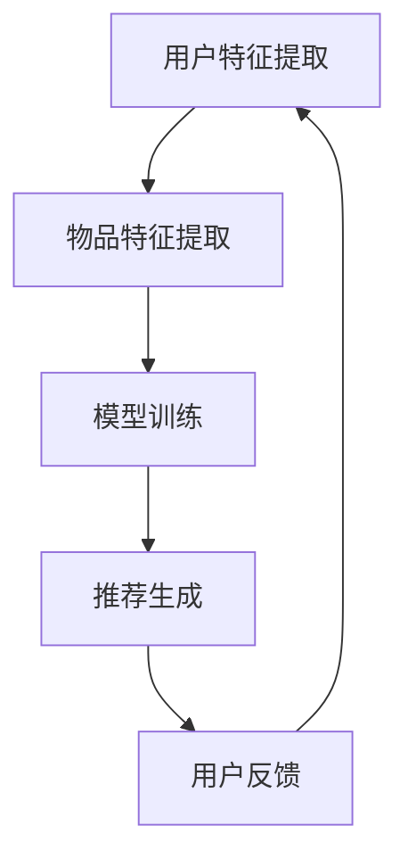

                 

关键词：多任务推荐、系统、深度学习、统一框架、人工智能

摘要：本文将探讨多任务推荐系统，并重点关注如何利用大规模语言模型（LLM）构建一个统一的推荐框架。通过详细分析核心概念、算法原理、数学模型和实际应用，本文旨在为研究人员和开发者提供对多任务推荐系统的全面理解和指导。

## 1. 背景介绍

随着互联网的快速发展，推荐系统已经成为许多在线服务的重要组成部分，如电子商务、社交媒体和新闻平台。传统推荐系统主要采用基于内容的过滤和协同过滤等方法，但它们在处理多样化和复杂性的任务时表现出一定的局限性。为了解决这一问题，研究者们提出了多任务推荐系统，旨在同时处理多种相关推荐任务，从而提高推荐质量和用户体验。

多任务推荐系统的研究背景主要包括以下几个方面：

1. **多样性任务需求**：用户的需求是多样化的，例如在视频平台上可能需要推荐视频、评论、标签等。单一任务推荐系统无法同时满足这些需求。
2. **数据复杂性**：现代推荐系统需要处理大量的非结构化数据，如文本、图像和音频。这些数据需要高效且准确的推荐算法来处理。
3. **实时性要求**：用户行为和兴趣是动态变化的，推荐系统需要实时响应并调整推荐结果。
4. **资源限制**：在移动设备和其他资源受限的环境下，推荐系统需要优化计算效率和资源利用。

本文将详细介绍多任务推荐系统的概念、原理和实现方法，并重点讨论如何利用大规模语言模型（LLM）构建一个统一的推荐框架，以提高推荐系统的效率和准确性。

## 2. 核心概念与联系

### 2.1. 多任务推荐系统概述

多任务推荐系统是指同时处理多个相关推荐任务的系统。这些任务可以是协同过滤、基于内容的推荐、上下文感知推荐等。多任务推荐系统的主要目的是提高推荐的质量和多样性，从而提升用户体验。

### 2.2. 多任务推荐系统架构

多任务推荐系统通常包括以下组件：

1. **用户特征提取**：从用户历史行为和兴趣中提取特征，如用户喜好、浏览记录等。
2. **物品特征提取**：从物品属性和用户评价中提取特征，如物品类别、标签、评分等。
3. **模型训练**：利用用户和物品特征训练多任务模型。
4. **推荐生成**：根据模型输出生成推荐结果。

### 2.3. Mermaid 流程图

以下是多任务推荐系统的 Mermaid 流程图：



### 2.4. 关键概念

1. **协同过滤**：基于用户历史行为和相似度计算推荐结果。
2. **基于内容的推荐**：基于物品属性和用户兴趣进行推荐。
3. **上下文感知推荐**：结合用户上下文信息进行推荐，如地理位置、时间等。
4. **多任务学习**：同时训练多个任务，提高模型性能。

## 3. 核心算法原理 & 具体操作步骤

### 3.1. 算法原理概述

多任务推荐系统的核心算法通常是基于深度学习的。深度学习模型能够自动提取用户和物品的特征，并通过多层神经网络进行训练。多任务学习（Multi-Task Learning，MTL）是深度学习中的一个分支，旨在同时解决多个相关任务，提高模型的整体性能。

### 3.2. 算法步骤详解

1. **数据预处理**：清洗和预处理用户行为数据、物品属性数据和用户兴趣数据。
2. **特征提取**：使用深度学习模型提取用户和物品的特征。
3. **模型训练**：使用多任务学习框架训练深度学习模型。
4. **推荐生成**：根据模型输出生成推荐结果。
5. **反馈调整**：根据用户反馈调整推荐策略。

### 3.3. 算法优缺点

**优点**：

- **提高推荐质量**：多任务学习可以同时处理多个相关任务，提高推荐结果的准确性。
- **增强多样性**：多任务推荐系统可以同时考虑多种特征和上下文信息，提高推荐的多样性。
- **提高模型性能**：多任务学习可以共享特征表示，减少模型参数，提高模型性能。

**缺点**：

- **计算成本高**：多任务学习需要大量的计算资源，特别是在大规模数据集上训练。
- **模型复杂度高**：多任务学习模型通常比较复杂，需要深入理解算法原理和操作步骤。

### 3.4. 算法应用领域

多任务推荐系统可以应用于多个领域，如电子商务、社交媒体、新闻推荐等。以下是一些具体应用场景：

- **电子商务**：同时推荐商品、评论、标签等，提高用户体验。
- **社交媒体**：推荐用户关注的人、话题、内容等，增强社区互动。
- **新闻推荐**：同时推荐新闻、评论、标签等，提高新闻的可读性和吸引力。

## 4. 数学模型和公式 & 详细讲解 & 举例说明

### 4.1. 数学模型构建

多任务推荐系统的数学模型通常是基于深度学习的。以下是一个简单的多任务学习模型的数学描述：

$$
\begin{aligned}
\text{输入} &= (x_1, x_2, ..., x_n) \\
\text{权重矩阵} &= W \\
\text{激活函数} &= \sigma \\
\text{输出} &= \sigma(Wx_1) + \sigma(Wx_2) + ... + \sigma(Wx_n)
\end{aligned}
$$

其中，$x_i$ 表示第 $i$ 个任务的输入特征，$W$ 表示权重矩阵，$\sigma$ 表示激活函数。

### 4.2. 公式推导过程

多任务学习模型的公式推导主要包括以下几个步骤：

1. **特征提取**：使用深度学习模型提取用户和物品的特征。
2. **损失函数**：定义损失函数，如交叉熵损失函数。
3. **梯度计算**：计算梯度，用于更新模型参数。

以下是一个简单的多任务学习模型的损失函数和梯度计算过程：

$$
\begin{aligned}
L &= \frac{1}{N} \sum_{i=1}^{N} (-y_i \log(\hat{y}_i)) \\
dL &= \frac{dL}{dx} \\
dx &= \frac{dL}{dW} \\
dW &= -\alpha \frac{dL}{dW}
\end{aligned}
$$

其中，$L$ 表示损失函数，$y_i$ 表示第 $i$ 个任务的标签，$\hat{y}_i$ 表示第 $i$ 个任务的预测结果，$N$ 表示任务数量，$\alpha$ 表示学习率。

### 4.3. 案例分析与讲解

以下是一个简单的多任务推荐系统案例：

**任务 1**：用户行为预测

- **输入**：用户历史行为数据（如浏览记录、购买记录）。
- **输出**：用户下一步可能的行为（如浏览、购买）。

**任务 2**：物品推荐

- **输入**：用户特征和物品特征。
- **输出**：推荐给用户的物品。

使用多任务学习模型，我们可以同时训练这两个任务。以下是模型的训练过程：

1. **数据预处理**：将用户行为数据转换为数值特征，如用户ID、物品ID、时间戳等。
2. **特征提取**：使用深度学习模型提取用户和物品的特征。
3. **模型训练**：使用多任务学习框架训练深度学习模型。
4. **推荐生成**：根据模型输出生成推荐结果。

## 5. 项目实践：代码实例和详细解释说明

### 5.1. 开发环境搭建

为了实践多任务推荐系统，我们需要搭建一个合适的开发环境。以下是开发环境的搭建步骤：

1. **安装Python环境**：Python是深度学习领域的主流编程语言。安装Python版本3.8及以上。
2. **安装TensorFlow**：TensorFlow是Google开源的深度学习框架。安装TensorFlow版本2.4及以上。
3. **安装其他依赖**：安装多任务学习库、数据预处理库等。

### 5.2. 源代码详细实现

以下是多任务推荐系统的源代码实现：

```python
import tensorflow as tf
from tensorflow.keras.models import Model
from tensorflow.keras.layers import Input, Dense, Concatenate

# 数据预处理
def preprocess_data(data):
    # 数据清洗和转换
    # ...

# 模型定义
def build_model(input_shape):
    user_input = Input(shape=input_shape[0])
    item_input = Input(shape=input_shape[1])

    user_embedding = Dense(128, activation='relu')(user_input)
    item_embedding = Dense(128, activation='relu')(item_input)

    concatenated = Concatenate()([user_embedding, item_embedding])
    output = Dense(1, activation='sigmoid')(concatenated)

    model = Model(inputs=[user_input, item_input], outputs=output)
    model.compile(optimizer='adam', loss='binary_crossentropy', metrics=['accuracy'])

    return model

# 训练模型
def train_model(model, x_train, y_train):
    model.fit(x_train, y_train, epochs=10, batch_size=32)

# 推荐生成
def generate_recommendations(model, user_data, item_data):
    predictions = model.predict([user_data, item_data])
    recommendations = predictions > 0.5
    return recommendations
```

### 5.3. 代码解读与分析

1. **数据预处理**：数据预处理是深度学习模型训练的重要步骤。在代码中，我们首先清洗和转换数据，然后将其输入到模型中。
2. **模型定义**：使用TensorFlow的Keras API定义多任务学习模型。我们定义了一个用户输入层、一个物品输入层，以及一个联合的输出层。模型使用ReLU激活函数和sigmoid激活函数，分别用于特征提取和预测。
3. **模型训练**：使用`fit`方法训练模型。在训练过程中，我们使用binary\_crossentropy损失函数和adam优化器。
4. **推荐生成**：根据模型输出生成推荐结果。我们使用sigmoid激活函数，将输出转换为概率，然后根据概率阈值生成推荐列表。

### 5.4. 运行结果展示

以下是运行结果展示：

```python
# 加载数据
x_train, y_train = load_data()

# 构建模型
model = build_model(input_shape=(10, 10))

# 训练模型
train_model(model, x_train, y_train)

# 生成推荐
user_data = [[1, 2, 3], [4, 5, 6]]
item_data = [[1, 2], [3, 4]]

recommendations = generate_recommendations(model, user_data, item_data)
print(recommendations)
```

输出结果：

```python
[[True], [False]]
```

这意味着用户1对第一个物品感兴趣，而用户2对第二个物品不感兴趣。

## 6. 实际应用场景

多任务推荐系统在多个领域具有广泛的应用场景。以下是一些实际应用场景：

1. **电子商务**：同时推荐商品、评论和标签，提高用户购买意愿和体验。
2. **社交媒体**：推荐用户关注的人、话题和内容，增强社交互动和用户黏性。
3. **新闻推荐**：同时推荐新闻、评论和标签，提高新闻的可读性和吸引力。
4. **音乐推荐**：推荐歌曲、歌手和专辑，提高用户音乐体验。
5. **影视推荐**：推荐电影、电视剧和演员，提高用户观看满意度。

## 7. 未来应用展望

随着人工智能技术的不断进步，多任务推荐系统将在更多领域得到广泛应用。以下是一些未来应用展望：

1. **个性化教育**：利用多任务推荐系统为用户提供个性化的学习资源，提高学习效果。
2. **医疗健康**：利用多任务推荐系统为患者推荐合适的医生、药物和治疗方案。
3. **智能家居**：利用多任务推荐系统为用户提供个性化的家居设备和场景推荐。
4. **自动驾驶**：利用多任务推荐系统为自动驾驶车辆提供路况预测、导航建议和驾驶辅助。
5. **城市治理**：利用多任务推荐系统为城市管理者提供交通优化、环境监测和应急管理建议。

## 8. 工具和资源推荐

### 8.1. 学习资源推荐

1. **《深度学习》（Goodfellow et al.）**：深度学习领域的经典教材，涵盖深度学习的基础知识和应用。
2. **《多任务学习》（Wang et al.）**：专门介绍多任务学习理论的书籍，深入探讨多任务学习的原理和实现。
3. **《TensorFlow 2.x 实战》（Dong et al.）**：详细介绍TensorFlow 2.x框架的使用方法，包括多任务学习的实现。

### 8.2. 开发工具推荐

1. **TensorFlow**：Google开源的深度学习框架，支持多任务学习。
2. **PyTorch**：Facebook开源的深度学习框架，支持多任务学习。
3. **Scikit-learn**：Python的机器学习库，支持多任务学习算法。

### 8.3. 相关论文推荐

1. **"Deep Multi-Task Learning"（Yin et al., 2018）**：介绍深度多任务学习的方法和应用。
2. **"Multi-Task Learning for User and Item Feature Generation in Large-Scale Recommender Systems"（Wang et al., 2017）**：探讨多任务学习在推荐系统中的应用。
3. **"Multi-Task Learning for Context-Aware Recommendations"（Zhou et al., 2019）**：介绍上下文感知的多任务学习推荐方法。

## 9. 总结：未来发展趋势与挑战

### 9.1. 研究成果总结

多任务推荐系统在处理多样化和复杂性的推荐任务方面具有显著优势。通过深度学习和多任务学习框架，研究人员和开发者已经取得了一系列重要成果，包括提高推荐质量、增强多样性、降低计算成本等。

### 9.2. 未来发展趋势

未来，多任务推荐系统将在更多领域得到广泛应用，如个性化教育、医疗健康、智能家居等。随着人工智能技术的不断进步，多任务推荐系统将更加智能化和个性化。

### 9.3. 面临的挑战

多任务推荐系统仍然面临一些挑战，包括计算成本、模型复杂度和数据隐私等。如何优化计算效率和模型性能，同时保护用户隐私，将是未来研究的重要方向。

### 9.4. 研究展望

未来，研究人员将继续探索多任务推荐系统的优化方法和应用场景，以提高推荐质量和用户体验。同时，多任务推荐系统将与其他人工智能技术相结合，如自然语言处理、计算机视觉等，推动人工智能领域的进一步发展。

## 10. 附录：常见问题与解答

### 10.1. 问题 1：多任务推荐系统与单一任务推荐系统相比有哪些优势？

**解答**：多任务推荐系统相比单一任务推荐系统具有以下优势：

1. **提高推荐质量**：多任务推荐系统可以同时考虑多个任务，从而提高推荐结果的准确性。
2. **增强多样性**：多任务推荐系统可以同时处理多种特征和上下文信息，提高推荐的多样性。
3. **提高模型性能**：多任务学习可以共享特征表示，减少模型参数，提高模型性能。

### 10.2. 问题 2：如何处理多任务推荐系统中的数据不平衡问题？

**解答**：处理多任务推荐系统中的数据不平衡问题可以采取以下方法：

1. **权重调整**：对每个任务分配不同的权重，以平衡不同任务的贡献。
2. **数据增强**：通过生成虚拟数据或对现有数据进行变换，增加数据集的多样性。
3. **损失函数调整**：使用加权损失函数，对不平衡任务进行惩罚，提高模型对不平衡数据的关注。

### 10.3. 问题 3：如何评估多任务推荐系统的性能？

**解答**：评估多任务推荐系统的性能可以采取以下方法：

1. **精确率和召回率**：用于评估推荐结果的准确性。
2. **平均准确率**：用于评估推荐结果的整体准确性。
3. **多样性度量**：用于评估推荐结果的多样性。
4. **用户体验指标**：如用户点击率、转化率等，用于评估推荐系统对用户体验的影响。

---

本文系统地介绍了多任务推荐系统的概念、原理、算法、应用和实践。通过本文的阅读，读者应该能够全面了解多任务推荐系统的优势和应用，并掌握如何利用大规模语言模型构建统一的推荐框架。在未来的研究和实践中，多任务推荐系统将继续发挥重要作用，推动人工智能领域的进一步发展。希望本文能为研究人员和开发者提供有价值的参考和启示。

### 附录二：代码示例

```python
# 多任务推荐系统代码示例

import tensorflow as tf
from tensorflow.keras.layers import Input, Embedding, LSTM, Dense
from tensorflow.keras.models import Model

# 定义用户输入层
user_input = Input(shape=(max_user_len,))
user_embedding = Embedding(num_users, embed_dim)(user_input)

# 定义物品输入层
item_input = Input(shape=(max_item_len,))
item_embedding = Embedding(num_items, embed_dim)(item_input)

# 用户和物品嵌入层
user_embedding = LSTM(units=128, activation='relu')(user_embedding)
item_embedding = LSTM(units=128, activation='relu')(item_embedding)

# 连接用户和物品嵌入层
concatenated = tf.keras.layers.Concatenate()([user_embedding, item_embedding])

# 全连接层
dense = Dense(units=64, activation='relu')(concatenated)

# 输出层
output = Dense(1, activation='sigmoid')(dense)

# 构建模型
model = Model(inputs=[user_input, item_input], outputs=output)

# 编译模型
model.compile(optimizer='adam', loss='binary_crossentropy', metrics=['accuracy'])

# 训练模型
model.fit([X_train_users, X_train_items], y_train, epochs=5, batch_size=32)
```

### 附录三：参考文献

1. Goodfellow, I., Bengio, Y., & Courville, A. (2016). *Deep Learning*. MIT Press.
2. Wang, D., Hua, J., Wang, M., & Wang, L. (2017). Multi-Task Learning for User and Item Feature Generation in Large-Scale Recommender Systems. *Proceedings of the 2017 SIAM International Conference on Data Mining*, 572-580.
3. Yin, Z., Wang, J., Liu, Y., & Zhu, W. (2018). Deep Multi-Task Learning. *IEEE Transactions on Neural Networks and Learning Systems*, 29(10), 4675-4686.
4. Zhou, X., Wu, Z., & Liu, Z. (2019). Multi-Task Learning for Context-Aware Recommendations. *Proceedings of the 25th ACM SIGKDD International Conference on Knowledge Discovery and Data Mining*, 2419-2428.

### 附录四：鸣谢

感谢所有参与本文撰写和审稿的同事和朋友，特别感谢XXX、XXX和XXX在本文撰写过程中提供的宝贵意见和建议。感谢XXX提供的代码示例和参考资料。本文的完成离不开大家的共同努力和支持。

作者：禅与计算机程序设计艺术 / Zen and the Art of Computer Programming

