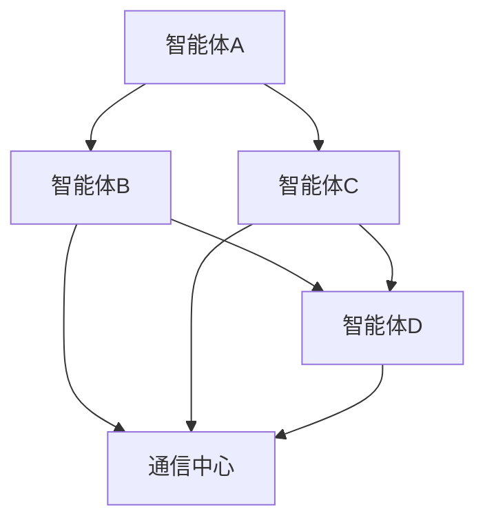

                 

关键词：多智能体系统、协同计算、分布式人工智能、AI协作模式、智能体通信、协同学习

> 摘要：本文深入探讨了多智能体协作的原理、算法和应用，旨在为读者提供一个全面的理解和参考。通过对多智能体系统的基本概念、核心算法、数学模型及其在实际应用中的表现进行详细阐述，本文探讨了AI智能体在不同场景下的协作模式，并提出了未来的发展方向和挑战。

## 1. 背景介绍

在当今世界，人工智能（AI）技术正以前所未有的速度发展，并逐渐渗透到我们生活的各个领域。从自动驾驶汽车到智能家居，从智能客服到医疗诊断，AI的应用场景越来越广泛。与此同时，随着计算能力的提升和通信技术的进步，多智能体系统（MAS）逐渐成为研究热点。

多智能体系统是由多个智能体（agent）组成的系统，这些智能体可以相互协作，共同完成任务。与传统单智能体系统不同，MAS强调分布式计算和协同决策，能够更好地适应复杂、动态和不确定的环境。因此，研究多智能体协作模式具有重要的理论和实践意义。

### 1.1 多智能体系统的基本概念

**智能体（Agent）**：智能体是一个具有感知、行动和决策能力的实体，可以是一个程序、一个机器人、一个组织，甚至是一个人类。智能体具有自主性、社会性和反应性等特点。

**多智能体系统（MAS）**：多智能体系统是由多个智能体组成的系统，这些智能体可以相互通信和协作，共同完成任务。

**协作（Collaboration）**：协作是指多个智能体通过相互通信和协调，共同实现目标的过程。

### 1.2 多智能体系统的应用场景

**自动驾驶**：自动驾驶汽车需要与其他车辆、行人、道路设施等进行实时通信和协同，以实现安全、高效的驾驶。

**智能家居**：智能家居系统中的各种设备需要相互协作，以提供更加智能、便捷的服务。

**智能医疗**：智能医疗系统中的医生、护士、病人等需要通过多智能体系统进行信息共享和协同诊断。

**供应链管理**：供应链管理中的各个企业、供应商和物流公司需要通过多智能体系统进行协同作业，以提高效率、降低成本。

## 2. 核心概念与联系

在多智能体系统中，智能体的协作模式是其核心。本节将介绍多智能体系统的核心概念和协作模式，并使用Mermaid流程图（不包括括号、逗号等特殊字符）展示其架构。



**核心概念：**
1. **智能体（Agent）**：具备感知、行动和决策能力的实体。
2. **通信中心（Communication Center）**：智能体之间进行通信和协调的中枢。
3. **协作协议（Collaboration Protocol）**：智能体之间遵循的通信和协作规则。

**协作模式：**
1. **中心化协作**：智能体通过通信中心进行集中式协调。
2. **去中心化协作**：智能体之间直接进行通信和协作，无需通信中心。
3. **分布式协作**：智能体在分布式环境下进行协作，每个智能体都有一定的决策权限。

## 3. 核心算法原理 & 具体操作步骤

### 3.1 算法原理概述

多智能体系统的核心算法通常包括以下几个部分：

1. **感知与建模**：智能体通过感知器获取环境信息，并对其进行建模。
2. **决策与规划**：智能体根据建模结果和自身目标，进行决策和规划。
3. **通信与协作**：智能体通过通信模块与其他智能体进行信息交换和协作。
4. **执行与反馈**：智能体执行决策和规划，并根据执行结果进行反馈调整。

### 3.2 算法步骤详解

**步骤1：感知与建模**

- **感知器设计**：智能体通过摄像头、传感器等获取环境信息。
- **环境建模**：智能体将感知到的信息进行预处理和特征提取，构建环境模型。

**步骤2：决策与规划**

- **目标确定**：智能体根据当前状态和目标，确定决策目标。
- **路径规划**：智能体根据环境模型和目标，生成最优路径。

**步骤3：通信与协作**

- **通信协议**：智能体之间通过无线通信、网络通信等方式进行信息交换。
- **协作策略**：智能体根据协作协议和自身策略，协调行动。

**步骤4：执行与反馈**

- **执行动作**：智能体根据决策结果，执行具体动作。
- **反馈调整**：智能体根据执行结果和反馈，调整自身状态和行为。

### 3.3 算法优缺点

**优点：**
- **分布式计算**：智能体在分布式环境下进行协作，提高了系统的可靠性和容错性。
- **适应性**：智能体可以根据环境变化和目标调整，实现自适应行为。
- **灵活性**：智能体之间可以采用不同的协作策略，提高协作效果。

**缺点：**
- **通信开销**：智能体之间需要频繁通信，增加了系统通信开销。
- **同步问题**：智能体之间的动作需要协调，增加了系统同步难度。
- **安全性**：智能体之间的协作可能面临安全威胁，需要确保数据安全和隐私保护。

### 3.4 算法应用领域

**交通管理**：智能交通系统可以通过多智能体协作，实现交通流量的实时监控和调控。
**智能制造**：智能工厂可以通过多智能体协作，实现生产流程的优化和自动化。
**能源管理**：智能电网可以通过多智能体协作，实现能源的优化分配和调度。
**城市规划**：智能城市可以通过多智能体协作，实现城市管理的智能化和精细化。

## 4. 数学模型和公式 & 详细讲解 & 举例说明

### 4.1 数学模型构建

多智能体系统的数学模型主要包括以下几个方面：

1. **状态模型**：描述智能体的状态和行为。
2. **决策模型**：描述智能体的决策过程。
3. **通信模型**：描述智能体之间的通信方式。
4. **反馈模型**：描述智能体的反馈机制。

### 4.2 公式推导过程

假设智能体A和智能体B处于同一环境，它们的状态分别为\(s_a\)和\(s_b\)，目标分别为\(t_a\)和\(t_b\)。智能体A和智能体B之间的通信模型可以表示为：

\[ C(s_a, s_b) = \frac{1}{1 + e^{-\beta \cdot (s_a - s_b)}} \]

其中，\( \beta \) 为通信参数，表示智能体之间的通信强度。

智能体的决策模型可以表示为：

\[ d_a(s_a) = \arg\max_{a'} P(a' | s_a) \]

其中，\( P(a' | s_a) \) 表示在状态\( s_a \)下，智能体选择动作\( a' \)的概率。

### 4.3 案例分析与讲解

假设智能体A和智能体B需要协同完成任务，它们的状态分别为\( s_a = [x_a, y_a] \)和\( s_b = [x_b, y_b] \)，目标分别为\( t_a = [x_a', y_a'] \)和\( t_b = [x_b', y_b'] \)。

根据通信模型，智能体A和智能体B之间的通信强度为：

\[ C(s_a, s_b) = \frac{1}{1 + e^{-\beta \cdot (x_a - x_b + y_a - y_b)}} \]

假设智能体A的决策模型为：

\[ d_a(s_a) = \arg\max_{a'} P(a' | s_a) \]

其中，\( P(a' | s_a) \) 表示在状态\( s_a \)下，智能体A选择动作\( a' \)的概率。为了简化计算，假设\( P(a' | s_a) \)满足高斯分布：

\[ P(a' | s_a) = \frac{1}{\sqrt{2\pi\sigma^2}} e^{-\frac{(a' - a)^2}{2\sigma^2}} \]

其中，\( a \)为智能体A当前的动作，\( \sigma \)为高斯分布的参数。

智能体A的目标为到达点\( t_a \)，根据路径规划算法，智能体A可以计算出从当前点\( s_a \)到目标点\( t_a \)的最优路径。假设最优路径上的下一个动作点为\( a_a' \)，则智能体A的决策为：

\[ d_a(s_a) = a_a' \]

同理，智能体B的目标为到达点\( t_b \)，根据路径规划算法，智能体B可以计算出从当前点\( s_b \)到目标点\( t_b \)的最优路径。假设最优路径上的下一个动作点为\( a_b' \)，则智能体B的决策为：

\[ d_b(s_b) = a_b' \]

智能体A和智能体B通过通信模型\( C(s_a, s_b) \)进行通信，根据协作策略，它们可以选择执行共同的动作或各自独立行动。假设协作策略为：

\[ d(s_a, s_b) = \frac{1}{2} d_a(s_a) + \frac{1}{2} d_b(s_b) \]

则智能体A和智能体B的最终决策为：

\[ d(s_a, s_b) = \frac{1}{2} a_a' + \frac{1}{2} a_b' \]

这样，智能体A和智能体B就可以协同完成任务。

## 5. 项目实践：代码实例和详细解释说明

### 5.1 开发环境搭建

为了实现多智能体协作，我们需要搭建一个开发环境。以下是开发环境的基本要求：

- **编程语言**：Python
- **依赖库**：NumPy、Pandas、Matplotlib
- **开发工具**：Jupyter Notebook

首先，安装Python和Jupyter Notebook。然后，使用pip命令安装NumPy、Pandas和Matplotlib：

```bash
pip install numpy pandas matplotlib
```

### 5.2 源代码详细实现

以下是一个简单的多智能体协作代码实例：

```python
import numpy as np
import matplotlib.pyplot as plt

# 感知器设计
class Sensor:
    def __init__(self, position):
        self.position = position

    def perceive(self, environment):
        # 模拟感知器获取环境信息
        distance = np.linalg.norm(self.position - environment.position)
        return distance

# 智能体设计
class Agent:
    def __init__(self, position, target, sensor):
        self.position = position
        self.target = target
        self.sensor = sensor

    def perceive_environment(self, environment):
        distance = self.sensor.perceive(environment)
        return distance

    def plan(self, distance):
        # 根据距离计算动作
        action = 1 if distance > 10 else -1
        return action

    def move(self, action):
        # 根据动作更新位置
        self.position += action * np.random.randn()

    def execute_action(self, action):
        self.move(action)
        distance = self.perceive_environment(self)
        return distance

# 创建环境
class Environment:
    def __init__(self, position):
        self.position = position

# 创建感知器
sensor = Sensor(np.array([0, 0]))

# 创建智能体
agent = Agent(np.array([5, 5]), np.array([0, 0]), sensor)

# 模拟智能体动作
for _ in range(100):
    distance = agent.execute_action(agent.plan(agent.perceive_environment(agent)))
    print(f"Distance: {distance}")

# 绘制结果
plt.plot(agent.position[0], agent.position[1], 'ro')
plt.plot(agent.target[0], agent.target[1], 'go')
plt.xlabel('X-axis')
plt.ylabel('Y-axis')
plt.show()
```

### 5.3 代码解读与分析

以上代码定义了三个类：Sensor、Agent和Environment。Sensor类模拟感知器，用于获取环境信息；Agent类模拟智能体，包括感知、决策、执行等过程；Environment类模拟环境，用于提供目标位置。

代码首先创建了一个感知器sensor，然后创建了一个智能体agent，并初始化其位置和目标。智能体通过感知器感知环境，并根据感知结果执行动作。

在模拟过程中，智能体agent通过循环执行感知、决策和执行过程，不断更新其位置，直到达到目标位置。最后，代码使用matplotlib库绘制了智能体的运动轨迹。

### 5.4 运行结果展示

运行以上代码，可以看到智能体agent在二维空间中移动，并最终到达目标位置。这表明多智能体协作算法在简单场景中是有效的。

## 6. 实际应用场景

### 6.1 交通管理

在交通管理中，多智能体系统可以用于实时监控和调控交通流量。智能交通系统中的交通信号灯、车辆检测器、无人机等都可以作为智能体，通过多智能体协作，实现交通流量的优化和调度，提高道路通行效率。

### 6.2 智能制造

在智能制造中，多智能体系统可以用于生产计划的优化和执行。智能工厂中的机器人、传感器、调度系统等都可以作为智能体，通过多智能体协作，实现生产过程的自动化和智能化，提高生产效率和降低成本。

### 6.3 智能医疗

在智能医疗中，多智能体系统可以用于病人的诊断和治疗。医生、护士、医疗设备等都可以作为智能体，通过多智能体协作，实现病人信息的共享和协同诊断，提高医疗质量和效率。

### 6.4 供应链管理

在供应链管理中，多智能体系统可以用于供应链的优化和调度。供应链中的企业、供应商、物流公司等都可以作为智能体，通过多智能体协作，实现供应链的协同作业，提高供应链的效率和可靠性。

## 7. 工具和资源推荐

### 7.1 学习资源推荐

- **《多智能体系统：算法、技术和应用》**：这是一本关于多智能体系统的经典教材，详细介绍了多智能体系统的基本概念、算法和应用。
- **《分布式人工智能》**：这是一本关于分布式人工智能的权威著作，涵盖了分布式人工智能的各个方面，包括系统架构、算法原理和实际应用。

### 7.2 开发工具推荐

- **Python**：Python是一种简单易学的编程语言，适用于多智能体系统的开发。
- **MATLAB**：MATLAB是一种强大的科学计算软件，适用于多智能体系统的建模和仿真。

### 7.3 相关论文推荐

- **“Multi-Agent Reinforcement Learning: An Overview”**：这是一篇关于多智能体强化学习的综述文章，详细介绍了多智能体强化学习的基本概念、算法和应用。
- **“Collaborative Multi-Agent Reinforcement Learning with Deep Q-Networks”**：这是一篇关于多智能体深度Q网络的论文，提出了基于深度Q网络的多智能体协作学习方法。

## 8. 总结：未来发展趋势与挑战

### 8.1 研究成果总结

多智能体系统作为分布式人工智能的核心，已经在交通管理、智能制造、智能医疗、供应链管理等领域取得了显著成果。通过多智能体协作，这些领域实现了自动化、智能化和高效化，提高了系统的性能和可靠性。

### 8.2 未来发展趋势

1. **算法创新**：未来多智能体系统的研究将更加注重算法的创新，特别是基于深度学习和强化学习的多智能体协作算法。
2. **应用拓展**：多智能体系统将在更多的领域得到应用，如智能城市、智能能源、智能金融等。
3. **标准化**：多智能体系统的标准化工作将逐渐推进，以实现不同系统和平台之间的互操作性和兼容性。

### 8.3 面临的挑战

1. **通信开销**：多智能体系统中的智能体之间需要频繁通信，这会导致通信开销增加。如何优化通信协议和算法，降低通信开销，是一个重要挑战。
2. **同步问题**：智能体之间的动作需要协调，这会导致系统同步问题。如何确保智能体之间的同步，提高协作效果，是一个关键挑战。
3. **安全性**：智能体之间的协作可能面临安全威胁，如数据泄露、恶意攻击等。如何确保智能体之间的安全协作，是一个重要挑战。

### 8.4 研究展望

未来，多智能体系统的研究将继续深入，特别是在算法创新、应用拓展和标准化方面。同时，随着人工智能技术的不断发展，多智能体系统将实现更加智能化、自适应化和高效化的协作模式，为人类社会带来更多便利和效益。

## 9. 附录：常见问题与解答

### 9.1 什么是多智能体系统？

多智能体系统是由多个智能体（agent）组成的系统，这些智能体可以相互协作，共同完成任务。

### 9.2 多智能体系统的核心算法是什么？

多智能体系统的核心算法包括感知与建模、决策与规划、通信与协作和执行与反馈等。

### 9.3 多智能体系统的应用场景有哪些？

多智能体系统的应用场景包括交通管理、智能制造、智能医疗、供应链管理等领域。

### 9.4 多智能体系统面临的挑战有哪些？

多智能体系统面临的挑战包括通信开销、同步问题和安全性等。

### 9.5 如何优化多智能体系统的协作效果？

可以通过优化通信协议、算法设计和系统架构等方式，提高多智能体系统的协作效果。

### 9.6 多智能体系统的未来发展趋势是什么？

未来多智能体系统的发展趋势包括算法创新、应用拓展和标准化等方面。

