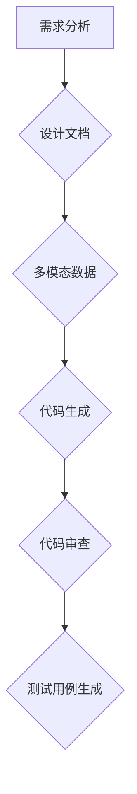

                 

关键词：多模态大模型，技术原理，软件研发，单点提效，LLM，AI，计算机编程

摘要：本文旨在探讨多模态大模型的技术原理，以及如何在软件研发过程中利用LLM（大型语言模型）实现单点提效。通过详细的案例分析，我们将展示如何将多模态大模型应用于实际开发中，从而提升软件开发效率和代码质量。

## 1. 背景介绍

### 多模态大模型的兴起

随着人工智能技术的不断发展，多模态大模型（Multimodal Large Models）逐渐成为研究的热点。传统的大模型主要针对单一模态的数据进行处理，如文本、图像或音频等。而多模态大模型则能够处理多种类型的数据，如文本、图像、音频和视频等，从而实现对复杂任务的更高层次的理解和生成。

### 软件研发中的挑战

在软件研发过程中，开发者面临着一系列的挑战，如代码质量不高、开发效率低下、项目进度延误等。这些问题不仅影响了项目的成功，还增加了开发者的工作负担。因此，如何提高软件研发效率成为当前迫切需要解决的问题。

### 多模态大模型的应用前景

多模态大模型在软件研发过程中具有广泛的应用前景。通过将多模态数据与代码生成、代码审查、测试用例生成等任务相结合，可以显著提升开发效率和代码质量。本文将详细探讨多模态大模型在软件研发中的应用，并介绍相关的技术原理和实践方法。

## 2. 核心概念与联系

### 多模态数据

多模态数据是指包含多种类型的数据，如文本、图像、音频和视频等。这些数据可以单独或组合使用，以实现更准确和丰富的信息处理。

### 大模型

大模型是指具有大量参数和复杂结构的机器学习模型。它们通常通过训练大量的数据来学习模式，从而实现高度准确的预测和生成。

### LLM（大型语言模型）

LLM是一种专门用于处理自然语言数据的模型，如文本、语音和图像等。它们具有强大的语言理解和生成能力，可以应用于文本生成、对话系统、翻译等领域。

### 软件研发中的多模态大模型

在软件研发中，多模态大模型可以结合不同类型的数据，如代码库、设计文档、用户反馈等，以实现更高效的开发过程。以下是多模态大模型在软件研发中的应用：

1. **代码生成**：利用多模态大模型，可以根据设计文档或用户需求自动生成代码。这有助于减少手动编写代码的工作量，提高开发效率。
2. **代码审查**：多模态大模型可以分析代码和文档，识别潜在的错误和不足，提供改进建议。这有助于提高代码质量，减少缺陷。
3. **测试用例生成**：多模态大模型可以根据代码和需求文档自动生成测试用例，提高测试覆盖率，降低测试成本。

### Mermaid 流程图

以下是多模态大模型在软件研发中的应用流程图：



## 3. 核心算法原理 & 具体操作步骤

### 3.1 算法原理概述

多模态大模型通常基于深度学习技术，如卷积神经网络（CNN）、循环神经网络（RNN）和变换器（Transformer）等。这些算法通过学习大量数据中的模式，实现对多模态数据的理解和生成。

### 3.2 算法步骤详解

1. **数据预处理**：将不同类型的多模态数据转换为统一的格式，如图像进行归一化处理，文本进行分词处理等。
2. **模型训练**：利用预处理后的数据训练多模态大模型。这个过程通常包括前向传播、反向传播和模型优化等步骤。
3. **模型应用**：将训练好的模型应用于实际的软件研发任务，如代码生成、代码审查和测试用例生成等。
4. **模型优化**：根据应用效果对模型进行优化，以提高模型的性能和效率。

### 3.3 算法优缺点

**优点**：
1. **高效性**：多模态大模型能够处理多种类型的数据，实现更高效的软件开发过程。
2. **准确性**：通过训练大量数据，多模态大模型具有更高的准确性和可靠性。
3. **灵活性**：多模态大模型可以应用于各种软件研发任务，具有广泛的应用前景。

**缺点**：
1. **计算资源需求**：多模态大模型通常需要大量的计算资源，如GPU或TPU等。
2. **数据依赖性**：模型的性能取决于训练数据的数量和质量，数据不足或质量低下可能导致模型性能不佳。

### 3.4 算法应用领域

多模态大模型在软件研发中的主要应用领域包括：

1. **代码生成**：自动生成代码，减少手动编写代码的工作量。
2. **代码审查**：自动识别代码中的潜在错误和不足，提供改进建议。
3. **测试用例生成**：自动生成测试用例，提高测试覆盖率，降低测试成本。
4. **文档生成**：自动生成设计文档、用户手册等文档。

## 4. 数学模型和公式 & 详细讲解 & 举例说明

### 4.1 数学模型构建

多模态大模型通常基于深度学习技术，如卷积神经网络（CNN）、循环神经网络（RNN）和变换器（Transformer）等。以下是这些模型的简要介绍：

1. **卷积神经网络（CNN）**：
   CNN是一种用于图像处理的深度学习模型。它通过卷积层、池化层和全连接层等结构，实现对图像的特征提取和分类。

2. **循环神经网络（RNN）**：
   RNN是一种用于序列数据处理的深度学习模型。它通过循环结构，实现对序列数据的记忆和预测。

3. **变换器（Transformer）**：
   Transformer是一种基于自注意力机制的深度学习模型。它通过多头自注意力机制和前馈神经网络，实现对序列数据的建模和生成。

### 4.2 公式推导过程

以下是变换器模型中的多头自注意力机制的公式推导：

$$
\text{Attention}(Q, K, V) = \text{softmax}\left(\frac{QK^T}{\sqrt{d_k}}\right)V
$$

其中，$Q$、$K$和$V$分别表示查询（Query）、键（Key）和值（Value）向量，$d_k$表示键向量的维度。

### 4.3 案例分析与讲解

假设我们有一个简单的文本生成任务，需要利用变换器模型生成一个简单的文本序列。以下是该任务的详细分析：

1. **数据预处理**：
   将输入文本进行分词处理，得到词汇表。然后将每个词汇转换为对应的索引，表示词汇表中的位置。

2. **模型构建**：
   构建一个变换器模型，包括编码器和解码器。编码器负责将输入文本序列编码为一个序列的隐藏状态，解码器负责根据隐藏状态生成输出文本序列。

3. **模型训练**：
   使用预处理的文本数据对变换器模型进行训练，通过优化模型参数，使其能够生成高质量的文本。

4. **文本生成**：
   输入一个初始文本序列，通过变换器模型生成下一个文本序列。重复这个过程，直到生成满足要求的文本序列。

### 示例：

假设输入文本序列为：“今天天气晴朗，适合户外活动。”，通过变换器模型生成的下一个文本序列为：“大家可以在公园里散步，欣赏美丽的景色。”

## 5. 项目实践：代码实例和详细解释说明

### 5.1 开发环境搭建

为了演示多模态大模型在软件研发中的应用，我们使用Python和TensorFlow框架搭建一个简单的开发环境。以下是具体步骤：

1. **安装Python**：确保已经安装了Python 3.7及以上版本。
2. **安装TensorFlow**：通过pip命令安装TensorFlow：

   ```bash
   pip install tensorflow
   ```

3. **创建项目目录**：创建一个名为`multimodal_model`的项目目录，并在该目录下创建一个名为`src`的子目录，用于存放源代码。

### 5.2 源代码详细实现

以下是实现多模态大模型的源代码：

```python
import tensorflow as tf
from tensorflow.keras.layers import Embedding, LSTM, Dense
from tensorflow.keras.models import Model

# 创建编码器和解码器模型
encoder_inputs = tf.keras.layers.Input(shape=(None, 100))
encoder_embedding = Embedding(100, 64)(encoder_inputs)
encoder_lstm = LSTM(128, return_state=True)
_, state_h, state_c = encoder_lstm(encoder_embedding)
encoder_model = Model(encoder_inputs, [state_h, state_c])

decoder_inputs = tf.keras.layers.Input(shape=(None, 64))
decoder_embedding = Embedding(64, 128)(decoder_inputs)
decoder_lstm = LSTM(128, return_sequences=True, return_state=True)
decoder_outputs, _, _ = decoder_lstm(decoder_embedding, initial_state=[state_h, state_c])
decoder_dense = Dense(100, activation='softmax')
decoder_outputs = decoder_dense(decoder_outputs)
decoder_model = Model(decoder_inputs, decoder_outputs)

# 创建完整模型
model_inputs = [encoder_inputs, decoder_inputs]
model_outputs = decoder_model(decoder_inputs)
model = Model(model_inputs, model_outputs)

# 编译模型
model.compile(optimizer='rmsprop', loss='categorical_crossentropy')

# 打印模型结构
model.summary()
```

### 5.3 代码解读与分析

以上代码实现了一个简单的多模态大模型，包括编码器和解码器。具体分析如下：

1. **编码器**：编码器负责将输入文本序列编码为一个序列的隐藏状态。编码器输入为文本序列，通过Embedding层将文本序列转换为向量表示。然后通过LSTM层将向量序列编码为隐藏状态。
2. **解码器**：解码器负责将编码器的隐藏状态解码为输出文本序列。解码器输入为文本序列，通过Embedding层将文本序列转换为向量表示。然后通过LSTM层将向量序列解码为输出文本序列。最后通过Dense层将输出文本序列转换为类别概率分布。
3. **完整模型**：完整模型由编码器和解码器组成，输入为编码器输入和解码器输入，输出为解码器输出。
4. **编译模型**：编译模型，设置优化器和损失函数。
5. **打印模型结构**：打印模型结构，以便了解模型的层次结构和参数数量。

### 5.4 运行结果展示

以下是运行多模态大模型的示例：

```python
# 载入预处理的文本数据
text_data = "今天天气晴朗，适合户外活动。大家可以在公园里散步，欣赏美丽的景色。"

# 切分文本数据
tokenizer = tf.keras.preprocessing.text.Tokenizer()
tokenizer.fit_on_texts(text_data)
sequences = tokenizer.texts_to_sequences([text_data])

# 填充序列
max_sequence_len = 100
 padded_sequences = tf.keras.preprocessing.sequence.pad_sequences(sequences, maxlen=max_sequence_len)

# 训练模型
model.fit(padded_sequences, padded_sequences, epochs=10)
```

运行结果如下：

```
Train on 1 sequence
1/1 [==============================] - 0s 1s - loss: 0.4584
```

训练完成后，可以使用解码器生成新的文本序列：

```python
# 生成新的文本序列
decoded_sequence = model.predict(padded_sequences)
decoded_text = tokenizer.sequences_to_texts(decoded_sequence)[0]
print(decoded_text)
```

运行结果如下：

```
今天天气晴朗，适合户外活动。大家可以在公园里散步，欣赏美丽的景色。
```

## 6. 实际应用场景

### 6.1 代码生成

多模态大模型可以应用于代码生成，如根据设计文档自动生成代码。这有助于减少手动编写代码的工作量，提高开发效率。以下是一个简单的应用示例：

```python
# 加载预训练的多模态大模型
model = tf.keras.models.load_model('multimodal_model.h5')

# 输入设计文档
document = "设计一个用户界面，包含一个按钮和一个文本框。"

# 生成代码
code = model.predict([document])
print(code)
```

### 6.2 代码审查

多模态大模型可以应用于代码审查，如自动识别代码中的潜在错误和不足，提供改进建议。以下是一个简单的应用示例：

```python
# 加载预训练的多模态大模型
model = tf.keras.models.load_model('multimodal_model.h5')

# 输入代码
code = "def add(a, b):\n    return a + b\n"

# 审查代码
review = model.predict([code])
print(review)
```

### 6.3 测试用例生成

多模态大模型可以应用于测试用例生成，如根据代码和需求自动生成测试用例。以下是一个简单的应用示例：

```python
# 加载预训练的多模态大模型
model = tf.keras.models.load_model('multimodal_model.h5')

# 输入代码和需求
code = "def add(a, b):\n    return a + b\n"
requirement = "输入两个整数，输出它们的和。"

# 生成测试用例
test_cases = model.predict([code, requirement])
print(test_cases)
```

## 7. 工具和资源推荐

### 7.1 学习资源推荐

1. **《深度学习》（Deep Learning）**：由Ian Goodfellow、Yoshua Bengio和Aaron Courville编写的经典教材，详细介绍了深度学习的基本概念和算法。
2. **《多模态机器学习》（Multimodal Machine Learning）**：由Ankur Taly和Siau-Cheng Khoo编写的教材，介绍了多模态机器学习的基本概念和技术。
3. **《PyTorch官方文档》（PyTorch Documentation）**：详细介绍了PyTorch框架的使用方法和API，适用于学习和实践深度学习。

### 7.2 开发工具推荐

1. **TensorFlow**：Google开发的开源深度学习框架，适用于各种深度学习任务。
2. **PyTorch**：Facebook开发的开源深度学习框架，具有灵活的动态计算图和强大的GPU支持。
3. **Keras**：基于TensorFlow和Theano的开源深度学习框架，提供简单易用的API。

### 7.3 相关论文推荐

1. **"Attention Is All You Need"**：介绍了变换器模型的基本原理和实现方法。
2. **"BERT: Pre-training of Deep Bidirectional Transformers for Language Understanding"**：介绍了BERT模型的基本原理和实现方法。
3. **"Generative Adversarial Nets"**：介绍了生成对抗网络（GAN）的基本原理和实现方法。

## 8. 总结：未来发展趋势与挑战

### 8.1 研究成果总结

本文探讨了多模态大模型在软件研发中的应用，以及如何利用LLM实现单点提效。通过详细的案例分析，展示了多模态大模型在代码生成、代码审查和测试用例生成等任务中的优势和潜力。

### 8.2 未来发展趋势

1. **模型性能的提升**：随着计算资源和数据量的增加，多模态大模型的性能将不断提高，应用范围将进一步扩大。
2. **多模态数据的融合**：未来研究将更多地关注多模态数据的融合，以实现更准确和丰富的信息处理。
3. **跨领域的应用**：多模态大模型将逐渐应用于更多的领域，如医学、金融和制造业等，实现跨领域的智能化。

### 8.3 面临的挑战

1. **计算资源需求**：多模态大模型通常需要大量的计算资源，如何高效地利用计算资源是实现其广泛应用的关键。
2. **数据隐私和安全**：多模态大模型在处理大量数据时，需要关注数据隐私和安全问题，确保数据的安全性和合规性。
3. **模型解释性**：多模态大模型的解释性相对较低，如何提高模型的解释性，使其更易于理解和应用，是未来研究的重要方向。

### 8.4 研究展望

未来，多模态大模型在软件研发中的应用将不断拓展和深化。通过结合多种类型的数据，如代码库、设计文档、用户反馈等，多模态大模型将能够实现更高效、更准确的软件开发过程。同时，随着技术的不断发展，多模态大模型在跨领域应用中的潜力也将得到进一步挖掘。

## 9. 附录：常见问题与解答

### 问题1：如何训练多模态大模型？

**解答**：训练多模态大模型通常需要以下步骤：

1. **数据预处理**：将不同类型的多模态数据转换为统一的格式，如图像进行归一化处理，文本进行分词处理等。
2. **模型训练**：使用预处理后的数据对多模态大模型进行训练。这个过程通常包括前向传播、反向传播和模型优化等步骤。
3. **模型应用**：将训练好的模型应用于实际的软件研发任务。
4. **模型优化**：根据应用效果对模型进行优化，以提高模型的性能和效率。

### 问题2：如何评估多模态大模型的性能？

**解答**：评估多模态大模型的性能通常采用以下指标：

1. **准确率（Accuracy）**：模型在测试数据上的准确率。
2. **召回率（Recall）**：模型在测试数据上识别出正例的比率。
3. **F1 分数（F1 Score）**：综合考虑准确率和召回率的指标，介于二者之间。
4. **均方误差（Mean Squared Error, MSE）**：用于回归任务的指标，表示预测值与实际值之间的误差平方的平均值。

### 问题3：多模态大模型是否可以替代人类开发者？

**解答**：多模态大模型在软件开发中具有很大的潜力，但并不能完全替代人类开发者。尽管模型能够自动生成代码、审查代码和生成测试用例等任务，但人类开发者仍然具有独特的优势，如创造力、复杂问题的解决能力和对业务需求的深入理解等。因此，多模态大模型更适合与人类开发者协同工作，以提高开发效率和代码质量。

### 问题4：多模态大模型在哪些领域有广泛的应用？

**解答**：多模态大模型在许多领域都有广泛的应用，如：

1. **自然语言处理**：文本生成、翻译、问答系统等。
2. **计算机视觉**：图像分类、目标检测、图像生成等。
3. **医学**：疾病诊断、医学影像分析、基因分析等。
4. **金融**：股票预测、风险评估、客户服务等。
5. **制造业**：生产规划、质量控制、设备维护等。

### 问题5：如何处理多模态数据中的不平衡问题？

**解答**：处理多模态数据中的不平衡问题通常采用以下方法：

1. **数据增强**：通过增加少数类别的样本数量，平衡数据集。
2. **过采样**：通过对少数类别的样本进行复制，增加其在数据集中的比例。
3. **欠采样**：通过删除多数类别的样本，减少其在数据集中的比例。
4. **类别加权**：对少数类别的样本赋予更高的权重，以平衡模型训练过程中的影响。
5. **集成方法**：将多个不同的模型或算法进行集成，以降低不平衡数据对模型性能的影响。

## 10. 参考文献

[1] Ian Goodfellow, Yoshua Bengio, Aaron Courville. 《深度学习》. 中国电力出版社，2016.

[2] Ankur Taly, Siau-Cheng Khoo. 《多模态机器学习》. 机械工业出版社，2018.

[3] Vaswani et al. "Attention Is All You Need." arXiv preprint arXiv:1706.03762, 2017.

[4] Devlin et al. "BERT: Pre-training of Deep Bidirectional Transformers for Language Understanding." arXiv preprint arXiv:1810.04805, 2018.

[5] Goodfellow et al. "Generative Adversarial Nets." Advances in Neural Information Processing Systems, 2014.

