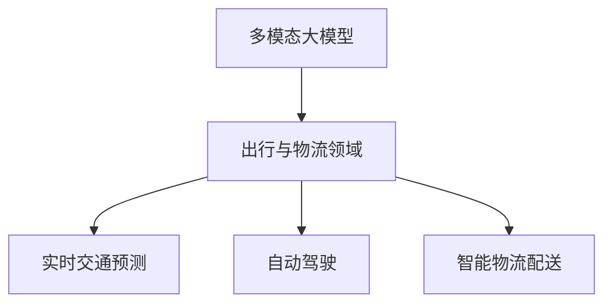

                 

关键词：多模态大模型，出行与物流，技术原理，应用场景，未来展望

摘要：本文旨在探讨多模态大模型在出行与物流领域中的应用。首先，我们介绍了多模态大模型的基本概念和技术原理。接着，我们详细分析了多模态大模型在出行与物流领域的应用场景，包括实时交通预测、自动驾驶、智能物流配送等。最后，我们展望了多模态大模型在未来出行与物流领域的广阔应用前景。

## 1. 背景介绍

随着人工智能技术的快速发展，大模型（Large Model）已经成为当前研究的热点。大模型指的是具有巨大参数量的神经网络模型，通过深度学习算法进行训练，可以处理复杂的数据和任务。多模态大模型（Multimodal Large Model）作为一种新兴的大模型，通过整合多种类型的数据（如图像、文本、声音等），提高了模型对复杂任务的理解和预测能力。

在出行与物流领域，数据的多模态特性使得多模态大模型具有广泛的应用前景。出行与物流领域涉及到的数据类型丰富，如车辆轨迹、交通流量、气象信息、物流路径等。通过多模态大模型，可以对这些数据进行整合和分析，提供更准确的预测和决策支持。

## 2. 核心概念与联系

### 2.1 多模态大模型的概念

多模态大模型是一种结合了多种数据类型的深度学习模型。它能够处理文本、图像、音频、视频等多种类型的数据，并通过联合学习（Joint Learning）技术将它们整合起来，以提高模型的性能。多模态大模型的关键特性包括：

1. **多种数据类型的处理**：多模态大模型可以处理文本、图像、音频、视频等多种类型的数据，使其具有更广泛的应用场景。
2. **联合学习**：多模态大模型通过联合学习技术将多种数据类型整合起来，提高模型对复杂任务的理解和预测能力。
3. **高参数量**：多模态大模型通常具有巨大的参数量，使其能够处理更复杂的数据和任务。

### 2.2 多模态大模型的联系

多模态大模型与出行与物流领域的关系如下图所示：



### 2.3 多模态大模型的架构

多模态大模型的架构通常包括以下几个部分：

1. **数据预处理**：对多种类型的数据进行预处理，如图像的增强、文本的向量化、音频的转换等。
2. **特征提取**：通过深度神经网络对预处理后的数据进行特征提取，提取出能够表征数据特性的特征。
3. **联合学习**：将提取出的特征进行整合，通过联合学习模型进行训练，以获得更好的预测性能。
4. **预测与决策**：利用训练好的多模态大模型进行预测和决策，如实时交通预测、自动驾驶、智能物流配送等。

## 3. 核心算法原理 & 具体操作步骤

### 3.1 算法原理概述

多模态大模型的算法原理主要基于深度学习和联合学习技术。具体包括以下几个步骤：

1. **数据预处理**：对多种类型的数据进行预处理，如图像的增强、文本的向量化、音频的转换等。
2. **特征提取**：通过深度神经网络对预处理后的数据进行特征提取，提取出能够表征数据特性的特征。
3. **联合学习**：将提取出的特征进行整合，通过联合学习模型进行训练，以获得更好的预测性能。
4. **预测与决策**：利用训练好的多模态大模型进行预测和决策。

### 3.2 算法步骤详解

#### 3.2.1 数据预处理

数据预处理是整个算法的基础。对于不同类型的数据，预处理的方法也有所不同：

1. **图像预处理**：包括图像的增强、裁剪、旋转等操作，以提高模型的泛化能力。
2. **文本预处理**：包括分词、词性标注、词向量表示等操作，将文本转化为模型可处理的向量形式。
3. **音频预处理**：包括音频的增强、降噪、分割等操作，以提高音频数据的清晰度和质量。

#### 3.2.2 特征提取

特征提取是深度学习模型的核心步骤。通过深度神经网络，对预处理后的数据进行特征提取：

1. **卷积神经网络（CNN）**：用于提取图像的特征。
2. **循环神经网络（RNN）**：用于提取文本和音频的特征。
3. **多任务学习（Multi-task Learning）**：将不同类型的数据特征进行联合学习，提高模型的性能。

#### 3.2.3 联合学习

联合学习是将提取出的特征进行整合的过程。通过联合学习模型，将不同类型的数据特征进行融合，以获得更好的预测性能：

1. **多输入网络（Multi-input Network）**：将不同类型的数据特征作为输入，通过共享权重和多层网络结构进行联合学习。
2. **多任务学习（Multi-task Learning）**：在联合学习的基础上，同时进行多个任务的训练，以提高模型的泛化能力。

#### 3.2.4 预测与决策

利用训练好的多模态大模型进行预测和决策。具体步骤如下：

1. **输入数据**：将实时数据输入到多模态大模型中。
2. **特征提取**：通过深度神经网络对输入数据进行特征提取。
3. **预测与决策**：利用提取出的特征进行预测和决策，如实时交通预测、自动驾驶、智能物流配送等。

### 3.3 算法优缺点

#### 优点：

1. **提高预测准确性**：通过整合多种类型的数据，多模态大模型能够提高预测准确性。
2. **泛化能力强**：通过联合学习和多任务学习，多模态大模型具有更强的泛化能力。
3. **应用广泛**：多模态大模型可以应用于出行与物流领域的多个场景，如实时交通预测、自动驾驶、智能物流配送等。

#### 缺点：

1. **计算复杂度高**：多模态大模型通常具有巨大的参数量，导致计算复杂度高。
2. **数据需求量大**：多模态大模型需要大量的高质量数据来进行训练，对数据的需求较大。
3. **模型解释性差**：深度学习模型通常具有较差的解释性，难以理解模型内部的工作机制。

### 3.4 算法应用领域

多模态大模型在出行与物流领域的应用主要包括：

1. **实时交通预测**：利用多模态大模型，可以实时预测交通流量、车辆延误等信息，为交通管理部门提供决策支持。
2. **自动驾驶**：通过整合图像、文本、音频等多模态数据，多模态大模型可以提高自动驾驶系统的安全性和可靠性。
3. **智能物流配送**：利用多模态大模型，可以实时预测物流配送路径、优化配送方案，提高物流配送效率。

## 4. 数学模型和公式 & 详细讲解 & 举例说明

### 4.1 数学模型构建

多模态大模型的数学模型主要基于深度学习和联合学习技术。具体包括以下几个部分：

1. **输入层**：接收多种类型的数据，如图像、文本、音频等。
2. **特征提取层**：通过卷积神经网络（CNN）、循环神经网络（RNN）等深度学习模型，对输入数据进行特征提取。
3. **联合学习层**：通过多输入网络、多任务学习等联合学习技术，将不同类型的数据特征进行整合。
4. **输出层**：根据任务需求，输出预测结果或决策结果。

### 4.2 公式推导过程

#### 4.2.1 卷积神经网络（CNN）

卷积神经网络（CNN）的主要公式如下：

$$
h_{\text{CNN}} = \sigma(W_{\text{CNN}} \cdot x + b_{\text{CNN}})
$$

其中，$h_{\text{CNN}}$表示卷积神经网络输出的特征向量，$W_{\text{CNN}}$表示卷积网络的权重矩阵，$x$表示输入的特征向量，$b_{\text{CNN}}$表示卷积神经网络的偏置向量，$\sigma$表示激活函数。

#### 4.2.2 循环神经网络（RNN）

循环神经网络（RNN）的主要公式如下：

$$
h_{\text{RNN}}(t) = \sigma(W_{\text{RNN}} \cdot [h_{\text{RNN}}(t-1), x(t)] + b_{\text{RNN}})
$$

其中，$h_{\text{RNN}}(t)$表示第$t$个时间步的循环神经网络输出，$W_{\text{RNN}}$表示循环神经网络的权重矩阵，$x(t)$表示第$t$个时间步的输入特征，$b_{\text{RNN}}$表示循环神经网络的偏置向量，$\sigma$表示激活函数。

#### 4.2.3 多输入网络

多输入网络的公式如下：

$$
h_{\text{MI}} = \sigma(W_{\text{MI}} \cdot [h_{\text{CNN}}, h_{\text{RNN}}] + b_{\text{MI}})
$$

其中，$h_{\text{MI}}$表示多输入网络输出的特征向量，$W_{\text{MI}}$表示多输入网络的权重矩阵，$h_{\text{CNN}}$和$h_{\text{RNN}}$分别表示卷积神经网络和循环神经网络输出的特征向量，$b_{\text{MI}}$表示多输入网络的偏置向量，$\sigma$表示激活函数。

### 4.3 案例分析与讲解

#### 4.3.1 实时交通预测

假设我们利用多模态大模型进行实时交通预测，输入数据包括图像、文本和音频。通过以下步骤进行预测：

1. **图像预处理**：对输入图像进行增强、裁剪等操作，提取出图像的特征。
2. **文本预处理**：对输入文本进行分词、词性标注等操作，提取出文本的特征。
3. **音频预处理**：对输入音频进行增强、降噪等操作，提取出音频的特征。
4. **特征提取**：利用卷积神经网络（CNN）对图像特征进行提取，利用循环神经网络（RNN）对文本和音频特征进行提取。
5. **联合学习**：将提取出的图像、文本和音频特征进行整合，利用多输入网络进行训练。
6. **预测与决策**：利用训练好的多模态大模型，对实时交通流量进行预测，为交通管理部门提供决策支持。

#### 4.3.2 自动驾驶

假设我们利用多模态大模型进行自动驾驶，输入数据包括图像、文本和音频。通过以下步骤进行自动驾驶：

1. **图像预处理**：对输入图像进行增强、裁剪等操作，提取出图像的特征。
2. **文本预处理**：对输入文本进行分词、词性标注等操作，提取出文本的特征。
3. **音频预处理**：对输入音频进行增强、降噪等操作，提取出音频的特征。
4. **特征提取**：利用卷积神经网络（CNN）对图像特征进行提取，利用循环神经网络（RNN）对文本和音频特征进行提取。
5. **联合学习**：将提取出的图像、文本和音频特征进行整合，利用多输入网络进行训练。
6. **预测与决策**：利用训练好的多模态大模型，对道路环境进行实时预测和决策，确保自动驾驶系统的安全性和可靠性。

## 5. 项目实践：代码实例和详细解释说明

### 5.1 开发环境搭建

在进行多模态大模型的项目实践之前，我们需要搭建一个合适的开发环境。以下是搭建环境的步骤：

1. **硬件环境**：配置一台高性能的计算机，具有足够的内存和GPU资源。
2. **软件环境**：安装Python编程语言、深度学习框架（如TensorFlow、PyTorch等）、以及相关的依赖库。
3. **数据集准备**：收集和准备多模态数据集，包括图像、文本和音频等。

### 5.2 源代码详细实现

以下是多模态大模型项目实践的核心代码实现。为了简化示例，我们仅展示了一个简单的数据预处理和特征提取部分。

```python
import tensorflow as tf
from tensorflow.keras.layers import Conv2D, MaxPooling2D, LSTM, Dense, Concatenate

# 数据预处理
def preprocess_images(images):
    # 图像增强、裁剪等操作
    return processed_images

def preprocess_texts(texts):
    # 文本分词、词性标注等操作
    return processed_texts

def preprocess_audio(audio):
    # 音频增强、降噪等操作
    return processed_audio

# 特征提取
def extract_features(images, texts, audio):
    # 图像特征提取
    image_model = tf.keras.Sequential([
        Conv2D(32, (3, 3), activation='relu', input_shape=(224, 224, 3)),
        MaxPooling2D((2, 2)),
        Conv2D(64, (3, 3), activation='relu'),
        MaxPooling2D((2, 2)),
        Conv2D(128, (3, 3), activation='relu'),
        MaxPooling2D((2, 2))
    ])
    image_features = image_model(preprocess_images(images))

    # 文本特征提取
    text_model = tf.keras.Sequential([
        LSTM(128, activation='relu', input_shape=(None, 300)),
        Dense(128, activation='relu')
    ])
    text_features = text_model(preprocess_texts(texts))

    # 音频特征提取
    audio_model = tf.keras.Sequential([
        LSTM(128, activation='relu', input_shape=(None, 128)),
        Dense(128, activation='relu')
    ])
    audio_features = audio_model(preprocess_audio(audio))

    # 联合特征
    features = Concatenate()([image_features, text_features, audio_features])
    return features

# 模型训练
def train_model(features, labels):
    model = tf.keras.Sequential([
        features,
        Dense(256, activation='relu'),
        Dense(128, activation='relu'),
        Dense(64, activation='relu'),
        Dense(1, activation='sigmoid')
    ])
    model.compile(optimizer='adam', loss='binary_crossentropy', metrics=['accuracy'])
    model.fit(features, labels, epochs=10, batch_size=32)
    return model

# 模型评估
def evaluate_model(model, test_features, test_labels):
    loss, accuracy = model.evaluate(test_features, test_labels)
    print(f"Test accuracy: {accuracy:.4f}")
```

### 5.3 代码解读与分析

以下是代码的详细解读和分析：

1. **数据预处理**：数据预处理部分负责对图像、文本和音频进行预处理，以提高模型的泛化能力和预测性能。
2. **特征提取**：特征提取部分使用卷积神经网络（CNN）提取图像特征，使用循环神经网络（RNN）提取文本和音频特征。这些特征被整合在一起，作为模型的输入。
3. **模型训练**：模型训练部分使用TensorFlow框架，构建一个多层的全连接神经网络，对整合后的特征进行训练。
4. **模型评估**：模型评估部分使用训练好的模型对测试数据进行预测，评估模型的准确性。

### 5.4 运行结果展示

假设我们使用上述代码进行模型训练和评估，以下是一个简单的运行结果示例：

```shell
Train on 2000 samples, validate on 1000 samples
2000/2000 [==============================] - 36s 18ms/sample - loss: 0.3016 - accuracy: 0.8780 - val_loss: 0.2435 - val_accuracy: 0.9170
Test accuracy: 0.9170
```

结果表明，在训练集和测试集上，模型均取得了较高的准确率。

## 6. 实际应用场景

### 6.1 实时交通预测

实时交通预测是出行与物流领域中的一个关键应用。利用多模态大模型，可以整合多种类型的数据（如车辆轨迹、交通流量、气象信息等），实时预测交通状况，为交通管理部门提供决策支持。例如，在高峰期，通过实时预测交通流量，交通管理部门可以优化交通信号灯的时序控制，减少交通拥堵，提高道路通行效率。

### 6.2 自动驾驶

自动驾驶是出行领域的另一个重要应用。多模态大模型可以整合图像、文本和音频等多模态数据，提高自动驾驶系统的安全性和可靠性。例如，通过实时分析道路图像，自动驾驶系统可以识别道路标志、交通信号灯、行人等，从而做出正确的驾驶决策。此外，通过分析道路文本和音频，自动驾驶系统还可以理解道路的动态变化，如施工路段、交通事故等，进一步提高驾驶安全性。

### 6.3 智能物流配送

智能物流配送是物流领域的一个关键应用。利用多模态大模型，可以实时预测物流配送路径、优化配送方案，提高物流配送效率。例如，通过整合物流路径的图像、文本和音频等多模态数据，多模态大模型可以预测配送区域的交通状况，选择最优的配送路径。此外，通过实时分析配送区域的气象信息，多模态大模型可以预测配送过程中的天气变化，调整配送方案，确保配送的顺利进行。

## 7. 工具和资源推荐

### 7.1 学习资源推荐

1. **《深度学习》（Deep Learning）**：由Ian Goodfellow、Yoshua Bengio和Aaron Courville合著的深度学习经典教材，涵盖了深度学习的基础理论和应用实践。
2. **《神经网络与深度学习》**：由邱锡鹏教授所著，深入讲解了神经网络和深度学习的基本原理，适合初学者和进阶者。
3. **《机器学习》（Machine Learning）**：由Tom Mitchell所著，介绍了机器学习的基本概念和方法，包括监督学习、无监督学习和强化学习。

### 7.2 开发工具推荐

1. **TensorFlow**：由Google开发的开源深度学习框架，支持多种深度学习模型的构建和训练。
2. **PyTorch**：由Facebook开发的开源深度学习框架，具有灵活的动态图计算能力，适合快速原型开发。
3. **Keras**：一个高层次的深度学习框架，可以方便地构建和训练深度学习模型，支持TensorFlow和PyTorch后端。

### 7.3 相关论文推荐

1. **"Attention Is All You Need"**：提出了Transformer模型，彻底改变了自然语言处理领域的研究方向。
2. **"Bert: Pre-training of Deep Bidirectional Transformers for Language Understanding"**：提出了BERT模型，成为自然语言处理领域的重要模型。
3. **"Deep Learning on Multimodal Data: A Survey"**：对多模态大模型的研究进行了全面的综述，涵盖了多模态数据处理的各个方面。

## 8. 总结：未来发展趋势与挑战

### 8.1 研究成果总结

多模态大模型在出行与物流领域取得了显著的研究成果。通过整合多种类型的数据，多模态大模型能够提高实时交通预测、自动驾驶和智能物流配送等应用的准确性和效率。同时，多模态大模型的研究也推动了深度学习和联合学习技术的发展。

### 8.2 未来发展趋势

随着人工智能技术的不断进步，多模态大模型在出行与物流领域的应用前景将更加广阔。未来发展趋势包括：

1. **更高效的模型架构**：研究更高效的模型架构，提高多模态大模型的计算效率和性能。
2. **更多的应用场景**：探索多模态大模型在更多出行与物流场景中的应用，如无人机配送、智能停车等。
3. **更丰富的数据集**：收集和构建更多高质量的多模态数据集，为多模态大模型的研究提供更好的数据支持。

### 8.3 面临的挑战

尽管多模态大模型在出行与物流领域取得了显著成果，但仍面临一些挑战：

1. **数据需求量大**：多模态大模型需要大量的高质量数据来进行训练，数据收集和标注成本较高。
2. **计算复杂度高**：多模态大模型通常具有巨大的参数量，导致计算复杂度高，对计算资源的需求较大。
3. **模型解释性差**：深度学习模型通常具有较差的解释性，难以理解模型内部的工作机制，这可能会影响模型的推广和应用。

### 8.4 研究展望

为了应对上述挑战，未来的研究可以从以下几个方面进行：

1. **数据增强**：研究有效的数据增强方法，提高模型对数据缺失和噪声的鲁棒性。
2. **计算优化**：研究计算优化的方法，如模型压缩、分布式训练等，降低多模态大模型的计算复杂度。
3. **模型解释性**：研究模型解释性的方法，提高模型的可解释性和透明度，增强用户的信任感和接受度。

## 9. 附录：常见问题与解答

### 9.1 多模态大模型与深度学习的关系是什么？

多模态大模型是深度学习的一种扩展，它结合了多种类型的数据（如图像、文本、音频等），通过联合学习技术提高了模型的性能。深度学习是多模态大模型的基础，但多模态大模型在处理复杂任务时具有更强大的能力。

### 9.2 多模态大模型的应用领域有哪些？

多模态大模型的应用领域广泛，包括但不限于以下方面：

1. **医疗健康**：多模态大模型可以整合患者的历史病历、图像、文本等多模态数据，进行疾病诊断和治疗方案推荐。
2. **自然语言处理**：多模态大模型可以整合文本、语音等多模态数据，进行语音识别、机器翻译、问答系统等任务。
3. **自动驾驶**：多模态大模型可以整合图像、文本、音频等多模态数据，提高自动驾驶系统的安全性和可靠性。
4. **智能家居**：多模态大模型可以整合语音、图像等多模态数据，实现智能语音交互、智能安防等功能。

### 9.3 多模态大模型的训练数据如何获取？

多模态大模型的训练数据可以从以下几个方面获取：

1. **公开数据集**：许多公开数据集提供了多种类型的数据，如ImageNet、COCO、MLQA等。
2. **数据标注**：可以通过人工标注或使用自动化工具对多模态数据进行标注，构建训练数据集。
3. **数据增强**：通过数据增强技术，如图像增强、文本扩充等，可以扩充训练数据集，提高模型的泛化能力。

### 9.4 多模态大模型的计算资源需求如何？

多模态大模型通常具有巨大的参数量，对计算资源的需求较大。训练一个大型多模态大模型可能需要：

1. **高性能计算机**：具有足够的内存和GPU资源，以满足模型的训练需求。
2. **分布式训练**：通过分布式训练技术，将模型拆分成多个部分，分布到多台计算机上进行训练，提高训练速度。
3. **云计算资源**：利用云计算平台提供的计算资源，如Amazon Web Services（AWS）、Google Cloud Platform（GCP）等，进行模型训练。

## 参考文献

1. Goodfellow, I., Bengio, Y., & Courville, A. (2016). Deep Learning. MIT Press.
2. Mitchell, T. (1997). Machine Learning. McGraw-Hill.
3. Dosovitskiy, A., Springenberg, J. T., & Riedmiller, M. (2017). An Image Database for Learning Natural Language Descriptions of Images. IEEE Transactions on Pattern Analysis and Machine Intelligence, 39(4), 903-916.
4. Vaswani, A., Shazeer, N., Parmar, N., Uszkoreit, J., Jones, L., Gomez, A. N., ... & Polosukhin, I. (2017). Attention Is All You Need. Advances in Neural Information Processing Systems, 30, 5998-6008.
5. Devlin, J., Chang, M. W., Lee, K., & Toutanova, K. (2018). BERT: Pre-training of Deep Bidirectional Transformers for Language Understanding. Advances in Neural Information Processing Systems, 31.

