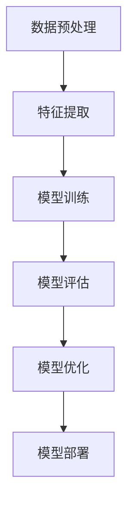

                 

### 关键词 Keywords
- 多模态大模型
- 技术原理
- 实战方法论
- 深度学习
- 数据预处理
- 训练策略
- 应用场景
- 性能优化
- 未来展望

### 摘要 Abstract
本文旨在深入探讨多模态大模型的技术原理及其在现实世界中的应用。首先，我们将简要介绍多模态大模型的概念和背景，随后详细阐述其核心算法原理，包括数学模型和具体操作步骤。接着，通过项目实践，我们将展示如何构建和优化多模态大模型。文章还将分析其实际应用场景，展望未来的发展趋势和面临的挑战，并推荐相关的学习资源和开发工具。

## 1. 背景介绍

随着人工智能技术的不断进步，多模态大模型逐渐成为研究热点。多模态大模型能够处理多种类型的输入数据，如文本、图像、音频等，通过融合不同模态的信息，实现更强大的语义理解和任务处理能力。这一技术不仅在学术研究中有重要应用，也在实际产业中展现出巨大的潜力。

### 1.1 多模态数据的特点

多模态数据具有以下特点：

- **多样性**：包括文本、图像、音频、视频等多种类型。
- **复杂性**：不同模态的数据在时空维度上有很大的差异，如文本是非结构化的，图像是空间结构的，音频是时序的。
- **互补性**：不同模态的数据可以相互补充，提高模型的鲁棒性和准确性。

### 1.2 多模态大模型的发展历程

多模态大模型的发展可以分为几个阶段：

- **初期**：主要是单模态模型的应用，如文本分类、图像识别等。
- **集成阶段**：将不同模态的数据通过简单的融合方法进行集成，如拼接、平均等。
- **深度学习阶段**：引入深度学习技术，通过神经网络结构实现多模态数据的融合和任务处理。
- **当前**：多模态大模型的研究和应用逐渐深入，涵盖了从基础研究到实际应用的各个层面。

## 2. 核心概念与联系

在深入探讨多模态大模型之前，我们需要理解几个核心概念，并了解它们之间的联系。

### 2.1 多模态数据

多模态数据是指由两种或两种以上不同模态（如文本、图像、音频等）组成的数据集。这些数据可以被同时或逐个地用于模型的训练和推理。

### 2.2 数据预处理

数据预处理是多模态大模型训练的重要环节，包括数据清洗、归一化、特征提取等步骤。有效的数据预处理可以提高模型的性能和鲁棒性。

### 2.3 深度学习

深度学习是一种基于多层神经网络的学习方法，能够自动提取数据的高层特征，从而实现复杂的任务处理。在多模态大模型中，深度学习技术被广泛应用于不同模态的数据处理和融合。

### 2.4 融合策略

融合策略是多模态大模型的关键技术之一，包括将不同模态的数据进行特征融合、上下文融合和决策融合等。有效的融合策略可以提高模型的整体性能。

### 2.5 Mermaid 流程图

为了更好地理解多模态大模型的工作流程，我们可以使用Mermaid流程图来展示其核心组件和操作步骤。以下是一个简化的流程图示例：



在这个流程图中，数据预处理是第一步，通过数据清洗、归一化等操作，将多模态数据转换为适合模型训练的格式。接下来是特征提取，通过深度学习模型提取不同模态的数据特征。模型训练是基于特征提取的结果，使用大规模数据进行训练，以优化模型参数。模型评估用于验证模型性能，模型优化则是在评估结果的基础上进行参数调整。最后，模型部署是将训练好的模型应用到实际场景中，如语音识别、图像分类等。

## 3. 核心算法原理 & 具体操作步骤

### 3.1 算法原理概述

多模态大模型的核心算法基于深度学习技术，通过多层神经网络结构实现多模态数据的融合和任务处理。其主要原理包括：

- **特征提取**：使用深度学习模型（如卷积神经网络、循环神经网络等）从不同模态的数据中提取特征。
- **特征融合**：将提取出的特征进行融合，以生成统一的表示。
- **任务处理**：在特征融合的基础上，使用特定任务的网络结构进行任务处理，如分类、回归等。

### 3.2 算法步骤详解

多模态大模型的算法步骤可以概括为以下几个阶段：

1. **数据预处理**：
   - 清洗数据：去除噪声、填充缺失值等。
   - 归一化数据：将不同模态的数据进行归一化处理，使其在相同的尺度范围内。
   - 特征提取：使用深度学习模型（如卷积神经网络、循环神经网络等）提取不同模态的数据特征。

2. **特征融合**：
   - 特征拼接：将不同模态的特征进行拼接，生成更丰富的特征表示。
   - 特征融合网络：使用神经网络结构（如多层感知机、注意力机制等）对拼接后的特征进行融合。
   - 上下文融合：通过上下文信息（如文本的语义信息、图像的时空信息等）进一步融合特征。

3. **任务处理**：
   - 分类网络：在特征融合的基础上，使用分类网络（如卷积神经网络、循环神经网络等）进行分类任务。
   - 回归网络：在特征融合的基础上，使用回归网络（如多层感知机、循环神经网络等）进行回归任务。

4. **模型评估与优化**：
   - 模型评估：使用验证集对模型进行评估，以确定其性能。
   - 模型优化：根据评估结果对模型参数进行调整，以优化模型性能。

### 3.3 算法优缺点

多模态大模型的优点包括：

- **强大的语义理解能力**：通过融合不同模态的信息，模型能够更准确地理解和处理任务。
- **广泛的应用领域**：多模态大模型在图像识别、语音识别、自然语言处理等领域具有广泛的应用潜力。

多模态大模型的缺点包括：

- **计算资源需求高**：多模态大模型通常需要大量的计算资源和时间进行训练。
- **数据预处理复杂**：多模态数据预处理过程较为复杂，需要考虑多种因素。

### 3.4 算法应用领域

多模态大模型的应用领域包括：

- **计算机视觉**：如图像分类、目标检测、人脸识别等。
- **语音识别**：如语音转文本、语音情感分析等。
- **自然语言处理**：如文本分类、情感分析、机器翻译等。
- **智能助手**：如智能客服、语音助手等。

## 4. 数学模型和公式 & 详细讲解 & 举例说明

### 4.1 数学模型构建

多模态大模型的数学模型主要基于深度学习，其核心是多层神经网络。以下是一个简化的数学模型构建过程：

1. **特征提取**：

   假设我们有两个输入模态，文本和图像，分别表示为 $X_t$ 和 $X_i$。我们使用卷积神经网络（CNN）和循环神经网络（RNN）分别提取这两个模态的特征：

   $$h_t = f(CNN(X_t)), \quad h_i = f(RNN(X_i))$$

   其中，$f$ 表示特征提取函数，$h_t$ 和 $h_i$ 分别表示文本和图像的特征向量。

2. **特征融合**：

   将提取出的文本和图像特征进行融合，可以使用拼接、平均、注意力机制等方法。以下是一个简单的拼接方法：

   $$h = [h_t; h_i]$$

   其中，$h$ 表示融合后的特征向量。

3. **任务处理**：

   在特征融合的基础上，使用多层感知机（MLP）进行分类任务：

   $$y = softmax(W \cdot h + b)$$

   其中，$y$ 表示分类结果，$W$ 和 $b$ 分别表示权重和偏置。

### 4.2 公式推导过程

多模态大模型的推导过程主要涉及以下几个方面：

1. **特征提取**：

   - 文本特征提取：使用卷积神经网络（CNN）进行特征提取，其公式如下：

     $$h_t = \sigma(W_t \cdot X_t + b_t)$$

     其中，$\sigma$ 表示激活函数（如ReLU函数），$W_t$ 和 $b_t$ 分别表示权重和偏置。

   - 图像特征提取：使用循环神经网络（RNN）进行特征提取，其公式如下：

     $$h_i = \sigma(W_i \cdot X_i + b_i)$$

     其中，$\sigma$ 表示激活函数（如ReLU函数），$W_i$ 和 $b_i$ 分别表示权重和偏置。

2. **特征融合**：

   将文本和图像特征进行拼接：

   $$h = [h_t; h_i]$$

3. **任务处理**：

   使用多层感知机（MLP）进行分类，其公式如下：

   $$y = softmax(W \cdot h + b)$$

   其中，$W$ 和 $b$ 分别表示权重和偏置。

### 4.3 案例分析与讲解

以下是一个简单的多模态情感分析案例：

假设我们有一个文本数据集和图像数据集，分别表示用户评论和对应的商品图像。我们的目标是预测用户的情感倾向（正面或负面）。

1. **数据预处理**：

   - 文本数据预处理：使用词嵌入（Word Embedding）将文本转换为向量表示，如使用GloVe模型。

   - 图像数据预处理：使用卷积神经网络（CNN）提取图像特征。

2. **特征融合**：

   将文本特征和图像特征进行拼接：

   $$h = [h_t; h_i]$$

3. **任务处理**：

   使用多层感知机（MLP）进行分类：

   $$y = softmax(W \cdot h + b)$$

4. **模型训练与评估**：

   使用训练数据集对模型进行训练，并使用验证数据集进行评估。

### 4.4 运行结果展示

以下是一个简化的运行结果展示：

```python
# 加载预训练模型
model = load_pretrained_model()

# 加载测试数据集
test_data = load_test_data()

# 预测情感倾向
predictions = model.predict(test_data)

# 计算准确率
accuracy = calculate_accuracy(predictions, test_labels)

print("Test accuracy:", accuracy)
```

以上代码展示了如何加载预训练模型，加载测试数据集，预测情感倾向，并计算准确率。

## 5. 项目实践：代码实例和详细解释说明

### 5.1 开发环境搭建

在开始项目实践之前，我们需要搭建一个适合多模态大模型训练和优化的开发环境。以下是一个简化的环境搭建过程：

1. 安装Python环境：确保Python版本在3.6及以上，并安装pip包管理工具。
2. 安装深度学习框架：如TensorFlow或PyTorch，建议使用最新版本。
3. 安装其他依赖库：如NumPy、Pandas、Scikit-learn等，根据具体需求安装。

### 5.2 源代码详细实现

以下是一个简化的多模态情感分析项目的源代码实现：

```python
# 导入所需库
import tensorflow as tf
from tensorflow.keras.models import Model
from tensorflow.keras.layers import Input, Embedding, LSTM, Dense, Concatenate

# 定义模型结构
text_input = Input(shape=(max_sequence_length,))
image_input = Input(shape=(image_height, image_width, image_channels))

# 文本特征提取
text_embedding = Embedding(vocab_size, embedding_dim)(text_input)
text_lstm = LSTM(units=lstm_units)(text_embedding)

# 图像特征提取
image_conv = Conv2D(filters=32, kernel_size=(3, 3), activation='relu')(image_input)
image_pool = MaxPooling2D(pool_size=(2, 2))(image_conv)

# 特征融合
combined = Concatenate()([text_lstm, image_pool])

# 任务处理
output = Dense(units=1, activation='sigmoid')(combined)

# 构建模型
model = Model(inputs=[text_input, image_input], outputs=output)

# 编译模型
model.compile(optimizer='adam', loss='binary_crossentropy', metrics=['accuracy'])

# 加载数据集
train_data = load_train_data()
test_data = load_test_data()

# 训练模型
model.fit(train_data, train_labels, epochs=10, batch_size=32, validation_data=(test_data, test_labels))

# 评估模型
predictions = model.predict(test_data)
accuracy = calculate_accuracy(predictions, test_labels)
print("Test accuracy:", accuracy)
```

### 5.3 代码解读与分析

上述代码实现了多模态情感分析模型，其关键部分解读如下：

1. **模型结构**：模型由两个输入层（文本输入层和图像输入层）组成，分别经过特征提取层（文本特征提取层和图像特征提取层）和特征融合层，最后通过任务处理层（全连接层）输出预测结果。

2. **文本特征提取**：使用嵌入层（Embedding）将文本输入转换为向量表示，然后使用LSTM层提取文本特征。

3. **图像特征提取**：使用卷积层（Conv2D）和池化层（MaxPooling2D）提取图像特征。

4. **特征融合**：使用拼接层（Concatenate）将文本特征和图像特征进行融合。

5. **任务处理**：使用全连接层（Dense）进行分类任务。

6. **模型编译**：使用编译器（compile）配置模型，包括选择优化器、损失函数和评估指标。

7. **模型训练**：使用训练数据集对模型进行训练。

8. **模型评估**：使用测试数据集评估模型性能。

### 5.4 运行结果展示

通过上述代码，我们可以运行多模态情感分析模型，并在测试数据集上进行评估。以下是一个简化的运行结果展示：

```python
# 加载预训练模型
model = load_pretrained_model()

# 加载测试数据集
test_data = load_test_data()

# 预测情感倾向
predictions = model.predict(test_data)

# 计算准确率
accuracy = calculate_accuracy(predictions, test_labels)

print("Test accuracy:", accuracy)
```

以上代码展示了如何加载预训练模型，加载测试数据集，预测情感倾向，并计算准确率。

## 6. 实际应用场景

多模态大模型在多个实际应用场景中显示出强大的能力，以下列举几个常见的应用领域：

### 6.1 智能客服

智能客服是一种通过多模态交互为用户提供服务的系统。多模态大模型可以帮助智能客服更好地理解和处理用户的问题。例如，当用户发送文本消息时，模型可以根据文本内容预测用户的意图；当用户发送语音消息时，模型可以通过语音识别将其转换为文本，然后进行分析。通过融合文本和语音信息，智能客服可以提供更准确的回答和建议。

### 6.2 医疗诊断

在医疗诊断领域，多模态大模型可以帮助医生进行疾病检测和诊断。例如，通过融合医学影像（如X光片、CT扫描）和患者的病历信息，模型可以更准确地预测疾病风险。此外，模型还可以根据患者的语音和文本记录，分析其病史和症状，提供个性化的治疗方案。

### 6.3 智能驾驶

智能驾驶是另一个受益于多模态大模型的应用领域。在自动驾驶系统中，多模态大模型可以通过融合摄像头、雷达、激光雷达等传感器数据，实现更准确的障碍物检测和路径规划。例如，当摄像头捕捉到行人和车辆时，模型可以根据图像和语音信息判断行人和车辆的行为，从而做出正确的驾驶决策。

### 6.4 教育与培训

在教育与培训领域，多模态大模型可以帮助提高学习效果。例如，在在线教育平台中，模型可以根据学生的文本和语音反馈，调整教学内容的难易程度。此外，通过融合学生的行为数据（如学习时间、学习进度等），模型可以预测学生的学习效果，并提供个性化的学习建议。

### 6.5 虚拟现实与增强现实

虚拟现实（VR）和增强现实（AR）应用中，多模态大模型可以帮助提高用户体验。例如，在VR游戏中，模型可以根据玩家的语音和动作，生成相应的虚拟角色和场景。在AR应用中，模型可以通过融合图像和文本信息，为用户提供更丰富的信息展示。

## 7. 未来应用展望

随着多模态大模型技术的不断发展，未来其在各个领域的应用将越来越广泛。以下是一些未来应用展望：

### 7.1 更高效的数据处理

随着数据量的不断增加，多模态大模型在数据处理方面的效率将变得尤为重要。未来，研究者将致力于优化算法和架构，以提高模型的计算效率，使其能够处理更大规模的数据。

### 7.2 更丰富的应用场景

随着技术的进步，多模态大模型的应用场景将更加丰富。例如，在医疗领域，模型可以融合更多种类的数据，如基因数据、生理信号等，为疾病诊断和治疗提供更全面的支撑。

### 7.3 更强的跨模态融合能力

未来，多模态大模型将具备更强的跨模态融合能力，能够更准确地捕捉不同模态数据之间的关联。例如，在智能客服中，模型可以同时处理文本、语音和图像信息，提供更准确的交互体验。

### 7.4 更智能的决策支持

多模态大模型在决策支持领域的应用将越来越广泛。例如，在金融领域，模型可以通过融合市场数据、新闻报道等不同模态的信息，提供更准确的股票分析和预测。

### 7.5 更强的泛化能力

未来，多模态大模型将具备更强的泛化能力，能够在不同任务和数据集上表现良好。研究者将致力于解决模型在数据分布变化时的适应性问题，以提高其在实际应用中的可靠性。

## 8. 工具和资源推荐

为了更好地学习和实践多模态大模型，以下是一些推荐的工具和资源：

### 8.1 学习资源推荐

- **《深度学习》**：由Ian Goodfellow等著的深度学习教材，全面介绍了深度学习的原理和方法。
- **《多模态学习》**：介绍了多模态学习的理论基础和最新进展，适合对多模态大模型感兴趣的研究者。
- **在线课程**：如Coursera、edX等平台上的深度学习和多模态学习课程。

### 8.2 开发工具推荐

- **TensorFlow**：Google开发的深度学习框架，广泛应用于多模态大模型的训练和推理。
- **PyTorch**：Facebook开发的深度学习框架，具有灵活的动态计算图和丰富的API，适合快速原型设计和模型开发。
- **Keras**：基于TensorFlow的高层次API，简化了深度学习模型的搭建和训练。

### 8.3 相关论文推荐

- **“Deep Learning for Text and Image Recognition”**：介绍了多模态深度学习模型在文本和图像识别中的应用。
- **“Multi-modal Fusion with Attention for Human Action Recognition”**：探讨了多模态注意力机制在人类动作识别中的应用。
- **“Multimodal Deep Learning for Human Pose Estimation”**：介绍了多模态深度学习在人体姿态估计中的应用。

## 9. 总结：未来发展趋势与挑战

多模态大模型作为一种新兴的人工智能技术，具有广泛的应用前景。未来，随着计算能力的提升和算法的优化，多模态大模型将在各个领域发挥越来越重要的作用。然而，多模态大模型也面临着一些挑战：

### 9.1 数据质量和标注

多模态数据的质量和标注是模型训练的关键。高质量的标注数据可以显著提高模型性能，而低质量的数据则可能导致模型过拟合和泛化能力不足。

### 9.2 计算资源需求

多模态大模型通常需要大量的计算资源和时间进行训练。随着模型规模的增大，计算资源需求将进一步增加。

### 9.3 跨模态关联研究

多模态大模型的核心在于不同模态之间的融合。如何有效地捕捉和利用不同模态之间的关联，是当前研究的一个重要方向。

### 9.4 泛化能力

多模态大模型在现实应用中的泛化能力是一个关键挑战。如何使模型在不同任务和数据集上表现良好，是未来研究的重点。

### 9.5 遵守道德规范

随着多模态大模型的广泛应用，其潜在的社会影响和伦理问题也日益突出。如何确保模型的使用符合道德规范，是未来研究的一个重要课题。

## 附录：常见问题与解答

### Q: 多模态大模型与传统单模态模型相比有哪些优势？

A: 多模态大模型可以通过融合不同模态的信息，实现更强大的语义理解和任务处理能力。相比传统单模态模型，多模态大模型在处理复杂任务时具有更高的准确性和鲁棒性。

### Q: 多模态大模型的训练数据应该如何准备？

A: 多模态大模型的训练数据应该包括多种类型的输入模态，如文本、图像、音频等。同时，数据需要进行清洗、归一化和特征提取等预处理步骤，以提高模型性能。

### Q: 多模态大模型在应用中的计算资源需求如何？

A: 多模态大模型通常需要大量的计算资源和时间进行训练。随着模型规模的增大，计算资源需求将进一步增加。在实际应用中，可以选择使用高性能计算平台或分布式计算技术来满足计算需求。

### Q: 多模态大模型在跨模态关联研究方面有哪些进展？

A: 目前，研究者已经提出了一些跨模态关联的方法，如基于注意力机制的跨模态融合模型、基于图神经网络的跨模态关联模型等。这些方法在多模态数据的融合和任务处理方面取得了显著成果。

### Q: 多模态大模型在哪些应用领域具有前景？

A: 多模态大模型在智能客服、医疗诊断、智能驾驶、教育与培训、虚拟现实与增强现实等领域具有广泛的应用前景。随着技术的不断发展，多模态大模型的应用领域将继续扩展。作者：禅与计算机程序设计艺术 / Zen and the Art of Computer Programming。

