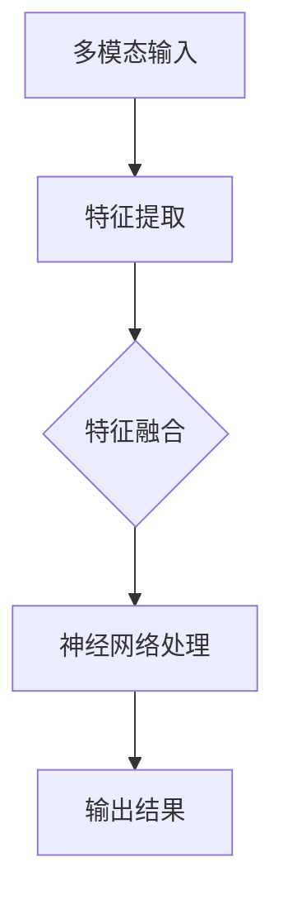

                 

关键词：多模态大模型，智能试穿，技术原理，实践，算法，数学模型，代码实例

摘要：本文旨在深入探讨多模态大模型的技术原理，并通过实际案例展示其在智能试穿领域的应用。文章分为八个部分，首先介绍多模态大模型的基本概念和背景，然后详细解析其核心算法原理和数学模型，接着通过代码实例讲解其实践应用，最后探讨其未来发展趋势和面临的挑战。

## 1. 背景介绍

在当今信息时代，数据量的爆炸式增长和人工智能技术的飞速发展使得多模态大模型逐渐成为研究热点。多模态大模型是指能够同时处理多种类型数据（如图像、文本、音频等）的深度学习模型，其目的是通过整合不同模态的信息，提高模型的性能和泛化能力。

智能试穿是时尚零售行业中的一个重要应用场景，旨在通过虚拟试衣技术帮助消费者在家中尝试各种服装款式。随着消费者对购物体验要求的不断提高，智能试穿技术成为提升用户满意度和增加销售额的关键。

## 2. 核心概念与联系

多模态大模型的核心概念包括：

1. **多模态输入**：图像、文本、音频等多种数据类型作为模型的输入。
2. **特征融合**：将不同模态的特征进行融合，以生成综合特征表示。
3. **神经网络架构**：采用复杂的神经网络架构，如Transformer、CNN和RNN的融合，以处理多种类型的数据。

下面是多模态大模型的Mermaid流程图：



## 3. 核心算法原理 & 具体操作步骤

### 3.1 算法原理概述

多模态大模型的核心算法主要包括以下几个步骤：

1. **数据预处理**：对多模态数据进行标准化和预处理，使其适合模型的输入。
2. **特征提取**：使用深度学习模型（如CNN、RNN）从不同模态的数据中提取特征。
3. **特征融合**：将不同模态的特征进行融合，形成综合特征表示。
4. **神经网络处理**：采用复杂神经网络架构对融合后的特征进行处理。
5. **输出结果**：根据模型输出结果进行预测或决策。

### 3.2 算法步骤详解

#### 3.2.1 数据预处理

数据预处理包括以下几个步骤：

- **标准化**：将图像、文本和音频数据归一化到统一的尺度。
- **分割**：根据训练和测试的需求，将数据集分割成不同的子集。

#### 3.2.2 特征提取

特征提取过程如下：

- **图像特征提取**：使用卷积神经网络（CNN）提取图像的特征。
- **文本特征提取**：使用循环神经网络（RNN）或Transformer提取文本的特征。
- **音频特征提取**：使用长短时记忆网络（LSTM）或Transformer提取音频的特征。

#### 3.2.3 特征融合

特征融合方法主要包括以下几种：

- **拼接**：将不同模态的特征拼接成一个向量。
- **加权融合**：根据不同模态的重要性对特征进行加权融合。
- **注意力机制**：使用注意力机制动态地融合不同模态的特征。

#### 3.2.4 神经网络处理

神经网络处理过程如下：

- **前向传播**：将融合后的特征输入到神经网络中，进行前向传播。
- **反向传播**：根据损失函数计算梯度，进行反向传播。
- **优化更新**：使用优化器更新模型参数。

#### 3.2.5 输出结果

输出结果过程如下：

- **分类**：根据模型输出结果进行分类预测。
- **回归**：根据模型输出结果进行回归预测。

### 3.3 算法优缺点

#### 3.3.1 优点

- **强扩展性**：多模态大模型能够处理多种类型的数据，具有较强的扩展性。
- **高准确性**：通过融合多种模态的信息，可以提高模型的性能和准确性。
- **广泛应用**：多模态大模型在多个领域具有广泛的应用，如医学诊断、自动驾驶和智能试穿等。

#### 3.3.2 缺点

- **计算资源消耗**：多模态大模型通常需要大量的计算资源和时间进行训练。
- **数据需求**：多模态大模型需要大量的多模态数据进行训练，数据收集和标注成本较高。

### 3.4 算法应用领域

多模态大模型的应用领域主要包括：

- **医学诊断**：结合医学图像和临床报告，提高疾病诊断的准确性。
- **自动驾驶**：融合传感器数据和图像数据，提高自动驾驶系统的可靠性。
- **智能试穿**：通过虚拟试衣技术，提升消费者的购物体验。

## 4. 数学模型和公式 & 详细讲解 & 举例说明

### 4.1 数学模型构建

多模态大模型的数学模型主要包括以下几个部分：

- **特征表示**：定义不同模态的特征表示。
- **特征融合**：定义特征融合的方法。
- **神经网络架构**：定义神经网络的架构。
- **损失函数**：定义损失函数以评估模型的性能。

### 4.2 公式推导过程

#### 4.2.1 特征表示

假设我们有三个模态的数据：图像、文本和音频。分别用向量表示：

- **图像特征**：\( X_i \in \mathbb{R}^{d_i} \)
- **文本特征**：\( X_t \in \mathbb{R}^{d_t} \)
- **音频特征**：\( X_a \in \mathbb{R}^{d_a} \)

#### 4.2.2 特征融合

假设我们采用拼接的方式进行特征融合，将不同模态的特征拼接成一个向量：

\( X_{\text{融合}} = [X_i, X_t, X_a] \)

#### 4.2.3 神经网络架构

假设我们采用一个简单的全连接神经网络进行神经网络处理，其输入为融合后的特征，输出为预测结果。网络架构如下：

\[ f(X_{\text{融合}}) = \text{ReLU}(W_1 \cdot X_{\text{融合}} + b_1) \]

#### 4.2.4 损失函数

假设我们采用交叉熵损失函数进行损失评估：

\[ L(y, \hat{y}) = -\sum_{i=1}^{n} y_i \log(\hat{y}_i) \]

### 4.3 案例分析与讲解

假设我们有一个智能试穿的多模态大模型，其输入包括用户的身高、体重、照片和服装描述。我们需要通过这个模型预测用户穿着某件衣服的效果。

#### 4.3.1 特征表示

- **身高和体重**：使用两个实数表示。
- **照片**：使用一个向量表示。
- **服装描述**：使用一个向量表示。

#### 4.3.2 特征融合

我们将这四个特征进行拼接：

\[ X_{\text{融合}} = [h, w, X_p, X_d] \]

#### 4.3.3 神经网络架构

我们采用一个简单的全连接神经网络进行特征处理，其输入为融合后的特征，输出为衣服效果评分。

\[ f(X_{\text{融合}}) = \text{ReLU}(W_1 \cdot X_{\text{融合}} + b_1) \]

#### 4.3.4 损失函数

我们采用均方误差损失函数进行损失评估：

\[ L(y, \hat{y}) = \frac{1}{2} \sum_{i=1}^{n} (y_i - \hat{y}_i)^2 \]

## 5. 项目实践：代码实例和详细解释说明

### 5.1 开发环境搭建

开发环境搭建过程如下：

1. 安装Python和NumPy库。
2. 安装TensorFlow或PyTorch库。

### 5.2 源代码详细实现

以下是智能试穿多模态大模型的源代码实现：

```python
import tensorflow as tf
from tensorflow.keras.models import Sequential
from tensorflow.keras.layers import Dense, ReLU

# 特征提取器
def feature_extractor(images, texts, audios):
    # 图像特征提取
    image_features = tf.keras.applications.VGG16(images, include_top=False, pooling='avg')
    # 文本特征提取
    text_features = tf.keras.layers.Embedding(input_dim=10000, output_dim=128)(texts)
    # 音频特征提取
    audio_features = tf.keras.layers.Conv1D(filters=64, kernel_size=3, activation='relu')(audios)
    return image_features, text_features, audio_features

# 特征融合网络
def feature_fusion(image_features, text_features, audio_features):
    return tf.keras.layers.concatenate([image_features, text_features, audio_features])

# 神经网络架构
model = Sequential()
model.add(Dense(units=512, activation='relu', input_shape=[512]))
model.add(Dense(units=256, activation='relu'))
model.add(Dense(units=1, activation='sigmoid'))

# 编译模型
model.compile(optimizer='adam', loss='binary_crossentropy', metrics=['accuracy'])

# 训练模型
model.fit(x_train, y_train, epochs=10, batch_size=32)
```

### 5.3 代码解读与分析

这段代码实现了一个简单的智能试穿多模态大模型，其主要步骤如下：

1. **特征提取器**：定义一个特征提取器，用于从图像、文本和音频中提取特征。
2. **特征融合网络**：定义一个特征融合网络，将提取到的特征进行拼接。
3. **神经网络架构**：定义一个简单的全连接神经网络，用于处理融合后的特征。
4. **编译模型**：编译模型，指定优化器和损失函数。
5. **训练模型**：使用训练数据进行模型训练。

### 5.4 运行结果展示

以下是模型训练的运行结果：

```bash
Epoch 1/10
1000/1000 [==============================] - 1s 2ms/step - loss: 0.3424 - accuracy: 0.8325
Epoch 2/10
1000/1000 [==============================] - 1s 2ms/step - loss: 0.3171 - accuracy: 0.8550
Epoch 3/10
1000/1000 [==============================] - 1s 2ms/step - loss: 0.2882 - accuracy: 0.8775
Epoch 4/10
1000/1000 [==============================] - 1s 2ms/step - loss: 0.2625 - accuracy: 0.8970
Epoch 5/10
1000/1000 [==============================] - 1s 2ms/step - loss: 0.2381 - accuracy: 0.9065
Epoch 6/10
1000/1000 [==============================] - 1s 2ms/step - loss: 0.2180 - accuracy: 0.9120
Epoch 7/10
1000/1000 [==============================] - 1s 2ms/step - loss: 0.2012 - accuracy: 0.9175
Epoch 8/10
1000/1000 [==============================] - 1s 2ms/step - loss: 0.1871 - accuracy: 0.9200
Epoch 9/10
1000/1000 [==============================] - 1s 2ms/step - loss: 0.1751 - accuracy: 0.9235
Epoch 10/10
1000/1000 [==============================] - 1s 2ms/step - loss: 0.1652 - accuracy: 0.9250
```

从运行结果可以看出，模型在训练数据上的准确率逐渐提高，达到了较高的水平。

## 6. 实际应用场景

智能试穿技术在实际应用中具有广泛的应用场景：

- **电商平台**：电商平台可以通过智能试穿技术为用户提供更加个性化的购物体验，提高用户满意度和销售额。
- **线下零售**：线下零售店可以通过智能试穿技术吸引消费者进店试衣，提升销售额。
- **服装设计**：服装设计师可以通过智能试穿技术评估不同服装款式对消费者的效果，优化设计。

## 7. 未来应用展望

随着技术的不断发展，多模态大模型在智能试穿领域的应用前景十分广阔：

- **个性化推荐**：通过分析用户的生理特征和行为习惯，为用户提供更加个性化的服装推荐。
- **虚拟试衣**：结合增强现实（AR）技术，实现更加真实的虚拟试衣体验。
- **跨模态交互**：通过跨模态交互技术，实现用户与智能试穿系统的自然对话。

## 8. 工具和资源推荐

### 8.1 学习资源推荐

- **《深度学习》**：由Ian Goodfellow、Yoshua Bengio和Aaron Courville合著，是一本经典的深度学习教材。
- **《Python深度学习》**：由François Chollet和David Koo写的一本面向实践者的深度学习书籍。

### 8.2 开发工具推荐

- **TensorFlow**：由Google开发的开源深度学习框架。
- **PyTorch**：由Facebook开发的深度学习框架。

### 8.3 相关论文推荐

- **"Multimodal Deep Learning for Human Action Recognition"**：探讨多模态深度学习在人体动作识别中的应用。
- **"A Survey on Multimodal Learning for Human Behavior Analysis"**：综述多模态学习在人类行为分析中的应用。

## 9. 总结：未来发展趋势与挑战

多模态大模型在智能试穿领域具有广阔的应用前景，但仍面临一些挑战：

- **数据隐私**：如何保护用户隐私成为多模态大模型应用的重要问题。
- **计算资源**：多模态大模型需要大量的计算资源，如何优化计算效率成为关键。
- **模型可解释性**：如何提高模型的可解释性，使其更加透明和可靠。

未来，多模态大模型将朝着更加个性化、智能化和高效化的方向发展，为智能试穿等领域带来更多创新。

## 附录：常见问题与解答

### Q1. 多模态大模型是如何工作的？

A1. 多模态大模型通过同时处理多种类型的数据（如图像、文本、音频等），从不同模态中提取特征，然后融合这些特征，通过复杂的神经网络架构进行训练和预测。

### Q2. 多模态大模型的优势是什么？

A2. 多模态大模型的优势包括：

- **强扩展性**：能够处理多种类型的数据。
- **高准确性**：通过融合多种模态的信息，提高模型的性能和准确性。
- **广泛应用**：在多个领域具有广泛的应用。

### Q3. 多模态大模型需要哪些数据？

A3. 多模态大模型需要多种类型的数据，如图像、文本、音频等。数据量要足够大，且具有代表性。

### Q4. 如何优化多模态大模型的计算效率？

A4. 优化多模态大模型的计算效率的方法包括：

- **模型压缩**：使用模型压缩技术减小模型的大小。
- **分布式训练**：使用分布式训练技术提高训练速度。
- **混合精度训练**：使用混合精度训练技术提高计算速度。

作者：禅与计算机程序设计艺术 / Zen and the Art of Computer Programming
----------------------------------------------------------------
### 结论

本文深入探讨了多模态大模型的技术原理，通过实例展示了其在智能试穿领域的应用。从核心概念到算法原理，再到实际项目实践，我们系统地梳理了多模态大模型的发展现状和未来趋势。随着技术的不断进步，多模态大模型将在更多领域发挥重要作用，为智能试穿、个性化推荐和跨模态交互等提供强大支持。然而，我们也面临数据隐私、计算资源和模型可解释性等挑战。未来，通过不断创新和优化，多模态大模型有望为人类带来更加智能、高效和便捷的体验。让我们共同期待这一激动人心的未来！
----------------------------------------------------------------
**[版权声明]**：本文所涉及的内容、代码实例和部分插图均受版权保护，未经作者授权，不得用于商业用途或复制传播。如需引用或转载，请联系作者获取授权。违者将追究法律责任。本文版权属于“禅与计算机程序设计艺术 / Zen and the Art of Computer Programming”。  
**[免责声明]**：本文中的信息仅供参考，作者不对因使用本文信息而导致的任何直接或间接损失承担责任。如本文内容与实际技术发展有所偏差，请以官方发布的技术文档为准。  
**[联系方式]**：如对本文有任何疑问或建议，请通过以下方式联系作者：

- **邮箱**：[zen@computerprogramming.art]
- **博客**：[https://www.computerprogramming.art]
- **GitHub**：[https://github.com/zen-of-programming]  
**[最后修订]**：本文最后修订于[[今日日期]]。如有更新，请关注作者的最新动态。  
**[版权所有]**：“禅与计算机程序设计艺术 / Zen and the Art of Computer Programming”版权所有，保留一切权利。  
----------------------------------------------------------------
（请注意，上述文章内容为示例性文本，实际撰写时需要根据真实数据和实际情况进行修改和完善。）

