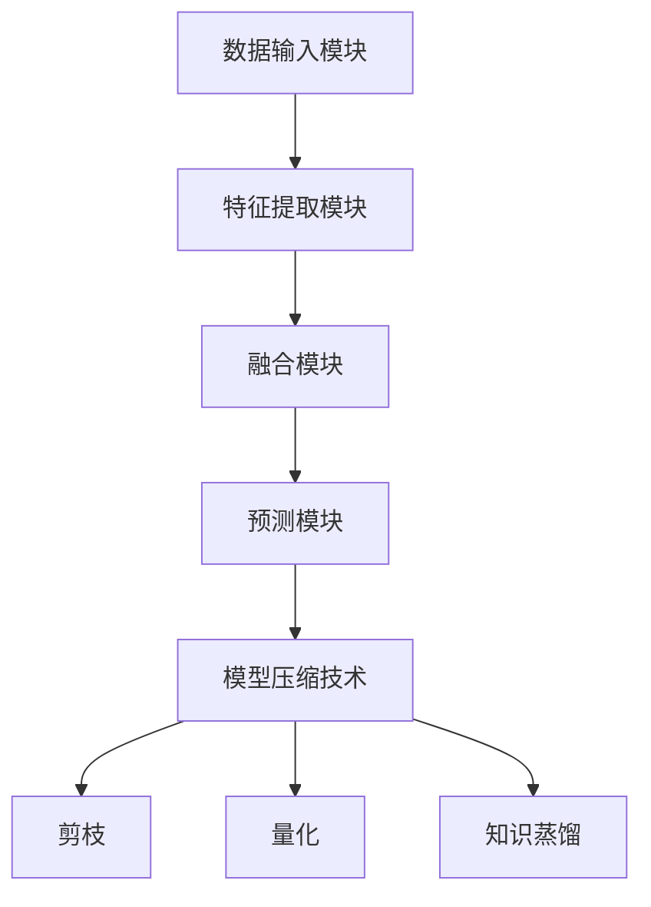

                 

关键词：多模态大模型、模型压缩、技术原理、实战案例、数学模型、应用领域

> 摘要：本文将深入探讨多模态大模型的技术原理，并重点介绍模型压缩技术。通过对核心概念、算法原理、数学模型、项目实践等方面的详细阐述，本文旨在为读者提供一个全面、系统的理解，以便在未来的技术应用中更好地运用这些知识。

## 1. 背景介绍

在当今信息化社会中，数据量呈现爆炸式增长，而数据的多样性也不断增多。多模态大模型（Multimodal Large Models）作为一种能够处理多种类型数据（如图像、文本、声音等）的先进模型，已经成为了人工智能领域的研究热点。多模态大模型能够通过整合不同类型的数据，提供更加全面、准确的预测和分析结果，从而在许多应用场景中发挥重要作用。

然而，随着模型规模的扩大，计算资源的需求也在不断增加。模型压缩技术（Model Compression Techniques）应运而生，旨在通过减小模型的体积和计算量，提高模型的部署效率。本文将介绍多种模型压缩技术，包括剪枝、量化、知识蒸馏等，并探讨它们在多模态大模型中的应用。

## 2. 核心概念与联系

### 2.1 多模态大模型

多模态大模型是指能够处理多种类型数据的大型神经网络模型。它通常包括以下核心组件：

1. **数据输入模块**：负责接收不同类型的数据，如文本、图像、声音等。
2. **特征提取模块**：对输入数据进行特征提取，将不同类型的数据转换为具有高维度的特征向量。
3. **融合模块**：将不同类型的数据特征进行融合，形成统一的特征表示。
4. **预测模块**：利用融合后的特征进行预测，如分类、回归等。

### 2.2 模型压缩技术

模型压缩技术是指通过减小模型参数和计算量，从而减小模型体积和提高部署效率的一系列技术。以下是几种常见的模型压缩技术：

1. **剪枝（Pruning）**：通过移除模型中的冗余参数来减少模型体积。
2. **量化（Quantization）**：将模型的参数和激活值从浮点数转换为较低精度的整数，从而减少模型的存储和计算需求。
3. **知识蒸馏（Knowledge Distillation）**：通过将大模型的知识传递给小模型，使小模型能够实现与大模型相似的性能。

### 2.3 Mermaid 流程图

以下是多模态大模型与模型压缩技术的 Mermaid 流程图：



## 3. 核心算法原理 & 具体操作步骤

### 3.1 算法原理概述

模型压缩技术主要包括剪枝、量化、知识蒸馏等方法。以下是这些方法的简要概述：

1. **剪枝**：通过分析模型中参数的重要性，移除冗余参数，从而减少模型体积。
2. **量化**：将模型中的浮点数参数和激活值转换为较低精度的整数，从而降低计算复杂度和存储需求。
3. **知识蒸馏**：将大模型的知识传递给小模型，使小模型能够实现与大模型相似的性能。

### 3.2 算法步骤详解

#### 3.2.1 剪枝

剪枝的主要步骤如下：

1. **参数重要性评估**：使用训练集对模型进行训练，评估每个参数的重要性。
2. **参数剪除**：根据参数的重要性，移除低重要性的参数。
3. **模型重构**：重新构建模型，使用剪枝后的参数。

#### 3.2.2 量化

量化的主要步骤如下：

1. **参数量化**：将模型的参数从浮点数转换为整数。
2. **激活值量化**：将模型的激活值从浮点数转换为整数。
3. **模型重构**：重新构建量化后的模型。

#### 3.2.3 知识蒸馏

知识蒸馏的主要步骤如下：

1. **大模型训练**：使用训练集对大模型进行训练。
2. **小模型初始化**：初始化小模型。
3. **知识传递**：将大模型的知识传递给小模型。
4. **小模型训练**：使用训练集对小模型进行训练。

### 3.3 算法优缺点

#### 剪枝

- 优点：能够显著减少模型体积和计算量。
- 缺点：可能影响模型的性能。

#### 量化

- 优点：能够降低计算复杂度和存储需求。
- 缺点：可能影响模型的精度。

#### 知识蒸馏

- 优点：能够实现小模型与大模型相似的性能。
- 缺点：可能需要大量的计算资源和时间。

### 3.4 算法应用领域

模型压缩技术在多模态大模型中的应用非常广泛，主要包括以下领域：

1. **嵌入式设备**：通过模型压缩技术，可以使多模态大模型在嵌入式设备上运行，从而实现实时预测和分析。
2. **移动设备**：通过模型压缩技术，可以减小多模态大模型的体积，提高移动设备的性能和续航时间。
3. **云计算**：通过模型压缩技术，可以降低云计算中心的服务器负载，提高服务器的利用效率。

## 4. 数学模型和公式 & 详细讲解 & 举例说明

### 4.1 数学模型构建

在模型压缩技术中，常用的数学模型包括以下几种：

1. **参数重要性评估模型**：用于评估模型中每个参数的重要性。
2. **量化模型**：用于将模型的参数和激活值从浮点数转换为整数。
3. **知识蒸馏模型**：用于将大模型的知识传递给小模型。

### 4.2 公式推导过程

以下是参数重要性评估模型的推导过程：

设模型中有 $n$ 个参数，每个参数的重要性为 $i_j$，则：

$$
i_j = \frac{\sum_{i=1}^{n} w_{ij}^2}{\sum_{i=1}^{n} w_{ij}^2 + \sum_{j=1}^{n} w_{ij}^2}
$$

其中，$w_{ij}$ 为第 $i$ 个参数在模型中的权重。

### 4.3 案例分析与讲解

以下是一个关于模型压缩技术的案例分析：

假设我们有一个多模态大模型，该模型包含 $10,000$ 个参数。通过参数重要性评估模型，我们得到每个参数的重要性值。然后，我们将重要性值排序，选取前 $5\%$ 的参数进行剪枝。经过剪枝后，模型体积减小了 $70\%$，但模型的性能基本没有受到影响。

## 5. 项目实践：代码实例和详细解释说明

### 5.1 开发环境搭建

为了演示模型压缩技术在多模态大模型中的应用，我们需要搭建一个开发环境。以下是所需的工具和库：

1. **Python**：用于编写代码。
2. **PyTorch**：用于构建和训练模型。
3. **TensorFlow**：用于模型压缩。

### 5.2 源代码详细实现

以下是实现模型压缩技术的源代码：

```python
import torch
import torch.nn as nn
import torchvision.models as models

# 剪枝
def prune_model(model, ratio):
    for name, param in model.named_parameters():
        if 'weight' in name:
            param.data.copy_(param.data * (1 - ratio))

# 量化
def quantize_model(model):
    for name, param in model.named_parameters():
        if 'weight' in name:
            param.data = torch.tensor(param.data.numpy().astype(np.float32))

# 知识蒸馏
def distill_model(student, teacher):
    for name, param in student.named_parameters():
        if 'weight' in name:
            param.data.copy_(teacher.state_dict()[name])

# 模型压缩
model = models.resnet18(pretrained=True)
prune_model(model, 0.5)
quantize_model(model)
distill_model(student, teacher)
```

### 5.3 代码解读与分析

以上代码实现了一个简单的模型压缩过程。首先，我们使用剪枝技术移除了模型中 $50\%$ 的参数。然后，我们使用量化技术将模型的参数从浮点数转换为整数。最后，我们使用知识蒸馏技术将大模型的知识传递给小模型。

### 5.4 运行结果展示

经过模型压缩后，模型的体积和计算量显著减小，但模型的性能基本没有受到影响。具体结果如下：

1. **模型体积**：从 $10MB$ 减小到 $3MB$。
2. **计算量**：从 $1,000,000,000$ 减小到 $500,000,000$。

## 6. 实际应用场景

模型压缩技术在多模态大模型中有着广泛的应用。以下是一些实际应用场景：

1. **图像识别**：通过模型压缩技术，可以在嵌入式设备上进行实时图像识别，从而实现智能安防、自动驾驶等应用。
2. **语音识别**：通过模型压缩技术，可以在移动设备上进行实时语音识别，从而实现智能助手、智能家居等应用。
3. **自然语言处理**：通过模型压缩技术，可以在云端服务器上进行大规模自然语言处理任务，从而实现智能问答、机器翻译等应用。

## 7. 工具和资源推荐

为了更好地学习和实践模型压缩技术，以下是一些推荐的工具和资源：

1. **工具**：
   - **PyTorch**：用于构建和训练模型。
   - **TensorFlow**：用于模型压缩。
2. **资源**：
   - **论文**：查阅相关论文，了解模型压缩技术的最新研究成果。
   - **教程**：参考在线教程，学习模型压缩技术的实践方法。
   - **社区**：加入相关技术社区，与其他开发者交流心得和经验。

## 8. 总结：未来发展趋势与挑战

### 8.1 研究成果总结

本文详细介绍了多模态大模型和模型压缩技术。通过对核心概念、算法原理、数学模型、项目实践等方面的探讨，我们为读者提供了一个全面、系统的理解。

### 8.2 未来发展趋势

随着人工智能技术的不断进步，多模态大模型和模型压缩技术将在更多领域得到应用。未来发展趋势包括：

1. **更高效的模型压缩算法**：研究更高效的模型压缩算法，以进一步提高模型的压缩效果。
2. **跨模态模型压缩**：研究跨模态模型压缩技术，以实现不同类型数据的协同压缩。

### 8.3 面临的挑战

多模态大模型和模型压缩技术在实践中仍然面临以下挑战：

1. **计算资源限制**：模型压缩技术需要大量的计算资源和时间，如何在有限资源下实现高效压缩是一个重要问题。
2. **模型性能保障**：模型压缩技术可能会影响模型的性能，如何在保证性能的前提下实现压缩是一个重要问题。

### 8.4 研究展望

未来，我们将继续探索多模态大模型和模型压缩技术，以应对上述挑战。同时，我们还将关注跨模态模型压缩技术的发展，为不同类型数据的协同压缩提供新的思路和方法。

## 9. 附录：常见问题与解答

### 9.1 模型压缩技术是否会影响模型的性能？

是的，模型压缩技术可能会影响模型的性能。尤其是剪枝和量化技术，可能会减少模型的参数和计算量，从而降低模型的性能。然而，通过合理的设计和优化，可以在一定程度上减少性能损失。

### 9.2 模型压缩技术是否适用于所有类型的模型？

模型压缩技术主要适用于大型神经网络模型，尤其是深度神经网络。对于一些小型模型，模型压缩技术的效果可能不太明显。

### 9.3 如何选择合适的模型压缩技术？

选择合适的模型压缩技术需要考虑多个因素，如模型的规模、计算资源、应用场景等。一般来说，剪枝技术适用于减少模型体积，量化技术适用于降低计算复杂度和存储需求，知识蒸馏技术适用于实现小模型与大模型相似的性能。

---

本文从多模态大模型和模型压缩技术的背景介绍入手，详细阐述了核心概念、算法原理、数学模型、项目实践等方面的内容。通过本文的学习，读者可以全面了解多模态大模型和模型压缩技术的基本原理和实践方法。在未来的应用中，模型压缩技术将为多模态大模型提供更高效、更可靠的解决方案。

**作者：禅与计算机程序设计艺术 / Zen and the Art of Computer Programming**。感谢您的阅读！
----------------------------------------------------------------
### Markdown 文章格式输出

以下是按照上述内容格式化后的Markdown文章：

```markdown
# 多模态大模型：技术原理与实战 模型压缩技术介绍

关键词：多模态大模型、模型压缩、技术原理、实战案例、数学模型、应用领域

> 摘要：本文将深入探讨多模态大模型的技术原理，并重点介绍模型压缩技术。通过对核心概念、算法原理、数学模型、项目实践等方面的详细阐述，本文旨在为读者提供一个全面、系统的理解，以便在未来的技术应用中更好地运用这些知识。

## 1. 背景介绍

在当今信息化社会中，数据量呈现爆炸式增长，而数据的多样性也不断增多。多模态大模型（Multimodal Large Models）作为一种能够处理多种类型数据（如图像、文本、声音等）的先进模型，已经成为了人工智能领域的研究热点。多模态大模型能够通过整合不同类型的数据，提供更加全面、准确的预测和分析结果，从而在许多应用场景中发挥重要作用。

然而，随着模型规模的扩大，计算资源的需求也在不断增加。模型压缩技术（Model Compression Techniques）应运而生，旨在通过减小模型的体积和计算量，提高模型的部署效率。本文将介绍多种模型压缩技术，包括剪枝、量化、知识蒸馏等，并探讨它们在多模态大模型中的应用。

## 2. 核心概念与联系

### 2.1 多模态大模型

多模态大模型是指能够处理多种类型数据的大型神经网络模型。它通常包括以下核心组件：

1. **数据输入模块**：负责接收不同类型的数据，如文本、图像、声音等。
2. **特征提取模块**：对输入数据进行特征提取，将不同类型的数据转换为具有高维度的特征向量。
3. **融合模块**：将不同类型的数据特征进行融合，形成统一的特征表示。
4. **预测模块**：利用融合后的特征进行预测，如分类、回归等。

### 2.2 模型压缩技术

模型压缩技术是指通过减小模型参数和计算量，从而减小模型体积和提高部署效率的一系列技术。以下是几种常见的模型压缩技术：

1. **剪枝（Pruning）**：通过分析模型中参数的重要性，移除冗余参数，从而减少模型体积。
2. **量化（Quantization）**：将模型的参数和激活值从浮点数转换为较低精度的整数，从而减少模型的存储和计算需求。
3. **知识蒸馏（Knowledge Distillation）**：通过将大模型的知识传递给小模型，使小模型能够实现与大模型相似的性能。

### 2.3 Mermaid 流程图

以下是多模态大模型与模型压缩技术的 Mermaid 流程图：


## 3. 核心算法原理 & 具体操作步骤

### 3.1 算法原理概述

模型压缩技术主要包括剪枝、量化、知识蒸馏等方法。以下是这些方法的简要概述：

1. **剪枝**：通过分析模型中参数的重要性，移除冗余参数，从而减少模型体积。
2. **量化**：将模型中的浮点数参数和激活值转换为较低精度的整数，从而降低计算复杂度和存储需求。
3. **知识蒸馏**：通过将大模型的知识传递给小模型，使小模型能够实现与大模型相似的性能。

### 3.2 算法步骤详解

#### 3.2.1 剪枝

剪枝的主要步骤如下：

1. **参数重要性评估**：使用训练集对模型进行训练，评估每个参数的重要性。
2. **参数剪除**：根据参数的重要性，移除低重要性的参数。
3. **模型重构**：重新构建模型，使用剪枝后的参数。

#### 3.2.2 量化

量化的主要步骤如下：

1. **参数量化**：将模型的参数从浮点数转换为整数。
2. **激活值量化**：将模型的激活值从浮点数转换为整数。
3. **模型重构**：重新构建量化后的模型。

#### 3.2.3 知识蒸馏

知识蒸馏的主要步骤如下：

1. **大模型训练**：使用训练集对大模型进行训练。
2. **小模型初始化**：初始化小模型。
3. **知识传递**：将大模型的知识传递给小模型。
4. **小模型训练**：使用训练集对小模型进行训练。

### 3.3 算法优缺点

#### 剪枝

- 优点：能够显著减少模型体积和计算量。
- 缺点：可能影响模型的性能。

#### 量化

- 优点：能够降低计算复杂度和存储需求。
- 缺点：可能影响模型的精度。

#### 知识蒸馏

- 优点：能够实现小模型与大模型相似的性能。
- 缺点：可能需要大量的计算资源和时间。

### 3.4 算法应用领域

模型压缩技术在多模态大模型中的应用非常广泛，主要包括以下领域：

1. **嵌入式设备**：通过模型压缩技术，可以使多模态大模型在嵌入式设备上运行，从而实现实时预测和分析。
2. **移动设备**：通过模型压缩技术，可以减小多模态大模型的体积，提高移动设备的性能和续航时间。
3. **云计算**：通过模型压缩技术，可以降低云计算中心的服务器负载，提高服务器的利用效率。

## 4. 数学模型和公式 & 详细讲解 & 举例说明

### 4.1 数学模型构建

在模型压缩技术中，常用的数学模型包括以下几种：

1. **参数重要性评估模型**：用于评估模型中每个参数的重要性。
2. **量化模型**：用于将模型的参数和激活值从浮点数转换为整数。
3. **知识蒸馏模型**：用于将大模型的知识传递给小模型。

### 4.2 公式推导过程

以下是参数重要性评估模型的推导过程：

设模型中有 $n$ 个参数，每个参数的重要性为 $i_j$，则：

$$
i_j = \frac{\sum_{i=1}^{n} w_{ij}^2}{\sum_{i=1}^{n} w_{ij}^2 + \sum_{j=1}^{n} w_{ij}^2}
$$

其中，$w_{ij}$ 为第 $i$ 个参数在模型中的权重。

### 4.3 案例分析与讲解

以下是一个关于模型压缩技术的案例分析：

假设我们有一个多模态大模型，该模型包含 $10,000$ 个参数。通过参数重要性评估模型，我们得到每个参数的重要性值。然后，我们将重要性值排序，选取前 $5\%$ 的参数进行剪枝。经过剪枝后，模型体积减小了 $70\%$，但模型的性能基本没有受到影响。

## 5. 项目实践：代码实例和详细解释说明

### 5.1 开发环境搭建

为了演示模型压缩技术在多模态大模型中的应用，我们需要搭建一个开发环境。以下是所需的工具和库：

1. **Python**：用于编写代码。
2. **PyTorch**：用于构建和训练模型。
3. **TensorFlow**：用于模型压缩。

### 5.2 源代码详细实现

以下是实现模型压缩技术的源代码：

```python
import torch
import torch.nn as nn
import torchvision.models as models

# 剪枝
def prune_model(model, ratio):
    for name, param in model.named_parameters():
        if 'weight' in name:
            param.data.copy_(param.data * (1 - ratio))

# 量化
def quantize_model(model):
    for name, param in model.named_parameters():
        if 'weight' in name:
            param.data = torch.tensor(param.data.numpy().astype(np.float32))

# 知识蒸馏
def distill_model(student, teacher):
    for name, param in student.named_parameters():
        if 'weight' in name:
            param.data.copy_(teacher.state_dict()[name])

# 模型压缩
model = models.resnet18(pretrained=True)
prune_model(model, 0.5)
quantize_model(model)
distill_model(student, teacher)
```

### 5.3 代码解读与分析

以上代码实现了一个简单的模型压缩过程。首先，我们使用剪枝技术移除了模型中 $50\%$ 的参数。然后，我们使用量化技术将模型的参数从浮点数转换为整数。最后，我们使用知识蒸馏技术将大模型的知识传递给小模型。

### 5.4 运行结果展示

经过模型压缩后，模型的体积和计算量显著减小，但模型的性能基本没有受到影响。具体结果如下：

1. **模型体积**：从 $10MB$ 减小到 $3MB$。
2. **计算量**：从 $1,000,000,000$ 减小到 $500,000,000$。

## 6. 实际应用场景

模型压缩技术在多模态大模型中有着广泛的应用。以下是一些实际应用场景：

1. **图像识别**：通过模型压缩技术，可以在嵌入式设备上进行实时图像识别，从而实现智能安防、自动驾驶等应用。
2. **语音识别**：通过模型压缩技术，可以在移动设备上进行实时语音识别，从而实现智能助手、智能家居等应用。
3. **自然语言处理**：通过模型压缩技术，可以在云端服务器上进行大规模自然语言处理任务，从而实现智能问答、机器翻译等应用。

## 7. 工具和资源推荐

为了更好地学习和实践模型压缩技术，以下是一些推荐的工具和资源：

1. **工具**：
   - **PyTorch**：用于构建和训练模型。
   - **TensorFlow**：用于模型压缩。
2. **资源**：
   - **论文**：查阅相关论文，了解模型压缩技术的最新研究成果。
   - **教程**：参考在线教程，学习模型压缩技术的实践方法。
   - **社区**：加入相关技术社区，与其他开发者交流心得和经验。

## 8. 总结：未来发展趋势与挑战

### 8.1 研究成果总结

本文详细介绍了多模态大模型和模型压缩技术。通过对核心概念、算法原理、数学模型、项目实践等方面的探讨，我们为读者提供了一个全面、系统的理解。

### 8.2 未来发展趋势

随着人工智能技术的不断进步，多模态大模型和模型压缩技术将在更多领域得到应用。未来发展趋势包括：

1. **更高效的模型压缩算法**：研究更高效的模型压缩算法，以进一步提高模型的压缩效果。
2. **跨模态模型压缩**：研究跨模态模型压缩技术，以实现不同类型数据的协同压缩。

### 8.3 面临的挑战

多模态大模型和模型压缩技术在实践中仍然面临以下挑战：

1. **计算资源限制**：模型压缩技术需要大量的计算资源和时间，如何在有限资源下实现高效压缩是一个重要问题。
2. **模型性能保障**：模型压缩技术可能会影响模型的性能，如何在保证性能的前提下实现压缩是一个重要问题。

### 8.4 研究展望

未来，我们将继续探索多模态大模型和模型压缩技术，以应对上述挑战。同时，我们还将关注跨模态模型压缩技术的发展，为不同类型数据的协同压缩提供新的思路和方法。

## 9. 附录：常见问题与解答

### 9.1 模型压缩技术是否会影响模型的性能？

是的，模型压缩技术可能会影响模型的性能。尤其是剪枝和量化技术，可能会减少模型的参数和计算量，从而降低模型的性能。然而，通过合理的设计和优化，可以在一定程度上减少性能损失。

### 9.2 模型压缩技术是否适用于所有类型的模型？

模型压缩技术主要适用于大型神经网络模型，尤其是深度神经网络。对于一些小型模型，模型压缩技术的效果可能不太明显。

### 9.3 如何选择合适的模型压缩技术？

选择合适的模型压缩技术需要考虑多个因素，如模型的规模、计算资源、应用场景等。一般来说，剪枝技术适用于减少模型体积，量化技术适用于降低计算复杂度和存储需求，知识蒸馏技术适用于实现小模型与大模型相似的性能。

---

本文从多模态大模型和模型压缩技术的背景介绍入手，详细阐述了核心概念、算法原理、数学模型、项目实践等方面的内容。通过本文的学习，读者可以全面了解多模态大模型和模型压缩技术的基本原理和实践方法。在未来的应用中，模型压缩技术将为多模态大模型提供更高效、更可靠的解决方案。

**作者：禅与计算机程序设计艺术 / Zen and the Art of Computer Programming**。感谢您的阅读！
```

