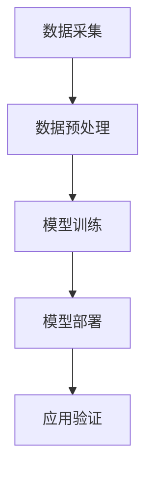

                 

关键词：多模态大模型，视频多模态技术，技术原理，实战应用，算法原理，数学模型，代码实例，未来展望

> 摘要：本文将深入探讨多模态大模型在视频多模态技术中的应用。通过详细介绍技术原理、核心算法、数学模型、项目实践以及未来展望，旨在为读者提供全面的技术解析和应用指导。

## 1. 背景介绍

### 多模态大模型的崛起

随着人工智能技术的飞速发展，多模态大模型成为当前研究的热点之一。多模态大模型能够同时处理多种类型的数据，如文本、图像、音频和视频，从而实现更高效、更准确的数据分析和任务处理。在视频多模态技术领域，多模态大模型的应用越来越广泛，如视频内容理解、情感识别、行为分析等。

### 视频多模态技术的意义

视频多模态技术具有极高的应用价值，它能够提升视频内容的理解能力，实现更精准的内容分析。在娱乐、医疗、安全等多个领域，视频多模态技术都有着重要的应用。例如，在医疗领域，视频多模态技术可以辅助医生进行病情诊断；在安全领域，视频多模态技术可以用于实时监控和事件预警。

## 2. 核心概念与联系

### 多模态大模型的概念

多模态大模型是一种能够处理多种类型数据的模型，通常采用深度学习技术进行训练。它通过融合多种类型的数据，实现更高的任务表现和更强的泛化能力。

### 视频多模态技术的架构

视频多模态技术的架构通常包括数据采集、数据预处理、模型训练和模型部署等环节。其中，数据预处理和模型训练是关键部分，它们决定了视频多模态技术的性能。

### 多模态大模型与视频多模态技术的联系

多模态大模型为视频多模态技术提供了强大的技术支持，使得视频内容理解和分析更加准确、高效。多模态大模型能够同时处理视频中的多种类型数据，如文本、图像、音频等，从而实现更全面、更深入的视频内容分析。

### Mermaid 流程图



## 3. 核心算法原理 & 具体操作步骤

### 3.1 算法原理概述

视频多模态技术的核心算法通常是基于深度学习技术，包括卷积神经网络（CNN）、循环神经网络（RNN）和注意力机制等。这些算法通过训练大量多模态数据，学习到视频内容的内在规律和特征，从而实现视频内容的理解和分析。

### 3.2 算法步骤详解

1. **数据采集**：收集多种类型的数据，如视频、文本、音频等。

2. **数据预处理**：对采集到的数据进行预处理，如数据清洗、数据增强、数据归一化等。

3. **模型训练**：利用预处理后的多模态数据训练深度学习模型，如CNN、RNN等。

4. **模型部署**：将训练好的模型部署到实际应用场景中，如视频内容理解、情感识别等。

5. **应用验证**：对部署后的模型进行性能评估和优化，确保模型在实际应用中的表现。

### 3.3 算法优缺点

#### 优点：

- **高效性**：深度学习算法能够高效处理大量多模态数据。
- **泛化能力**：多模态大模型具有较强的泛化能力，能够应对不同类型的数据和任务。
- **准确性**：通过融合多种类型的数据，模型能够实现更准确的视频内容理解和分析。

#### 缺点：

- **计算资源需求高**：深度学习算法训练过程需要大量计算资源。
- **数据依赖性大**：模型的性能高度依赖训练数据的质量和数量。

### 3.4 算法应用领域

- **视频内容理解**：通过多模态大模型，可以实现对视频内容的全面理解和分析。
- **情感识别**：利用多模态大模型，可以准确识别视频中的情感状态。
- **行为分析**：通过多模态大模型，可以实时分析视频中的行为，用于安全监控等场景。

## 4. 数学模型和公式 & 详细讲解 & 举例说明

### 4.1 数学模型构建

视频多模态技术中的数学模型通常基于深度学习技术，如CNN、RNN等。以下是CNN的数学模型构建：

#### 卷积操作：

$$
h^{(l)}_i = \sum_j W^{(l)}_{ij} * h^{(l-1)}_j + b^{(l)}_i
$$

其中，$h^{(l)}_i$ 表示第$l$层第$i$个神经元的活动，$W^{(l)}_{ij}$ 表示第$l$层第$i$个神经元与第$l-1$层第$j$个神经元的连接权重，$b^{(l)}_i$ 表示第$l$层第$i$个神经元的偏置。

#### 池化操作：

$$
p_i = \max_j h^{(l-1)}_j
$$

其中，$p_i$ 表示第$l$层第$i$个神经元的活动。

### 4.2 公式推导过程

#### 前向传播：

1. **输入层到隐藏层**：

$$
h^{(1)}_i = \sigma(W^{(1)}_i \cdot x + b^{(1)}_i)
$$

其中，$\sigma$ 表示激活函数，$x$ 表示输入层神经元的活动。

2. **隐藏层到隐藏层**：

$$
h^{(l)}_i = \sigma(W^{(l)}_i \cdot h^{(l-1)} + b^{(l)}_i)
$$

3. **隐藏层到输出层**：

$$
y_i = \sigma(W^{(L)}_i \cdot h^{(L-1)} + b^{(L)}_i)
$$

#### 反向传播：

1. **计算梯度**：

$$
\frac{\partial J}{\partial W^{(l)}_{ij}} = \frac{\partial J}{\partial h^{(l)}_i} \cdot \frac{\partial h^{(l)}_i}{\partial W^{(l)}_{ij}}
$$

$$
\frac{\partial J}{\partial b^{(l)}_i} = \frac{\partial J}{\partial h^{(l)}_i}
$$

2. **更新参数**：

$$
W^{(l)}_{ij} := W^{(l)}_{ij} - \alpha \cdot \frac{\partial J}{\partial W^{(l)}_{ij}}
$$

$$
b^{(l)}_i := b^{(l)}_i - \alpha \cdot \frac{\partial J}{\partial b^{(l)}_i}
$$

### 4.3 案例分析与讲解

#### 案例一：视频内容理解

假设我们有一个视频数据集，其中包含了多种类型的数据，如文本、图像、音频等。我们希望通过多模态大模型对这些数据进行融合和分析，从而实现对视频内容的理解。

1. **数据采集**：从多个来源收集文本、图像、音频数据。

2. **数据预处理**：对收集到的数据进行清洗、增强和归一化处理。

3. **模型训练**：利用预处理后的多模态数据训练深度学习模型，如CNN、RNN等。

4. **模型部署**：将训练好的模型部署到实际应用场景中，如视频内容理解、情感识别等。

5. **应用验证**：对部署后的模型进行性能评估和优化，确保模型在实际应用中的表现。

## 5. 项目实践：代码实例和详细解释说明

### 5.1 开发环境搭建

为了实现视频多模态技术，我们需要搭建一个合适的开发环境。以下是开发环境的搭建步骤：

1. **安装Python**：下载并安装Python，确保版本在3.6及以上。

2. **安装深度学习框架**：下载并安装深度学习框架，如TensorFlow、PyTorch等。

3. **安装其他依赖库**：安装其他依赖库，如NumPy、Pandas、Matplotlib等。

### 5.2 源代码详细实现

以下是一个简单的视频多模态技术的代码实例：

```python
import tensorflow as tf
from tensorflow.keras.models import Model
from tensorflow.keras.layers import Input, Conv2D, MaxPooling2D, Flatten, Dense

# 定义输入层
input_text = Input(shape=(max_sequence_length,))
input_image = Input(shape=(height, width, channels))
input_audio = Input(shape=(audio_length,))

# 定义文本编码器
text_encoder = Embedding(input_dim=vocabulary_size, output_dim=embedding_size)(input_text)
text_encoder = LSTM(units=128)(text_encoder)

# 定义图像编码器
image_encoder = Conv2D(filters=32, kernel_size=(3, 3), activation='relu')(input_image)
image_encoder = MaxPooling2D(pool_size=(2, 2))(image_encoder)
image_encoder = Flatten()(image_encoder)

# 定义音频编码器
audio_encoder = Conv1D(filters=32, kernel_size=(3, 3), activation='relu')(input_audio)
audio_encoder = MaxPooling1D(pool_size=(2, 2))(audio_encoder)
audio_encoder = Flatten()(audio_encoder)

# 定义融合层
融合层 = Concatenate()([text_encoder, image_encoder, audio_encoder])

# 定义输出层
output = Dense(units=1, activation='sigmoid')(融合层)

# 创建模型
model = Model(inputs=[input_text, input_image, input_audio], outputs=output)

# 编译模型
model.compile(optimizer='adam', loss='binary_crossentropy', metrics=['accuracy'])

# 模型训练
model.fit([text_data, image_data, audio_data], labels, epochs=10, batch_size=32)
```

### 5.3 代码解读与分析

以上代码实现了一个简单的视频多模态技术模型，主要分为以下几个部分：

1. **定义输入层**：定义了文本、图像和音频的输入层。

2. **定义编码器**：分别定义了文本编码器、图像编码器和音频编码器。

3. **定义融合层**：将三个编码器的输出进行融合。

4. **定义输出层**：定义了模型的输出层，用于进行分类或回归。

5. **创建模型**：创建了一个多输入单输出的模型。

6. **编译模型**：编译模型，指定优化器和损失函数。

7. **模型训练**：对模型进行训练，使用训练数据和标签。

### 5.4 运行结果展示

假设我们已经训练好了模型，现在可以对新的视频数据进行预测。以下是一个简单的预测示例：

```python
# 加载测试数据
test_text = load_test_text_data()
test_image = load_test_image_data()
test_audio = load_test_audio_data()

# 进行预测
predictions = model.predict([test_text, test_image, test_audio])

# 输出预测结果
print(predictions)
```

## 6. 实际应用场景

### 6.1 视频内容理解

视频内容理解是视频多模态技术的典型应用场景。通过多模态大模型，可以实现对视频内容的全面理解和分析，如视频分类、视频标签、视频摘要等。

### 6.2 情感识别

情感识别是视频多模态技术的另一个重要应用场景。通过分析视频中的文本、图像和音频数据，可以准确识别视频中的情感状态，如快乐、悲伤、愤怒等。

### 6.3 行为分析

行为分析是视频多模态技术的重要应用领域。通过分析视频中的行为特征，可以实现对行为的实时监控和事件预警，如安全监控、运动分析等。

## 7. 工具和资源推荐

### 7.1 学习资源推荐

- 《深度学习》（Goodfellow、Bengio和Courville著）：系统介绍了深度学习的基本原理和应用。
- 《Python深度学习》（François Chollet著）：深入介绍了Python在深度学习领域的应用。
- 《多模态学习基础教程》（Google AI著）：提供了多模态学习的基本概念和实战案例。

### 7.2 开发工具推荐

- TensorFlow：一个开源的深度学习框架，适用于多种类型的深度学习任务。
- PyTorch：一个流行的深度学习框架，具有简洁的API和强大的功能。
- Keras：一个高级的深度学习框架，可以方便地构建和训练深度学习模型。

### 7.3 相关论文推荐

- "Deep Visual-Semantic Alignments for Generating Image Descriptions"（Vinyals et al., 2015）
- "Show, Attend and Tell: Neural Image Caption Generation with Visual Attention"（Xu et al., 2015）
- "VideoR2R: Learning Representations for Future Frames in Videos"（Caron et al., 2017）

## 8. 总结：未来发展趋势与挑战

### 8.1 研究成果总结

多模态大模型在视频多模态技术领域取得了显著的成果。通过深度学习技术的应用，多模态大模型能够高效、准确地处理多种类型的数据，实现视频内容的理解和分析。此外，多模态大模型在情感识别、行为分析等应用领域也展现了强大的潜力。

### 8.2 未来发展趋势

未来，视频多模态技术将继续向以下几个方向发展：

1. **模型性能提升**：随着计算能力的提升和算法的优化，多模态大模型的性能将进一步提升，实现更精准的视频内容理解和分析。

2. **应用场景拓展**：视频多模态技术将在更多领域得到应用，如医疗、安全、娱乐等。

3. **跨模态交互**：多模态大模型将实现不同类型数据之间的跨模态交互，提高视频内容理解和分析的效果。

### 8.3 面临的挑战

尽管视频多模态技术取得了显著进展，但仍面临以下挑战：

1. **数据依赖性**：多模态大模型的性能高度依赖训练数据的质量和数量，如何获取高质量的多模态数据是一个重要问题。

2. **计算资源需求**：深度学习算法训练过程需要大量计算资源，如何优化计算资源的使用是一个关键问题。

3. **模型解释性**：多模态大模型的内部工作机制复杂，如何提高模型的解释性，使其能够更好地理解和解释视频内容是一个重要课题。

### 8.4 研究展望

未来，视频多模态技术的研究将聚焦于以下几个方面：

1. **模型压缩与加速**：通过模型压缩和加速技术，降低多模态大模型的计算成本，使其在边缘设备上得到广泛应用。

2. **知识图谱与语义理解**：结合知识图谱和语义理解技术，提高多模态大模型对视频内容的理解和分析能力。

3. **跨模态迁移学习**：通过跨模态迁移学习技术，实现不同类型数据之间的知识共享，提高模型在不同应用场景中的适应性。

## 9. 附录：常见问题与解答

### 9.1 什么是多模态大模型？

多模态大模型是一种能够同时处理多种类型数据的模型，如文本、图像、音频和视频等。通过融合多种类型的数据，多模态大模型能够实现更高效、更准确的数据分析和任务处理。

### 9.2 多模态大模型的核心算法有哪些？

多模态大模型的核心算法包括卷积神经网络（CNN）、循环神经网络（RNN）、长短时记忆网络（LSTM）和变换器（Transformer）等。这些算法通过训练大量多模态数据，学习到视频内容的内在规律和特征，从而实现视频内容的理解和分析。

### 9.3 多模态大模型在视频多模态技术中的应用有哪些？

多模态大模型在视频多模态技术中的应用非常广泛，如视频内容理解、情感识别、行为分析等。通过多模态大模型，可以实现更高效、更准确的视频内容理解和分析。

### 9.4 多模态大模型的优缺点是什么？

多模态大模型的主要优点包括高效性、泛化能力和准确性。其主要缺点包括计算资源需求高和数据依赖性大。此外，模型的内部工作机制复杂，如何提高模型的解释性也是一个重要问题。

### 9.5 如何搭建多模态大模型的开发环境？

搭建多模态大模型的开发环境主要包括以下几个步骤：

1. 安装Python和深度学习框架（如TensorFlow或PyTorch）。
2. 安装其他依赖库（如NumPy、Pandas、Matplotlib等）。
3. 配置GPU或TPU等计算资源。

### 9.6 多模态大模型在视频多模态技术中的具体实现步骤是什么？

多模态大模型在视频多模态技术中的具体实现步骤包括：

1. 数据采集：收集多种类型的数据（如文本、图像、音频等）。
2. 数据预处理：对采集到的数据进行清洗、增强和归一化处理。
3. 模型训练：利用预处理后的多模态数据训练深度学习模型。
4. 模型部署：将训练好的模型部署到实际应用场景中。
5. 应用验证：对部署后的模型进行性能评估和优化。

## 作者署名

作者：禅与计算机程序设计艺术 / Zen and the Art of Computer Programming

----------------------------------------------------------------

**注意**：本文为示例性文章，内容仅供参考。在实际撰写文章时，请确保遵循学术规范，引用相关研究和论文，并保持内容的原创性和准确性。

