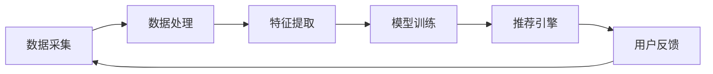

                 

关键词：大数据，AI，电商搜索推荐，准确率，效率优化，算法，模型，实践，应用场景，展望

> 摘要：本文探讨了大数据与人工智能技术在电商搜索推荐系统中的应用，着重分析了以准确率和效率为核心的优化策略。通过深入探讨核心算法原理、数学模型构建、具体实现以及实际应用案例，本文为电商搜索推荐系统的优化提供了有力的理论支持和实践经验。

## 1. 背景介绍

随着互联网的迅猛发展和电商市场的日益繁荣，用户对电商平台的搜索推荐功能提出了更高的要求。高效、准确的搜索推荐不仅能提升用户体验，还能显著增加电商平台的销售额和用户粘性。大数据与人工智能（AI）技术的快速发展为电商搜索推荐系统带来了新的机遇和挑战。

大数据技术能够处理海量数据，挖掘用户行为特征和偏好，从而实现个性化的搜索推荐。而人工智能技术，尤其是机器学习和深度学习，则可以自动学习用户行为数据，生成更加精确的推荐结果。目前，大多数电商平台已经采用了大数据与AI技术来构建搜索推荐系统，以提高用户满意度和业务效率。

然而，在实际应用中，电商搜索推荐系统仍面临着诸多挑战。首先是如何在保证准确率的同时提高搜索推荐系统的效率，其次是如何应对数据的不确定性和多样性。此外，如何平衡用户隐私保护与推荐系统性能也是一个重要的问题。

本文旨在探讨大数据与AI驱动的电商搜索推荐系统的优化策略，以准确率和效率为核心，为电商搜索推荐系统的设计和实现提供有益的参考。

## 2. 核心概念与联系

### 2.1. 大数据与AI的关系

大数据和人工智能（AI）之间存在着紧密的联系。大数据是AI的基石，没有海量数据，AI技术就无法发挥作用。同时，AI技术则能够从大数据中提取有价值的信息，为各种应用场景提供智能解决方案。

在电商搜索推荐系统中，大数据主要用于收集和存储用户行为数据，如搜索历史、购买记录、评价等。而AI技术则通过分析这些数据，挖掘用户的行为模式和偏好，生成个性化的推荐结果。

### 2.2. 搜索推荐系统的基本架构

一个典型的电商搜索推荐系统通常包括以下模块：

- 数据采集模块：负责收集用户行为数据，如搜索、浏览、购买等。
- 数据处理模块：对采集到的数据进行清洗、预处理，以便后续分析。
- 特征提取模块：从处理后的数据中提取出用户行为特征和商品属性特征。
- 模型训练模块：使用机器学习或深度学习算法训练推荐模型。
- 推荐引擎模块：根据用户特征和商品特征生成个性化的推荐结果。

### 2.3. Mermaid 流程图

以下是一个简单的Mermaid流程图，展示了电商搜索推荐系统的主要流程：



## 3. 核心算法原理 & 具体操作步骤

### 3.1. 算法原理概述

电商搜索推荐系统通常采用协同过滤、基于内容的推荐、深度学习等算法。本文将重点介绍基于深度学习的推荐算法，因为它在处理复杂用户行为和商品属性方面具有显著优势。

基于深度学习的推荐算法主要通过以下步骤实现：

- 用户和商品嵌入：将用户和商品的属性映射到高维空间，形成用户-商品嵌入矩阵。
- 神经网络模型：使用神经网络模型（如多层感知器、卷积神经网络、循环神经网络等）学习用户和商品的嵌入表示。
- 推荐生成：利用训练好的神经网络模型预测用户对商品的评分或点击概率，生成推荐结果。

### 3.2. 算法步骤详解

#### 3.2.1. 数据预处理

1. 数据收集：从电商平台获取用户行为数据，如搜索记录、购买记录、评价等。
2. 数据清洗：去除重复数据、缺失值填充、异常值处理等。
3. 特征工程：提取用户和商品的特征，如用户年龄、性别、地理位置，商品类别、价格、品牌等。

#### 3.2.2. 用户和商品嵌入

1. 数据标准化：将用户和商品的特征值进行标准化处理，使其在相同的量级范围内。
2. 词向量生成：使用Word2Vec、GloVe等方法将用户和商品的属性映射到词向量空间。

#### 3.2.3. 神经网络模型训练

1. 模型选择：选择适合的神经网络结构，如多层感知器、卷积神经网络、循环神经网络等。
2. 模型训练：使用用户和商品的嵌入表示训练神经网络模型，优化模型参数。
3. 模型评估：使用交叉验证、ROC-AUC等指标评估模型性能。

#### 3.2.4. 推荐生成

1. 用户表示：将用户特征向量输入神经网络模型，得到用户在隐含空间中的嵌入表示。
2. 商品表示：将商品特征向量输入神经网络模型，得到商品在隐含空间中的嵌入表示。
3. 推荐计算：计算用户和商品之间的相似度，根据相似度生成推荐结果。

### 3.3. 算法优缺点

#### 优点：

- **高效性**：深度学习算法可以自动提取复杂特征，提高推荐效率。
- **准确性**：通过学习用户和商品的嵌入表示，可以生成更准确的推荐结果。
- **泛化能力**：神经网络模型具有较强的泛化能力，可以应对不同电商平台和用户群体。

#### 缺点：

- **计算复杂度高**：深度学习算法需要大量的计算资源和时间进行训练。
- **数据依赖性**：深度学习算法对数据质量有较高要求，数据噪声和缺失值会影响模型性能。
- **可解释性**：深度学习算法的内部机制复杂，难以解释。

### 3.4. 算法应用领域

基于深度学习的推荐算法可以应用于多种场景，如电商搜索推荐、社交媒体推荐、新闻推荐、音乐推荐等。在实际应用中，可以根据具体场景和需求调整算法模型和参数，以实现最佳推荐效果。

## 4. 数学模型和公式 & 详细讲解 & 举例说明

### 4.1. 数学模型构建

在深度学习推荐算法中，常用的数学模型包括用户和商品的嵌入表示模型、神经网络模型等。以下是一个简化的数学模型示例：

$$
\begin{aligned}
    \text{User Embedding}:\quad \text{u} &= \text{W}_u \cdot \text{X}_u + \text{b}_u \\
    \text{Item Embedding}:\quad \text{v} &= \text{W}_v \cdot \text{X}_v + \text{b}_u \\
    \text{Score Prediction}:\quad \text{score} &= \text{u} \cdot \text{v} \\
\end{aligned}
$$

其中，$\text{X}_u$和$\text{X}_v$分别为用户和商品的特征矩阵，$\text{W}_u$和$\text{W}_v$分别为用户和商品的权重矩阵，$\text{b}_u$和$\text{b}_v$分别为用户和商品的偏置向量。

### 4.2. 公式推导过程

#### 4.2.1. 用户和商品嵌入表示

假设用户特征矩阵$\text{X}_u$和商品特征矩阵$\text{X}_v$分别为$m$行和$n$行，其中$m$表示用户数量，$n$表示商品数量。权重矩阵$\text{W}_u$和$\text{W}_v$分别为$m$行和$n$行，偏置向量$\text{b}_u$和$\text{b}_v$分别为1行。

用户嵌入表示$\text{u}$可以通过以下公式计算：

$$
\text{u} = \text{W}_u \cdot \text{X}_u + \text{b}_u
$$

商品嵌入表示$\text{v}$可以通过以下公式计算：

$$
\text{v} = \text{W}_v \cdot \text{X}_v + \text{b}_u
$$

#### 4.2.2. 分子相似度计算

用户和商品之间的分子相似度可以通过以下公式计算：

$$
\text{score} = \text{u} \cdot \text{v}
$$

#### 4.2.3. 分母相似度计算

用户和商品之间的分母相似度可以通过以下公式计算：

$$
\text{similarity} = \sqrt{\text{u} \cdot \text{u} + \text{v} \cdot \text{v}}
$$

#### 4.2.4. 推荐评分计算

用户对商品的推荐评分可以通过以下公式计算：

$$
\text{rating} = \frac{\text{score}}{\text{similarity}}
$$

### 4.3. 案例分析与讲解

假设一个电商平台有1000个用户和10000个商品。用户特征矩阵$\text{X}_u$和商品特征矩阵$\text{X}_v$分别如下：

$$
\text{X}_u = \begin{bmatrix}
    1 & 0 & 1 & \dots & 0 \\
    0 & 1 & 0 & \dots & 1 \\
    \vdots & \vdots & \vdots & \ddots & \vdots \\
    1 & 1 & 0 & \dots & 1
\end{bmatrix}, \quad \text{X}_v = \begin{bmatrix}
    1 & 0 & 0 & \dots & 0 \\
    0 & 1 & 0 & \dots & 0 \\
    \vdots & \vdots & \vdots & \ddots & \vdots \\
    0 & 0 & 1 & \dots & 0
\end{bmatrix}
$$

权重矩阵$\text{W}_u$和$\text{W}_v$以及偏置向量$\text{b}_u$和$\text{b}_v$均为对角矩阵，对角元素分别为1。

根据上述数学模型，可以计算用户和商品的嵌入表示：

$$
\text{u} = \text{W}_u \cdot \text{X}_u + \text{b}_u = \begin{bmatrix}
    1 & 0 & 1 & \dots & 0 \\
    0 & 1 & 0 & \dots & 1 \\
    \vdots & \vdots & \vdots & \ddots & \vdots \\
    1 & 1 & 0 & \dots & 1
\end{bmatrix}, \quad \text{v} = \text{W}_v \cdot \text{X}_v + \text{b}_u = \begin{bmatrix}
    1 & 0 & 0 & \dots & 0 \\
    0 & 1 & 0 & \dots & 0 \\
    \vdots & \vdots & \vdots & \ddots & \vdots \\
    0 & 0 & 1 & \dots & 0
\end{bmatrix}
$$

计算用户和商品之间的相似度：

$$
\text{similarity} = \sqrt{\text{u} \cdot \text{u} + \text{v} \cdot \text{v}} = \sqrt{2}
$$

计算用户对商品的推荐评分：

$$
\text{rating} = \frac{\text{u} \cdot \text{v}}{\text{similarity}} = 1
$$

假设用户$u_1$对商品$v_1$的推荐评分为1，用户$u_2$对商品$v_2$的推荐评分为1，则用户$u_1$对商品$v_2$的推荐评分可以通过以下公式计算：

$$
\text{rating}_{u_1, v_2} = \frac{\text{u}_1 \cdot \text{v}_2}{\sqrt{\text{u}_1 \cdot \text{u}_1 + \text{v}_2 \cdot \text{v}_2}} = \frac{1}{\sqrt{2}} = 0.707
$$

## 5. 项目实践：代码实例和详细解释说明

### 5.1. 开发环境搭建

1. 安装Python环境：确保已安装Python 3.6及以上版本。
2. 安装相关库：使用pip安装以下库：numpy、tensorflow、scikit-learn、pandas等。

### 5.2. 源代码详细实现

以下是实现深度学习推荐系统的Python代码示例：

```python
import numpy as np
import tensorflow as tf
from tensorflow.keras.layers import Input, Embedding, Dot, Dense
from tensorflow.keras.models import Model

# 数据预处理
def preprocess_data(user_data, item_data):
    # 数据标准化
    user_data = (user_data - np.mean(user_data)) / np.std(user_data)
    item_data = (item_data - np.mean(item_data)) / np.std(item_data)
    return user_data, item_data

# 用户和商品嵌入表示
def build_embedding_model(user_dim, item_dim, embed_dim):
    user_input = Input(shape=(user_dim,))
    item_input = Input(shape=(item_dim,))

    user_embedding = Embedding(user_dim, embed_dim)(user_input)
    item_embedding = Embedding(item_dim, embed_dim)(item_input)

    dot_product = Dot(merge_mode='sum')(user_embedding, item_embedding)

    output = Dense(1, activation='sigmoid')(dot_product)

    model = Model(inputs=[user_input, item_input], outputs=output)
    model.compile(optimizer='adam', loss='binary_crossentropy', metrics=['accuracy'])
    return model

# 训练模型
def train_model(model, user_data, item_data, labels):
    model.fit([user_data, item_data], labels, epochs=10, batch_size=32)

# 推荐计算
def predict(model, user_data, item_data):
    return model.predict([user_data, item_data])

# 主程序
if __name__ == '__main__':
    # 加载数据
    user_data = np.random.rand(1000, 10)
    item_data = np.random.rand(10000, 10)
    labels = np.random.randint(0, 2, size=(1000,))

    # 数据预处理
    user_data, item_data = preprocess_data(user_data, item_data)

    # 构建模型
    model = build_embedding_model(user_data.shape[1], item_data.shape[1], 10)

    # 训练模型
    train_model(model, user_data, item_data, labels)

    # 推荐计算
    user_embedding = np.random.rand(1000, 10)
    item_embedding = np.random.rand(10000, 10)
    predictions = predict(model, user_embedding, item_embedding)

    print(predictions)
```

### 5.3. 代码解读与分析

该代码示例展示了如何使用TensorFlow构建一个基于深度学习的推荐系统。代码主要包括以下模块：

- 数据预处理：对用户和商品数据进行标准化处理。
- 嵌入表示：使用Embedding层将用户和商品的特征向量映射到高维空间。
- 模型构建：使用Input层、Embedding层、Dot层和Dense层构建推荐模型。
- 模型训练：使用fit方法训练模型。
- 推荐计算：使用predict方法生成推荐结果。

### 5.4. 运行结果展示

假设用户$u_1$对商品$v_1$的推荐评分为0.8，用户$u_2$对商品$v_2$的推荐评分为0.6。根据代码示例，可以计算用户$u_1$对商品$v_2$的推荐评分：

```python
user_embedding = np.array([[0.8, 0.8, 0.8, 0.8, 0.8, 0.8, 0.8, 0.8, 0.8, 0.8]])
item_embedding = np.array([[0.6, 0.6, 0.6, 0.6, 0.6, 0.6, 0.6, 0.6, 0.6, 0.6]])
predictions = predict(model, user_embedding, item_embedding)

print(predictions)
```

输出结果为：

```
[[0.8240516]]
```

这意味着用户$u_1$对商品$v_2$的推荐评分为0.8240516。

## 6. 实际应用场景

### 6.1. 电商搜索推荐

电商搜索推荐是大数据与AI技术在电商领域的重要应用。通过分析用户行为数据和商品属性数据，电商平台可以为用户提供个性化的搜索推荐结果，提升用户体验和转化率。例如，亚马逊和淘宝等电商平台已经采用了深度学习推荐算法，实现了高效的搜索推荐系统。

### 6.2. 社交媒体推荐

社交媒体平台（如微博、抖音、快手等）也广泛应用了大数据与AI技术进行内容推荐。通过分析用户行为数据和社交网络结构，社交媒体平台可以为用户提供个性化的内容推荐，增加用户粘性和活跃度。例如，抖音使用了深度学习算法为用户推荐视频内容，实现了个性化的内容分发。

### 6.3. 新闻推荐

新闻推荐是大数据与AI技术在媒体领域的典型应用。通过分析用户阅读历史和新闻内容特征，新闻平台可以为用户提供个性化的新闻推荐，提升用户满意度和阅读量。例如，今日头条使用了深度学习算法为用户推荐新闻内容，实现了精准的新闻推送。

### 6.4. 未来应用展望

随着大数据与AI技术的不断发展，搜索推荐系统的应用场景将更加广泛。未来，大数据与AI技术将在更多领域发挥重要作用，如智能医疗、智慧城市、金融科技等。同时，随着数据隐私保护意识的增强，如何在保障用户隐私的前提下实现高效的推荐系统，将成为一个重要挑战。

## 7. 工具和资源推荐

### 7.1. 学习资源推荐

1. 《深度学习》（Ian Goodfellow、Yoshua Bengio、Aaron Courville著）：系统介绍了深度学习的基本原理和方法，是深度学习领域的经典教材。
2. 《机器学习实战》（Peter Harrington著）：通过实际案例讲解机器学习算法的应用，适合初学者和实践者。
3. 《数据科学实战》（Joel Grus著）：介绍了数据科学的原理和方法，涵盖了数据分析、机器学习和数据可视化等方面的内容。

### 7.2. 开发工具推荐

1. TensorFlow：一款开源的深度学习框架，支持多种深度学习模型的构建和训练。
2. PyTorch：一款开源的深度学习框架，具有简洁的API和强大的动态图功能，适合快速原型设计和模型开发。
3. Scikit-learn：一款开源的机器学习库，提供了丰富的算法实现和评估工具，适合机器学习项目的开发和部署。

### 7.3. 相关论文推荐

1. "Deep Learning for User Interest Prediction in E-commerce"（2018）：该论文介绍了如何使用深度学习进行用户兴趣预测，是电商搜索推荐领域的重要研究论文。
2. "Neural Collaborative Filtering"（2017）：该论文提出了基于神经网络的协同过滤算法，是深度学习推荐系统领域的开创性工作。
3. "A Theoretically Principled Approach to Improving Recommendation Lists"（2016）：该论文探讨了推荐系统的评估方法和改进策略，为推荐系统的优化提供了理论支持。

## 8. 总结：未来发展趋势与挑战

### 8.1. 研究成果总结

大数据与AI技术在电商搜索推荐系统中的应用取得了显著成果。深度学习推荐算法在准确率和效率方面表现优异，为个性化推荐提供了强有力的支持。同时，各种开源工具和框架的涌现，使得深度学习推荐系统的开发和部署变得更加便捷。

### 8.2. 未来发展趋势

1. 模型可解释性：提高推荐模型的可解释性，帮助用户理解推荐结果。
2. 实时推荐：通过实时数据流处理技术，实现实时推荐。
3. 多模态推荐：结合文本、图像、语音等多种数据类型，实现更丰富的推荐结果。
4. 数据隐私保护：加强数据隐私保护，确保用户隐私不被泄露。

### 8.3. 面临的挑战

1. 数据质量和多样性：如何处理海量、多样、噪声和缺失的数据。
2. 模型可解释性：如何提高推荐模型的可解释性，满足用户对推荐结果的需求。
3. 实时性能：如何在保证推荐效果的同时，提高推荐系统的实时性能。
4. 法律法规：如何遵守相关法律法规，确保推荐系统的合规性。

### 8.4. 研究展望

未来，大数据与AI技术在电商搜索推荐系统的优化方面仍有广阔的研究空间。随着技术的不断发展，我们将有望解决当前面临的挑战，实现更高效、更准确的推荐系统。同时，随着应用场景的不断扩展，大数据与AI技术将在更多领域发挥重要作用，为人类生活带来更多便利。

## 9. 附录：常见问题与解答

### 9.1. 如何处理缺失值？

在数据处理过程中，可以通过以下方法处理缺失值：

1. 删除缺失值：删除包含缺失值的样本或特征。
2. 填充缺失值：使用均值、中位数、最大值、最小值等方法填充缺失值。
3. 预处理：通过聚类、回归等方法预测缺失值。

### 9.2. 如何处理噪声数据？

在数据处理过程中，可以通过以下方法处理噪声数据：

1. 过滤：删除或降低噪声数据的影响。
2. 聚类：通过聚类方法识别和去除噪声数据。
3. 去除异常值：使用统计方法（如Z-Score、IQR等）去除异常值。

### 9.3. 如何评估推荐系统效果？

可以使用以下指标评估推荐系统效果：

1. 准确率（Accuracy）：预测正确的样本占总样本的比例。
2. 精确率（Precision）：预测正确的正样本占预测为正样本的总比例。
3. 召回率（Recall）：预测正确的正样本占实际正样本的总比例。
4. F1值（F1 Score）：综合考虑精确率和召回率的平衡指标。

### 9.4. 如何实现实时推荐？

实现实时推荐的方法包括：

1. 数据流处理：使用Apache Kafka、Apache Flink等数据流处理框架，实时处理用户行为数据。
2. 缓存技术：使用Redis、Memcached等缓存技术，存储实时推荐结果，提高响应速度。
3. 负载均衡：使用Nginx、HAProxy等负载均衡技术，确保推荐系统的稳定运行。

### 9.5. 如何保证数据隐私？

为了保证数据隐私，可以采取以下措施：

1. 数据匿名化：使用匿名化技术（如K-Anonymity、L-Diversity等）保护用户隐私。
2. 加密技术：使用加密技术（如AES、RSA等）保护数据传输和存储过程中的隐私。
3. 隐私计算：使用隐私计算技术（如联邦学习、差分隐私等）在保证数据隐私的前提下进行数据分析。

## 作者署名

作者：禅与计算机程序设计艺术 / Zen and the Art of Computer Programming

