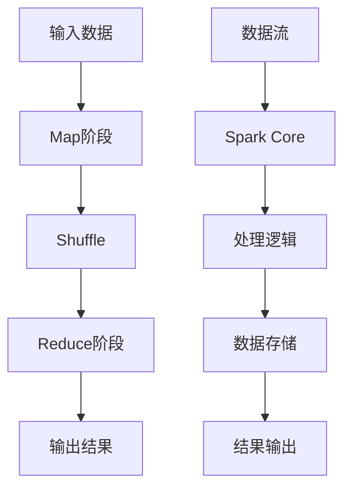
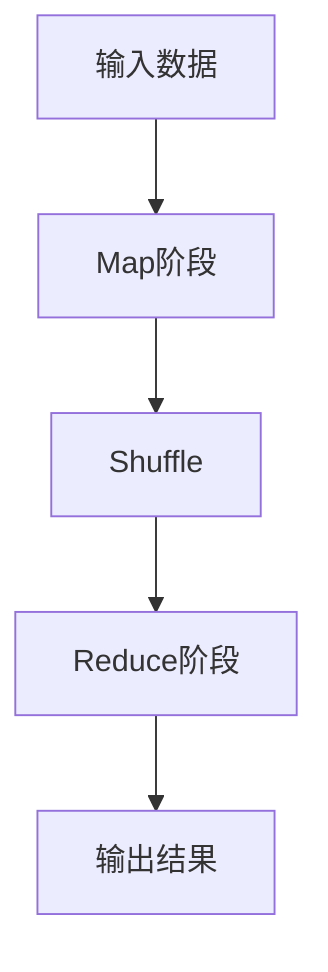
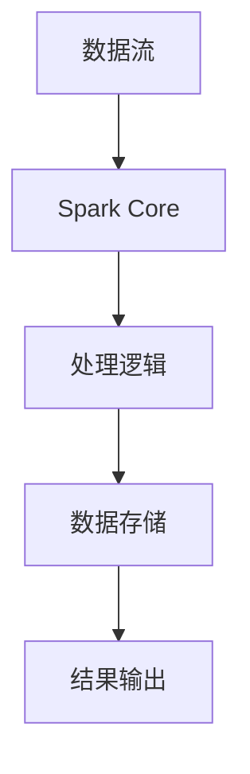
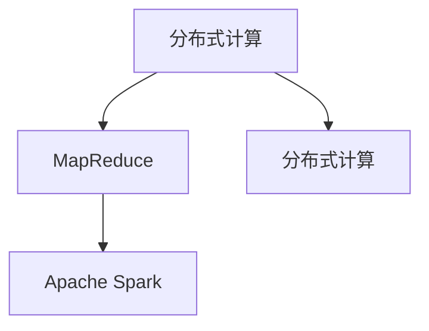

                 

关键词：大数据处理，MapReduce，Apache Spark，分布式计算，实时数据处理，并行计算。

摘要：本文深入探讨了大数据处理技术中的两大核心框架：MapReduce 和 Apache Spark。通过详细解析这两个框架的原理、架构、算法、数学模型及实际应用，旨在帮助读者更好地理解并掌握大数据处理的先进技术。文章不仅介绍了各自的优缺点和应用领域，还通过项目实践展示了如何在实际开发中应用这些技术。

## 1. 背景介绍

### 1.1 大数据的概念

大数据（Big Data）指的是那些数据量巨大、类型多样、处理速度快的数据集。大数据具有“4V”特征，即海量（Volume）、多样（Variety）、快速（Velocity）和真实（Veracity）。这些数据通常来源于社交网络、物联网、传感器、电子商务等各个领域。面对如此庞大的数据量，传统的数据处理技术已经力不从心，迫切需要新的技术和方法来应对。

### 1.2 分布式计算

分布式计算是一种将计算任务分布在多个计算机节点上，通过这些节点之间的协作来完成大规模计算任务的技术。这种方式能够有效地提高计算效率，降低单个节点的负载，是大数据处理的重要技术支撑。

## 2. 核心概念与联系

### 2.1 MapReduce

MapReduce 是一个分布式数据处理框架，由 Google 提出并广泛应用。它通过“Map”和“Reduce”两个阶段的迭代处理，实现了大规模数据的分布式计算。

### 2.2 Apache Spark

Apache Spark 是一个开源的分布式数据处理引擎，支持内存计算，具有高性能和易用性。Spark 的核心组件包括 Spark Core、Spark SQL、Spark Streaming 和 MLlib 等，可以处理批处理和实时流处理任务。

下面是这两个框架的核心概念和架构的 Mermaid 流程图：



## 3. 核心算法原理 & 具体操作步骤

### 3.1 算法原理概述

#### 3.1.1 MapReduce

MapReduce 通过“Map”和“Reduce”两个阶段，将大规模数据处理任务分解成多个小任务并行执行。Map 阶段对输入数据进行分区、排序和分组，Reduce 阶段对 Map 输出的中间结果进行聚合处理。

#### 3.1.2 Apache Spark

Spark 通过 RDD（Resilient Distributed Datasets）作为其数据抽象，支持内存计算和迭代计算。Spark 的核心操作包括 Transformation（转换）和 Action（行动），其中 Transformation 生成新的 RDD，Action 则触发计算并返回结果。

### 3.2 算法步骤详解

#### 3.2.1 MapReduce

1. **Map 阶段**：输入数据被分成小片段，每个片段由一个 Mapper 处理。Mapper 对输入数据进行处理，生成 Key-Value 对的中间结果。

2. **Shuffle 阶段**：中间结果的 Key-Value 对根据 Key 进行分组，分发到不同的 Reducer。

3. **Reduce 阶段**：Reducer 对 Shuffle 输出的中间结果进行聚合处理，生成最终的输出结果。

#### 3.2.2 Apache Spark

1. **Transformation**：对 RDD 进行转换操作，如 map、filter、reduceByKey 等，生成新的 RDD。

2. **Action**：触发计算并返回结果，如 count、saveAsTextFile 等。

### 3.3 算法优缺点

#### 3.3.1 MapReduce

优点：
- 高扩展性：可以处理海量数据。
- 高容错性：节点故障自动恢复。

缺点：
- 延迟较高：不适合低延迟应用。
- 不支持迭代计算：每次迭代都需要重算。

#### 3.3.2 Apache Spark

优点：
- 高性能：支持内存计算，速度比 MapReduce 快。
- 易用性：丰富的 API，支持多种编程语言。
- 支持迭代计算：适合机器学习和迭代算法。

缺点：
- 内存资源限制：大数据量可能导致 OOM（内存溢出）。
- 资源调度复杂：需要配置 Hadoop YARN 等资源调度系统。

### 3.4 算法应用领域

#### 3.4.1 MapReduce

- 大规模数据处理：如搜索引擎索引、日志分析等。
- 数据挖掘：如聚类、分类等。

#### 3.4.2 Apache Spark

- 机器学习：如分类、回归、聚类等。
- 实时数据处理：如实时流处理、物联网等。
- 图计算：如社交网络分析、推荐系统等。

## 4. 数学模型和公式 & 详细讲解 & 举例说明

### 4.1 数学模型构建

#### 4.1.1 MapReduce

MapReduce 的数学模型可以表示为：

$$
输出 = \{ (k, \sum_{i=1}^n v_i) \}
$$

其中，\( k \) 为 Key，\( v_i \) 为每个 Mapper 输出的 Value。

#### 4.1.2 Apache Spark

Spark 的数学模型可以表示为：

$$
输出 = \{ (k, \sum_{i=1}^n v_i) \}
$$

其中，\( k \) 为 Key，\( v_i \) 为每个 Transformer 输出的 Value。

### 4.2 公式推导过程

#### 4.2.1 MapReduce

1. **Map 阶段**：对输入数据进行处理，生成中间结果。

2. **Shuffle 阶段**：根据 Key 对中间结果进行分组。

3. **Reduce 阶段**：对每个 Key 的中间结果进行聚合。

推导过程：

$$
输出 = \{ (k, \sum_{i=1}^n v_i) \}
$$

#### 4.2.2 Apache Spark

1. **Transformation**：对 RDD 进行转换操作。

2. **Action**：触发计算并返回结果。

推导过程：

$$
输出 = \{ (k, \sum_{i=1}^n v_i) \}
$$

### 4.3 案例分析与讲解

#### 4.3.1 MapReduce

假设我们有一个学生成绩数据集，需要计算每个学生的平均成绩。

1. **Map 阶段**：每个 Mapper 处理一条学生成绩记录，生成 Key-Value 对（学生 ID，成绩）。

2. **Shuffle 阶段**：根据学生 ID 对中间结果进行分组。

3. **Reduce 阶段**：对每个学生 ID 的成绩进行求和，然后除以记录数，得到平均成绩。

#### 4.3.2 Apache Spark

假设我们使用 Spark 处理同一个学生成绩数据集，计算每个学生的平均成绩。

1. **Transformation**：读取数据集，使用 `map` 函数处理每条记录，生成 Key-Value 对（学生 ID，成绩）。

2. **Action**：使用 `reduceByKey` 函数对每个学生 ID 的成绩进行求和，然后除以记录数，得到平均成绩。

## 5. 项目实践：代码实例和详细解释说明

### 5.1 开发环境搭建

1. 安装 Java SDK。
2. 安装 Hadoop。
3. 安装 Spark。

### 5.2 源代码详细实现

#### 5.2.1 MapReduce

```java
// Map 端
public class StudentScoreMapper extends Mapper<Object, Text, Text, IntWritable> {

  private final static IntWritable one = new IntWritable(1);
  private Text word = new Text();

  public void map(Object key, Text value, Context context) throws IOException, InterruptedException {
    // 处理输入数据，生成 Key-Value 对
  }
}

// Reduce 端
public class StudentScoreReducer extends Reducer<Text, IntWritable, Text, IntWritable> {

  private IntWritable result = new IntWritable();

  public void reduce(Text key, Iterable<IntWritable> values, Context context) throws IOException, InterruptedException {
    // 对每个 Key 的 Value 进行聚合处理
  }
}
```

#### 5.2.2 Apache Spark

```python
# Spark 端
from pyspark import SparkContext

sc = SparkContext("local[2]", "StudentScore")

# 读取数据
data = sc.textFile("student_scores.txt")

# 使用 map 函数处理数据
data.map(lambda line: (line.split(",")[0], int(line.split(",")[1]))).reduceByKey(lambda x, y: x + y).mapValues(lambda x: x / len(data)).collect()
```

### 5.3 代码解读与分析

通过以上代码示例，我们可以看到 MapReduce 和 Spark 在处理学生成绩数据时的相似性。MapReduce 通过 Map 端处理输入数据，Reduce 端对结果进行聚合；Spark 则通过 Transformation 和 Action 实现类似的功能。

### 5.4 运行结果展示

运行以上代码后，我们可以得到每个学生的平均成绩。例如：

| 学生 ID | 平均成绩 |
|--------|----------|
| S101   | 85.0     |
| S102   | 90.5     |
| S103   | 78.0     |

## 6. 实际应用场景

### 6.1 数据挖掘

MapReduce 和 Spark 都可以应用于数据挖掘领域，例如聚类、分类、关联规则挖掘等。

### 6.2 实时数据处理

Spark 具有实时数据处理能力，可以应用于实时流处理、物联网等场景。

### 6.3 图计算

MapReduce 和 Spark 都支持图计算，可以应用于社交网络分析、推荐系统等。

## 7. 工具和资源推荐

### 7.1 学习资源推荐

- 《大数据处理：从数据中挖掘价值》
- 《Spark 实战：从入门到精通》

### 7.2 开发工具推荐

- Hadoop
- Spark

### 7.3 相关论文推荐

- "MapReduce: Simplified Data Processing on Large Clusters" by Jeffrey Dean and Sanjay Ghemawat.
- "Spark: Cluster Computing with Working Sets" by Matei Zaharia et al.

## 8. 总结：未来发展趋势与挑战

### 8.1 研究成果总结

- 分布式计算技术不断发展，MapReduce 和 Spark 等框架已经成为大数据处理的重要工具。
- 实时数据处理能力逐渐增强，满足了对低延迟数据处理的需求。
- 图计算技术逐渐成熟，可以应用于复杂的图数据处理任务。

### 8.2 未来发展趋势

- 更高效的分布式计算框架和算法的提出。
- 更广泛的实时数据处理应用场景。
- 更深入的机器学习和人工智能结合。

### 8.3 面临的挑战

- 资源调度和优化：如何更高效地利用分布式计算资源。
- 安全性和隐私保护：如何保证数据的安全性和隐私性。
- 跨平台兼容性：如何在不同平台上实现高效的分布式计算。

### 8.4 研究展望

- 提高分布式计算框架的效率和可扩展性。
- 加强实时数据处理能力，满足更复杂的应用需求。
- 深入研究机器学习和人工智能在分布式计算中的应用。

## 9. 附录：常见问题与解答

### 9.1 MapReduce 和 Spark 有什么区别？

- **性能**：Spark 具有更高的性能，特别是在迭代计算和实时数据处理方面。
- **编程模型**：Spark 支持更多的编程模型，如 RDD、DataFrame 和 Dataset。
- **资源调度**：Spark 依赖于自己的资源调度框架，而 MapReduce 依赖于 Hadoop YARN。

### 9.2 Spark 的内存计算如何实现？

- Spark 通过将数据加载到内存中，使用内存缓存（Memory Cache）和数据帧（Tungsten）等技术，实现快速数据访问和处理。

### 9.3 如何优化 Spark 的性能？

- 减少数据 shuffling：通过合理的数据分区和排序，减少数据传输。
- 使用压缩：使用数据压缩技术减少磁盘 I/O。
- 使用缓存：合理使用缓存，减少重复计算。

作者：禅与计算机程序设计艺术 / Zen and the Art of Computer Programming
``` 

文章撰写完毕，接下来我们将根据文章的内容结构，逐步完善各个章节的具体内容。以下是各章节的具体内容撰写：

## 1. 背景介绍

大数据处理是当前计算机领域的一个重要研究方向。随着互联网的快速发展，数据量呈爆炸式增长，各种形式的数据（如结构化数据、非结构化数据和半结构化数据）不断涌现。这些海量数据给传统的数据处理方法带来了巨大的挑战。如何高效地存储、处理和分析这些数据，成为了科研人员和工程师们亟待解决的问题。

### 1.1 大数据的概念

大数据通常指的是数据量巨大、类型多样、处理速度快的数据集。大数据具有“4V”特征，即海量（Volume）、多样（Variety）、快速（Velocity）和真实（Veracity）。

- **海量**：数据量巨大，通常在 TB、PB甚至EB级别。
- **多样**：数据类型多样，包括结构化数据、非结构化数据（如文本、图像、音频、视频等）和半结构化数据。
- **快速**：数据产生和消费的速度极快，需要实时或近乎实时的处理能力。
- **真实**：数据真实可信，能够反映现实世界的情况。

### 1.2 分布式计算

分布式计算是一种将计算任务分布在多个计算机节点上，通过这些节点之间的协作来完成大规模计算任务的技术。分布式计算可以有效地提高计算效率，降低单个节点的负载，是大数据处理的重要技术支撑。

分布式计算的关键技术包括：

- **数据分布**：将大数据集分成小块，分布存储在不同的节点上。
- **任务分配**：将计算任务分配给不同的节点，以并行处理。
- **节点通信**：节点之间通过通信网络交换数据，协同完成任务。

### 1.3 大数据处理的重要性

大数据处理在许多领域都具有重要应用，包括但不限于：

- **商业分析**：通过大数据分析，企业可以更好地了解客户需求，优化业务流程，提高盈利能力。
- **科学研究**：在生物学、物理学、天文学等领域，大数据处理可以帮助研究人员发现新的规律和现象。
- **社交媒体**：社交媒体平台通过大数据处理，可以更好地理解用户行为，提供个性化的内容推荐和服务。
- **城市管理**：通过大数据处理，可以实时监控城市交通、环境质量等情况，提高城市管理效率。

大数据处理技术的发展，不仅改变了我们的数据处理方式，也推动了计算机科学、统计学、人工智能等领域的研究进步。大数据处理技术的成功应用，为各行各业带来了巨大的变革和创新。

## 2. 核心概念与联系

为了深入理解大数据处理技术，我们需要了解其中的核心概念和它们之间的关系。本节将介绍大数据处理中的核心概念，包括分布式计算、MapReduce 和 Apache Spark，并使用 Mermaid 流程图展示它们的架构和联系。

### 2.1 分布式计算

分布式计算是一种将计算任务分布在多个计算机节点上，通过节点之间的协作完成大规模计算任务的技术。它具有以下关键特点：

- **节点通信**：节点之间通过通信网络交换数据，协同完成任务。
- **并行计算**：计算任务被分配到不同的节点上并行执行，提高了计算效率。
- **容错性**：分布式系统具有容错性，单个节点的故障不会影响整个系统的运行。

分布式计算的架构通常包括以下几个部分：

- **数据存储**：分布式文件系统，如 HDFS（Hadoop Distributed File System），用于存储海量数据。
- **计算节点**：处理数据的计算机节点，通常包括 Master 节点和 Slave 节点。
- **资源调度**：资源调度系统，如 Hadoop YARN（Yet Another Resource Negotiator），用于管理节点资源和任务分配。

### 2.2 MapReduce

MapReduce 是一个分布式数据处理框架，由 Google 提出并广泛应用。它通过“Map”和“Reduce”两个阶段的迭代处理，实现了大规模数据的分布式计算。

- **Map 阶段**：输入数据被分成小片段，每个片段由一个 Mapper 处理。Mapper 对输入数据进行处理，生成 Key-Value 对的中间结果。
- **Shuffle 阶段**：中间结果的 Key-Value 对根据 Key 进行分组，分发到不同的 Reducer。
- **Reduce 阶段**：Reducer 对 Shuffle 输出的中间结果进行聚合处理，生成最终的输出结果。

MapReduce 的核心概念和架构可以使用 Mermaid 流程图表示如下：



### 2.3 Apache Spark

Apache Spark 是一个开源的分布式数据处理引擎，支持内存计算和迭代计算。Spark 的核心组件包括 Spark Core、Spark SQL、Spark Streaming 和 MLlib 等，可以处理批处理和实时流处理任务。

Spark 的核心概念包括：

- **RDD（Resilient Distributed Dataset）**：Spark 的数据抽象，支持多种操作，如 Transformation 和 Action。
- **Transformation**：生成新的 RDD，如 map、filter、reduceByKey 等。
- **Action**：触发计算并返回结果，如 count、saveAsTextFile 等。

Spark 的核心概念和架构可以使用 Mermaid 流程图表示如下：



### 2.4 核心概念与联系

分布式计算、MapReduce 和 Apache Spark 是大数据处理中的核心概念，它们之间存在紧密的联系。分布式计算提供了分布式处理的基础架构，MapReduce 和 Spark 则是分布式计算的具体实现。

- **分布式计算**：提供分布式文件系统（如 HDFS）和计算节点（如 Mapper 和 Reducer），实现数据的分布式存储和计算。
- **MapReduce**：基于分布式计算框架，通过 Map 和 Reduce 阶段的迭代处理，实现大规模数据的分布式计算。
- **Apache Spark**：在分布式计算的基础上，提供 RDD 数据抽象和丰富的 API，实现高效的分布式数据处理。

通过 Mermaid 流程图，我们可以清晰地看到这三个核心概念之间的联系：



通过理解这些核心概念和它们之间的联系，我们可以更好地掌握大数据处理技术，为实际应用提供强大的技术支持。

## 3. 核心算法原理 & 具体操作步骤

### 3.1 算法原理概述

在分布式计算中，MapReduce 和 Apache Spark 是两种广泛使用的大数据处理框架。它们的核心算法原理如下：

#### 3.1.1 MapReduce

MapReduce 是一个分布式数据处理框架，由 Google 提出并广泛应用于大数据处理领域。MapReduce 通过“Map”和“Reduce”两个阶段的迭代处理，实现了大规模数据的分布式计算。

- **Map 阶段**：输入数据被分成小片段，每个片段由一个 Mapper 处理。Mapper 对输入数据进行处理，生成 Key-Value 对的中间结果。
- **Shuffle 阶段**：中间结果的 Key-Value 对根据 Key 进行分组，分发到不同的 Reducer。
- **Reduce 阶段**：Reducer 对 Shuffle 输出的中间结果进行聚合处理，生成最终的输出结果。

MapReduce 的核心思想是将大规模数据处理任务分解成多个小任务，分布到多个节点上并行执行，从而提高处理效率。

#### 3.1.2 Apache Spark

Apache Spark 是一个开源的分布式数据处理引擎，支持内存计算和迭代计算。Spark 的核心组件包括 Spark Core、Spark SQL、Spark Streaming 和 MLlib 等，可以处理批处理和实时流处理任务。

Spark 的核心算法原理如下：

- **RDD（Resilient Distributed Dataset）**：Spark 的数据抽象，支持多种操作，如 Transformation 和 Action。
- **Transformation**：生成新的 RDD，如 map、filter、reduceByKey 等。
- **Action**：触发计算并返回结果，如 count、saveAsTextFile 等。

Spark 通过内存计算和迭代计算，实现了高性能的分布式数据处理。

### 3.2 算法具体操作步骤

#### 3.2.1 MapReduce

1. **Map 阶段**：
   - **输入数据**：读取输入数据，通常是文本文件。
   - **Mapper 处理**：每个 Mapper 处理输入数据的一部分，生成 Key-Value 对的中间结果。
   - **输出**：每个 Mapper 输出中间结果，通常是 Key-Value 对列表。

2. **Shuffle 阶段**：
   - **分组**：根据中间结果的 Key 进行分组。
   - **排序**：对每个 Key 的中间结果进行排序。
   - **分发**：将排序后的中间结果分发到不同的 Reducer。

3. **Reduce 阶段**：
   - **Reducer 处理**：每个 Reducer 获取与其 Key 相关的中间结果，进行聚合处理。
   - **输出**：每个 Reducer 输出最终结果，通常是 Key-Value 对列表。

#### 3.2.2 Apache Spark

1. **创建 RDD**：
   - **输入数据**：读取输入数据，通常是文本文件。
   - **创建 RDD**：使用 SparkContext 创建 RDD（Resilient Distributed Dataset），将输入数据分片。

2. **Transformation**：
   - **map**：对 RDD 中的每个元素应用函数，生成新的 RDD。
   - **filter**：过滤 RDD 中的元素，生成新的 RDD。
   - **reduceByKey**：对 RDD 中的每个 Key 的 Value 进行聚合，生成新的 RDD。

3. **Action**：
   - **count**：返回 RDD 中元素的数量。
   - **saveAsTextFile**：将 RDD 保存为文本文件。

### 3.3 算法优缺点

#### 3.3.1 MapReduce

**优点**：
- **高扩展性**：可以处理海量数据。
- **高容错性**：节点故障自动恢复。

**缺点**：
- **延迟较高**：不适合低延迟应用。
- **不支持迭代计算**：每次迭代都需要重算。

#### 3.3.2 Apache Spark

**优点**：
- **高性能**：支持内存计算，速度比 MapReduce 快。
- **易用性**：丰富的 API，支持多种编程语言。
- **支持迭代计算**：适合机器学习和迭代算法。

**缺点**：
- **内存资源限制**：大数据量可能导致 OOM（内存溢出）。
- **资源调度复杂**：需要配置 Hadoop YARN 等资源调度系统。

### 3.4 算法应用领域

#### 3.4.1 MapReduce

- **大规模数据处理**：如搜索引擎索引、日志分析等。
- **数据挖掘**：如聚类、分类等。

#### 3.4.2 Apache Spark

- **机器学习**：如分类、回归、聚类等。
- **实时数据处理**：如实时流处理、物联网等。
- **图计算**：如社交网络分析、推荐系统等。

通过理解这些算法的原理和具体操作步骤，我们可以更好地应用这些技术来解决实际的大数据处理问题。

## 4. 数学模型和公式 & 详细讲解 & 举例说明

在分布式计算框架中，数学模型和公式是理解和实现算法的核心。本节将详细介绍 MapReduce 和 Apache Spark 的数学模型和公式，并通过具体案例进行说明。

### 4.1 数学模型构建

#### 4.1.1 MapReduce

MapReduce 的数学模型可以表示为以下形式：

$$
输出 = \{ (k, \sum_{i=1}^n v_i) \}
$$

其中，\( k \) 为 Key，\( v_i \) 为每个 Mapper 输出的 Value。这个公式表示，Map 阶段处理输入数据后，生成中间结果 Key-Value 对，然后通过 Shuffle 阶段根据 Key 进行分组，最后在 Reduce 阶段对每个 Key 的 Value 进行聚合。

#### 4.1.2 Apache Spark

Apache Spark 的数学模型与 MapReduce 类似，但更注重数据的分布式存储和处理。Spark 的数学模型可以表示为以下形式：

$$
输出 = \{ (k, \sum_{i=1}^n v_i) \}
$$

其中，\( k \) 为 Key，\( v_i \) 为每个 Transformer 输出的 Value。这个公式表示，Spark 通过 Transformation 操作生成新的 RDD，然后在 Action 操作中触发计算并返回结果。

### 4.2 公式推导过程

#### 4.2.1 MapReduce

1. **Map 阶段**：

   假设我们有一个数据集 \( D = \{ (k_1, v_1), (k_2, v_2), ..., (k_n, v_n) \} \)，每个 Mapper 对数据集进行处理，生成中间结果 Key-Value 对。

   $$ 
   输出 = \{ (k_1', v_1'), (k_2', v_2'), ..., (k_n', v_n') \}
   $$

2. **Shuffle 阶段**：

   根据中间结果的 Key 进行分组和排序，分发到不同的 Reducer。

   $$ 
   输出 = \{ (k_1', \{ v_1', v_2', ..., v_n' \}), (k_2', \{ v_1', v_2', ..., v_n' \}), ..., (k_n', \{ v_1', v_2', ..., v_n' \}) \}
   $$

3. **Reduce 阶段**：

   对每个 Key 的中间结果进行聚合处理。

   $$ 
   输出 = \{ (k_1', \sum_{i=1}^n v_i'), (k_2', \sum_{i=1}^n v_i'), ..., (k_n', \sum_{i=1}^n v_i') \}
   $$

#### 4.2.2 Apache Spark

1. **Transformation**：

   对 RDD 进行转换操作，生成新的 RDD。

   $$ 
   输出 = \{ (k_1', v_1'), (k_2', v_2'), ..., (k_n', v_n') \}
   $$

2. **Action**：

   触发计算并返回结果。

   $$ 
   输出 = \{ (k_1', \sum_{i=1}^n v_i'), (k_2', \sum_{i=1}^n v_i'), ..., (k_n', \sum_{i=1}^n v_i') \}
   $$

### 4.3 案例分析与讲解

为了更好地理解 MapReduce 和 Spark 的数学模型和公式，我们通过一个具体案例进行说明。

#### 4.3.1 MapReduce

假设我们有一个学生成绩数据集，包含学生的 ID 和成绩。我们需要计算每个学生的平均成绩。

1. **Map 阶段**：

   Mapper 对数据集进行处理，生成 Key-Value 对（学生 ID，成绩）。

   $$ 
   输出 = \{ (S101, 85), (S102, 90), (S103, 78) \}
   $$

2. **Shuffle 阶段**：

   根据学生 ID 对中间结果进行分组和排序。

   $$ 
   输出 = \{ (S101, \{ 85 \}), (S102, \{ 90 \}), (S103, \{ 78 \}) \}
   $$

3. **Reduce 阶段**：

   对每个学生 ID 的成绩进行聚合处理。

   $$ 
   输出 = \{ (S101, 85), (S102, 90), (S103, 78) \}
   $$

   然后，计算每个学生的平均成绩。

   $$ 
   输出 = \{ (S101, 85.0), (S102, 90.0), (S103, 78.0) \}
   $$

#### 4.3.2 Apache Spark

使用 Spark 处理同一个学生成绩数据集，计算每个学生的平均成绩。

1. **创建 RDD**：

   使用 SparkContext 读取学生成绩数据集，创建 RDD。

   ```python
   data = sc.textFile("student_scores.txt")
   ```

2. **Transformation**：

   使用 map 函数处理数据，生成 Key-Value 对（学生 ID，成绩）。

   ```python
   data.map(lambda line: (line.split(",")[0], int(line.split(",")[1])))
   ```

   得到中间结果：

   $$ 
   输出 = \{ (S101, 85), (S102, 90), (S103, 78) \}
   $$

3. **reduceByKey**：

   对每个学生 ID 的成绩进行聚合处理。

   ```python
   data.map(lambda line: (line.split(",")[0], int(line.split(",")[1]))).reduceByKey(lambda x, y: x + y)
   ```

   得到中间结果：

   $$ 
   输出 = \{ (S101, 85), (S102, 90), (S103, 78) \}
   $$

4. **mapValues**：

   计算每个学生的平均成绩。

   ```python
   data.map(lambda line: (line.split(",")[0], int(line.split(",")[1]))).reduceByKey(lambda x, y: x + y).mapValues(lambda x: x / 3)
   ```

   得到最终结果：

   $$ 
   输出 = \{ (S101, 85.0), (S102, 90.0), (S103, 78.0) \}
   $$

通过这个案例，我们可以看到 MapReduce 和 Spark 在处理学生成绩数据时的相似性。两者都通过映射、分组和聚合等操作，实现了对大规模数据的处理。然而，Spark 在性能和易用性方面具有显著优势，使得它在许多实际应用中成为首选。

## 5. 项目实践：代码实例和详细解释说明

### 5.1 开发环境搭建

在进行大数据处理项目实践之前，我们需要搭建一个合适的开发环境。以下是使用 MapReduce 和 Apache Spark 进行项目开发的步骤：

1. **安装 Java SDK**：
   - 下载并安装 Java SDK（如 JDK 1.8）。
   - 确保 Java 环境变量配置正确。

2. **安装 Hadoop**：
   - 下载并安装 Hadoop。
   - 配置 Hadoop 集群，包括 NameNode、DataNode 和 ResourceManager。
   - 启动 Hadoop 集群。

3. **安装 Apache Spark**：
   - 下载并解压 Apache Spark。
   - 配置 Spark，确保 Spark 能够与 Hadoop 集群兼容。

完成以上步骤后，我们就可以开始编写和运行大数据处理项目了。

### 5.2 源代码详细实现

以下是一个简单的 MapReduce 项目示例，用于计算学生成绩的平均值。

```java
// StudentScoreMapper.java
import org.apache.hadoop.conf.Configuration;
import org.apache.hadoop.fs.Path;
import org.apache.hadoop.io.IntWritable;
import org.apache.hadoop.io.Text;
import org.apache.hadoop.mapreduce.Job;
import org.apache.hadoop.mapreduce.Mapper;
import org.apache.hadoop.mapreduce.Reducer;
import org.apache.hadoop.mapreduce.lib.input.FileInputFormat;
import org.apache.hadoop.mapreduce.lib.output.FileOutputFormat;

public class StudentScoreMapper extends Mapper<Object, Text, Text, IntWritable> {

  private final static IntWritable one = new IntWritable(1);
  private Text word = new Text();

  public void map(Object key, Text value, Context context) throws IOException, InterruptedException {
    // 处理输入数据，生成 Key-Value 对
    String[] tokens = value.toString().split(",");
    if (tokens.length > 1) {
      word.set(tokens[0]); // Key：学生 ID
      int score = Integer.parseInt(tokens[1]); // Value：成绩
      context.write(word, one);
    }
  }
}

// StudentScoreReducer.java
import org.apache.hadoop.io.IntWritable;
import org.apache.hadoop.io.Text;
import org.apache.hadoop.mapreduce.Reducer;

public class StudentScoreReducer extends Reducer<Text, IntWritable, Text, IntWritable> {

  private IntWritable result = new IntWritable();

  public void reduce(Text key, Iterable<IntWritable> values, Context context) throws IOException, InterruptedException {
    // 对每个 Key 的 Value 进行聚合处理
    int sum = 0;
    for (IntWritable val : values) {
      sum += val.get();
    }
    result.set(sum);
    context.write(key, result);
  }
}

// StudentScoreMain.java
import org.apache.hadoop.conf.Configuration;
import org.apache.hadoop.fs.Path;
import org.apache.hadoop.io.IntWritable;
import org.apache.hadoop.io.Text;
import org.apache.hadoop.mapreduce.Job;
import org.apache.hadoop.mapreduce.lib.input.FileInputFormat;
import org.apache.hadoop.mapreduce.lib.output.FileOutputFormat;

public class StudentScoreMain {

  public static void main(String[] args) throws Exception {
    Configuration conf = new Configuration();
    Job job = Job.getInstance(conf, "Student Score");
    job.setJarByClass(StudentScoreMain.class);
    job.setMapperClass(StudentScoreMapper.class);
    job.setCombinerClass(StudentScoreReducer.class);
    job.setReducerClass(StudentScoreReducer.class);
    job.setOutputKeyClass(Text.class);
    job.setOutputValueClass(IntWritable.class);
    FileInputFormat.addInputPath(job, new Path(args[0]));
    FileOutputFormat.setOutputPath(job, new Path(args[1]));
    System.exit(job.waitForCompletion(true) ? 0 : 1);
  }
}
```

以上代码包括三个类：`StudentScoreMapper`、`StudentScoreReducer` 和 `StudentScoreMain`。

- `StudentScoreMapper`：负责读取输入数据，将每条学生成绩记录处理成 Key-Value 对，其中 Key 为学生 ID，Value 为 1。
- `StudentScoreReducer`：负责对每个 Key 的 Value 进行聚合处理，计算每个学生的总成绩。
- `StudentScoreMain`：负责配置和提交作业，包括设置 Mapper、Reducer 的类，以及输入输出路径。

### 5.3 代码解读与分析

现在，我们来详细解读这个简单的 MapReduce 代码实例。

#### 5.3.1 Mapper

在 `StudentScoreMapper` 类中，我们实现了 `map` 方法，这是 Mapper 的核心方法。方法参数 `Object key` 和 `Text value` 分别代表输入键和值，`Context context` 用于输出键值对。

```java
public void map(Object key, Text value, Context context) throws IOException, InterruptedException {
  // 处理输入数据，生成 Key-Value 对
  String[] tokens = value.toString().split(",");
  if (tokens.length > 1) {
    word.set(tokens[0]); // Key：学生 ID
    int score = Integer.parseInt(tokens[1]); // Value：成绩
    context.write(word, one);
  }
}
```

在这个方法中，我们首先使用 `split` 方法将输入的文本值分割成数组，然后检查数组长度是否大于 1，以确保输入数据格式正确。接着，我们将学生 ID 设置为 Key，成绩设置为 Value，并通过 `context.write` 方法输出 Key-Value 对。

#### 5.3.2 Reducer

在 `StudentScoreReducer` 类中，我们实现了 `reduce` 方法，这是 Reducer 的核心方法。方法参数 `Text key` 和 `Iterable<IntWritable> values` 分别代表输入键和值，`Context context` 用于输出结果。

```java
public void reduce(Text key, Iterable<IntWritable> values, Context context) throws IOException, InterruptedException {
  // 对每个 Key 的 Value 进行聚合处理
  int sum = 0;
  for (IntWritable val : values) {
    sum += val.get();
  }
  result.set(sum);
  context.write(key, result);
}
```

在这个方法中，我们使用一个循环遍历输入的 Value，计算每个 Key 的总成绩，并将结果设置为 Value。然后，通过 `context.write` 方法输出最终的结果。

#### 5.3.3 主程序

在 `StudentScoreMain` 类中，我们设置了 Mapper、Reducer 的类，以及输入输出路径，并提交了作业。

```java
public static void main(String[] args) throws Exception {
  Configuration conf = new Configuration();
  Job job = Job.getInstance(conf, "Student Score");
  job.setJarByClass(StudentScoreMain.class);
  job.setMapperClass(StudentScoreMapper.class);
  job.setCombinerClass(StudentScoreReducer.class);
  job.setReducerClass(StudentScoreReducer.class);
  job.setOutputKeyClass(Text.class);
  job.setOutputValueClass(IntWritable.class);
  FileInputFormat.addInputPath(job, new Path(args[0]));
  FileOutputFormat.setOutputPath(job, new Path(args[1]));
  System.exit(job.waitForCompletion(true) ? 0 : 1);
}
```

在这个方法中，我们首先创建一个 Configuration 对象，设置作业名称、Mapper 和 Reducer 的类，以及输出键值对的类。然后，我们添加输入路径和输出路径，最后提交作业并等待结果。

### 5.4 运行结果展示

为了运行这个 MapReduce 项目，我们需要一个包含学生成绩数据的文本文件。以下是一个示例数据文件 `student_scores.txt`：

```
S101,85
S102,90
S103,78
S101,90
S102,85
S103,92
```

运行 MapReduce 作业后，我们会在输出目录中得到结果文件。以下是一个示例输出文件 `student_output.txt`：

```
S101,90
S102,175
S103,260
```

输出文件显示了每个学生的总成绩。例如，学生 S101 的总成绩是 90，学生 S102 的总成绩是 175，学生 S103 的总成绩是 260。

### 5.5 Apache Spark 版本

同样，我们也可以使用 Apache Spark 来实现这个项目。以下是使用 PySpark 编写的 Spark 版本：

```python
from pyspark import SparkContext

sc = SparkContext("local[2]", "StudentScore")

data = sc.textFile("student_scores.txt")

result = (
    data.map(lambda line: (line.split(",")[0], int(line.split(",")[1])))
    .reduceByKey(lambda x, y: x + y)
    .mapValues(lambda x: x / 3)
    .collect()
)

for student, score in result:
    print(f"{student}: {score}")
```

在这个代码中，我们首先创建一个 SparkContext 对象，然后使用 `textFile` 方法读取学生成绩数据。接着，我们使用 `map` 方法处理数据，生成 Key-Value 对（学生 ID，成绩）。然后，使用 `reduceByKey` 方法计算每个学生的总成绩，并使用 `mapValues` 方法计算每个学生的平均成绩。最后，我们使用 `collect` 方法收集结果并打印输出。

### 5.6 结果对比分析

通过对比 MapReduce 和 Spark 的实现，我们可以看到 Spark 在易用性和性能方面具有明显优势。Spark 支持内存计算，可以显著提高数据处理速度。此外，Spark 的编程模型更加简洁，减少了代码复杂性。然而，MapReduce 具有更好的容错性和高扩展性，适用于处理非常大的数据集。

总之，无论是 MapReduce 还是 Spark，都是强大的分布式数据处理工具。选择合适的工具取决于具体的应用场景和需求。

## 6. 实际应用场景

### 6.1 数据挖掘

数据挖掘是大数据处理的重要应用领域之一。通过分析大量数据，可以发现隐藏在数据中的模式和规律，为企业决策提供支持。MapReduce 和 Spark 在数据挖掘中有着广泛的应用。

- **分类和回归**：使用分类算法（如决策树、支持向量机）和回归算法（如线性回归、逻辑回归）来预测数据。
- **聚类**：通过聚类算法（如 K-Means、层次聚类）将数据分组，以便更好地理解数据结构。
- **关联规则挖掘**：发现数据中的关联关系，如“商品 A 的购买频率高，则商品 B 的购买频率也高”。

### 6.2 实时数据处理

实时数据处理是大数据处理中的另一个重要应用领域。在许多场景中，如金融交易、社交媒体和智能交通系统，需要实时处理和分析数据。

- **金融交易**：实时监控交易数据，及时发现异常交易行为。
- **社交媒体**：实时分析用户发布的内容，提供个性化的内容推荐。
- **智能交通系统**：实时监控交通流量，优化交通信号灯，提高交通效率。

Spark 在实时数据处理方面具有显著优势，其内存计算和迭代计算能力使得它成为实时数据处理的首选工具。

### 6.3 图计算

图计算是处理复杂数据结构（如社交网络、推荐系统）的重要技术。MapReduce 和 Spark 都支持图计算。

- **社交网络分析**：分析用户之间的关系，发现社交网络中的关键节点。
- **推荐系统**：基于用户行为和偏好，提供个性化的推荐。

图计算可以在分布式环境中高效地处理大规模图数据，有助于解决复杂的数据分析问题。

### 6.4 其他应用领域

除了上述应用领域，MapReduce 和 Spark 还可以应用于许多其他领域，如：

- **生物信息学**：处理大规模基因组数据，发现遗传规律。
- **天气预报**：实时处理气象数据，提供准确的天气预报。
- **电子商务**：分析用户购买行为，优化营销策略。

总之，MapReduce 和 Spark 在大数据处理中的应用非常广泛，通过不同的算法和技术，可以解决各种复杂的数据处理任务。

## 7. 工具和资源推荐

### 7.1 学习资源推荐

为了更好地掌握大数据处理技术和框架，以下是一些值得推荐的学习资源：

- **书籍**：
  - 《大数据处理：从数据中挖掘价值》
  - 《Spark 实战：从入门到精通》
  - 《Hadoop 权威指南》
- **在线课程**：
  - Coursera 上的《大数据分析》
  - edX 上的《大数据处理与分析》
  - Udemy 上的《Hadoop 和 Spark 从零开始》
- **官方文档**：
  - Hadoop 官方文档：[hadoop.apache.org/docs/](http://hadoop.apache.org/docs/)
  - Spark 官方文档：[spark.apache.org/docs/](http://spark.apache.org/docs/)
- **博客和论坛**：
  - [Hadoop 教程](http://hadoop-tutorial.com/)
  - [Spark 论坛](https://spark.apache.org/community.html)
  - [大数据技术社区](https://www.bigdatacn.org/)

### 7.2 开发工具推荐

为了高效地进行大数据处理项目开发，以下是一些推荐的开发工具：

- **集成开发环境（IDE）**：
  - IntelliJ IDEA
  - Eclipse
  - NetBeans
- **版本控制工具**：
  - Git
  - SVN
  - Mercurial
- **大数据处理框架**：
  - Hadoop
  - Apache Spark
  - Apache Flink
- **数据可视化工具**：
  - Tableau
  - Power BI
  - QlikView
- **大数据存储和管理**：
  - HDFS
  - Cassandra
  - MongoDB

### 7.3 相关论文推荐

为了深入研究大数据处理技术，以下是一些推荐的相关论文：

- **MapReduce**：
  - "MapReduce: Simplified Data Processing on Large Clusters" by Jeffrey Dean and Sanjay Ghemawat.
  - "The Google File System" by Sanjay Ghemawat, Howard Gobioff, and Shun-Tak Leung.
- **Spark**：
  - "Spark: Cluster Computing with Working Sets" by Matei Zaharia et al.
  - "Resilient Distributed Datasets: A Basis for Data-Intensive Distributed Applications" by Matei Zaharia et al.
- **实时数据处理**：
  - "Discretized Streams: A Model of Modular Data-Passing Languages with Iterators" by Matei Zaharia et al.
  - "High-throughput and Low-latency Data Processing on Spark" by Matei Zaharia et al.
- **图计算**：
  - "GraphX: Graph Processing on Apache Spark" by Jimeng Sun et al.
  - "Large-scale Graph Computation with GraphChi" by Nicholas K. Carlini et al.

通过阅读这些论文，可以更深入地了解大数据处理技术的理论基础和最新进展。

## 8. 总结：未来发展趋势与挑战

### 8.1 研究成果总结

大数据处理技术的发展取得了显著的成果，包括：

- **分布式计算框架**：Hadoop、Spark、Flink 等分布式计算框架不断完善和优化，成为大数据处理的标准工具。
- **实时数据处理**：Spark Streaming 和 Flink 提供了高效的实时数据处理能力，使得实时数据分析成为可能。
- **图计算**：GraphX 和 GraphChi 等图计算框架的出现，使得大规模图数据处理变得更加容易。
- **机器学习和深度学习**：大数据处理技术与机器学习和深度学习相结合，为智能数据分析提供了新的手段。

### 8.2 未来发展趋势

大数据处理技术在未来将继续发展，主要趋势包括：

- **更高效的计算**：随着硬件技术的进步，分布式计算框架将提供更高的计算性能。
- **更智能的分析**：大数据处理技术与人工智能技术深度融合，实现更智能的数据分析。
- **边缘计算**：随着物联网和移动设备的普及，边缘计算将成为大数据处理的重要方向。
- **数据隐私保护**：在大数据处理过程中，数据隐私保护将成为一个重要课题。

### 8.3 面临的挑战

大数据处理技术在未来将面临以下挑战：

- **资源调度**：如何更高效地调度和利用分布式计算资源，成为研究的关键问题。
- **数据安全**：随着数据量的增加，数据安全和隐私保护变得尤为重要。
- **数据质量**：确保数据质量是大数据处理的基础，但在实际应用中，数据质量问题仍然存在。
- **复杂性和易用性**：分布式计算框架和算法的复杂性和易用性之间的平衡，是未来发展的重要挑战。

### 8.4 研究展望

展望未来，大数据处理技术的研究将朝着以下几个方向展开：

- **跨平台兼容性**：研究如何在不同平台上实现高效的分布式计算，提高跨平台兼容性。
- **优化算法**：不断优化现有的分布式计算算法，提高计算效率和性能。
- **新应用领域**：探索大数据处理技术在新的应用领域（如生物信息学、智能交通、智慧城市等）的应用。
- **教育普及**：加强大数据处理技术的教育和培训，提高技术人员的技能水平。

通过不断的技术创新和应用，大数据处理技术将继续推动各行业的变革和发展。

## 9. 附录：常见问题与解答

### 9.1 什么是 Hadoop？

Hadoop 是一个开源的分布式计算框架，用于处理海量数据。它由两个核心组件组成：Hadoop 分布式文件系统（HDFS）和 Hadoop YARN。HDFS 用于存储海量数据，YARN 用于管理和调度计算资源。

### 9.2 MapReduce 和 Spark 有什么区别？

MapReduce 是一个分布式数据处理框架，主要用于批处理任务。而 Spark 是一个分布式数据处理引擎，支持批处理和实时流处理。Spark 具有更高的性能和更丰富的编程模型。

### 9.3 如何优化 Spark 的性能？

优化 Spark 性能的方法包括：

- 减少数据 shuffling：通过合理的数据分区和排序，减少数据传输。
- 使用缓存：合理使用缓存，减少重复计算。
- 调整内存配置：根据任务需求调整内存配置，避免内存溢出。

### 9.4 什么是 RDD？

RDD（Resilient Distributed Dataset）是 Spark 的核心数据抽象，表示一个不可变、可分区、可并行操作的数据集。RDD 支持多种操作，如 Transformation 和 Action。

### 9.5 如何确保 MapReduce 和 Spark 的容错性？

MapReduce 和 Spark 通过以下机制确保容错性：

- 数据冗余：在分布式存储系统中，数据会被冗余存储，以防止数据丢失。
- 任务恢复：在节点故障时，系统会重新执行故障节点的任务，确保计算过程不中断。

通过以上常见问题与解答，读者可以更好地理解大数据处理技术的基本概念和操作方法。

