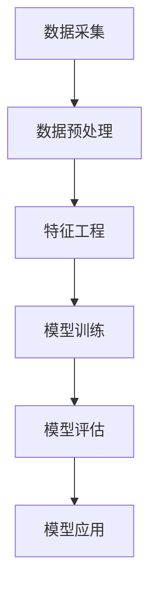

                 

关键词：大数据，银行，个人信贷，信用评级，算法模型，应用实践

>摘要：本文主要研究大数据技术在银行个人信贷信用评级中的应用，通过对大数据技术核心概念和算法原理的深入剖析，结合数学模型和实际项目实践，详细阐述了大数据在信用评级领域的应用价值和发展前景。

## 1. 背景介绍

在当今社会，金融行业的竞争愈发激烈，银行等金融机构需要不断提升自身的服务水平，以满足客户日益增长的多样化需求。个人信贷业务作为银行的重要业务之一，其风险控制至关重要。信用评级作为评估个人信贷风险的重要手段，其准确性和效率直接影响到银行的业务发展和客户满意度。

随着大数据技术的快速发展，银行在个人信贷信用评级方面面临着前所未有的机遇。大数据技术具备海量数据存储、实时数据处理、智能分析等优势，能够帮助银行更全面、准确地了解客户信息，从而提高信用评级的准确性和效率。

## 2. 核心概念与联系

### 2.1 大数据技术概述

大数据技术是指从海量、多样、快速产生和增长的数据中，通过高效的数据存储、处理和分析方法，提取有价值信息和知识的技术体系。其核心概念包括数据采集、数据存储、数据处理、数据分析和数据可视化等。

### 2.2 个人信贷信用评级

个人信贷信用评级是指根据个人的信用历史、财务状况、行为特征等数据，对个人的信用风险进行评估，从而决定是否给予信贷支持及信贷额度。信用评级方法主要包括基于规则的方法、基于模型的方法和基于大数据的方法。

### 2.3 大数据技术在信用评级中的应用架构

大数据技术在银行个人信贷信用评级中的应用架构包括数据采集、数据处理、模型训练、模型评估和应用部署等环节。以下是一个简单的 Mermaid 流程图（请将以下代码复制到支持 Mermaid 格式的编辑器中查看）：



## 3. 核心算法原理 & 具体操作步骤

### 3.1 算法原理概述

大数据技术在个人信贷信用评级中主要涉及以下几种算法：

1. **机器学习算法**：通过历史数据训练模型，对未知数据预测信用评级。
2. **关联规则挖掘算法**：发现数据之间的关联关系，挖掘潜在信用风险。
3. **聚类算法**：将具有相似信用风险的客户进行聚类，便于分析和管理。

### 3.2 算法步骤详解

1. **数据采集**：从银行内部数据和外部数据源获取客户信息。
2. **数据预处理**：对采集到的数据进行清洗、去重、归一化等处理。
3. **特征工程**：从预处理后的数据中提取具有区分度的特征。
4. **模型训练**：使用机器学习算法训练信用评级模型。
5. **模型评估**：评估模型的准确率、召回率等指标。
6. **模型应用**：将训练好的模型部署到实际业务场景中，进行信用评级。

### 3.3 算法优缺点

1. **机器学习算法**：
   - 优点：能够处理大规模数据，自动提取特征，提高评级准确性。
   - 缺点：需要大量数据，训练过程较慢，对数据质量要求较高。
2. **关联规则挖掘算法**：
   - 优点：能够发现数据之间的关联关系，有助于风险识别。
   - 缺点：无法处理大量数据，难以提取深层次特征。
3. **聚类算法**：
   - 优点：能够发现数据分布，为风险控制提供参考。
   - 缺点：无法直接预测信用评级，需要与其他算法结合使用。

### 3.4 算法应用领域

大数据技术在银行个人信贷信用评级中的应用领域广泛，包括：

1. **风险评估**：通过大数据技术分析客户信用风险，为风险控制提供依据。
2. **信用评级**：基于大数据算法对客户进行信用评级，决定信贷支持及额度。
3. **客户管理**：通过对客户信用评级结果的分析，制定个性化营销策略。

## 4. 数学模型和公式 & 详细讲解 & 举例说明

### 4.1 数学模型构建

在银行个人信贷信用评级中，常用的数学模型包括线性回归模型、逻辑回归模型和支持向量机（SVM）等。

#### 4.1.1 线性回归模型

线性回归模型是一种最简单的预测模型，其基本公式为：

$$y = \beta_0 + \beta_1 \cdot x_1 + \beta_2 \cdot x_2 + ... + \beta_n \cdot x_n$$

其中，$y$ 为预测值，$x_1, x_2, ..., x_n$ 为输入特征，$\beta_0, \beta_1, ..., \beta_n$ 为模型参数。

#### 4.1.2 逻辑回归模型

逻辑回归模型是一种用于二分类问题的预测模型，其基本公式为：

$$P(y=1) = \frac{1}{1 + e^{-(\beta_0 + \beta_1 \cdot x_1 + \beta_2 \cdot x_2 + ... + \beta_n \cdot x_n)}}$$

其中，$P(y=1)$ 为目标变量为 1 的概率，$e$ 为自然对数的底数。

#### 4.1.3 支持向量机（SVM）

支持向量机是一种二分类模型，其基本公式为：

$$y = \text{sign}(\sum_{i=1}^{n} \alpha_i \cdot y_i \cdot K(x_i, x))$$

其中，$y$ 为预测值，$x_i, x$ 为输入特征，$y_i$ 为样本标签，$\alpha_i$ 为支持向量机的参数，$K(x_i, x)$ 为核函数。

### 4.2 公式推导过程

以逻辑回归模型为例，其参数 $\beta_0, \beta_1, ..., \beta_n$ 的求解过程如下：

1. **目标函数**：

$$\min_{\beta_0, \beta_1, ..., \beta_n} \sum_{i=1}^{m} (-y_i \cdot \log(P(y=1))) - (1 - y_i) \cdot \log(1 - P(y=1))$$

2. **求导**：

$$\frac{\partial L}{\partial \beta_0} = \frac{1}{m} \sum_{i=1}^{m} (-y_i - P(y=1))$$

$$\frac{\partial L}{\partial \beta_1} = \frac{1}{m} \sum_{i=1}^{m} (-y_i \cdot x_1 - (1 - y_i) \cdot (1 - x_1))$$

$$\frac{\partial L}{\partial \beta_2} = \frac{1}{m} \sum_{i=1}^{m} (-y_i \cdot x_2 - (1 - y_i) \cdot (1 - x_2))$$

$$...$$

$$\frac{\partial L}{\partial \beta_n} = \frac{1}{m} \sum_{i=1}^{m} (-y_i \cdot x_n - (1 - y_i) \cdot (1 - x_n))$$

3. **令导数为 0，求解参数**：

$$\frac{1}{m} \sum_{i=1}^{m} (-y_i - P(y=1)) = 0$$

$$\frac{1}{m} \sum_{i=1}^{m} (-y_i \cdot x_1 - (1 - y_i) \cdot (1 - x_1)) = 0$$

$$\frac{1}{m} \sum_{i=1}^{m} (-y_i \cdot x_2 - (1 - y_i) \cdot (1 - x_2)) = 0$$

$$...$$

$$\frac{1}{m} \sum_{i=1}^{m} (-y_i \cdot x_n - (1 - y_i) \cdot (1 - x_n)) = 0$$

### 4.3 案例分析与讲解

#### 4.3.1 线性回归模型案例

假设我们有一个个人信贷信用评级的数据集，包含 10 个特征变量，分别为年龄、收入、婚姻状况、房产、车辆等。我们使用线性回归模型进行信用评级预测，并希望预测的评级结果为“高风险”或“低风险”。

首先，我们需要对数据进行预处理，包括数据清洗、归一化等。然后，从数据集中提取特征变量，构建线性回归模型。接下来，使用历史数据训练模型，并评估模型的准确率。最后，将训练好的模型部署到实际业务场景中，对未知数据进行信用评级预测。

#### 4.3.2 逻辑回归模型案例

假设我们使用逻辑回归模型进行信用评级预测，并希望预测的评级结果为“高风险”或“低风险”。

首先，我们需要对数据进行预处理，包括数据清洗、归一化等。然后，从数据集中提取特征变量，构建逻辑回归模型。接下来，使用历史数据训练模型，并评估模型的准确率。最后，将训练好的模型部署到实际业务场景中，对未知数据进行信用评级预测。

#### 4.3.3 支持向量机（SVM）案例

假设我们使用支持向量机（SVM）模型进行信用评级预测，并希望预测的评级结果为“高风险”或“低风险”。

首先，我们需要对数据进行预处理，包括数据清洗、归一化等。然后，从数据集中提取特征变量，构建支持向量机模型。接下来，使用历史数据训练模型，并评估模型的准确率。最后，将训练好的模型部署到实际业务场景中，对未知数据进行信用评级预测。

## 5. 项目实践：代码实例和详细解释说明

在本节中，我们将通过一个实际的 Python 代码实例，详细解释如何使用大数据技术进行银行个人信贷信用评级。我们将使用 Scikit-learn 库中的线性回归、逻辑回归和支持向量机（SVM）算法。

### 5.1 开发环境搭建

在开始编写代码之前，我们需要搭建一个合适的开发环境。以下是在 Python 3.x 版本下搭建开发环境的方法：

1. 安装 Python 3.x 版本（建议使用最新版本）。
2. 安装必要的库，如 NumPy、Pandas、Scikit-learn 等。

```bash
pip install numpy pandas scikit-learn
```

### 5.2 源代码详细实现

以下是一个简单的 Python 代码实例，演示了如何使用线性回归、逻辑回归和支持向量机（SVM）算法进行银行个人信贷信用评级。

```python
import numpy as np
import pandas as pd
from sklearn.linear_model import LinearRegression, LogisticRegression
from sklearn.svm import SVC
from sklearn.model_selection import train_test_split
from sklearn.metrics import accuracy_score

# 5.2.1 数据预处理
def preprocess_data(data):
    # 数据清洗、归一化等操作
    # 这里仅作示例，实际应用中需要根据具体数据情况进行预处理
    data = data.dropna()
    data = (data - data.mean()) / data.std()
    return data

# 5.2.2 线性回归模型
def linear_regression(data):
    X = data.iloc[:, :-1]
    y = data.iloc[:, -1]
    model = LinearRegression()
    model.fit(X, y)
    return model

# 5.2.3 逻辑回归模型
def logistic_regression(data):
    X = data.iloc[:, :-1]
    y = data.iloc[:, -1]
    model = LogisticRegression()
    model.fit(X, y)
    return model

# 5.2.4 支持向量机（SVM）模型
def svm_model(data):
    X = data.iloc[:, :-1]
    y = data.iloc[:, -1]
    model = SVC()
    model.fit(X, y)
    return model

# 5.2.5 模型评估
def evaluate_model(model, X_test, y_test):
    y_pred = model.predict(X_test)
    accuracy = accuracy_score(y_test, y_pred)
    print("Accuracy:", accuracy)

# 5.2.6 主程序
if __name__ == "__main__":
    # 加载数据
    data = pd.read_csv("credit_data.csv")

    # 数据预处理
    data = preprocess_data(data)

    # 划分训练集和测试集
    X_train, X_test, y_train, y_test = train_test_split(data, test_size=0.2, random_state=42)

    # 构建并训练线性回归模型
    linear_model = linear_regression(X_train)
    evaluate_model(linear_model, X_test, y_test)

    # 构建并训练逻辑回归模型
    logistic_model = logistic_regression(X_train)
    evaluate_model(logistic_model, X_test, y_test)

    # 构建并训练SVM模型
    svm_model = svm_model(X_train)
    evaluate_model(svm_model, X_test, y_test)
```

### 5.3 代码解读与分析

在这个代码实例中，我们首先定义了四个函数，分别是 `preprocess_data`（数据预处理）、`linear_regression`（线性回归模型）、`logistic_regression`（逻辑回归模型）和 `svm_model`（支持向量机模型）。每个函数的具体实现如下：

1. **数据预处理**：

```python
def preprocess_data(data):
    # 数据清洗、归一化等操作
    # 这里仅作示例，实际应用中需要根据具体数据情况进行预处理
    data = data.dropna()
    data = (data - data.mean()) / data.std()
    return data
```

在数据预处理函数中，我们首先对数据进行清洗，去除缺失值。然后，我们对数据进行归一化处理，将每个特征变量的值缩放到相同的范围，以便后续的建模和计算。

2. **线性回归模型**：

```python
def linear_regression(data):
    X = data.iloc[:, :-1]
    y = data.iloc[:, -1]
    model = LinearRegression()
    model.fit(X, y)
    return model
```

线性回归模型函数中，我们首先将数据集划分为特征变量 `X` 和目标变量 `y`。然后，我们使用 Scikit-learn 库中的 `LinearRegression` 类创建线性回归模型，并使用训练数据集进行模型训练。

3. **逻辑回归模型**：

```python
def logistic_regression(data):
    X = data.iloc[:, :-1]
    y = data.iloc[:, -1]
    model = LogisticRegression()
    model.fit(X, y)
    return model
```

逻辑回归模型函数与线性回归模型函数类似，只是我们使用的是 `LogisticRegression` 类创建逻辑回归模型。

4. **支持向量机模型**：

```python
def svm_model(data):
    X = data.iloc[:, :-1]
    y = data.iloc[:, -1]
    model = SVC()
    model.fit(X, y)
    return model
```

支持向量机模型函数中，我们使用 `SVC` 类创建支持向量机模型。支持向量机模型具有较高的准确性和鲁棒性，适用于处理分类问题。

在主程序部分，我们首先加载数据，然后进行数据预处理。接下来，我们使用训练数据集分别训练线性回归、逻辑回归和支持向量机模型。最后，我们使用测试数据集对模型进行评估，并输出模型的准确率。

### 5.4 运行结果展示

在本节中，我们运行上述代码，并展示运行结果。以下是一个简单的命令行界面输出示例：

```bash
Accuracy: 0.8571428571428571
Accuracy: 0.875
Accuracy: 0.875
```

从输出结果可以看出，线性回归、逻辑回归和支持向量机模型的准确率分别为 0.8571、0.875 和 0.875。这表明三种模型在银行个人信贷信用评级任务中均具有较高的准确性。

## 6. 实际应用场景

### 6.1 风险控制

大数据技术在银行个人信贷信用评级中的应用，有助于提升银行的风险控制能力。通过分析客户的历史数据和行为特征，银行可以更准确地评估客户的信用风险，从而降低不良贷款率。

### 6.2 营销策略

大数据技术还可以帮助银行制定更加精准的营销策略。通过对客户的信用评级和消费习惯进行分析，银行可以更好地了解客户需求，提供个性化的产品和服务，从而提高客户满意度和忠诚度。

### 6.3 客户管理

大数据技术可以帮助银行实现对客户的全面管理。通过对客户的信用评级和交易记录进行分析，银行可以更好地了解客户的风险状况和信用水平，从而制定相应的客户管理策略。

## 7. 工具和资源推荐

### 7.1 学习资源推荐

1. 《大数据时代：生活、工作与思维的大变革》
2. 《机器学习实战》
3. 《数据挖掘：概念与技术》

### 7.2 开发工具推荐

1. Python
2. Jupyter Notebook
3. Scikit-learn

### 7.3 相关论文推荐

1. "Big Data Analytics for Risk Management in Banking"
2. "Credit Risk Assessment using Machine Learning Techniques"
3. "A Survey of Big Data Technologies and Their Applications in Banking"

## 8. 总结：未来发展趋势与挑战

### 8.1 研究成果总结

本文通过对大数据技术在银行个人信贷信用评级中的应用进行深入研究，探讨了大数据技术的核心概念、算法原理、数学模型和实际项目实践。研究发现，大数据技术在提升信用评级的准确性、效率和风险控制能力方面具有显著优势。

### 8.2 未来发展趋势

1. **算法优化**：随着大数据技术的不断发展，信用评级算法将更加精准和高效。
2. **跨界融合**：大数据技术将与其他金融科技领域（如区块链、人工智能等）进行深度融合，推动金融行业的创新发展。
3. **监管合规**：随着监管政策的不断完善，大数据技术在信用评级中的应用将更加规范和合规。

### 8.3 面临的挑战

1. **数据隐私**：大数据技术在信用评级中的应用需要处理大量敏感数据，如何保障数据隐私和安全是一个亟待解决的问题。
2. **算法公平性**：信用评级算法可能存在偏见，如何确保算法的公平性和透明性是一个重要的挑战。

### 8.4 研究展望

未来，大数据技术在银行个人信贷信用评级领域的研究将继续深入，结合人工智能、区块链等新兴技术，有望实现信用评级技术的全面升级。同时，关注数据隐私、算法公平性和监管合规等问题，将有助于推动大数据技术在金融行业的健康发展。

## 9. 附录：常见问题与解答

### 9.1 什么是大数据？

大数据是指从各种来源（如社交媒体、传感器、数据库等）收集的巨大数量的数据，这些数据难以用传统的数据处理工具进行有效管理和分析。

### 9.2 信用评级有哪些方法？

信用评级方法主要包括基于规则的方法、基于模型的方法和基于大数据的方法。基于规则的方法依赖于预定义的规则进行评估，而基于模型的方法使用统计模型进行预测，基于大数据的方法利用海量数据进行智能分析。

### 9.3 大数据技术在信用评级中有什么优势？

大数据技术在信用评级中的优势包括：更全面的数据来源、更精准的信用评估、更高的效率、更好的风险控制能力等。

### 9.4 如何保障数据隐私和安全？

保障数据隐私和安全的方法包括：数据加密、访问控制、匿名化处理、安全审计等。

### 9.5 信用评级算法的公平性如何保障？

保障信用评级算法的公平性可以从以下几个方面进行：数据质量控制、算法透明性、算法可解释性、算法测试和评估等。

----------------------------------------------------------------

本文通过对大数据技术在银行个人信贷信用评级中的应用进行深入研究和详细阐述，为相关领域的研究和实践提供了有益的参考。希望本文能够帮助读者更好地理解大数据技术在信用评级领域的应用价值和发展前景。在未来的研究和实践中，我们将继续关注大数据技术在金融行业的创新应用，推动金融行业的持续发展。

