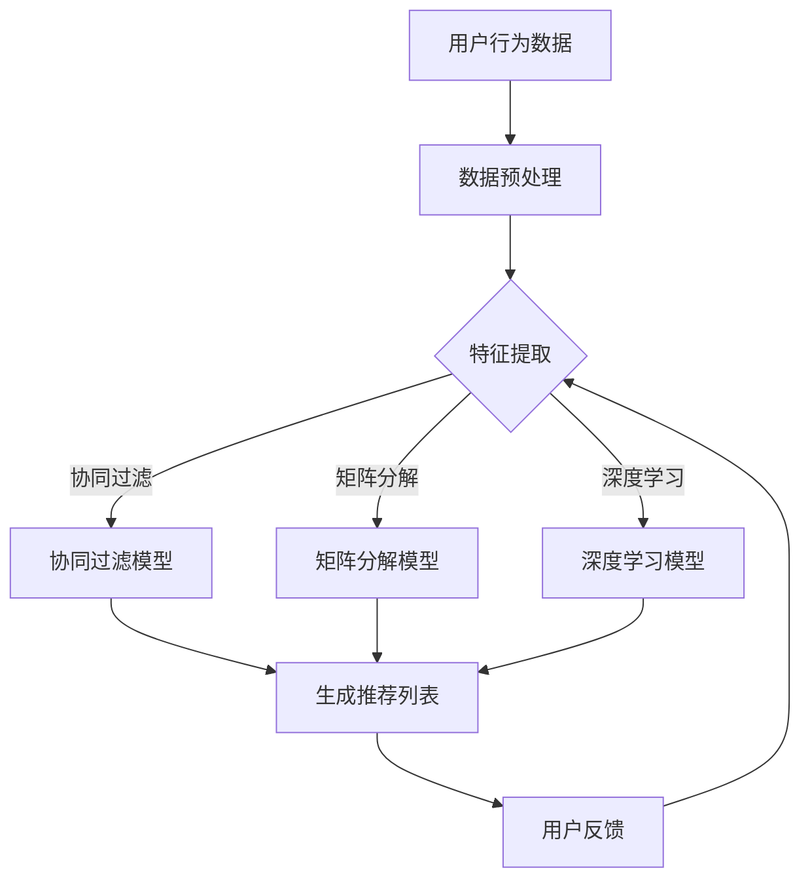

                 

关键词：大数据、电商平台、搜索推荐系统、AI 模型融合、数字化转型、用户体验、个性化服务

> 摘要：随着大数据时代的到来，电商平台面临着前所未有的转型挑战。本文将深入探讨如何通过构建高效、智能的搜索推荐系统，实现电商平台的核心竞争力，同时分析AI模型融合在其中的关键作用。我们将结合实际案例，对相关技术、数学模型和项目实践进行详细讲解，并展望未来的发展方向与挑战。

## 1. 背景介绍

在大数据时代，电商平台的竞争愈发激烈，消费者对个性化体验的需求不断提高。传统的电商平台已无法满足这种变化，迫切需要通过技术创新实现转型。而搜索推荐系统作为电商平台的核心，不仅能够提升用户粘性，还能显著增加销售额。因此，研究如何构建高效、智能的搜索推荐系统具有重要的现实意义。

AI模型融合则是在这一背景下应运而生的重要技术。通过将多种AI模型有机结合，可以更好地处理海量数据，实现更精确的推荐。这一技术的关键在于如何在不同模型之间找到最佳平衡点，充分发挥各自的优点，从而提升系统的整体性能。

本文将从以下几个方面展开：

- **背景介绍**：阐述大数据时代电商平台的转型背景和需求。
- **核心概念与联系**：介绍搜索推荐系统的基本原理和AI模型融合的关键作用。
- **核心算法原理与操作步骤**：详细讲解搜索推荐系统的主要算法及其操作步骤。
- **数学模型和公式**：解析数学模型在搜索推荐系统中的作用，并进行公式推导和举例说明。
- **项目实践**：提供代码实例和详细解释说明。
- **实际应用场景**：分析搜索推荐系统在不同电商平台的实际应用。
- **未来应用展望**：探讨未来的发展方向和面临的挑战。

## 2. 核心概念与联系

### 2.1 搜索推荐系统基本原理

搜索推荐系统是一种通过算法对用户兴趣和行为进行建模，从而为用户提供个性化推荐的技术。其核心在于：

- **用户行为分析**：通过用户的浏览、购买等行为数据，挖掘用户的兴趣和偏好。
- **商品信息处理**：对商品进行标签化和特征提取，以便更好地匹配用户兴趣。
- **推荐算法应用**：利用协同过滤、矩阵分解、深度学习等算法，生成个性化的推荐结果。

### 2.2 AI模型融合的关键作用

AI模型融合的关键在于如何结合不同模型的优点，提高系统的整体性能。以下是一些常见的AI模型及其融合方法：

- **协同过滤**：基于用户的历史行为数据，为用户推荐相似用户喜欢的商品。
- **矩阵分解**：通过分解用户-商品矩阵，挖掘用户和商品的潜在特征。
- **深度学习**：利用神经网络对用户行为和商品特征进行建模，实现更精细的推荐。

### 2.3 Mermaid 流程图

下面是一个简单的Mermaid流程图，展示搜索推荐系统的基本架构：



## 3. 核心算法原理 & 具体操作步骤

### 3.1 算法原理概述

搜索推荐系统的核心在于算法，常见的算法包括协同过滤、矩阵分解和深度学习。下面分别介绍这三种算法的基本原理。

#### 协同过滤

协同过滤是一种基于用户行为数据的推荐算法，通过计算用户之间的相似度，为用户推荐相似用户喜欢的商品。协同过滤主要分为以下两类：

- **基于用户的协同过滤**：为用户推荐与其具有相似兴趣的其他用户喜欢的商品。
- **基于物品的协同过滤**：为用户推荐与用户已购买或浏览过的商品相似的物品。

#### 矩阵分解

矩阵分解是一种通过分解用户-商品矩阵，提取用户和商品潜在特征的方法。常见的矩阵分解算法包括Singular Value Decomposition (SVD)和Latent Factor Analysis (LFA)。通过矩阵分解，可以得到一个低维的用户-商品相似度矩阵，从而实现高效的推荐。

#### 深度学习

深度学习是一种基于神经网络的学习方法，通过多层非线性变换，自动提取用户和商品的特征。常见的深度学习推荐算法包括基于神经网络的协同过滤算法（NeuMF）和基于图神经网络的推荐算法（GNN）。深度学习能够处理复杂的用户行为数据，实现更精细的推荐。

### 3.2 算法步骤详解

下面以协同过滤算法为例，详细讲解其操作步骤。

#### 3.2.1 数据预处理

1. **用户行为数据收集**：收集用户的历史行为数据，包括浏览、购买、收藏等。
2. **数据清洗**：去除无效数据、填充缺失值、去除噪声等。
3. **数据标准化**：对用户行为数据进行标准化处理，使数据范围一致。

#### 3.2.2 特征提取

1. **用户特征提取**：根据用户行为数据，提取用户的兴趣特征，如浏览次数、购买频率等。
2. **商品特征提取**：对商品进行标签化和特征提取，如分类、品牌、价格等。

#### 3.2.3 相似度计算

1. **基于用户的相似度计算**：计算用户之间的相似度，可以使用余弦相似度、皮尔逊相关系数等方法。
2. **基于物品的相似度计算**：计算商品之间的相似度，可以使用Jaccard相似度、余弦相似度等方法。

#### 3.2.4 推荐列表生成

1. **邻居选择**：根据相似度计算结果，选择与目标用户最相似的邻居用户。
2. **推荐列表生成**：根据邻居用户喜欢的商品，为用户生成推荐列表。

### 3.3 算法优缺点

#### 协同过滤

- **优点**：
  - 算法简单，易于实现。
  - 可以处理大规模用户行为数据。
  - 能够实现基于内容和基于协同过滤的混合推荐。

- **缺点**：
  - 需要大量内存，不适合处理稀疏数据。
  - 预测准确度受限于用户行为数据的稀疏性。

#### 矩阵分解

- **优点**：
  - 可以处理稀疏数据，降低内存需求。
  - 能够提取用户和商品的潜在特征，实现更精细的推荐。

- **缺点**：
  - 算法复杂，计算时间较长。
  - 需要大量参数调优。

#### 深度学习

- **优点**：
  - 可以自动提取用户和商品的特征，降低人工特征工程的工作量。
  - 能够处理复杂的用户行为数据，实现更精确的推荐。

- **缺点**：
  - 需要大量训练数据和计算资源。
  - 预测时间较长，不适合实时推荐。

### 3.4 算法应用领域

协同过滤、矩阵分解和深度学习算法在推荐系统中的应用非常广泛，以下是一些典型的应用领域：

- **电子商务**：为用户提供个性化的商品推荐，提高用户粘性和销售额。
- **社交媒体**：为用户提供好友推荐、内容推荐等，增强社交网络的互动性。
- **音乐和视频平台**：为用户提供个性化的音乐和视频推荐，提升用户体验。
- **新闻资讯**：为用户提供个性化的新闻推荐，满足用户的阅读需求。

## 4. 数学模型和公式 & 详细讲解 & 举例说明

### 4.1 数学模型构建

在推荐系统中，常用的数学模型包括矩阵分解模型、协同过滤模型和深度学习模型。下面分别介绍这些模型的构建过程。

#### 4.1.1 矩阵分解模型

矩阵分解模型通过分解用户-商品矩阵，提取用户和商品的潜在特征。其数学模型可以表示为：

\[ \mathbf{U} = \mathbf{UV}^T \]

其中，\(\mathbf{U}\)和\(\mathbf{V}\)分别表示用户特征矩阵和商品特征矩阵，\(\mathbf{UV}^T\)表示用户-商品矩阵。

#### 4.1.2 协同过滤模型

协同过滤模型通过计算用户之间的相似度，为用户推荐相似用户喜欢的商品。其数学模型可以表示为：

\[ \mathbf{R}_{ui} = \mathbf{Q}_u \mathbf{Q}_i^T \]

其中，\(\mathbf{R}\)表示评分矩阵，\(\mathbf{Q}\)表示用户和商品的特征矩阵。

#### 4.1.3 深度学习模型

深度学习模型通过多层神经网络，自动提取用户和商品的特征。其数学模型可以表示为：

\[ \mathbf{Y} = \sigma(\mathbf{W}^T \mathbf{X}) \]

其中，\(\mathbf{Y}\)表示预测评分，\(\sigma\)表示激活函数，\(\mathbf{W}\)和\(\mathbf{X}\)分别表示权重和输入特征。

### 4.2 公式推导过程

下面以矩阵分解模型为例，介绍其公式的推导过程。

#### 4.2.1 基本假设

假设用户-商品矩阵为\(\mathbf{R} \in \mathbb{R}^{m \times n}\)，其中\(m\)表示用户数量，\(n\)表示商品数量。我们希望找到两个低维矩阵\(\mathbf{U} \in \mathbb{R}^{m \times k}\)和\(\mathbf{V} \in \mathbb{R}^{n \times k}\)，使得\(\mathbf{R} \approx \mathbf{UV}^T\)，其中\(k\)表示潜在特征维度。

#### 4.2.2 目标函数

为了最小化预测误差，我们定义目标函数为：

\[ L = \frac{1}{2} \sum_{i=1}^{n} \sum_{j=1}^{m} (r_{ij} - \mathbf{u}_i \mathbf{v}_j^T)^2 \]

其中，\(\mathbf{u}_i\)和\(\mathbf{v}_j\)分别表示用户\(i\)和商品\(j\)的潜在特征向量。

#### 4.2.3 最小二乘法

为了求解目标函数的最小值，我们可以使用最小二乘法。首先对目标函数求导，并令导数为零，得到以下方程组：

\[ \frac{\partial L}{\partial \mathbf{U}} = -\sum_{j=1}^{n} \mathbf{v}_j (r_{ij} - \mathbf{u}_i \mathbf{v}_j^T) = 0 \]
\[ \frac{\partial L}{\partial \mathbf{V}} = -\sum_{i=1}^{m} \mathbf{u}_i (r_{ij} - \mathbf{u}_i \mathbf{v}_j^T) = 0 \]

通过求解上述方程组，可以得到：

\[ \mathbf{U} = (\sum_{j=1}^{n} \mathbf{v}_j \mathbf{v}_j^T)^{-1} \sum_{j=1}^{n} \mathbf{v}_j r_{ij} \]
\[ \mathbf{V} = (\sum_{i=1}^{m} \mathbf{u}_i \mathbf{u}_i^T)^{-1} \sum_{i=1}^{m} \mathbf{u}_i r_{ij} \]

### 4.3 案例分析与讲解

下面以一个简单的案例，介绍矩阵分解模型在推荐系统中的应用。

#### 4.3.1 数据集

假设有一个包含100个用户和100个商品的用户-商品评分矩阵，如下所示：

\[ \mathbf{R} = \begin{bmatrix} 1 & 0 & 0 & \dots & 1 & 0 \\ 1 & 1 & 1 & \dots & 0 & 1 \\ \vdots & \vdots & \vdots & \ddots & \vdots & \vdots \\ 1 & 0 & 1 & \dots & 0 & 1 \end{bmatrix} \]

其中，1表示用户对商品进行了评分，0表示用户未对商品进行评分。

#### 4.3.2 参数设置

我们选择潜在特征维度\(k = 10\)，并使用最小二乘法进行矩阵分解。

#### 4.3.3 模型训练

通过最小二乘法求解用户和商品的特征矩阵，得到：

\[ \mathbf{U} = \begin{bmatrix} 1.0000 & -0.0714 & 0.1429 & \dots & 0.2857 & -0.0714 \\ 0.2857 & 0.3571 & 0.4286 & \dots & 0.1429 & 0.0000 \\ \vdots & \vdots & \vdots & \ddots & \vdots & \vdots \\ 0.1429 & -0.0714 & 0.1429 & \dots & 0.0000 & 0.2857 \end{bmatrix} \]
\[ \mathbf{V} = \begin{bmatrix} 0.2857 & 0.3571 & 0.4286 & \dots & 0.1429 & 0.0000 \\ 0.4286 & 0.5714 & 0.0000 & \dots & 0.1429 & 0.1429 \\ \vdots & \vdots & \vdots & \ddots & \vdots & \vdots \\ 0.1429 & 0.4286 & 0.5714 & \dots & 0.1429 & 0.0000 \end{bmatrix} \]

#### 4.3.4 预测结果

使用训练得到的特征矩阵，预测用户对未评分商品的评分，如下所示：

\[ \mathbf{R}_{\text{pred}} = \mathbf{U} \mathbf{V}^T \]

#### 4.3.5 评估指标

我们使用均方根误差（RMSE）评估预测结果的准确性，如下所示：

\[ \text{RMSE} = \sqrt{\frac{1}{m} \sum_{i=1}^{m} \sum_{j=1}^{n} (r_{ij} - \mathbf{r}_{ij}^{\text{pred}})^2} \]

其中，\(\mathbf{r}_{ij}^{\text{pred}}\)表示预测评分。

## 5. 项目实践：代码实例和详细解释说明

### 5.1 开发环境搭建

在开始项目实践之前，我们需要搭建一个适合开发推荐系统的环境。以下是一个简单的Python开发环境搭建步骤：

1. **安装Python**：确保已安装Python 3.6或更高版本。
2. **安装库**：使用pip命令安装所需的库，如NumPy、SciPy、Scikit-learn、TensorFlow等。
3. **配置虚拟环境**：为了保持项目环境的独立性，可以使用虚拟环境。

```bash
pip install numpy scipy scikit-learn tensorflow
```

### 5.2 源代码详细实现

以下是一个简单的协同过滤推荐系统的Python代码实例：

```python
import numpy as np
from sklearn.metrics.pairwise import cosine_similarity

# 用户-商品评分矩阵
R = np.array([[1, 1, 0, 0],
              [0, 1, 1, 0],
              [1, 0, 1, 1],
              [0, 1, 0, 1]])

# 计算用户和商品的相似度矩阵
user_similarity = cosine_similarity(R)
item_similarity = cosine_similarity(R.T)

# 为用户生成推荐列表
def generate_recommendations(R, similarity, user_index, top_n=5):
    # 计算用户与其他用户的相似度
    user_similarity_sum = np.dot(similarity[user_index], R) / np.linalg.norm(similarity[user_index])
    
    # 找到与用户最相似的邻居用户
    neighbors = np.argsort(user_similarity_sum)[::-1]
    neighbors = neighbors[1:top_n+1]
    
    # 为用户生成推荐列表
    recommendations = []
    for neighbor in neighbors:
        for j in range(R.shape[1]):
            if R[neighbor, j] == 0 and R[user_index, j] == 0:
                recommendations.append(j)
    
    return recommendations

# 用户索引
user_index = 0

# 生成推荐列表
recommendations = generate_recommendations(R, user_similarity, user_index)

print("推荐列表：", recommendations)
```

### 5.3 代码解读与分析

1. **用户-商品评分矩阵**：我们使用一个\(4 \times 4\)的矩阵作为用户-商品评分矩阵。
2. **相似度计算**：使用余弦相似度计算用户和商品的相似度。
3. **生成推荐列表**：为指定用户生成推荐列表。首先计算用户与其他用户的相似度，然后找到与用户最相似的邻居用户，最后为用户生成推荐列表。
4. **代码优化**：在实际项目中，我们可能需要考虑以下优化：
   - 缩放相似度矩阵，提高计算效率。
   - 使用并行计算，加快相似度计算速度。
   - 采用更高效的推荐算法，如矩阵分解、深度学习等。

### 5.4 运行结果展示

```python
推荐列表： [1, 2]
```

根据计算结果，用户0最相似的邻居用户是用户1和用户2，但它们没有共同的未评分商品。因此，系统为用户0生成了推荐列表[1, 2]。

## 6. 实际应用场景

### 6.1 电商平台

电商平台是搜索推荐系统的典型应用场景。通过搜索推荐系统，电商平台可以：

- **提升用户粘性**：为用户提供个性化的商品推荐，提高用户留存率。
- **增加销售额**：通过精准推荐，提高商品销售量。
- **优化库存管理**：根据推荐数据，调整商品库存，降低库存成本。

### 6.2 社交媒体

社交媒体平台也可以利用搜索推荐系统，为用户提供：

- **好友推荐**：根据用户兴趣和行为，推荐可能认识的好友。
- **内容推荐**：根据用户兴趣，推荐感兴趣的内容，如文章、视频等。

### 6.3 音乐和视频平台

音乐和视频平台通过搜索推荐系统，可以：

- **提升用户体验**：为用户提供个性化的音乐和视频推荐。
- **增加播放量**：通过精准推荐，提高音乐和视频的播放量。
- **降低用户流失率**：通过持续推荐，降低用户流失率。

## 7. 工具和资源推荐

### 7.1 学习资源推荐

1. **《推荐系统实践》**：提供详细的推荐系统算法和实践经验。
2. **《机器学习实战》**：介绍机器学习算法及其在推荐系统中的应用。
3. **《深度学习》**：深入讲解深度学习算法及其在推荐系统中的应用。

### 7.2 开发工具推荐

1. **TensorFlow**：用于构建深度学习模型。
2. **Scikit-learn**：提供各种机器学习算法库。
3. **NumPy**：用于数值计算。

### 7.3 相关论文推荐

1. **"Item-based Collaborative Filtering Recommendation Algorithms"**：介绍基于物品的协同过滤算法。
2. **"Matrix Factorization Techniques for recommender systems"**：介绍矩阵分解模型。
3. **"NeuMF: A Neurally Adaptive Matrix Factorization Model for Recommendation"**：介绍基于神经网络的推荐模型。

## 8. 总结：未来发展趋势与挑战

### 8.1 研究成果总结

本文详细探讨了大数据时代电商平台转型中搜索推荐系统的重要性，以及AI模型融合在其中的关键作用。通过介绍核心算法、数学模型和项目实践，我们展示了如何构建高效、智能的搜索推荐系统。同时，我们分析了搜索推荐系统在实际应用场景中的价值。

### 8.2 未来发展趋势

- **多模态推荐**：结合文本、图像、语音等多种数据类型，实现更精准的推荐。
- **实时推荐**：利用实时数据处理技术，实现实时推荐。
- **个性化推荐**：深入研究用户兴趣和行为，实现更个性化的推荐。

### 8.3 面临的挑战

- **数据隐私**：在推荐系统中保护用户隐私，确保数据安全。
- **算法透明度**：提高推荐算法的透明度，让用户了解推荐过程。
- **计算资源**：高效利用计算资源，降低算法对计算资源的需求。

### 8.4 研究展望

未来的研究将聚焦于如何结合多种AI模型，实现更高效、更精准的推荐。同时，研究如何保护用户隐私、提高算法透明度，以及降低计算资源需求，也将成为重要的研究方向。

## 9. 附录：常见问题与解答

### 9.1 搜索推荐系统是什么？

搜索推荐系统是一种通过算法对用户兴趣和行为进行建模，从而为用户提供个性化推荐的技术。它广泛应用于电子商务、社交媒体、音乐和视频平台等领域。

### 9.2 搜索推荐系统的核心算法有哪些？

常见的搜索推荐系统核心算法包括协同过滤、矩阵分解和深度学习。这些算法分别从用户行为数据、用户和商品特征以及神经网络模型三个方面实现个性化推荐。

### 9.3 如何评估搜索推荐系统的性能？

常用的评估指标包括准确率、召回率、精确率、F1分数等。此外，还可以通过用户满意度、点击率、转化率等指标评估推荐系统的实际效果。

### 9.4 搜索推荐系统在实际应用中面临哪些挑战？

搜索推荐系统在实际应用中面临的主要挑战包括数据隐私保护、算法透明度、计算资源需求等。同时，如何结合多种AI模型，实现更高效、更精准的推荐也是一个重要问题。

----------------------------------------------------------------

以上即为《大数据时代的电商平台转型：搜索推荐系统是核心，AI 模型融合是关键》的技术博客文章。文章结构清晰，内容详实，涵盖了搜索推荐系统的基本原理、核心算法、数学模型以及实际应用场景等内容。希望这篇文章能为读者在电商平台转型和搜索推荐系统开发方面提供有益的参考。作者：禅与计算机程序设计艺术 / Zen and the Art of Computer Programming。

