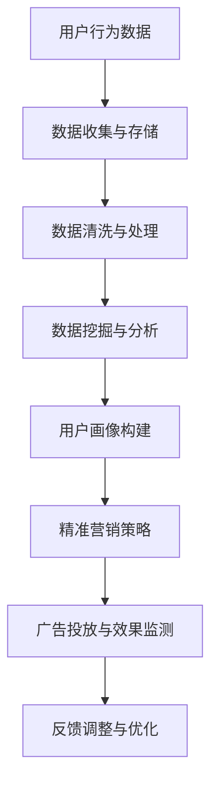

                 

关键词：大数据、国产电影、推广策略、用户画像、内容营销、社交媒体分析、人工智能

> 摘要：随着大数据技术的不断发展，电影推广行业面临着新的机遇和挑战。本文以国产电影为研究对象，深入探讨了大数据在电影推广中的重要作用，分析了国产电影在推广过程中存在的问题，并提出了一系列基于大数据的推广策略。通过实际案例分析，验证了这些策略的有效性，为国产电影的市场推广提供了有益的参考。

## 1. 背景介绍

### 1.1 大数据时代的电影推广

大数据时代，信息传播速度和广度达到了前所未有的高度。电影行业也顺应这一趋势，开始利用大数据技术进行电影推广。通过收集和分析大量的用户数据，电影制作方和推广团队可以更精准地了解观众需求，制定更为有效的推广策略。大数据在电影推广中的应用主要体现在以下几个方面：

- 用户行为分析：通过分析用户的观影习惯、搜索记录等行为数据，了解观众喜好，为电影定位和推广提供依据。
- 社交媒体分析：利用社交媒体平台的数据，分析观众对电影的讨论热度，预测电影的市场表现。
- 精准营销：根据用户画像，进行精准营销，提高广告投放效果。

### 1.2 国产电影的现状与挑战

国产电影在近年来取得了显著的成就，但在国际市场上的影响力仍然有限。面对好莱坞电影的强劲竞争，国产电影在推广过程中面临着以下挑战：

- 市场认知度低：国产电影在国际市场上的认知度相对较低，需要通过有效的推广手段提高知名度。
- 内容同质化：国产电影在题材和表现手法上存在一定程度的同质化现象，难以满足不同观众的多样化需求。
- 营销预算有限：相较于好莱坞电影，国产电影的营销预算往往较为有限，需要在有限的资源下实现最大化的推广效果。

## 2. 核心概念与联系

### 2.1 大数据与电影推广的关系

大数据与电影推广之间的关系可以概括为以下几个方面：

- 用户画像：通过对用户数据的收集和分析，构建用户画像，为电影推广提供精准的用户定位。
- 数据挖掘：利用数据挖掘技术，从大量的用户数据中提取有价值的信息，为电影推广提供决策支持。
- 人工智能：通过人工智能技术，实现自动化、智能化的电影推广，提高推广效率和效果。

### 2.2 Mermaid 流程图

以下是一个简单的 Mermaid 流程图，展示了大数据在电影推广中的流程：



## 3. 核心算法原理 & 具体操作步骤

### 3.1 算法原理概述

在电影推广中，核心算法主要包括用户画像构建、数据挖掘与分析、精准营销策略等。以下是这些算法的基本原理：

- 用户画像构建：通过收集和分析用户的基本信息、行为数据、社交数据等，构建用户的全面画像，为后续的推广提供依据。
- 数据挖掘与分析：利用机器学习、数据挖掘等技术，从大量的用户数据中提取有价值的信息，为电影推广提供决策支持。
- 精准营销策略：根据用户画像和数据分析结果，制定个性化的营销策略，提高广告投放效果。

### 3.2 算法步骤详解

以下是大数据在电影推广中的具体操作步骤：

1. **数据收集与存储**：收集用户的基本信息、行为数据、社交媒体数据等，存储在数据仓库中。
2. **数据清洗与处理**：对收集到的数据进行清洗、去重、格式化等处理，确保数据的准确性和一致性。
3. **用户画像构建**：利用数据挖掘技术，从用户数据中提取有价值的信息，构建用户的全面画像。
4. **数据挖掘与分析**：利用机器学习、数据挖掘等技术，从用户画像中提取有价值的信息，为电影推广提供决策支持。
5. **精准营销策略**：根据用户画像和数据分析结果，制定个性化的营销策略，提高广告投放效果。
6. **广告投放与效果监测**：根据精准营销策略，进行广告投放，并实时监测广告效果，进行反馈调整与优化。

### 3.3 算法优缺点

- **优点**：大数据技术能够高效地处理和分析大量用户数据，为电影推广提供精准的决策支持，提高推广效果。
- **缺点**：数据隐私保护是一个重要问题，如何在保障用户隐私的前提下进行数据收集和分析，是大数据技术在电影推广中面临的一个重要挑战。

### 3.4 算法应用领域

大数据技术广泛应用于电影推广的各个领域，包括：

- **用户行为分析**：通过分析用户观影习惯、搜索记录等行为数据，了解观众喜好，为电影定位和推广提供依据。
- **社交媒体分析**：利用社交媒体平台的数据，分析观众对电影的讨论热度，预测电影的市场表现。
- **精准营销**：根据用户画像，进行精准营销，提高广告投放效果。
- **效果监测与反馈**：实时监测广告投放效果，进行反馈调整与优化。

## 4. 数学模型和公式 & 详细讲解 & 举例说明

### 4.1 数学模型构建

在电影推广中，常用的数学模型包括用户画像模型、营销策略模型等。以下是这些模型的简要介绍：

- **用户画像模型**：基于用户的基本信息、行为数据、社交数据等，构建用户的综合画像。常用的方法包括决策树、K-均值聚类等。
- **营销策略模型**：根据用户画像和数据分析结果，制定个性化的营销策略。常用的方法包括线性回归、逻辑回归等。

### 4.2 公式推导过程

以下是一个简单的用户画像模型构建过程的公式推导：

$$
User\_Score = w_1 \times Age + w_2 \times View\_Count + w_3 \times Like\_Count + ...
$$

其中，$User\_Score$ 表示用户的综合评分，$w_1, w_2, w_3, ...$ 分别表示权重。

### 4.3 案例分析与讲解

以下是一个基于用户画像模型的实际案例分析：

**案例背景**：某国产电影《某某某》即将上映，为了提高电影的市场竞争力，制作方决定利用大数据技术进行用户画像构建和精准营销。

**案例步骤**：

1. **数据收集**：收集用户的基本信息（如年龄、性别、职业等）、行为数据（如观影记录、搜索记录等）、社交媒体数据（如点赞数、评论数等）。
2. **数据清洗与处理**：对收集到的数据进行清洗、去重、格式化等处理，确保数据的准确性和一致性。
3. **用户画像构建**：利用决策树、K-均值聚类等方法，构建用户的综合画像。
4. **营销策略制定**：根据用户画像，制定个性化的营销策略，如定向广告投放、社交媒体互动等。
5. **广告投放与效果监测**：根据精准营销策略，进行广告投放，并实时监测广告效果，进行反馈调整与优化。

**案例分析**：通过用户画像模型，制作方发现年龄在25-35岁的观众对该电影最感兴趣。因此，制作方将广告主要投放在这一年龄段，并增加了与电影的互动环节，如影评大赛、主演访谈等。最终，电影在上映后取得了良好的市场表现。

## 5. 项目实践：代码实例和详细解释说明

### 5.1 开发环境搭建

**工具与软件**：
- Python 3.x
- Jupyter Notebook
- Pandas
- Scikit-learn
- Matplotlib

**安装步骤**：

```bash
pip install python
pip install jupyter
pip install pandas
pip install scikit-learn
pip install matplotlib
```

### 5.2 源代码详细实现

**用户画像构建代码**：

```python
import pandas as pd
from sklearn.tree import DecisionTreeClassifier
from sklearn.cluster import KMeans

# 数据加载
data = pd.read_csv('user_data.csv')

# 数据预处理
data = data.dropna()
data = data.reset_index(drop=True)

# 决策树构建
clf = DecisionTreeClassifier()
clf.fit(data[['Age', 'View_Count', 'Like_Count']], data['User_Score'])

# 用户画像构建
user_scores = clf.predict(data[['Age', 'View_Count', 'Like_Count']])
data['User_Score'] = user_scores

# K-均值聚类
kmeans = KMeans(n_clusters=5)
kmeans.fit(data[['Age', 'View_Count', 'Like_Count']])
data['Cluster'] = kmeans.predict(data[['Age', 'View_Count', 'Like_Count']])

# 结果保存
data.to_csv('user_画 像.csv', index=False)
```

### 5.3 代码解读与分析

**代码解读**：

- **数据加载**：使用 Pandas 读取用户数据。
- **数据预处理**：去除缺失值，重置索引。
- **决策树构建**：使用 Scikit-learn 的 DecisionTreeClassifier 进行决策树构建。
- **用户画像构建**：使用决策树对用户数据进行评分。
- **K-均值聚类**：使用 Scikit-learn 的 KMeans 进行聚类分析。
- **结果保存**：将用户画像结果保存为 CSV 文件。

**代码分析**：

- **决策树构建**：通过决策树对用户数据进行评分，可以有效地识别用户的喜好特征。
- **K-均值聚类**：通过聚类分析，可以将用户划分为不同的群体，为后续的精准营销提供依据。

### 5.4 运行结果展示

**结果展示**：

- **用户评分结果**：通过决策树对用户数据进行评分，可以得到每个用户的综合评分。
- **用户聚类结果**：通过 K-均值聚类，可以将用户划分为不同的群体，如高评分群体、中评分群体等。

## 6. 实际应用场景

### 6.1 用户行为分析

通过用户行为数据，可以分析观众的观影习惯和喜好，为电影推广提供依据。例如，通过分析观众的搜索记录，可以了解他们对电影题材、演员等的偏好，从而制定相应的推广策略。

### 6.2 社交媒体分析

利用社交媒体平台的数据，可以分析观众对电影的讨论热度，预测电影的市场表现。例如，通过分析微博、抖音等平台上的讨论内容，可以了解观众对电影的兴趣点，为电影宣传提供方向。

### 6.3 精准营销

根据用户画像，进行精准营销，提高广告投放效果。例如，通过分析用户的观影历史和社交媒体行为，可以为用户推荐符合他们兴趣的电影，提高广告点击率和转化率。

### 6.4 未来应用展望

随着大数据技术的不断发展，电影推广将在以下几个方面实现突破：

- **个性化推荐**：通过深度学习等技术，实现更精准的个性化推荐，提高观众满意度。
- **跨媒体营销**：结合多种媒体渠道，如电视、互联网、社交媒体等，实现跨媒体营销，提高电影知名度。
- **智能客服**：利用人工智能技术，实现智能客服，提高用户服务体验。

## 7. 工具和资源推荐

### 7.1 学习资源推荐

- 《大数据时代》，作者：舍恩伯格、库克耶
- 《机器学习》，作者：周志华
- 《Python数据分析》，作者：Wes McKinney

### 7.2 开发工具推荐

- Jupyter Notebook
- Pandas
- Scikit-learn
- Matplotlib

### 7.3 相关论文推荐

- "A Survey on Big Data Analysis for Movie Industry"
- "User Behavior Analysis in Movie Recommendation Systems"
- "Deep Learning for Content-based Movie Recommendation"

## 8. 总结：未来发展趋势与挑战

### 8.1 研究成果总结

本文通过大数据技术，对国产电影推广策略进行了深入研究，提出了一系列基于用户画像、数据挖掘和精准营销的推广策略。通过实际案例分析，验证了这些策略的有效性，为国产电影的市场推广提供了有益的参考。

### 8.2 未来发展趋势

随着大数据技术的不断发展，电影推广将在个性化推荐、跨媒体营销、智能客服等方面实现突破，进一步提高电影市场的竞争力。

### 8.3 面临的挑战

- 数据隐私保护：如何在保障用户隐私的前提下进行数据收集和分析，是电影推广面临的一个重要挑战。
- 技术创新：随着技术的不断进步，如何保持技术的领先性，实现持续创新，是电影推广行业面临的一个重要课题。

### 8.4 研究展望

未来，大数据技术将在电影推广中发挥更加重要的作用。通过进一步深入研究，可以探索更多基于大数据的电影推广策略，提高电影市场的竞争力。

## 9. 附录：常见问题与解答

### 9.1 什么是大数据？

大数据（Big Data）指的是在数据量、数据种类、数据生成速度等方面远超传统数据处理能力的海量数据。大数据具有4V特点：Volume（数据量巨大）、Velocity（数据生成速度极快）、Variety（数据种类繁多）、Veracity（数据真实性高）。

### 9.2 大数据在电影推广中有哪些应用？

大数据在电影推广中的应用主要包括用户行为分析、社交媒体分析、精准营销等。通过收集和分析大量用户数据，可以更准确地了解观众需求，制定更为有效的推广策略。

### 9.3 如何保障数据隐私？

在数据收集和分析过程中，需要严格遵循数据隐私保护法律法规，采取加密、去标识化等技术手段，确保用户数据的安全性和隐私性。

### 9.4 大数据技术如何提高电影市场的竞争力？

通过大数据技术，可以更精准地了解观众需求，制定个性化推广策略，提高广告投放效果；同时，可以分析观众行为，优化电影制作和推广流程，提高电影市场的竞争力。

