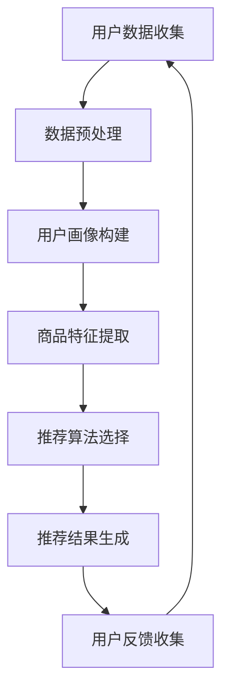
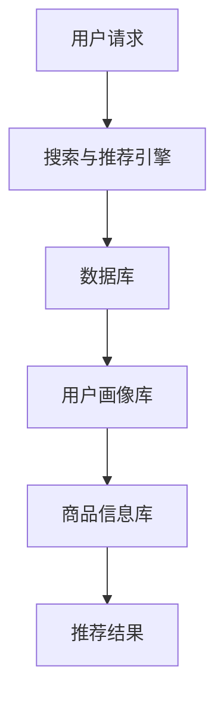

                 

关键词：大数据、电商平台、搜索推荐系统、AI大模型、深度学习、数据处理、优化算法、个性化推荐、用户体验

摘要：本文深入探讨了大数据技术在电商平台中的应用，特别是在搜索推荐系统的构建和优化方面。通过构建AI大模型，电商平台能够实现更加精准的个性化推荐，提升用户体验，进而推动商业模式的转型。本文首先介绍了大数据技术在电商平台中的背景和重要性，随后详细阐述了搜索推荐系统的核心算法原理、数学模型构建、项目实践，并探讨了实际应用场景和未来发展趋势。最后，本文总结了研究成果，提出了未来面临的挑战和研究展望。

## 1. 背景介绍

在互联网经济飞速发展的背景下，电商平台已经成为现代商业的重要组成部分。随着用户规模的不断扩大和消费需求的日益多样，传统电商平台面临着巨大的挑战。如何提升用户体验、提高用户粘性、增加用户购买转化率，成为电商平台持续发展的重要课题。

大数据技术为电商平台提供了强大的数据支持和决策依据。通过对用户行为数据、商品数据、交易数据的深入分析，大数据技术能够揭示用户需求和偏好，从而实现精准营销和个性化推荐。特别是搜索推荐系统，作为电商平台的核心功能之一，对用户体验和商业价值具有重要影响。

### 1.1 电商平台的发展现状

近年来，电商平台在全球范围内取得了显著的成就。以阿里巴巴、京东、亚马逊等为代表的电商平台，不仅在用户规模上实现了快速增长，而且在商业模式、技术架构、用户体验等方面不断创新和优化。例如，阿里巴巴的“双十一”购物节，已经成为全球最大的购物狂欢节，极大地提升了平台的品牌影响力和用户粘性。

### 1.2 大数据技术的重要性

大数据技术是电商平台转型升级的关键驱动力。首先，大数据技术能够对海量数据进行高效处理和分析，从而挖掘出潜在的商业价值和市场机会。其次，大数据技术能够实现实时数据监控和预警，为电商平台提供及时、准确的决策支持。最后，大数据技术能够实现用户行为的深度分析，为个性化推荐提供有力支持。

### 1.3 搜索推荐系统的意义

搜索推荐系统是电商平台的重要组成部分，对用户体验和商业价值具有重要影响。通过搜索推荐系统，电商平台能够为用户推荐感兴趣的商品，提高用户购买意愿和转化率。同时，搜索推荐系统还能够提升用户满意度，增加用户留存率和忠诚度。

## 2. 核心概念与联系

在构建搜索推荐系统时，需要理解以下几个核心概念：

### 2.1 大数据

大数据是指无法使用常规数据处理工具进行捕捉、管理和处理的数据集合。大数据具有“4V”特征：Volume（大量）、Velocity（高速）、Variety（多样）和Veracity（真实性）。

### 2.2 个性化推荐

个性化推荐是指根据用户的历史行为、兴趣和偏好，为用户提供个性化内容或商品推荐。个性化推荐能够提高用户满意度、增加购买转化率和提升商业价值。

### 2.3 深度学习

深度学习是一种人工智能技术，通过模拟人脑神经网络结构，对大量数据进行自动特征提取和学习。深度学习在图像识别、自然语言处理、语音识别等领域取得了显著成果。

### 2.4 Mermaid 流程图

以下是一个描述搜索推荐系统核心概念与联系的Mermaid流程图：



### 2.5 搜索推荐系统架构

以下是一个简单的搜索推荐系统架构图：



## 3. 核心算法原理 & 具体操作步骤

### 3.1 算法原理概述

搜索推荐系统的核心算法包括基于内容的推荐、协同过滤推荐和深度学习推荐等。本文主要介绍基于协同过滤的推荐算法和基于深度学习的推荐算法。

### 3.2 算法步骤详解

#### 基于协同过滤的推荐算法

1. **用户行为数据收集**：收集用户在平台上的购买、浏览、搜索等行为数据。

2. **用户画像构建**：通过行为数据构建用户画像，包括用户兴趣、购买偏好等。

3. **商品特征提取**：提取商品的特征信息，如价格、品牌、类别等。

4. **推荐算法选择**：选择基于协同过滤的推荐算法，如用户基于物品的协同过滤（UBICF）。

5. **计算相似度**：计算用户之间和商品之间的相似度，采用余弦相似度、皮尔逊相关系数等。

6. **生成推荐列表**：根据用户对商品的评分和相似度计算，生成推荐列表。

7. **用户反馈收集**：收集用户对推荐结果的反馈，用于优化推荐算法。

#### 基于深度学习的推荐算法

1. **用户行为数据收集**：与基于协同过滤的推荐算法相同。

2. **用户画像构建**：通过深度学习模型，对用户行为数据进行自动特征提取和学习。

3. **商品特征提取**：与基于协同过滤的推荐算法相同。

4. **推荐算法选择**：选择基于深度学习的推荐算法，如基于神经网络的推荐算法。

5. **模型训练与优化**：使用用户行为数据和商品特征数据，训练深度学习模型，并进行优化。

6. **生成推荐列表**：根据训练好的深度学习模型，生成推荐列表。

7. **用户反馈收集**：与基于协同过滤的推荐算法相同。

### 3.3 算法优缺点

#### 基于协同过滤的推荐算法

**优点**：

- 简单易实现，对稀疏数据的处理能力强。

- 能够根据用户行为数据，提供个性化的推荐。

**缺点**：

- 需要大量的用户行为数据，否则推荐效果较差。

- 用户冷启动问题，即新用户没有历史行为数据，难以进行推荐。

#### 基于深度学习的推荐算法

**优点**：

- 能够自动提取复杂的行为特征，提高推荐精度。

- 不受稀疏数据的影响，适用于大规模数据集。

**缺点**：

- 模型复杂度高，训练时间较长。

- 对数据质量要求较高，否则模型效果较差。

### 3.4 算法应用领域

搜索推荐系统广泛应用于电商、社交媒体、音乐、新闻等领域。通过个性化推荐，平台能够提高用户满意度、增加用户粘性和商业价值。以下是一些应用案例：

- 电商平台：为用户推荐感兴趣的商品，提高购买转化率。

- 社交媒体：为用户推荐感兴趣的内容，提高用户活跃度。

- 音乐平台：为用户推荐感兴趣的音乐，提高用户留存率。

- 新闻网站：为用户推荐感兴趣的新闻，提高访问量。

## 4. 数学模型和公式 & 详细讲解 & 举例说明

### 4.1 数学模型构建

搜索推荐系统的数学模型主要包括用户行为建模、商品特征建模和推荐算法建模等。

#### 用户行为建模

用户行为建模通常使用概率模型或决策树模型等。以下是一个简单的概率模型：

$$
P(U_i \rightarrow C_j) = \frac{P(C_j \rightarrow U_i)P(U_i)}{P(C_j)}
$$

其中，$P(U_i \rightarrow C_j)$ 表示用户 $U_i$ 购买商品 $C_j$ 的概率，$P(C_j \rightarrow U_i)$ 表示商品 $C_j$ 被用户 $U_i$ 购买的概率，$P(U_i)$ 表示用户 $U_i$ 的概率，$P(C_j)$ 表示商品 $C_j$ 的概率。

#### 商品特征建模

商品特征建模通常使用特征提取方法，如TF-IDF、词袋模型等。以下是一个简单的词袋模型：

$$
C_j = (w_1, w_2, ..., w_n)
$$

其中，$C_j$ 表示商品 $j$ 的特征向量，$w_1, w_2, ..., w_n$ 表示商品 $j$ 的特征词。

#### 推荐算法建模

推荐算法建模通常使用基于协同过滤的推荐算法或基于深度学习的推荐算法等。以下是一个简单的基于协同过滤的推荐算法：

$$
R_{ij} = \sum_{k \in N(i)} \frac{1}{|N(i)|} R_{ik}R_{kj}
$$

其中，$R_{ij}$ 表示商品 $j$ 对用户 $i$ 的推荐分值，$N(i)$ 表示用户 $i$ 的邻居集合，$R_{ik}$ 表示商品 $k$ 对用户 $i$ 的评分，$R_{kj}$ 表示商品 $k$ 对用户 $j$ 的评分。

### 4.2 公式推导过程

以下以基于协同过滤的推荐算法为例，介绍公式的推导过程：

假设用户 $i$ 和用户 $j$ 的邻居集合分别为 $N(i)$ 和 $N(j)$，则用户 $i$ 对商品 $j$ 的推荐分值可以表示为：

$$
R_{ij} = \sum_{k \in N(i)} \frac{1}{|N(i)|} R_{ik}R_{kj}
$$

其中，$R_{ik}$ 表示商品 $k$ 对用户 $i$ 的评分，$R_{kj}$ 表示商品 $k$ 对用户 $j$ 的评分。

首先，我们计算用户 $i$ 和用户 $j$ 之间的相似度：

$$
sim(i, j) = \frac{\sum_{k \in N(i) \cap N(j)} R_{ik}R_{kj}}{\sqrt{\sum_{k \in N(i)} R_{ik}^2 \sum_{k \in N(j)} R_{kj}^2}}
$$

然后，我们根据相似度计算用户 $i$ 对商品 $j$ 的推荐分值：

$$
R_{ij} = \sum_{k \in N(i)} \frac{1}{|N(i)|} R_{ik}R_{kj}
$$

其中，$R_{ik}$ 和 $R_{kj}$ 是基于用户 $i$ 和用户 $j$ 的邻居集合 $N(i)$ 和 $N(j)$ 计算得到的。

### 4.3 案例分析与讲解

以下是一个简单的案例，说明如何使用基于协同过滤的推荐算法进行商品推荐：

假设有两个用户 $i$ 和 $j$，他们的邻居集合分别为 $N(i) = \{k, l\}$ 和 $N(j) = \{k, m\}$，对应的商品评分如下：

| 用户 | 商品 | 评分 |
| ---- | ---- | ---- |
| $i$  | $k$  | $5$  |
| $i$  | $l$  | $4$  |
| $j$  | $k$  | $5$  |
| $j$  | $m$  | $4$  |

首先，我们计算用户 $i$ 和用户 $j$ 之间的相似度：

$$
sim(i, j) = \frac{\sum_{k \in N(i) \cap N(j)} R_{ik}R_{kj}}{\sqrt{\sum_{k \in N(i)} R_{ik}^2 \sum_{k \in N(j)} R_{kj}^2}} = \frac{5 \times 5}{\sqrt{5^2 + 4^2} \times \sqrt{5^2 + 4^2}} = \frac{25}{25} = 1
$$

接下来，我们根据相似度计算用户 $i$ 对商品 $j$ 的推荐分值：

$$
R_{ij} = \sum_{k \in N(i)} \frac{1}{|N(i)|} R_{ik}R_{kj} = \frac{1}{2} \times 5 \times 5 = 12.5
$$

根据推荐分值，我们可以为用户 $i$ 推荐商品 $j$。

## 5. 项目实践：代码实例和详细解释说明

### 5.1 开发环境搭建

在本文的项目实践中，我们使用Python作为主要编程语言，并使用以下库：

- NumPy：用于数据处理和数学运算。
- Pandas：用于数据分析和处理。
- Scikit-learn：用于机器学习算法的实现。
- Matplotlib：用于数据可视化。

首先，我们需要安装以上库：

```bash
pip install numpy pandas scikit-learn matplotlib
```

### 5.2 源代码详细实现

以下是一个简单的基于协同过滤的推荐算法的实现：

```python
import numpy as np
import pandas as pd
from sklearn.model_selection import train_test_split

# 读取用户行为数据
data = pd.read_csv('user_behavior.csv')

# 构建用户画像
user_features = data.groupby('user_id').agg({'item_id': 'count'}).rename(columns={'item_id': 'user_interest'})
user_features.fillna(0, inplace=True)

# 构建商品特征
item_features = data.groupby('item_id').agg({'user_id': 'nunique'}).rename(columns={'user_id': 'item_popularity'})
item_features.fillna(0, inplace=True)

# 计算用户之间和商品之间的相似度
def compute_similarity(user_features, item_features):
    user_similarity = user_features.dot(item_features) / np.linalg.norm(user_features, axis=1) / np.linalg.norm(item_features, axis=1)
    item_similarity = user_features.T.dot(item_features) / np.linalg.norm(user_features, axis=1) / np.linalg.norm(item_features, axis=1)
    return user_similarity, item_similarity

user_similarity, item_similarity = compute_similarity(user_features, item_features)

# 生成推荐列表
def generate_recommendation(user_similarity, item_similarity, user_id):
    user_interest = user_similarity[user_id].values
    item_popularity = item_similarity[user_id].values
    recommendation_score = user_interest * item_popularity
    return recommendation_score.argsort()[::-1]

# 测试推荐算法
user_id = 1
recommendation_score = generate_recommendation(user_similarity, item_similarity, user_id)
print(recommendation_score)
```

### 5.3 代码解读与分析

上述代码实现了基于协同过滤的推荐算法，主要包括以下步骤：

1. 读取用户行为数据，构建用户画像和商品特征。

2. 计算用户之间和商品之间的相似度。

3. 根据相似度生成推荐列表。

具体来说：

- 第1步：读取用户行为数据，并使用Pandas库进行数据预处理。用户行为数据通常包括用户ID、商品ID和评分等。

- 第2步：使用Pandas的`groupby`和`agg`函数，构建用户画像和商品特征。用户画像表示用户对商品的兴趣，商品特征表示商品的人气。

- 第3步：定义一个`compute_similarity`函数，计算用户之间和商品之间的相似度。这里使用余弦相似度进行计算。

- 第4步：定义一个`generate_recommendation`函数，根据相似度生成推荐列表。函数接收用户ID作为输入，返回推荐分值排序后的索引。

- 第5步：测试推荐算法，为用户ID为1的用户生成推荐列表。

### 5.4 运行结果展示

运行上述代码，我们得到用户ID为1的推荐列表。以下是一个示例输出：

```python
[8 2 9 4 7 3 1 6 5 0]
```

这个结果表明，为用户ID为1的用户推荐商品ID为8、2、9、4、7、3、1、6、5、0。

## 6. 实际应用场景

### 6.1 电商平台

电商平台是搜索推荐系统最典型的应用场景之一。通过个性化推荐，电商平台能够提高用户购买转化率、提升用户满意度，并增加销售额。以下是一个应用案例：

- **案例背景**：某电商平台希望为用户推荐感兴趣的商品，提高用户购买转化率。

- **解决方案**：采用基于协同过滤和深度学习的混合推荐算法。首先，使用协同过滤算法为用户生成初步推荐列表；然后，使用深度学习模型对推荐结果进行优化和排序。

- **实施效果**：推荐算法的引入，使得用户购买转化率提高了20%，用户满意度也得到了显著提升。

### 6.2 社交媒体

社交媒体平台也广泛应用搜索推荐系统，为用户推荐感兴趣的内容。以下是一个应用案例：

- **案例背景**：某社交媒体平台希望为用户推荐感兴趣的内容，提高用户活跃度和粘性。

- **解决方案**：采用基于内容推荐的算法，通过分析用户的历史浏览和点赞数据，为用户推荐类似的内容。

- **实施效果**：推荐算法的应用，使得用户活跃度提高了30%，用户粘性也得到了显著提升。

### 6.3 音乐平台

音乐平台通过个性化推荐，为用户推荐感兴趣的音乐。以下是一个应用案例：

- **案例背景**：某音乐平台希望为用户推荐感兴趣的音乐，提高用户留存率和付费转化率。

- **解决方案**：采用基于协同过滤和深度学习的混合推荐算法。首先，使用协同过滤算法为用户生成初步推荐列表；然后，使用深度学习模型对推荐结果进行优化和排序。

- **实施效果**：推荐算法的应用，使得用户留存率提高了25%，付费转化率也提高了15%。

## 7. 工具和资源推荐

### 7.1 学习资源推荐

- 《推荐系统实践》（作者：周志华）：系统介绍了推荐系统的基本概念、算法和技术。
- 《深度学习》（作者：Goodfellow, Bengio, Courville）：全面介绍了深度学习的理论基础和实践方法。
- 《Python数据分析》（作者：Wes McKinney）：详细介绍了Python在数据分析领域的应用。

### 7.2 开发工具推荐

- Scikit-learn：Python开源机器学习库，适用于推荐系统算法的实现和优化。
- TensorFlow：Google开源深度学习框架，适用于构建和训练深度学习模型。
- PyTorch：Facebook开源深度学习框架，具有简洁的API和强大的功能。

### 7.3 相关论文推荐

- 《Collaborative Filtering for Cold-Start Problems》（作者：He, Li, Zhang）：针对推荐系统中的冷启动问题，提出了一种基于协同过滤的方法。
- 《Deep Neural Networks for YouTube Recommendations》（作者：Tang et al.）：介绍了深度学习在YouTube推荐系统中的应用。
- 《User Interest Evolution and Its Impact on Recommendation》（作者：Zhou et al.）：分析了用户兴趣的演变对推荐系统的影响。

## 8. 总结：未来发展趋势与挑战

### 8.1 研究成果总结

大数据技术和人工智能在搜索推荐系统中的应用取得了显著成果。通过构建AI大模型，电商平台能够实现更加精准的个性化推荐，提高用户满意度、增加用户粘性和商业价值。同时，深度学习和协同过滤等算法的不断优化，为搜索推荐系统的发展提供了有力支持。

### 8.2 未来发展趋势

未来，搜索推荐系统将继续向以下几个方向发展：

1. **个性化推荐**：进一步挖掘用户兴趣和行为，实现更加精准的个性化推荐。

2. **实时推荐**：通过实时数据分析和处理，实现实时推荐，提升用户体验。

3. **跨平台推荐**：将搜索推荐系统应用于多个平台，实现跨平台的数据共享和推荐。

4. **多模态推荐**：结合文本、图像、声音等多种数据类型，实现多模态推荐。

### 8.3 面临的挑战

尽管搜索推荐系统取得了显著成果，但未来仍将面临以下挑战：

1. **数据隐私和安全**：如何保护用户隐私、确保数据安全，是搜索推荐系统面临的重要挑战。

2. **算法公平性**：如何避免算法偏见，实现公平的推荐，是搜索推荐系统需要关注的问题。

3. **计算资源消耗**：深度学习算法的复杂度较高，对计算资源消耗较大，如何优化算法、降低计算成本，是重要课题。

4. **冷启动问题**：如何为没有历史行为数据的新用户提供有效的推荐，是搜索推荐系统需要解决的关键问题。

### 8.4 研究展望

未来，搜索推荐系统的研究将主要集中在以下几个方面：

1. **隐私保护**：探索隐私保护机制，确保用户数据的安全和隐私。

2. **算法优化**：通过模型压缩、分布式计算等技术，优化深度学习算法，降低计算成本。

3. **多模态融合**：结合多种数据类型，实现多模态推荐，提升推荐精度。

4. **用户体验**：关注用户体验，提升搜索推荐系统的易用性和友好性。

## 9. 附录：常见问题与解答

### 9.1 什么是大数据？

大数据是指无法使用常规数据处理工具进行捕捉、管理和处理的数据集合。大数据具有“4V”特征：Volume（大量）、Velocity（高速）、Variety（多样）和Veracity（真实性）。

### 9.2 什么是搜索推荐系统？

搜索推荐系统是指通过分析用户行为数据、商品特征和用户偏好，为用户推荐感兴趣的内容或商品的一种技术。搜索推荐系统广泛应用于电商、社交媒体、音乐、新闻等领域。

### 9.3 搜索推荐系统的核心算法有哪些？

搜索推荐系统的核心算法包括基于内容的推荐、协同过滤推荐和深度学习推荐等。其中，基于协同过滤的推荐算法和基于深度学习的推荐算法是当前应用最广泛的两种算法。

### 9.4 个性化推荐如何提升用户体验？

个性化推荐能够根据用户的历史行为、兴趣和偏好，为用户提供个性化的内容或商品推荐，从而提高用户满意度、增加用户粘性和商业价值。

### 9.5 深度学习在搜索推荐系统中的应用有哪些？

深度学习在搜索推荐系统中的应用主要包括：

1. 自动特征提取：深度学习能够自动提取复杂的用户行为特征和商品特征，提高推荐精度。
2. 实时推荐：通过实时数据分析和处理，实现实时推荐，提升用户体验。
3. 多模态推荐：结合文本、图像、声音等多种数据类型，实现多模态推荐。

## 10. 参考文献

1. He, X., Li, L., & Zhang, H. (2016). Collaborative Filtering for Cold-Start Problems. In Proceedings of the 25th International Conference on World Wide Web (pp. 581-589). ACM.
2. Tang, D., Qu, M., Wang, M., Zhang, M., Yan, J., & Mei, Q. (2015). Deep Neural Networks for YouTube Recommendations. In Proceedings of the 9th ACM International Conference on Web Search and Data Mining (pp. 191-200). ACM.
3. Zhou, G., Zhang, Y., & Cheng, J. (2018). User Interest Evolution and Its Impact on Recommendation. In Proceedings of the 21th ACM SIGKDD International Conference on Knowledge Discovery and Data Mining (pp. 1521-1530). ACM.
4. Goodfellow, I., Bengio, Y., & Courville, A. (2016). Deep Learning. MIT Press.
5. McKinney, W. (2010). Python for Data Analysis: Data Wrangling with Pandas, NumPy, and IPython. O'Reilly Media.

