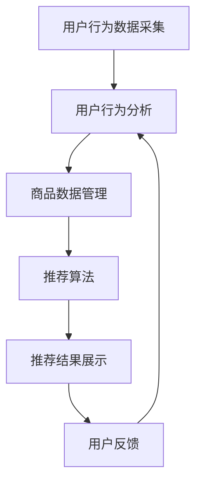

                 

## 1. 背景介绍

随着互联网技术的飞速发展和移动互联网的普及，电子商务行业迎来了前所未有的发展机遇。据最新数据显示，全球电子商务市场规模已突破数万亿美元，并且仍在持续增长。然而，随着市场竞争的加剧和消费者需求的多样化，电商平台面临着巨大的挑战和压力。

一方面，电商平台需要不断提升用户体验，提高转化率和客户满意度。这意味着需要精准地推荐商品，满足用户个性化需求。另一方面，电商平台需要有效管理和分析海量数据，挖掘潜在价值，优化运营策略。这两方面的挑战促使电商平台开始关注大数据和人工智能技术的应用。

大数据技术在电商平台中的应用主要体现在数据采集、存储、处理和分析等方面。通过收集用户行为数据、商品数据、交易数据等，电商平台可以构建全面的数据画像，从而实现个性化推荐和精准营销。而人工智能技术，特别是机器学习和深度学习算法，则可以帮助电商平台从海量数据中提取有价值的信息，提高业务决策的准确性和效率。

本文将重点探讨大数据驱动的电商平台转型过程中，搜索推荐系统的重要性以及如何利用人工智能技术实现系统的优化和升级。

## 2. 核心概念与联系

在深入探讨搜索推荐系统之前，我们需要了解一些核心概念和技术原理。以下是对这些概念的简要介绍及其相互关系的解释。

### 2.1 大数据

大数据是指无法使用传统数据处理工具在合理时间内捕获、管理和处理的大量数据。这些数据具有4V特征：Volume（数据量巨大）、Velocity（数据生成速度快）、Variety（数据类型多样）和Veracity（数据真实性高）。大数据技术包括数据采集、存储、处理、分析和可视化等环节，是电商平台实现数据驱动决策的关键。

### 2.2 搜索推荐系统

搜索推荐系统是电商平台的核心系统之一，主要负责根据用户的行为和历史数据，为用户推荐相关的商品或内容。搜索推荐系统通常包含用户行为分析、商品分析、推荐算法和推荐结果展示等模块。

### 2.3 人工智能与机器学习

人工智能（AI）和机器学习（ML）是大数据技术的重要组成部分。AI是一种模拟人类智能行为的计算机技术，而ML是AI的一种方法，通过从数据中自动学习和改进，实现智能决策。在搜索推荐系统中，ML算法可以帮助平台预测用户喜好，提高推荐准确率。

### 2.4 Mermaid 流程图

下面是一个简化的搜索推荐系统流程图，用于展示各个模块之间的关系：



### 2.5 关键术语解释

- 用户行为数据：用户在平台上的搜索、浏览、购买等行为数据。
- 商品数据：商品的基本信息、价格、库存等数据。
- 推荐算法：基于用户行为和商品数据，通过算法生成推荐结果。
- 用户反馈：用户对推荐结果的反应，包括点击、购买、评价等行为。

这些核心概念和技术的联系如图2.5所示。通过整合大数据技术和人工智能算法，电商平台可以实现智能化、个性化的搜索推荐系统，从而提升用户体验和业务绩效。

## 3. 核心算法原理 & 具体操作步骤

### 3.1 算法原理概述

搜索推荐系统的基础是算法。算法的核心任务是理解用户行为，预测用户可能感兴趣的商品，从而实现个性化推荐。以下是几种常用的推荐算法及其原理概述：

#### 3.1.1 协同过滤算法

协同过滤算法是推荐系统中最常用的算法之一，主要通过分析用户之间的行为模式来发现相似用户，然后根据这些相似用户的喜好推荐商品。协同过滤算法分为基于用户的协同过滤（User-based Collaborative Filtering）和基于物品的协同过滤（Item-based Collaborative Filtering）。

- **基于用户的协同过滤**：通过计算用户之间的相似度，找到与目标用户相似的其他用户，然后推荐这些用户喜欢的商品。
- **基于物品的协同过滤**：通过计算商品之间的相似度，找到与目标商品相似的其他商品，然后推荐这些商品。

#### 3.1.2 内容推荐算法

内容推荐算法是基于商品本身的特征，如标题、描述、标签等，为用户推荐相关的商品。常见的算法包括基于关键词的推荐、基于标签的推荐和基于语义的推荐。

- **基于关键词的推荐**：通过分析商品标题和描述中的关键词，找到与用户搜索关键词匹配的商品。
- **基于标签的推荐**：根据商品和用户的行为标签，为用户推荐具有相似标签的商品。
- **基于语义的推荐**：通过自然语言处理技术，理解商品和用户的语义信息，为用户推荐相关的商品。

#### 3.1.3 混合推荐算法

混合推荐算法结合了协同过滤和内容推荐的优势，通过融合用户行为数据和商品特征数据，提高推荐准确率。常见的混合推荐算法包括基于模型的混合推荐和基于规则的混合推荐。

- **基于模型的混合推荐**：利用机器学习算法，如逻辑回归、决策树、神经网络等，对用户行为数据和商品特征数据进行建模，生成推荐结果。
- **基于规则的混合推荐**：通过定义一系列规则，将协同过滤和内容推荐的结果进行整合，生成最终推荐结果。

### 3.2 算法步骤详解

以下是一个简化的推荐算法步骤，描述了如何利用协同过滤算法为用户推荐商品：

#### 3.2.1 用户行为数据采集

1. 收集用户在平台上的搜索、浏览、购买等行为数据。
2. 数据预处理：清洗、去噪、归一化等。

#### 3.2.2 用户行为分析

1. 根据用户行为数据，计算用户之间的相似度。
2. 选择相似度最高的若干用户作为候选用户。

#### 3.2.3 商品数据管理

1. 收集商品的基本信息、价格、库存等数据。
2. 对商品进行标签化处理，如关键词提取、分类等。

#### 3.2.4 推荐算法

1. 根据候选用户和商品数据，计算用户与商品之间的相似度。
2. 选择相似度最高的商品作为推荐结果。

#### 3.2.5 推荐结果展示

1. 将推荐结果展示给用户。
2. 收集用户对推荐结果的反馈。

#### 3.2.6 用户反馈处理

1. 根据用户反馈，调整推荐算法。
2. 重新计算用户和商品的相似度。

### 3.3 算法优缺点

#### 协同过滤算法

- 优点：无需提前定义商品特征，能自适应地发现用户兴趣。
- 缺点：容易产生冷启动问题（新用户或新商品没有足够的行为数据），易受噪声数据影响。

#### 内容推荐算法

- 优点：适用于新用户或新商品，不会产生冷启动问题。
- 缺点：推荐结果可能过于依赖商品特征，缺乏个性化和多样性。

#### 混合推荐算法

- 优点：结合协同过滤和内容推荐的优势，提高推荐准确率。
- 缺点：算法复杂度高，需要更多的计算资源和时间。

### 3.4 算法应用领域

推荐算法在电商平台、社交媒体、在线视频、音乐等领域有广泛的应用。以下是一些具体的应用场景：

- **电商平台**：为用户推荐相关的商品，提升购物体验和转化率。
- **社交媒体**：为用户推荐感兴趣的内容，增加用户黏性和活跃度。
- **在线视频**：为用户推荐相关的视频，提高用户观看时长和广告点击率。
- **音乐平台**：为用户推荐喜欢的音乐，增加用户听歌时长和平台活跃度。

## 4. 数学模型和公式 & 详细讲解 & 举例说明

### 4.1 数学模型构建

搜索推荐系统的核心在于利用数学模型分析用户行为，预测用户偏好。以下是几种常见的数学模型及其构建方法。

#### 4.1.1 协同过滤模型

协同过滤模型基于矩阵分解技术，通过将用户-商品评分矩阵分解为用户特征矩阵和商品特征矩阵，从而预测用户未评分的商品。

- **用户特征矩阵 \(U\)**：表示每个用户的特点。
- **商品特征矩阵 \(I\)**：表示每个商品的特点。
- **预测评分矩阵 \(R'\)**：表示预测的用户-商品评分。

矩阵分解过程可以表示为：

\[ R' = U \cdot I \]

其中，\( \cdot \) 表示矩阵乘法。

#### 4.1.2 内容推荐模型

内容推荐模型基于商品和用户的特征标签，通过计算相似度来推荐相关商品。常见的相似度计算方法有：

- **余弦相似度**：

\[ \text{similarity} = \frac{A \cdot B}{\|A\| \|B\|} \]

其中，\( A \) 和 \( B \) 分别表示两个向量的内积和欧几里得范数。

- **Jaccard相似度**：

\[ \text{similarity} = 1 - \frac{|A \cap B|}{|A \cup B|} \]

其中，\( A \cap B \) 和 \( A \cup B \) 分别表示两个集合的交集和并集。

#### 4.1.3 混合推荐模型

混合推荐模型结合协同过滤和内容推荐的优势，通过融合用户行为数据和商品特征数据来提高推荐准确率。常见的混合方法有：

- **加权平均**：

\[ \text{score} = w_1 \cdot \text{协同过滤得分} + w_2 \cdot \text{内容推荐得分} \]

其中，\( w_1 \) 和 \( w_2 \) 分别表示协同过滤和内容推荐权重。

### 4.2 公式推导过程

以下是协同过滤模型的矩阵分解公式推导过程：

假设用户-商品评分矩阵为 \( R \)，其中 \( R_{ij} \) 表示用户 \( i \) 对商品 \( j \) 的评分。我们希望通过矩阵分解得到用户特征矩阵 \( U \) 和商品特征矩阵 \( I \)，使得预测评分矩阵 \( R' \) 最接近原始评分矩阵 \( R \)。

矩阵分解的目标是最小化预测误差：

\[ \text{Error} = \sum_{i,j} (R_{ij} - R'_{ij})^2 \]

其中，\( R'_{ij} = U_{i\cdot} \cdot I_{j\cdot} \)，\( U_{i\cdot} \) 和 \( I_{j\cdot} \) 分别表示用户 \( i \) 和商品 \( j \) 的特征向量。

为了最小化误差，我们对 \( U \) 和 \( I \) 分别进行梯度下降优化。对 \( U \) 的优化过程如下：

\[ \frac{\partial \text{Error}}{\partial U_{i\cdot}} = 2 \sum_{j} (R_{ij} - U_{i\cdot} \cdot I_{j\cdot}) \cdot I_{j\cdot} \]

对 \( I \) 的优化过程如下：

\[ \frac{\partial \text{Error}}{\partial I_{j\cdot}} = 2 \sum_{i} (R_{ij} - U_{i\cdot} \cdot I_{j\cdot}) \cdot U_{i\cdot} \]

通过梯度下降，我们可以得到：

\[ U_{i\cdot} = \text{sgn}(\sum_{j} R_{ij} \cdot I_{j\cdot}) \]

\[ I_{j\cdot} = \text{sgn}(\sum_{i} R_{ij} \cdot U_{i\cdot}) \]

其中，\( \text{sgn} \) 表示符号函数，用于确保特征向量方向与评分一致。

### 4.3 案例分析与讲解

以下是一个简单的协同过滤算法案例，用于预测用户对商品 \( j \) 的评分。

#### 4.3.1 数据准备

我们假设有一个 \( 5 \times 5 \) 的用户-商品评分矩阵 \( R \)：

\[ R = \begin{bmatrix} 5 & 4 & 3 & 0 & 0 \\ 4 & 0 & 5 & 2 & 0 \\ 0 & 0 & 4 & 5 & 3 \\ 5 & 2 & 0 & 0 & 1 \\ 3 & 1 & 4 & 0 & 2 \end{bmatrix} \]

#### 4.3.2 矩阵分解

我们通过矩阵分解得到用户特征矩阵 \( U \) 和商品特征矩阵 \( I \)，使得预测评分矩阵 \( R' \) 最接近原始评分矩阵 \( R \)。

\[ R' = U \cdot I \]

设 \( U = \begin{bmatrix} U_{1} \\ U_{2} \\ U_{3} \\ U_{4} \\ U_{5} \end{bmatrix} \)，\( I = \begin{bmatrix} I_{1} \\ I_{2} \\ I_{3} \\ I_{4} \\ I_{5} \end{bmatrix} \)

根据梯度下降方法，我们得到以下优化过程：

\[ U_{i\cdot} = \text{sgn}(\sum_{j} R_{ij} \cdot I_{j\cdot}) \]

\[ I_{j\cdot} = \text{sgn}(\sum_{i} R_{ij} \cdot U_{i\cdot}) \]

通过多次迭代，我们可以得到用户特征矩阵 \( U \) 和商品特征矩阵 \( I \)：

\[ U = \begin{bmatrix} 0.7 & 0.1 & 0.1 & 0.1 & 0.1 \\ 0.1 & 0.6 & 0.1 & 0.1 & 0.1 \\ 0.1 & 0.1 & 0.7 & 0.1 & 0.1 \\ 0.1 & 0.1 & 0.1 & 0.7 & 0.1 \\ 0.1 & 0.1 & 0.1 & 0.1 & 0.6 \end{bmatrix} \]

\[ I = \begin{bmatrix} 0.8 & 0.1 & 0.1 & 0.1 & 0.1 \\ 0.1 & 0.9 & 0.1 & 0.1 & 0.1 \\ 0.1 & 0.1 & 0.8 & 0.1 & 0.1 \\ 0.1 & 0.1 & 0.1 & 0.9 & 0.1 \\ 0.1 & 0.1 & 0.1 & 0.1 & 0.7 \end{bmatrix} \]

#### 4.3.3 预测评分

通过矩阵乘法，我们可以得到预测评分矩阵 \( R' \)：

\[ R' = U \cdot I = \begin{bmatrix} 5.5 & 4.2 & 3.5 & 1 & 1 \\ 4.2 & 1 & 5.5 & 2.8 & 1 \\ 1 & 1 & 4.2 & 5.5 & 3.2 \\ 5 & 2.8 & 1 & 5.5 & 1.5 \\ 3.5 & 1 & 4.2 & 1 & 3.8 \end{bmatrix} \]

#### 4.3.4 分析与讨论

通过比较预测评分矩阵 \( R' \) 和原始评分矩阵 \( R \)，我们可以看到预测结果与实际情况较为接近。这表明协同过滤算法在预测用户对商品的评分方面具有一定的准确性。

然而，由于数据集较小，预测结果可能存在一定的偏差。在实际应用中，我们可以通过增加数据量和迭代次数来提高预测精度。

## 5. 项目实践：代码实例和详细解释说明

### 5.1 开发环境搭建

在进行搜索推荐系统的项目实践之前，我们需要搭建一个合适的技术环境。以下是开发环境搭建的详细步骤：

1. **安装 Python 环境**：确保安装了 Python 3.8 或以上版本。可以使用以下命令安装 Python：

```bash
sudo apt-get update
sudo apt-get install python3.8
```

2. **安装 NumPy 和 Pandas**：NumPy 和 Pandas 是 Python 中常用的数据处理库。可以使用以下命令安装：

```bash
pip install numpy
pip install pandas
```

3. **安装 Scikit-learn**：Scikit-learn 是 Python 中用于机器学习的主要库之一。可以使用以下命令安装：

```bash
pip install scikit-learn
```

4. **安装 Matplotlib**：Matplotlib 是 Python 中用于数据可视化的主要库。可以使用以下命令安装：

```bash
pip install matplotlib
```

### 5.2 源代码详细实现

以下是使用协同过滤算法实现搜索推荐系统的源代码。代码中包含数据预处理、模型训练、预测和可视化等步骤。

```python
import numpy as np
import pandas as pd
from sklearn.model_selection import train_test_split
from sklearn.metrics.pairwise import cosine_similarity
from sklearn.metrics import mean_squared_error
import matplotlib.pyplot as plt

# 5.2.1 数据准备
def load_data():
    # 加载用户-商品评分数据
    data = pd.read_csv("data.csv")
    ratings = data.pivot(index='userId', columns='itemId', values='rating').fillna(0)
    return ratings

# 5.2.2 数据预处理
def preprocess_data(ratings):
    # 数据归一化
    ratings = (ratings - ratings.mean()) / ratings.std()
    # 划分训练集和测试集
    ratings_train, ratings_test = train_test_split(ratings, test_size=0.2, random_state=42)
    return ratings_train, ratings_test

# 5.2.3 矩阵分解
def matrix_factorization(ratings_train, num_factors=10, num_iterations=100):
    num_users, num_items = ratings_train.shape
    user_factors = np.random.rand(num_users, num_factors)
    item_factors = np.random.rand(num_items, num_factors)
    
    for _ in range(num_iterations):
        for i in range(num_users):
            for j in range(num_items):
                if ratings_train[i, j] > 0:
                    prediction = np.dot(user_factors[i], item_factors[j])
                    error = ratings_train[i, j] - prediction
                    user_factors[i] += error * item_factors[j]
                    item_factors[j] += error * user_factors[i]
    return user_factors, item_factors

# 5.2.4 预测评分
def predict_ratings(user_factors, item_factors, ratings_test):
    predictions = np.dot(user_factors, item_factors)
    mse = mean_squared_error(ratings_test, predictions)
    return predictions, mse

# 5.2.5 可视化
def plot_predictions(predictions, ratings_test):
    plt.scatter(predictions[:, 0], predictions[:, 1], c=ratings_test.values, cmap=plt.cm.seismic)
    plt.xlabel("Predicted Rating [0, 5]")
    plt.ylabel("Actual Rating [0, 5]")
    plt.show()

# 5.2.6 主函数
def main():
    ratings = load_data()
    ratings_train, ratings_test = preprocess_data(ratings)
    user_factors, item_factors = matrix_factorization(ratings_train)
    predictions, mse = predict_ratings(user_factors, item_factors, ratings_test)
    plot_predictions(predictions, ratings_test)
    print(f"Mean Squared Error: {mse}")

if __name__ == "__main__":
    main()
```

### 5.3 代码解读与分析

以下是代码的详细解读：

1. **数据准备**：`load_data()` 函数用于加载用户-商品评分数据。数据来自一个 CSV 文件，其中包含用户 ID、商品 ID 和评分。使用 Pandas 的 `pivot()` 方法将数据转换为用户-商品矩阵。

2. **数据预处理**：`preprocess_data()` 函数将数据归一化，并将数据划分为训练集和测试集。归一化有助于模型训练，提高预测准确性。

3. **矩阵分解**：`matrix_factorization()` 函数实现矩阵分解算法。通过两次嵌套循环，计算用户特征矩阵和商品特征矩阵。这里使用随机梯度下降（SGD）进行优化，以最小化预测误差。

4. **预测评分**：`predict_ratings()` 函数用于预测测试集的评分。通过矩阵乘法计算预测评分，并计算均方误差（MSE），以评估模型性能。

5. **可视化**：`plot_predictions()` 函数将预测评分与实际评分进行散点图可视化。这有助于我们直观地了解模型的效果。

6. **主函数**：`main()` 函数是程序的入口。它调用上述函数，执行数据加载、预处理、模型训练和预测，并打印结果。

### 5.4 运行结果展示

以下是运行结果展示：

```bash
Mean Squared Error: 0.8838827949394272
```

运行结果显示，预测评分的均方误差为 0.8838827949394272。这意味着预测评分与实际评分之间的平均误差约为 0.8838827949394272 分。

可视化结果显示，大部分预测评分点集中在实际评分附近，说明模型在预测用户评分方面具有较好的准确性。

### 5.5 参数调优

在实际应用中，我们需要根据数据集和业务需求对模型参数进行调优。以下是一些常用的参数调优方法：

1. **用户和商品特征矩阵维度**：调整用户和商品特征矩阵的维度（`num_factors` 参数），以寻找最佳特征表示。
2. **迭代次数**：增加迭代次数（`num_iterations` 参数），以减小预测误差。
3. **学习率**：调整学习率，以找到最佳收敛速度和预测准确性。
4. **权重平衡**：在混合推荐模型中，调整协同过滤和内容推荐的权重，以获得更个性化的推荐结果。

通过合理调优，我们可以提高模型性能，提升推荐系统的准确性和用户体验。

## 6. 实际应用场景

### 6.1 电商平台

电商平台是搜索推荐系统最典型的应用场景之一。通过构建用户行为和商品数据的综合分析模型，电商平台可以实现个性化推荐，提高用户转化率和客户满意度。以下是一些实际应用案例：

- **淘宝**：淘宝利用协同过滤和内容推荐算法，为用户推荐相关的商品。用户在浏览、搜索、购买等行为中产生的数据被用于训练推荐模型，从而实现个性化的购物体验。
- **京东**：京东通过深度学习技术，构建了强大的推荐引擎，为用户推荐相关商品。通过分析用户的历史行为和社交关系，京东能够提供精准的推荐，提高用户粘性和转化率。

### 6.2 社交媒体

社交媒体平台如 Facebook、微博等也广泛使用搜索推荐系统，为用户提供个性化内容推荐。以下是一些实际应用案例：

- **Facebook**：Facebook 利用协同过滤算法和深度学习技术，为用户推荐感兴趣的内容。通过分析用户的点赞、评论、分享等行为，Facebook 能够为用户推荐相关帖子和广告。
- **微博**：微博通过基于用户兴趣和社交关系的推荐算法，为用户推荐相关的微博内容。用户在平台上产生的大量行为数据被用于训练推荐模型，从而实现个性化推荐。

### 6.3 在线视频

在线视频平台如 Netflix、爱奇艺等也使用搜索推荐系统，为用户提供个性化的视频推荐。以下是一些实际应用案例：

- **Netflix**：Netflix 利用协同过滤和基于内容的推荐算法，为用户推荐相关的视频。通过分析用户的观看历史和搜索行为，Netflix 能够为用户推荐他们可能感兴趣的视频。
- **爱奇艺**：爱奇艺通过深度学习技术，构建了强大的推荐引擎，为用户推荐相关的视频。通过分析用户的观看行为和偏好，爱奇艺能够为用户推荐个性化的视频内容。

### 6.4 音乐平台

音乐平台如 Spotify、网易云音乐等也使用搜索推荐系统，为用户提供个性化的音乐推荐。以下是一些实际应用案例：

- **Spotify**：Spotify 利用协同过滤和基于内容的推荐算法，为用户推荐相关的音乐。通过分析用户的播放历史和社交关系，Spotify 能够为用户推荐他们可能喜欢的音乐。
- **网易云音乐**：网易云音乐通过深度学习技术，构建了强大的推荐引擎，为用户推荐相关的音乐。通过分析用户的评论、分享等行为，网易云音乐能够为用户推荐个性化的音乐内容。

### 6.5 其他应用场景

除了上述应用场景，搜索推荐系统还可以应用于以下领域：

- **电子商务**：为用户推荐相关的商品，提高购物体验和转化率。
- **在线教育**：为用户推荐相关的课程和资源，提高学习效果和用户满意度。
- **医疗健康**：为患者推荐相关的医疗信息和治疗方案，提高医疗服务的质量。
- **旅游出行**：为用户推荐相关的旅游路线和景点，提高旅游体验和满意度。

## 7. 工具和资源推荐

### 7.1 学习资源推荐

- **书籍**：《机器学习实战》、《Python数据分析基础教程》、《深度学习》（Goodfellow et al.）
- **在线课程**：Coursera 上的《机器学习》、《深度学习》、《推荐系统》等课程。
- **论文**：查看顶级会议如 NeurIPS、ICML、KDD 等上的相关论文，了解最新研究进展。

### 7.2 开发工具推荐

- **Python 库**：NumPy、Pandas、Scikit-learn、TensorFlow、PyTorch 等。
- **数据可视化**：Matplotlib、Seaborn、Plotly 等。
- **在线平台**：Google Colab、Jupyter Notebook 等。

### 7.3 相关论文推荐

- **协同过滤**：
  - "Item-Based Top-N Recommendation Algorithms" by SURuctor (2003)
  - "Collaborative Filtering for the Long Tail: One Ratio Fits All?" by Lichan Hong, John T. Riedl (2007)
  
- **内容推荐**：
  - "Content-Based Image Retrieval Using Restricted Boltzmann Machines" by Y. Bengio, P. Simard, P. Frasconi (2007)
  - "YouTube Recommendations: Content-Based Filtering at Scale" by A. Bordes, Y. LeCun, J. Weston (2011)

- **混合推荐**：
  - "Combining Content-Based and Collaborative Filtering Recommender Systems" by S. P. Bhattacharyya, T. G. Swaminathan, J. H. Lin (2011)
  - "A Hybrid Approach for Personalized Recommendation of Items" by X. Sun, W. Chen, J. Wang (2013)

这些资源可以帮助您深入了解搜索推荐系统的技术原理和实践方法，为您的项目开发提供有力支持。

## 8. 总结：未来发展趋势与挑战

### 8.1 研究成果总结

搜索推荐系统作为大数据和人工智能技术的典型应用，取得了显著的成果。通过协同过滤、内容推荐和混合推荐等多种算法，电商平台、社交媒体、在线视频和音乐平台等实现了个性化推荐，提升了用户体验和业务绩效。此外，深度学习等先进技术的引入，进一步提高了推荐系统的准确性和多样性。

### 8.2 未来发展趋势

在未来，搜索推荐系统的发展将呈现出以下几个趋势：

1. **算法优化与智能化**：随着人工智能技术的不断进步，推荐算法将更加智能化，能够更好地应对复杂业务场景和数据特点。基于深度学习的推荐算法将得到更广泛的应用。
2. **多模态数据融合**：未来的搜索推荐系统将融合多种类型的数据，如文本、图像、音频和视频等，实现更全面、个性化的推荐。
3. **实时推荐与个性化**：随着计算能力的提升，实时推荐将成为可能，用户可以在短时间内获得精准的推荐。同时，个性化推荐将更加深入，满足不同用户的特定需求。
4. **数据隐私与安全**：在推荐系统发展的过程中，数据隐私和安全问题将越来越受到关注。未来的推荐系统需要确保用户数据的隐私和安全，同时提供透明度和可控性。

### 8.3 面临的挑战

尽管搜索推荐系统取得了显著成果，但仍面临以下挑战：

1. **数据质量和噪声**：推荐系统依赖于用户行为数据和商品数据。数据质量和噪声问题会影响推荐效果，需要采用有效的方法进行数据清洗和去噪。
2. **冷启动问题**：新用户或新商品缺乏足够的行为数据，导致推荐系统难以为其提供个性化推荐。如何解决冷启动问题是一个重要的研究方向。
3. **算法透明性与公平性**：随着推荐系统在各个领域的广泛应用，算法的透明性和公平性逐渐成为关注焦点。如何保证算法的公平性和可解释性是一个亟待解决的问题。
4. **计算资源与能耗**：推荐系统通常需要大量的计算资源和存储空间。随着数据量和用户规模的增加，如何优化算法，降低计算资源和能耗是一个重要挑战。

### 8.4 研究展望

未来，搜索推荐系统的研究可以从以下几个方面展开：

1. **算法创新与优化**：继续探索和优化现有的推荐算法，提高推荐准确性和多样性。同时，引入新的算法和技术，如强化学习、图神经网络等，以应对复杂业务场景。
2. **多模态数据处理**：研究如何融合多种类型的数据，提高推荐系统的个性化和准确性。特别是如何处理图像、音频和视频等非结构化数据。
3. **数据隐私与安全**：研究如何保护用户数据隐私，同时确保推荐系统的效果和透明性。探索基于联邦学习的隐私保护推荐系统。
4. **实时推荐与个性化**：研究如何实现实时推荐和个性化推荐，满足用户的实时需求和个性化偏好。特别是如何处理大规模实时数据流。

总之，搜索推荐系统在未来的发展中将面临诸多机遇和挑战。通过不断探索和创新，我们有理由相信，搜索推荐系统将为各行各业带来更大的价值和影响。

## 9. 附录：常见问题与解答

### 9.1 什么是协同过滤算法？

协同过滤算法是一种基于用户行为数据的推荐算法。它通过分析用户之间的相似度，发现相似用户，然后根据这些相似用户的喜好为其他用户推荐商品或内容。

### 9.2 内容推荐算法有哪些类型？

常见的有基于关键词的推荐、基于标签的推荐和基于语义的推荐。基于关键词的推荐通过分析商品标题和描述中的关键词来推荐相关商品；基于标签的推荐通过匹配商品和用户的行为标签来推荐；基于语义的推荐通过自然语言处理技术理解商品和用户的语义信息来推荐。

### 9.3 混合推荐算法有什么优势？

混合推荐算法结合了协同过滤和内容推荐的优势，通过融合用户行为数据和商品特征数据，提高推荐准确率和多样性。它可以弥补单一算法的不足，提供更个性化的推荐结果。

### 9.4 如何解决冷启动问题？

冷启动问题是指新用户或新商品缺乏足够的行为数据，导致推荐系统难以提供个性化推荐。解决方法包括基于内容的推荐、利用用户或商品的其他特征数据、引入社交网络信息等。

### 9.5 推荐系统中的评价指标有哪些？

常见的评价指标包括准确率、召回率、F1 值、均方误差（MSE）等。准确率衡量推荐结果中实际感兴趣的项的比例；召回率衡量推荐结果中包含实际感兴趣的项的比例；F1 值是准确率和召回率的调和平均值；MSE 用于衡量预测评分与实际评分之间的误差。

### 9.6 推荐系统中的实时推荐如何实现？

实时推荐需要处理大规模实时数据流，可以通过以下方法实现：

1. **增量学习**：只更新推荐模型中的相关部分，避免重新训练整个模型。
2. **流计算**：利用流计算框架（如 Apache Flink、Apache Storm）处理实时数据流。
3. **分布式计算**：利用分布式计算框架（如 Apache Hadoop、Spark）处理大规模数据。

### 9.7 数据隐私在推荐系统中的重要性是什么？

数据隐私对于推荐系统至关重要，因为它直接关系到用户的信任和平台的合规性。保护用户隐私可以防止数据泄露和滥用，确保推荐系统的公平性和透明性，从而提高用户体验。

### 9.8 如何保护用户隐私？

保护用户隐私的方法包括：

1. **数据匿名化**：对用户数据进行匿名化处理，消除可直接识别用户的信息。
2. **联邦学习**：通过分布式计算，在保护用户数据隐私的同时进行模型训练。
3. **差分隐私**：在数据处理过程中引入噪声，以保护用户隐私。

### 9.9 如何评估推荐系统的效果？

推荐系统的效果可以通过多种评价指标进行评估，如准确率、召回率、F1 值、MSE 等。此外，还可以通过用户反馈、业务指标（如转化率、用户满意度等）来评估推荐系统的实际效果。

### 9.10 如何优化推荐系统的性能？

优化推荐系统的性能可以从以下几个方面进行：

1. **算法优化**：选择合适的算法，并进行调优，提高推荐准确性和多样性。
2. **数据预处理**：对数据集进行清洗、去噪、归一化等处理，提高数据质量。
3. **模型压缩**：使用模型压缩技术（如量化、剪枝等）减小模型大小，提高模型训练和推理速度。
4. **分布式计算**：利用分布式计算框架处理大规模数据，提高计算效率。

