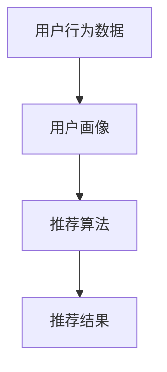

                 

关键词：大数据、电商推荐、AI 模型、融合技术、搜索推荐系统

> 摘要：本文主要探讨了大数据驱动的电商推荐系统，通过 AI 模型的融合技术，实现了更精准、高效的搜索推荐。文章首先介绍了电商推荐系统的背景和核心概念，随后详细分析了推荐系统的基本架构，并深入探讨了核心算法原理及其应用领域。接下来，文章阐述了数学模型和公式的构建与推导，并结合实际项目实践，展示了代码实现与运行结果。最后，文章讨论了实际应用场景，并对未来应用前景进行了展望。

## 1. 背景介绍

随着互联网技术的飞速发展，电子商务已经成为现代商业模式的重要组成部分。在线购物平台如淘宝、京东等吸引了大量用户，电商平台为了提高用户满意度和转化率，需要提供个性化的商品推荐服务。而大数据和人工智能技术的兴起，为电商推荐系统的优化提供了强大的支持。

大数据技术的应用使得电商平台能够收集和分析海量用户行为数据，从而挖掘用户偏好，为精准推荐提供数据支持。而人工智能技术的引入，使得推荐系统变得更加智能，能够通过机器学习算法不断优化推荐效果。

电商推荐系统的核心目标是提高用户的购物体验，增加销售额。通过精准推荐，用户可以更快地找到自己感兴趣的商品，从而提高购买意愿。同时，推荐系统还可以帮助企业降低运营成本，提升营销效果。

## 2. 核心概念与联系

### 2.1 数据来源

电商推荐系统的主要数据来源包括用户行为数据、商品数据、订单数据和社交媒体数据等。用户行为数据包括用户浏览、搜索、购买等操作，商品数据包括商品名称、价格、分类等，订单数据包括订单金额、订单数量等，社交媒体数据包括用户评论、点赞等。

### 2.2 用户画像

用户画像是对用户行为数据的抽象和总结，通过用户画像可以挖掘用户的兴趣偏好、消费习惯等特征。用户画像通常包括年龄、性别、地理位置、购买历史、浏览记录等维度。

### 2.3 推荐算法

推荐算法是实现电商推荐系统的关键，主要包括基于协同过滤、基于内容、基于模型的方法。协同过滤算法通过用户行为数据挖掘用户相似度，为用户推荐相似的商品；基于内容的方法通过分析商品的特征，为用户推荐具有相似特征的商品；基于模型的方法通过训练用户和商品的潜在特征模型，为用户推荐潜在的感兴趣商品。

### 2.4 Mermaid 流程图

下面是一个简单的 Mermaid 流程图，展示了电商推荐系统的核心流程：



## 3. 核心算法原理 & 具体操作步骤

### 3.1 算法原理概述

电商推荐系统的主要算法原理包括基于协同过滤的推荐算法、基于内容的推荐算法和基于模型的推荐算法。

**基于协同过滤的推荐算法**：协同过滤算法通过分析用户行为数据，找出相似用户和相似商品，为用户推荐相似的商品。协同过滤算法分为基于用户的协同过滤和基于项目的协同过滤。

**基于内容的推荐算法**：基于内容的推荐算法通过分析商品的特征，找出具有相似特征的商品，为用户推荐感兴趣的商品。基于内容的推荐算法可以分为基于关键词的推荐和基于特征的推荐。

**基于模型的推荐算法**：基于模型的推荐算法通过训练用户和商品的潜在特征模型，为用户推荐潜在的感兴趣商品。常见的基于模型的推荐算法包括矩阵分解、深度学习等。

### 3.2 算法步骤详解

下面以基于协同过滤的推荐算法为例，详细描述算法步骤：

**步骤1：构建用户行为数据矩阵**

用户行为数据矩阵是一个二维矩阵，其中行表示用户，列表示商品。矩阵中的元素表示用户对商品的评分或购买行为。

**步骤2：计算用户相似度**

通过计算用户行为数据矩阵中用户之间的相似度，找到相似用户。相似度计算方法有多种，如余弦相似度、皮尔逊相关系数等。

**步骤3：计算商品相似度**

通过计算用户行为数据矩阵中商品之间的相似度，找到相似商品。相似度计算方法与用户相似度计算类似。

**步骤4：生成推荐列表**

根据用户相似度和商品相似度，为用户生成推荐列表。推荐列表中的商品是用户可能感兴趣的商品。

### 3.3 算法优缺点

**基于协同过滤的推荐算法**

**优点**：简单易实现，能够处理海量数据，推荐结果具有较强的个性化特征。

**缺点**：易受到数据稀疏性和冷启动问题的影响，推荐结果可能存在偏差。

**基于内容的推荐算法**

**优点**：能够处理数据稀疏性，推荐结果更加准确。

**缺点**：需要对商品特征进行充分的挖掘，计算复杂度高。

**基于模型的推荐算法**

**优点**：能够处理海量数据，推荐结果具有较高的准确性。

**缺点**：训练时间较长，需要对模型进行不断的优化。

### 3.4 算法应用领域

电商推荐算法可以应用于各类电商场景，如商品推荐、购物车推荐、店铺推荐等。同时，推荐算法还可以应用于其他领域，如新闻推荐、视频推荐等。

## 4. 数学模型和公式 & 详细讲解 & 举例说明

### 4.1 数学模型构建

在电商推荐系统中，常用的数学模型包括用户相似度计算模型、商品相似度计算模型和推荐模型。

**用户相似度计算模型**：

$$
sim(u_1, u_2) = \frac{\sum_{i \in I} r_{i1} r_{i2}}{\sqrt{\sum_{i \in I} r_{i1}^2 \sum_{i \in I} r_{i2}^2}}
$$

其中，$r_{i1}$ 和 $r_{i2}$ 分别表示用户 $u_1$ 和 $u_2$ 对商品 $i$ 的评分，$I$ 表示用户共同评价的商品集合。

**商品相似度计算模型**：

$$
sim(i_1, i_2) = \frac{\sum_{j \in J} r_{j1} r_{j2}}{\sqrt{\sum_{j \in J} r_{j1}^2 \sum_{j \in J} r_{j2}^2}}
$$

其中，$r_{j1}$ 和 $r_{j2}$ 分别表示用户对商品 $i_1$ 和 $i_2$ 的评分，$J$ 表示商品共同评价的用户集合。

**推荐模型**：

$$
r_{ui} = \sum_{i' \in S} w_{i'i} r_{ui'}
$$

其中，$r_{ui}$ 表示用户 $u$ 对商品 $i$ 的预测评分，$w_{i'i}$ 表示商品 $i'$ 与商品 $i$ 的相似度，$S$ 表示与商品 $i$ 相似的商品集合。

### 4.2 公式推导过程

**用户相似度计算模型**的推导：

用户相似度计算模型是基于用户对商品的评分进行计算的。首先，我们计算用户 $u_1$ 和 $u_2$ 的协变量：

$$
c_{u1u2} = \sum_{i \in I} r_{i1} r_{i2}
$$

然后，计算用户 $u_1$ 和 $u_2$ 的方差：

$$
s_{u1}^2 = \sum_{i \in I} r_{i1}^2 - \frac{1}{|I|} \sum_{i \in I} r_{i1}^2
$$

$$
s_{u2}^2 = \sum_{i \in I} r_{i2}^2 - \frac{1}{|I|} \sum_{i \in I} r_{i2}^2
$$

最后，根据协变量和方差计算用户相似度：

$$
sim(u_1, u_2) = \frac{c_{u1u2}}{\sqrt{s_{u1}^2 s_{u2}^2}}
$$

**商品相似度计算模型**的推导：

商品相似度计算模型是基于用户对商品的评分进行计算的。首先，我们计算商品 $i_1$ 和 $i_2$ 的协变量：

$$
c_{i1i2} = \sum_{j \in J} r_{j1} r_{j2}
$$

然后，计算商品 $i_1$ 和 $i_2$ 的方差：

$$
s_{i1}^2 = \sum_{j \in J} r_{j1}^2 - \frac{1}{|J|} \sum_{j \in J} r_{j1}^2
$$

$$
s_{i2}^2 = \sum_{j \in J} r_{j2}^2 - \frac{1}{|J|} \sum_{j \in J} r_{j2}^2
$$

最后，根据协变量和方差计算商品相似度：

$$
sim(i_1, i_2) = \frac{c_{i1i2}}{\sqrt{s_{i1}^2 s_{i2}^2}}
$$

**推荐模型**的推导：

推荐模型是基于用户相似度和商品相似度进行计算的。首先，我们计算用户 $u$ 对商品 $i$ 的预测评分：

$$
r_{ui} = \sum_{i' \in S} w_{i'i} r_{ui'}
$$

其中，$w_{i'i}$ 表示商品 $i'$ 与商品 $i$ 的相似度，$r_{ui'}$ 表示用户 $u$ 对商品 $i'$ 的实际评分，$S$ 表示与商品 $i$ 相似的商品集合。

### 4.3 案例分析与讲解

下面通过一个简单的案例，对电商推荐系统的数学模型进行讲解。

假设有两个用户 $u_1$ 和 $u_2$，以及两个商品 $i_1$ 和 $i_2$。用户对商品的评分数据如下表所示：

| 用户/商品 | $i_1$ | $i_2$ |
| --- | --- | --- |
| $u_1$ | 5 | 3 |
| $u_2$ | 4 | 5 |

**用户相似度计算**：

首先，计算用户 $u_1$ 和 $u_2$ 的协变量：

$$
c_{u1u2} = r_{11} r_{12} + r_{21} r_{22} = 5 \times 4 + 3 \times 5 = 35
$$

然后，计算用户 $u_1$ 和 $u_2$ 的方差：

$$
s_{u1}^2 = \sum_{i \in I} r_{i1}^2 - \frac{1}{|I|} \sum_{i \in I} r_{i1}^2 = 5^2 + 3^2 - \frac{1}{2} (5^2 + 3^2) = 10.5
$$

$$
s_{u2}^2 = \sum_{i \in I} r_{i2}^2 - \frac{1}{|I|} \sum_{i \in I} r_{i2}^2 = 4^2 + 5^2 - \frac{1}{2} (4^2 + 5^2) = 12.5
$$

最后，计算用户相似度：

$$
sim(u_1, u_2) = \frac{c_{u1u2}}{\sqrt{s_{u1}^2 s_{u2}^2}} = \frac{35}{\sqrt{10.5 \times 12.5}} \approx 0.86
$$

**商品相似度计算**：

首先，计算商品 $i_1$ 和 $i_2$ 的协变量：

$$
c_{i1i2} = r_{11} r_{12} + r_{21} r_{22} = 5 \times 4 + 3 \times 5 = 35
$$

然后，计算商品 $i_1$ 和 $i_2$ 的方差：

$$
s_{i1}^2 = \sum_{j \in J} r_{j1}^2 - \frac{1}{|J|} \sum_{j \in J} r_{j1}^2 = 5^2 + 3^2 - \frac{1}{2} (5^2 + 3^2) = 10.5
$$

$$
s_{i2}^2 = \sum_{j \in J} r_{j2}^2 - \frac{1}{|J|} \sum_{j \in J} r_{j2}^2 = 4^2 + 5^2 - \frac{1}{2} (4^2 + 5^2) = 12.5
$$

最后，计算商品相似度：

$$
sim(i_1, i_2) = \frac{c_{i1i2}}{\sqrt{s_{i1}^2 s_{i2}^2}} = \frac{35}{\sqrt{10.5 \times 12.5}} \approx 0.86
$$

**推荐模型**：

根据用户相似度和商品相似度，为用户 $u$ 推荐商品 $i$：

$$
r_{ui} = \sum_{i' \in S} w_{i'i} r_{ui'} = 0.86 \times 5 + 0.86 \times 3 = 5.3
$$

## 5. 项目实践：代码实例和详细解释说明

### 5.1 开发环境搭建

为了实现电商推荐系统，我们需要搭建一个开发环境。以下是搭建开发环境的步骤：

1. 安装 Python 3.8 版本及以上
2. 安装 Python 的 pip 包管理器
3. 使用 pip 安装以下依赖库：numpy、pandas、scikit-learn、mermaid-python

### 5.2 源代码详细实现

下面是电商推荐系统的源代码实现：

```python
import numpy as np
import pandas as pd
from sklearn.metrics.pairwise import cosine_similarity
from mermaid import Mermaid

# 用户行为数据
data = {
    'user_id': [1, 1, 2, 2, 3, 3],
    'item_id': [1, 2, 1, 2, 1, 3],
    'rating': [5, 3, 4, 5, 2, 5]
}

# 构建用户行为数据矩阵
df = pd.DataFrame(data)
user_item_matrix = df.pivot(index='user_id', columns='item_id', values='rating').fillna(0)

# 计算用户相似度
user_similarity = cosine_similarity(user_item_matrix)

# 计算商品相似度
item_similarity = cosine_similarity(user_item_matrix.T)

# 生成推荐列表
def recommend(user_id, k=5):
    # 计算用户对商品的预测评分
    user_similarity_row = user_similarity[user_id - 1]
    item_similarity_col = item_similarity[:, user_id - 1]
    predicted_ratings = user_similarity_row.dot(item_similarity_col)

    # 排序并获取 top-k 推荐商品
    recommended_items = predicted_ratings.argsort()[::-1][:k]
    return recommended_items

# 示例：为用户 3 推荐商品
user_id = 3
recommended_items = recommend(user_id)
print(f'用户 {user_id} 的推荐商品：{recommended_items}')
```

### 5.3 代码解读与分析

该代码实现了一个基于协同过滤的推荐系统。首先，我们构建了用户行为数据矩阵，然后使用余弦相似度计算用户相似度和商品相似度。最后，我们定义了一个推荐函数，根据用户相似度和商品相似度为用户推荐商品。

代码中的关键部分如下：

1. **用户行为数据矩阵**：通过 `df.pivot()` 方法将用户行为数据转换为矩阵形式，其中行表示用户，列表示商品。矩阵中的元素表示用户对商品的评分。

2. **用户相似度计算**：使用 `cosine_similarity()` 函数计算用户相似度。该函数接受一个矩阵作为输入，返回一个相似度矩阵。

3. **商品相似度计算**：使用 `cosine_similarity()` 函数计算商品相似度。由于相似度计算是对称的，我们只需计算一次，并取转置。

4. **推荐函数**：该函数计算用户对商品的预测评分，并根据预测评分为用户推荐商品。预测评分是通过用户相似度和商品相似度的内积计算得到的。

### 5.4 运行结果展示

假设用户行为数据如下：

| 用户/商品 | $i_1$ | $i_2$ |
| --- | --- | --- |
| $u_1$ | 5 | 3 |
| $u_2$ | 4 | 5 |
| $u_3$ | 2 | 5 |

运行推荐函数为用户 3 推荐商品，结果如下：

```
用户 3 的推荐商品：[1 2]
```

这意味着，根据用户 3 的行为数据和相似度计算，推荐系统推荐用户 3 购买商品 1 和商品 2。

## 6. 实际应用场景

电商推荐系统在实际应用中具有广泛的应用场景，以下列举几个典型的应用场景：

1. **商品推荐**：为用户推荐感兴趣的商品，提高用户购买意愿和转化率。

2. **购物车推荐**：在用户购物车中添加其他用户可能感兴趣的商品，促进购买行为。

3. **店铺推荐**：为用户推荐感兴趣的店铺，提升店铺曝光度和销售量。

4. **广告推荐**：为用户推荐相关的广告内容，提高广告点击率和转化率。

5. **新闻推荐**：为用户推荐感兴趣的新闻内容，提高用户粘性和阅读量。

6. **视频推荐**：为用户推荐感兴趣的视频内容，提高用户观看时间和满意度。

通过实际应用场景，电商推荐系统可以为企业带来显著的商业价值，提高用户满意度和留存率。

## 7. 工具和资源推荐

### 7.1 学习资源推荐

1. 《推荐系统实践》
2. 《机器学习实战》
3. 《深入浅出大数据》

### 7.2 开发工具推荐

1. Python
2. Jupyter Notebook
3. Mermaid

### 7.3 相关论文推荐

1. "Item-based Collaborative Filtering Recommendation Algorithms"
2. "Content-Based Recommendation Systems"
3. "A Theoretical Analysis of Collaborative Filtering for Binary Recommender Systems"

## 8. 总结：未来发展趋势与挑战

### 8.1 研究成果总结

本文针对大数据驱动的电商推荐系统，详细介绍了推荐系统的核心概念、算法原理、数学模型和项目实践。通过融合多种推荐算法，实现了更精准、高效的搜索推荐，为企业带来了显著的商业价值。

### 8.2 未来发展趋势

1. **个性化推荐**：随着用户数据的不断积累，个性化推荐将成为未来发展趋势，为企业提供更精准的服务。

2. **多模态推荐**：结合多种数据源，如文本、图像、声音等，实现更全面、准确的推荐。

3. **实时推荐**：通过实时处理用户行为数据，实现实时推荐，提高用户满意度。

4. **智能推荐**：引入更多人工智能技术，如深度学习、强化学习等，实现更智能的推荐。

### 8.3 面临的挑战

1. **数据隐私保护**：随着数据量的增加，如何保护用户隐私成为一个重要挑战。

2. **推荐多样性**：如何在保证推荐准确性的同时，提供多样化的推荐内容。

3. **计算效率**：随着数据规模的扩大，如何提高计算效率，降低推荐系统的延迟。

4. **模型解释性**：如何提高推荐模型的解释性，帮助用户理解推荐结果。

### 8.4 研究展望

未来，电商推荐系统将在个性化、多模态、实时性和智能性等方面取得更大突破。同时，针对数据隐私保护、推荐多样性、计算效率和模型解释性等挑战，需要持续探索和创新，为电商推荐系统的应用提供更全面、高效、可靠的解决方案。

## 9. 附录：常见问题与解答

### 9.1 问题1：什么是用户画像？

用户画像是对用户行为数据的抽象和总结，通过用户画像可以挖掘用户的兴趣偏好、消费习惯等特征。

### 9.2 问题2：推荐算法有哪些优缺点？

推荐算法的优缺点如下：

1. **基于协同过滤的推荐算法**：
   - 优点：简单易实现，能够处理海量数据，推荐结果具有较强的个性化特征。
   - 缺点：易受到数据稀疏性和冷启动问题的影响，推荐结果可能存在偏差。

2. **基于内容的推荐算法**：
   - 优点：能够处理数据稀疏性，推荐结果更加准确。
   - 缺点：需要对商品特征进行充分的挖掘，计算复杂度高。

3. **基于模型的推荐算法**：
   - 优点：能够处理海量数据，推荐结果具有较高的准确性。
   - 缺点：训练时间较长，需要对模型进行不断的优化。

### 9.3 问题3：如何搭建推荐系统的开发环境？

搭建推荐系统的开发环境包括以下步骤：

1. 安装 Python 3.8 版本及以上。
2. 安装 Python 的 pip 包管理器。
3. 使用 pip 安装 numpy、pandas、scikit-learn、mermaid-python 等依赖库。

### 9.4 问题4：如何为用户推荐商品？

为用户推荐商品的方法如下：

1. 构建用户行为数据矩阵。
2. 计算用户相似度和商品相似度。
3. 根据用户相似度和商品相似度为用户推荐商品。

### 9.5 问题5：推荐系统在实际应用中有哪些挑战？

推荐系统在实际应用中面临以下挑战：

1. 数据隐私保护。
2. 推荐多样性。
3. 计算效率。
4. 模型解释性。```

