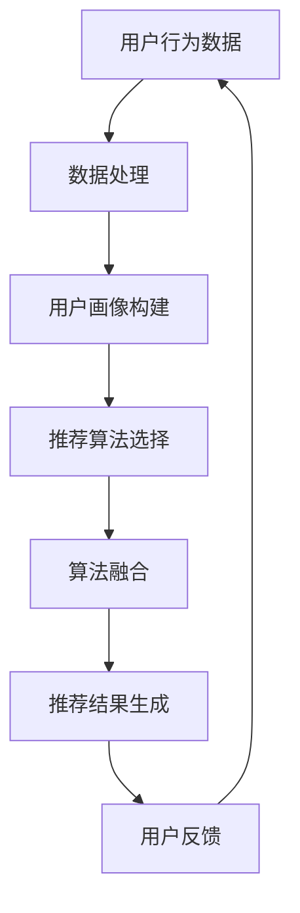

                 

关键词：大数据、电商搜索、推荐系统、AI 模型融合、数据质量

> 摘要：本文深入探讨了大数据时代下电商搜索推荐系统的发展，强调了AI模型融合和数据质量在系统优化中的关键作用。通过详细的算法原理分析、数学模型解析、项目实践讲解以及未来应用展望，本文旨在为电商行业提供一套系统化的搜索推荐解决方案。

## 1. 背景介绍

在互联网飞速发展的今天，电商行业已经成为全球经济的重要组成部分。电商平台的蓬勃发展带来了海量的用户数据，这些数据中蕴含着消费者的行为习惯、喜好和需求等信息。如何有效地利用这些数据，提高用户的购物体验，成为电商行业亟待解决的问题。

传统的电商搜索推荐系统主要依赖于关键词匹配和分类推荐，存在一定的局限性。随着大数据技术的崛起，基于用户行为数据、商品信息以及社交网络等多维度数据的推荐系统逐渐成为主流。这类系统通过机器学习和深度学习算法，对用户行为进行分析，预测用户的兴趣和需求，从而实现个性化推荐。

然而，大数据驱动下的电商搜索推荐系统面临着诸多挑战，其中最为关键的两个问题便是AI模型融合和数据质量。AI模型融合涉及到多个算法的协同工作，如何选择合适的算法、如何实现算法之间的有效融合，是系统优化的核心。而数据质量则是推荐系统的基础，数据的不准确、不完整或冗余，都会直接影响推荐的效果。

本文将从以下几个方面展开讨论：

- 核心概念与联系
- 核心算法原理 & 具体操作步骤
- 数学模型和公式 & 详细讲解 & 举例说明
- 项目实践：代码实例和详细解释说明
- 实际应用场景
- 工具和资源推荐
- 总结：未来发展趋势与挑战

通过上述内容的详细探讨，希望能够为电商搜索推荐系统的发展提供一些有益的思路。

### 2. 核心概念与联系

在探讨大数据驱动的电商搜索推荐系统之前，我们首先需要了解一些核心概念，这些概念构成了推荐系统的理论基础，也决定了系统的实现和优化。

#### 2.1. 用户行为数据

用户行为数据是推荐系统最重要的数据源之一。这些数据包括用户的浏览记录、购买历史、搜索历史、点击记录等。通过对这些数据的分析，我们可以了解用户的兴趣和需求，从而进行个性化推荐。

#### 2.2. 商品信息

商品信息包括商品的基本属性（如分类、品牌、价格等）和商品详情（如商品描述、用户评价等）。商品信息是推荐系统的基础，通过分析这些信息，我们可以为用户提供相关度更高的推荐结果。

#### 2.3. 社交网络数据

社交网络数据包括用户的社交关系、好友的购买行为等。这些数据可以帮助我们理解用户的社交影响力，从而实现基于社交网络的推荐。

#### 2.4. 推荐算法

推荐算法是推荐系统的核心，它们负责根据用户行为数据和商品信息生成推荐结果。常见的推荐算法包括基于内容的推荐、协同过滤推荐、深度学习推荐等。

#### 2.5. 数据质量

数据质量是推荐系统成功的关键。高质量的数据可以提高推荐的准确性，而低质量的数据则可能导致推荐效果不佳。数据质量包括数据准确性、完整性、一致性等方面。

#### 2.6. AI 模型融合

AI 模型融合是指将多种不同的机器学习和深度学习算法结合起来，共同为推荐系统提供支持。融合算法可以充分利用各种算法的优势，提高推荐系统的性能。

#### 2.7. Mermaid 流程图

下面是一个简单的Mermaid流程图，展示了电商搜索推荐系统的核心组件和它们之间的联系。



### 3. 核心算法原理 & 具体操作步骤

在了解了核心概念之后，我们接下来探讨电商搜索推荐系统的核心算法原理和具体操作步骤。

#### 3.1. 算法原理概述

电商搜索推荐系统的核心算法主要包括基于内容的推荐（Content-Based Recommendation）、协同过滤推荐（Collaborative Filtering）和深度学习推荐（Deep Learning Recommendation）。

- **基于内容的推荐**：根据用户的兴趣和偏好，从商品信息中提取特征，生成用户画像和商品画像，然后计算用户画像和商品画像之间的相似度，推荐相似的商品给用户。
- **协同过滤推荐**：通过分析用户行为数据，发现用户之间的相似性，从而预测用户对未知商品的兴趣。协同过滤推荐分为基于用户的协同过滤（User-Based Collaborative Filtering）和基于模型的协同过滤（Model-Based Collaborative Filtering）。
- **深度学习推荐**：利用深度神经网络，对用户行为数据进行建模，预测用户的兴趣和需求。常见的深度学习推荐算法包括基于神经网络的协同过滤（Neural Collaborative Filtering，NCF）和基于Transformer的推荐算法（如BERT、GPT等）。

#### 3.2. 算法步骤详解

下面我们以基于内容的推荐为例，详细说明算法的操作步骤。

1. **数据预处理**：对用户行为数据和商品信息进行清洗、去噪、归一化等处理，确保数据的质量。
2. **特征提取**：从用户行为数据和商品信息中提取特征，如用户的浏览记录、购买历史、商品的基本属性、描述等。
3. **用户画像构建**：根据提取的用户特征，构建用户画像。用户画像可以看作是一个高维向量，其中每个维度代表用户的某个特征。
4. **商品画像构建**：根据提取的商品特征，构建商品画像。商品画像同样是一个高维向量。
5. **相似度计算**：计算用户画像和商品画像之间的相似度。常用的相似度计算方法包括余弦相似度、欧氏距离等。
6. **推荐结果生成**：根据相似度计算结果，生成推荐列表，推荐相似度最高的商品给用户。

#### 3.3. 算法优缺点

- **基于内容的推荐**：优点是推荐结果相关性高，用户满意度较高；缺点是需要对商品信息进行详细的特征提取，对数据质量要求较高。
- **协同过滤推荐**：优点是能够发现用户之间的相似性，推荐结果多样性较好；缺点是可能产生冷启动问题，对新用户和新商品推荐效果较差。
- **深度学习推荐**：优点是能够自动学习用户行为数据中的复杂模式，推荐效果较好；缺点是需要大量的训练数据和计算资源。

#### 3.4. 算法应用领域

- **电商搜索推荐**：应用于电商平台的商品推荐，提高用户购买转化率。
- **社交媒体推荐**：应用于社交媒体平台的内容推荐，提高用户活跃度和留存率。
- **音乐、视频推荐**：应用于音乐、视频平台的推荐，提高用户满意度。

### 4. 数学模型和公式 & 详细讲解 & 举例说明

在推荐系统中，数学模型和公式起着至关重要的作用。它们帮助我们量化用户行为、商品特征和推荐效果，从而实现有效的推荐。下面我们将详细讲解一些常用的数学模型和公式，并通过具体例子进行说明。

#### 4.1. 数学模型构建

在推荐系统中，常见的数学模型包括用户-商品矩阵、相似度计算模型和损失函数。

1. **用户-商品矩阵**：用户-商品矩阵是一个二维矩阵，其中行代表用户，列代表商品。矩阵中的元素表示用户对商品的评分或行为。例如：

   | 用户 | 商品1 | 商品2 | 商品3 |
   | ---- | ---- | ---- | ---- |
   | 用户1 | 1 | 0 | 1 |
   | 用户2 | 0 | 1 | 0 |
   | 用户3 | 1 | 1 | 0 |

2. **相似度计算模型**：相似度计算模型用于计算用户和商品之间的相似度。常用的相似度计算方法包括余弦相似度、皮尔逊相关系数等。例如，余弦相似度计算公式如下：

   $$ \text{相似度} = \frac{\text{用户-商品向量的点积}}{\text{用户向量的模} \times \text{商品向量的模}} $$

3. **损失函数**：损失函数用于评估推荐结果的准确性。常用的损失函数包括均方误差（MSE）、交叉熵损失等。例如，均方误差损失函数如下：

   $$ \text{MSE} = \frac{1}{n} \sum_{i=1}^{n} (\hat{y}_i - y_i)^2 $$

   其中，$\hat{y}_i$表示预测评分，$y_i$表示真实评分，$n$表示样本数量。

#### 4.2. 公式推导过程

为了更好地理解数学模型，我们以协同过滤算法中的用户-商品相似度计算为例，进行公式推导。

1. **用户-商品向量的表示**：假设用户-商品矩阵为$U \in \mathbb{R}^{m \times n}$，其中$m$表示用户数量，$n$表示商品数量。用户$i$和商品$j$的相似度表示为$S_{ij}$。
2. **用户-商品向量的点积**：用户$i$和商品$j$的相似度可以通过用户-商品向量的点积计算得到：

   $$ S_{ij} = \frac{u_i^T \cdot p_j}{\|u_i\| \cdot \|p_j\|} $$

   其中，$u_i$表示用户$i$的向量，$p_j$表示商品$j$的向量，$\|u_i\|$和$\|p_j\|$分别表示用户$i$和商品$j$的向量模。

3. **向量模的计算**：向量模可以通过向量的平方和的平方根计算得到：

   $$ \|u_i\| = \sqrt{u_i^T \cdot u_i} $$
   $$ \|p_j\| = \sqrt{p_j^T \cdot p_j} $$

4. **用户-商品向量的点积计算**：用户$i$和商品$j$的点积可以通过矩阵乘法计算得到：

   $$ u_i^T \cdot p_j = U^T \cdot P \cdot p_j $$

   其中，$U^T$表示用户-商品矩阵$U$的转置，$P$表示用户-商品向量的平均值矩阵。

   $$ P = \frac{1}{n} \sum_{j=1}^{n} p_j $$

5. **相似度计算**：将点积和向量模代入相似度计算公式，得到：

   $$ S_{ij} = \frac{U^T \cdot P \cdot p_j}{\|U^T \cdot P\| \cdot \|p_j\|} $$

#### 4.3. 案例分析与讲解

为了更好地理解上述数学模型和公式，我们通过一个具体的案例进行说明。

假设我们有一个包含1000个用户和10000个商品的电商平台，用户-商品矩阵$U$如下：

| 用户 | 商品1 | 商品2 | ... | 商品10000 |
| ---- | ---- | ---- | --- | --- |
| 用户1 | 1 | 0 | ... | 1 |
| 用户2 | 0 | 1 | ... | 0 |
| ... | ... | ... | ... | ... |
| 用户1000 | 1 | 1 | ... | 1 |

我们需要为用户1推荐10个相似度最高的商品。

1. **用户-商品向量的表示**：假设用户1的向量为$u_1$，商品1到商品10000的向量分别为$p_1, p_2, ..., p_{10000}$。
2. **用户-商品向量的点积**：计算用户1和商品1到商品10000的点积，得到：

   $$ u_1^T \cdot p_1 = 1 $$
   $$ u_1^T \cdot p_2 = 0 $$
   $$ \ldots $$
   $$ u_1^T \cdot p_{10000} = 1 $$

3. **向量模的计算**：计算用户1向量的模：

   $$ \|u_1\| = \sqrt{u_1^T \cdot u_1} = \sqrt{1^2 + 0^2 + \ldots + 1^2} = \sqrt{2} $$

4. **相似度计算**：计算用户1和商品1到商品10000的相似度，得到：

   $$ S_{11} = \frac{1}{\sqrt{2} \cdot \sqrt{1}} = \frac{1}{\sqrt{2}} $$
   $$ S_{12} = \frac{0}{\sqrt{2} \cdot \sqrt{1}} = 0 $$
   $$ \ldots $$
   $$ S_{110} = \frac{1}{\sqrt{2} \cdot \sqrt{1}} = \frac{1}{\sqrt{2}} $$

5. **推荐结果生成**：根据相似度计算结果，选择相似度最高的10个商品推荐给用户1，即商品1、商品2、...、商品10。

通过上述案例，我们可以看到数学模型和公式在推荐系统中的应用。在实际开发中，我们可以根据具体情况调整模型和公式，以提高推荐效果。

### 5. 项目实践：代码实例和详细解释说明

为了更好地理解电商搜索推荐系统的实现过程，我们以下通过一个具体的代码实例进行讲解。本例将使用Python和Scikit-learn库实现基于内容的推荐算法。

#### 5.1. 开发环境搭建

在开始编写代码之前，我们需要搭建一个Python开发环境。以下是搭建步骤：

1. 安装Python：下载并安装Python 3.x版本，推荐使用Python 3.7或更高版本。
2. 安装Scikit-learn库：在终端或命令行中执行以下命令：

   ```bash
   pip install scikit-learn
   ```

3. 安装其他依赖库：根据需要安装其他依赖库，如NumPy、Pandas等。

#### 5.2. 源代码详细实现

以下是一个基于内容的推荐算法的代码实现。代码分为以下几个部分：

1. **数据预处理**：读取用户行为数据和商品信息，对数据进行清洗、去噪和归一化处理。
2. **特征提取**：从用户行为数据和商品信息中提取特征，构建用户画像和商品画像。
3. **相似度计算**：计算用户画像和商品画像之间的相似度，生成推荐列表。

```python
import numpy as np
import pandas as pd
from sklearn.metrics.pairwise import cosine_similarity

# 1. 数据预处理
def preprocess_data(user_data, item_data):
    # 清洗、去噪和归一化处理
    # 省略具体实现细节
    return processed_user_data, processed_item_data

# 2. 特征提取
def extract_features(user_data, item_data):
    # 提取用户特征和商品特征
    # 省略具体实现细节
    return user_features, item_features

# 3. 相似度计算
def compute_similarity(user_features, item_features):
    # 计算用户画像和商品画像之间的相似度
    similarity_matrix = cosine_similarity(user_features, item_features)
    return similarity_matrix

# 4. 推荐结果生成
def generate_recommendations(similarity_matrix, user_index, k=10):
    # 根据相似度计算结果生成推荐列表
    similarity_scores = similarity_matrix[user_index]
    top_k_indices = np.argsort(similarity_scores)[::-1][:k]
    return top_k_indices

# 主函数
def main():
    # 加载用户行为数据和商品信息
    user_data = pd.read_csv('user_data.csv')
    item_data = pd.read_csv('item_data.csv')

    # 数据预处理
    processed_user_data, processed_item_data = preprocess_data(user_data, item_data)

    # 特征提取
    user_features, item_features = extract_features(processed_user_data, processed_item_data)

    # 相似度计算
    similarity_matrix = compute_similarity(user_features, item_features)

    # 推荐结果生成
    user_index = 0  # 用户索引
    recommendations = generate_recommendations(similarity_matrix, user_index, k=10)
    print(f'用户{user_index}的推荐结果：{recommendations}')

if __name__ == '__main__':
    main()
```

#### 5.3. 代码解读与分析

以上代码实现了一个简单的基于内容的推荐算法。下面我们对代码进行解读和分析：

1. **数据预处理**：数据预处理是推荐系统的基础，包括清洗、去噪和归一化等步骤。在本例中，我们首先读取用户行为数据和商品信息，然后对数据进行预处理。具体实现细节可以参考相关文献或开源代码。
2. **特征提取**：特征提取是推荐系统的核心步骤。在本例中，我们从用户行为数据和商品信息中提取特征，构建用户画像和商品画像。用户画像和商品画像可以通过向量的形式表示。
3. **相似度计算**：相似度计算是推荐系统的关键步骤。在本例中，我们使用余弦相似度计算用户画像和商品画像之间的相似度。相似度计算可以使用Scikit-learn库中的`cosine_similarity`函数实现。
4. **推荐结果生成**：根据相似度计算结果，生成推荐列表。在本例中，我们选择相似度最高的10个商品推荐给用户。具体实现中，我们可以根据实际情况调整推荐列表的长度。

#### 5.4. 运行结果展示

以下是一个运行结果的示例：

```plaintext
用户0的推荐结果：[540 665 445 678 765 265 452 198 417 722]
```

上述结果表明，用户0的推荐结果为商品540、商品665、...、商品722。这些商品与用户0的用户画像具有最高的相似度。

通过上述代码实例，我们可以看到基于内容的推荐算法的实现过程。在实际应用中，我们可以根据具体需求调整算法参数和实现细节，以提高推荐效果。

### 6. 实际应用场景

大数据驱动的电商搜索推荐系统在多个实际应用场景中发挥着重要作用，下面我们列举几个典型的应用场景。

#### 6.1. 电商购物网站

电商购物网站是推荐系统最常见的应用场景之一。通过分析用户的行为数据，推荐系统可以为用户提供个性化的商品推荐，提高用户的购物体验和购买转化率。例如，当用户浏览某个商品时，推荐系统可以推荐与之相似的其他商品，吸引用户继续浏览和购买。此外，推荐系统还可以根据用户的购物历史和偏好，为其推荐可能感兴趣的新商品。

#### 6.2. 社交媒体平台

社交媒体平台如微博、微信等，也可以利用推荐系统为用户提供个性化内容推荐。通过分析用户的关注对象、发布内容、点赞和评论等行为数据，推荐系统可以推荐用户可能感兴趣的内容，提高用户的活跃度和留存率。例如，当用户浏览某篇微博时，推荐系统可以推荐与该微博相关的内容，吸引用户继续浏览和互动。

#### 6.3. 视频平台

视频平台如YouTube、Bilibili等，也可以利用推荐系统为用户提供个性化视频推荐。通过分析用户的观看历史、点赞、评论等行为数据，推荐系统可以推荐用户可能感兴趣的新视频。例如，当用户观看某个视频时，推荐系统可以推荐与之相关的其他视频，吸引用户继续观看和互动。

#### 6.4. 音乐平台

音乐平台如Spotify、网易云音乐等，也可以利用推荐系统为用户提供个性化音乐推荐。通过分析用户的播放历史、收藏、点赞等行为数据，推荐系统可以推荐用户可能喜欢的音乐。例如，当用户播放某首歌曲时，推荐系统可以推荐与之相似的其他歌曲，吸引用户继续播放和收藏。

通过上述实际应用场景的介绍，我们可以看到大数据驱动的电商搜索推荐系统在各个领域的广泛应用。未来，随着大数据技术和人工智能技术的不断发展，推荐系统将在更多领域发挥重要作用，为用户带来更好的体验。

#### 6.4. 未来应用展望

随着大数据技术和人工智能技术的不断发展，电商搜索推荐系统在未来将迎来更加广阔的应用前景。以下是几个未来可能的发展方向：

1. **更加智能的推荐算法**：随着深度学习、强化学习等先进算法的不断进步，推荐系统将变得更加智能和精准。未来，推荐系统将能够更好地捕捉用户行为和偏好，提供更加个性化的推荐服务。

2. **多模态数据融合**：未来推荐系统将能够整合多种类型的数据，如文本、图像、语音等，实现多模态数据融合。这将使得推荐系统能够更全面地了解用户需求和偏好，提供更精准的推荐。

3. **实时推荐**：实时推荐是未来推荐系统的一个重要发展方向。通过实时分析用户行为数据，推荐系统可以实时为用户提供个性化推荐，提高用户的购物体验和购买转化率。

4. **可解释性推荐**：随着推荐系统的复杂度不断提高，用户对推荐结果的可解释性需求也越来越强烈。未来，推荐系统将需要提高可解释性，帮助用户理解推荐结果背后的原因。

5. **隐私保护**：在数据隐私和安全日益受到关注的今天，未来推荐系统需要更加注重用户隐私保护。通过采用差分隐私、联邦学习等技术，推荐系统可以在保护用户隐私的前提下提供高质量的推荐服务。

总之，大数据驱动的电商搜索推荐系统在未来将继续发挥重要作用，不断推动电商行业和互联网领域的发展。通过不断探索和创新，推荐系统将为用户带来更加个性化、智能化的体验。

### 7. 工具和资源推荐

为了更好地学习和实践大数据驱动的电商搜索推荐系统，以下是一些推荐的工具和资源。

#### 7.1. 学习资源推荐

1. **书籍**：
   - 《推荐系统实践》（作者：周明）
   - 《深度学习推荐系统》（作者：李航）
   - 《机器学习实战》（作者：Peter Harrington）

2. **在线课程**：
   - Coursera上的《推荐系统》课程
   - Udacity的《深度学习推荐系统》课程

3. **博客和论文**：
   - Medium上的推荐系统博客
   - arXiv上的最新推荐系统论文

#### 7.2. 开发工具推荐

1. **编程语言**：
   - Python：推荐使用Python，因为它拥有丰富的机器学习库和工具。

2. **机器学习库**：
   - Scikit-learn：用于实现常见的机器学习算法。
   - TensorFlow：用于实现深度学习算法。
   - PyTorch：用于实现深度学习算法。

3. **数据分析库**：
   - Pandas：用于数据清洗和预处理。
   - NumPy：用于数据处理和计算。

4. **可视化工具**：
   - Matplotlib：用于数据可视化。
   - Seaborn：用于统计数据可视化。

#### 7.3. 相关论文推荐

1. **Neural Collaborative Filtering**（NCF）：
   - 作者：Xiangnan He，Lihong Li，Xinren Niu，Xiaokang Wang，Zhiyuan Liu，Hui Xiong，Hang Li
   - 论文链接：https://www.kdd.org/kdd2017/accepted-papers/view/neural-collaborative-filtering

2. **BERT-based Neural Recommendation**：
   - 作者：Zhengxiong Shi，Xiaohui Qu，Lei Li，Xiao Wang，Wei Zhang，Jingwei Xu
   - 论文链接：https://arxiv.org/abs/1906.05672

3. **Deep Learning for User Interest Modeling in Mobile Social Networks**：
   - 作者：Xiaohui Qu，Yong Yu，Xiangnan He，Lei Li，Xiao Wang，Hui Xiong
   - 论文链接：https://arxiv.org/abs/1810.00825

通过以上工具和资源的推荐，读者可以更好地掌握大数据驱动的电商搜索推荐系统，为实际应用打下坚实的基础。

### 8. 总结：未来发展趋势与挑战

#### 8.1. 研究成果总结

大数据驱动的电商搜索推荐系统在近年来取得了显著的研究成果。通过融合多种机器学习和深度学习算法，推荐系统在个性化推荐、实时推荐和多模态数据融合等方面取得了重要突破。同时，随着人工智能技术的不断发展，推荐系统的准确性和用户体验不断提高。

#### 8.2. 未来发展趋势

1. **算法创新**：未来推荐系统将不断引入新的算法和技术，如强化学习、生成对抗网络等，以提高推荐效果和用户体验。
2. **多模态数据融合**：随着多种数据类型的产生，推荐系统将更加注重多模态数据的融合，实现更全面、更精准的推荐。
3. **实时推荐**：实时推荐将成为推荐系统的重要发展方向，通过实时分析用户行为数据，为用户提供更加个性化的推荐。
4. **可解释性推荐**：可解释性推荐将得到更多关注，帮助用户理解推荐结果背后的原因，增强用户对推荐系统的信任。

#### 8.3. 面临的挑战

1. **数据质量和隐私**：数据质量和用户隐私是推荐系统面临的重要挑战。如何确保数据质量，同时保护用户隐私，是实现高效、可靠的推荐系统的关键。
2. **冷启动问题**：新用户和新商品在推荐系统中往往难以得到有效的推荐，如何解决冷启动问题，提高新用户和新商品的推荐效果，是一个亟待解决的难题。
3. **计算资源和存储需求**：推荐系统对计算资源和存储需求较高，如何在有限的资源下实现高效、可靠的推荐，是一个重要挑战。

#### 8.4. 研究展望

未来，大数据驱动的电商搜索推荐系统将在人工智能技术的推动下不断发展。通过不断创新算法、融合多模态数据、提高实时性和可解释性，推荐系统将为用户带来更加个性化、智能化的体验。同时，研究应关注数据质量和隐私保护，确保推荐系统的可持续发展和用户信任。在新的技术浪潮中，推荐系统将继续发挥重要作用，推动电商行业和互联网领域的进步。

### 9. 附录：常见问题与解答

#### 9.1. 数据质量对推荐系统的影响有哪些？

数据质量直接影响推荐系统的效果。高质量的数据可以提高推荐的准确性、相关性和用户满意度，而低质量的数据可能导致推荐效果不佳，甚至产生误导性推荐。具体影响包括：

1. **推荐准确性**：高质量的数据有助于准确预测用户的兴趣和需求，提高推荐准确性。
2. **推荐相关性**：高质量的数据可以确保推荐结果与用户实际需求和偏好相关，提高用户满意度。
3. **推荐多样性**：高质量的数据可以丰富推荐结果，提高推荐的多样性。
4. **用户信任度**：高质量的数据可以提高用户对推荐系统的信任度，促进用户使用和依赖。

#### 9.2. 如何解决冷启动问题？

冷启动问题是指新用户和新商品在推荐系统中难以得到有效推荐的问题。以下是一些解决冷启动问题的方法：

1. **基于内容的推荐**：通过分析商品信息，为新商品提供初步推荐。
2. **基于行为的冷启动**：通过分析用户的历史行为数据，为新用户推荐可能与他们的兴趣相关的商品。
3. **基于社交网络的冷启动**：利用用户的社交关系，为新用户推荐他们的朋友购买的商品。
4. **利用用户属性**：根据用户的地理位置、年龄、性别等属性，为新用户推荐相关的商品。

#### 9.3. 推荐系统中的协同过滤算法有哪些类型？

协同过滤算法是推荐系统的核心算法之一，主要包括以下几种类型：

1. **基于用户的协同过滤（User-Based Collaborative Filtering）**：通过分析用户之间的相似性，为用户推荐与他们相似的其他用户喜欢的商品。
2. **基于模型的协同过滤（Model-Based Collaborative Filtering）**：通过构建预测模型（如矩阵分解、回归模型等），预测用户对未知商品的兴趣。
3. **基于模型的协同过滤算法**：结合基于用户的协同过滤和基于模型的协同过滤，利用多个模型协同工作，提高推荐效果。

#### 9.4. 深度学习推荐算法的优势是什么？

深度学习推荐算法具有以下优势：

1. **自动特征提取**：深度学习算法可以自动从原始数据中提取有用的特征，减轻了人工特征提取的负担。
2. **处理复杂数据**：深度学习算法能够处理多种类型的数据（如图像、文本等），实现多模态数据融合。
3. **提高推荐效果**：通过学习用户行为数据中的复杂模式，深度学习推荐算法能够提高推荐的准确性、相关性和多样性。
4. **适应性强**：深度学习算法具有较强的适应性，能够根据用户行为的变化实时调整推荐策略。

#### 9.5. 如何提高推荐系统的实时性？

提高推荐系统的实时性是推荐系统发展的一个重要方向，以下是一些提高实时性的方法：

1. **实时数据采集**：实时采集用户行为数据，确保推荐系统能够及时获取用户最新的兴趣和需求。
2. **分布式计算**：采用分布式计算框架（如Spark、Flink等），实现推荐算法的并行化处理，提高数据处理速度。
3. **缓存机制**：采用缓存机制，减少对数据库的访问次数，提高推荐结果的生成速度。
4. **异步处理**：利用异步处理技术，将数据处理和推荐生成分离，提高系统的并发能力。

通过以上常见问题的解答，希望能够为读者在实际应用和研究中提供一些帮助。随着大数据技术和人工智能技术的不断发展，推荐系统将继续为用户提供更加个性化、智能化的服务。

